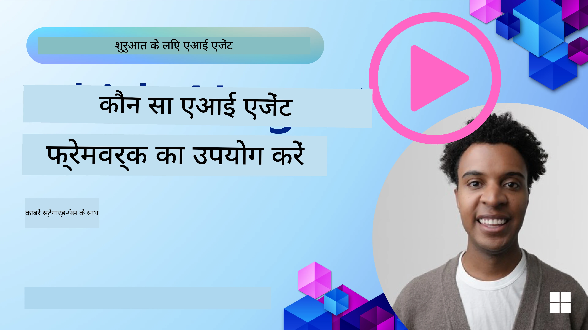

<!--
CO_OP_TRANSLATOR_METADATA:
{
  "original_hash": "7120197753abacc827b64ac2d5d6966f",
  "translation_date": "2025-11-13T11:39:37+00:00",
  "source_file": "02-explore-agentic-frameworks/README.md",
  "language_code": "hi"
}
-->
[](https://youtu.be/ODwF-EZo_O8?si=1xoy_B9RNQfrYdF7)

> _(इस पाठ का वीडियो देखने के लिए ऊपर दी गई छवि पर क्लिक करें)_

# AI एजेंट फ्रेमवर्क्स का अन्वेषण

AI एजेंट फ्रेमवर्क्स सॉफ़्टवेयर प्लेटफ़ॉर्म हैं जो AI एजेंट्स को बनाने, तैनात करने और प्रबंधित करने की प्रक्रिया को सरल बनाते हैं। ये फ्रेमवर्क्स डेवलपर्स को पहले से निर्मित घटक, अमूर्तता और उपकरण प्रदान करते हैं जो जटिल AI सिस्टम के विकास को सुव्यवस्थित करते हैं।

ये फ्रेमवर्क्स डेवलपर्स को AI एजेंट विकास में सामान्य चुनौतियों के लिए मानकीकृत दृष्टिकोण प्रदान करके उनके अनुप्रयोगों के अनूठे पहलुओं पर ध्यान केंद्रित करने में मदद करते हैं। वे AI सिस्टम बनाने में स्केलेबिलिटी, पहुंच और दक्षता को बढ़ाते हैं।

## परिचय 

इस पाठ में शामिल होगा:

- AI एजेंट फ्रेमवर्क्स क्या हैं और वे डेवलपर्स को क्या हासिल करने में सक्षम बनाते हैं?
- टीमें इनका उपयोग कैसे कर सकती हैं अपने एजेंट की क्षमताओं को जल्दी प्रोटोटाइप, पुनरावृत्त और सुधारने के लिए?
- Microsoft द्वारा बनाए गए <a href="https://aka.ms/ai-agents/autogen" target="_blank">AutoGen</a>, <a href="https://aka.ms/ai-agents-beginners/semantic-kernel" target="_blank">Semantic Kernel</a>, और <a href="https://aka.ms/ai-agents-beginners/ai-agent-service" target="_blank">Azure AI Agent Service</a> फ्रेमवर्क्स और टूल्स के बीच क्या अंतर हैं?
- क्या मैं अपने मौजूदा Azure इकोसिस्टम टूल्स को सीधे एकीकृत कर सकता हूं, या मुझे अलग समाधान चाहिए?
- Azure AI Agents सेवा क्या है और यह मेरी कैसे मदद कर रही है?

## सीखने के लक्ष्य

इस पाठ के लक्ष्य हैं:

- AI विकास में AI एजेंट फ्रेमवर्क्स की भूमिका को समझना।
- AI एजेंट फ्रेमवर्क्स का उपयोग करके बुद्धिमान एजेंट्स बनाना।
- AI एजेंट फ्रेमवर्क्स द्वारा सक्षम की गई प्रमुख क्षमताओं को समझना।
- AutoGen, Semantic Kernel, और Azure AI Agent Service के बीच के अंतर को समझना।

## AI एजेंट फ्रेमवर्क्स क्या हैं और वे डेवलपर्स को क्या करने में सक्षम बनाते हैं?

पारंपरिक AI फ्रेमवर्क्स आपके ऐप्स में AI को एकीकृत करने और इन ऐप्स को निम्नलिखित तरीकों से बेहतर बनाने में मदद कर सकते हैं:

- **पर्सनलाइजेशन**: AI उपयोगकर्ता व्यवहार और प्राथमिकताओं का विश्लेषण कर व्यक्तिगत अनुशंसाएं, सामग्री और अनुभव प्रदान कर सकता है।  
उदाहरण: Netflix जैसे स्ट्रीमिंग सेवाएं AI का उपयोग करके देखने के इतिहास के आधार पर फिल्में और शो सुझाती हैं, जिससे उपयोगकर्ता की भागीदारी और संतुष्टि बढ़ती है।  
- **स्वचालन और दक्षता**: AI दोहराए जाने वाले कार्यों को स्वचालित कर सकता है, वर्कफ़्लो को सुव्यवस्थित कर सकता है, और परिचालन दक्षता में सुधार कर सकता है।  
उदाहरण: ग्राहक सेवा ऐप्स AI-संचालित चैटबॉट्स का उपयोग सामान्य पूछताछ को संभालने के लिए करते हैं, प्रतिक्रिया समय को कम करते हैं और मानव एजेंटों को अधिक जटिल मुद्दों के लिए मुक्त करते हैं।  
- **उन्नत उपयोगकर्ता अनुभव**: AI वॉयस रिकग्निशन, प्राकृतिक भाषा प्रसंस्करण, और प्रेडिक्टिव टेक्स्ट जैसी बुद्धिमान सुविधाएं प्रदान करके समग्र उपयोगकर्ता अनुभव में सुधार कर सकता है।  
उदाहरण: Siri और Google Assistant जैसे वर्चुअल असिस्टेंट्स AI का उपयोग करके वॉयस कमांड को समझते और प्रतिक्रिया देते हैं, जिससे उपयोगकर्ताओं के लिए अपने उपकरणों के साथ बातचीत करना आसान हो जाता है।

### यह सब बहुत अच्छा लगता है, तो फिर हमें AI एजेंट फ्रेमवर्क की आवश्यकता क्यों है?

AI एजेंट फ्रेमवर्क्स केवल AI फ्रेमवर्क्स से अधिक का प्रतिनिधित्व करते हैं। इन्हें ऐसे बुद्धिमान एजेंट्स बनाने के लिए डिज़ाइन किया गया है जो उपयोगकर्ताओं, अन्य एजेंट्स और पर्यावरण के साथ बातचीत कर सकते हैं और विशिष्ट लक्ष्यों को प्राप्त कर सकते हैं। ये एजेंट्स स्वायत्त व्यवहार प्रदर्शित कर सकते हैं, निर्णय ले सकते हैं, और बदलती परिस्थितियों के अनुकूल हो सकते हैं। आइए AI एजेंट फ्रेमवर्क्स द्वारा सक्षम की गई कुछ प्रमुख क्षमताओं पर नज़र डालें:

- **एजेंट सहयोग और समन्वय**: कई AI एजेंट्स बनाने में सक्षम बनाना जो एक साथ काम कर सकते हैं, संवाद कर सकते हैं, और जटिल कार्यों को हल करने के लिए समन्वय कर सकते हैं।  
- **कार्य स्वचालन और प्रबंधन**: मल्टी-स्टेप वर्कफ़्लो, कार्य प्रतिनिधि, और एजेंट्स के बीच गतिशील कार्य प्रबंधन के लिए तंत्र प्रदान करना।  
- **संदर्भात्मक समझ और अनुकूलन**: एजेंट्स को संदर्भ समझने, बदलते परिवेश के अनुकूल होने, और वास्तविक समय की जानकारी के आधार पर निर्णय लेने की क्षमता प्रदान करना।  

संक्षेप में, एजेंट्स आपको अधिक करने की अनुमति देते हैं, स्वचालन को अगले स्तर तक ले जाते हैं, और अधिक बुद्धिमान सिस्टम बनाते हैं जो अपने पर्यावरण से सीख सकते हैं और अनुकूल हो सकते हैं।

## एजेंट की क्षमताओं को जल्दी प्रोटोटाइप, पुनरावृत्त और सुधारने के तरीके?

यह एक तेजी से बदलता हुआ क्षेत्र है, लेकिन अधिकांश AI एजेंट फ्रेमवर्क्स में कुछ सामान्य चीजें होती हैं जो आपको जल्दी प्रोटोटाइप और पुनरावृत्त करने में मदद कर सकती हैं, जैसे मॉड्यूल घटक, सहयोगी उपकरण, और वास्तविक समय में सीखना। आइए इनमें गहराई से जाएं:

- **मॉड्यूल घटकों का उपयोग करें**: AI SDKs पहले से निर्मित घटक प्रदान करते हैं जैसे AI और मेमोरी कनेक्टर्स, प्राकृतिक भाषा या कोड प्लगइन्स का उपयोग करके फ़ंक्शन कॉलिंग, प्रॉम्प्ट टेम्पलेट्स, और अधिक।  
- **सहयोगी उपकरणों का लाभ उठाएं**: विशिष्ट भूमिकाओं और कार्यों के साथ एजेंट्स डिज़ाइन करें, जिससे सहयोगी वर्कफ़्लो का परीक्षण और सुधार किया जा सके।  
- **वास्तविक समय में सीखें**: फीडबैक लूप्स लागू करें जहां एजेंट्स इंटरैक्शन से सीखते हैं और अपने व्यवहार को गतिशील रूप से समायोजित करते हैं।  

### मॉड्यूल घटकों का उपयोग करें

Microsoft Semantic Kernel और LangChain जैसे SDKs पहले से निर्मित घटक प्रदान करते हैं जैसे AI कनेक्टर्स, प्रॉम्प्ट टेम्पलेट्स, और मेमोरी प्रबंधन।

**टीमें इनका उपयोग कैसे कर सकती हैं**: टीमें इन घटकों को जल्दी से इकट्ठा कर एक कार्यात्मक प्रोटोटाइप बना सकती हैं, जिससे शुरुआत से निर्माण करने की आवश्यकता नहीं होती और तेजी से प्रयोग और पुनरावृत्ति की अनुमति मिलती है।

**यह व्यवहार में कैसे काम करता है**: आप उपयोगकर्ता इनपुट से जानकारी निकालने के लिए एक प्री-बिल्ट पार्सर, डेटा स्टोर और पुनर्प्राप्त करने के लिए एक मेमोरी मॉड्यूल, और उपयोगकर्ताओं के साथ बातचीत करने के लिए एक प्रॉम्प्ट जनरेटर का उपयोग कर सकते हैं, वह भी बिना इन घटकों को शुरुआत से बनाने की आवश्यकता के।

**उदाहरण कोड**. आइए देखें कि आप Semantic Kernel Python और .Net के साथ प्री-बिल्ट AI कनेक्टर का उपयोग कैसे कर सकते हैं जो उपयोगकर्ता इनपुट का जवाब देने के लिए ऑटो-फ़ंक्शन कॉलिंग का उपयोग करता है:

``` python
# Semantic Kernel Python Example

import asyncio
from typing import Annotated

from semantic_kernel.connectors.ai import FunctionChoiceBehavior
from semantic_kernel.connectors.ai.open_ai import AzureChatCompletion, AzureChatPromptExecutionSettings
from semantic_kernel.contents import ChatHistory
from semantic_kernel.functions import kernel_function
from semantic_kernel.kernel import Kernel

# Define a ChatHistory object to hold the conversation's context
chat_history = ChatHistory()
chat_history.add_user_message("I'd like to go to New York on January 1, 2025")


# Define a sample plugin that contains the function to book travel
class BookTravelPlugin:
    """A Sample Book Travel Plugin"""

    @kernel_function(name="book_flight", description="Book travel given location and date")
    async def book_flight(
        self, date: Annotated[str, "The date of travel"], location: Annotated[str, "The location to travel to"]
    ) -> str:
        return f"Travel was booked to {location} on {date}"

# Create the Kernel
kernel = Kernel()

# Add the sample plugin to the Kernel object
kernel.add_plugin(BookTravelPlugin(), plugin_name="book_travel")

# Define the Azure OpenAI AI Connector
chat_service = AzureChatCompletion(
    deployment_name="YOUR_DEPLOYMENT_NAME", 
    api_key="YOUR_API_KEY", 
    endpoint="https://<your-resource>.azure.openai.com/",
)

# Define the request settings to configure the model with auto-function calling
request_settings = AzureChatPromptExecutionSettings(function_choice_behavior=FunctionChoiceBehavior.Auto())


async def main():
    # Make the request to the model for the given chat history and request settings
    # The Kernel contains the sample that the model will request to invoke
    response = await chat_service.get_chat_message_content(
        chat_history=chat_history, settings=request_settings, kernel=kernel
    )
    assert response is not None

    """
    Note: In the auto function calling process, the model determines it can invoke the 
    `BookTravelPlugin` using the `book_flight` function, supplying the necessary arguments. 
    
    For example:

    "tool_calls": [
        {
            "id": "call_abc123",
            "type": "function",
            "function": {
                "name": "BookTravelPlugin-book_flight",
                "arguments": "{'location': 'New York', 'date': '2025-01-01'}"
            }
        }
    ]

    Since the location and date arguments are required (as defined by the kernel function), if the 
    model lacks either, it will prompt the user to provide them. For instance:

    User: Book me a flight to New York.
    Model: Sure, I'd love to help you book a flight. Could you please specify the date?
    User: I want to travel on January 1, 2025.
    Model: Your flight to New York on January 1, 2025, has been successfully booked. Safe travels!
    """

    print(f"`{response}`")
    # Example AI Model Response: `Your flight to New York on January 1, 2025, has been successfully booked. Safe travels! ✈️🗽`

    # Add the model's response to our chat history context
    chat_history.add_assistant_message(response.content)


if __name__ == "__main__":
    asyncio.run(main())
```
```csharp
// Semantic Kernel C# example

using Microsoft.SemanticKernel;
using Microsoft.SemanticKernel.ChatCompletion;
using System.ComponentModel;
using Microsoft.SemanticKernel.Connectors.AzureOpenAI;

ChatHistory chatHistory = [];
chatHistory.AddUserMessage("I'd like to go to New York on January 1, 2025");

var kernelBuilder = Kernel.CreateBuilder();
kernelBuilder.AddAzureOpenAIChatCompletion(
    deploymentName: "NAME_OF_YOUR_DEPLOYMENT",
    apiKey: "YOUR_API_KEY",
    endpoint: "YOUR_AZURE_ENDPOINT"
);
kernelBuilder.Plugins.AddFromType<BookTravelPlugin>("BookTravel"); 
var kernel = kernelBuilder.Build();

var settings = new AzureOpenAIPromptExecutionSettings()
{
    FunctionChoiceBehavior = FunctionChoiceBehavior.Auto()
};

var chatCompletion = kernel.GetRequiredService<IChatCompletionService>();

var response = await chatCompletion.GetChatMessageContentAsync(chatHistory, settings, kernel);

/*
Behind the scenes, the model recognizes the tool to call, what arguments it already has (location) and (date)
{

"tool_calls": [
    {
        "id": "call_abc123",
        "type": "function",
        "function": {
            "name": "BookTravelPlugin-book_flight",
            "arguments": "{'location': 'New York', 'date': '2025-01-01'}"
        }
    }
]
*/

Console.WriteLine(response.Content);
chatHistory.AddMessage(response!.Role, response!.Content!);

// Example AI Model Response: Your flight to New York on January 1, 2025, has been successfully booked. Safe travels! ✈️🗽

// Define a plugin that contains the function to book travel
public class BookTravelPlugin
{
    [KernelFunction("book_flight")]
    [Description("Book travel given location and date")]
    public async Task<string> BookFlight(DateTime date, string location)
    {
        return await Task.FromResult( $"Travel was booked to {location} on {date}");
    }
}
```

इस उदाहरण से आप देख सकते हैं कि कैसे आप उपयोगकर्ता इनपुट से मुख्य जानकारी निकालने के लिए एक प्री-बिल्ट पार्सर का उपयोग कर सकते हैं, जैसे उड़ान बुकिंग अनुरोध की उत्पत्ति, गंतव्य, और तारीख। यह मॉड्यूल दृष्टिकोण आपको उच्च-स्तरीय तर्क पर ध्यान केंद्रित करने की अनुमति देता है।

### सहयोगी उपकरणों का लाभ उठाएं

CrewAI, Microsoft AutoGen, और Semantic Kernel जैसे फ्रेमवर्क्स कई एजेंट्स बनाने की सुविधा प्रदान करते हैं जो एक साथ काम कर सकते हैं।

**टीमें इनका उपयोग कैसे कर सकती हैं**: टीमें विशिष्ट भूमिकाओं और कार्यों के साथ एजेंट्स डिज़ाइन कर सकती हैं, जिससे सहयोगी वर्कफ़्लो का परीक्षण और सुधार किया जा सके और समग्र सिस्टम दक्षता में सुधार किया जा सके।

**यह व्यवहार में कैसे काम करता है**: आप एजेंट्स की एक टीम बना सकते हैं जहां प्रत्येक एजेंट का एक विशेष कार्य होता है, जैसे डेटा पुनर्प्राप्ति, विश्लेषण, या निर्णय लेना। ये एजेंट्स संवाद कर सकते हैं और जानकारी साझा कर सकते हैं ताकि उपयोगकर्ता की क्वेरी का उत्तर देने या कार्य पूरा करने जैसे सामान्य लक्ष्य को प्राप्त किया जा सके।

**उदाहरण कोड (AutoGen)**:

```python
# creating agents, then create a round robin schedule where they can work together, in this case in order

# Data Retrieval Agent
# Data Analysis Agent
# Decision Making Agent

agent_retrieve = AssistantAgent(
    name="dataretrieval",
    model_client=model_client,
    tools=[retrieve_tool],
    system_message="Use tools to solve tasks."
)

agent_analyze = AssistantAgent(
    name="dataanalysis",
    model_client=model_client,
    tools=[analyze_tool],
    system_message="Use tools to solve tasks."
)

# conversation ends when user says "APPROVE"
termination = TextMentionTermination("APPROVE")

user_proxy = UserProxyAgent("user_proxy", input_func=input)

team = RoundRobinGroupChat([agent_retrieve, agent_analyze, user_proxy], termination_condition=termination)

stream = team.run_stream(task="Analyze data", max_turns=10)
# Use asyncio.run(...) when running in a script.
await Console(stream)
```

पिछले कोड में आप देख सकते हैं कि कैसे आप एक कार्य बना सकते हैं जिसमें कई एजेंट्स डेटा का विश्लेषण करने के लिए एक साथ काम करते हैं। प्रत्येक एजेंट एक विशिष्ट कार्य करता है, और कार्य को एजेंट्स को समन्वयित करके वांछित परिणाम प्राप्त करने के लिए निष्पादित किया जाता है। समर्पित एजेंट्स के साथ विशेष भूमिकाओं को बनाकर, आप कार्य दक्षता और प्रदर्शन में सुधार कर सकते हैं।

### वास्तविक समय में सीखें

उन्नत फ्रेमवर्क्स वास्तविक समय संदर्भ समझ और अनुकूलन के लिए क्षमताएं प्रदान करते हैं।

**टीमें इनका उपयोग कैसे कर सकती हैं**: टीमें फीडबैक लूप्स लागू कर सकती हैं जहां एजेंट्स इंटरैक्शन से सीखते हैं और अपने व्यवहार को गतिशील रूप से समायोजित करते हैं, जिससे क्षमताओं में निरंतर सुधार और परिष्करण होता है।

**यह व्यवहार में कैसे काम करता है**: एजेंट्स उपयोगकर्ता फीडबैक, पर्यावरणीय डेटा, और कार्य परिणामों का विश्लेषण कर सकते हैं ताकि अपने ज्ञान आधार को अपडेट कर सकें, निर्णय लेने वाले एल्गोरिदम को समायोजित कर सकें, और समय के साथ प्रदर्शन में सुधार कर सकें। यह पुनरावृत्त सीखने की प्रक्रिया एजेंट्स को बदलती परिस्थितियों और उपयोगकर्ता प्राथमिकताओं के अनुकूल होने में सक्षम बनाती है, जिससे समग्र सिस्टम प्रभावशीलता बढ़ती है।

## AutoGen, Semantic Kernel और Azure AI Agent Service फ्रेमवर्क्स के बीच क्या अंतर हैं?

इन फ्रेमवर्क्स की तुलना करने के कई तरीके हैं, लेकिन आइए उनके डिज़ाइन, क्षमताओं, और लक्षित उपयोग मामलों के संदर्भ में कुछ प्रमुख अंतर देखें:

## AutoGen

AutoGen Microsoft Research के AI Frontiers Lab द्वारा विकसित एक ओपन-सोर्स फ्रेमवर्क है। यह इवेंट-ड्रिवन, वितरित *एजेंटिक* अनुप्रयोगों पर केंद्रित है, जो कई LLMs और SLMs, टूल्स, और उन्नत मल्टी-एजेंट डिज़ाइन पैटर्न को सक्षम बनाता है।

AutoGen एजेंट्स के मुख्य विचार के इर्द-गिर्द बनाया गया है, जो स्वायत्त संस्थाएं हैं जो अपने पर्यावरण को समझ सकती हैं, निर्णय ले सकती हैं, और विशिष्ट लक्ष्यों को प्राप्त करने के लिए कार्रवाई कर सकती हैं। एजेंट्स असिंक्रोनस संदेशों के माध्यम से संवाद करते हैं, जिससे वे स्वतंत्र रूप से और समानांतर में काम कर सकते हैं, सिस्टम स्केलेबिलिटी और उत्तरदायित्व को बढ़ाते हैं।

<a href="https://en.wikipedia.org/wiki/Actor_model" target="_blank">एजेंट्स अभिनेता मॉडल पर आधारित हैं</a>. Wikipedia के अनुसार, एक अभिनेता _समानांतर गणना का मूल निर्माण खंड है। प्राप्त संदेश के जवाब में, एक अभिनेता स्थानीय निर्णय ले सकता है, अधिक अभिनेताओं को बना सकता है, अधिक संदेश भेज सकता है, और प्राप्त अगले संदेश का जवाब देने का तरीका निर्धारित कर सकता है_।

**उपयोग के मामले**: कोड जनरेशन, डेटा विश्लेषण कार्यों को स्वचालित करना, और योजना और अनुसंधान कार्यों के लिए कस्टम एजेंट्स बनाना।

AutoGen के कुछ महत्वपूर्ण मुख्य विचार निम्नलिखित हैं:

- **एजेंट्स**. एक एजेंट एक सॉफ़्टवेयर इकाई है जो:
  - **संदेशों के माध्यम से संवाद करता है**, ये संदेश सिंक्रोनस या असिंक्रोनस हो सकते हैं।  
  - **अपनी स्थिति बनाए रखता है**, जिसे आने वाले संदेशों द्वारा संशोधित किया जा सकता है।  
  - **कार्रवाई करता है** प्राप्त संदेशों या उसकी स्थिति में बदलाव के जवाब में। ये कार्रवाइयाँ एजेंट की स्थिति को संशोधित कर सकती हैं और बाहरी प्रभाव उत्पन्न कर सकती हैं, जैसे संदेश लॉग को अपडेट करना, नए संदेश भेजना, कोड निष्पादित करना, या API कॉल करना।  

  यहाँ एक छोटा कोड स्निपेट है जिसमें आप चैट क्षमताओं के साथ अपना एजेंट बनाते हैं:

    ```python
    from autogen_agentchat.agents import AssistantAgent
    from autogen_agentchat.messages import TextMessage
    from autogen_ext.models.openai import OpenAIChatCompletionClient


    class MyAgent(RoutedAgent):
        def __init__(self, name: str) -> None:
            super().__init__(name)
            model_client = OpenAIChatCompletionClient(model="gpt-4o")
            self._delegate = AssistantAgent(name, model_client=model_client)
    
        @message_handler
        async def handle_my_message_type(self, message: MyMessageType, ctx: MessageContext) -> None:
            print(f"{self.id.type} received message: {message.content}")
            response = await self._delegate.on_messages(
                [TextMessage(content=message.content, source="user")], ctx.cancellation_token
            )
            print(f"{self.id.type} responded: {response.chat_message.content}")
    ```
    
    पिछले कोड में, `MyAgent` बनाया गया है और `RoutedAgent` से विरासत में लिया गया है। इसमें एक संदेश हैंडलर है जो संदेश की सामग्री को प्रिंट करता है और फिर `AssistantAgent` डेलीगेट का उपयोग करके प्रतिक्रिया भेजता है। विशेष रूप से ध्यान दें कि कैसे हम `self._delegate` को `AssistantAgent` की एक इंस्टेंस असाइन करते हैं जो एक प्री-बिल्ट एजेंट है जो चैट पूर्णताओं को संभाल सकता है।

    आइए AutoGen को इस एजेंट प्रकार के बारे में बताएं और प्रोग्राम शुरू करें:

    ```python
    
    # main.py
    runtime = SingleThreadedAgentRuntime()
    await MyAgent.register(runtime, "my_agent", lambda: MyAgent())

    runtime.start()  # Start processing messages in the background.
    await runtime.send_message(MyMessageType("Hello, World!"), AgentId("my_agent", "default"))
    ```

    पिछले कोड में एजेंट्स को रनटाइम के साथ पंजीकृत किया गया है और फिर एजेंट को एक संदेश भेजा गया है जिसके परिणामस्वरूप निम्नलिखित आउटपुट प्राप्त होता है:

    ```text
    # Output from the console:
    my_agent received message: Hello, World!
    my_assistant received message: Hello, World!
    my_assistant responded: Hello! How can I assist you today?
    ```

- **मल्टी एजेंट्स**. AutoGen कई एजेंट्स बनाने का समर्थन करता है जो जटिल कार्यों को प्राप्त करने के लिए एक साथ काम कर सकते हैं। एजेंट्स संवाद कर सकते हैं, जानकारी साझा कर सकते हैं, और समस्याओं को अधिक कुशलता से हल करने के लिए अपने कार्यों का समन्वय कर सकते हैं। मल्टी-एजेंट सिस्टम बनाने के लिए, आप विभिन्न प्रकार के एजेंट्स को परिभाषित कर सकते हैं जिनके पास विशेष कार्य और भूमिकाएँ होती हैं, जैसे डेटा पुनर्प्राप्ति, विश्लेषण, निर्णय लेना, और उपयोगकर्ता इंटरैक्शन। आइए देखें कि ऐसा निर्माण कैसा दिखता है ताकि हमें इसका अंदाजा हो सके:

    ```python
    editor_description = "Editor for planning and reviewing the content."

    # Example of declaring an Agent
    editor_agent_type = await EditorAgent.register(
    runtime,
    editor_topic_type,  # Using topic type as the agent type.
    lambda: EditorAgent(
        description=editor_description,
        group_chat_topic_type=group_chat_topic_type,
        model_client=OpenAIChatCompletionClient(
            model="gpt-4o-2024-08-06",
            # api_key="YOUR_API_KEY",
        ),
        ),
    )

    # remaining declarations shortened for brevity

    # Group chat
    group_chat_manager_type = await GroupChatManager.register(
    runtime,
    "group_chat_manager",
    lambda: GroupChatManager(
        participant_topic_types=[writer_topic_type, illustrator_topic_type, editor_topic_type, user_topic_type],
        model_client=OpenAIChatCompletionClient(
            model="gpt-4o-2024-08-06",
            # api_key="YOUR_API_KEY",
        ),
        participant_descriptions=[
            writer_description, 
            illustrator_description, 
            editor_description, 
            user_description
        ],
        ),
    )
    ```

    पिछले कोड में हमारे पास एक `GroupChatManager` है जिसे रनटाइम के साथ पंजीकृत किया गया है। यह मैनेजर विभिन्न प्रकार के एजेंट्स, जैसे लेखक, चित्रकार, संपादक, और उपयोगकर्ताओं के बीच इंटरैक्शन को समन्वयित करने के लिए जिम्मेदार है।

- **एजेंट रनटाइम**. फ्रेमवर्क एक रनटाइम वातावरण प्रदान करता है, जो एजेंट्स के बीच संचार को सक्षम बनाता है, उनकी पहचान और जीवनचक्र का प्रबंधन करता है, और सुरक्षा और गोपनीयता सीमाओं को लागू करता है। इसका मतलब है कि आप अपने एजेंट्स को एक सुरक्षित और नियंत्रित वातावरण में चला सकते हैं, यह सुनिश्चित करते हुए कि वे सुरक्षित और कुशलता से बातचीत कर सकते हैं। यहाँ दो रुचिकर रनटाइम्स हैं:
  - **स्टैंड-अलोन रनटाइम**. यह एकल-प्रोसेस अनुप्रयोगों के लिए एक अच्छा विकल्प है जहां सभी एजेंट्स एक ही प्रोग्रामिंग भाषा में लागू किए गए हैं और एक ही प्रक्रिया में चलते हैं। इसका काम करने का तरीका इस प्रकार है:
  
    <a href="https://microsoft.github.io/autogen/stable/_images/architecture-standalone.svg" target="_blank">स्टैंड-अलोन रनटाइम</a>   
एप्लिकेशन स्टैक

    *एजेंट्स रनटाइम के माध्यम से संदेशों के माध्यम से संवाद करते हैं, और रनटाइम एजेंट्स के जीवनचक्र का प्रबंधन करता है*

  - **वितरित एजेंट रनटाइम**, मल्टी-प्रोसेस अनुप्रयोगों के लिए उपयुक्त है जहां एजेंट्स विभिन्न प्रोग्रामिंग भाषाओं में लागू किए जा सकते हैं और विभिन्न मशीनों पर चल सकते हैं। इसका काम करने का तरीका इस प्रकार है:
  
    <a href="https://microsoft.github.io/autogen/stable/_images/architecture-distributed.svg" target="_blank">वितरित रनटाइम</a>

## Semantic Kernel + Agent Framework

Semantic Kernel एक एंटरप्राइज़-रेडी AI ऑर्केस्ट्रेशन SDK है। इसमें AI और मेमोरी कनेक्टर्स के साथ एक एजेंट फ्रेमवर्क शामिल है।

आइए पहले कुछ मुख्य घटकों को कवर करें:

- **AI कनेक्टर्स**: यह बाहरी AI सेवाओं और डेटा स्रोतों के साथ इंटरफ़ेस है जो Python और C# दोनों में उपयोग के लिए है।

  ```python
  # Semantic Kernel Python
  from semantic_kernel.connectors.ai.open_ai import AzureChatCompletion
  from semantic_kernel.kernel import Kernel

  kernel = Kernel()
  kernel.add_service(
    AzureChatCompletion(
        deployment_name="your-deployment-name",
        api_key="your-api-key",
        endpoint="your-endpoint",
    )
  )
  ```  

    ```csharp
    // Semantic Kernel C#
    using Microsoft.SemanticKernel;

    // Create kernel
    var builder = Kernel.CreateBuilder();
    
    // Add a chat completion service:
    builder.Services.AddAzureOpenAIChatCompletion(
        "your-resource-name",
        "your-endpoint",
        "your-resource-key",
        "deployment-model");
    var kernel = builder.Build();
    ```

    यहाँ आपके पास एक सरल उदाहरण है कि आप एक कर्नेल कैसे बना सकते हैं और एक चैट पूर्णता सेवा जोड़ सकते हैं। Semantic Kernel एक बाहरी AI सेवा के साथ एक कनेक्शन बनाता है, इस मामले में Azure OpenAI Chat Completion।

- **प्लगइन्स**: ये उन कार्यों को समाहित करते हैं जिन्हें कोई एप्लिकेशन उपयोग कर सकता है। यहाँ रेडीमेड प्लगइन्स और कस्टम प्लगइन्स दोनों हैं जिन्हें आप बना सकते हैं। एक संबंधित अवधारणा "प्रॉम्प्ट फंक्शन्स" है। प्राकृतिक भाषा संकेत प्रदान करने के बजाय, आप मॉडल को कुछ कार्यों को प्रसारित करते हैं। वर्तमान चैट संदर्भ के आधार पर, मॉडल इन कार्यों में से एक को कॉल कर सकता है ताकि अनुरोध या क्वेरी को पूरा किया जा सके। यहाँ एक उदाहरण है:


ये तथ्य फिर मेमोरी संग्रह `SummarizedAzureDocs` में संग्रहीत किए जाते हैं। यह एक बहुत ही सरल उदाहरण है, लेकिन आप देख सकते हैं कि कैसे आप जानकारी को LLM के उपयोग के लिए मेमोरी में संग्रहीत कर सकते हैं।

तो यह था Semantic Kernel फ्रेमवर्क का मूल परिचय, अब Agent Framework के बारे में बात करते हैं।

## Azure AI Agent Service

Azure AI Agent Service हाल ही में Microsoft Ignite 2024 में पेश किया गया था। यह AI एजेंट्स को अधिक लचीले मॉडल्स के साथ विकसित और तैनात करने की अनुमति देता है, जैसे कि सीधे ओपन-सोर्स LLMs जैसे Llama 3, Mistral, और Cohere को कॉल करना।

Azure AI Agent Service मजबूत एंटरप्राइज सुरक्षा तंत्र और डेटा संग्रहण विधियां प्रदान करता है, जो इसे एंटरप्राइज एप्लिकेशन के लिए उपयुक्त बनाता है।

यह AutoGen और Semantic Kernel जैसे मल्टी-एजेंट ऑर्केस्ट्रेशन फ्रेमवर्क्स के साथ तुरंत काम करता है।

यह सेवा वर्तमान में Public Preview में है और एजेंट्स बनाने के लिए Python और C# का समर्थन करती है।

Semantic Kernel Python का उपयोग करके, हम एक यूजर-डिफाइंड प्लगइन के साथ Azure AI Agent बना सकते हैं:

```python
import asyncio
from typing import Annotated

from azure.identity.aio import DefaultAzureCredential

from semantic_kernel.agents import AzureAIAgent, AzureAIAgentSettings, AzureAIAgentThread
from semantic_kernel.contents import ChatMessageContent
from semantic_kernel.contents import AuthorRole
from semantic_kernel.functions import kernel_function


# Define a sample plugin for the sample
class MenuPlugin:
    """A sample Menu Plugin used for the concept sample."""

    @kernel_function(description="Provides a list of specials from the menu.")
    def get_specials(self) -> Annotated[str, "Returns the specials from the menu."]:
        return """
        Special Soup: Clam Chowder
        Special Salad: Cobb Salad
        Special Drink: Chai Tea
        """

    @kernel_function(description="Provides the price of the requested menu item.")
    def get_item_price(
        self, menu_item: Annotated[str, "The name of the menu item."]
    ) -> Annotated[str, "Returns the price of the menu item."]:
        return "$9.99"


async def main() -> None:
    ai_agent_settings = AzureAIAgentSettings.create()

    async with (
        DefaultAzureCredential() as creds,
        AzureAIAgent.create_client(
            credential=creds,
            conn_str=ai_agent_settings.project_connection_string.get_secret_value(),
        ) as client,
    ):
        # Create agent definition
        agent_definition = await client.agents.create_agent(
            model=ai_agent_settings.model_deployment_name,
            name="Host",
            instructions="Answer questions about the menu.",
        )

        # Create the AzureAI Agent using the defined client and agent definition
        agent = AzureAIAgent(
            client=client,
            definition=agent_definition,
            plugins=[MenuPlugin()],
        )

        # Create a thread to hold the conversation
        # If no thread is provided, a new thread will be
        # created and returned with the initial response
        thread: AzureAIAgentThread | None = None

        user_inputs = [
            "Hello",
            "What is the special soup?",
            "How much does that cost?",
            "Thank you",
        ]

        try:
            for user_input in user_inputs:
                print(f"# User: '{user_input}'")
                # Invoke the agent for the specified thread
                response = await agent.get_response(
                    messages=user_input,
                    thread_id=thread,
                )
                print(f"# {response.name}: {response.content}")
                thread = response.thread
        finally:
            await thread.delete() if thread else None
            await client.agents.delete_agent(agent.id)


if __name__ == "__main__":
    asyncio.run(main())
```

### मुख्य अवधारणाएँ

Azure AI Agent Service की निम्नलिखित मुख्य अवधारणाएँ हैं:

- **Agent**. Azure AI Agent Service Azure AI Foundry के साथ इंटीग्रेट करता है। AI Foundry के भीतर, एक AI Agent एक "स्मार्ट" माइक्रोसर्विस के रूप में कार्य करता है जिसे प्रश्नों का उत्तर देने (RAG), कार्य करने, या पूरी तरह से वर्कफ्लो को स्वचालित करने के लिए उपयोग किया जा सकता है। यह जनरेटिव AI मॉडल्स की शक्ति को वास्तविक दुनिया के डेटा स्रोतों तक पहुंचने और उनके साथ इंटरैक्ट करने वाले टूल्स के साथ जोड़कर इसे प्राप्त करता है। यहाँ एक एजेंट का उदाहरण है:

    ```python
    agent = project_client.agents.create_agent(
        model="gpt-4o-mini",
        name="my-agent",
        instructions="You are helpful agent",
        tools=code_interpreter.definitions,
        tool_resources=code_interpreter.resources,
    )
    ```

    इस उदाहरण में, एक एजेंट `gpt-4o-mini` मॉडल, नाम `my-agent`, और निर्देश `You are helpful agent` के साथ बनाया गया है। एजेंट को कोड व्याख्या कार्यों को करने के लिए टूल्स और संसाधनों से लैस किया गया है।

- **Thread और Messages**. थ्रेड एक और महत्वपूर्ण अवधारणा है। यह एक एजेंट और उपयोगकर्ता के बीच बातचीत या इंटरैक्शन का प्रतिनिधित्व करता है। थ्रेड्स का उपयोग बातचीत की प्रगति को ट्रैक करने, संदर्भ जानकारी संग्रहीत करने, और इंटरैक्शन की स्थिति को प्रबंधित करने के लिए किया जा सकता है। यहाँ एक थ्रेड का उदाहरण है:

    ```python
    thread = project_client.agents.create_thread()
    message = project_client.agents.create_message(
        thread_id=thread.id,
        role="user",
        content="Could you please create a bar chart for the operating profit using the following data and provide the file to me? Company A: $1.2 million, Company B: $2.5 million, Company C: $3.0 million, Company D: $1.8 million",
    )
    
    # Ask the agent to perform work on the thread
    run = project_client.agents.create_and_process_run(thread_id=thread.id, agent_id=agent.id)
    
    # Fetch and log all messages to see the agent's response
    messages = project_client.agents.list_messages(thread_id=thread.id)
    print(f"Messages: {messages}")
    ```

    पिछले कोड में, एक थ्रेड बनाया गया है। इसके बाद, थ्रेड को एक संदेश भेजा जाता है। `create_and_process_run` को कॉल करके, एजेंट को थ्रेड पर काम करने के लिए कहा जाता है। अंत में, संदेशों को प्राप्त किया जाता है और एजेंट की प्रतिक्रिया देखने के लिए लॉग किया जाता है। संदेश बातचीत की प्रगति को इंगित करते हैं जो उपयोगकर्ता और एजेंट के बीच हुई है। यह भी महत्वपूर्ण है कि संदेश विभिन्न प्रकार के हो सकते हैं जैसे टेक्स्ट, इमेज, या फाइल, जो एजेंट के काम का परिणाम हो सकता है जैसे कि एक इमेज या टेक्स्ट प्रतिक्रिया। एक डेवलपर के रूप में, आप इस जानकारी का उपयोग प्रतिक्रिया को आगे प्रोसेस करने या उपयोगकर्ता को प्रस्तुत करने के लिए कर सकते हैं।

- **अन्य AI फ्रेमवर्क्स के साथ इंटीग्रेट करता है**. Azure AI Agent Service अन्य फ्रेमवर्क्स जैसे AutoGen और Semantic Kernel के साथ इंटरैक्ट कर सकता है, जिसका मतलब है कि आप अपने ऐप का एक हिस्सा इनमें से किसी एक फ्रेमवर्क में बना सकते हैं और उदाहरण के लिए Agent Service का उपयोग ऑर्केस्ट्रेटर के रूप में कर सकते हैं या आप सब कुछ Agent Service में बना सकते हैं।

**उपयोग के मामले**: Azure AI Agent Service एंटरप्राइज एप्लिकेशन के लिए डिज़ाइन किया गया है जो सुरक्षित, स्केलेबल, और लचीले AI एजेंट तैनाती की आवश्यकता रखते हैं।

## इन फ्रेमवर्क्स में क्या अंतर है?

ऐसा लगता है कि इन फ्रेमवर्क्स में काफी ओवरलैप है, लेकिन उनके डिज़ाइन, क्षमताओं, और लक्षित उपयोग मामलों के संदर्भ में कुछ मुख्य अंतर हैं:

- **AutoGen**: यह मल्टी-एजेंट सिस्टम्स पर अग्रणी शोध के लिए एक प्रयोगात्मक फ्रेमवर्क है। यह जटिल मल्टी-एजेंट सिस्टम्स को प्रोटोटाइप और प्रयोग करने के लिए सबसे अच्छा स्थान है।
- **Semantic Kernel**: यह एंटरप्राइज एजेंटिक एप्लिकेशन बनाने के लिए प्रोडक्शन-रेडी एजेंट लाइब्रेरी है। यह इवेंट-ड्रिवन, वितरित एजेंटिक एप्लिकेशन पर केंद्रित है, जो कई LLMs और SLMs, टूल्स, और सिंगल/मल्टी-एजेंट डिज़ाइन पैटर्न को सक्षम करता है।
- **Azure AI Agent Service**: यह Azure Foundry में एजेंट्स के लिए एक प्लेटफॉर्म और तैनाती सेवा है। यह Azure Found द्वारा समर्थित सेवाओं जैसे Azure OpenAI, Azure AI Search, Bing Search और कोड निष्पादन के लिए कनेक्टिविटी बनाने की पेशकश करता है।

अभी भी तय नहीं कर पा रहे कि कौन सा चुनें?

### उपयोग के मामले

आइए कुछ सामान्य उपयोग मामलों के माध्यम से आपकी मदद करने की कोशिश करते हैं:

> प्रश्न: मैं प्रयोग कर रहा हूँ, सीख रहा हूँ और प्रूफ-ऑफ-कॉन्सेप्ट एजेंट एप्लिकेशन बना रहा हूँ, और मैं जल्दी से निर्माण और प्रयोग करना चाहता हूँ।

> उत्तर: AutoGen इस परिदृश्य के लिए एक अच्छा विकल्प होगा, क्योंकि यह इवेंट-ड्रिवन, वितरित एजेंटिक एप्लिकेशन पर केंद्रित है और उन्नत मल्टी-एजेंट डिज़ाइन पैटर्न का समर्थन करता है।

> प्रश्न: Semantic Kernel और Azure AI Agent Service की तुलना में AutoGen इस उपयोग मामले के लिए बेहतर विकल्प क्यों है?

> उत्तर: AutoGen विशेष रूप से इवेंट-ड्रिवन, वितरित एजेंटिक एप्लिकेशन के लिए डिज़ाइन किया गया है, जो कोड जनरेशन और डेटा विश्लेषण कार्यों को स्वचालित करने के लिए उपयुक्त है। यह जटिल मल्टी-एजेंट सिस्टम्स को कुशलतापूर्वक बनाने के लिए आवश्यक टूल्स और क्षमताएँ प्रदान करता है।

> प्रश्न: ऐसा लगता है कि Azure AI Agent Service यहाँ भी काम कर सकता है, इसमें कोड जनरेशन और अन्य टूल्स हैं?

> उत्तर: हाँ, Azure AI Agent Service एजेंट्स के लिए एक प्लेटफॉर्म सेवा है और इसमें कई मॉडल्स, Azure AI Search, Bing Search और Azure Functions के लिए बिल्ट-इन क्षमताएँ हैं। यह Foundry Portal में आपके एजेंट्स को बनाना और उन्हें बड़े पैमाने पर तैनात करना आसान बनाता है।

> प्रश्न: मैं अभी भी उलझन में हूँ, बस मुझे एक विकल्प दें।

> उत्तर: एक अच्छा विकल्प है कि आप पहले Semantic Kernel में अपना एप्लिकेशन बनाएं और फिर Azure AI Agent Service का उपयोग करके अपने एजेंट को तैनात करें। यह दृष्टिकोण आपको अपने एजेंट्स को आसानी से बनाए रखने की अनुमति देता है, जबकि Semantic Kernel में मल्टी-एजेंट सिस्टम्स बनाने की शक्ति का लाभ उठाता है। इसके अलावा, Semantic Kernel में AutoGen के लिए एक कनेक्टर है, जिससे दोनों फ्रेमवर्क्स को एक साथ उपयोग करना आसान हो जाता है।

आइए एक तालिका में मुख्य अंतर को संक्षेप में प्रस्तुत करें:

| फ्रेमवर्क | फोकस | मुख्य अवधारणाएँ | उपयोग के मामले |
| --- | --- | --- | --- |
| AutoGen | इवेंट-ड्रिवन, वितरित एजेंटिक एप्लिकेशन | एजेंट्स, पर्सनाज, फंक्शन्स, डेटा | कोड जनरेशन, डेटा विश्लेषण कार्य |
| Semantic Kernel | मानव-जैसे टेक्स्ट कंटेंट को समझना और जनरेट करना | एजेंट्स, मॉड्यूलर घटक, सहयोग | प्राकृतिक भाषा समझना, कंटेंट जनरेशन |
| Azure AI Agent Service | लचीले मॉडल्स, एंटरप्राइज सुरक्षा, कोड जनरेशन, टूल कॉलिंग | मॉड्यूलरिटी, सहयोग, प्रक्रिया ऑर्केस्ट्रेशन | सुरक्षित, स्केलेबल, और लचीले AI एजेंट तैनाती |

इन फ्रेमवर्क्स के लिए आदर्श उपयोग मामला क्या है?

## क्या मैं अपने मौजूदा Azure इकोसिस्टम टूल्स को सीधे इंटीग्रेट कर सकता हूँ, या मुझे स्टैंडअलोन समाधान चाहिए?

उत्तर है हाँ, आप अपने मौजूदा Azure इकोसिस्टम टूल्स को सीधे Azure AI Agent Service के साथ इंटीग्रेट कर सकते हैं, खासकर क्योंकि इसे अन्य Azure सेवाओं के साथ सहजता से काम करने के लिए बनाया गया है। उदाहरण के लिए, आप Bing, Azure AI Search, और Azure Functions को इंटीग्रेट कर सकते हैं। Azure AI Foundry के साथ भी गहरा इंटीग्रेशन है।

AutoGen और Semantic Kernel के लिए, आप Azure सेवाओं के साथ भी इंटीग्रेट कर सकते हैं, लेकिन इसके लिए आपको अपने कोड से Azure सेवाओं को कॉल करना पड़ सकता है। एक और तरीका है Azure SDKs का उपयोग करके अपने एजेंट्स से Azure सेवाओं के साथ इंटरैक्ट करना। इसके अलावा, जैसा कि उल्लेख किया गया है, आप AutoGen या Semantic Kernel में बनाए गए एजेंट्स के लिए ऑर्केस्ट्रेटर के रूप में Azure AI Agent Service का उपयोग कर सकते हैं, जो Azure इकोसिस्टम तक आसान पहुंच प्रदान करेगा।

## सैंपल कोड्स

- Python: [Agent Framework](./code_samples/02-python-agent-framework.ipynb)
- .NET: [Agent Framework](./code_samples/02-dotnet-agent-framework.md)

## AI Agent Frameworks के बारे में और सवाल हैं?

[Azure AI Foundry Discord](https://aka.ms/ai-agents/discord) से जुड़ें, अन्य शिक्षार्थियों से मिलें, ऑफिस आवर्स में भाग लें और अपने AI Agents से संबंधित सवालों के जवाब पाएं।

## संदर्भ

- <a href="https://techcommunity.microsoft.com/blog/azure-ai-services-blog/introducing-azure-ai-agent-service/4298357" target="_blank">Azure Agent Service</a>
- <a href="https://devblogs.microsoft.com/semantic-kernel/microsofts-agentic-ai-frameworks-autogen-and-semantic-kernel/" target="_blank">Semantic Kernel और AutoGen</a>
- <a href="https://learn.microsoft.com/semantic-kernel/frameworks/agent/?pivots=programming-language-python" target="_blank">Semantic Kernel Python Agent Framework</a>
- <a href="https://learn.microsoft.com/semantic-kernel/frameworks/agent/?pivots=programming-language-csharp" target="_blank">Semantic Kernel .Net Agent Framework</a>
- <a href="https://learn.microsoft.com/azure/ai-services/agents/overview" target="_blank">Azure AI Agent Service</a>
- <a href="https://techcommunity.microsoft.com/blog/educatordeveloperblog/using-azure-ai-agent-service-with-autogen--semantic-kernel-to-build-a-multi-agen/4363121" target="_blank">AutoGen / Semantic Kernel के साथ Azure AI Agent Service का उपयोग करके मल्टी-एजेंट समाधान बनाना</a>

## पिछला पाठ

[AI Agents और उनके उपयोग मामलों का परिचय](../01-intro-to-ai-agents/README.md)

## अगला पाठ

[Agentic डिज़ाइन पैटर्न को समझना](../03-agentic-design-patterns/README.md)

---

<!-- CO-OP TRANSLATOR DISCLAIMER START -->
**अस्वीकरण**:  
यह दस्तावेज़ AI अनुवाद सेवा [Co-op Translator](https://github.com/Azure/co-op-translator) का उपयोग करके अनुवादित किया गया है। जबकि हम सटीकता के लिए प्रयास करते हैं, कृपया ध्यान दें कि स्वचालित अनुवाद में त्रुटियां या अशुद्धियां हो सकती हैं। मूल भाषा में दस्तावेज़ को प्रामाणिक स्रोत माना जाना चाहिए। महत्वपूर्ण जानकारी के लिए, पेशेवर मानव अनुवाद की सिफारिश की जाती है। इस अनुवाद के उपयोग से उत्पन्न किसी भी गलतफहमी या गलत व्याख्या के लिए हम उत्तरदायी नहीं हैं।
<!-- CO-OP TRANSLATOR DISCLAIMER END -->