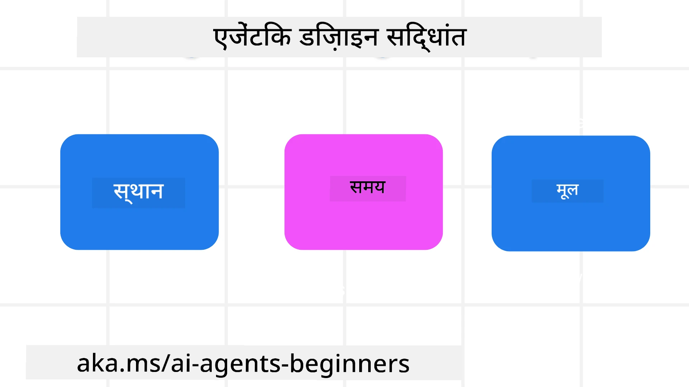

<!--
CO_OP_TRANSLATOR_METADATA:
{
  "original_hash": "d71524fe83a23829ae7a23b4031aaac8",
  "translation_date": "2025-11-13T11:41:31+00:00",
  "source_file": "03-agentic-design-patterns/README.md",
  "language_code": "hi"
}
-->

> _(इस पाठ का वीडियो देखने के लिए ऊपर दी गई छवि पर क्लिक करें)_
# AI एजेंटिक डिज़ाइन सिद्धांत

## परिचय

AI एजेंटिक सिस्टम बनाने के बारे में सोचने के कई तरीके हैं। चूंकि जनरेटिव AI डिज़ाइन में अस्पष्टता एक विशेषता है, बग नहीं, इसलिए इंजीनियरों के लिए यह तय करना कभी-कभी मुश्किल हो जाता है कि शुरुआत कहां से करें। हमने डेवलपर्स को ग्राहक-केंद्रित एजेंटिक सिस्टम बनाने में सक्षम बनाने के लिए मानव-केंद्रित UX डिज़ाइन सिद्धांतों का एक सेट तैयार किया है ताकि वे अपने व्यावसायिक आवश्यकताओं को हल कर सकें। ये डिज़ाइन सिद्धांत एक निर्धारित आर्किटेक्चर नहीं हैं, बल्कि उन टीमों के लिए एक प्रारंभिक बिंदु हैं जो एजेंट अनुभवों को परिभाषित और विकसित कर रही हैं।

सामान्य तौर पर, एजेंट को चाहिए:

- मानव क्षमताओं को विस्तृत और स्केल करें (ब्रेनस्टॉर्मिंग, समस्या समाधान, स्वचालन आदि)
- ज्ञान की खामियों को भरें (मुझे ज्ञान डोमेन, अनुवाद आदि पर अपडेट करें)
- सहयोग को सुविधाजनक बनाएं और समर्थन करें जिस तरह से हम व्यक्तिगत रूप से दूसरों के साथ काम करना पसंद करते हैं
- हमें अपने बेहतर संस्करण बनने में मदद करें (जैसे, जीवन कोच/कार्य मास्टर, हमें भावनात्मक नियंत्रण और माइंडफुलनेस कौशल सीखने में मदद करना, लचीलापन बनाना आदि)

## इस पाठ में शामिल होगा

- एजेंटिक डिज़ाइन सिद्धांत क्या हैं
- इन डिज़ाइन सिद्धांतों को लागू करते समय पालन करने के लिए कुछ दिशानिर्देश क्या हैं
- डिज़ाइन सिद्धांतों का उपयोग करने के कुछ उदाहरण क्या हैं

## सीखने के लक्ष्य

इस पाठ को पूरा करने के बाद, आप सक्षम होंगे:

1. समझा सकें कि एजेंटिक डिज़ाइन सिद्धांत क्या हैं
2. एजेंटिक डिज़ाइन सिद्धांतों का उपयोग करने के दिशानिर्देश समझा सकें
3. एजेंटिक डिज़ाइन सिद्धांतों का उपयोग करके एक एजेंट बनाना समझ सकें

## एजेंटिक डिज़ाइन सिद्धांत

### एजेंट (स्पेस)

यह वह वातावरण है जिसमें एजेंट कार्य करता है। ये सिद्धांत हमें भौतिक और डिजिटल दुनिया में एजेंट डिज़ाइन करने के तरीके के बारे में जानकारी देते हैं।

- **जोड़ना, न कि तोड़ना** – लोगों को अन्य लोगों, घटनाओं और क्रियात्मक ज्ञान से जोड़ने में मदद करें ताकि सहयोग और कनेक्शन सक्षम हो सके।
  - एजेंट घटनाओं, ज्ञान और लोगों को जोड़ने में मदद करते हैं।
  - एजेंट लोगों को करीब लाते हैं। उन्हें लोगों को बदलने या छोटा दिखाने के लिए डिज़ाइन नहीं किया गया है।
- **आसानी से सुलभ लेकिन कभी-कभी अदृश्य** – एजेंट मुख्य रूप से पृष्ठभूमि में कार्य करता है और केवल तब हमें संकेत देता है जब यह प्रासंगिक और उपयुक्त हो।
  - एजेंट किसी भी डिवाइस या प्लेटफ़ॉर्म पर अधिकृत उपयोगकर्ताओं के लिए आसानी से खोजने योग्य और सुलभ है।
  - एजेंट मल्टीमॉडल इनपुट और आउटपुट (ध्वनि, आवाज़, पाठ आदि) का समर्थन करता है।
  - एजेंट उपयोगकर्ता की आवश्यकताओं को समझते हुए अग्रभूमि और पृष्ठभूमि के बीच, सक्रिय और प्रतिक्रियाशील के बीच सहजता से संक्रमण कर सकता है।
  - एजेंट अदृश्य रूप में कार्य कर सकता है, फिर भी इसका पृष्ठभूमि प्रक्रिया पथ और अन्य एजेंटों के साथ सहयोग उपयोगकर्ता के लिए पारदर्शी और नियंत्रित करने योग्य है।

### एजेंट (समय)

यह एजेंट समय के साथ कैसे कार्य करता है, इसे दर्शाता है। ये सिद्धांत हमें अतीत, वर्तमान और भविष्य में एजेंट के इंटरैक्शन डिज़ाइन करने के तरीके के बारे में जानकारी देते हैं।

- **अतीत**: इतिहास पर विचार करना जिसमें स्थिति और संदर्भ दोनों शामिल हैं।
  - एजेंट केवल घटना, लोग, या स्थितियों से परे समृद्ध ऐतिहासिक डेटा के विश्लेषण के आधार पर अधिक प्रासंगिक परिणाम प्रदान करता है।
  - एजेंट अतीत की घटनाओं से कनेक्शन बनाता है और वर्तमान स्थितियों में शामिल होने के लिए सक्रिय रूप से स्मृति पर विचार करता है।
- **अब**: सूचित करने से अधिक संकेत देना।
  - एजेंट लोगों के साथ बातचीत करने के लिए एक व्यापक दृष्टिकोण अपनाता है। जब कोई घटना होती है, तो एजेंट स्थिर सूचना या अन्य स्थिर औपचारिकता से परे जाता है। एजेंट प्रवाह को सरल बना सकता है या उपयोगकर्ता का ध्यान सही समय पर निर्देशित करने के लिए गतिशील रूप से संकेत उत्पन्न कर सकता है।
  - एजेंट संदर्भात्मक वातावरण, सामाजिक और सांस्कृतिक परिवर्तनों के आधार पर और उपयोगकर्ता के इरादे के अनुसार जानकारी प्रदान करता है।
  - एजेंट का इंटरैक्शन क्रमिक हो सकता है, लंबे समय तक उपयोगकर्ताओं को सशक्त बनाने के लिए जटिलता में विकसित हो सकता है।
- **भविष्य**: अनुकूलन और विकास।
  - एजेंट विभिन्न उपकरणों, प्लेटफ़ॉर्म और तौर-तरीकों के लिए अनुकूल होता है।
  - एजेंट उपयोगकर्ता व्यवहार, पहुंच आवश्यकताओं के लिए अनुकूल होता है और स्वतंत्र रूप से अनुकूलन योग्य है।
  - एजेंट निरंतर उपयोगकर्ता इंटरैक्शन के माध्यम से आकार लेता है और विकसित होता है।

### एजेंट (कोर)

ये एजेंट के डिज़ाइन के मुख्य तत्व हैं।

- **अनिश्चितता को अपनाएं लेकिन विश्वास स्थापित करें**।
  - एजेंट की एक निश्चित स्तर की अनिश्चितता अपेक्षित है। अनिश्चितता एजेंट डिज़ाइन का एक प्रमुख तत्व है।
  - विश्वास और पारदर्शिता एजेंट डिज़ाइन की आधारभूत परतें हैं।
  - मनुष्य इस बात पर नियंत्रण में हैं कि एजेंट कब चालू/बंद है और एजेंट की स्थिति हर समय स्पष्ट रूप से दिखाई देती है।

## इन सिद्धांतों को लागू करने के दिशानिर्देश

जब आप पिछले डिज़ाइन सिद्धांतों का उपयोग कर रहे हों, तो निम्नलिखित दिशानिर्देशों का उपयोग करें:

1. **पारदर्शिता**: उपयोगकर्ता को सूचित करें कि AI शामिल है, यह कैसे कार्य करता है (पिछली क्रियाओं सहित), और प्रतिक्रिया देने और सिस्टम को संशोधित करने का तरीका।
2. **नियंत्रण**: उपयोगकर्ता को अनुकूलित करने, प्राथमिकताएँ निर्दिष्ट करने और वैयक्तिकृत करने में सक्षम करें, और सिस्टम और इसकी विशेषताओं (भूलने की क्षमता सहित) पर नियंत्रण रखें।
3. **संगति**: उपकरणों और एंडपॉइंट्स पर सुसंगत, मल्टीमॉडल अनुभवों का लक्ष्य रखें। जहां संभव हो परिचित UI/UX तत्वों का उपयोग करें (जैसे, वॉयस इंटरैक्शन के लिए माइक्रोफोन आइकन) और ग्राहक के संज्ञानात्मक भार को यथासंभव कम करें (जैसे, संक्षिप्त प्रतिक्रियाओं, दृश्य सहायता और 'अधिक जानें' सामग्री का लक्ष्य रखें)।

## इन सिद्धांतों और दिशानिर्देशों का उपयोग करके एक ट्रैवल एजेंट कैसे डिज़ाइन करें

कल्पना करें कि आप एक ट्रैवल एजेंट डिज़ाइन कर रहे हैं, यहां बताया गया है कि आप डिज़ाइन सिद्धांतों और दिशानिर्देशों का उपयोग करने के बारे में कैसे सोच सकते हैं:

1. **पारदर्शिता** – उपयोगकर्ता को बताएं कि ट्रैवल एजेंट एक AI-सक्षम एजेंट है। आरंभ करने के लिए कुछ बुनियादी निर्देश प्रदान करें (जैसे, एक "हैलो" संदेश, नमूना संकेत)। इसे उत्पाद पृष्ठ पर स्पष्ट रूप से दस्तावेज़ करें। उन संकेतों की सूची दिखाएं जो उपयोगकर्ता ने पहले पूछे हैं। यह स्पष्ट करें कि प्रतिक्रिया कैसे दें (थंब्स अप और डाउन, प्रतिक्रिया भेजें बटन, आदि)। स्पष्ट रूप से बताएं कि क्या एजेंट के पास उपयोग या विषय प्रतिबंध हैं।
2. **नियंत्रण** – सुनिश्चित करें कि यह स्पष्ट है कि उपयोगकर्ता सिस्टम प्रॉम्प्ट जैसी चीज़ों के साथ एजेंट को कैसे संशोधित कर सकता है। उपयोगकर्ता को यह चुनने में सक्षम करें कि एजेंट कितना विस्तृत है, इसकी लेखन शैली, और एजेंट को किस बारे में बात नहीं करनी चाहिए। उपयोगकर्ता को किसी भी संबंधित फ़ाइलों या डेटा, संकेतों और पिछली बातचीत को देखने और हटाने की अनुमति दें।
3. **संगति** – सुनिश्चित करें कि शेयर प्रॉम्प्ट, फ़ाइल या फ़ोटो जोड़ें और किसी को या किसी चीज़ को टैग करने के लिए आइकन मानक और पहचानने योग्य हैं। एजेंट के साथ फ़ाइल अपलोड/शेयरिंग को इंगित करने के लिए पेपरक्लिप आइकन और ग्राफिक्स अपलोड को इंगित करने के लिए इमेज आइकन का उपयोग करें।

## नमूना कोड

- पायथन: [एजेंट फ्रेमवर्क](./code_samples/03-python-agent-framework.ipynb)
- .NET: [एजेंट फ्रेमवर्क](./code_samples/03-dotnet-agent-framework.md)

## AI एजेंटिक डिज़ाइन पैटर्न के बारे में और प्रश्न हैं?

[Azure AI Foundry Discord](https://aka.ms/ai-agents/discord) से जुड़ें, अन्य शिक्षार्थियों से मिलें, ऑफिस आवर्स में भाग लें और अपने AI एजेंट्स से संबंधित प्रश्नों के उत्तर प्राप्त करें।

## अतिरिक्त संसाधन

- <a href="https://openai.com" target="_blank">एजेंटिक AI सिस्टम्स के लिए गवर्निंग प्रैक्टिसेस | OpenAI</a>
- <a href="https://microsoft.com" target="_blank">HAX टूलकिट प्रोजेक्ट - Microsoft रिसर्च</a>
- <a href="https://responsibleaitoolbox.ai" target="_blank">जिम्मेदार AI टूलबॉक्स</a>

## पिछला पाठ

[एजेंटिक फ्रेमवर्क्स की खोज](../02-explore-agentic-frameworks/README.md)

## अगला पाठ

[टूल उपयोग डिज़ाइन पैटर्न](../04-tool-use/README.md)

---

<!-- CO-OP TRANSLATOR DISCLAIMER START -->
**अस्वीकरण**:  
यह दस्तावेज़ AI अनुवाद सेवा [Co-op Translator](https://github.com/Azure/co-op-translator) का उपयोग करके अनुवादित किया गया है। जबकि हम सटीकता के लिए प्रयास करते हैं, कृपया ध्यान दें कि स्वचालित अनुवाद में त्रुटियां या अशुद्धियां हो सकती हैं। मूल भाषा में दस्तावेज़ को प्रामाणिक स्रोत माना जाना चाहिए। महत्वपूर्ण जानकारी के लिए, पेशेवर मानव अनुवाद की सिफारिश की जाती है। इस अनुवाद के उपयोग से उत्पन्न किसी भी गलतफहमी या गलत व्याख्या के लिए हम उत्तरदायी नहीं हैं।
<!-- CO-OP TRANSLATOR DISCLAIMER END -->