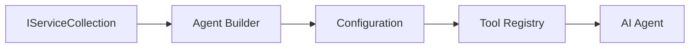

<!--
CO_OP_TRANSLATOR_METADATA:
{
  "original_hash": "bcc874e190347bd6a095aed56dc16de8",
  "translation_date": "2025-11-13T11:42:31+00:00",
  "source_file": "03-agentic-design-patterns/code_samples/03-dotnet-agent-framework.md",
  "language_code": "hi"
}
-->
# 🎨 GitHub मॉडल्स (.NET) के साथ एजेंटिक डिज़ाइन पैटर्न

## 📋 सीखने के उद्देश्य

यह उदाहरण Microsoft Agent Framework का उपयोग करके .NET में GitHub मॉडल्स के साथ बुद्धिमान एजेंट बनाने के लिए एंटरप्राइज़-ग्रेड डिज़ाइन पैटर्न प्रदर्शित करता है। आप पेशेवर पैटर्न और वास्तुशिल्प दृष्टिकोण सीखेंगे जो एजेंट्स को उत्पादन-तैयार, बनाए रखने योग्य और स्केलेबल बनाते हैं।

### एंटरप्राइज़ डिज़ाइन पैटर्न

- 🏭 **फैक्टरी पैटर्न**: निर्भरता इंजेक्शन के साथ मानकीकृत एजेंट निर्माण
- 🔧 **बिल्डर पैटर्न**: फ्लुएंट एजेंट कॉन्फ़िगरेशन और सेटअप
- 🧵 **थ्रेड-सेफ पैटर्न**: समवर्ती बातचीत प्रबंधन
- 📋 **रिपॉजिटरी पैटर्न**: संगठित टूल और क्षमता प्रबंधन

## 🎯 .NET-विशिष्ट वास्तुशिल्प लाभ

### एंटरप्राइज़ फीचर्स

- **स्ट्रॉन्ग टाइपिंग**: कंपाइल-टाइम सत्यापन और IntelliSense समर्थन
- **डिपेंडेंसी इंजेक्शन**: बिल्ट-इन DI कंटेनर इंटीग्रेशन
- **कॉन्फ़िगरेशन प्रबंधन**: IConfiguration और Options पैटर्न
- **Async/Await**: प्रथम-श्रेणी असिंक्रोनस प्रोग्रामिंग समर्थन

### उत्पादन-तैयार पैटर्न

- **लॉगिंग इंटीग्रेशन**: ILogger और संरचित लॉगिंग समर्थन
- **हेल्थ चेक्स**: बिल्ट-इन मॉनिटरिंग और डायग्नोस्टिक्स
- **कॉन्फ़िगरेशन सत्यापन**: डेटा एनोटेशन के साथ स्ट्रॉन्ग टाइपिंग
- **एरर हैंडलिंग**: संरचित अपवाद प्रबंधन

## 🔧 तकनीकी वास्तुकला

### कोर .NET घटक

- **Microsoft.Extensions.AI**: एकीकृत AI सेवा अमूर्तता
- **Microsoft.Agents.AI**: एंटरप्राइज़ एजेंट ऑर्केस्ट्रेशन फ्रेमवर्क
- **GitHub मॉडल्स इंटीग्रेशन**: उच्च-प्रदर्शन API क्लाइंट पैटर्न
- **कॉन्फ़िगरेशन सिस्टम**: appsettings.json और पर्यावरण इंटीग्रेशन

### डिज़ाइन पैटर्न कार्यान्वयन



## 🏗️ प्रदर्शित एंटरप्राइज़ पैटर्न

### 1. **क्रिएशनल पैटर्न**

- **एजेंट फैक्टरी**: सुसंगत कॉन्फ़िगरेशन के साथ केंद्रीकृत एजेंट निर्माण
- **बिल्डर पैटर्न**: जटिल एजेंट कॉन्फ़िगरेशन के लिए फ्लुएंट API
- **सिंगलटन पैटर्न**: साझा संसाधन और कॉन्फ़िगरेशन प्रबंधन
- **डिपेंडेंसी इंजेक्शन**: ढीला युग्मन और परीक्षण क्षमता

### 2. **व्यवहारिक पैटर्न**

- **स्ट्रेटेजी पैटर्न**: विनिमेय टूल निष्पादन रणनीतियाँ
- **कमांड पैटर्न**: एजेंट संचालन को एनकैप्सुलेट करना, साथ ही undo/redo
- **ऑब्जर्वर पैटर्न**: इवेंट-ड्रिवन एजेंट जीवनचक्र प्रबंधन
- **टेम्पलेट मेथड**: मानकीकृत एजेंट निष्पादन वर्कफ़्लो

### 3. **संरचनात्मक पैटर्न**

- **एडाप्टर पैटर्न**: GitHub मॉडल्स API इंटीग्रेशन लेयर
- **डेकोरेटर पैटर्न**: एजेंट क्षमता संवर्धन
- **फैसाड पैटर्न**: सरलीकृत एजेंट इंटरैक्शन इंटरफेस
- **प्रॉक्सी पैटर्न**: प्रदर्शन के लिए लेज़ी लोडिंग और कैशिंग

## 📚 .NET डिज़ाइन सिद्धांत

### SOLID सिद्धांत

- **सिंगल रिस्पॉन्सिबिलिटी**: प्रत्येक घटक का एक स्पष्ट उद्देश्य
- **ओपन/क्लोज़्ड**: संशोधन के बिना विस्तार योग्य
- **लिस्कोव सब्स्टीट्यूशन**: इंटरफेस-आधारित टूल कार्यान्वयन
- **इंटरफेस सेग्रेगेशन**: केंद्रित, सुसंगत इंटरफेस
- **डिपेंडेंसी इनवर्ज़न**: अमूर्तताओं पर निर्भर करें, ठोस पर नहीं

### क्लीन आर्किटेक्चर

- **डोमेन लेयर**: कोर एजेंट और टूल अमूर्तता
- **एप्लिकेशन लेयर**: एजेंट ऑर्केस्ट्रेशन और वर्कफ़्लो
- **इंफ्रास्ट्रक्चर लेयर**: GitHub मॉडल्स इंटीग्रेशन और बाहरी सेवाएँ
- **प्रेजेंटेशन लेयर**: उपयोगकर्ता इंटरैक्शन और प्रतिक्रिया स्वरूपण

## 🔒 एंटरप्राइज़ विचार

### सुरक्षा

- **क्रेडेंशियल प्रबंधन**: IConfiguration के साथ सुरक्षित API कुंजी हैंडलिंग
- **इनपुट सत्यापन**: स्ट्रॉन्ग टाइपिंग और डेटा एनोटेशन सत्यापन
- **आउटपुट सैनिटाइजेशन**: सुरक्षित प्रतिक्रिया प्रसंस्करण और फ़िल्टरिंग
- **ऑडिट लॉगिंग**: व्यापक संचालन ट्रैकिंग

### प्रदर्शन

- **Async पैटर्न**: नॉन-ब्लॉकिंग I/O संचालन
- **कनेक्शन पूलिंग**: कुशल HTTP क्लाइंट प्रबंधन
- **कैशिंग**: प्रदर्शन सुधार के लिए प्रतिक्रिया कैशिंग
- **संसाधन प्रबंधन**: उचित निपटान और सफाई पैटर्न

### स्केलेबिलिटी

- **थ्रेड सेफ्टी**: समवर्ती एजेंट निष्पादन समर्थन
- **संसाधन पूलिंग**: कुशल संसाधन उपयोग
- **लोड प्रबंधन**: दर सीमित और बैकप्रेशर हैंडलिंग
- **मॉनिटरिंग**: प्रदर्शन मीट्रिक्स और हेल्थ चेक्स

## 🚀 उत्पादन परिनियोजन

- **कॉन्फ़िगरेशन प्रबंधन**: पर्यावरण-विशिष्ट सेटिंग्स
- **लॉगिंग रणनीति**: संरचित लॉगिंग के साथ सहसंबंध IDs
- **एरर हैंडलिंग**: उचित रिकवरी के साथ वैश्विक अपवाद हैंडलिंग
- **मॉनिटरिंग**: एप्लिकेशन इनसाइट्स और प्रदर्शन काउंटर
- **परीक्षण**: यूनिट टेस्ट, इंटीग्रेशन टेस्ट, और लोड टेस्टिंग पैटर्न

एंटरप्राइज़-ग्रेड बुद्धिमान एजेंट्स .NET के साथ बनाने के लिए तैयार हैं? चलिए कुछ मजबूत वास्तुकला बनाते हैं! 🏢✨

## 🚀 शुरुआत करें

### आवश्यकताएँ

- [.NET 10 SDK](https://dotnet.microsoft.com/download/dotnet/10.0) या उच्चतर
- [GitHub मॉडल्स API एक्सेस टोकन](https://docs.github.com/github-models/github-models-at-scale/using-your-own-api-keys-in-github-models)

### आवश्यक पर्यावरण चर

```bash
# zsh/bash
export GH_TOKEN=<your_github_token>
export GH_ENDPOINT=https://models.github.ai/inference
export GH_MODEL_ID=openai/gpt-5-mini
```

```powershell
# PowerShell
$env:GH_TOKEN = "<your_github_token>"
$env:GH_ENDPOINT = "https://models.github.ai/inference"
$env:GH_MODEL_ID = "openai/gpt-5-mini"
```

### नमूना कोड

कोड उदाहरण चलाने के लिए,

```bash
# zsh/bash
chmod +x ./03-dotnet-agent-framework.cs
./03-dotnet-agent-framework.cs
```

या dotnet CLI का उपयोग करके:

```bash
dotnet run ./03-dotnet-agent-framework.cs
```

पूरा कोड [`03-dotnet-agent-framework.cs`](../../../../03-agentic-design-patterns/code_samples/03-dotnet-agent-framework.cs) में देखें।

```csharp
#!/usr/bin/dotnet run

#:package Microsoft.Extensions.AI@10.*
#:package Microsoft.Agents.AI.OpenAI@1.*-*

using System.ClientModel;
using System.ComponentModel;

using Microsoft.Agents.AI;
using Microsoft.Extensions.AI;

using OpenAI;

// Tool Function: Random Destination Generator
// This static method will be available to the agent as a callable tool
// The [Description] attribute helps the AI understand when to use this function
// This demonstrates how to create custom tools for AI agents
[Description("Provides a random vacation destination.")]
static string GetRandomDestination()
{
    // List of popular vacation destinations around the world
    // The agent will randomly select from these options
    var destinations = new List<string>
    {
        "Paris, France",
        "Tokyo, Japan",
        "New York City, USA",
        "Sydney, Australia",
        "Rome, Italy",
        "Barcelona, Spain",
        "Cape Town, South Africa",
        "Rio de Janeiro, Brazil",
        "Bangkok, Thailand",
        "Vancouver, Canada"
    };

    // Generate random index and return selected destination
    // Uses System.Random for simple random selection
    var random = new Random();
    int index = random.Next(destinations.Count);
    return destinations[index];
}

// Extract configuration from environment variables
// Retrieve the GitHub Models API endpoint, defaults to https://models.github.ai/inference if not specified
// Retrieve the model ID, defaults to openai/gpt-5-mini if not specified
// Retrieve the GitHub token for authentication, throws exception if not specified
var github_endpoint = Environment.GetEnvironmentVariable("GH_ENDPOINT") ?? "https://models.github.ai/inference";
var github_model_id = Environment.GetEnvironmentVariable("GH_MODEL_ID") ?? "openai/gpt-5-mini";
var github_token = Environment.GetEnvironmentVariable("GH_TOKEN") ?? throw new InvalidOperationException("GH_TOKEN is not set.");

// Configure OpenAI Client Options
// Create configuration options to point to GitHub Models endpoint
// This redirects OpenAI client calls to GitHub's model inference service
var openAIOptions = new OpenAIClientOptions()
{
    Endpoint = new Uri(github_endpoint)
};

// Initialize OpenAI Client with GitHub Models Configuration
// Create OpenAI client using GitHub token for authentication
// Configure it to use GitHub Models endpoint instead of OpenAI directly
var openAIClient = new OpenAIClient(new ApiKeyCredential(github_token), openAIOptions);

// Define Agent Identity and Comprehensive Instructions
// Agent name for identification and logging purposes
var AGENT_NAME = "TravelAgent";

// Detailed instructions that define the agent's personality, capabilities, and behavior
// This system prompt shapes how the agent responds and interacts with users
var AGENT_INSTRUCTIONS = """
You are a helpful AI Agent that can help plan vacations for customers.

Important: When users specify a destination, always plan for that location. Only suggest random destinations when the user hasn't specified a preference.

When the conversation begins, introduce yourself with this message:
"Hello! I'm your TravelAgent assistant. I can help plan vacations and suggest interesting destinations for you. Here are some things you can ask me:
1. Plan a day trip to a specific location
2. Suggest a random vacation destination
3. Find destinations with specific features (beaches, mountains, historical sites, etc.)
4. Plan an alternative trip if you don't like my first suggestion

What kind of trip would you like me to help you plan today?"

Always prioritize user preferences. If they mention a specific destination like "Bali" or "Paris," focus your planning on that location rather than suggesting alternatives.
""";

// Create AI Agent with Advanced Travel Planning Capabilities
// Initialize complete agent pipeline: OpenAI client → Chat client → AI agent
// Configure agent with name, detailed instructions, and available tools
// This demonstrates the .NET agent creation pattern with full configuration
AIAgent agent = openAIClient
    .GetChatClient(github_model_id)
    .CreateAIAgent(
        name: AGENT_NAME,
        instructions: AGENT_INSTRUCTIONS,
        tools: [AIFunctionFactory.Create(GetRandomDestination)]
    );

// Create New Conversation Thread for Context Management
// Initialize a new conversation thread to maintain context across multiple interactions
// Threads enable the agent to remember previous exchanges and maintain conversational state
// This is essential for multi-turn conversations and contextual understanding
AgentThread thread = agent.GetNewThread();

// Execute Agent: First Travel Planning Request
// Run the agent with an initial request that will likely trigger the random destination tool
// The agent will analyze the request, use the GetRandomDestination tool, and create an itinerary
// Using the thread parameter maintains conversation context for subsequent interactions
await foreach (var update in agent.RunStreamingAsync("Plan me a day trip", thread))
{
    await Task.Delay(10);
    Console.Write(update);
}

Console.WriteLine();

// Execute Agent: Follow-up Request with Context Awareness
// Demonstrate contextual conversation by referencing the previous response
// The agent remembers the previous destination suggestion and will provide an alternative
// This showcases the power of conversation threads and contextual understanding in .NET agents
await foreach (var update in agent.RunStreamingAsync("I don't like that destination. Plan me another vacation.", thread))
{
    await Task.Delay(10);
    Console.Write(update);
}
```

---

<!-- CO-OP TRANSLATOR DISCLAIMER START -->
**अस्वीकरण**:  
यह दस्तावेज़ AI अनुवाद सेवा [Co-op Translator](https://github.com/Azure/co-op-translator) का उपयोग करके अनुवादित किया गया है। जबकि हम सटीकता के लिए प्रयास करते हैं, कृपया ध्यान दें कि स्वचालित अनुवाद में त्रुटियां या अशुद्धियां हो सकती हैं। मूल भाषा में दस्तावेज़ को प्रामाणिक स्रोत माना जाना चाहिए। महत्वपूर्ण जानकारी के लिए, पेशेवर मानव अनुवाद की सिफारिश की जाती है। इस अनुवाद के उपयोग से उत्पन्न किसी भी गलतफहमी या गलत व्याख्या के लिए हम उत्तरदायी नहीं हैं।
<!-- CO-OP TRANSLATOR DISCLAIMER END -->