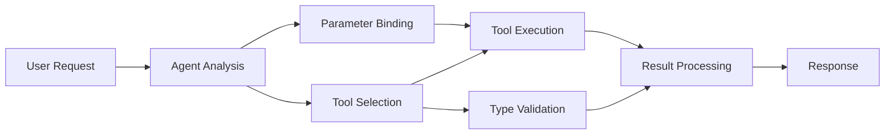

<!--
CO_OP_TRANSLATOR_METADATA:
{
  "original_hash": "91d6061e402489603f2ec8b528cae59b",
  "translation_date": "2025-11-18T17:01:19+00:00",
  "source_file": "04-tool-use/code_samples/04-dotnet-agent-framework.md",
  "language_code": "hi"
}
-->
# 🛠️ GitHub मॉडल्स (.NET) के साथ उन्नत टूल उपयोग

## 📋 सीखने के उद्देश्य

यह नोटबुक Microsoft Agent Framework का उपयोग करते हुए .NET में GitHub मॉडल्स के साथ एंटरप्राइज-ग्रेड टूल इंटीग्रेशन पैटर्न को प्रदर्शित करता है। आप कई विशेष टूल्स के साथ परिष्कृत एजेंट बनाना सीखेंगे, जिसमें C# की मजबूत टाइपिंग और .NET की एंटरप्राइज विशेषताओं का लाभ उठाया जाएगा।

### उन्नत टूल क्षमताएं जो आप सीखेंगे

- 🔧 **मल्टी-टूल आर्किटेक्चर**: कई विशेष क्षमताओं वाले एजेंट बनाना
- 🎯 **टाइप-सेफ टूल निष्पादन**: C# के कंपाइल-टाइम वैलिडेशन का उपयोग
- 📊 **एंटरप्राइज टूल पैटर्न**: प्रोडक्शन-रेडी टूल डिज़ाइन और एरर हैंडलिंग
- 🔗 **टूल संयोजन**: जटिल व्यावसायिक वर्कफ़्लो के लिए टूल्स को संयोजित करना

## 🎯 .NET टूल आर्किटेक्चर के लाभ

### एंटरप्राइज टूल विशेषताएं

- **कंपाइल-टाइम वैलिडेशन**: मजबूत टाइपिंग टूल पैरामीटर की शुद्धता सुनिश्चित करती है
- **डिपेंडेंसी इंजेक्शन**: टूल प्रबंधन के लिए IoC कंटेनर इंटीग्रेशन
- **Async/Await पैटर्न**: उचित संसाधन प्रबंधन के साथ नॉन-ब्लॉकिंग टूल निष्पादन
- **स्ट्रक्चर्ड लॉगिंग**: टूल निष्पादन मॉनिटरिंग के लिए बिल्ट-इन लॉगिंग इंटीग्रेशन

### प्रोडक्शन-रेडी पैटर्न

- **एक्सेप्शन हैंडलिंग**: टाइप्ड एक्सेप्शन्स के साथ व्यापक एरर प्रबंधन
- **संसाधन प्रबंधन**: उचित डिस्पोजल पैटर्न और मेमोरी प्रबंधन
- **प्रदर्शन मॉनिटरिंग**: बिल्ट-इन मेट्रिक्स और प्रदर्शन काउंटर
- **कॉन्फ़िगरेशन प्रबंधन**: वैलिडेशन के साथ टाइप-सेफ कॉन्फ़िगरेशन

## 🔧 तकनीकी आर्किटेक्चर

### कोर .NET टूल घटक

- **Microsoft.Extensions.AI**: एकीकृत टूल एब्स्ट्रैक्शन लेयर
- **Microsoft.Agents.AI**: एंटरप्राइज-ग्रेड टूल ऑर्केस्ट्रेशन
- **GitHub मॉडल्स इंटीग्रेशन**: कनेक्शन पूलिंग के साथ हाई-परफॉर्मेंस API क्लाइंट

### टूल निष्पादन पाइपलाइन



## 🛠️ टूल श्रेणियां और पैटर्न

### 1. **डेटा प्रोसेसिंग टूल्स**

- **इनपुट वैलिडेशन**: डेटा एनोटेशन के साथ मजबूत टाइपिंग
- **ट्रांसफॉर्म ऑपरेशन्स**: टाइप-सेफ डेटा कन्वर्ज़न और फॉर्मेटिंग
- **बिजनेस लॉजिक**: डोमेन-विशिष्ट गणना और विश्लेषण टूल्स
- **आउटपुट फॉर्मेटिंग**: संरचित प्रतिक्रिया निर्माण

### 2. **इंटीग्रेशन टूल्स**

- **API कनेक्टर्स**: HttpClient के साथ RESTful सेवा इंटीग्रेशन
- **डेटाबेस टूल्स**: डेटा एक्सेस के लिए Entity Framework इंटीग्रेशन
- **फाइल ऑपरेशन्स**: वैलिडेशन के साथ सुरक्षित फाइल सिस्टम ऑपरेशन्स
- **एक्सटर्नल सर्विसेज**: थर्ड-पार्टी सेवा इंटीग्रेशन पैटर्न

### 3. **यूटिलिटी टूल्स**

- **टेक्स्ट प्रोसेसिंग**: स्ट्रिंग मैनिपुलेशन और फॉर्मेटिंग यूटिलिटीज
- **डेट/टाइम ऑपरेशन्स**: कल्चर-अवेयर डेट/टाइम कैलकुलेशन्स
- **मैथेमैटिकल टूल्स**: सटीक गणना और सांख्यिकीय ऑपरेशन्स
- **वैलिडेशन टूल्स**: बिजनेस रूल वैलिडेशन और डेटा वेरिफिकेशन

क्या आप .NET में शक्तिशाली, टाइप-सेफ टूल क्षमताओं के साथ एंटरप्राइज-ग्रेड एजेंट बनाने के लिए तैयार हैं? चलिए कुछ पेशेवर-ग्रेड समाधान तैयार करते हैं! 🏢⚡

## 🚀 शुरुआत करें

### आवश्यकताएं

- [.NET 10 SDK](https://dotnet.microsoft.com/download/dotnet/10.0) या उससे उच्च
- [GitHub मॉडल्स API एक्सेस टोकन](https://docs.github.com/github-models/github-models-at-scale/using-your-own-api-keys-in-github-models)

### आवश्यक पर्यावरण वेरिएबल्स

```bash
# zsh/bash
export GH_TOKEN=<your_github_token>
export GH_ENDPOINT=https://models.github.ai/inference
export GH_MODEL_ID=openai/gpt-5-mini
```

```powershell
# PowerShell
$env:GH_TOKEN = "<your_github_token>"
$env:GH_ENDPOINT = "https://models.github.ai/inference"
$env:GH_MODEL_ID = "openai/gpt-5-mini"
```

### नमूना कोड

कोड उदाहरण चलाने के लिए,

```bash
# zsh/bash
chmod +x ./04-dotnet-agent-framework.cs
./04-dotnet-agent-framework.cs
```

या dotnet CLI का उपयोग करते हुए:

```bash
dotnet run ./04-dotnet-agent-framework.cs
```

पूरा कोड देखने के लिए देखें [`04-dotnet-agent-framework.cs`](../../../../04-tool-use/code_samples/04-dotnet-agent-framework.cs)।

```csharp
#!/usr/bin/dotnet run

#:package Microsoft.Extensions.AI@10.*
#:package Microsoft.Agents.AI.OpenAI@1.*-*

using System.ClientModel;
using System.ComponentModel;

using Microsoft.Agents.AI;
using Microsoft.Extensions.AI;

using OpenAI;

// Tool Function: Random Destination Generator
// This static method will be available to the agent as a callable tool
// The [Description] attribute helps the AI understand when to use this function
// This demonstrates how to create custom tools for AI agents
[Description("Provides a random vacation destination.")]
static string GetRandomDestination()
{
    // List of popular vacation destinations around the world
    // The agent will randomly select from these options
    var destinations = new List<string>
    {
        "Paris, France",
        "Tokyo, Japan",
        "New York City, USA",
        "Sydney, Australia",
        "Rome, Italy",
        "Barcelona, Spain",
        "Cape Town, South Africa",
        "Rio de Janeiro, Brazil",
        "Bangkok, Thailand",
        "Vancouver, Canada"
    };

    // Generate random index and return selected destination
    // Uses System.Random for simple random selection
    var random = new Random();
    int index = random.Next(destinations.Count);
    return destinations[index];
}

// Extract configuration from environment variables
// Retrieve the GitHub Models API endpoint, defaults to https://models.github.ai/inference if not specified
// Retrieve the model ID, defaults to openai/gpt-5-mini if not specified
// Retrieve the GitHub token for authentication, throws exception if not specified
var github_endpoint = Environment.GetEnvironmentVariable("GH_ENDPOINT") ?? "https://models.github.ai/inference";
var github_model_id = Environment.GetEnvironmentVariable("GH_MODEL_ID") ?? "openai/gpt-5-mini";
var github_token = Environment.GetEnvironmentVariable("GH_TOKEN") ?? throw new InvalidOperationException("GH_TOKEN is not set.");

// Configure OpenAI Client Options
// Create configuration options to point to GitHub Models endpoint
// This redirects OpenAI client calls to GitHub's model inference service
var openAIOptions = new OpenAIClientOptions()
{
    Endpoint = new Uri(github_endpoint)
};

// Initialize OpenAI Client with GitHub Models Configuration
// Create OpenAI client using GitHub token for authentication
// Configure it to use GitHub Models endpoint instead of OpenAI directly
var openAIClient = new OpenAIClient(new ApiKeyCredential(github_token), openAIOptions);

// Define Agent Identity and Comprehensive Instructions
// Agent name for identification and logging purposes
var AGENT_NAME = "TravelAgent";

// Detailed instructions that define the agent's personality, capabilities, and behavior
// This system prompt shapes how the agent responds and interacts with users
var AGENT_INSTRUCTIONS = """
You are a helpful AI Agent that can help plan vacations for customers.

Important: When users specify a destination, always plan for that location. Only suggest random destinations when the user hasn't specified a preference.

When the conversation begins, introduce yourself with this message:
"Hello! I'm your TravelAgent assistant. I can help plan vacations and suggest interesting destinations for you. Here are some things you can ask me:
1. Plan a day trip to a specific location
2. Suggest a random vacation destination
3. Find destinations with specific features (beaches, mountains, historical sites, etc.)
4. Plan an alternative trip if you don't like my first suggestion

What kind of trip would you like me to help you plan today?"

Always prioritize user preferences. If they mention a specific destination like "Bali" or "Paris," focus your planning on that location rather than suggesting alternatives.
""";

// Create AI Agent with Advanced Travel Planning Capabilities
// Initialize complete agent pipeline: OpenAI client → Chat client → AI agent
// Configure agent with name, detailed instructions, and available tools
// This demonstrates the .NET agent creation pattern with full configuration
AIAgent agent = openAIClient
    .GetChatClient(github_model_id)
    .CreateAIAgent(
        name: AGENT_NAME,
        instructions: AGENT_INSTRUCTIONS,
        tools: [AIFunctionFactory.Create(GetRandomDestination)]
    );

// Create New Conversation Thread for Context Management
// Initialize a new conversation thread to maintain context across multiple interactions
// Threads enable the agent to remember previous exchanges and maintain conversational state
// This is essential for multi-turn conversations and contextual understanding
AgentThread thread = agent.GetNewThread();

// Execute Agent: First Travel Planning Request
// Run the agent with an initial request that will likely trigger the random destination tool
// The agent will analyze the request, use the GetRandomDestination tool, and create an itinerary
// Using the thread parameter maintains conversation context for subsequent interactions
await foreach (var update in agent.RunStreamingAsync("Plan me a day trip", thread))
{
    await Task.Delay(10);
    Console.Write(update);
}

Console.WriteLine();

// Execute Agent: Follow-up Request with Context Awareness
// Demonstrate contextual conversation by referencing the previous response
// The agent remembers the previous destination suggestion and will provide an alternative
// This showcases the power of conversation threads and contextual understanding in .NET agents
await foreach (var update in agent.RunStreamingAsync("I don't like that destination. Plan me another vacation.", thread))
{
    await Task.Delay(10);
    Console.Write(update);
}
```

---

<!-- CO-OP TRANSLATOR DISCLAIMER START -->
**अस्वीकरण**:  
यह दस्तावेज़ AI अनुवाद सेवा [Co-op Translator](https://github.com/Azure/co-op-translator) का उपयोग करके अनुवादित किया गया है। जबकि हम सटीकता के लिए प्रयास करते हैं, कृपया ध्यान दें कि स्वचालित अनुवाद में त्रुटियां या अशुद्धियां हो सकती हैं। मूल भाषा में दस्तावेज़ को प्रामाणिक स्रोत माना जाना चाहिए। महत्वपूर्ण जानकारी के लिए, पेशेवर मानव अनुवाद की सिफारिश की जाती है। इस अनुवाद के उपयोग से उत्पन्न किसी भी गलतफहमी या गलत व्याख्या के लिए हम उत्तरदायी नहीं हैं।
<!-- CO-OP TRANSLATOR DISCLAIMER END -->