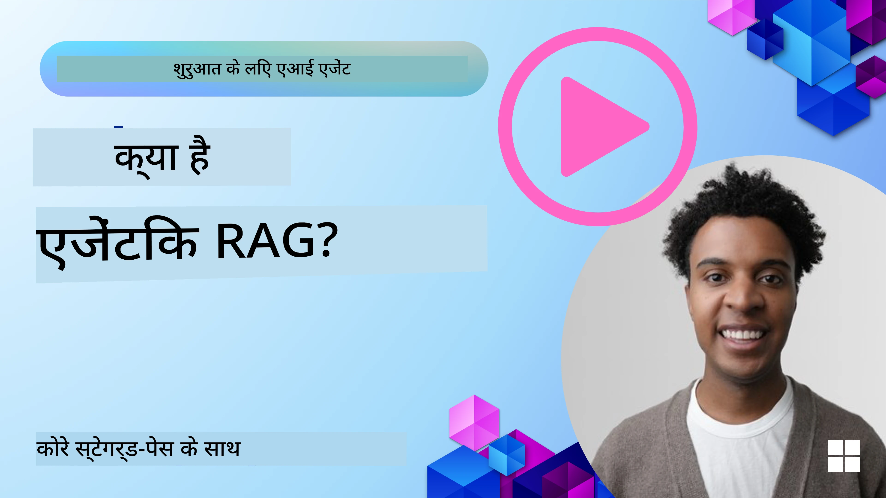
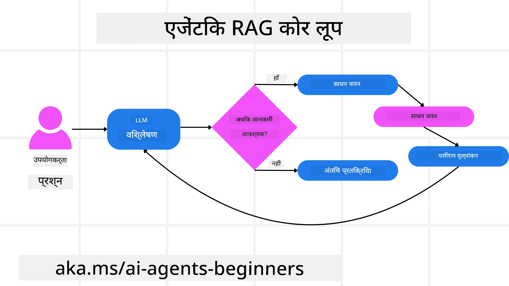
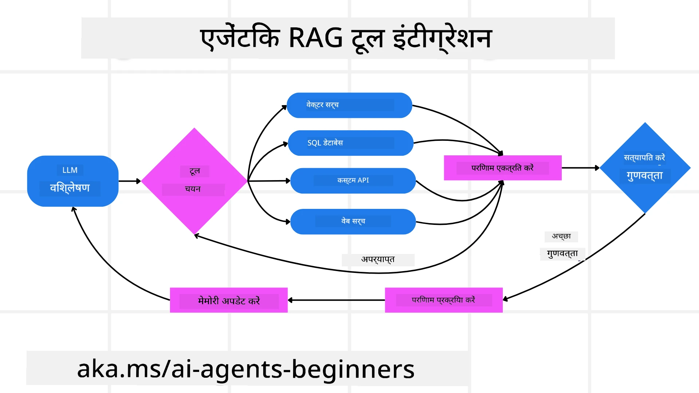
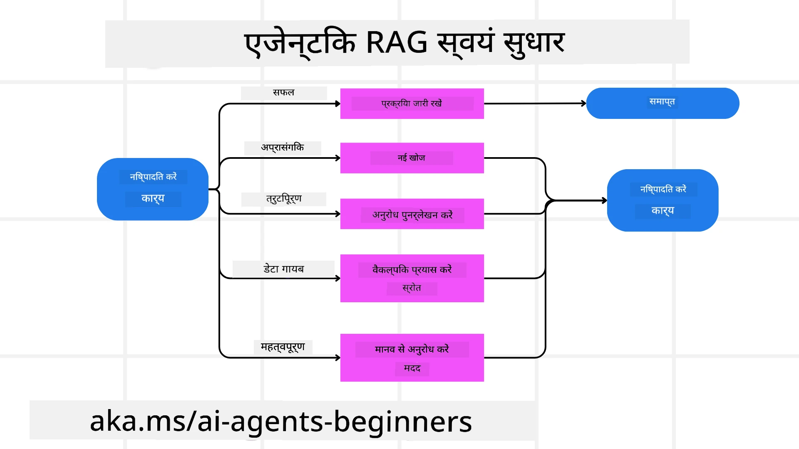

<!--
CO_OP_TRANSLATOR_METADATA:
{
  "original_hash": "0ebf6b2290db55dbf2d10cc49655523b",
  "translation_date": "2025-09-30T06:37:40+00:00",
  "source_file": "05-agentic-rag/README.md",
  "language_code": "hi"
}
-->

> _(इस पाठ का वीडियो देखने के लिए ऊपर दी गई छवि पर क्लिक करें)_

# एजेंटिक RAG

यह पाठ एजेंटिक रिट्रीवल-ऑगमेंटेड जनरेशन (Agentic RAG) का व्यापक परिचय प्रदान करता है, जो एक उभरता हुआ AI पैटर्न है जिसमें बड़े भाषा मॉडल (LLMs) बाहरी स्रोतों से जानकारी प्राप्त करते हुए स्वायत्त रूप से अपने अगले कदमों की योजना बनाते हैं। स्थिर रिट्रीवल-फिर-पढ़ने वाले पैटर्न के विपरीत, एजेंटिक RAG में LLM के लिए बार-बार कॉल करना शामिल है, जिसमें टूल या फंक्शन कॉल और संरचित आउटपुट शामिल होते हैं। सिस्टम परिणामों का मूल्यांकन करता है, क्वेरी को परिष्कृत करता है, आवश्यक होने पर अतिरिक्त टूल का उपयोग करता है, और तब तक इस चक्र को जारी रखता है जब तक कि संतोषजनक समाधान प्राप्त न हो जाए।

## परिचय

इस पाठ में शामिल हैं:

- **एजेंटिक RAG को समझें:** AI में उभरते हुए पैटर्न के बारे में जानें, जहां बड़े भाषा मॉडल (LLMs) बाहरी डेटा स्रोतों से जानकारी प्राप्त करते हुए स्वायत्त रूप से अपने अगले कदमों की योजना बनाते हैं।
- **इंटरएक्टिव मेकर-चेकर्स शैली को समझें:** LLM के लिए बार-बार कॉल करने का लूप समझें, जिसमें टूल या फंक्शन कॉल और संरचित आउटपुट शामिल होते हैं, जो सहीता में सुधार और खराब क्वेरी को संभालने के लिए डिज़ाइन किया गया है।
- **व्यावहारिक अनुप्रयोगों का अन्वेषण करें:** उन परिदृश्यों की पहचान करें जहां एजेंटिक RAG उत्कृष्ट प्रदर्शन करता है, जैसे कि सहीता-प्रथम वातावरण, जटिल डेटाबेस इंटरैक्शन, और विस्तारित वर्कफ़्लो।

## सीखने के लक्ष्य

इस पाठ को पूरा करने के बाद, आप जानेंगे/समझेंगे:

- **एजेंटिक RAG को समझना:** AI में उभरते हुए पैटर्न के बारे में जानें, जहां बड़े भाषा मॉडल (LLMs) बाहरी डेटा स्रोतों से जानकारी प्राप्त करते हुए स्वायत्त रूप से अपने अगले कदमों की योजना बनाते हैं।
- **इंटरएक्टिव मेकर-चेकर्स शैली:** LLM के लिए बार-बार कॉल करने का लूप समझें, जिसमें टूल या फंक्शन कॉल और संरचित आउटपुट शामिल होते हैं, जो सहीता में सुधार और खराब क्वेरी को संभालने के लिए डिज़ाइन किया गया है।
- **तर्क प्रक्रिया का स्वामित्व:** सिस्टम की तर्क प्रक्रिया को समझें, जो यह तय करता है कि समस्याओं से कैसे निपटना है, बिना पूर्व-निर्धारित मार्गों पर निर्भर हुए।
- **वर्कफ़्लो:** समझें कि एक एजेंटिक मॉडल स्वतंत्र रूप से बाजार प्रवृत्ति रिपोर्ट प्राप्त करने, प्रतिस्पर्धी डेटा की पहचान करने, आंतरिक बिक्री मेट्रिक्स को सहसंबंधित करने, निष्कर्षों को संश्लेषित करने और रणनीति का मूल्यांकन करने का निर्णय कैसे लेता है।
- **इंटरएक्टिव लूप्स, टूल इंटीग्रेशन, और मेमोरी:** सिस्टम के लूप्ड इंटरैक्शन पैटर्न पर निर्भरता के बारे में जानें, जो चरणों के बीच स्थिति और मेमोरी बनाए रखता है ताकि दोहराव वाले लूप से बचा जा सके और सूचित निर्णय लिए जा सकें।
- **विफलता मोड और आत्म-सुधार को संभालना:** सिस्टम के मजबूत आत्म-सुधार तंत्र का अन्वेषण करें, जिसमें पुनरावृत्ति और पुनः क्वेरी करना, डायग्नोस्टिक टूल का उपयोग करना, और मानव निरीक्षण पर वापस जाना शामिल है।
- **एजेंसी की सीमाएं:** एजेंटिक RAG की सीमाओं को समझें, जो डोमेन-विशिष्ट स्वायत्तता, बुनियादी ढांचे पर निर्भरता, और गार्डरेल्स के प्रति सम्मान पर केंद्रित हैं।
- **व्यावहारिक उपयोग के मामले और मूल्य:** उन परिदृश्यों की पहचान करें जहां एजेंटिक RAG उत्कृष्ट प्रदर्शन करता है, जैसे कि सहीता-प्रथम वातावरण, जटिल डेटाबेस इंटरैक्शन, और विस्तारित वर्कफ़्लो।
- **गवर्नेंस, पारदर्शिता, और विश्वास:** गवर्नेंस और पारदर्शिता के महत्व के बारे में जानें, जिसमें व्याख्यात्मक तर्क, पूर्वाग्रह नियंत्रण, और मानव निरीक्षण शामिल हैं।

## एजेंटिक RAG क्या है?

एजेंटिक रिट्रीवल-ऑगमेंटेड जनरेशन (Agentic RAG) एक उभरता हुआ AI पैटर्न है जिसमें बड़े भाषा मॉडल (LLMs) बाहरी स्रोतों से जानकारी प्राप्त करते हुए स्वायत्त रूप से अपने अगले कदमों की योजना बनाते हैं। स्थिर रिट्रीवल-फिर-पढ़ने वाले पैटर्न के विपरीत, एजेंटिक RAG में LLM के लिए बार-बार कॉल करना शामिल है, जिसमें टूल या फंक्शन कॉल और संरचित आउटपुट शामिल होते हैं। सिस्टम परिणामों का मूल्यांकन करता है, क्वेरी को परिष्कृत करता है, आवश्यक होने पर अतिरिक्त टूल का उपयोग करता है, और तब तक इस चक्र को जारी रखता है जब तक कि संतोषजनक समाधान प्राप्त न हो जाए। यह पुनरावृत्त “मेकर-चेकर्स” शैली सहीता में सुधार करती है, खराब क्वेरी को संभालती है, और उच्च-गुणवत्ता वाले परिणाम सुनिश्चित करती है।

सिस्टम सक्रिय रूप से अपनी तर्क प्रक्रिया का स्वामित्व लेता है, असफल क्वेरी को फिर से लिखता है, विभिन्न रिट्रीवल विधियों का चयन करता है, और कई टूल को एकीकृत करता है—जैसे कि Azure AI Search में वेक्टर सर्च, SQL डेटाबेस, या कस्टम APIs—अपने उत्तर को अंतिम रूप देने से पहले। एक एजेंटिक सिस्टम की विशिष्ट गुणवत्ता इसकी तर्क प्रक्रिया का स्वामित्व लेने की क्षमता है। पारंपरिक RAG कार्यान्वयन पूर्व-निर्धारित मार्गों पर निर्भर करते हैं, लेकिन एक एजेंटिक सिस्टम स्वायत्त रूप से उस जानकारी की गुणवत्ता के आधार पर चरणों का अनुक्रम निर्धारित करता है जो इसे मिलती है।

## एजेंटिक रिट्रीवल-ऑगमेंटेड जनरेशन (Agentic RAG) को परिभाषित करना

एजेंटिक रिट्रीवल-ऑगमेंटेड जनरेशन (Agentic RAG) AI विकास में एक उभरता हुआ पैटर्न है जिसमें LLMs न केवल बाहरी डेटा स्रोतों से जानकारी प्राप्त करते हैं बल्कि स्वायत्त रूप से अपने अगले कदमों की योजना भी बनाते हैं। स्थिर रिट्रीवल-फिर-पढ़ने वाले पैटर्न या सावधानीपूर्वक स्क्रिप्टेड प्रॉम्प्ट अनुक्रमों के विपरीत, एजेंटिक RAG में LLM के लिए पुनरावृत्त कॉल का एक लूप शामिल होता है, जिसमें टूल या फंक्शन कॉल और संरचित आउटपुट शामिल होते हैं। हर मोड़ पर, सिस्टम प्राप्त परिणामों का मूल्यांकन करता है, यह तय करता है कि क्या क्वेरी को परिष्कृत करना है, आवश्यक होने पर अतिरिक्त टूल का उपयोग करता है, और इस चक्र को तब तक जारी रखता है जब तक कि यह एक संतोषजनक समाधान प्राप्त न कर ले।

यह पुनरावृत्त “मेकर-चेकर्स” शैली संचालन की सहीता में सुधार करने, संरचित डेटाबेस (जैसे NL2SQL) के लिए खराब क्वेरी को संभालने, और संतुलित, उच्च-गुणवत्ता वाले परिणाम सुनिश्चित करने के लिए डिज़ाइन की गई है। सावधानीपूर्वक इंजीनियर प्रॉम्प्ट चेन पर पूरी तरह से निर्भर होने के बजाय, सिस्टम सक्रिय रूप से अपनी तर्क प्रक्रिया का स्वामित्व लेता है। यह असफल क्वेरी को फिर से लिख सकता है, विभिन्न रिट्रीवल विधियों का चयन कर सकता है, और कई टूल को एकीकृत कर सकता है—जैसे कि Azure AI Search में वेक्टर सर्च, SQL डेटाबेस, या कस्टम APIs—अपने उत्तर को अंतिम रूप देने से पहले। इससे अत्यधिक जटिल ऑर्केस्ट्रेशन फ्रेमवर्क की आवश्यकता समाप्त हो जाती है। इसके बजाय, “LLM कॉल → टूल उपयोग → LLM कॉल → …” का एक अपेक्षाकृत सरल लूप परिष्कृत और अच्छी तरह से आधारित आउटपुट प्रदान कर सकता है।

## तर्क प्रक्रिया का स्वामित्व लेना

जो गुणवत्ता एक सिस्टम को “एजेंटिक” बनाती है, वह इसकी तर्क प्रक्रिया का स्वामित्व लेने की क्षमता है। पारंपरिक RAG कार्यान्वयन अक्सर मॉडल के लिए एक पूर्व-निर्धारित मार्ग पर निर्भर करते हैं: एक विचार श्रृंखला जो यह बताती है कि क्या प्राप्त करना है और कब।
लेकिन जब एक सिस्टम वास्तव में एजेंटिक होता है, तो यह आंतरिक रूप से तय करता है कि समस्या से कैसे निपटना है। यह केवल एक स्क्रिप्ट को निष्पादित नहीं कर रहा है; यह स्वायत्त रूप से उस जानकारी की गुणवत्ता के आधार पर चरणों का अनुक्रम निर्धारित कर रहा है जो इसे मिलती है।
उदाहरण के लिए, यदि इसे एक उत्पाद लॉन्च रणनीति बनाने के लिए कहा जाता है, तो यह केवल एक प्रॉम्प्ट पर निर्भर नहीं करता है जो पूरे शोध और निर्णय लेने के वर्कफ़्लो को स्पष्ट करता है। इसके बजाय, एजेंटिक मॉडल स्वतंत्र रूप से निर्णय लेता है:

1. Bing Web Grounding का उपयोग करके वर्तमान बाजार प्रवृत्ति रिपोर्ट प्राप्त करें।
2. Azure AI Search का उपयोग करके प्रासंगिक प्रतिस्पर्धी डेटा की पहचान करें।
3. Azure SQL Database का उपयोग करके ऐतिहासिक आंतरिक बिक्री मेट्रिक्स को सहसंबंधित करें।
4. Azure OpenAI Service के माध्यम से समन्वित एक सुसंगत रणनीति में निष्कर्षों को संश्लेषित करें।
5. रणनीति में अंतराल या असंगतियों का मूल्यांकन करें, यदि आवश्यक हो तो पुनः प्राप्ति का एक और दौर शुरू करें।
इन सभी चरणों—क्वेरी को परिष्कृत करना, स्रोतों का चयन करना, उत्तर से “संतुष्ट” होने तक पुनरावृत्ति करना—मॉडल द्वारा तय किए जाते हैं, न कि किसी मानव द्वारा पूर्व-स्क्रिप्टेड।

## पुनरावृत्त लूप्स, टूल इंटीग्रेशन, और मेमोरी

एक एजेंटिक सिस्टम एक लूप्ड इंटरैक्शन पैटर्न पर निर्भर करता है:

- **प्रारंभिक कॉल:** उपयोगकर्ता का लक्ष्य (उर्फ उपयोगकर्ता प्रॉम्प्ट) LLM को प्रस्तुत किया जाता है।
- **टूल का उपयोग:** यदि मॉडल को जानकारी की कमी या अस्पष्ट निर्देशों का पता चलता है, तो यह एक टूल या रिट्रीवल विधि का चयन करता है—जैसे कि वेक्टर डेटाबेस क्वेरी (जैसे Azure AI Search हाइब्रिड सर्च निजी डेटा पर) या एक संरचित SQL कॉल—अधिक संदर्भ प्राप्त करने के लिए।
- **मूल्यांकन और परिष्करण:** लौटाए गए डेटा की समीक्षा करने के बाद, मॉडल तय करता है कि जानकारी पर्याप्त है या नहीं। यदि नहीं, तो यह क्वेरी को परिष्कृत करता है, एक अलग टूल आज़माता है, या अपने दृष्टिकोण को समायोजित करता है।
- **संतुष्ट होने तक दोहराएं:** यह चक्र तब तक जारी रहता है जब तक मॉडल यह निर्धारित नहीं करता कि उसके पास एक अंतिम, अच्छी तरह से तर्कसंगत उत्तर देने के लिए पर्याप्त स्पष्टता और साक्ष्य हैं।
- **मेमोरी और स्थिति:** क्योंकि सिस्टम चरणों के बीच स्थिति और मेमोरी बनाए रखता है, यह पिछले प्रयासों और उनके परिणामों को याद कर सकता है, दोहराव वाले लूप से बच सकता है, और जैसे-जैसे यह आगे बढ़ता है, अधिक सूचित निर्णय ले सकता है।

समय के साथ, यह एक विकसित समझ की भावना पैदा करता है, जिससे मॉडल जटिल, बहु-चरणीय कार्यों को नेविगेट कर सकता है, बिना किसी मानव के लगातार हस्तक्षेप या प्रॉम्प्ट को फिर से आकार देने की आवश्यकता के।

## विफलता मोड और आत्म-सुधार को संभालना

एजेंटिक RAG की स्वायत्तता में मजबूत आत्म-सुधार तंत्र भी शामिल हैं। जब सिस्टम मृत अंत पर पहुंचता है—जैसे कि अप्रासंगिक दस्तावेज़ प्राप्त करना या खराब क्वेरी का सामना करना—तो यह कर सकता है:

- **पुनरावृत्ति और पुनः क्वेरी:** कम मूल्य वाले उत्तर लौटाने के बजाय, मॉडल नई खोज रणनीतियों का प्रयास करता है, डेटाबेस क्वेरी को फिर से लिखता है, या वैकल्पिक डेटा सेट देखता है।
- **डायग्नोस्टिक टूल का उपयोग:** सिस्टम अतिरिक्त कार्यों को आमंत्रित कर सकता है जो इसे अपने तर्क चरणों को डिबग करने या प्राप्त डेटा की सहीता की पुष्टि करने में मदद करने के लिए डिज़ाइन किए गए हैं। Azure AI Tracing जैसे टूल मजबूत अवलोकन और निगरानी को सक्षम करने के लिए महत्वपूर्ण होंगे।
- **मानव निरीक्षण पर वापस जाएं:** उच्च-दांव या बार-बार विफल होने वाले परिदृश्यों के लिए, मॉडल अनिश्चितता को चिह्नित कर सकता है और मानव मार्गदर्शन का अनुरोध कर सकता है। एक बार जब मानव सुधारात्मक प्रतिक्रिया प्रदान करता है, तो मॉडल उस पाठ को आगे बढ़ाने में शामिल कर सकता है।

यह पुनरावृत्त और गतिशील दृष्टिकोण मॉडल को लगातार सुधारने की अनुमति देता है, यह सुनिश्चित करता है कि यह केवल एक बार का सिस्टम नहीं है बल्कि एक ऐसा सिस्टम है जो एक दिए गए सत्र के दौरान अपनी गलतियों से सीखता है।

## एजेंसी की सीमाएं

एक कार्य के भीतर इसकी स्वायत्तता के बावजूद, एजेंटिक RAG कृत्रिम सामान्य बुद्धिमत्ता के समान नहीं है। इसकी “एजेंटिक” क्षमताएं मानव डेवलपर्स द्वारा प्रदान किए गए टूल, डेटा स्रोतों, और नीतियों तक सीमित हैं। यह अपने स्वयं के टूल का आविष्कार नहीं कर सकता या उन डोमेन सीमाओं से बाहर नहीं जा सकता जो सेट की गई हैं। बल्कि, यह हाथ में उपलब्ध संसाधनों को गतिशील रूप से व्यवस्थित करने में उत्कृष्टता प्राप्त करता है।
अधिक उन्नत AI रूपों से प्रमुख अंतर में शामिल हैं:

1. **डोमेन-विशिष्ट स्वायत्तता:** एजेंटिक RAG सिस्टम ज्ञात डोमेन के भीतर उपयोगकर्ता-परिभाषित लक्ष्यों को प्राप्त करने पर केंद्रित हैं, जैसे कि क्वेरी को फिर से लिखना या टूल चयन का उपयोग करके परिणामों में सुधार करना।
2. **बुनियादी ढांचे पर निर्भर:** सिस्टम की क्षमताएं डेवलपर्स द्वारा एकीकृत टूल और डेटा पर निर्भर करती हैं। यह मानव हस्तक्षेप के बिना इन सीमाओं को पार नहीं कर सकता।
3. **गार्डरेल्स का सम्मान:** नैतिक दिशानिर्देश, अनुपालन नियम, और व्यावसायिक नीतियां बहुत महत्वपूर्ण बनी रहती हैं। एजेंट की स्वतंत्रता हमेशा सुरक्षा उपायों और निरीक्षण तंत्र द्वारा सीमित होती है (उम्मीद है?)

## व्यावहारिक उपयोग के मामले और मूल्य

एजेंटिक RAG उन परिदृश्यों में उत्कृष्ट प्रदर्शन करता है जिनमें पुनरावृत्ति परिष्करण और सटीकता की आवश्यकता होती है:

1. **सहीता-प्रथम वातावरण:** अनुपालन जांच, नियामक विश्लेषण, या कानूनी शोध में, एजेंटिक मॉडल बार-बार तथ्यों की पुष्टि कर सकता है, कई स्रोतों से परामर्श कर सकता है, और एक पूरी तरह से सत्यापित उत्तर उत्पन्न करने तक क्वेरी को फिर से लिख सकता है।
2. **जटिल डेटाबेस इंटरैक्शन:** संरचित डेटा से निपटने के दौरान जहां क्वेरी अक्सर विफल हो सकती है या समायोजन की आवश्यकता हो सकती है, सिस्टम Azure SQL या Microsoft Fabric OneLake का उपयोग करके अपनी क्वेरी को स्वायत्त रूप से परिष्कृत कर सकता है, यह सुनिश्चित करते हुए कि अंतिम रिट्रीवल उपयोगकर्ता के इरादे के साथ मेल खाता है।
3. **विस्तारित वर्कफ़्लो:** लंबे समय तक चलने वाले सत्र नए जानकारी के उभरने के साथ विकसित हो सकते हैं। एजेंटिक RAG लगातार नए डेटा को शामिल कर सकता है, समस्या क्षेत्र के बारे में अधिक जानने के साथ रणनीतियों को बदल सकता है।

## गवर्नेंस, पारदर्शिता, और विश्वास

जैसे-जैसे ये सिस्टम अपनी तर्क प्रक्रिया में अधिक स्वायत्त होते जाते हैं, गवर्नेंस और पारदर्शिता महत्वपूर्ण हैं:

- **व्याख्यात्मक तर्क:** मॉडल उन क्वेरी का ऑडिट ट्रेल प्रदान कर सकता है जो उसने बनाई थीं, जिन स्रोतों से उसने परामर्श किया था, और जिन तर्क चरणों के माध्यम से वह अपने निष्कर्ष पर पहुंचा। Azure AI Content Safety और Azure AI Tracing / GenAIOps जैसे टूल पारदर्शिता बनाए रखने और जोखिमों को कम करने में मदद कर सकते हैं।
- **पूर्वाग्रह नियंत्रण और संतुलित रिट्रीवल:** डेवलपर्स रिट्रीवल रणनीतियों को ट्यून कर सकते हैं ताकि यह सुनिश्चित किया जा सके कि संतुलित, प्रतिनिधि डेटा स्रोतों पर विचार किया गया है, और आउटपुट का नियमित रूप से ऑडिट किया जा सके ताकि पूर्वाग्रह या विकृत पैटर्न का पता लगाया जा सके, Azure Machine Learning का उपयोग करके उन्नत डेटा विज्ञान संगठनों के लिए कस्टम मॉडल का उपयोग किया जा सके।
- **मानव निरीक्षण और अनुपालन:** संवेदनशील कार्यों के लिए, मानव समीक्षा आवश्यक बनी रहती है। एजेंटिक RAG उच्च-दांव निर्णयों में मानव निर्णय को प्रतिस्थापित नहीं करता—यह अधिक पूरी तरह से सत्यापित विकल्प प्रदान करके इसे बढ़ाता है।

ऐसे टूल का होना जो क्रिय
- <a href="https://ragaboutit.com/agentic-rag-a-complete-guide-to-agent-based-retrieval-augmented-generation/" target="_blank">एजेंटिक RAG: एजेंट-आधारित रिट्रीवल ऑगमेंटेड जनरेशन के लिए पूरी गाइड – जनरेशन RAG से समाचार</a>
- <a href="https://huggingface.co/learn/cookbook/agent_rag" target="_blank">एजेंटिक RAG: अपने RAG को क्वेरी सुधार और सेल्फ-क्वेरी के साथ टर्बोचार्ज करें! हगिंग फेस ओपन-सोर्स AI कुकबुक</a>
- <a href="https://youtu.be/aQ4yQXeB1Ss?si=2HUqBzHoeB5tR04U" target="_blank">RAG में एजेंटिक लेयर्स जोड़ना</a>
- <a href="https://www.youtube.com/watch?v=zeAyuLc_f3Q&t=244s" target="_blank">ज्ञान सहायक का भविष्य: जेरी लियू</a>
- <a href="https://www.youtube.com/watch?v=AOSjiXP1jmQ" target="_blank">एजेंटिक RAG सिस्टम कैसे बनाएं</a>
- <a href="https://ignite.microsoft.com/sessions/BRK102?source=sessions" target="_blank">अपने AI एजेंट्स को स्केल करने के लिए Azure AI Foundry Agent Service का उपयोग</a>

### शैक्षणिक शोध पत्र

- <a href="https://arxiv.org/abs/2303.17651" target="_blank">2303.17651 Self-Refine: सेल्फ-फीडबैक के साथ पुनरावृत्त सुधार</a>
- <a href="https://arxiv.org/abs/2303.11366" target="_blank">2303.11366 Reflexion: वर्बल रिइनफोर्समेंट लर्निंग के साथ भाषा एजेंट्स</a>
- <a href="https://arxiv.org/abs/2305.11738" target="_blank">2305.11738 CRITIC: बड़े भाषा मॉडल टूल-इंटरएक्टिव क्रिटीकिंग के साथ स्वयं-सुधार कर सकते हैं</a>
- <a href="https://arxiv.org/abs/2501.09136" target="_blank">2501.09136 एजेंटिक रिट्रीवल-ऑगमेंटेड जनरेशन: एजेंटिक RAG पर एक सर्वेक्षण</a>

## पिछला पाठ

[टूल उपयोग डिज़ाइन पैटर्न](../04-tool-use/README.md)

## अगला पाठ

[विश्वसनीय AI एजेंट्स बनाना](../06-building-trustworthy-agents/README.md)

---

**अस्वीकरण**:  
यह दस्तावेज़ AI अनुवाद सेवा [Co-op Translator](https://github.com/Azure/co-op-translator) का उपयोग करके अनुवादित किया गया है। जबकि हम सटीकता सुनिश्चित करने का प्रयास करते हैं, कृपया ध्यान दें कि स्वचालित अनुवाद में त्रुटियां या अशुद्धियां हो सकती हैं। मूल भाषा में उपलब्ध मूल दस्तावेज़ को प्रामाणिक स्रोत माना जाना चाहिए। महत्वपूर्ण जानकारी के लिए, पेशेवर मानव अनुवाद की सिफारिश की जाती है। इस अनुवाद के उपयोग से उत्पन्न किसी भी गलतफहमी या गलत व्याख्या के लिए हम उत्तरदायी नहीं हैं।