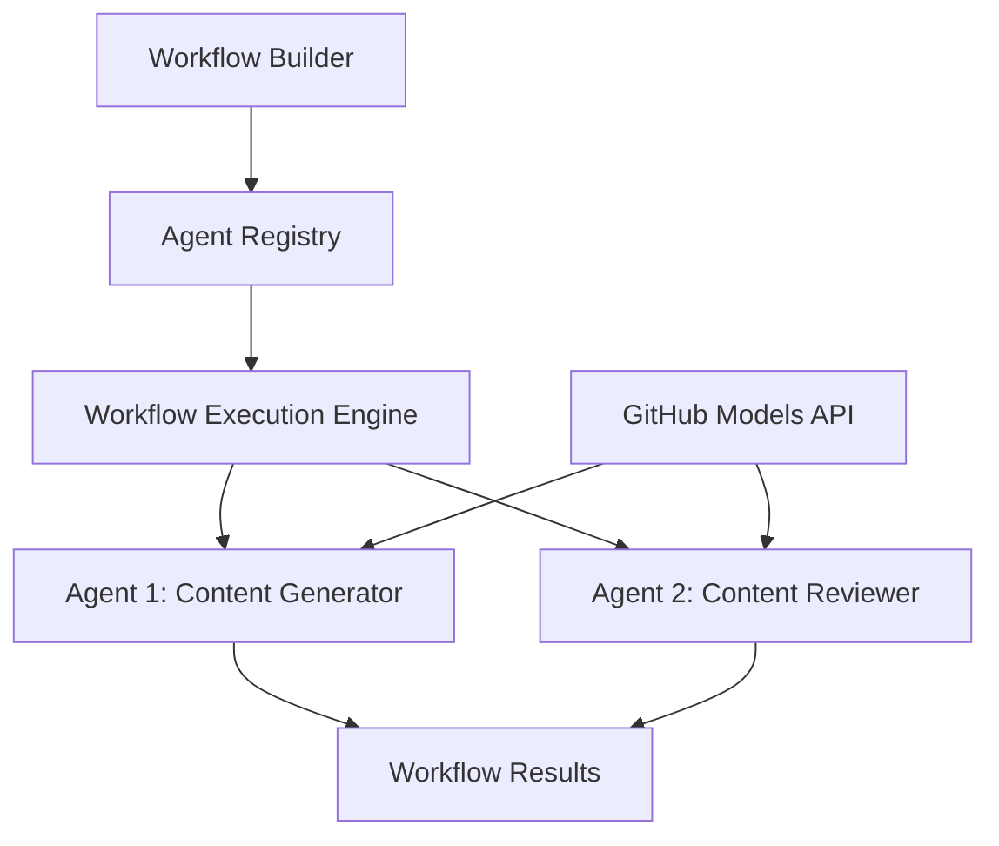

<!--
CO_OP_TRANSLATOR_METADATA:
{
  "original_hash": "034158688d0a45aae06dcbb21b0da5ae",
  "translation_date": "2025-11-11T12:44:30+00:00",
  "source_file": "08-multi-agent/code_samples/workflows-agent-framework/dotNET/01.dotnet-agent-framework-workflow-ghmodel-basic.md",
  "language_code": "hi"
}
-->
# 🔄 GitHub मॉडल्स (.NET) के साथ बेसिक एजेंट वर्कफ़्लो

## 📋 वर्कफ़्लो ऑर्केस्ट्रेशन ट्यूटोरियल

यह नोटबुक Microsoft Agent Framework for .NET और GitHub मॉडल्स का उपयोग करके उन्नत **एजेंट वर्कफ़्लो** बनाने का तरीका दिखाती है। आप सीखेंगे कि कैसे AI एजेंटों को सहयोगात्मक रूप से जटिल कार्यों को पूरा करने के लिए संरचित ऑर्केस्ट्रेशन पैटर्न के माध्यम से मल्टी-स्टेप बिजनेस प्रक्रियाएं बनाई जाएं।

## 🎯 सीखने के उद्देश्य

### 🏗️ **वर्कफ़्लो आर्किटेक्चर की मूल बातें**
- **वर्कफ़्लो बिल्डर**: जटिल मल्टी-स्टेप AI प्रक्रियाओं को डिज़ाइन और ऑर्केस्ट्रेट करें
- **एजेंट समन्वय**: वर्कफ़्लो में कई विशेष एजेंटों का समन्वय करें
- **GitHub मॉडल्स इंटीग्रेशन**: वर्कफ़्लो में GitHub के AI मॉडल इंफरेंस सेवा का उपयोग करें
- **विज़ुअल वर्कफ़्लो डिज़ाइन**: बेहतर समझ के लिए वर्कफ़्लो संरचनाओं को बनाएं और विज़ुअलाइज़ करें

### 🔄 **प्रक्रिया ऑर्केस्ट्रेशन पैटर्न**
- **क्रमिक प्रसंस्करण**: तार्किक क्रम में कई एजेंट कार्यों को जोड़ें
- **स्टेट मैनेजमेंट**: वर्कफ़्लो चरणों के बीच संदर्भ और डेटा प्रवाह बनाए रखें
- **त्रुटि प्रबंधन**: मजबूत त्रुटि पुनर्प्राप्ति और वर्कफ़्लो लचीलापन लागू करें
- **प्रदर्शन अनुकूलन**: एंटरप्राइज़-स्तरीय संचालन के लिए कुशल वर्कफ़्लो डिज़ाइन करें

### 🏢 **एंटरप्राइज़ वर्कफ़्लो अनुप्रयोग**
- **बिजनेस प्रक्रिया ऑटोमेशन**: जटिल संगठनात्मक वर्कफ़्लो को स्वचालित करें
- **कंटेंट प्रोडक्शन पाइपलाइन**: समीक्षा और अनुमोदन चरणों के साथ संपादकीय वर्कफ़्लो
- **कस्टमर सर्विस ऑटोमेशन**: मल्टी-स्टेप ग्राहक पूछताछ समाधान
- **डेटा प्रोसेसिंग वर्कफ़्लो**: AI-संचालित ट्रांसफॉर्मेशन के साथ ETL वर्कफ़्लो

## ⚙️ आवश्यकताएँ और सेटअप

### 📦 **आवश्यक NuGet पैकेज**

यह वर्कफ़्लो प्रदर्शन कई प्रमुख .NET पैकेजों का उपयोग करता है:

```xml
<!-- Core AI Framework -->
<PackageReference Include="Microsoft.Extensions.AI" Version="9.9.0" />

<!-- Agent Framework (Local Development) -->
<!-- Microsoft.Agents.AI.dll - Core agent abstractions -->
<!-- Microsoft.Agents.AI.OpenAI.dll - OpenAI/GitHub Models integration -->

<!-- Configuration and Environment -->
<PackageReference Include="DotNetEnv" Version="3.1.1" />
```

### 🔑 **GitHub मॉडल्स कॉन्फ़िगरेशन**

**पर्यावरण सेटअप (.env फ़ाइल):**
```env
GITHUB_TOKEN=your_github_personal_access_token
GITHUB_ENDPOINT=https://models.inference.ai.azure.com
GITHUB_MODEL_ID=gpt-4o-mini
```

**GitHub मॉडल्स एक्सेस:**
1. GitHub मॉडल्स के लिए साइन अप करें (वर्तमान में प्रीव्यू में)
2. मॉडल एक्सेस अनुमतियों के साथ एक व्यक्तिगत एक्सेस टोकन जनरेट करें
3. ऊपर दिखाए गए अनुसार पर्यावरण वेरिएबल्स कॉन्फ़िगर करें

### 🏗️ **वर्कफ़्लो आर्किटेक्चर का अवलोकन**



**मुख्य घटक:**
- **WorkflowBuilder**: वर्कफ़्लो डिज़ाइन के लिए मुख्य ऑर्केस्ट्रेशन इंजन
- **AIAgent**: विशिष्ट क्षमताओं वाले व्यक्तिगत विशेष एजेंट
- **GitHub Models Client**: AI मॉडल इंफरेंस सेवा इंटीग्रेशन
- **Execution Context**: वर्कफ़्लो चरणों के बीच स्टेट और डेटा प्रवाह का प्रबंधन

## 🎨 **एंटरप्राइज़ वर्कफ़्लो डिज़ाइन पैटर्न**

### 📝 **कंटेंट प्रोडक्शन वर्कफ़्लो**
```
User Request → Content Generation → Quality Review → Final Output
```

### 🔍 **डॉक्यूमेंट प्रोसेसिंग पाइपलाइन**
```
Document Input → Analysis → Extraction → Validation → Structured Output
```

### 💼 **बिजनेस इंटेलिजेंस वर्कफ़्लो**
```
Data Collection → Processing → Analysis → Report Generation → Distribution
```

### 🤝 **कस्टमर सर्विस ऑटोमेशन**
```
Customer Inquiry → Classification → Processing → Response Generation → Follow-up
```

## 🏢 **एंटरप्राइज़ लाभ**

### 🎯 **विश्वसनीयता और स्केलेबिलिटी**
- **डिटर्मिनिस्टिक एक्सीक्यूशन**: सुसंगत, दोहराने योग्य वर्कफ़्लो परिणाम
- **त्रुटि पुनर्प्राप्ति**: वर्कफ़्लो के किसी भी चरण में विफलताओं का ग्रेसफुल हैंडलिंग
- **प्रदर्शन मॉनिटरिंग**: निष्पादन मेट्रिक्स और अनुकूलन अवसरों को ट्रैक करें
- **संसाधन प्रबंधन**: AI मॉडल संसाधनों का कुशल आवंटन और उपयोग

### 🔒 **सुरक्षा और अनुपालन**
- **सुरक्षित प्रमाणीकरण**: API एक्सेस के लिए GitHub टोकन-आधारित प्रमाणीकरण
- **ऑडिट ट्रेल्स**: वर्कफ़्लो निष्पादन और निर्णय बिंदुओं का पूरा लॉगिंग
- **एक्सेस कंट्रोल**: वर्कफ़्लो निष्पादन और मॉनिटरिंग के लिए ग्रैन्युलर अनुमतियाँ
- **डेटा गोपनीयता**: वर्कफ़्लो के दौरान संवेदनशील जानकारी का सुरक्षित हैंडलिंग

### 📊 **ऑब्ज़र्वेबिलिटी और प्रबंधन**
- **विज़ुअल वर्कफ़्लो डिज़ाइन**: प्रक्रिया प्रवाह और निर्भरताओं का स्पष्ट प्रतिनिधित्व
- **निष्पादन मॉनिटरिंग**: वर्कफ़्लो प्रगति और प्रदर्शन का रीयल-टाइम ट्रैकिंग
- **त्रुटि रिपोर्टिंग**: विस्तृत त्रुटि विश्लेषण और डिबगिंग क्षमताएँ
- **प्रदर्शन एनालिटिक्स**: अनुकूलन और क्षमता योजना के लिए मेट्रिक्स

चलो आपका पहला एंटरप्राइज़-रेडी AI वर्कफ़्लो बनाते हैं! 🚀

## 💻 कोड चलाना

पूरी कार्यान्वयन `01.dotnet-agent-framework-workflow-ghmodel-basic.cs` में उपलब्ध है। यह फ़ाइल निम्नलिखित को प्रदर्शित करती है:

1. **पर्यावरण कॉन्फ़िगरेशन** - `.env` फ़ाइल से GitHub मॉडल्स क्रेडेंशियल्स लोड करना
2. **OpenAI क्लाइंट सेटअप** - GitHub मॉडल्स एंडपॉइंट का उपयोग करने के लिए क्लाइंट कॉन्फ़िगर करना
3. **एजेंट निर्माण** - विशेष एजेंटों को परिभाषित करना (फ्रंट डेस्क और कंसीयर्ज)
4. **वर्कफ़्लो बिल्डर** - क्रमिक प्रसंस्करण के साथ मल्टी-एजेंट वर्कफ़्लो बनाना
5. **वर्कफ़्लो निष्पादन** - स्ट्रीमिंग परिणामों के साथ वर्कफ़्लो चलाना

### 🚀 उदाहरण चलाना

```bash
# Make the script executable (Unix/Linux/macOS)
chmod +x 01.dotnet-agent-framework-workflow-ghmodel-basic.cs

# Run the workflow
./01.dotnet-agent-framework-workflow-ghmodel-basic.cs
```

या Windows पर:
```powershell
dotnet run 01.dotnet-agent-framework-workflow-ghmodel-basic.cs
```

### 📝 अपेक्षित आउटपुट

वर्कफ़्लो:
1. आपकी यात्रा गंतव्य अनुरोध स्वीकार करेगा ("मैं पेरिस जाना चाहता हूँ")
2. फ्रंट डेस्क एजेंट प्रारंभिक सिफारिश प्रदान करेगा
3. कंसीयर्ज एजेंट सिफारिश की समीक्षा और सुधार करेगा
4. अंतिम आउटपुट पूरी बातचीत स्ट्रीम प्रदर्शित करेगा

### 🔧 कस्टमाइज़ेशन

आप वर्कफ़्लो को निम्नलिखित तरीकों से कस्टमाइज़ कर सकते हैं:
- एजेंट निर्देशों को संशोधित करके उनके व्यवहार को बदलें
- अधिक एजेंट जोड़ें ताकि जटिल मल्टी-स्टेप वर्कफ़्लो बनाया जा सके
- उपयोगकर्ता संदेश बदलें ताकि विभिन्न परिदृश्यों का परीक्षण किया जा सके
- वर्कफ़्लो एज को समायोजित करें ताकि विभिन्न निष्पादन पैटर्न बनाए जा सकें

---

<!-- CO-OP TRANSLATOR DISCLAIMER START -->
**अस्वीकरण**:  
यह दस्तावेज़ AI अनुवाद सेवा [Co-op Translator](https://github.com/Azure/co-op-translator) का उपयोग करके अनुवादित किया गया है। जबकि हम सटीकता के लिए प्रयास करते हैं, कृपया ध्यान दें कि स्वचालित अनुवाद में त्रुटियां या अशुद्धियां हो सकती हैं। मूल भाषा में दस्तावेज़ को आधिकारिक स्रोत माना जाना चाहिए। महत्वपूर्ण जानकारी के लिए, पेशेवर मानव अनुवाद की सिफारिश की जाती है। इस अनुवाद के उपयोग से उत्पन्न किसी भी गलतफहमी या गलत व्याख्या के लिए हम उत्तरदायी नहीं हैं।
<!-- CO-OP TRANSLATOR DISCLAIMER END -->