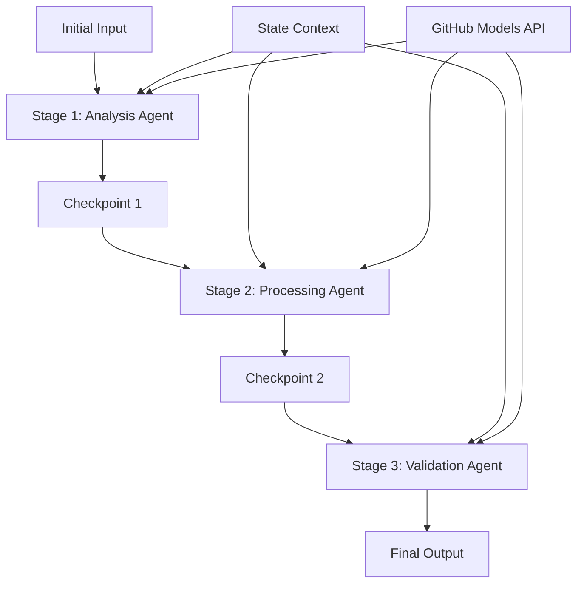

<!--
CO_OP_TRANSLATOR_METADATA:
{
  "original_hash": "1be9c8dcbd79a02d33d2c138684c1394",
  "translation_date": "2025-11-11T13:46:13+00:00",
  "source_file": "08-multi-agent/code_samples/workflows-agent-framework/dotNET/02.dotnet-agent-framework-workflow-ghmodel-sequential.md",
  "language_code": "hi"
}
-->
# ⏩ GitHub मॉडल्स (.NET) के साथ क्रमिक एजेंट वर्कफ़्लो

## 📋 उन्नत क्रमिक प्रोसेसिंग ट्यूटोरियल

यह नोटबुक Microsoft Agent Framework for .NET और GitHub Models का उपयोग करके **क्रमिक वर्कफ़्लो पैटर्न** प्रदर्शित करता है। आप सीखेंगे कि कैसे परिष्कृत, चरण-दर-चरण प्रोसेसिंग पाइपलाइनों का निर्माण करें, जहां एजेंट एक विशिष्ट क्रम में निष्पादित होते हैं, और प्रत्येक चरण पिछले चरण के परिणामों पर आधारित होता है।

## 🎯 सीखने के उद्देश्य

### 🔄 **क्रमिक प्रोसेसिंग आर्किटेक्चर**
- **लिनियर वर्कफ़्लो डिज़ाइन**: स्पष्ट निर्भरताओं के साथ चरण-दर-चरण प्रोसेसिंग पाइपलाइनों का निर्माण करें
- **स्टेट मैनेजमेंट**: क्रमिक वर्कफ़्लो चरणों के बीच संदर्भ और डेटा प्रवाह बनाए रखें
- **GitHub मॉडल्स इंटीग्रेशन**: .NET वर्कफ़्लो में GitHub के AI मॉडल्स का उपयोग करें
- **एंटरप्राइज़ पाइपलाइन पैटर्न**: उत्पादन-तैयार क्रमिक प्रोसेसिंग सिस्टम बनाएं

### 🏗️ **उन्नत क्रमिक पैटर्न**
- **स्टेज-गेट प्रोसेसिंग**: वर्कफ़्लो चरणों के बीच मान्यकरण चेकपॉइंट्स लागू करें
- **संदर्भ संरक्षण**: सभी चरणों में स्टेट और संचित ज्ञान बनाए रखें
- **त्रुटि प्रसार**: क्रमिक प्रोसेसिंग चेन में विफलताओं को सहजता से संभालें
- **प्रदर्शन अनुकूलन**: न्यूनतम ओवरहेड के साथ कुशल क्रमिक निष्पादन

### 🏢 **एंटरप्राइज़ क्रमिक अनुप्रयोग**
- **दस्तावेज़ प्रोसेसिंग पाइपलाइन**: बहु-चरण दस्तावेज़ विश्लेषण, परिवर्तन, और मान्यकरण
- **गुणवत्ता आश्वासन वर्कफ़्लो**: क्रमिक समीक्षा, मान्यकरण, और अनुमोदन प्रक्रियाएं
- **सामग्री उत्पादन पाइपलाइन**: शोध → लेखन → संपादन → समीक्षा → प्रकाशन
- **व्यावसायिक प्रक्रिया स्वचालन**: स्पष्ट चरण निर्भरताओं के साथ बहु-चरण व्यावसायिक वर्कफ़्लो

## ⚙️ आवश्यकताएँ और सेटअप

### 📦 **आवश्यक NuGet पैकेज**

.NET क्रमिक वर्कफ़्लो के लिए आवश्यक पैकेज:

```xml
<!-- Core AI Framework -->
<PackageReference Include="Microsoft.Extensions.AI" Version="9.9.0" />

<!-- Client Model Abstractions -->
<PackageReference Include="System.ClientModel" Version="1.6.1.0" />

<!-- Azure Identity and Async LINQ Support -->
<PackageReference Include="Azure.Identity" Version="1.15.0" />
<PackageReference Include="System.Linq.Async" Version="6.0.3" />

<!-- Local Agent Framework References -->
<!-- Microsoft.Agents.AI.dll - Core agent abstractions -->
<!-- Microsoft.Agents.AI.OpenAI.dll - GitHub Models integration -->
```

### 🔑 **GitHub मॉडल्स कॉन्फ़िगरेशन**

**पर्यावरण सेटअप (.env फ़ाइल):**
```env
GITHUB_TOKEN=your_github_personal_access_token
GITHUB_ENDPOINT=https://models.inference.ai.azure.com
GITHUB_MODEL_ID=gpt-4o-mini
```

**कॉन्फ़िगरेशन प्रबंधन:**
```csharp
// Load environment variables securely
Env.Load("../../../.env");
var githubToken = Environment.GetEnvironmentVariable("GITHUB_TOKEN");
var githubEndpoint = Environment.GetEnvironmentVariable("GITHUB_ENDPOINT");
var modelId = Environment.GetEnvironmentVariable("GITHUB_MODEL_ID");
```

### 🏗️ **क्रमिक वर्कफ़्लो आर्किटेक्चर**



**मुख्य घटक:**
- **क्रमिक एजेंट**: प्रत्येक प्रोसेसिंग चरण के लिए विशेष एजेंट
- **स्टेट संदर्भ**: चरणों के बीच संचित डेटा और निर्णय बनाए रखता है
- **चेकपॉइंट्स**: गुणवत्ता और स्थिरता सुनिश्चित करने के लिए चरणों के बीच मान्यकरण बिंदु
- **GitHub मॉडल्स क्लाइंट**: सभी वर्कफ़्लो चरणों में सुसंगत AI मॉडल एक्सेस

## 🎨 **क्रमिक वर्कफ़्लो डिज़ाइन पैटर्न**

### 📝 **दस्तावेज़ प्रोसेसिंग पाइपलाइन**
```
Raw Document → Content Extraction → Analysis → Validation → Structured Output
```

### 🎯 **सामग्री निर्माण वर्कफ़्लो**
```
Brief/Requirements → Research → Content Creation → Review → Final Polish
```

### 🔍 **गुणवत्ता आश्वासन पाइपलाइन**
```
Initial Review → Technical Validation → Compliance Check → Final Approval
```

### 💼 **व्यावसायिक बुद्धिमत्ता वर्कफ़्लो**
```
Data Collection → Processing → Analysis → Report Generation → Distribution
```

## 🏢 **एंटरप्राइज़ क्रमिक लाभ**

### 🎯 **विश्वसनीयता और गुणवत्ता**
- **निर्धारित प्रोसेसिंग**: संरचित चरणों के माध्यम से सुसंगत, दोहराने योग्य परिणाम
- **गुणवत्ता गेट्स**: प्रत्येक चरण में गुणवत्ता सुनिश्चित करने के लिए मान्यकरण चेकपॉइंट्स
- **त्रुटि अलगाव**: एक चरण में समस्याएं अगले चरणों में नहीं फैलतीं
- **ऑडिट ट्रेल्स**: प्रत्येक चरण में निर्णय और परिवर्तन का पूरा ट्रैकिंग

### 📈 **स्केलेबिलिटी और प्रदर्शन**
- **मॉड्यूलर डिज़ाइन**: प्रत्येक चरण को स्वतंत्र रूप से अनुकूलित किया जा सकता है
- **संसाधन प्रबंधन**: चरणों में AI मॉडल संसाधनों का कुशल आवंटन
- **स्टेट अनुकूलन**: इष्टतम प्रदर्शन के लिए चरणों के बीच न्यूनतम स्टेट ट्रांसफर
- **पैरेलल स्टेज ग्रुप्स**: कई क्रमिक वर्कफ़्लो समानांतर में चल सकते हैं

### 🔒 **सुरक्षा और अनुपालन**
- **चरण-स्तरीय सुरक्षा**: विभिन्न प्रोसेसिंग चरणों के लिए अलग-अलग सुरक्षा नीतियां
- **डेटा मान्यकरण**: प्रत्येक चेकपॉइंट पर डेटा अखंडता और अनुपालन सुनिश्चित करें
- **एक्सेस कंट्रोल**: विभिन्न वर्कफ़्लो चरणों के लिए ग्रैन्युलर अनुमतियां
- **नियामक अनुपालन**: संरचित प्रोसेसिंग के माध्यम से नियामक आवश्यकताओं को पूरा करें

### 📊 **मॉनिटरिंग और एनालिटिक्स**
- **चरण-स्तरीय मेट्रिक्स**: प्रत्येक वर्कफ़्लो चरण के लिए प्रदर्शन मॉनिटरिंग
- **बॉटलनेक पहचान**: धीमे चरणों की पहचान और अनुकूलन करें
- **गुणवत्ता मेट्रिक्स**: प्रत्येक चरण में गुणवत्ता और सफलता दर को ट्रैक करें
- **प्रक्रिया अनुकूलन**: चरण-स्तरीय एनालिटिक्स के आधार पर निरंतर सुधार

आइए मजबूत क्रमिक AI प्रोसेसिंग पाइपलाइनों का निर्माण करें! 🚀

## 💻 कोड चलाना

पूरी कार्यान्वयन `02.dotnet-agent-framework-workflow-ghmodel-sequential.cs` में उपलब्ध है। यह फ़ाइल **तीन-चरणीय फर्नीचर विश्लेषण वर्कफ़्लो** प्रदर्शित करती है:

1. **चरण 1 - सेल्स एजेंट**: फर्नीचर छवियों का विश्लेषण करता है और खरीद सुझाव प्रदान करता है
2. **चरण 2 - प्राइस एजेंट**: विस्तृत मूल्य निर्धारण ब्रेकडाउन और बजट विकल्प प्रदान करता है
3. **चरण 3 - कोट एजेंट**: Markdown प्रारूप में एक पेशेवर कोट दस्तावेज़ तैयार करता है

### 🏗️ **वर्कफ़्लो आर्किटेक्चर**

```
Image Input → Sales Analysis → Price Estimation → Quote Generation → Final Output
```

प्रत्येक एजेंट:
- पिछले चरण से आउटपुट को संदर्भ के रूप में प्राप्त करता है
- पिछले विश्लेषण पर विशेष विशेषज्ञता के साथ निर्माण करता है
- स्टेट मैनेजमेंट के माध्यम से वर्कफ़्लो निरंतरता बनाए रखता है

### 🚀 उदाहरण चलाना

**आवश्यकताएँ:**
- `../imgs/home.png` पर एक फर्नीचर छवि रखें (या `imgPath` वेरिएबल को अपडेट करें)
- अपने `.env` फ़ाइल को GitHub मॉडल्स क्रेडेंशियल्स के साथ कॉन्फ़िगर करें

```bash
# Make the script executable (Unix/Linux/macOS)
chmod +x 02.dotnet-agent-framework-workflow-ghmodel-sequential.cs

# Run the sequential workflow
./02.dotnet-agent-framework-workflow-ghmodel-sequential.cs
```

या Windows पर:
```powershell
dotnet run 02.dotnet-agent-framework-workflow-ghmodel-sequential.cs
```

### 📝 अपेक्षित आउटपुट

वर्कफ़्लो:
1. **सेल्स एजेंट**: छवि से फर्नीचर आइटम की पहचान करेगा और सिफारिशें प्रदान करेगा
2. **प्राइस एजेंट**: बजट स्तरों और खरीद सिफारिशों के साथ विस्तृत मूल्य विश्लेषण जोड़ देगा
3. **कोट एजेंट**: सभी जानकारी को संश्लेषित करके एक स्वरूपित कोट दस्तावेज़ तैयार करेगा

अंतिम आउटपुट छवि विश्लेषण पर आधारित एक व्यापक, पेशेवर फर्नीचर कोट होगा।

### 🔧 अनुकूलन विकल्प

**एजेंट व्यवहार संशोधित करें:**
```csharp
// Adjust agent instructions to change their focus
const string SalesAgentInstructions = "Your custom instructions...";
```

**क्रमिक प्रवाह बदलें:**
```csharp
// Add or reorder workflow stages
var workflow = new WorkflowBuilder(salesagent)
    .AddEdge(salesagent, priceagent)
    .AddEdge(priceagent, quoteagent)
    .AddEdge(quoteagent, newAgent)  // Add another stage
    .Build();
```

**अलग इनपुट का उपयोग करें:**
```csharp
// Process text instead of images
ChatMessage userMessage = new ChatMessage(ChatRole.User, [
    new TextContent("Analyze pricing for a modern living room set")
]);
```

### 🎯 वास्तविक दुनिया के अनुप्रयोग

यह क्रमिक पैटर्न आदर्श है:
- **ई-कॉमर्स**: उत्पाद विश्लेषण → मूल्य निर्धारण → कोट निर्माण
- **रियल एस्टेट**: संपत्ति विश्लेषण → मूल्यांकन → सूची निर्माण
- **बीमा**: दावा विश्लेषण → आकलन → कोट निर्माण
- **सामग्री निर्माण**: शोध → लेखन → संपादन → प्रकाशन

### 🔍 स्टेट फ्लो को समझना

क्रम में प्रत्येक एजेंट प्राप्त करता है:
- **मूल इनपुट**: प्रारंभिक उपयोगकर्ता संदेश (छवि + टेक्स्ट)
- **पिछले एजेंट आउटपुट**: वार्तालाप इतिहास में सभी पिछले एजेंट प्रतिक्रियाएं
- **संचित संदर्भ**: पूरे वर्कफ़्लो में बनाए रखा पूरा स्टेट

यह परिष्कृत बहु-चरणीय प्रोसेसिंग को सक्षम करता है, जहां प्रत्येक एजेंट पिछले सभी चरणों से व्यापक संदर्भ पर निर्माण करता है।

---

<!-- CO-OP TRANSLATOR DISCLAIMER START -->
**अस्वीकरण**:  
यह दस्तावेज़ AI अनुवाद सेवा [Co-op Translator](https://github.com/Azure/co-op-translator) का उपयोग करके अनुवादित किया गया है। जबकि हम सटीकता के लिए प्रयास करते हैं, कृपया ध्यान दें कि स्वचालित अनुवाद में त्रुटियां या अशुद्धियां हो सकती हैं। मूल भाषा में दस्तावेज़ को आधिकारिक स्रोत माना जाना चाहिए। महत्वपूर्ण जानकारी के लिए, पेशेवर मानव अनुवाद की सिफारिश की जाती है। इस अनुवाद के उपयोग से उत्पन्न किसी भी गलतफहमी या गलत व्याख्या के लिए हम उत्तरदायी नहीं हैं।
<!-- CO-OP TRANSLATOR DISCLAIMER END -->