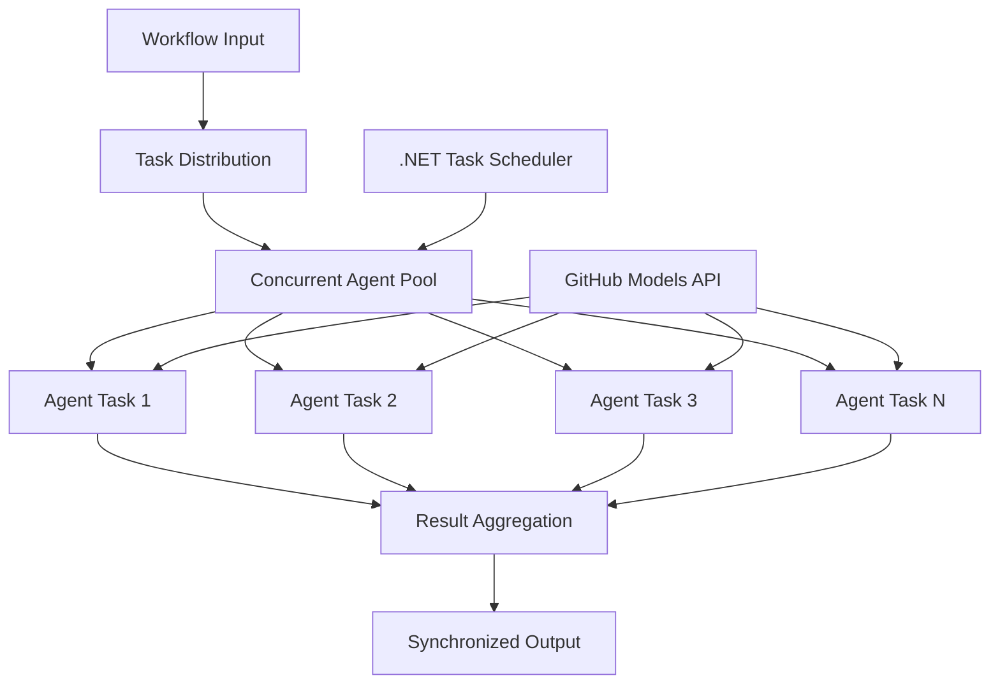

<!--
CO_OP_TRANSLATOR_METADATA:
{
  "original_hash": "b9c6e32c9b5f2fed20b6916984440d88",
  "translation_date": "2025-11-11T13:12:21+00:00",
  "source_file": "08-multi-agent/code_samples/workflows-agent-framework/dotNET/03.dotnet-agent-framework-workflow-ghmodel-concurrent.md",
  "language_code": "hi"
}
-->
# ⚡ GitHub मॉडल्स (.NET) के साथ समवर्ती एजेंट वर्कफ़्लो

## 📋 उच्च-प्रदर्शन समानांतर प्रसंस्करण ट्यूटोरियल

यह नोटबुक Microsoft Agent Framework for .NET और GitHub मॉडल्स का उपयोग करके **समवर्ती वर्कफ़्लो पैटर्न** को प्रदर्शित करता है। आप सीखेंगे कि कैसे उच्च-प्रदर्शन, समानांतर प्रसंस्करण वर्कफ़्लो बनाए जाएं जो कई AI एजेंटों को एक साथ निष्पादित करके थ्रूपुट को अधिकतम करें, जबकि समन्वय और डेटा स्थिरता बनाए रखें।

## 🎯 सीखने के उद्देश्य

### 🚀 **समवर्ती प्रसंस्करण की मूल बातें**
- **समानांतर एजेंट निष्पादन**: अधिकतम प्रदर्शन के लिए कई AI एजेंटों को एक साथ चलाएं
- **Async/Await पैटर्न**: .NET के असिंक्रोनस प्रोग्रामिंग मॉडल का उपयोग करके कुशल समवर्तीता प्राप्त करें
- **GitHub मॉडल्स इंटीग्रेशन**: GitHub के AI मॉडल इनफेरेंस सेवा के लिए कई समवर्ती कॉल्स का समन्वय करें
- **संसाधन प्रबंधन**: समवर्ती संचालन के दौरान AI मॉडल संसाधनों को कुशलतापूर्वक प्रबंधित करें

### 🏗️ **उन्नत समवर्ती वास्तुकला**
- **टास्क-आधारित समानांतरता**: .NET टास्क समानांतर लाइब्रेरी का उपयोग करके इष्टतम समवर्ती निष्पादन
- **सिंक्रोनाइज़ेशन पैटर्न**: समवर्ती एजेंटों का समन्वय करें और रेस कंडीशन से बचें
- **लोड बैलेंसिंग**: उपलब्ध समवर्ती प्रसंस्करण क्षमता के बीच कार्य को कुशलतापूर्वक वितरित करें
- **फॉल्ट टॉलरेंस**: पूरे वर्कफ़्लो को रोके बिना व्यक्तिगत एजेंट विफलताओं को संभालें

### 🏢 **एंटरप्राइज समवर्ती एप्लिकेशन**
- **उच्च-वॉल्यूम दस्तावेज़ प्रसंस्करण**: कई दस्तावेजों को एक साथ संसाधित करें
- **रियल-टाइम सामग्री विश्लेषण**: आने वाले डेटा स्ट्रीम का समवर्ती विश्लेषण
- **बैच प्रसंस्करण अनुकूलन**: बड़े पैमाने पर डेटा प्रसंस्करण संचालन के लिए थ्रूपुट को अधिकतम करें
- **मल्टी-मोडल विश्लेषण**: विभिन्न सामग्री प्रकारों और प्रारूपों का समानांतर प्रसंस्करण

## ⚙️ आवश्यकताएँ और सेटअप

### 📦 **आवश्यक NuGet पैकेज**

उच्च-प्रदर्शन समवर्ती वर्कफ़्लो के लिए आवश्यक पैकेज:

```xml
<!-- Core AI Framework with Async Support -->
<PackageReference Include="Microsoft.Extensions.AI" Version="9.9.0" />

<!-- Client Model Abstractions for API Communication -->
<PackageReference Include="System.ClientModel" Version="1.6.1.0" />

<!-- Azure Identity and Async LINQ for Advanced Operations -->
<PackageReference Include="Azure.Identity" Version="1.15.0" />
<PackageReference Include="System.Linq.Async" Version="6.0.3" />

<!-- Local Agent Framework References -->
<!-- Microsoft.Agents.AI.dll - Core agent abstractions with async support -->
<!-- Microsoft.Agents.AI.OpenAI.dll - GitHub Models integration with concurrency -->
```

### 🔑 **GitHub मॉडल्स कॉन्फ़िगरेशन**

**पर्यावरण सेटअप (.env फ़ाइल):**
```env
GITHUB_TOKEN=your_github_personal_access_token
GITHUB_ENDPOINT=https://models.inference.ai.azure.com
GITHUB_MODEL_ID=gpt-4o-mini
```

**समवर्ती प्रसंस्करण विचार:**
```csharp
// Configure for concurrent operations
var clientOptions = new OpenAIClientOptions()
{
    Endpoint = new Uri(githubEndpoint),
    // Configure connection pooling for concurrent requests
    NetworkTimeout = TimeSpan.FromMinutes(5)
};
```

### 🏗️ **समवर्ती वर्कफ़्लो वास्तुकला**



**मुख्य घटक:**
- **टास्क समानांतर लाइब्रेरी**: .NET का अंतर्निहित समर्थन समवर्ती संचालन के लिए
- **एजेंट पूल**: समानांतर प्रसंस्करण के लिए कई एजेंट इंस्टेंस
- **परिणाम समेकन**: समवर्ती एजेंट परिणामों का समन्वय और विलय
- **सिंक्रोनाइज़ेशन पॉइंट्स**: समवर्ती संचालन के दौरान डेटा स्थिरता सुनिश्चित करें

## 🎨 **समवर्ती वर्कफ़्लो डिज़ाइन पैटर्न**

### 🔍 **समानांतर अनुसंधान और विश्लेषण**
```
Research Topic → Concurrent Research Agents → Result Synthesis → Final Report
```

### 📊 **मल्टी-सोर्स डेटा प्रसंस्करण**
```
Data Sources → Parallel Processing Agents → Data Integration → Unified Output
```

### 🎭 **सामग्री निर्माण पाइपलाइन**
```
Content Requirements → Concurrent Content Generators → Quality Review → Final Content
```

### 🔄 **फैन-आउट/फैन-इन प्रसंस्करण**
```
Single Input → Multiple Concurrent Processors → Result Aggregation → Single Output
```

## 🏢 **एंटरप्राइज प्रदर्शन लाभ**

### ⚡ **थ्रूपुट और स्केलेबिलिटी**
- **लिनियर प्रदर्शन स्केलिंग**: अधिक थ्रूपुट बढ़ाने के लिए अधिक समवर्ती एजेंट जोड़ें
- **संसाधन उपयोग**: उपलब्ध AI मॉडल क्षमता की अधिकतम दक्षता
- **प्रसंस्करण समय में कमी**: समानांतर निष्पादन के माध्यम से महत्वपूर्ण समय की बचत
- **इलास्टिक स्केलिंग**: कार्यभार के आधार पर समवर्ती एजेंट संख्या को गतिशील रूप से समायोजित करें

### 🛡️ **विश्वसनीयता और लचीलापन**
- **फॉल्ट आइसोलेशन**: व्यक्तिगत एजेंट विफलताओं का अन्य समवर्ती संचालन पर प्रभाव नहीं पड़ता
- **ग्रेसफुल डिग्रेडेशन**: सिस्टम कम एजेंट क्षमता के साथ संचालन जारी रखता है
- **त्रुटि पुनर्प्राप्ति**: विफल समवर्ती संचालन के लिए स्वचालित पुनः प्रयास तंत्र
- **लोड वितरण**: उपलब्ध एजेंटों के बीच कार्य का समान वितरण

### 📊 **प्रदर्शन निगरानी**
- **समवर्ती निष्पादन मेट्रिक्स**: सभी समानांतर संचालन के प्रदर्शन को ट्रैक करें
- **संसाधन उपयोग विश्लेषण**: CPU, मेमोरी, और नेटवर्क उपयोग की निगरानी करें
- **थ्रूपुट विश्लेषण**: समवर्ती प्रसंस्करण से दक्षता लाभ को मापें
- **बॉटलनेक डिटेक्शन**: प्रदर्शन बाधाओं की पहचान करें और उन्हें हल करें

### 🔧 **विकास और संचालन**
- **Async प्रोग्रामिंग मॉडल**: .NET के परिपक्व async/await पैटर्न का उपयोग करें
- **टास्क समन्वय**: अंतर्निहित टास्क प्रबंधन और समन्वय क्षमताएँ
- **अपवाद हैंडलिंग**: समवर्ती संचालन के लिए व्यापक त्रुटि हैंडलिंग
- **डिबगिंग समर्थन**: समवर्ती वर्कफ़्लो के लिए Visual Studio डिबगिंग टूल्स

आइए .NET के साथ उच्च-प्रदर्शन समवर्ती AI वर्कफ़्लो बनाएं! 🚀

## 💻 कोड चलाना

पूर्ण कार्यान्वयन `03.dotnet-agent-framework-workflow-ghmodel-concurrent.cs` में उपलब्ध है। यह फ़ाइल यात्रा योजना के लिए **फैन-आउट/फैन-इन समवर्ती वर्कफ़्लो** को प्रदर्शित करती है:

### 🏗️ **वर्कफ़्लो वास्तुकला**

```
User Request → ConcurrentStartExecutor → [Researcher Agent || Planner Agent] → ConcurrentAggregationExecutor → Final Output
```

**मुख्य घटक:**

1. **ConcurrentStartExecutor**: उपयोगकर्ता अनुरोध को सभी एजेंटों को एक साथ प्रसारित करता है
2. **Researcher Agent**: गंतव्यों और आकर्षणों का समानांतर विश्लेषण करता है
3. **Planner Agent**: विस्तृत यात्रा योजनाएँ समानांतर में बनाता है
4. **ConcurrentAggregationExecutor**: दोनों एजेंटों से परिणाम एकत्र करता है और उन्हें विलय करता है

### 🎯 **फैन-आउट/फैन-इन पैटर्न**

यह वर्कफ़्लो क्लासिक **फैन-आउट/फैन-इन** पैटर्न को प्रदर्शित करता है:
- **फैन-आउट**: एक इनपुट संदेश को एक साथ कई एजेंटों को प्रसारित किया जाता है
- **समवर्ती प्रसंस्करण**: कई एजेंट एक ही कार्य पर समानांतर में काम करते हैं
- **फैन-इन**: सभी एजेंटों से परिणाम एकत्र किए जाते हैं और एकल आउटपुट में समेकित किए जाते हैं

### 🚀 उदाहरण चलाना

```bash
# Make the script executable (Unix/Linux/macOS)
chmod +x 03.dotnet-agent-framework-workflow-ghmodel-concurrent.cs

# Run the concurrent workflow
./03.dotnet-agent-framework-workflow-ghmodel-concurrent.cs
```

या Windows पर:
```powershell
dotnet run 03.dotnet-agent-framework-workflow-ghmodel-concurrent.cs
```

### 📝 अपेक्षित आउटपुट

वर्कफ़्लो निम्नलिखित करेगा:
1. **अनुरोध प्रसारण**: "दिसंबर में सिएटल की यात्रा की योजना बनाएं" दोनों एजेंटों को भेजें
2. **समवर्ती प्रसंस्करण**: दोनों एजेंट एक साथ काम करेंगे:
   - रिसर्चर आकर्षण और विवरण की पहचान करेगा
   - प्लानर यात्रा कार्यक्रम और लॉजिस्टिक्स बनाएगा
3. **समेकन**: दोनों प्रतिक्रियाओं को व्यापक आउटपुट में संयोजित करें
4. **परिणाम प्रदर्शित करें**: सभी जानकारी के साथ विलय यात्रा योजना दिखाएं

### 🔧 अनुकूलन विकल्प

**अधिक समवर्ती एजेंट जोड़ें:**
```csharp
// Create additional specialized agents
AIAgent budgetAgent = openAIClient.GetChatClient(github_model_id).CreateAIAgent(
    name: "Budget-Agent", instructions: "Calculate travel costs...");

// Add to fan-out
var workflow = new WorkflowBuilder(startExecutor)
    .AddFanOutEdge(startExecutor, targets: [researcherAgent, plannerAgent, budgetAgent])
    .AddFanInEdge(aggregationExecutor, sources: [researcherAgent, plannerAgent, budgetAgent])
    .WithOutputFrom(aggregationExecutor)
    .Build();

// Update aggregation count
if (this._messages.Count == 3) { ... }
```

**एजेंट निर्देश संशोधित करें:**
```csharp
const string ResearcherAgentInstructions = "Your custom instructions for research...";
const string PlanAgentInstructions = "Your custom instructions for planning...";
```

**कार्य बदलें:**
```csharp
StreamingRun run = await InProcessExecution.StreamAsync(
    workflow, 
    "Plan a European vacation for 2 weeks in summer"
);
```

### 🎯 वास्तविक दुनिया के अनुप्रयोग

यह समवर्ती पैटर्न आदर्श है:
- **सामग्री निर्माण**: विभिन्न अनुभागों को एक साथ बनाने वाले कई लेखक
- **कोड समीक्षा**: विभिन्न दृष्टिकोणों से कोड का विश्लेषण करने वाले कई समीक्षक
- **बाजार अनुसंधान**: विभिन्न बाजार खंडों का समानांतर विश्लेषण
- **दस्तावेज़ प्रसंस्करण**: समानांतर निष्कर्षण, विश्लेषण, और सत्यापन
- **मल्टी-पर्सपेक्टिव विश्लेषण**: एक ही इनपुट पर विविध दृष्टिकोण प्राप्त करना

### 🔍 कस्टम एग्जीक्यूटर्स को समझना

**ConcurrentStartExecutor:**
- `IMessageHandler<string>` को लागू करता है ताकि स्ट्रिंग इनपुट स्वीकार किया जा सके
- सभी जुड़े एजेंटों को संदेश प्रसारित करता है
- समवर्ती प्रसंस्करण को ट्रिगर करने के लिए `TurnToken` भेजता है

**ConcurrentAggregationExecutor:**
- `IMessageHandler<ChatMessage>` को लागू करता है ताकि एजेंट प्रतिक्रियाएँ प्राप्त की जा सकें
- थ्रेड-सुरक्षित तरीके से संदेश एकत्र करता है
- जब सभी अपेक्षित प्रतिक्रियाएँ आती हैं तो समेकित करता है
- `context.YieldOutputAsync()` का उपयोग करके अंतिम आउटपुट देता है

### ⚡ प्रदर्शन लाभ

**समवर्ती बनाम अनुक्रमिक:**
- अनुक्रमिक: Agent1 (30s) → Agent2 (30s) = **कुल 60 सेकंड**
- समवर्ती: Agent1 (30s) || Agent2 (30s) = **कुल 30 सेकंड**

**थ्रूपुट सुधार**: कार्यभार और संसाधनों के आधार पर N समवर्ती एजेंटों के लिए N× तेज़

### 🛡️ त्रुटि हैंडलिंग

वर्कफ़्लो व्यक्तिगत एजेंट विफलताओं को सहजता से संभालता है:
- यदि एक एजेंट विफल होता है, तो अन्य प्रसंस्करण जारी रखते हैं
- एग्रीगेटर टाइमआउट लॉजिक लागू कर सकता है
- यदि आवश्यक हो तो आंशिक परिणाम लौटाए जा सकते हैं

### 📊 उन्नत सुविधाएँ

**डायनामिक एजेंट संख्या:**
एग्रीगेशन लॉजिक को परिवर्तनीय एजेंट संख्या का समर्थन करने के लिए संशोधित करें:

```csharp
private int _expectedAgentCount;
private readonly List<ChatMessage> _messages = [];

public async ValueTask HandleAsync(ChatMessage message, IWorkflowContext context)
{
    this._messages.Add(message);
    if (this._messages.Count == _expectedAgentCount)
    {
        // Process aggregation
    }
}
```

यह समवर्ती वर्कफ़्लो पैटर्न उच्च-प्रदर्शन, स्केलेबल AI एजेंट सिस्टम बनाने के लिए आवश्यक है!

---

<!-- CO-OP TRANSLATOR DISCLAIMER START -->
**अस्वीकरण**:  
यह दस्तावेज़ AI अनुवाद सेवा [Co-op Translator](https://github.com/Azure/co-op-translator) का उपयोग करके अनुवादित किया गया है। जबकि हम सटीकता के लिए प्रयास करते हैं, कृपया ध्यान दें कि स्वचालित अनुवाद में त्रुटियां या अशुद्धियां हो सकती हैं। मूल भाषा में दस्तावेज़ को आधिकारिक स्रोत माना जाना चाहिए। महत्वपूर्ण जानकारी के लिए, पेशेवर मानव अनुवाद की सिफारिश की जाती है। इस अनुवाद के उपयोग से उत्पन्न किसी भी गलतफहमी या गलत व्याख्या के लिए हम उत्तरदायी नहीं हैं।
<!-- CO-OP TRANSLATOR DISCLAIMER END -->