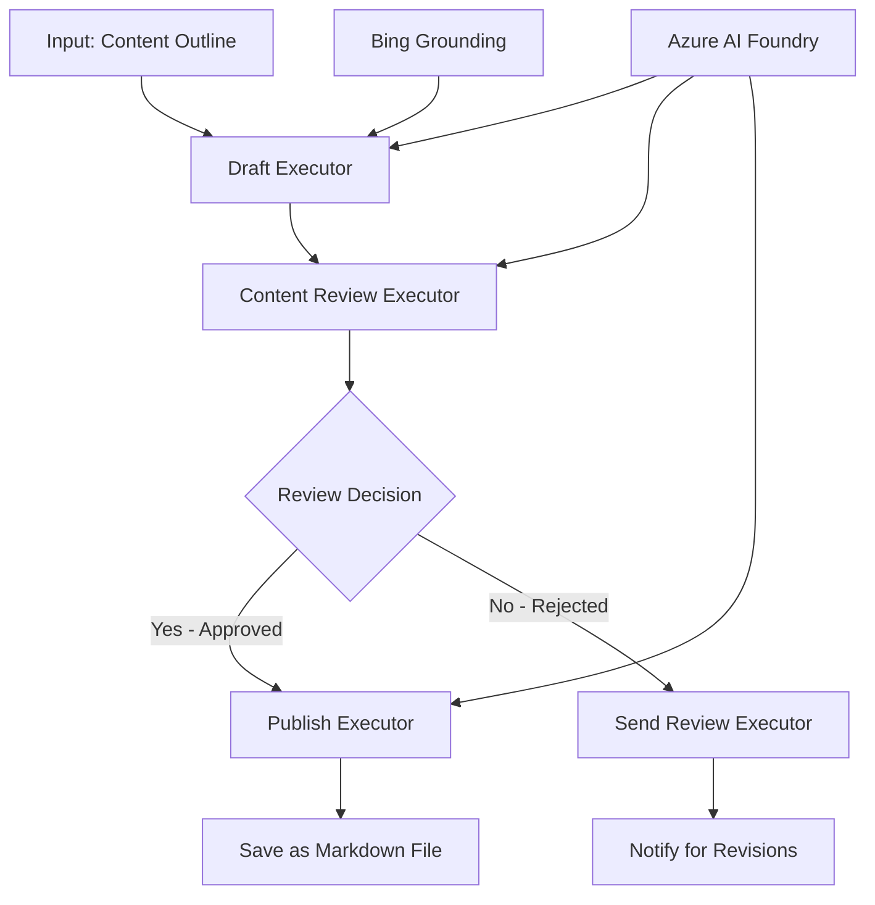

<!--
CO_OP_TRANSLATOR_METADATA:
{
  "original_hash": "8abd335151cee553293b637ee3d80d10",
  "translation_date": "2025-11-11T12:08:27+00:00",
  "source_file": "08-multi-agent/code_samples/workflows-agent-framework/dotNET/04.dotnet-agent-framework-workflow-aifoundry-condition.md",
  "language_code": "hi"
}
-->
# 🔀 Azure AI Foundry (.NET) के साथ सशर्त एजेंट वर्कफ़्लो

## 📋 बुद्धिमान निर्णय-आधारित वर्कफ़्लो ट्यूटोरियल

यह नोटबुक Azure AI Foundry और Microsoft Agent Framework for .NET का उपयोग करके **सशर्त वर्कफ़्लो पैटर्न** प्रदर्शित करता है। आप सीखेंगे कि कैसे AI विश्लेषण, व्यावसायिक नियमों और गतिशील परिस्थितियों के आधार पर प्रोसेसिंग को बुद्धिमानी से रूट करने वाले परिष्कृत, निर्णय-आधारित वर्कफ़्लो बनाएं।

## 🎯 सीखने के उद्देश्य

### 🧠 **बुद्धिमान निर्णय वास्तुकला**
- **सशर्त लॉजिक कार्यान्वयन**: कई शाखाओं वाले जटिल निर्णय पेड़ बनाएं
- **AI-संचालित रूटिंग**: Azure AI Foundry मॉडल का उपयोग करके बुद्धिमान रूटिंग निर्णय लें
- **गतिशील वर्कफ़्लो अनुकूलन**: रनटाइम विश्लेषण और परिस्थितियों के आधार पर वर्कफ़्लो व्यवहार को संशोधित करें
- **व्यावसायिक नियम एकीकरण**: वर्कफ़्लो में व्यावसायिक लॉजिक और अनुपालन आवश्यकताओं को शामिल करें

### 🔀 **उन्नत सशर्त पैटर्न**
- **मल्टी-क्राइटेरिया निर्णय लेना**: रूटिंग निर्णयों के लिए कई कारकों का मूल्यांकन करें
- **संदर्भ-सचेत प्रोसेसिंग**: संचित वर्कफ़्लो संदर्भ और इतिहास के आधार पर निर्णय लें
- **अनुकूलन योग्य वर्कफ़्लो संशोधन**: वास्तविक समय की परिस्थितियों के आधार पर प्रोसेसिंग पथ को गतिशील रूप से समायोजित करें
- **नियम इंजन एकीकरण**: वर्कफ़्लो में परिष्कृत व्यावसायिक नियम इंजन लागू करें

### 🏢 **एंटरप्राइज़ सशर्त अनुप्रयोग**
- **दस्तावेज़ वर्गीकरण और रूटिंग**: दस्तावेज़ों को स्वचालित रूप से उपयुक्त वर्कफ़्लो में वर्गीकृत और रूट करें
- **ग्राहक सेवा ट्रायेज**: ग्राहक पूछताछ को विशेष हैंडलिंग टीमों तक बुद्धिमानी से रूट करें
- **अनुपालन और जोखिम प्रोसेसिंग**: जोखिम आकलन के आधार पर विभिन्न सत्यापन और समीक्षा प्रक्रियाओं को लागू करें
- **गुणवत्ता आश्वासन वर्कफ़्लो**: गुणवत्ता मेट्रिक्स के आधार पर सामग्री को उपयुक्त समीक्षा प्रक्रियाओं के माध्यम से रूट करें

## ⚙️ आवश्यकताएँ और सेटअप

### 📦 **आवश्यक NuGet पैकेज**

सशर्त वर्कफ़्लो प्रोसेसिंग के लिए उन्नत पैकेज:

```xml
<!-- Core AI Framework -->
<PackageReference Include="Microsoft.Extensions.AI" Version="9.9.0" />

<!-- Azure AI Agents with Persistent State -->
<PackageReference Include="Azure.AI.Agents.Persistent" Version="1.2.0-beta.5" />

<!-- Azure Identity and Utilities -->
<PackageReference Include="Azure.Identity" Version="1.15.0" />
<PackageReference Include="System.Linq.Async" Version="6.0.3" />
<PackageReference Include="DotNetEnv" Version="3.1.1" />

<!-- Local Workflow Framework References -->
<!-- Microsoft.Agents.Workflows.dll - Advanced workflow orchestration -->
<!-- Microsoft.Agents.AI.AzureAI.dll - Azure AI Foundry integration -->
<!-- Microsoft.Agents.AI.dll - Core agent abstractions -->
```

### 🔑 **Azure AI Foundry कॉन्फ़िगरेशन**

**आवश्यक Azure संसाधन:**
- सशर्त प्रोसेसिंग मॉडल के साथ Azure AI Foundry कार्यक्षेत्र
- उपयुक्त कंप्यूट कोटा और अनुमतियों के साथ Azure सब्सक्रिप्शन
- निर्णय लेने और सामग्री विश्लेषण के लिए तैनात AI मॉडल
- (वैकल्पिक) ग्राउंडिंग क्षमताओं के लिए Bing Search API कनेक्शन

**पर्यावरण कॉन्फ़िगरेशन (.env फ़ाइल):**
```env
# Azure AI Foundry Configuration
AZURE_AI_PROJECT_ENDPOINT=https://your-project.cognitiveservices.azure.com/
BING_CONNECTION_ID=your-bing-connection-id
```

**प्रमाणीकरण सेटअप:**
```csharp
// Azure CLI or Managed Identity authentication
using Azure.Identity;
var credential = new AzureCliCredential();

// Load environment configuration
DotNetEnv.Env.Load("../../../.env");
```

### 🏗️ **सशर्त वर्कफ़्लो वास्तुकला**



**मुख्य घटक:**
- **Draft Executor**: AI एजेंट जो रूपरेखा से प्रारंभिक सामग्री ड्राफ्ट बनाता है
- **Content Review Executor**: AI एजेंट जो ड्राफ्ट की गुणवत्ता और अनुपालन का मूल्यांकन करता है
- **सशर्त रूटिंग**: समीक्षा परिणामों के आधार पर निर्णय लॉजिक जो रूट करता है
- **प्रकाशन/समीक्षा पथ**: स्वीकृत बनाम अस्वीकृत सामग्री के लिए अलग-अलग प्रोसेसिंग पथ
- **राज्य प्रबंधन**: वर्कफ़्लो के दौरान सामग्री और समीक्षा संदर्भ बनाए रखता है

## 🎨 **सशर्त वर्कफ़्लो डिज़ाइन पैटर्न**

### 📋 **गुणवत्ता गेट्स के साथ सामग्री उत्पादन**
```
Outline → Draft Creation → Quality Review → {Approve: Publish | Reject: Revise}
```

### 🎯 **जोखिम-आधारित दस्तावेज़ प्रोसेसिंग**
```
Document → Risk Assessment → {Low: Standard | High: Enhanced Review}
```

### 🔍 **बुद्धिमान ग्राहक सेवा रूटिंग**
```
Customer Query → Analysis → {Simple: FAQ Bot | Complex: Human Agent}
```

### 💼 **अनुपालन-संचालित वर्कफ़्लो**
```
Content → Compliance Check → {Pass: Publish | Fail: Legal Review}
```

## 🏢 **एंटरप्राइज़ सशर्त लाभ**

### 🎯 **बुद्धिमान स्वचालन**
- **स्मार्ट निर्णय लेना**: सामग्री विश्लेषण और संदर्भ के आधार पर AI-संचालित रूटिंग निर्णय
- **अनुकूलन योग्य प्रोसेसिंग**: बदलती परिस्थितियों के आधार पर स्वचालित रूप से समायोजित वर्कफ़्लो
- **व्यावसायिक नियम प्रवर्तन**: जटिल व्यावसायिक लॉजिक और नीतियों का स्वचालित अनुप्रयोग
- **संदर्भ-सचेत रूटिंग**: पूर्ण वर्कफ़्लो इतिहास और संचित संदर्भ के आधार पर निर्णय

### 📈 **संचालन उत्कृष्टता**
- **संसाधन आवंटन का अनुकूलन**: कार्य को सबसे उपयुक्त विशेषज्ञों और प्रक्रियाओं तक रूट करें
- **मैनुअल हस्तक्षेप में कमी**: स्वचालित निर्णय लेने से मानव रूटिंग की आवश्यकता कम होती है
- **तेज समाधान समय**: उपयुक्त विशेषज्ञता और प्रोसेसिंग क्षमताओं तक सीधा रूटिंग
- **संगत अनुप्रयोग**: व्यावसायिक नियमों और निर्णय मानदंडों का समान अनुप्रयोग

### 🛡️ **जोखिम प्रबंधन और अनुपालन**
- **स्वचालित जोखिम आकलन**: सामग्री और स्थिति जोखिम स्तरों का AI-संचालित मूल्यांकन
- **अनुपालन प्रवर्तन**: आवश्यक नियामक प्रक्रियाओं के माध्यम से स्वचालित रूटिंग
- **सुरक्षा प्रोटोकॉल अनुप्रयोग**: जोखिम आकलन के आधार पर उन्नत सुरक्षा उपाय लागू
- **ऑडिट ट्रेल रखरखाव**: रूटिंग निर्णयों और तर्क का पूरा दस्तावेज़ीकरण

### 📊 **विश्लेषण और निरंतर सुधार**
- **निर्णय विश्लेषण**: रूटिंग निर्णयों की प्रभावशीलता और सटीकता को ट्रैक करें
- **पैटर्न पहचान**: समय के साथ रूटिंग निर्णयों में रुझान और पैटर्न की पहचान करें
- **प्रदर्शन अनुकूलन**: निर्णय मानदंड और रूटिंग दक्षता में निरंतर सुधार
- **व्यावसायिक बुद्धिमत्ता**: सामग्री विशेषताओं और प्रोसेसिंग आवश्यकताओं में अंतर्दृष्टि

### 🔧 **तकनीकी उत्कृष्टता**
- **स्थायी राज्य प्रबंधन**: वर्कफ़्लो निष्पादन के दौरान जटिल राज्य बनाए रखें
- **स्केलेबल वास्तुकला**: उच्च-वॉल्यूम सशर्त प्रोसेसिंग आवश्यकताओं को संभालें
- **एकीकरण क्षमताएँ**: मौजूदा व्यावसायिक प्रणालियों और प्रक्रियाओं के साथ सहज एकीकरण
- **निगरानी और अवलोकन**: वर्कफ़्लो प्रदर्शन और निर्णयों की व्यापक ट्रैकिंग

चलो .NET के साथ बुद्धिमान, निर्णय-आधारित एंटरप्राइज़ वर्कफ़्लो बनाते हैं! 🚀

## 💻 कोड चलाना

पूर्ण कार्यान्वयन `04.dotnet-agent-framework-workflow-aifoundry-condition.cs` में उपलब्ध है। यह **गुणवत्ता गेट्स के साथ सामग्री उत्पादन वर्कफ़्लो** प्रदर्शित करता है:

### 🏗️ **वर्कफ़्लो वास्तुकला**

```
Content Outline → Draft Creation → Quality Review → Conditional Routing:
                                                      ├─ Approved (>200 words) → Publish
                                                      └─ Rejected (<200 words) → Review Notification
```

**वर्कफ़्लो में एजेंट:**
1. **Evangelist Agent**: Bing ग्राउंडिंग के साथ रूपरेखा से ट्यूटोरियल ड्राफ्ट बनाता है
2. **Content Reviewer Agent**: ड्राफ्ट गुणवत्ता का मूल्यांकन करता है (शब्द गणना, पूर्णता)
3. **Publisher Agent**: स्वीकृत सामग्री को टाइमस्टैम्प किए गए Markdown फ़ाइलों के रूप में सहेजता है

**कस्टम Executors:**
1. **DraftExecutor**: ड्राफ्ट निर्माण का समन्वय करता है
2. **ContentReviewExecutor**: गुणवत्ता मूल्यांकन करता है
3. **PublishExecutor**: स्वीकृत सामग्री प्रकाशन को संभालता है
4. **SendReviewExecutor**: अस्वीकृत सामग्री सूचनाओं का प्रबंधन करता है

### 🚀 उदाहरण चलाना

**आवश्यकताएँ:**
- कॉन्फ़िगर किया गया Azure AI Foundry कार्यक्षेत्र
- Azure CLI प्रमाणीकरण (`az login`)
- (वैकल्पिक) ग्राउंडिंग के लिए Bing Search कनेक्शन

```bash
# Make the script executable (Unix/Linux/macOS)
chmod +x 04.dotnet-agent-framework-workflow-aifoundry-condition.cs

# Run the conditional workflow
./04.dotnet-agent-framework-workflow-aifoundry-condition.cs
```

या Windows पर:
```powershell
dotnet run 04.dotnet-agent-framework-workflow-aifoundry-condition.cs
```

### 📝 अपेक्षित आउटपुट

वर्कफ़्लो:
1. **एजेंट बनाएं**: तीन विशेष Azure AI Foundry एजेंट प्रारंभ करें
2. **ड्राफ्ट बनाएं**: Evangelist एजेंट रूपरेखा से ट्यूटोरियल ड्राफ्ट बनाता है
3. **समीक्षा सामग्री**: Content Reviewer ड्राफ्ट गुणवत्ता का मूल्यांकन करता है
4. **सशर्त रूटिंग**:
   - **यदि स्वीकृत (>200 शब्द)**: Publish Executor Markdown फ़ाइल के रूप में सहेजता है
   - **यदि अस्वीकृत (<200 शब्द)**: समीक्षा सूचना भेजें
5. **परिणाम प्रदर्शित करें**: अंतिम वर्कफ़्लो परिणाम दिखाएं

### 🔧 अनुकूलन विकल्प

**समीक्षा मानदंड संशोधित करें:**
```csharp
const string ContentReviewerInstructions = @"
You are a content reviewer...
1. Check if content is more than 500 words (instead of 200)
2. Verify technical accuracy
3. Ensure proper formatting
...";
```

**अधिक सशर्त पथ जोड़ें:**
```csharp
var workflow = new WorkflowBuilder(draftExecutor)
    .AddEdge(draftExecutor, contentReviewerExecutor)
    .AddEdge(contentReviewerExecutor, publishExecutor, condition: GetCondition("Excellent"))
    .AddEdge(contentReviewerExecutor, editExecutor, condition: GetCondition("Good"))
    .AddEdge(contentReviewerExecutor, sendReviewerExecutor, condition: GetCondition("Poor"))
    .Build();
```

**सामग्री आवश्यकताओं को बदलें:**
```csharp
string OUTLINE_Content = @"
# Your Custom Topic
## Section 1
https://your-reference-url
## Section 2
...
";
```

### 🎯 वास्तविक दुनिया के अनुप्रयोग

यह सशर्त वर्कफ़्लो पैटर्न आदर्श है:
- **सामग्री प्रबंधन प्रणाली**: गुणवत्ता गेट्स के साथ स्वचालित संपादकीय वर्कफ़्लो
- **दस्तावेज़ प्रोसेसिंग**: वर्गीकरण और अनुपालन के आधार पर दस्तावेज़ रूट करें
- **ग्राहक सहायता**: जटिलता और तात्कालिकता के आधार पर बुद्धिमान टिकट रूटिंग
- **कानूनी समीक्षा**: जोखिम आकलन और मूल्य के आधार पर अनुबंध रूट करें
- **HR प्रक्रियाएँ**: उपयुक्त स्क्रीनिंग वर्कफ़्लो के माध्यम से आवेदन रूट करें

### 🔍 सशर्त लॉजिक को समझना

**शर्त फ़ंक्शन:**
```csharp
public Func<object?, bool> GetCondition(string expectedResult) =>
    reviewResult => reviewResult is ReviewResult review && review.Result == expectedResult;
```

यह फ़ंक्शन एक पूर्वानुमान बनाता है जो:
1. जांचता है कि परिणाम `ReviewResult` प्रकार का है
2. `Result` प्रॉपर्टी को अपेक्षित मान से तुलना करता है
3. रूटिंग निर्धारित करने के लिए true/false लौटाता है

**शर्तों के साथ वर्कफ़्लो एजेस:**
```csharp
.AddEdge(contentReviewerExecutor, publishExecutor, condition: GetCondition("Yes"))
.AddEdge(contentReviewerExecutor, sendReviewerExecutor, condition: GetCondition("No"))
```

### 📊 उन्नत सुविधाएँ

**JSON स्कीमा सत्यापन:**
वर्कफ़्लो संरचित प्रतिक्रियाओं को सुनिश्चित करने के लिए JSON स्कीमा का उपयोग करता है:

```csharp
// Define response structure
public class ReviewResult
{
    [JsonPropertyName("review_result")]
    public string Result { get; set; } = string.Empty;
    
    [JsonPropertyName("reason")]
    public string Reason { get; set; } = string.Empty;
    
    [JsonPropertyName("draft_content")]
    public string DraftContent { get; set; } = string.Empty;
}

// Apply to agent
ResponseFormat = ChatResponseFormat.ForJsonSchema(
    AIJsonUtilities.CreateJsonSchema(typeof(ReviewResult)), 
    "ReviewResult", 
    "Review Result From DraftContent"
)
```

**Bing ग्राउंडिंग एकीकरण:**
Evangelist एजेंट वास्तविक समय की जानकारी तक पहुँचने के लिए Bing ग्राउंडिंग का उपयोग करता है:

```csharp
var bingGroundingConfig = new BingGroundingSearchConfiguration(bing_conn_id);
BingGroundingToolDefinition bingGroundingTool = new(
    new BingGroundingSearchToolParameters([bingGroundingConfig])
);
```

यह एजेंट को रूपरेखा में URL का अनुसरण करने और वर्तमान जानकारी निकालने में सक्षम बनाता है।

### 🛡️ त्रुटि प्रबंधन

वर्कफ़्लो अस्वीकृत सामग्री के लिए मजबूत त्रुटि प्रबंधन शामिल करता है:
- समीक्षा विफलताएँ वैकल्पिक पथ को ट्रिगर करती हैं
- सूचनाएँ स्पष्ट अस्वीकृति कारण प्रदान करती हैं
- सामग्री संशोधन के लिए संरक्षित रहती है

### 🔄 वर्कफ़्लो का विस्तार

**संशोधन लूप जोड़ें:**
एक फीडबैक लूप बनाएं जो सामग्री को स्वचालित रूप से पुनः ड्राफ्ट करता है:

```csharp
.AddEdge(contentReviewerExecutor, publishExecutor, condition: GetCondition("Yes"))
.AddEdge(contentReviewerExecutor, draftExecutor, condition: GetCondition("No")) // Loop back
```

**मल्टी-लेवल समीक्षा लागू करें:**
विभिन्न मानदंडों के साथ कई समीक्षा चरण जोड़ें:

```csharp
.AddEdge(draftExecutor, technicalReviewer)
.AddEdge(technicalReviewer, editorialReviewer, condition: GetCondition("TechPass"))
.AddEdge(editorialReviewer, publishExecutor, condition: GetCondition("EditPass"))
```

यह सशर्त वर्कफ़्लो पैटर्न परिष्कृत, बुद्धिमान एंटरप्राइज़ स्वचालन प्रणालियाँ बनाने की नींव प्रदान करता है! 🚀

---

<!-- CO-OP TRANSLATOR DISCLAIMER START -->
**अस्वीकरण**:  
यह दस्तावेज़ AI अनुवाद सेवा [Co-op Translator](https://github.com/Azure/co-op-translator) का उपयोग करके अनुवादित किया गया है। जबकि हम सटीकता के लिए प्रयास करते हैं, कृपया ध्यान दें कि स्वचालित अनुवाद में त्रुटियां या अशुद्धियां हो सकती हैं। मूल भाषा में दस्तावेज़ को आधिकारिक स्रोत माना जाना चाहिए। महत्वपूर्ण जानकारी के लिए, पेशेवर मानव अनुवाद की सिफारिश की जाती है। इस अनुवाद के उपयोग से उत्पन्न किसी भी गलतफहमी या गलत व्याख्या के लिए हम उत्तरदायी नहीं हैं।
<!-- CO-OP TRANSLATOR DISCLAIMER END -->