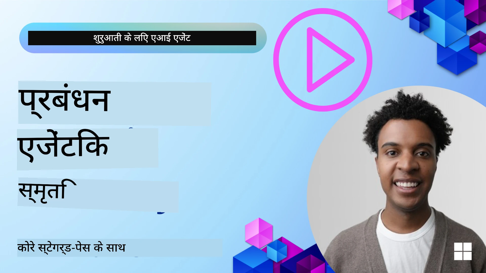

<!--
CO_OP_TRANSLATOR_METADATA:
{
  "original_hash": "a1d90991499ad697c4ad24decaf36968",
  "translation_date": "2025-12-09T12:03:49+00:00",
  "source_file": "13-agent-memory/README.md",
  "language_code": "hi"
}
-->
# एआई एजेंट्स के लिए मेमोरी 

जब एआई एजेंट्स बनाने के अनोखे लाभों की बात होती है, तो मुख्य रूप से दो चीजों पर चर्चा होती है: टूल्स का उपयोग करके कार्य पूरा करने की क्षमता और समय के साथ सुधार करने की क्षमता। मेमोरी एक ऐसा आधार है जो आत्म-सुधार करने वाले एजेंट्स को बनाने में मदद करता है, जिससे हमारे उपयोगकर्ताओं के लिए बेहतर अनुभव तैयार किया जा सके।

इस पाठ में, हम देखेंगे कि एआई एजेंट्स के लिए मेमोरी क्या है और इसे कैसे प्रबंधित और उपयोग किया जा सकता है ताकि हमारे एप्लिकेशन को लाभ मिल सके।

## परिचय

इस पाठ में शामिल होगा:

• **एआई एजेंट मेमोरी को समझना**: मेमोरी क्या है और एजेंट्स के लिए यह क्यों महत्वपूर्ण है।

• **मेमोरी को लागू करना और संग्रहीत करना**: आपके एआई एजेंट्स में मेमोरी क्षमताओं को जोड़ने के व्यावहारिक तरीके, जिसमें शॉर्ट-टर्म और लॉन्ग-टर्म मेमोरी पर ध्यान केंद्रित किया गया है।

• **एआई एजेंट्स को आत्म-सुधार करने योग्य बनाना**: कैसे मेमोरी एजेंट्स को पिछले इंटरैक्शन से सीखने और समय के साथ सुधार करने में सक्षम बनाती है।

## उपलब्ध कार्यान्वयन

इस पाठ में दो व्यापक नोटबुक ट्यूटोरियल शामिल हैं:

• **[13-agent-memory.ipynb](./13-agent-memory.ipynb)**: मेमोरी को Mem0 और Azure AI Search के साथ Semantic Kernel फ्रेमवर्क का उपयोग करके लागू करता है।

• **[13-agent-memory-cognee.ipynb](./13-agent-memory-cognee.ipynb)**: Cognee का उपयोग करके संरचित मेमोरी को लागू करता है, जो एम्बेडिंग द्वारा समर्थित ज्ञान ग्राफ को स्वचालित रूप से बनाता है, ग्राफ को विज़ुअलाइज़ करता है, और बुद्धिमान पुनर्प्राप्ति प्रदान करता है।

## सीखने के लक्ष्य

इस पाठ को पूरा करने के बाद, आप जान पाएंगे:

• **एआई एजेंट मेमोरी के विभिन्न प्रकारों में अंतर करना**, जिसमें वर्किंग, शॉर्ट-टर्म और लॉन्ग-टर्म मेमोरी शामिल हैं, साथ ही विशेष प्रकार जैसे पर्सोना और एपिसोडिक मेमोरी।

• **एआई एजेंट्स के लिए शॉर्ट-टर्म और लॉन्ग-टर्म मेमोरी को लागू और प्रबंधित करना** Semantic Kernel फ्रेमवर्क का उपयोग करके, Mem0, Cognee, Whiteboard मेमोरी जैसे टूल्स का लाभ उठाते हुए और Azure AI Search के साथ एकीकृत करते हुए।

• **आत्म-सुधार करने वाले एआई एजेंट्स के पीछे के सिद्धांतों को समझना** और कैसे मजबूत मेमोरी प्रबंधन प्रणाली निरंतर सीखने और अनुकूलन में योगदान देती है।

## एआई एजेंट मेमोरी को समझना

मूल रूप से, **एआई एजेंट्स के लिए मेमोरी उन तंत्रों को संदर्भित करती है जो उन्हें जानकारी बनाए रखने और पुनः प्राप्त करने की अनुमति देते हैं**। यह जानकारी बातचीत के विशिष्ट विवरण, उपयोगकर्ता की प्राथमिकताएं, पिछले कार्य, या सीखे गए पैटर्न हो सकती है।

मेमोरी के बिना, एआई एप्लिकेशन अक्सर स्टेटलेस होते हैं, जिसका मतलब है कि हर इंटरैक्शन नए सिरे से शुरू होता है। इससे एक दोहराव और निराशाजनक उपयोगकर्ता अनुभव होता है, जहां एजेंट पिछले संदर्भ या प्राथमिकताओं को "भूल" जाता है।

### मेमोरी क्यों महत्वपूर्ण है?

किसी एजेंट की बुद्धिमत्ता उसकी पिछली जानकारी को याद करने और उपयोग करने की क्षमता से गहराई से जुड़ी होती है। मेमोरी एजेंट्स को निम्नलिखित बनाती है:

• **चिंतनशील**: पिछले कार्यों और परिणामों से सीखना।

• **इंटरएक्टिव**: चल रही बातचीत में संदर्भ बनाए रखना।

• **प्रोएक्टिव और रिएक्टिव**: ऐतिहासिक डेटा के आधार पर आवश्यकताओं का अनुमान लगाना या उपयुक्त प्रतिक्रिया देना।

• **स्वायत्त**: संग्रहीत ज्ञान का उपयोग करके अधिक स्वतंत्र रूप से कार्य करना।

मेमोरी को लागू करने का उद्देश्य एजेंट्स को अधिक **विश्वसनीय और सक्षम** बनाना है।

### मेमोरी के प्रकार

#### वर्किंग मेमोरी

इसे एक प्रकार के स्क्रैच पेपर के रूप में सोचें जिसे एजेंट एकल, चल रहे कार्य या विचार प्रक्रिया के दौरान उपयोग करता है। यह तत्काल जानकारी रखता है जो अगले कदम की गणना के लिए आवश्यक होती है।

एआई एजेंट्स के लिए, वर्किंग मेमोरी अक्सर बातचीत से सबसे प्रासंगिक जानकारी को कैप्चर करती है, भले ही पूरी चैट हिस्ट्री लंबी या ट्रंकेट हो। यह आवश्यक तत्वों जैसे आवश्यकताओं, प्रस्तावों, निर्णयों और कार्यों को निकालने पर केंद्रित होती है।

**वर्किंग मेमोरी उदाहरण**

एक ट्रैवल बुकिंग एजेंट में, वर्किंग मेमोरी उपयोगकर्ता की वर्तमान अनुरोध को कैप्चर कर सकती है, जैसे "मैं पेरिस की यात्रा बुक करना चाहता हूं"। यह विशिष्ट आवश्यकता एजेंट के तत्काल संदर्भ में रखी जाती है ताकि वर्तमान इंटरैक्शन को मार्गदर्शित किया जा सके।

#### शॉर्ट टर्म मेमोरी

यह प्रकार की मेमोरी एकल बातचीत या सत्र की अवधि के लिए जानकारी बनाए रखती है। यह वर्तमान चैट का संदर्भ है, जो एजेंट को संवाद में पिछले टर्न्स का उल्लेख करने की अनुमति देता है।

**शॉर्ट टर्म मेमोरी उदाहरण**

यदि उपयोगकर्ता पूछता है, "पेरिस के लिए फ्लाइट की कीमत कितनी होगी?" और फिर पूछता है, "वहां रहने की व्यवस्था के बारे में क्या?", शॉर्ट टर्म मेमोरी सुनिश्चित करती है कि एजेंट जानता है कि "वहां" का मतलब "पेरिस" है उसी बातचीत के भीतर।

#### लॉन्ग टर्म मेमोरी

यह वह जानकारी है जो कई बातचीत या सत्रों के दौरान बनी रहती है। यह एजेंट्स को उपयोगकर्ता की प्राथमिकताओं, ऐतिहासिक इंटरैक्शन, या सामान्य ज्ञान को लंबे समय तक याद रखने की अनुमति देती है। यह व्यक्तिगतकरण के लिए महत्वपूर्ण है।

**लॉन्ग टर्म मेमोरी उदाहरण**

लॉन्ग टर्म मेमोरी यह स्टोर कर सकती है कि "बेन को स्कीइंग और आउटडोर गतिविधियां पसंद हैं, पहाड़ों के दृश्य के साथ कॉफी पसंद है, और पिछले चोट के कारण उन्नत स्की ढलानों से बचना चाहता है"। यह जानकारी, पिछले इंटरैक्शन से सीखी गई, भविष्य की यात्रा योजना सत्रों में सिफारिशों को अत्यधिक व्यक्तिगत बनाती है।

#### पर्सोना मेमोरी

यह विशेष प्रकार की मेमोरी एजेंट को एक सुसंगत "व्यक्तित्व" या "पर्सोना" विकसित करने में मदद करती है। यह एजेंट को अपने बारे में या अपने इच्छित भूमिका के बारे में विवरण याद रखने की अनुमति देती है, जिससे इंटरैक्शन अधिक तरल और केंद्रित हो जाते हैं।

**पर्सोना मेमोरी उदाहरण**

यदि ट्रैवल एजेंट को "एक्सपर्ट स्की प्लानर" के रूप में डिज़ाइन किया गया है, तो पर्सोना मेमोरी इस भूमिका को सुदृढ़ कर सकती है, जिससे उसकी प्रतिक्रियाएं एक विशेषज्ञ के स्वर और ज्ञान के साथ मेल खाती हैं।

#### वर्कफ़्लो/एपिसोडिक मेमोरी

यह मेमोरी एक जटिल कार्य के दौरान एजेंट द्वारा उठाए गए कदमों की अनुक्रम को संग्रहीत करती है, जिसमें सफलताएं और असफलताएं शामिल हैं। यह पिछले "एपिसोड" या अनुभवों को याद करने जैसा है ताकि उनसे सीखा जा सके।

**एपिसोडिक मेमोरी उदाहरण**

यदि एजेंट ने एक विशिष्ट फ्लाइट बुक करने का प्रयास किया लेकिन यह उपलब्धता के कारण विफल हो गया, तो एपिसोडिक मेमोरी इस विफलता को रिकॉर्ड कर सकती है, जिससे एजेंट वैकल्पिक फ्लाइट्स का प्रयास कर सके या उपयोगकर्ता को अगले प्रयास के दौरान अधिक सूचित तरीके से समस्या के बारे में बता सके।

#### एंटिटी मेमोरी

यह बातचीत से विशिष्ट एंटिटी (जैसे लोग, स्थान, या चीजें) और घटनाओं को निकालने और याद रखने में शामिल होती है। यह एजेंट को चर्चा किए गए प्रमुख तत्वों की संरचित समझ बनाने की अनुमति देती है।

**एंटिटी मेमोरी उदाहरण**

पिछली यात्रा के बारे में बातचीत से, एजेंट "पेरिस," "एफिल टॉवर," और "ले चैट नोयर रेस्तरां में डिनर" जैसी एंटिटी निकाल सकता है। भविष्य के इंटरैक्शन में, एजेंट "ले चैट नोयर" को याद कर सकता है और वहां एक नई बुकिंग करने की पेशकश कर सकता है।

#### संरचित RAG (रिट्रीवल ऑगमेंटेड जनरेशन)

हालांकि RAG एक व्यापक तकनीक है, "संरचित RAG" को एक शक्तिशाली मेमोरी तकनीक के रूप में उजागर किया गया है। यह विभिन्न स्रोतों (बातचीत, ईमेल, छवियां) से घनी, संरचित जानकारी निकालता है और इसे प्रतिक्रियाओं में सटीकता, पुनर्प्राप्ति और गति बढ़ाने के लिए उपयोग करता है। क्लासिक RAG जो केवल सेमांटिक समानता पर निर्भर करता है, के विपरीत, संरचित RAG जानकारी की अंतर्निहित संरचना के साथ काम करता है।

**संरचित RAG उदाहरण**

केवल कीवर्ड मिलान करने के बजाय, संरचित RAG ईमेल से फ्लाइट विवरण (गंतव्य, तारीख, समय, एयरलाइन) को पार्स कर सकता है और इसे संरचित तरीके से संग्रहीत कर सकता है। यह सटीक प्रश्नों जैसे "मैंने मंगलवार को पेरिस के लिए कौन सी फ्लाइट बुक की?" का उत्तर देने की अनुमति देता है।

## मेमोरी को लागू करना और संग्रहीत करना

एआई एजेंट्स के लिए मेमोरी को लागू करना **मेमोरी प्रबंधन** की एक व्यवस्थित प्रक्रिया शामिल करता है, जिसमें जानकारी उत्पन्न करना, संग्रहीत करना, पुनर्प्राप्त करना, एकीकृत करना, अपडेट करना, और यहां तक कि "भूलना" (या हटाना) शामिल है। पुनर्प्राप्ति विशेष रूप से महत्वपूर्ण पहलू है।

### विशेष मेमोरी टूल्स

#### Mem0

एजेंट मेमोरी को संग्रहीत और प्रबंधित करने का एक तरीका विशेष टूल्स जैसे Mem0 का उपयोग करना है। Mem0 एक स्थायी मेमोरी लेयर के रूप में काम करता है, जिससे एजेंट्स को प्रासंगिक इंटरैक्शन याद रखने, उपयोगकर्ता प्राथमिकताओं और तथ्यात्मक संदर्भ संग्रहीत करने, और समय के साथ सफलताओं और विफलताओं से सीखने की अनुमति मिलती है। विचार यह है कि स्टेटलेस एजेंट्स को स्टेटफुल बनाया जाए।

यह **दो-चरणीय मेमोरी पाइपलाइन: एक्सट्रैक्शन और अपडेट** के माध्यम से काम करता है। पहले, एजेंट के थ्रेड में जोड़े गए संदेशों को Mem0 सेवा में भेजा जाता है, जो बातचीत के इतिहास को सारांशित करने और नई मेमोरी निकालने के लिए एक बड़े भाषा मॉडल (LLM) का उपयोग करता है। इसके बाद, एक LLM-चालित अपडेट चरण यह निर्धारित करता है कि इन मेमोरी को जोड़ना, संशोधित करना, या हटाना है, और उन्हें एक हाइब्रिड डेटा स्टोर में संग्रहीत करता है जिसमें वेक्टर, ग्राफ, और की-वैल्यू डेटाबेस शामिल हो सकते हैं। यह प्रणाली विभिन्न मेमोरी प्रकारों का समर्थन करती है और एंटिटी के बीच संबंधों को प्रबंधित करने के लिए ग्राफ मेमोरी को शामिल कर सकती है।

#### Cognee

एक अन्य शक्तिशाली दृष्टिकोण **Cognee** का उपयोग करना है, जो एआई एजेंट्स के लिए एक ओपन-सोर्स सेमांटिक मेमोरी है जो संरचित और असंरचित डेटा को एम्बेडिंग द्वारा समर्थित क्वेरी योग्य ज्ञान ग्राफ में बदल देती है। Cognee एक **डुअल-स्टोर आर्किटेक्चर** प्रदान करता है जो वेक्टर समानता खोज को ग्राफ संबंधों के साथ जोड़ता है, जिससे एजेंट्स को न केवल यह समझने में मदद मिलती है कि कौन सी जानकारी समान है, बल्कि यह भी कि अवधारणाएं एक-दूसरे से कैसे संबंधित हैं।

यह **हाइब्रिड पुनर्प्राप्ति** में उत्कृष्टता प्राप्त करता है जो वेक्टर समानता, ग्राफ संरचना, और LLM तर्क को मिलाता है - कच्चे चंक लुकअप से ग्राफ-अवेयर प्रश्न उत्तर तक। प्रणाली **लिविंग मेमोरी** बनाए रखती है जो विकसित और बढ़ती है जबकि एक जुड़े हुए ग्राफ के रूप में क्वेरी योग्य रहती है, जो शॉर्ट-टर्म सत्र संदर्भ और लॉन्ग-टर्म स्थायी मेमोरी दोनों का समर्थन करती है।

Cognee नोटबुक ट्यूटोरियल ([13-agent-memory-cognee.ipynb](./13-agent-memory-cognee.ipynb)) इस एकीकृत मेमोरी लेयर को बनाने का प्रदर्शन करता है, जिसमें विविध डेटा स्रोतों को इनजेस्ट करने, ज्ञान ग्राफ को विज़ुअलाइज़ करने, और विभिन्न खोज रणनीतियों के साथ क्वेरी करने के व्यावहारिक उदाहरण शामिल हैं जो विशिष्ट एजेंट आवश्यकताओं के लिए अनुकूलित हैं।

### RAG के साथ मेमोरी संग्रहीत करना

विशेष मेमोरी टूल्स जैसे Mem0 के अलावा, आप **Azure AI Search जैसी मजबूत खोज सेवाओं का उपयोग करके मेमोरी संग्रहीत और पुनर्प्राप्त कर सकते हैं**, विशेष रूप से संरचित RAG के लिए।

यह आपके एजेंट की प्रतिक्रियाओं को आपके अपने डेटा के साथ ग्राउंड करने की अनुमति देता है, जिससे अधिक प्रासंगिक और सटीक उत्तर सुनिश्चित होते हैं। Azure AI Search का उपयोग उपयोगकर्ता-विशिष्ट यात्रा मेमोरी, उत्पाद कैटलॉग, या किसी अन्य डोमेन-विशिष्ट ज्ञान को संग्रहीत करने के लिए किया जा सकता है।

Azure AI Search **संरचित RAG** जैसी क्षमताओं का समर्थन करता है, जो बातचीत के इतिहास, ईमेल, या यहां तक कि छवियों जैसे बड़े डेटासेट से घनी, संरचित जानकारी निकालने और पुनर्प्राप्त करने में उत्कृष्टता प्राप्त करता है। यह पारंपरिक टेक्स्ट चंकिंग और एम्बेडिंग दृष्टिकोणों की तुलना में "सुपरह्यूमन सटीकता और पुनर्प्राप्ति" प्रदान करता है।

## एआई एजेंट्स को आत्म-सुधार बनाना

आत्म-सुधार करने वाले एजेंट्स के लिए एक सामान्य पैटर्न **"ज्ञान एजेंट"** को पेश करना शामिल है। यह अलग एजेंट उपयोगकर्ता और प्राथमिक एजेंट के बीच मुख्य बातचीत का अवलोकन करता है। इसका कार्य है:

1. **मूल्यवान जानकारी की पहचान करना**: यह निर्धारित करना कि बातचीत का कोई हिस्सा सामान्य ज्ञान या विशिष्ट उपयोगकर्ता प्राथमिकता के रूप में संग्रहीत करने योग्य है।

2. **निकालना और सारांशित करना**: बातचीत से आवश्यक सीख या प्राथमिकता को निकालना।

3. **ज्ञान आधार में संग्रहीत करना**: इस निकाली गई जानकारी को अक्सर एक वेक्टर डेटाबेस में संग्रहीत करना ताकि इसे बाद में पुनर्प्राप्त किया जा सके।

4. **भविष्य की क्वेरी को बढ़ाना**: जब उपयोगकर्ता एक नई क्वेरी शुरू करता है, तो ज्ञान एजेंट संग्रहीत प्रासंगिक जानकारी को पुनर्प्राप्त करता है और इसे उपयोगकर्ता के प्रॉम्प्ट में जोड़ता है, प्राथमिक एजेंट को महत्वपूर्ण संदर्भ प्रदान करता है (RAG के समान)।

### मेमोरी के लिए अनुकूलन

• **लेटेंसी प्रबंधन**: उपयोगकर्ता इंटरैक्शन को धीमा करने से बचाने के लिए, सस्ते, तेज मॉडल का उपयोग शुरू में यह जल्दी जांचने के लिए किया जा सकता है कि जानकारी संग्रहीत या पुनर्प्राप्त करने योग्य है या नहीं, केवल आवश्यक होने पर अधिक जटिल एक्सट्रैक्शन/रिट्रीवल प्रक्रिया को लागू करना।

• **ज्ञान आधार रखरखाव**: बढ़ते ज्ञान आधार के लिए, कम बार उपयोग की जाने वाली जानकारी को "कोल्ड स्टोरेज" में स्थानांतरित किया जा सकता है ताकि लागत का प्रबंधन किया जा सके।

## एजेंट मेमोरी के बारे में और सवाल हैं?

[Azure AI Foundry Discord](https://aka.ms/ai-agents/discord) से जुड़ें, अन्य शिक्षार्थियों से मिलें, ऑफिस आवर्स में भाग लें और अपने एआई एजेंट्स से संबंधित सवालों के जवाब पाएं।

---

<!-- CO-OP TRANSLATOR DISCLAIMER START -->
**अस्वीकरण**:  
यह दस्तावेज़ AI अनुवाद सेवा [Co-op Translator](https://github.com/Azure/co-op-translator) का उपयोग करके अनुवादित किया गया है। जबकि हम सटीकता के लिए प्रयास करते हैं, कृपया ध्यान दें कि स्वचालित अनुवाद में त्रुटियां या अशुद्धियां हो सकती हैं। मूल भाषा में दस्तावेज़ को आधिकारिक स्रोत माना जाना चाहिए। महत्वपूर्ण जानकारी के लिए, पेशेवर मानव अनुवाद की सिफारिश की जाती है। इस अनुवाद के उपयोग से उत्पन्न किसी भी गलतफहमी या गलत व्याख्या के लिए हम उत्तरदायी नहीं हैं।
<!-- CO-OP TRANSLATOR DISCLAIMER END -->