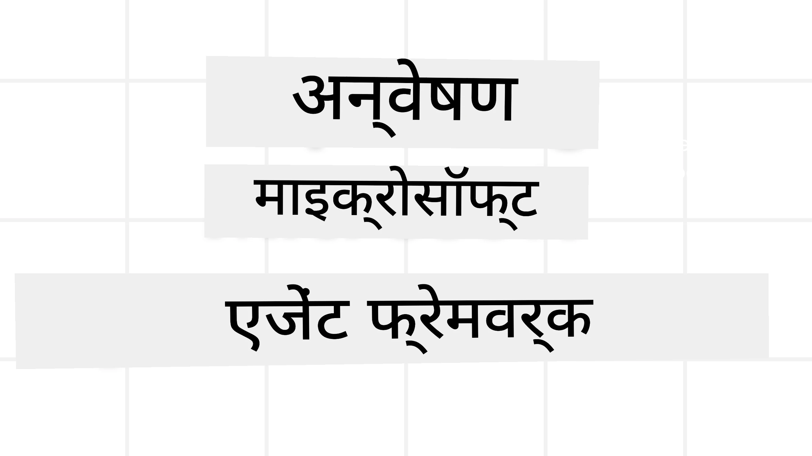
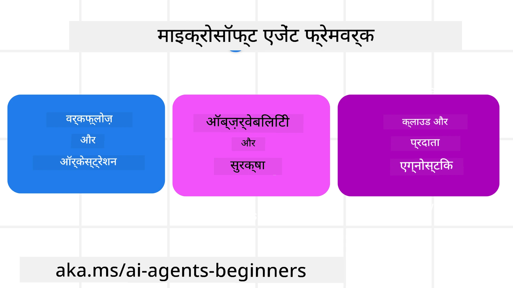
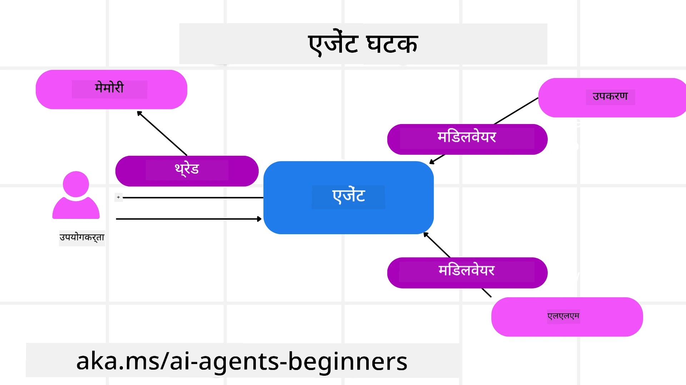

<!--
CO_OP_TRANSLATOR_METADATA:
{
  "original_hash": "19c4dab375acbc733855cc7f2f04edbc",
  "translation_date": "2025-10-01T21:44:17+00:00",
  "source_file": "14-microsoft-agent-framework/README.md",
  "language_code": "hi"
}
-->
# Microsoft Agent Framework का अन्वेषण



### परिचय

इस पाठ में शामिल होगा:

- Microsoft Agent Framework को समझना: मुख्य विशेषताएँ और मूल्य  
- Microsoft Agent Framework के मुख्य अवधारणाओं का अन्वेषण  
- MAF की तुलना Semantic Kernel और AutoGen से: माइग्रेशन गाइड  

## सीखने के लक्ष्य

इस पाठ को पूरा करने के बाद, आप जान पाएंगे:

- Microsoft Agent Framework का उपयोग करके प्रोडक्शन रेडी AI एजेंट्स बनाना  
- Microsoft Agent Framework की मुख्य विशेषताओं को अपने एजेंटिक उपयोग मामलों में लागू करना  
- मौजूदा एजेंटिक फ्रेमवर्क और टूल्स को माइग्रेट और इंटीग्रेट करना  

## कोड नमूने

[Microsoft Agent Framework (MAF)](https://aka.ms/ai-agents-beginners/agent-framewrok) के कोड नमूने इस रिपॉजिटरी में `xx-python-agent-framework` और `xx-dotnet-agent-framework` फाइलों के तहत पाए जा सकते हैं।

## Microsoft Agent Framework को समझना



[Microsoft Agent Framework (MAF)](https://aka.ms/ai-agents-beginners/agent-framewrok) Semantic Kernel और AutoGen के अनुभव और सीखों पर आधारित है। यह प्रोडक्शन और शोध वातावरण में देखे जाने वाले विभिन्न एजेंटिक उपयोग मामलों को संबोधित करने के लिए लचीलापन प्रदान करता है, जिनमें शामिल हैं:

- **Sequential Agent orchestration** उन परिदृश्यों में जहां चरण-दर-चरण वर्कफ़्लो की आवश्यकता होती है।  
- **Concurrent orchestration** उन परिदृश्यों में जहां एजेंट्स को एक ही समय में कार्य पूरे करने की आवश्यकता होती है।  
- **Group chat orchestration** उन परिदृश्यों में जहां एजेंट्स एक कार्य पर सहयोग कर सकते हैं।  
- **Handoff Orchestration** उन परिदृश्यों में जहां एजेंट्स एक-दूसरे को कार्य सौंपते हैं जब उप-कार्य पूरे हो जाते हैं।  
- **Magnetic Orchestration** उन परिदृश्यों में जहां एक प्रबंधक एजेंट कार्य सूची बनाता और संशोधित करता है और उप-एजेंट्स के समन्वय को संभालता है।  

प्रोडक्शन में AI एजेंट्स प्रदान करने के लिए, MAF में निम्नलिखित विशेषताएँ शामिल हैं:

- **Observability** OpenTelemetry का उपयोग करके, जहां AI एजेंट की हर क्रिया, जैसे टूल इनवोकेशन, ऑर्केस्ट्रेशन चरण, तर्क प्रवाह और Azure AI Foundry डैशबोर्ड के माध्यम से प्रदर्शन निगरानी।  
- **Security** एजेंट्स को Azure AI Foundry पर मूल रूप से होस्ट करके, जिसमें सुरक्षा नियंत्रण जैसे कि भूमिका-आधारित पहुंच, निजी डेटा हैंडलिंग और अंतर्निहित सामग्री सुरक्षा शामिल हैं।  
- **Durability** एजेंट थ्रेड्स और वर्कफ़्लो को रोकने, फिर से शुरू करने और त्रुटियों से पुनर्प्राप्त करने की क्षमता, जो लंबे समय तक चलने वाली प्रक्रियाओं को सक्षम बनाती है।  
- **Control** मानव-इन-द-लूप वर्कफ़्लो का समर्थन, जहां कार्यों को मानव अनुमोदन की आवश्यकता के रूप में चिह्नित किया जाता है।  

Microsoft Agent Framework को इंटरऑपरेबल बनाने पर भी ध्यान केंद्रित किया गया है:

- **Cloud-agnostic होना** - एजेंट्स कंटेनरों में, ऑन-प्रिमाइसेस और विभिन्न क्लाउड्स में चल सकते हैं।  
- **Provider-agnostic होना** - एजेंट्स आपके पसंदीदा SDK के माध्यम से बनाए जा सकते हैं, जिसमें Azure OpenAI और OpenAI शामिल हैं।  
- **Open Standards का एकीकरण** - एजेंट्स Agent-to-Agent (A2A) और Model Context Protocol (MCP) जैसे प्रोटोकॉल का उपयोग करके अन्य एजेंट्स और टूल्स की खोज और उपयोग कर सकते हैं।  
- **Plugins और Connectors** - Microsoft Fabric, SharePoint, Pinecone और Qdrant जैसे डेटा और मेमोरी सेवाओं से कनेक्शन बनाए जा सकते हैं।  

आइए देखें कि Microsoft Agent Framework की इन विशेषताओं को इसके मुख्य अवधारणाओं पर कैसे लागू किया जाता है।

## Microsoft Agent Framework के मुख्य अवधारणाएँ

### एजेंट्स



**एजेंट्स बनाना**

एजेंट्स को परिभाषित करके बनाया जाता है, जिसमें इनफेरेंस सेवा (LLM Provider), AI एजेंट के लिए निर्देशों का सेट और एक `name` असाइन किया जाता है:

```python
agent = AzureOpenAIChatClient(credential=AzureCliCredential()).create_agent( instructions="You are good at recommending trips to customers based on their preferences.", name="TripRecommender" )
```

ऊपर दिए गए उदाहरण में `Azure OpenAI` का उपयोग किया गया है, लेकिन एजेंट्स को विभिन्न सेवाओं का उपयोग करके बनाया जा सकता है, जिसमें `Azure AI Foundry Agent Service` शामिल है:

```python
AzureAIAgentClient(async_credential=credential).create_agent( name="HelperAgent", instructions="You are a helpful assistant." ) as agent
```

OpenAI `Responses`, `ChatCompletion` APIs

```python
agent = OpenAIResponsesClient().create_agent( name="WeatherBot", instructions="You are a helpful weather assistant.", )
```

```python
agent = OpenAIChatClient().create_agent( name="HelpfulAssistant", instructions="You are a helpful assistant.", )
```

या A2A प्रोटोकॉल का उपयोग करके रिमोट एजेंट्स:

```python
agent = A2AAgent( name=agent_card.name, description=agent_card.description, agent_card=agent_card, url="https://your-a2a-agent-host" )
```

**एजेंट्स चलाना**

एजेंट्स को `.run` या `.run_stream` विधियों का उपयोग करके चलाया जाता है, जो गैर-स्ट्रीमिंग या स्ट्रीमिंग प्रतिक्रियाओं के लिए होते हैं।

```python
result = await agent.run("What are good places to visit in Amsterdam?")
print(result.text)
```

```python
async for update in agent.run_stream("What are the good places to visit in Amsterdam?"):
    if update.text:
        print(update.text, end="", flush=True)

```

प्रत्येक एजेंट रन में ऐसे विकल्प हो सकते हैं जो पैरामीटर को कस्टमाइज़ करते हैं, जैसे `max_tokens` जो एजेंट द्वारा उपयोग किए जाते हैं, `tools` जो एजेंट कॉल कर सकता है, और यहां तक कि `model` जो एजेंट के लिए उपयोग किया जाता है।

यह उन मामलों में उपयोगी है जहां उपयोगकर्ता के कार्य को पूरा करने के लिए विशिष्ट मॉडल या टूल्स की आवश्यकता होती है।

**टूल्स**

टूल्स को एजेंट को परिभाषित करते समय परिभाषित किया जा सकता है:

```python
def get_attractions( location: Annotated[str, Field(description="The location to get the top tourist attractions for")], ) -> str: """Get the top tourist attractions for a given location.""" return f"The top attractions for {location} are." 


# When creating a ChatAgent directly 

agent = ChatAgent( chat_client=OpenAIChatClient(), instructions="You are a helpful assistant", tools=[get_attractions]

```

और एजेंट को चलाते समय भी:

```python

result1 = await agent.run( "What's the best place to visit in Seattle?", tools=[get_attractions] # Tool provided for this run only )
```

**एजेंट थ्रेड्स**

एजेंट थ्रेड्स का उपयोग मल्टी-टर्न वार्तालापों को संभालने के लिए किया जाता है। थ्रेड्स को निम्नलिखित तरीकों से बनाया जा सकता है:

- `get_new_thread()` का उपयोग करके, जो थ्रेड को समय के साथ सहेजने में सक्षम बनाता है।  
- एजेंट को चलाते समय स्वचालित रूप से थ्रेड बनाना, और केवल वर्तमान रन के दौरान थ्रेड को बनाए रखना।  

थ्रेड बनाने के लिए कोड इस प्रकार दिखता है:

```python
# Create a new thread. 
thread = agent.get_new_thread() # Run the agent with the thread. 
response = await agent.run("Hello, I am here to help you book travel. Where would you like to go?", thread=thread)

```

आप थ्रेड को बाद में उपयोग के लिए सहेजने के लिए सीरियलाइज़ कर सकते हैं:

```python
# Create a new thread. 
thread = agent.get_new_thread() 

# Run the agent with the thread. 

response = await agent.run("Hello, how are you?", thread=thread) 

# Serialize the thread for storage. 

serialized_thread = await thread.serialize() 

# Deserialize the thread state after loading from storage. 

resumed_thread = await agent.deserialize_thread(serialized_thread)
```

**एजेंट मिडलवेयर**

एजेंट्स टूल्स और LLMs के साथ इंटरैक्ट करते हैं ताकि उपयोगकर्ता के कार्यों को पूरा किया जा सके। कुछ परिदृश्यों में, हम इन इंटरैक्शन के बीच में कुछ क्रियाएँ निष्पादित या ट्रैक करना चाहते हैं। एजेंट मिडलवेयर हमें ऐसा करने में सक्षम बनाता है:

*Function Middleware*

यह मिडलवेयर हमें एजेंट और उस फ़ंक्शन/टूल के बीच एक क्रिया निष्पादित करने की अनुमति देता है जिसे वह कॉल करेगा। इसका उपयोग तब किया जा सकता है जब आप फ़ंक्शन कॉल पर कुछ लॉगिंग करना चाहते हैं।

नीचे दिए गए कोड में `next` परिभाषित करता है कि अगला मिडलवेयर या वास्तविक फ़ंक्शन कॉल किया जाना चाहिए।

```python
async def logging_function_middleware(
    context: FunctionInvocationContext,
    next: Callable[[FunctionInvocationContext], Awaitable[None]],
) -> None:
    """Function middleware that logs function execution."""
    # Pre-processing: Log before function execution
    print(f"[Function] Calling {context.function.name}")

    # Continue to next middleware or function execution
    await next(context)

    # Post-processing: Log after function execution
    print(f"[Function] {context.function.name} completed")
```

*Chat Middleware*

यह मिडलवेयर हमें एजेंट और LLM के बीच अनुरोधों के बीच एक क्रिया निष्पादित या लॉग करने की अनुमति देता है।

इसमें महत्वपूर्ण जानकारी होती है जैसे कि `messages` जो AI सेवा को भेजे जा रहे हैं।

```python
async def logging_chat_middleware(
    context: ChatContext,
    next: Callable[[ChatContext], Awaitable[None]],
) -> None:
    """Chat middleware that logs AI interactions."""
    # Pre-processing: Log before AI call
    print(f"[Chat] Sending {len(context.messages)} messages to AI")

    # Continue to next middleware or AI service
    await next(context)

    # Post-processing: Log after AI response
    print("[Chat] AI response received")

```

**एजेंट मेमोरी**

जैसा कि `Agentic Memory` पाठ में कवर किया गया है, मेमोरी एजेंट को विभिन्न संदर्भों में संचालित करने में सक्षम बनाने के लिए एक महत्वपूर्ण तत्व है। MAF में कई प्रकार की मेमोरी प्रदान की जाती है:

*In-Memory Storage*

यह मेमोरी एप्लिकेशन रनटाइम के दौरान थ्रेड्स में संग्रहीत होती है।

```python
# Create a new thread. 
thread = agent.get_new_thread() # Run the agent with the thread. 
response = await agent.run("Hello, I am here to help you book travel. Where would you like to go?", thread=thread)
```

*Persistent Messages*

यह मेमोरी विभिन्न सत्रों में वार्तालाप इतिहास को संग्रहीत करने के लिए उपयोग की जाती है। इसे `chat_message_store_factory` का उपयोग करके परिभाषित किया जाता है:

```python
from agent_framework import ChatMessageStore

# Create a custom message store
def create_message_store():
    return ChatMessageStore()

agent = ChatAgent(
    chat_client=OpenAIChatClient(),
    instructions="You are a Travel assistant.",
    chat_message_store_factory=create_message_store
)

```

*Dynamic Memory*

यह मेमोरी एजेंट्स को चलाने से पहले संदर्भ में जोड़ी जाती है। इन मेमोरी को बाहरी सेवाओं जैसे mem0 में संग्रहीत किया जा सकता है:

```python
from agent_framework.mem0 import Mem0Provider

# Using Mem0 for advanced memory capabilities
memory_provider = Mem0Provider(
    api_key="your-mem0-api-key",
    user_id="user_123",
    application_id="my_app"
)

agent = ChatAgent(
    chat_client=OpenAIChatClient(),
    instructions="You are a helpful assistant with memory.",
    context_providers=memory_provider
)

```

**एजेंट ऑब्ज़र्वेबिलिटी**

ऑब्ज़र्वेबिलिटी विश्वसनीय और बनाए रखने योग्य एजेंटिक सिस्टम बनाने के लिए महत्वपूर्ण है। MAF OpenTelemetry के साथ एकीकृत होता है ताकि बेहतर ऑब्ज़र्वेबिलिटी के लिए ट्रेसिंग और मीटर प्रदान किए जा सकें।

```python
from agent_framework.observability import get_tracer, get_meter

tracer = get_tracer()
meter = get_meter()
with tracer.start_as_current_span("my_custom_span"):
    # do something
    pass
counter = meter.create_counter("my_custom_counter")
counter.add(1, {"key": "value"})
```

### वर्कफ़्लो

MAF वर्कफ़्लो प्रदान करता है जो कार्य को पूरा करने के लिए पूर्व-परिभाषित चरण होते हैं और इन चरणों में AI एजेंट्स को घटकों के रूप में शामिल करते हैं।

वर्कफ़्लो विभिन्न घटकों से बने होते हैं जो बेहतर नियंत्रण प्रवाह की अनुमति देते हैं। वर्कफ़्लो **मल्टी-एजेंट ऑर्केस्ट्रेशन** और **चेकपॉइंटिंग** को सक्षम करते हैं ताकि वर्कफ़्लो की स्थिति को सहेजा जा सके।

वर्कफ़्लो के मुख्य घटक हैं:

**Executors**

Executors इनपुट संदेश प्राप्त करते हैं, अपने असाइन किए गए कार्यों को पूरा करते हैं, और फिर आउटपुट संदेश उत्पन्न करते हैं। यह वर्कफ़्लो को बड़े कार्य को पूरा करने की दिशा में आगे बढ़ाता है। Executors AI एजेंट या कस्टम लॉजिक हो सकते हैं।

**Edges**

Edges वर्कफ़्लो में संदेशों के प्रवाह को परिभाषित करने के लिए उपयोग किए जाते हैं। ये हो सकते हैं:

*Direct Edges* - Executors के बीच सरल एक-से-एक कनेक्शन:

```python
from agent_framework import WorkflowBuilder

builder = WorkflowBuilder()
builder.add_edge(source_executor, target_executor)
builder.set_start_executor(source_executor)
workflow = builder.build()
```

*Conditional Edges* - कुछ शर्त पूरी होने के बाद सक्रिय होते हैं। उदाहरण के लिए, जब होटल के कमरे उपलब्ध नहीं होते हैं, तो एक Executor अन्य विकल्प सुझा सकता है।

*Switch-case Edges* - परिभाषित शर्तों के आधार पर संदेशों को विभिन्न Executors को रूट करते हैं। उदाहरण के लिए, यदि यात्रा ग्राहक को प्राथमिकता पहुंच है, तो उनके कार्यों को दूसरे वर्कफ़्लो के माध्यम से संभाला जाएगा।

*Fan-out Edges* - एक संदेश को कई लक्ष्यों पर भेजते हैं।

*Fan-in Edges* - विभिन्न Executors से कई संदेशों को इकट्ठा करते हैं और एक लक्ष्य पर भेजते हैं।

**Events**

वर्कफ़्लो में बेहतर ऑब्ज़र्वेबिलिटी प्रदान करने के लिए, MAF में निम्नलिखित बिल्ट-इन इवेंट्स शामिल हैं:

- `WorkflowStartedEvent`  - वर्कफ़्लो निष्पादन शुरू होता है  
- `WorkflowOutputEvent` - वर्कफ़्लो आउटपुट उत्पन्न करता है  
- `WorkflowErrorEvent` - वर्कफ़्लो में त्रुटि आती है  
- `ExecutorInvokeEvent`  - Executor प्रोसेसिंग शुरू करता है  
- `ExecutorCompleteEvent`  -  Executor प्रोसेसिंग समाप्त करता है  
- `RequestInfoEvent` - एक अनुरोध जारी किया जाता है  

## अन्य फ्रेमवर्क्स (Semantic Kernel और AutoGen) से माइग्रेट करना

### MAF और Semantic Kernel के बीच अंतर

**सरल एजेंट निर्माण**

Semantic Kernel प्रत्येक एजेंट के लिए एक Kernel instance बनाने पर निर्भर करता है। MAF मुख्य प्रदाताओं के लिए एक्सटेंशन का उपयोग करके एक सरल दृष्टिकोण अपनाता है।

```python
agent = AzureOpenAIChatClient(credential=AzureCliCredential()).create_agent( instructions="You are good at reccomending trips to customers based on their preferences.", name="TripRecommender" )
```

**एजेंट थ्रेड निर्माण**

Semantic Kernel में थ्रेड्स को मैन्युअल रूप से बनाया जाना आवश्यक है। MAF में, एजेंट को सीधे एक थ्रेड असाइन किया जाता है।

```python
thread = agent.get_new_thread() # Run the agent with the thread. 
```

**टूल रजिस्ट्रेशन**

Semantic Kernel में, टूल्स Kernel में रजिस्टर किए जाते हैं और फिर Kernel को एजेंट को पास किया जाता है। MAF में, टूल्स सीधे एजेंट निर्माण प्रक्रिया के दौरान रजिस्टर किए जाते हैं।

```python
agent = ChatAgent( chat_client=OpenAIChatClient(), instructions="You are a helpful assistant", tools=[get_attractions]
```

### MAF और AutoGen के बीच अंतर

**टीम्स बनाम वर्कफ़्लो**

AutoGen में `Teams` इवेंट-ड्रिवन गतिविधि के लिए इवेंट संरचना हैं। MAF `Workflows` का उपयोग करता है जो डेटा को ग्राफ-आधारित आर्किटेक्चर के माध्यम से Executors को रूट करता है।

**टूल निर्माण**

AutoGen `FunctionTool` का उपयोग करता है ताकि एजेंट्स को कॉल करने के लिए फ़ंक्शन को रैप किया जा सके। MAF @ai_function का उपयोग करता है, जो समान रूप से काम करता है लेकिन प्रत्येक फ़ंक्शन के लिए स्कीमाओं को स्वचालित रूप से इन्फर करता है।

**एजेंट व्यवहार**

AutoGen में एजेंट्स डिफ़ॉल्ट रूप से सिंगल-टर्न एजेंट्स होते हैं जब तक कि `max_tool_iterations` को उच्चतर सेट न किया जाए। MAF में `ChatAgent` डिफ़ॉल्ट रूप से मल्टी-टर्न होता है, जिसका अर्थ है कि यह उपयोगकर्ता के कार्य को पूरा करने तक टूल्स को कॉल करता रहेगा।

## कोड नमूने

Microsoft Agent Framework के कोड नमूने इस रिपॉजिटरी में `xx-python-agent-framework` और `xx-dotnet-agent-framework` फाइलों के तहत पाए जा सकते हैं।

## Microsoft Agent Framework के बारे में और प्रश्न हैं?

[Azure AI Foundry Discord](https://aka.ms/ai-agents/discord) से जुड़ें ताकि अन्य शिक्षार्थियों से मिल सकें, ऑफिस आवर्स में भाग ले सकें और अपने AI एजेंट्स से संबंधित प्रश्नों के उत्तर प्राप्त कर सकें।

---

**अस्वीकरण**:  
यह दस्तावेज़ AI अनुवाद सेवा [Co-op Translator](https://github.com/Azure/co-op-translator) का उपयोग करके अनुवादित किया गया है। जबकि हम सटीकता के लिए प्रयास करते हैं, कृपया ध्यान दें कि स्वचालित अनुवाद में त्रुटियां या अशुद्धियां हो सकती हैं। मूल भाषा में उपलब्ध मूल दस्तावेज़ को आधिकारिक स्रोत माना जाना चाहिए। महत्वपूर्ण जानकारी के लिए, पेशेवर मानव अनुवाद की सिफारिश की जाती है। इस अनुवाद के उपयोग से उत्पन्न किसी भी गलतफहमी या गलत व्याख्या के लिए हम उत्तरदायी नहीं हैं।