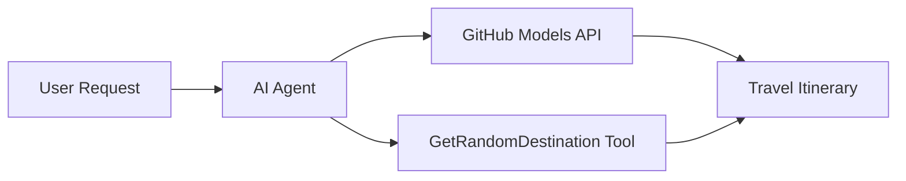

<!--
CO_OP_TRANSLATOR_METADATA:
{
  "original_hash": "5f351412e934f0833c8c821a0a60efaf",
  "translation_date": "2025-11-13T11:22:30+00:00",
  "source_file": "01-intro-to-ai-agents/code_samples/01-dotnet-agent-framework.md",
  "language_code": "hk"
}
-->
# 🌍 使用 Microsoft Agent Framework (.NET) 的 AI 旅行代理

## 📋 情境概述

此範例展示如何使用 Microsoft Agent Framework for .NET 建立一個智能旅行規劃代理。該代理可以自動生成個性化的全球隨機目的地一日遊行程。

### 主要功能：

- 🎲 **隨機目的地選擇**：使用自定義工具挑選度假地點
- 🗺️ **智能旅行規劃**：創建詳細的每日行程
- 🔄 **即時串流**：支持即時和串流回應
- 🛠️ **自定義工具整合**：展示如何擴展代理功能

## 🔧 技術架構

### 核心技術

- **Microsoft Agent Framework**：最新的 .NET 實現，用於開發 AI 代理
- **GitHub Models 整合**：使用 GitHub 的 AI 模型推理服務
- **OpenAI API 兼容性**：利用 OpenAI 客戶端庫和自定義端點
- **安全配置**：基於環境的 API 密鑰管理

### 主要組件

1. **AIAgent**：主要的代理協調器，負責處理對話流程
2. **自定義工具**：代理可使用的 `GetRandomDestination()` 函數
3. **聊天客戶端**：基於 GitHub Models 的對話介面
4. **串流支持**：即時回應生成功能

### 整合模式



## 🚀 快速入門

### 先決條件

- [.NET 10 SDK](https://dotnet.microsoft.com/download/dotnet/10.0) 或更高版本
- [GitHub Models API 訪問令牌](https://docs.github.com/github-models/github-models-at-scale/using-your-own-api-keys-in-github-models)

### 所需環境變數

```bash
# zsh/bash
export GH_TOKEN=<your_github_token>
export GH_ENDPOINT=https://models.github.ai/inference
export GH_MODEL_ID=openai/gpt-5-mini
```

```powershell
# PowerShell
$env:GH_TOKEN = "<your_github_token>"
$env:GH_ENDPOINT = "https://models.github.ai/inference"
$env:GH_MODEL_ID = "openai/gpt-5-mini"
```

### 範例代碼

要運行代碼範例，

```bash
# zsh/bash
chmod +x ./01-dotnet-agent-framework.cs
./01-dotnet-agent-framework.cs
```

或者使用 dotnet CLI：

```bash
dotnet run ./01-dotnet-agent-framework.cs
```

查看 [`01-dotnet-agent-framework.cs`](../../../../01-intro-to-ai-agents/code_samples/01-dotnet-agent-framework.cs) 以獲取完整代碼。

```csharp
#!/usr/bin/dotnet run

#:package Microsoft.Extensions.AI@9.*
#:package Microsoft.Agents.AI.OpenAI@1.*-*

using System.ClientModel;
using System.ComponentModel;

using Microsoft.Agents.AI;
using Microsoft.Extensions.AI;

using OpenAI;

// Tool Function: Random Destination Generator
// This static method will be available to the agent as a callable tool
// The [Description] attribute helps the AI understand when to use this function
// This demonstrates how to create custom tools for AI agents
[Description("Provides a random vacation destination.")]
static string GetRandomDestination()
{
    // List of popular vacation destinations around the world
    // The agent will randomly select from these options
    var destinations = new List<string>
    {
        "Paris, France",
        "Tokyo, Japan",
        "New York City, USA",
        "Sydney, Australia",
        "Rome, Italy",
        "Barcelona, Spain",
        "Cape Town, South Africa",
        "Rio de Janeiro, Brazil",
        "Bangkok, Thailand",
        "Vancouver, Canada"
    };

    // Generate random index and return selected destination
    // Uses System.Random for simple random selection
    var random = new Random();
    int index = random.Next(destinations.Count);
    return destinations[index];
}

// Extract configuration from environment variables
// Retrieve the GitHub Models API endpoint, defaults to https://models.github.ai/inference if not specified
// Retrieve the model ID, defaults to openai/gpt-5-mini if not specified
// Retrieve the GitHub token for authentication, throws exception if not specified
var github_endpoint = Environment.GetEnvironmentVariable("GH_ENDPOINT") ?? "https://models.github.ai/inference";
var github_model_id = Environment.GetEnvironmentVariable("GH_MODEL_ID") ?? "openai/gpt-5-mini";
var github_token = Environment.GetEnvironmentVariable("GH_TOKEN") ?? throw new InvalidOperationException("GH_TOKEN is not set.");

// Configure OpenAI Client Options
// Create configuration options to point to GitHub Models endpoint
// This redirects OpenAI client calls to GitHub's model inference service
var openAIOptions = new OpenAIClientOptions()
{
    Endpoint = new Uri(github_endpoint)
};

// Initialize OpenAI Client with GitHub Models Configuration
// Create OpenAI client using GitHub token for authentication
// Configure it to use GitHub Models endpoint instead of OpenAI directly
var openAIClient = new OpenAIClient(new ApiKeyCredential(github_token), openAIOptions);

// Create AI Agent with Travel Planning Capabilities
// Initialize OpenAI client, get chat client for specified model, and create AI agent
// Configure agent with travel planning instructions and random destination tool
// The agent can now plan trips using the GetRandomDestination function
AIAgent agent = openAIClient
    .GetChatClient(github_model_id)
    .CreateAIAgent(
        instructions: "You are a helpful AI Agent that can help plan vacations for customers at random destinations",
        tools: [AIFunctionFactory.Create(GetRandomDestination)]
    );

// Execute Agent: Plan a Day Trip
// Run the agent with streaming enabled for real-time response display
// Shows the agent's thinking and response as it generates the content
// Provides better user experience with immediate feedback
await foreach (var update in agent.RunStreamingAsync("Plan me a day trip"))
{
    await Task.Delay(10);
    Console.Write(update);
}
```

## 🎓 主要收穫

1. **代理架構**：Microsoft Agent Framework 提供了一種清晰且類型安全的方法來構建 .NET 中的 AI 代理
2. **工具整合**：帶有 `[Description]` 屬性的函數會成為代理可用的工具
3. **配置管理**：環境變數和安全憑證處理遵循 .NET 的最佳實踐
4. **OpenAI 兼容性**：GitHub Models 整合可通過 OpenAI 兼容的 API 無縫運作

## 🔗 其他資源

- [Microsoft Agent Framework 文件](https://learn.microsoft.com/agent-framework)
- [GitHub Models 市場](https://github.com/marketplace?type=models)
- [Microsoft.Extensions.AI](https://learn.microsoft.com/dotnet/ai/microsoft-extensions-ai)
- [.NET 單文件應用](https://devblogs.microsoft.com/dotnet/announcing-dotnet-run-app)

---

<!-- CO-OP TRANSLATOR DISCLAIMER START -->
**免責聲明**：  
此文件使用 AI 翻譯服務 [Co-op Translator](https://github.com/Azure/co-op-translator) 進行翻譯。我們致力於提供準確的翻譯，但請注意，自動翻譯可能包含錯誤或不準確之處。應以原文文件為權威來源。如涉及關鍵資訊，建議尋求專業人工翻譯。我們對因使用此翻譯而引起的任何誤解或誤釋不承擔責任。
<!-- CO-OP TRANSLATOR DISCLAIMER END -->