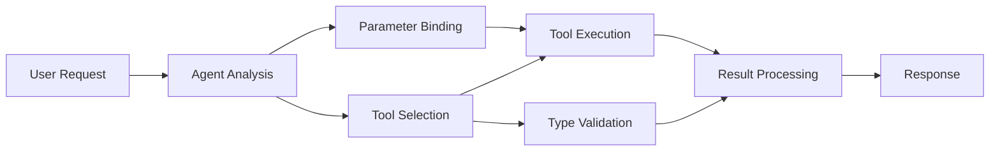

<!--
CO_OP_TRANSLATOR_METADATA:
{
  "original_hash": "91d6061e402489603f2ec8b528cae59b",
  "translation_date": "2025-11-18T16:50:05+00:00",
  "source_file": "04-tool-use/code_samples/04-dotnet-agent-framework.md",
  "language_code": "hk"
}
-->
# 🛠️ 使用 GitHub 模型進行進階工具操作 (.NET)

## 📋 學習目標

這份筆記展示了使用 Microsoft Agent Framework 在 .NET 中與 GitHub 模型進行企業級工具整合的模式。你將學習如何利用 C# 的強型別和 .NET 的企業功能，建立具備多種專業工具的高級代理。

### 你將掌握的進階工具能力

- 🔧 **多工具架構**：建立具備多種專業功能的代理
- 🎯 **型別安全的工具執行**：利用 C# 的編譯時驗證
- 📊 **企業工具模式**：生產級工具設計及錯誤處理
- 🔗 **工具組合**：結合工具以完成複雜的業務工作流程

## 🎯 .NET 工具架構的優勢

### 企業工具功能

- **編譯時驗證**：強型別確保工具參數的正確性
- **依賴注入**：使用 IoC 容器進行工具管理
- **非同步模式**：使用 Async/Await 進行非阻塞工具執行及資源管理
- **結構化日誌**：內建日誌整合，用於監控工具執行

### 生產級模式

- **例外處理**：全面的錯誤管理及型別化例外
- **資源管理**：正確的資源釋放模式及記憶體管理
- **效能監控**：內建指標及效能計數器
- **配置管理**：型別安全的配置及驗證

## 🔧 技術架構

### 核心 .NET 工具元件

- **Microsoft.Extensions.AI**：統一的工具抽象層
- **Microsoft.Agents.AI**：企業級工具編排
- **GitHub 模型整合**：高效能 API 客戶端及連線池

### 工具執行管道



## 🛠️ 工具類別及模式

### 1. **數據處理工具**

- **輸入驗證**：使用數據註解進行強型別驗證
- **轉換操作**：型別安全的數據轉換及格式化
- **業務邏輯**：特定領域的計算及分析工具
- **輸出格式化**：結構化的回應生成

### 2. **整合工具**

- **API 連接器**：使用 HttpClient 進行 RESTful 服務整合
- **數據庫工具**：使用 Entity Framework 進行數據存取
- **檔案操作**：安全的檔案系統操作及驗證
- **外部服務**：第三方服務整合模式

### 3. **實用工具**

- **文字處理**：字串操作及格式化工具
- **日期/時間操作**：考慮文化差異的日期/時間計算
- **數學工具**：精確計算及統計操作
- **驗證工具**：業務規則驗證及數據核查

準備好在 .NET 中建立具備強型別工具能力的企業級代理了嗎？讓我們一起設計專業級解決方案吧！ 🏢⚡

## 🚀 開始使用

### 先決條件

- [.NET 10 SDK](https://dotnet.microsoft.com/download/dotnet/10.0) 或更高版本
- [GitHub 模型 API 存取權杖](https://docs.github.com/github-models/github-models-at-scale/using-your-own-api-keys-in-github-models)

### 必需的環境變數

```bash
# zsh/bash
export GH_TOKEN=<your_github_token>
export GH_ENDPOINT=https://models.github.ai/inference
export GH_MODEL_ID=openai/gpt-5-mini
```

```powershell
# PowerShell
$env:GH_TOKEN = "<your_github_token>"
$env:GH_ENDPOINT = "https://models.github.ai/inference"
$env:GH_MODEL_ID = "openai/gpt-5-mini"
```

### 範例程式碼

要執行範例程式碼，

```bash
# zsh/bash
chmod +x ./04-dotnet-agent-framework.cs
./04-dotnet-agent-framework.cs
```

或使用 dotnet CLI：

```bash
dotnet run ./04-dotnet-agent-framework.cs
```

請參閱 [`04-dotnet-agent-framework.cs`](../../../../04-tool-use/code_samples/04-dotnet-agent-framework.cs) 以獲取完整程式碼。

```csharp
#!/usr/bin/dotnet run

#:package Microsoft.Extensions.AI@10.*
#:package Microsoft.Agents.AI.OpenAI@1.*-*

using System.ClientModel;
using System.ComponentModel;

using Microsoft.Agents.AI;
using Microsoft.Extensions.AI;

using OpenAI;

// Tool Function: Random Destination Generator
// This static method will be available to the agent as a callable tool
// The [Description] attribute helps the AI understand when to use this function
// This demonstrates how to create custom tools for AI agents
[Description("Provides a random vacation destination.")]
static string GetRandomDestination()
{
    // List of popular vacation destinations around the world
    // The agent will randomly select from these options
    var destinations = new List<string>
    {
        "Paris, France",
        "Tokyo, Japan",
        "New York City, USA",
        "Sydney, Australia",
        "Rome, Italy",
        "Barcelona, Spain",
        "Cape Town, South Africa",
        "Rio de Janeiro, Brazil",
        "Bangkok, Thailand",
        "Vancouver, Canada"
    };

    // Generate random index and return selected destination
    // Uses System.Random for simple random selection
    var random = new Random();
    int index = random.Next(destinations.Count);
    return destinations[index];
}

// Extract configuration from environment variables
// Retrieve the GitHub Models API endpoint, defaults to https://models.github.ai/inference if not specified
// Retrieve the model ID, defaults to openai/gpt-5-mini if not specified
// Retrieve the GitHub token for authentication, throws exception if not specified
var github_endpoint = Environment.GetEnvironmentVariable("GH_ENDPOINT") ?? "https://models.github.ai/inference";
var github_model_id = Environment.GetEnvironmentVariable("GH_MODEL_ID") ?? "openai/gpt-5-mini";
var github_token = Environment.GetEnvironmentVariable("GH_TOKEN") ?? throw new InvalidOperationException("GH_TOKEN is not set.");

// Configure OpenAI Client Options
// Create configuration options to point to GitHub Models endpoint
// This redirects OpenAI client calls to GitHub's model inference service
var openAIOptions = new OpenAIClientOptions()
{
    Endpoint = new Uri(github_endpoint)
};

// Initialize OpenAI Client with GitHub Models Configuration
// Create OpenAI client using GitHub token for authentication
// Configure it to use GitHub Models endpoint instead of OpenAI directly
var openAIClient = new OpenAIClient(new ApiKeyCredential(github_token), openAIOptions);

// Define Agent Identity and Comprehensive Instructions
// Agent name for identification and logging purposes
var AGENT_NAME = "TravelAgent";

// Detailed instructions that define the agent's personality, capabilities, and behavior
// This system prompt shapes how the agent responds and interacts with users
var AGENT_INSTRUCTIONS = """
You are a helpful AI Agent that can help plan vacations for customers.

Important: When users specify a destination, always plan for that location. Only suggest random destinations when the user hasn't specified a preference.

When the conversation begins, introduce yourself with this message:
"Hello! I'm your TravelAgent assistant. I can help plan vacations and suggest interesting destinations for you. Here are some things you can ask me:
1. Plan a day trip to a specific location
2. Suggest a random vacation destination
3. Find destinations with specific features (beaches, mountains, historical sites, etc.)
4. Plan an alternative trip if you don't like my first suggestion

What kind of trip would you like me to help you plan today?"

Always prioritize user preferences. If they mention a specific destination like "Bali" or "Paris," focus your planning on that location rather than suggesting alternatives.
""";

// Create AI Agent with Advanced Travel Planning Capabilities
// Initialize complete agent pipeline: OpenAI client → Chat client → AI agent
// Configure agent with name, detailed instructions, and available tools
// This demonstrates the .NET agent creation pattern with full configuration
AIAgent agent = openAIClient
    .GetChatClient(github_model_id)
    .CreateAIAgent(
        name: AGENT_NAME,
        instructions: AGENT_INSTRUCTIONS,
        tools: [AIFunctionFactory.Create(GetRandomDestination)]
    );

// Create New Conversation Thread for Context Management
// Initialize a new conversation thread to maintain context across multiple interactions
// Threads enable the agent to remember previous exchanges and maintain conversational state
// This is essential for multi-turn conversations and contextual understanding
AgentThread thread = agent.GetNewThread();

// Execute Agent: First Travel Planning Request
// Run the agent with an initial request that will likely trigger the random destination tool
// The agent will analyze the request, use the GetRandomDestination tool, and create an itinerary
// Using the thread parameter maintains conversation context for subsequent interactions
await foreach (var update in agent.RunStreamingAsync("Plan me a day trip", thread))
{
    await Task.Delay(10);
    Console.Write(update);
}

Console.WriteLine();

// Execute Agent: Follow-up Request with Context Awareness
// Demonstrate contextual conversation by referencing the previous response
// The agent remembers the previous destination suggestion and will provide an alternative
// This showcases the power of conversation threads and contextual understanding in .NET agents
await foreach (var update in agent.RunStreamingAsync("I don't like that destination. Plan me another vacation.", thread))
{
    await Task.Delay(10);
    Console.Write(update);
}
```

---

<!-- CO-OP TRANSLATOR DISCLAIMER START -->
**免責聲明**：  
此文件已使用人工智能翻譯服務 [Co-op Translator](https://github.com/Azure/co-op-translator) 翻譯。我們致力於提供準確的翻譯，但請注意，自動翻譯可能包含錯誤或不準確之處。應以原文文件為權威來源。如涉及重要資訊，建議尋求專業人工翻譯。我們對因使用此翻譯而引起的任何誤解或誤釋概不負責。
<!-- CO-OP TRANSLATOR DISCLAIMER END -->