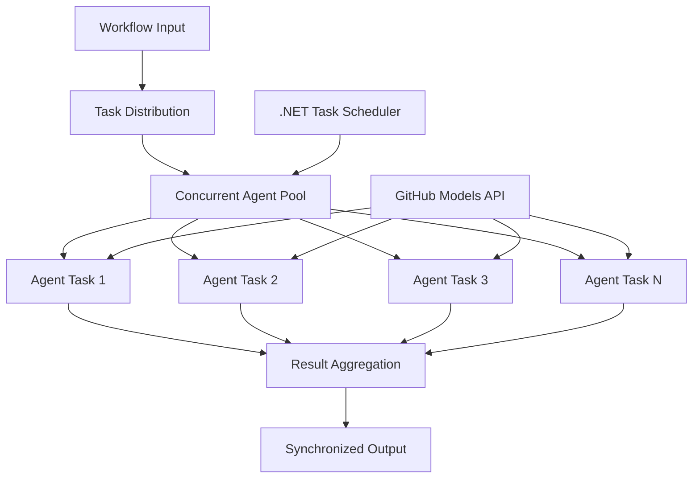

<!--
CO_OP_TRANSLATOR_METADATA:
{
  "original_hash": "b9c6e32c9b5f2fed20b6916984440d88",
  "translation_date": "2025-11-11T13:09:57+00:00",
  "source_file": "08-multi-agent/code_samples/workflows-agent-framework/dotNET/03.dotnet-agent-framework-workflow-ghmodel-concurrent.md",
  "language_code": "hk"
}
-->
# ⚡ 使用 GitHub 模型的並行代理工作流程 (.NET)

## 📋 高效能並行處理教學

此筆記本展示了使用 Microsoft Agent Framework for .NET 和 GitHub 模型的 **並行工作流程模式**。您將學習如何構建高效能的並行處理工作流程，通過同時執行多個 AI 代理來最大化吞吐量，同時保持協調和數據一致性。

## 🎯 學習目標

### 🚀 **並行處理基礎**
- **代理並行執行**：同時運行多個 AI 代理以獲得最佳效能
- **Async/Await 模式**：利用 .NET 的異步編程模型進行高效並行處理
- **GitHub 模型整合**：協調多個並行調用 GitHub 的 AI 模型推理服務
- **資源管理**：在並行操作中高效管理 AI 模型資源

### 🏗️ **高級並行架構**
- **基於任務的並行性**：使用 .NET 任務並行庫進行最佳並行執行
- **同步模式**：協調並行代理，避免競爭條件
- **負載平衡**：高效分配工作至可用的並行處理容量
- **容錯性**：處理個別代理失敗而不停止整個工作流程

### 🏢 **企業級並行應用**
- **高容量文件處理**：同時處理多個文件
- **實時內容分析**：並行分析即時數據流
- **批量處理優化**：最大化大規模數據處理操作的吞吐量
- **多模態分析**：並行處理不同的內容類型和格式

## ⚙️ 先決條件與設置

### 📦 **所需 NuGet 套件**

高效能並行工作流程的必要套件：

```xml
<!-- Core AI Framework with Async Support -->
<PackageReference Include="Microsoft.Extensions.AI" Version="9.9.0" />

<!-- Client Model Abstractions for API Communication -->
<PackageReference Include="System.ClientModel" Version="1.6.1.0" />

<!-- Azure Identity and Async LINQ for Advanced Operations -->
<PackageReference Include="Azure.Identity" Version="1.15.0" />
<PackageReference Include="System.Linq.Async" Version="6.0.3" />

<!-- Local Agent Framework References -->
<!-- Microsoft.Agents.AI.dll - Core agent abstractions with async support -->
<!-- Microsoft.Agents.AI.OpenAI.dll - GitHub Models integration with concurrency -->
```

### 🔑 **GitHub 模型配置**

**環境設置 (.env 文件)：**
```env
GITHUB_TOKEN=your_github_personal_access_token
GITHUB_ENDPOINT=https://models.inference.ai.azure.com
GITHUB_MODEL_ID=gpt-4o-mini
```

**並行處理考量：**
```csharp
// Configure for concurrent operations
var clientOptions = new OpenAIClientOptions()
{
    Endpoint = new Uri(githubEndpoint),
    // Configure connection pooling for concurrent requests
    NetworkTimeout = TimeSpan.FromMinutes(5)
};
```

### 🏗️ **並行工作流程架構**



**主要組件：**
- **任務並行庫**：.NET 對並行操作的內建支持
- **代理池**：多個代理實例進行並行處理
- **結果聚合**：協調並合併並行代理的結果
- **同步點**：確保並行操作中的數據一致性

## 🎨 **並行工作流程設計模式**

### 🔍 **並行研究與分析**
```
Research Topic → Concurrent Research Agents → Result Synthesis → Final Report
```

### 📊 **多來源數據處理**
```
Data Sources → Parallel Processing Agents → Data Integration → Unified Output
```

### 🎭 **內容生成管道**
```
Content Requirements → Concurrent Content Generators → Quality Review → Final Content
```

### 🔄 **分散/集中處理**
```
Single Input → Multiple Concurrent Processors → Result Aggregation → Single Output
```

## 🏢 **企業效能優勢**

### ⚡ **吞吐量與可擴展性**
- **線性效能擴展**：增加更多並行代理以提高吞吐量
- **資源利用率**：最大化可用 AI 模型容量的效率
- **縮短處理時間**：通過並行執行顯著減少時間
- **彈性擴展**：根據工作負載動態調整並行代理數量

### 🛡️ **可靠性與韌性**
- **故障隔離**：個別代理失敗不影響其他並行操作
- **優雅降級**：系統在代理容量減少的情況下繼續運行
- **錯誤恢復**：對失敗的並行操作進行自動重試機制
- **負載分配**：均勻分配工作至可用代理

### 📊 **效能監控**
- **並行執行指標**：追蹤所有並行操作的效能
- **資源使用分析**：監控 CPU、內存和網絡使用情況
- **吞吐量分析**：衡量並行處理帶來的效率提升
- **瓶頸檢測**：識別並解決效能限制

### 🔧 **開發與運營**
- **異步編程模型**：利用 .NET 成熟的 async/await 模式
- **任務協調**：內建的任務管理和協調能力
- **異常處理**：全面的並行操作錯誤處理
- **調試支持**：Visual Studio 的並行工作流程調試工具

讓我們用 .NET 構建高效能的並行 AI 工作流程吧！🚀

## 💻 運行代碼

完整實現可在 `03.dotnet-agent-framework-workflow-ghmodel-concurrent.cs` 文件中找到。此文件展示了一個 **分散/集中並行工作流程** 用於旅行規劃：

### 🏗️ **工作流程架構**

```
User Request → ConcurrentStartExecutor → [Researcher Agent || Planner Agent] → ConcurrentAggregationExecutor → Final Output
```

**主要組件：**

1. **ConcurrentStartExecutor**：同時向所有代理廣播用戶請求
2. **Researcher Agent**：並行分析目的地和景點
3. **Planner Agent**：並行創建詳細的旅行計劃
4. **ConcurrentAggregationExecutor**：收集並合併兩個代理的結果

### 🎯 **分散/集中模式**

此工作流程展示了經典的 **分散/集中** 模式：
- **分散**：一條輸入消息同時廣播至多個代理
- **並行處理**：多個代理並行處理相同任務
- **集中**：收集所有代理的結果並合併為單一輸出

### 🚀 運行示例

```bash
# Make the script executable (Unix/Linux/macOS)
chmod +x 03.dotnet-agent-framework-workflow-ghmodel-concurrent.cs

# Run the concurrent workflow
./03.dotnet-agent-framework-workflow-ghmodel-concurrent.cs
```

或在 Windows 上：
```powershell
dotnet run 03.dotnet-agent-framework-workflow-ghmodel-concurrent.cs
```

### 📝 預期輸出

工作流程將：
1. **廣播請求**：向兩個代理發送「計劃一次十二月去西雅圖的旅行」
2. **並行處理**：兩個代理同時工作：
   - Researcher 識別景點和細節
   - Planner 創建行程和物流
3. **聚合**：合併兩個響應為全面的輸出
4. **顯示結果**：展示包含所有信息的合併旅行計劃

### 🔧 自定義選項

**添加更多並行代理：**
```csharp
// Create additional specialized agents
AIAgent budgetAgent = openAIClient.GetChatClient(github_model_id).CreateAIAgent(
    name: "Budget-Agent", instructions: "Calculate travel costs...");

// Add to fan-out
var workflow = new WorkflowBuilder(startExecutor)
    .AddFanOutEdge(startExecutor, targets: [researcherAgent, plannerAgent, budgetAgent])
    .AddFanInEdge(aggregationExecutor, sources: [researcherAgent, plannerAgent, budgetAgent])
    .WithOutputFrom(aggregationExecutor)
    .Build();

// Update aggregation count
if (this._messages.Count == 3) { ... }
```

**修改代理指令：**
```csharp
const string ResearcherAgentInstructions = "Your custom instructions for research...";
const string PlanAgentInstructions = "Your custom instructions for planning...";
```

**更改任務：**
```csharp
StreamingRun run = await InProcessExecution.StreamAsync(
    workflow, 
    "Plan a European vacation for 2 weeks in summer"
);
```

### 🎯 實際應用

此並行模式非常適合：
- **內容創作**：多位作者同時創作不同部分
- **代碼審查**：多位審查員從不同角度分析代碼
- **市場研究**：並行分析不同市場細分
- **文件處理**：並行提取、分析和驗證
- **多角度分析**：對同一輸入獲得多樣化觀點

### 🔍 理解自定義執行器

**ConcurrentStartExecutor：**
- 實現 `IMessageHandler<string>` 接受字符串輸入
- 向所有連接的代理廣播消息
- 發送 `TurnToken` 觸發並行處理

**ConcurrentAggregationExecutor：**
- 實現 `IMessageHandler<ChatMessage>` 接收代理響應
- 以線程安全的方式收集消息
- 當所有預期響應到達時進行聚合
- 使用 `context.YieldOutputAsync()` 提供最終輸出

### ⚡ 效能優勢

**並行 vs 順序：**
- 順序：Agent1 (30秒) → Agent2 (30秒) = **總共 60 秒**
- 並行：Agent1 (30秒) || Agent2 (30秒) = **總共 30 秒**

**吞吐量提升**：對於 N 個並行代理，效能最多提升 N 倍（取決於工作負載和資源）

### 🛡️ 錯誤處理

工作流程能優雅處理個別代理失敗：
- 如果一個代理失敗，其他代理繼續處理
- 聚合器可實現超時邏輯
- 如有需要，可返回部分結果

### 📊 高級功能

**動態代理數量：**
修改聚合邏輯以支持可變代理數量：

```csharp
private int _expectedAgentCount;
private readonly List<ChatMessage> _messages = [];

public async ValueTask HandleAsync(ChatMessage message, IWorkflowContext context)
{
    this._messages.Add(message);
    if (this._messages.Count == _expectedAgentCount)
    {
        // Process aggregation
    }
}
```

此並行工作流程模式是構建高效能、可擴展 AI 代理系統的關鍵！

---

<!-- CO-OP TRANSLATOR DISCLAIMER START -->
**免責聲明**：  
此文件已使用 AI 翻譯服務 [Co-op Translator](https://github.com/Azure/co-op-translator) 進行翻譯。雖然我們致力於提供準確的翻譯，但請注意，自動翻譯可能包含錯誤或不準確之處。原始文件的母語版本應被視為權威來源。對於重要信息，建議使用專業人工翻譯。我們對因使用此翻譯而引起的任何誤解或誤釋不承擔責任。
<!-- CO-OP TRANSLATOR DISCLAIMER END -->