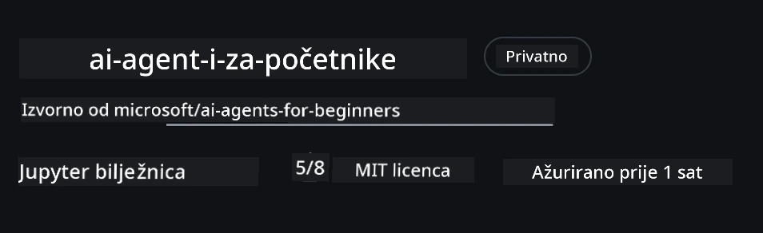
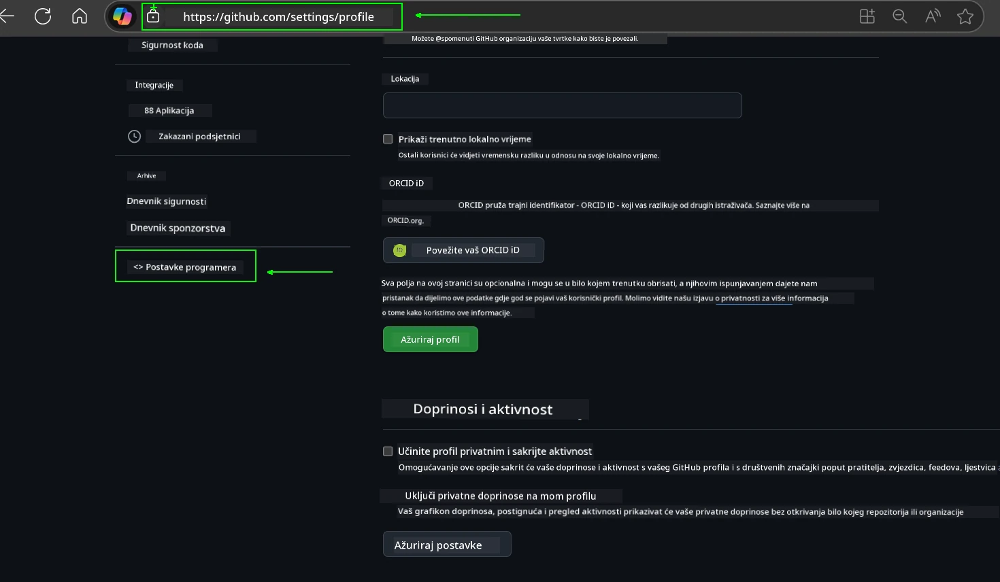
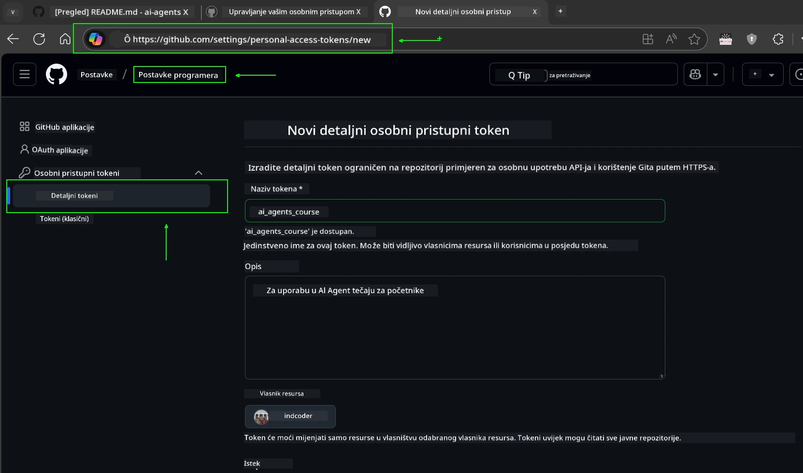
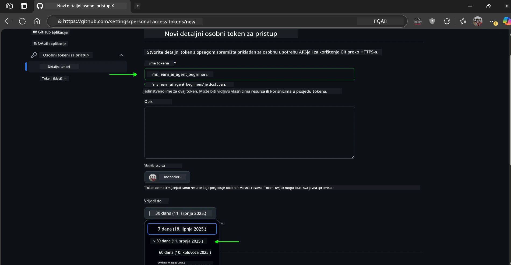
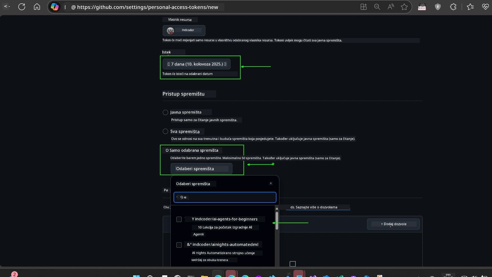
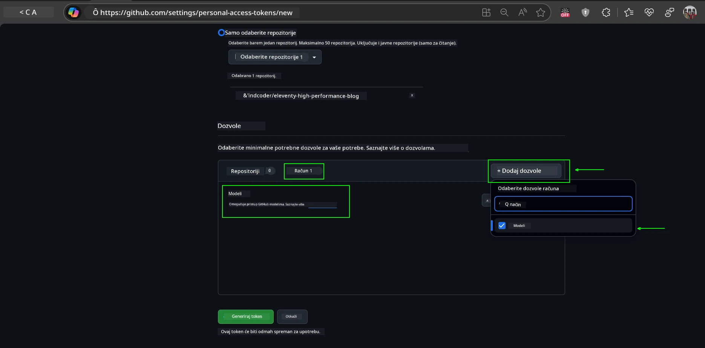
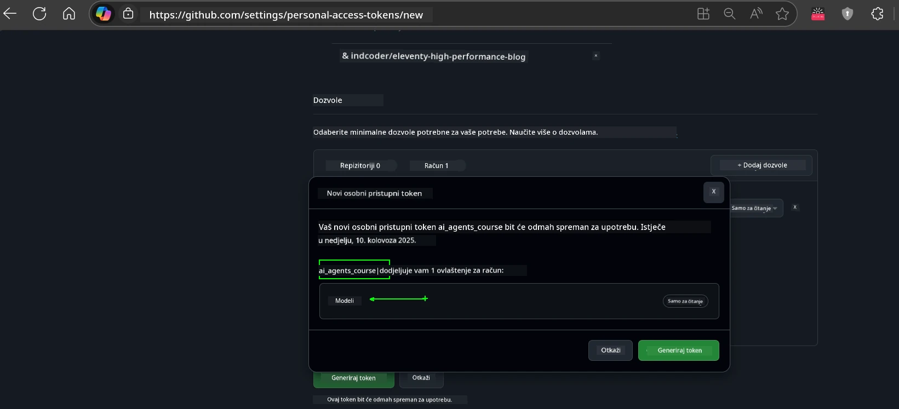
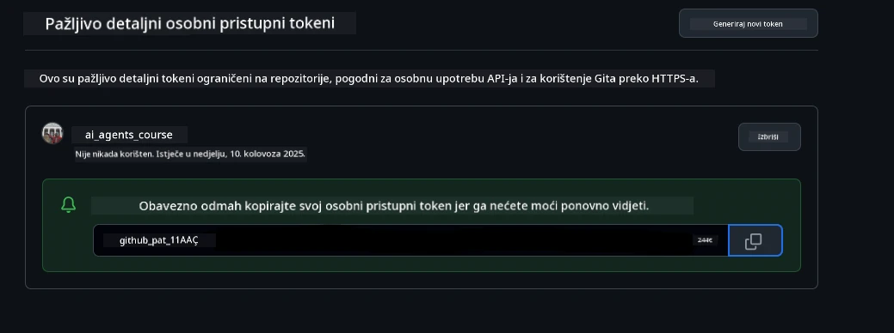
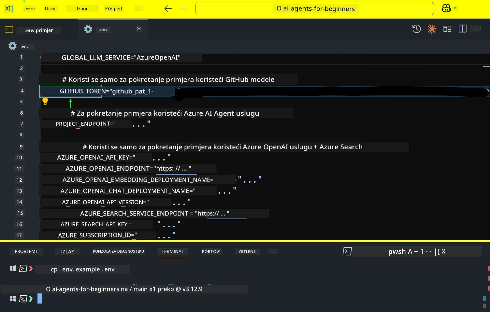
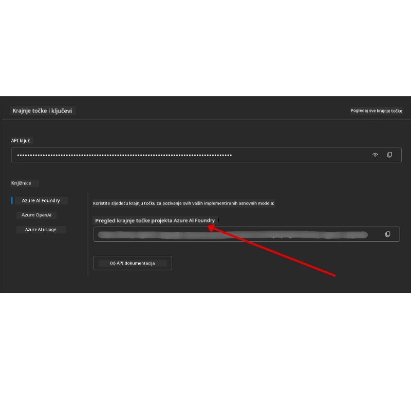

<!--
CO_OP_TRANSLATOR_METADATA:
{
  "original_hash": "63b1a8f6e840df15934935b728e569f0",
  "translation_date": "2025-12-03T15:04:12+00:00",
  "source_file": "00-course-setup/README.md",
  "language_code": "hr"
}
-->
# Postavljanje tečaja

## Uvod

Ova lekcija će obuhvatiti kako pokrenuti uzorke koda ovog tečaja.

## Pridružite se drugim polaznicima i zatražite pomoć

Prije nego što počnete klonirati svoj repozitorij, pridružite se [AI Agents For Beginners Discord kanalu](https://aka.ms/ai-agents/discord) kako biste dobili pomoć oko postavljanja, postavili pitanja o tečaju ili se povezali s drugim polaznicima.

## Klonirajte ili forkajte ovaj repozitorij

Za početak, molimo vas da klonirate ili forkate GitHub repozitorij. Ovo će stvoriti vašu vlastitu verziju materijala tečaja kako biste mogli pokretati, testirati i prilagođavati kod!

To možete učiniti klikom na poveznicu za <a href="https://github.com/microsoft/ai-agents-for-beginners/fork" target="_blank">fork repozitorija</a>

Sada biste trebali imati svoju vlastitu fork verziju ovog tečaja na sljedećoj poveznici:



### Plitko kloniranje (preporučeno za radionice / Codespaces)

  >Cijeli repozitorij može biti velik (~3 GB) kada preuzimate cijelu povijest i sve datoteke. Ako samo prisustvujete radionici ili trebate samo nekoliko mapa lekcija, plitko kloniranje (ili rijetko kloniranje) izbjegava većinu tog preuzimanja skraćivanjem povijesti i/ili preskakanjem blobova.

#### Brzo plitko kloniranje — minimalna povijest, sve datoteke

Zamijenite `<your-username>` u naredbama ispod s URL-om vašeg forka (ili izvornim URL-om ako preferirate).

Za kloniranje samo najnovije povijesti commitova (malo preuzimanje):

```bash|powershell
git clone --depth 1 https://github.com/<your-username>/ai-agents-for-beginners.git
```

Za kloniranje određene grane:

```bash|powershell
git clone --depth 1 --branch <branch-name> https://github.com/<your-username>/ai-agents-for-beginners.git
```

#### Djelomično (rijetko) kloniranje — minimalni blobovi + samo odabrane mape

Ovo koristi djelomično kloniranje i rijetko preuzimanje (zahtijeva Git 2.25+ i preporučuje se moderni Git s podrškom za djelomično kloniranje):

```bash|powershell
git clone --depth 1 --filter=blob:none --sparse https://github.com/<your-username>/ai-agents-for-beginners.git
```

Uđite u mapu repozitorija:

```bash|powershell
cd ai-agents-for-beginners
```

Zatim odredite koje mape želite (primjer ispod prikazuje dvije mape):

```bash|powershell
git sparse-checkout set 00-course-setup 01-intro-to-ai-agents
```

Nakon kloniranja i provjere datoteka, ako trebate samo datoteke i želite osloboditi prostor (bez git povijesti), molimo vas da izbrišete metapodatke repozitorija (💀nepovratno — izgubit ćete svu Git funkcionalnost: nema commitova, povlačenja, guranja ili pristupa povijesti).

```bash
# zsh/bash
rm -rf .git
```

```powershell
# PowerShell
Remove-Item -Recurse -Force .git
```

#### Korištenje GitHub Codespaces (preporučeno za izbjegavanje lokalnih velikih preuzimanja)

- Kreirajte novi Codespace za ovaj repozitorij putem [GitHub sučelja](https://github.com/codespaces).  

- U terminalu novokreiranog Codespace-a, pokrenite jednu od naredbi za plitko/rijetko kloniranje iznad kako biste donijeli samo mape lekcija koje su vam potrebne u radni prostor Codespace-a.
- Opcionalno: nakon kloniranja unutar Codespace-a, uklonite .git kako biste povratili dodatni prostor (pogledajte naredbe za uklanjanje iznad).
- Napomena: Ako preferirate otvoriti repozitorij direktno u Codespace-u (bez dodatnog kloniranja), imajte na umu da će Codespace konstruirati devcontainer okruženje i možda još uvijek osigurati više nego što vam treba. Kloniranje plitke kopije unutar svježeg Codespace-a daje vam veću kontrolu nad korištenjem diska.

#### Savjeti

- Uvijek zamijenite URL kloniranja s vašim forkom ako želite uređivati/commitati.
- Ako kasnije trebate više povijesti ili datoteka, možete ih dohvatiti ili prilagoditi rijetko preuzimanje kako biste uključili dodatne mape.

## Pokretanje koda

Ovaj tečaj nudi niz Jupyter Notebooks koje možete pokrenuti kako biste stekli praktično iskustvo u izradi AI agenata.

Uzorci koda koriste:

**Zahtijeva GitHub račun - Besplatno**:

1) Semantic Kernel Agent Framework + GitHub Models Marketplace. Označeno kao (semantic-kernel.ipynb)
2) AutoGen Framework + GitHub Models Marketplace. Označeno kao (autogen.ipynb)

**Zahtijeva Azure pretplatu**:

3) Azure AI Foundry + Azure AI Agent Service. Označeno kao (azureaiagent.ipynb)

Preporučujemo da isprobate sve tri vrste primjera kako biste vidjeli koji vam najbolje odgovara.

Koju god opciju odabrali, ona će odrediti koje korake postavljanja trebate slijediti u nastavku:

## Zahtjevi

- Python 3.12+
  - **NAPOMENA**: Ako nemate instaliran Python3.12, osigurajte da ga instalirate. Zatim kreirajte svoj venv koristeći python3.12 kako biste osigurali da se instaliraju ispravne verzije iz datoteke requirements.txt.
  
    >Primjer

    Kreirajte Python venv direktorij:

    ```bash|powershell
    python -m venv venv
    ```

    Zatim aktivirajte venv okruženje za:

    ```bash
    # zsh/bash
    source venv/bin/activate
    ```
  
    ```dos
    # Command Prompt for Windows
    venv\Scripts\activate
    ```

- .NET 10+: Za uzorke koda koji koriste .NET, osigurajte da instalirate [.NET 10 SDK](https://dotnet.microsoft.com/download/dotnet/10.0) ili noviji. Zatim provjerite verziju instaliranog .NET SDK-a:

    ```bash|powershell
    dotnet --list-sdks
    ```

- GitHub račun - Za pristup GitHub Models Marketplace-u
- Azure pretplata - Za pristup Azure AI Foundry-u
- Azure AI Foundry račun - Za pristup Azure AI Agent Service-u

U korijenu ovog repozitorija uključili smo datoteku `requirements.txt` koja sadrži sve potrebne Python pakete za pokretanje uzoraka koda.

Možete ih instalirati pokretanjem sljedeće naredbe u terminalu u korijenu repozitorija:

```bash|powershell
pip install -r requirements.txt
```

Preporučujemo kreiranje Python virtualnog okruženja kako biste izbjegli bilo kakve sukobe i probleme.

## Postavljanje VSCode-a

Osigurajte da koristite ispravnu verziju Pythona u VSCode-u.


## Postavljanje za uzorke koji koriste GitHub modele 

### Korak 1: Dohvatite svoj GitHub Personal Access Token (PAT)

Ovaj tečaj koristi GitHub Models Marketplace, pružajući besplatan pristup velikim jezičnim modelima (LLM-ovima) koje ćete koristiti za izradu AI agenata.

Za korištenje GitHub modela, trebat ćete kreirati [GitHub Personal Access Token](https://docs.github.com/en/authentication/keeping-your-account-and-data-secure/managing-your-personal-access-tokens).

To možete učiniti odlaskom na <a href="https://github.com/settings/personal-access-tokens" target="_blank">postavke osobnih pristupnih tokena</a> u svom GitHub računu.

Molimo vas da slijedite [Princip najmanje privilegije](https://docs.github.com/en/get-started/learning-to-code/storing-your-secrets-safely) prilikom kreiranja tokena. To znači da tokenu trebate dati samo dozvole koje su mu potrebne za pokretanje uzoraka koda u ovom tečaju.

1. Odaberite opciju `Fine-grained tokens` na lijevoj strani ekrana prelaskom na **Developer settings**

   

   Zatim odaberite `Generate new token`.

   

2. Unesite opisno ime za svoj token koje odražava njegovu svrhu, čineći ga lakim za identifikaciju kasnije.

    🔐 Preporuka za trajanje tokena

    Preporučeno trajanje: 30 dana
    Za sigurniji pristup možete odabrati kraći period—kao što je 7 dana 🛡️
    To je odličan način da postavite osobni cilj i završite tečaj dok je vaš entuzijazam za učenje visok 🚀.

    

3. Ograničite opseg tokena na vaš fork ovog repozitorija.

    

4. Ograničite dozvole tokena: Pod **Permissions**, kliknite karticu **Account**, i kliknite gumb "+ Add permissions". Pojavit će se padajući izbornik. Molimo vas da potražite **Models** i označite okvir za njega.

    

5. Provjerite potrebne dozvole prije generiranja tokena. 

6. Prije generiranja tokena, osigurajte da ste spremni pohraniti token na sigurno mjesto poput trezora upravitelja lozinki, jer neće biti prikazan ponovno nakon što ga kreirate. 

Kopirajte svoj novi token koji ste upravo kreirali. Sada ćete ga dodati u svoju `.env` datoteku uključenu u ovaj tečaj.

### Korak 2: Kreirajte svoju `.env` datoteku

Za kreiranje `.env` datoteke pokrenite sljedeću naredbu u terminalu.

```bash
# zsh/bash
cp .env.example .env
```

```powershell
# PowerShell
Copy-Item .env.example .env
```

Ovo će kopirati primjer datoteke i kreirati `.env` u vašem direktoriju gdje ćete popuniti vrijednosti za varijable okruženja.

S kopiranim tokenom, otvorite `.env` datoteku u svom omiljenom uređivaču teksta i zalijepite svoj token u polje `GITHUB_TOKEN`.



Sada biste trebali biti u mogućnosti pokrenuti uzorke koda ovog tečaja.

## Postavljanje za uzorke koji koriste Azure AI Foundry i Azure AI Agent Service

### Korak 1: Dohvatite svoj Azure projektni endpoint

Slijedite korake za kreiranje huba i projekta u Azure AI Foundry-u koji se nalaze ovdje: [Pregled resursa huba](https://learn.microsoft.com/azure/ai-foundry/concepts/ai-resources)

Nakon što ste kreirali svoj projekt, trebat ćete dohvatiti vezni niz za svoj projekt.

To možete učiniti odlaskom na stranicu **Pregled** vašeg projekta u Azure AI Foundry portalu.



### Korak 2: Kreirajte svoju `.env` datoteku

Za kreiranje `.env` datoteke pokrenite sljedeću naredbu u terminalu.

```bash
# zsh/bash
cp .env.example .env
```

```powershell
# PowerShell
Copy-Item .env.example .env
```

Ovo će kopirati primjer datoteke i kreirati `.env` u vašem direktoriju gdje ćete popuniti vrijednosti za varijable okruženja.

S kopiranim tokenom, otvorite `.env` datoteku u svom omiljenom uređivaču teksta i zalijepite svoj token u polje `PROJECT_ENDPOINT`.

### Korak 3: Prijavite se na Azure

Kao sigurnosnu najbolju praksu, koristit ćemo [autentifikaciju bez ključa](https://learn.microsoft.com/azure/developer/ai/keyless-connections?tabs=csharp%2Cazure-cli?WT.mc_id=academic-105485-koreyst) za autentifikaciju na Azure OpenAI s Microsoft Entra ID-om. 

Zatim otvorite terminal i pokrenite `az login --use-device-code` kako biste se prijavili na svoj Azure račun.

Nakon što ste se prijavili, odaberite svoju pretplatu u terminalu.

## Dodatne varijable okruženja - Azure Search i Azure OpenAI 

Za lekciju Agentic RAG - Lekcija 5 - postoje uzorci koji koriste Azure Search i Azure OpenAI.

Ako želite pokrenuti ove uzorke, trebat ćete dodati sljedeće varijable okruženja u svoju `.env` datoteku:

### Stranica Pregled (Projekt)

- `AZURE_SUBSCRIPTION_ID` - Provjerite **Detalje projekta** na stranici **Pregled** vašeg projekta.

- `AZURE_AI_PROJECT_NAME` - Pogledajte vrh stranice **Pregled** za vaš projekt.

- `AZURE_OPENAI_SERVICE` - Pronađite ovo na kartici **Uključene mogućnosti** za **Azure OpenAI Service** na stranici **Pregled**.

### Centar za upravljanje

- `AZURE_OPENAI_RESOURCE_GROUP` - Idite na **Svojstva projekta** na stranici **Pregled** u **Centru za upravljanje**.

- `GLOBAL_LLM_SERVICE` - Pod **Povezani resursi**, pronađite naziv veze **Azure AI Services**. Ako nije navedeno, provjerite **Azure portal** pod vašom grupom resursa za naziv resursa AI Services.

### Stranica Modeli + Endpointi

- `AZURE_OPENAI_EMBEDDING_DEPLOYMENT_NAME` - Odaberite svoj model za ugrađivanje (npr. `text-embedding-ada-002`) i zabilježite **Naziv implementacije** iz detalja modela.

- `AZURE_OPENAI_CHAT_DEPLOYMENT_NAME` - Odaberite svoj model za chat (npr. `gpt-4o-mini`) i zabilježite **Naziv implementacije** iz detalja modela.

### Azure portal

- `AZURE_OPENAI_ENDPOINT` - Potražite **Azure AI services**, kliknite na njega, zatim idite na **Upravljanje resursima**, **Ključevi i Endpoint**, pomaknite se dolje do "Azure OpenAI endpoints", i kopirajte onaj koji kaže "Language APIs".

- `AZURE_OPENAI_API_KEY` - Na istoj stranici, kopirajte KLJUČ 1 ili KLJUČ 2.

- `AZURE_SEARCH_SERVICE_ENDPOINT` - Pronađite svoj **Azure AI Search** resurs, kliknite na njega, i pogledajte **Pregled**.

- `AZURE_SEARCH_API_KEY` - Zatim idite na **Postavke** i zatim **Ključevi** kako biste kopirali primarni ili sekundarni administratorski ključ.

### Vanjska web stranica

- `AZURE_OPENAI_API_VERSION` - Posjetite stranicu [API verzija životnog ciklusa](https://learn.microsoft.com/azure/ai-services/openai/api-version-deprecation#latest-ga-api-release) pod **Najnovije GA API izdanje**.

### Postavljanje autentifikacije bez ključa

Umjesto da hardkodirate svoje vjerodajnice, koristit ćemo vezu bez ključa s Azure OpenAI. Za to ćemo uvesti `DefaultAzureCredential` i kasnije pozvati funkciju `DefaultAzureCredential` za dobivanje vjerodajnice.

```python
# Python
from azure.identity import DefaultAzureCredential, InteractiveBrowserCredential
```

## Zapeli ste negdje?
Ako imate bilo kakvih problema s pokretanjem ove postavke, pridružite se našem <a href="https://discord.gg/kzRShWzttr" target="_blank">Azure AI Community Discordu</a> ili <a href="https://github.com/microsoft/ai-agents-for-beginners/issues?WT.mc_id=academic-105485-koreyst" target="_blank">otvorite problem</a>.

## Sljedeća lekcija

Sada ste spremni pokrenuti kod za ovaj tečaj. Sretno u učenju više o svijetu AI agenata!

[Uvod u AI agente i primjene agenata](../01-intro-to-ai-agents/README.md)

---

<!-- CO-OP TRANSLATOR DISCLAIMER START -->
**Odricanje od odgovornosti**:  
Ovaj dokument je preveden pomoću AI usluge za prevođenje [Co-op Translator](https://github.com/Azure/co-op-translator). Iako nastojimo osigurati točnost, imajte na umu da automatski prijevodi mogu sadržavati pogreške ili netočnosti. Izvorni dokument na izvornom jeziku treba smatrati autoritativnim izvorom. Za ključne informacije preporučuje se profesionalni prijevod od strane čovjeka. Ne preuzimamo odgovornost za nesporazume ili pogrešna tumačenja koja proizlaze iz korištenja ovog prijevoda.
<!-- CO-OP TRANSLATOR DISCLAIMER END -->