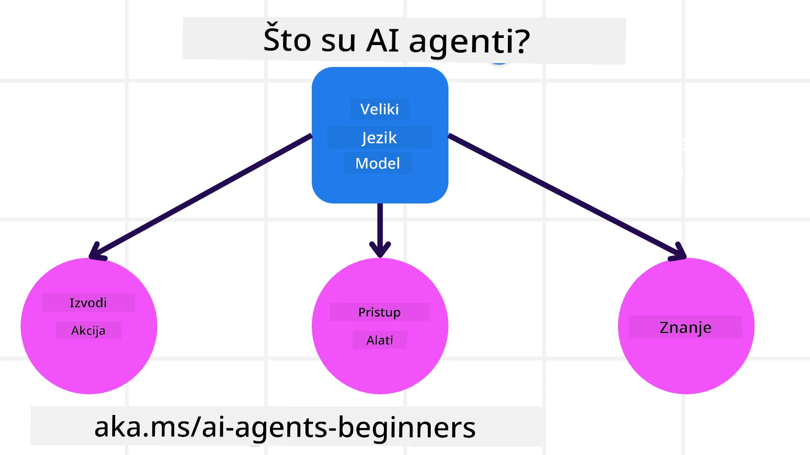
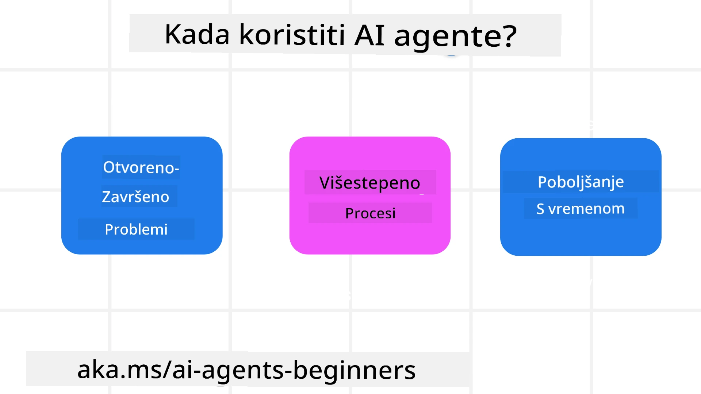

<!--
CO_OP_TRANSLATOR_METADATA:
{
  "original_hash": "cdd28bc00816d2773bb2b5968d782abc",
  "translation_date": "2025-11-11T11:42:38+00:00",
  "source_file": "01-intro-to-ai-agents/README.md",
  "language_code": "hr"
}
-->

> _(Kliknite na sliku iznad za pregled videa ove lekcije)_

# Uvod u AI agente i primjene agenata

Dobrodošli u tečaj "AI Agenti za početnike"! Ovaj tečaj pruža osnovno znanje i primjere za izradu AI agenata.

Pridružite se <a href="https://discord.gg/kzRShWzttr" target="_blank">Azure AI Discord zajednici</a> kako biste upoznali druge polaznike i graditelje AI agenata te postavili pitanja o ovom tečaju.

Za početak tečaja, prvo ćemo bolje razumjeti što su AI agenti i kako ih možemo koristiti u aplikacijama i radnim procesima koje gradimo.

## Uvod

Ova lekcija obuhvaća:

- Što su AI agenti i koje vrste agenata postoje?
- Koji su najbolji slučajevi primjene za AI agente i kako nam mogu pomoći?
- Koji su osnovni gradivni blokovi pri dizajniranju rješenja temeljenih na agentima?

## Ciljevi učenja
Nakon završetka ove lekcije, trebali biste moći:

- Razumjeti koncepte AI agenata i kako se razlikuju od drugih AI rješenja.
- Učinkovito primjenjivati AI agente.
- Produktivno dizajnirati rješenja temeljenih na agentima za korisnike i klijente.

## Definiranje AI agenata i vrste AI agenata

### Što su AI agenti?

AI agenti su **sustavi** koji omogućuju **velikim jezičnim modelima (LLMs)** da **izvršavaju radnje** proširujući njihove sposobnosti pružanjem **pristupa alatima** i **znanju**.

Razložimo ovu definiciju na manje dijelove:

- **Sustav** - Važno je razmišljati o agentima ne kao o jednom komponentu, već kao o sustavu mnogih komponenti. Na osnovnoj razini, komponente AI agenta su:
  - **Okruženje** - Definirani prostor u kojem AI agent djeluje. Na primjer, ako imamo AI agenta za rezervaciju putovanja, okruženje može biti sustav za rezervaciju putovanja koji agent koristi za obavljanje zadataka.
  - **Senzori** - Okruženja imaju informacije i pružaju povratne informacije. AI agenti koriste senzore za prikupljanje i interpretaciju tih informacija o trenutnom stanju okruženja. U primjeru agenta za rezervaciju putovanja, sustav za rezervaciju može pružiti informacije poput dostupnosti hotela ili cijena letova.
  - **Aktuatori** - Kada AI agent primi trenutne informacije o stanju okruženja, za trenutni zadatak agent određuje koju radnju treba poduzeti kako bi promijenio okruženje. Za agenta za rezervaciju putovanja, to može biti rezervacija dostupne sobe za korisnika.

**Veliki jezični modeli** - Koncept agenata postojao je prije stvaranja LLM-ova. Prednost izgradnje AI agenata s LLM-ovima je njihova sposobnost interpretacije ljudskog jezika i podataka. Ta sposobnost omogućuje LLM-ovima da interpretiraju informacije iz okruženja i definiraju plan za promjenu okruženja.

**Izvršavanje radnji** - Izvan sustava AI agenata, LLM-ovi su ograničeni na situacije gdje je radnja generiranje sadržaja ili informacija na temelju korisničkog upita. Unutar sustava AI agenata, LLM-ovi mogu obavljati zadatke interpretirajući korisnički zahtjev i koristeći alate dostupne u njihovom okruženju.

**Pristup alatima** - Koji alati su dostupni LLM-u definirano je 1) okruženjem u kojem djeluje i 2) programerom AI agenta. U našem primjeru agenta za putovanja, alati agenta ograničeni su operacijama dostupnim u sustavu za rezervaciju, ili programer može ograničiti pristup alatima agenta na letove.

**Memorija+Znanje** - Memorija može biti kratkoročna u kontekstu razgovora između korisnika i agenta. Dugoročno, izvan informacija koje pruža okruženje, AI agenti također mogu dohvatiti znanje iz drugih sustava, usluga, alata, pa čak i drugih agenata. U primjeru agenta za putovanja, to znanje može biti informacije o korisnikovim preferencijama putovanja smještene u bazi podataka o klijentima.

### Različite vrste agenata

Sada kada imamo opću definiciju AI agenata, pogledajmo neke specifične vrste agenata i kako bi se primijenili na AI agenta za rezervaciju putovanja.

| **Vrsta agenta**              | **Opis**                                                                                                                             | **Primjer**                                                                                                                                                                                                                   |
| ----------------------------- | ------------------------------------------------------------------------------------------------------------------------------------- | ----------------------------------------------------------------------------------------------------------------------------------------------------------------------------------------------------------------------------- |
| **Jednostavni refleksni agenti** | Izvršavaju trenutne radnje na temelju unaprijed definiranih pravila.                                                                 | Agent za putovanja interpretira kontekst e-pošte i prosljeđuje pritužbe na putovanja korisničkoj službi.                                                                                                                      |
| **Refleksni agenti temeljeni na modelu** | Izvršavaju radnje na temelju modela svijeta i promjena tog modela.                                                                | Agent za putovanja prioritizira rute s značajnim promjenama cijena na temelju pristupa povijesnim podacima o cijenama.                                                                                                        |
| **Agenti temeljeni na ciljevima** | Kreiraju planove za postizanje specifičnih ciljeva interpretirajući cilj i određujući radnje za njegovo postizanje.                  | Agent za putovanja rezervira putovanje određivanjem potrebnih aranžmana (auto, javni prijevoz, letovi) od trenutne lokacije do odredišta.                                                                                     |
| **Agenti temeljeni na korisnosti** | Razmatraju preferencije i numerički vagaju kompromise kako bi odredili kako postići ciljeve.                                        | Agent za putovanja maksimizira korisnost vagajući praktičnost naspram troškova pri rezervaciji putovanja.                                                                                                                     |
| **Agenti koji uče**            | Poboljšavaju se s vremenom odgovarajući na povratne informacije i prilagođavajući radnje.                                             | Agent za putovanja poboljšava se koristeći povratne informacije korisnika iz anketa nakon putovanja kako bi napravio prilagodbe za buduće rezervacije.                                                                        |
| **Hijerarhijski agenti**       | Sadrže više agenata u sustavu s više razina, pri čemu agenti višeg nivoa razbijaju zadatke na podzadatke koje agenti nižeg nivoa izvršavaju. | Agent za putovanja otkazuje putovanje dijeleći zadatak na podzadatke (npr. otkazivanje specifičnih rezervacija) i agenti nižeg nivoa ih izvršavaju, izvještavajući agenta višeg nivoa.                                           |
| **Sustavi s više agenata (MAS)** | Agenti samostalno izvršavaju zadatke, bilo suradnički ili natjecateljski.                                                            | Suradnički: Više agenata rezervira specifične usluge putovanja poput hotela, letova i zabave. Natjecateljski: Više agenata upravlja i natječe se oko zajedničkog kalendara rezervacija hotela kako bi rezervirali korisnike u hotel. |

## Kada koristiti AI agente

U prethodnom dijelu koristili smo primjer agenta za putovanja kako bismo objasnili kako se različite vrste agenata mogu koristiti u različitim scenarijima rezervacije putovanja. Nastavit ćemo koristiti ovu aplikaciju tijekom tečaja.

Pogledajmo vrste slučajeva primjene za koje su AI agenti najprikladniji:

- **Problemi otvorenog tipa** - omogućavanje LLM-u da odredi potrebne korake za dovršavanje zadatka jer se ne može uvijek unaprijed kodirati u radni proces.
- **Procesi s više koraka** - zadaci koji zahtijevaju razinu složenosti u kojoj AI agent treba koristiti alate ili informacije tijekom više koraka umjesto jednokratnog dohvaćanja.  
- **Poboljšanje s vremenom** - zadaci gdje se agent može poboljšati s vremenom primajući povratne informacije iz okruženja ili od korisnika kako bi pružio bolju korisnost.

Više razmatranja o korištenju AI agenata pokrivamo u lekciji o izgradnji pouzdanih AI agenata.

## Osnove rješenja temeljenih na agentima

### Razvoj agenata

Prvi korak u dizajniranju sustava AI agenata je definiranje alata, radnji i ponašanja. U ovom tečaju fokusiramo se na korištenje **Azure AI Agent Service** za definiranje naših agenata. Nudi značajke poput:

- Odabir otvorenih modela poput OpenAI, Mistral i Llama
- Korištenje licenciranih podataka putem pružatelja poput Tripadvisora
- Korištenje standardiziranih OpenAPI 3.0 alata

### Obrasci temeljenih na agentima

Komunikacija s LLM-ovima odvija se putem upita. S obzirom na poluautonomnu prirodu AI agenata, nije uvijek moguće ili potrebno ručno ponovno upitati LLM nakon promjene u okruženju. Koristimo **obrasce temeljenih na agentima** koji nam omogućuju upit LLM-u tijekom više koraka na skalabilniji način.

Ovaj tečaj podijeljen je na neke od trenutno popularnih obrazaca temeljenih na agentima.

### Okviri temeljenih na agentima

Okviri temeljenih na agentima omogućuju programerima implementaciju obrazaca temeljenih na agentima putem koda. Ovi okviri nude predloške, dodatke i alate za bolju suradnju AI agenata. Te prednosti pružaju mogućnosti za bolju preglednost i otklanjanje poteškoća u sustavima AI agenata.

U ovom tečaju istražit ćemo istraživački vođen AutoGen okvir i produkcijski spreman Agent okvir iz Semantic Kernel-a.

## Primjeri koda

- Python: [Agent Framework](./code_samples/01-python-agent-framework.ipynb)
- .NET: [Agent Framework](./code_samples/01-dotnet-agent-framework.md)

## Imate li još pitanja o AI agentima?

Pridružite se [Azure AI Foundry Discord](https://aka.ms/ai-agents/discord) kako biste upoznali druge polaznike, sudjelovali u uredskim satima i dobili odgovore na svoja pitanja o AI agentima.

## Prethodna lekcija

[Postavljanje tečaja](../00-course-setup/README.md)

## Sljedeća lekcija

[Istraživanje okvira temeljenih na agentima](../02-explore-agentic-frameworks/README.md)

---

<!-- CO-OP TRANSLATOR DISCLAIMER START -->
**Odricanje od odgovornosti**:  
Ovaj dokument je preveden pomoću AI usluge za prevođenje [Co-op Translator](https://github.com/Azure/co-op-translator). Iako nastojimo osigurati točnost, imajte na umu da automatski prijevodi mogu sadržavati pogreške ili netočnosti. Izvorni dokument na izvornom jeziku treba smatrati autoritativnim izvorom. Za ključne informacije preporučuje se profesionalni prijevod od strane čovjeka. Ne preuzimamo odgovornost za nesporazume ili pogrešna tumačenja koja proizlaze iz korištenja ovog prijevoda.
<!-- CO-OP TRANSLATOR DISCLAIMER END -->