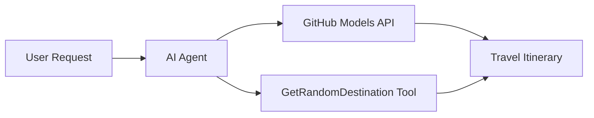

<!--
CO_OP_TRANSLATOR_METADATA:
{
  "original_hash": "5f351412e934f0833c8c821a0a60efaf",
  "translation_date": "2025-11-13T14:21:34+00:00",
  "source_file": "01-intro-to-ai-agents/code_samples/01-dotnet-agent-framework.md",
  "language_code": "hr"
}
-->
# 🌍 AI Putni Agent s Microsoft Agent Frameworkom (.NET)

## 📋 Pregled scenarija

Ovaj primjer pokazuje kako izraditi inteligentnog agenta za planiranje putovanja koristeći Microsoft Agent Framework za .NET. Agent može automatski generirati personalizirane jednodnevne itinerere za nasumične destinacije širom svijeta.

### Ključne mogućnosti:

- 🎲 **Nasumični odabir destinacije**: Koristi prilagođeni alat za odabir lokacija za odmor
- 🗺️ **Inteligentno planiranje putovanja**: Kreira detaljne itinerere po danima
- 🔄 **Streaming u stvarnom vremenu**: Podržava trenutne i streaming odgovore
- 🛠️ **Integracija prilagođenih alata**: Pokazuje kako proširiti mogućnosti agenta

## 🔧 Tehnička arhitektura

### Osnovne tehnologije

- **Microsoft Agent Framework**: Najnovija .NET implementacija za razvoj AI agenata
- **Integracija GitHub modela**: Koristi GitHubovu uslugu za inferenciju AI modela
- **Kompatibilnost s OpenAI API-jem**: Koristi OpenAI klijentske biblioteke s prilagođenim endpointima
- **Sigurna konfiguracija**: Upravljanje API ključevima putem okruženja

### Ključne komponente

1. **AIAgent**: Glavni orkestrator agenta koji upravlja tokom razgovora
2. **Prilagođeni alati**: Funkcija `GetRandomDestination()` dostupna agentu
3. **Chat klijent**: Sučelje za razgovor podržano GitHub modelima
4. **Podrška za streaming**: Sposobnost generiranja odgovora u stvarnom vremenu

### Integracijski obrazac



## 🚀 Početak rada

### Preduvjeti

- [.NET 10 SDK](https://dotnet.microsoft.com/download/dotnet/10.0) ili noviji
- [GitHub Models API pristupni token](https://docs.github.com/github-models/github-models-at-scale/using-your-own-api-keys-in-github-models)

### Potrebne varijable okruženja

```bash
# zsh/bash
export GH_TOKEN=<your_github_token>
export GH_ENDPOINT=https://models.github.ai/inference
export GH_MODEL_ID=openai/gpt-5-mini
```

```powershell
# PowerShell
$env:GH_TOKEN = "<your_github_token>"
$env:GH_ENDPOINT = "https://models.github.ai/inference"
$env:GH_MODEL_ID = "openai/gpt-5-mini"
```

### Primjer koda

Za pokretanje primjera koda,

```bash
# zsh/bash
chmod +x ./01-dotnet-agent-framework.cs
./01-dotnet-agent-framework.cs
```

Ili koristeći dotnet CLI:

```bash
dotnet run ./01-dotnet-agent-framework.cs
```

Pogledajte [`01-dotnet-agent-framework.cs`](../../../../01-intro-to-ai-agents/code_samples/01-dotnet-agent-framework.cs) za kompletan kod.

```csharp
#!/usr/bin/dotnet run

#:package Microsoft.Extensions.AI@9.*
#:package Microsoft.Agents.AI.OpenAI@1.*-*

using System.ClientModel;
using System.ComponentModel;

using Microsoft.Agents.AI;
using Microsoft.Extensions.AI;

using OpenAI;

// Tool Function: Random Destination Generator
// This static method will be available to the agent as a callable tool
// The [Description] attribute helps the AI understand when to use this function
// This demonstrates how to create custom tools for AI agents
[Description("Provides a random vacation destination.")]
static string GetRandomDestination()
{
    // List of popular vacation destinations around the world
    // The agent will randomly select from these options
    var destinations = new List<string>
    {
        "Paris, France",
        "Tokyo, Japan",
        "New York City, USA",
        "Sydney, Australia",
        "Rome, Italy",
        "Barcelona, Spain",
        "Cape Town, South Africa",
        "Rio de Janeiro, Brazil",
        "Bangkok, Thailand",
        "Vancouver, Canada"
    };

    // Generate random index and return selected destination
    // Uses System.Random for simple random selection
    var random = new Random();
    int index = random.Next(destinations.Count);
    return destinations[index];
}

// Extract configuration from environment variables
// Retrieve the GitHub Models API endpoint, defaults to https://models.github.ai/inference if not specified
// Retrieve the model ID, defaults to openai/gpt-5-mini if not specified
// Retrieve the GitHub token for authentication, throws exception if not specified
var github_endpoint = Environment.GetEnvironmentVariable("GH_ENDPOINT") ?? "https://models.github.ai/inference";
var github_model_id = Environment.GetEnvironmentVariable("GH_MODEL_ID") ?? "openai/gpt-5-mini";
var github_token = Environment.GetEnvironmentVariable("GH_TOKEN") ?? throw new InvalidOperationException("GH_TOKEN is not set.");

// Configure OpenAI Client Options
// Create configuration options to point to GitHub Models endpoint
// This redirects OpenAI client calls to GitHub's model inference service
var openAIOptions = new OpenAIClientOptions()
{
    Endpoint = new Uri(github_endpoint)
};

// Initialize OpenAI Client with GitHub Models Configuration
// Create OpenAI client using GitHub token for authentication
// Configure it to use GitHub Models endpoint instead of OpenAI directly
var openAIClient = new OpenAIClient(new ApiKeyCredential(github_token), openAIOptions);

// Create AI Agent with Travel Planning Capabilities
// Initialize OpenAI client, get chat client for specified model, and create AI agent
// Configure agent with travel planning instructions and random destination tool
// The agent can now plan trips using the GetRandomDestination function
AIAgent agent = openAIClient
    .GetChatClient(github_model_id)
    .CreateAIAgent(
        instructions: "You are a helpful AI Agent that can help plan vacations for customers at random destinations",
        tools: [AIFunctionFactory.Create(GetRandomDestination)]
    );

// Execute Agent: Plan a Day Trip
// Run the agent with streaming enabled for real-time response display
// Shows the agent's thinking and response as it generates the content
// Provides better user experience with immediate feedback
await foreach (var update in agent.RunStreamingAsync("Plan me a day trip"))
{
    await Task.Delay(10);
    Console.Write(update);
}
```

## 🎓 Ključne lekcije

1. **Arhitektura agenta**: Microsoft Agent Framework pruža čist i tip-siguran pristup za izradu AI agenata u .NET-u
2. **Integracija alata**: Funkcije označene atributima `[Description]` postaju dostupni alati za agenta
3. **Upravljanje konfiguracijom**: Varijable okruženja i sigurno rukovanje vjerodajnicama slijede najbolje prakse .NET-a
4. **Kompatibilnost s OpenAI**: Integracija GitHub modela besprijekorno funkcionira putem OpenAI-kompatibilnih API-ja

## 🔗 Dodatni resursi

- [Microsoft Agent Framework Dokumentacija](https://learn.microsoft.com/agent-framework)
- [GitHub Models Marketplace](https://github.com/marketplace?type=models)
- [Microsoft.Extensions.AI](https://learn.microsoft.com/dotnet/ai/microsoft-extensions-ai)
- [.NET Single File Apps](https://devblogs.microsoft.com/dotnet/announcing-dotnet-run-app)

---

<!-- CO-OP TRANSLATOR DISCLAIMER START -->
**Odricanje od odgovornosti**:  
Ovaj dokument je preveden pomoću AI usluge za prevođenje [Co-op Translator](https://github.com/Azure/co-op-translator). Iako nastojimo osigurati točnost, imajte na umu da automatski prijevodi mogu sadržavati pogreške ili netočnosti. Izvorni dokument na izvornom jeziku treba smatrati autoritativnim izvorom. Za ključne informacije preporučuje se profesionalni prijevod od strane čovjeka. Ne preuzimamo odgovornost za nesporazume ili pogrešna tumačenja koja proizlaze iz korištenja ovog prijevoda.
<!-- CO-OP TRANSLATOR DISCLAIMER END -->