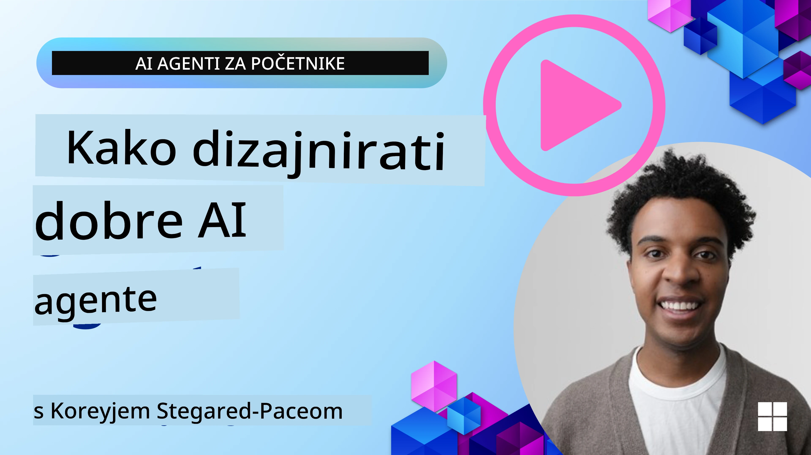
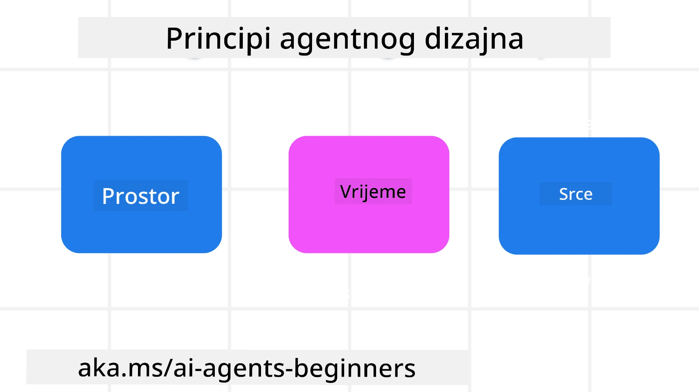

<!--
CO_OP_TRANSLATOR_METADATA:
{
  "original_hash": "d71524fe83a23829ae7a23b4031aaac8",
  "translation_date": "2025-11-13T14:25:15+00:00",
  "source_file": "03-agentic-design-patterns/README.md",
  "language_code": "hr"
}
-->

> _(Kliknite na sliku iznad za pregled videa ove lekcije)_
# Principi dizajna agentičkih AI sustava

## Uvod

Postoji mnogo načina za razmišljanje o izgradnji agentičkih AI sustava. S obzirom na to da je dvosmislenost značajka, a ne greška u dizajnu generativne umjetne inteligencije, inženjerima je ponekad teško odrediti odakle početi. Stvorili smo skup principa dizajna korisničkog iskustva usmjerenih na ljude kako bismo omogućili programerima da izgrade sustave usmjerene na korisnike koji zadovoljavaju njihove poslovne potrebe. Ovi principi dizajna nisu propisana arhitektura, već početna točka za timove koji definiraju i razvijaju iskustva s agentima.

Općenito, agenti bi trebali:

- Proširiti i skalirati ljudske sposobnosti (brainstorming, rješavanje problema, automatizacija itd.)
- Popuniti praznine u znanju (upoznavanje s novim područjima znanja, prevođenje itd.)
- Omogućiti i podržati suradnju na način na koji pojedinci preferiraju raditi s drugima
- Učiniti nas boljim verzijama nas samih (npr. životni trener/organizator zadataka, pomoć u učenju emocionalne regulacije i vještina svjesnosti, izgradnja otpornosti itd.)

## Ova lekcija pokriva

- Što su principi dizajna agentičkih sustava
- Koje smjernice treba slijediti prilikom implementacije ovih principa dizajna
- Primjere korištenja principa dizajna

## Ciljevi učenja

Nakon završetka ove lekcije, moći ćete:

1. Objasniti što su principi dizajna agentičkih sustava
2. Objasniti smjernice za korištenje principa dizajna agentičkih sustava
3. Razumjeti kako izgraditi agenta koristeći principe dizajna agentičkih sustava

## Principi dizajna agentičkih sustava

### Agent (Prostor)

Ovo je okruženje u kojem agent djeluje. Ovi principi informiraju kako dizajniramo agente za angažman u fizičkim i digitalnim svjetovima.

- **Povezivanje, ne urušavanje** – pomaže povezati ljude s drugim ljudima, događajima i korisnim znanjem kako bi omogućio suradnju i povezivanje.
- Agenti pomažu povezati događaje, znanje i ljude.
- Agenti zbližavaju ljude. Nisu dizajnirani da zamijene ili umanje ljude.
- **Lako dostupan, ali povremeno nevidljiv** – agent uglavnom djeluje u pozadini i javlja se samo kada je to relevantno i prikladno.
  - Agent je lako dostupan i dostupan ovlaštenim korisnicima na bilo kojem uređaju ili platformi.
  - Agent podržava multimodalne ulaze i izlaze (zvuk, glas, tekst itd.).
  - Agent može neprimjetno prelaziti između prednjeg i pozadinskog plana; između proaktivnog i reaktivnog, ovisno o potrebama korisnika.
  - Agent može djelovati u nevidljivom obliku, ali je njegov proces u pozadini i suradnja s drugim agentima transparentna i pod kontrolom korisnika.

### Agent (Vrijeme)

Ovo je način na koji agent djeluje tijekom vremena. Ovi principi informiraju kako dizajniramo agente koji djeluju kroz prošlost, sadašnjost i budućnost.

- **Prošlost**: Refleksija na povijest koja uključuje i stanje i kontekst.
  - Agent pruža relevantnije rezultate na temelju analize bogatijih povijesnih podataka, a ne samo događaja, ljudi ili stanja.
  - Agent stvara poveznice iz prošlih događaja i aktivno reflektira na memoriju kako bi se angažirao u trenutnim situacijama.
- **Sadašnjost**: Poticanje više nego obavještavanje.
  - Agent utjelovljuje sveobuhvatan pristup interakciji s ljudima. Kada se dogodi događaj, agent ide dalje od statičnih obavijesti ili drugih formalnosti. Agent može pojednostaviti procese ili dinamički generirati upute kako bi usmjerio pažnju korisnika u pravom trenutku.
  - Agent isporučuje informacije na temelju kontekstualnog okruženja, društvenih i kulturnih promjena te prilagođene korisničkoj namjeri.
  - Interakcija s agentom može biti postupna, razvijajući se/rastući u složenosti kako bi osnažila korisnike dugoročno.
- **Budućnost**: Prilagodba i evolucija.
  - Agent se prilagođava različitim uređajima, platformama i modalitetima.
  - Agent se prilagođava ponašanju korisnika, potrebama pristupačnosti i slobodno je prilagodljiv.
  - Agent se oblikuje i razvija kroz kontinuiranu interakciju s korisnicima.

### Agent (Jezgra)

Ovo su ključni elementi u jezgri dizajna agenta.

- **Prihvatite nesigurnost, ali uspostavite povjerenje**.
  - Određena razina nesigurnosti agenta je očekivana. Nesigurnost je ključni element dizajna agenta.
  - Povjerenje i transparentnost su temeljni slojevi dizajna agenta.
  - Ljudi kontroliraju kada je agent uključen/isključen, a status agenta je uvijek jasno vidljiv.

## Smjernice za implementaciju ovih principa

Kada koristite prethodne principe dizajna, koristite sljedeće smjernice:

1. **Transparentnost**: Informirajte korisnika da je AI uključen, kako funkcionira (uključujući prošle radnje) i kako dati povratne informacije i modificirati sustav.
2. **Kontrola**: Omogućite korisniku prilagodbu, specificiranje preferencija i personalizaciju te kontrolu nad sustavom i njegovim atributima (uključujući mogućnost zaboravljanja).
3. **Dosljednost**: Ciljajte na dosljedna, multimodalna iskustva na svim uređajima i krajnjim točkama. Koristite poznate UI/UX elemente gdje je to moguće (npr. ikona mikrofona za glasovnu interakciju) i smanjite kognitivno opterećenje korisnika što je više moguće (npr. ciljajte na sažete odgovore, vizualne pomagala i sadržaj "Saznajte više").

## Kako dizajnirati putničkog agenta koristeći ove principe i smjernice

Zamislite da dizajnirate putničkog agenta, evo kako biste mogli razmišljati o korištenju principa dizajna i smjernica:

1. **Transparentnost** – Obavijestite korisnika da je putnički agent AI agent. Pružite osnovne upute kako započeti (npr. poruka "Pozdrav", primjeri upita). Jasno to dokumentirajte na stranici proizvoda. Prikažite popis upita koje je korisnik postavio u prošlosti. Jasno naznačite kako dati povratne informacije (palac gore i dolje, gumb "Pošalji povratne informacije" itd.). Jasno artikulirajte ima li agent ograničenja u korištenju ili temama.
2. **Kontrola** – Osigurajte da je jasno kako korisnik može modificirati agenta nakon što je kreiran, s opcijama poput sistemskog upita. Omogućite korisniku da odabere koliko će agent biti opširan, njegov stil pisanja i sve teme o kojima agent ne bi trebao govoriti. Dopustite korisniku pregled i brisanje povezanih datoteka ili podataka, upita i prošlih razgovora.
3. **Dosljednost** – Osigurajte da su ikone za dijeljenje upita, dodavanje datoteke ili fotografije te označavanje nekoga ili nečega standardne i prepoznatljive. Koristite ikonu spajalice za označavanje prijenosa/dijeljenja datoteka s agentom i ikonu slike za označavanje prijenosa grafike.

## Primjeri koda

- Python: [Agent Framework](./code_samples/03-python-agent-framework.ipynb)
- .NET: [Agent Framework](./code_samples/03-dotnet-agent-framework.md)

## Imate li dodatnih pitanja o uzorcima dizajna agentičkih AI sustava?

Pridružite se [Azure AI Foundry Discordu](https://aka.ms/ai-agents/discord) kako biste se povezali s drugim učenicima, sudjelovali u uredskim satima i dobili odgovore na svoja pitanja o AI agentima.

## Dodatni resursi

- <a href="https://openai.com" target="_blank">Prakse za upravljanje agentičkim AI sustavima | OpenAI</a>
- <a href="https://microsoft.com" target="_blank">Projekt HAX Toolkit - Microsoft Research</a>
- <a href="https://responsibleaitoolbox.ai" target="_blank">Alati za odgovornu umjetnu inteligenciju</a>

## Prethodna lekcija

[Istraživanje agentičkih okvira](../02-explore-agentic-frameworks/README.md)

## Sljedeća lekcija

[Uzorak dizajna za korištenje alata](../04-tool-use/README.md)

---

<!-- CO-OP TRANSLATOR DISCLAIMER START -->
**Odricanje od odgovornosti**:  
Ovaj dokument je preveden pomoću AI usluge za prevođenje [Co-op Translator](https://github.com/Azure/co-op-translator). Iako nastojimo osigurati točnost, imajte na umu da automatski prijevodi mogu sadržavati pogreške ili netočnosti. Izvorni dokument na izvornom jeziku treba smatrati autoritativnim izvorom. Za ključne informacije preporučuje se profesionalni prijevod od strane čovjeka. Ne odgovaramo za nesporazume ili pogrešna tumačenja koja proizlaze iz korištenja ovog prijevoda.
<!-- CO-OP TRANSLATOR DISCLAIMER END -->