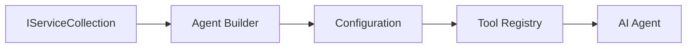

<!--
CO_OP_TRANSLATOR_METADATA:
{
  "original_hash": "bcc874e190347bd6a095aed56dc16de8",
  "translation_date": "2025-11-13T14:26:57+00:00",
  "source_file": "03-agentic-design-patterns/code_samples/03-dotnet-agent-framework.md",
  "language_code": "hr"
}
-->
# 🎨 Agentni dizajnerski obrasci s GitHub modelima (.NET)

## 📋 Ciljevi učenja

Ovaj primjer prikazuje dizajnerske obrasce na razini poduzeća za izradu inteligentnih agenata koristeći Microsoft Agent Framework u .NET-u s integracijom GitHub modela. Naučit ćete profesionalne obrasce i arhitektonske pristupe koji čine agente spremnima za produkciju, održivima i skalabilnima.

### Dizajnerski obrasci za poduzeća

- 🏭 **Obrazac tvornice**: Standardizirano stvaranje agenata s ubrizgavanjem ovisnosti
- 🔧 **Obrazac graditelja**: Fluentna konfiguracija i postavljanje agenata
- 🧵 **Obrasci sigurni za niti**: Upravljanje razgovorima u više niti
- 📋 **Obrazac repozitorija**: Organizirano upravljanje alatima i sposobnostima

## 🎯 Arhitektonske prednosti specifične za .NET

### Značajke za poduzeća

- **Jako tipiziranje**: Provjera valjanosti u vrijeme prevođenja i podrška za IntelliSense
- **Ubrizgavanje ovisnosti**: Integracija ugrađenog DI spremnika
- **Upravljanje konfiguracijom**: Obrasci IConfiguration i Options
- **Async/Await**: Prvoklasna podrška za asinkrono programiranje

### Obrasci spremni za produkciju

- **Integracija zapisivanja**: Podrška za ILogger i strukturirano zapisivanje
- **Provjere zdravlja**: Ugrađeno praćenje i dijagnostika
- **Provjera valjanosti konfiguracije**: Jako tipiziranje s podatkovnim bilješkama
- **Rukovanje pogreškama**: Strukturirano upravljanje iznimkama

## 🔧 Tehnička arhitektura

### Osnovne .NET komponente

- **Microsoft.Extensions.AI**: Ujednačene apstrakcije AI usluga
- **Microsoft.Agents.AI**: Okvir za orkestraciju agenata na razini poduzeća
- **Integracija GitHub modela**: Obrasci klijenata API-ja visokih performansi
- **Sustav konfiguracije**: Integracija appsettings.json i okruženja

### Implementacija dizajnerskih obrazaca



## 🏗️ Prikazani obrasci za poduzeća

### 1. **Kreacijski obrasci**

- **Tvornica agenata**: Centralizirano stvaranje agenata s dosljednom konfiguracijom
- **Obrazac graditelja**: Fluentni API za složenu konfiguraciju agenata
- **Obrazac singletona**: Upravljanje zajedničkim resursima i konfiguracijom
- **Ubrizgavanje ovisnosti**: Slabo povezivanje i testabilnost

### 2. **Ponašajni obrasci**

- **Obrazac strategije**: Zamjenjive strategije izvršavanja alata
- **Obrazac naredbe**: Enkapsulirane operacije agenata s poništavanjem/ponovnim izvršavanjem
- **Obrazac promatrača**: Upravljanje životnim ciklusom agenata vođeno događajima
- **Obrazac metode predloška**: Standardizirani tijekovi izvršavanja agenata

### 3. **Strukturni obrasci**

- **Obrazac adaptera**: Sloj integracije API-ja GitHub modela
- **Obrazac dekoratora**: Poboljšanje sposobnosti agenata
- **Obrazac fasade**: Pojednostavljena sučelja za interakciju s agentima
- **Obrazac proxyja**: Lijeno učitavanje i predmemoriranje za performanse

## 📚 Dizajnerska načela za .NET

### SOLID načela

- **Jedna odgovornost**: Svaka komponenta ima jednu jasnu svrhu
- **Otvoreno/Zatvoreno**: Proširivo bez izmjena
- **Liskovljeva zamjena**: Implementacije alata temeljene na sučelju
- **Razdvajanje sučelja**: Fokusirana, kohezivna sučelja
- **Inverzija ovisnosti**: Oslanjanje na apstrakcije, a ne na konkretne implementacije

### Čista arhitektura

- **Sloj domene**: Osnovne apstrakcije agenata i alata
- **Sloj aplikacije**: Orkestracija agenata i tijekovi rada
- **Sloj infrastrukture**: Integracija GitHub modela i vanjskih usluga
- **Sloj prezentacije**: Interakcija s korisnicima i formatiranje odgovora

## 🔒 Razmatranja za poduzeća

### Sigurnost

- **Upravljanje vjerodajnicama**: Sigurno rukovanje API ključevima s IConfiguration
- **Provjera unosa**: Jako tipiziranje i provjera valjanosti s podatkovnim bilješkama
- **Sanitizacija izlaza**: Sigurna obrada i filtriranje odgovora
- **Zapisivanje revizije**: Sveobuhvatno praćenje operacija

### Performanse

- **Asinkroni obrasci**: Operacije bez blokiranja I/O-a
- **Grupiranje veza**: Učinkovito upravljanje HTTP klijentima
- **Predmemoriranje**: Predmemoriranje odgovora za poboljšane performanse
- **Upravljanje resursima**: Ispravno odlaganje i obrasci čišćenja

### Skalabilnost

- **Sigurnost za niti**: Podrška za istovremeno izvršavanje agenata
- **Grupiranje resursa**: Učinkovito korištenje resursa
- **Upravljanje opterećenjem**: Ograničavanje brzine i rukovanje povratnim pritiskom
- **Praćenje**: Metrike performansi i provjere zdravlja

## 🚀 Produkcijsko postavljanje

- **Upravljanje konfiguracijom**: Postavke specifične za okruženje
- **Strategija zapisivanja**: Strukturirano zapisivanje s ID-ovima za korelaciju
- **Rukovanje pogreškama**: Globalno rukovanje iznimkama s odgovarajućim oporavkom
- **Praćenje**: Application Insights i brojači performansi
- **Testiranje**: Obrasci za jedinično testiranje, integracijsko testiranje i testiranje opterećenja

Spremni za izradu inteligentnih agenata na razini poduzeća s .NET-om? Arhitektirajmo nešto robusno! 🏢✨

## 🚀 Početak rada

### Preduvjeti

- [.NET 10 SDK](https://dotnet.microsoft.com/download/dotnet/10.0) ili noviji
- [Pristupni token za GitHub Models API](https://docs.github.com/github-models/github-models-at-scale/using-your-own-api-keys-in-github-models)

### Potrebne varijable okruženja

```bash
# zsh/bash
export GH_TOKEN=<your_github_token>
export GH_ENDPOINT=https://models.github.ai/inference
export GH_MODEL_ID=openai/gpt-5-mini
```

```powershell
# PowerShell
$env:GH_TOKEN = "<your_github_token>"
$env:GH_ENDPOINT = "https://models.github.ai/inference"
$env:GH_MODEL_ID = "openai/gpt-5-mini"
```

### Primjer koda

Za pokretanje primjera koda,

```bash
# zsh/bash
chmod +x ./03-dotnet-agent-framework.cs
./03-dotnet-agent-framework.cs
```

Ili koristeći dotnet CLI:

```bash
dotnet run ./03-dotnet-agent-framework.cs
```

Pogledajte [`03-dotnet-agent-framework.cs`](../../../../03-agentic-design-patterns/code_samples/03-dotnet-agent-framework.cs) za kompletan kod.

```csharp
#!/usr/bin/dotnet run

#:package Microsoft.Extensions.AI@10.*
#:package Microsoft.Agents.AI.OpenAI@1.*-*

using System.ClientModel;
using System.ComponentModel;

using Microsoft.Agents.AI;
using Microsoft.Extensions.AI;

using OpenAI;

// Tool Function: Random Destination Generator
// This static method will be available to the agent as a callable tool
// The [Description] attribute helps the AI understand when to use this function
// This demonstrates how to create custom tools for AI agents
[Description("Provides a random vacation destination.")]
static string GetRandomDestination()
{
    // List of popular vacation destinations around the world
    // The agent will randomly select from these options
    var destinations = new List<string>
    {
        "Paris, France",
        "Tokyo, Japan",
        "New York City, USA",
        "Sydney, Australia",
        "Rome, Italy",
        "Barcelona, Spain",
        "Cape Town, South Africa",
        "Rio de Janeiro, Brazil",
        "Bangkok, Thailand",
        "Vancouver, Canada"
    };

    // Generate random index and return selected destination
    // Uses System.Random for simple random selection
    var random = new Random();
    int index = random.Next(destinations.Count);
    return destinations[index];
}

// Extract configuration from environment variables
// Retrieve the GitHub Models API endpoint, defaults to https://models.github.ai/inference if not specified
// Retrieve the model ID, defaults to openai/gpt-5-mini if not specified
// Retrieve the GitHub token for authentication, throws exception if not specified
var github_endpoint = Environment.GetEnvironmentVariable("GH_ENDPOINT") ?? "https://models.github.ai/inference";
var github_model_id = Environment.GetEnvironmentVariable("GH_MODEL_ID") ?? "openai/gpt-5-mini";
var github_token = Environment.GetEnvironmentVariable("GH_TOKEN") ?? throw new InvalidOperationException("GH_TOKEN is not set.");

// Configure OpenAI Client Options
// Create configuration options to point to GitHub Models endpoint
// This redirects OpenAI client calls to GitHub's model inference service
var openAIOptions = new OpenAIClientOptions()
{
    Endpoint = new Uri(github_endpoint)
};

// Initialize OpenAI Client with GitHub Models Configuration
// Create OpenAI client using GitHub token for authentication
// Configure it to use GitHub Models endpoint instead of OpenAI directly
var openAIClient = new OpenAIClient(new ApiKeyCredential(github_token), openAIOptions);

// Define Agent Identity and Comprehensive Instructions
// Agent name for identification and logging purposes
var AGENT_NAME = "TravelAgent";

// Detailed instructions that define the agent's personality, capabilities, and behavior
// This system prompt shapes how the agent responds and interacts with users
var AGENT_INSTRUCTIONS = """
You are a helpful AI Agent that can help plan vacations for customers.

Important: When users specify a destination, always plan for that location. Only suggest random destinations when the user hasn't specified a preference.

When the conversation begins, introduce yourself with this message:
"Hello! I'm your TravelAgent assistant. I can help plan vacations and suggest interesting destinations for you. Here are some things you can ask me:
1. Plan a day trip to a specific location
2. Suggest a random vacation destination
3. Find destinations with specific features (beaches, mountains, historical sites, etc.)
4. Plan an alternative trip if you don't like my first suggestion

What kind of trip would you like me to help you plan today?"

Always prioritize user preferences. If they mention a specific destination like "Bali" or "Paris," focus your planning on that location rather than suggesting alternatives.
""";

// Create AI Agent with Advanced Travel Planning Capabilities
// Initialize complete agent pipeline: OpenAI client → Chat client → AI agent
// Configure agent with name, detailed instructions, and available tools
// This demonstrates the .NET agent creation pattern with full configuration
AIAgent agent = openAIClient
    .GetChatClient(github_model_id)
    .CreateAIAgent(
        name: AGENT_NAME,
        instructions: AGENT_INSTRUCTIONS,
        tools: [AIFunctionFactory.Create(GetRandomDestination)]
    );

// Create New Conversation Thread for Context Management
// Initialize a new conversation thread to maintain context across multiple interactions
// Threads enable the agent to remember previous exchanges and maintain conversational state
// This is essential for multi-turn conversations and contextual understanding
AgentThread thread = agent.GetNewThread();

// Execute Agent: First Travel Planning Request
// Run the agent with an initial request that will likely trigger the random destination tool
// The agent will analyze the request, use the GetRandomDestination tool, and create an itinerary
// Using the thread parameter maintains conversation context for subsequent interactions
await foreach (var update in agent.RunStreamingAsync("Plan me a day trip", thread))
{
    await Task.Delay(10);
    Console.Write(update);
}

Console.WriteLine();

// Execute Agent: Follow-up Request with Context Awareness
// Demonstrate contextual conversation by referencing the previous response
// The agent remembers the previous destination suggestion and will provide an alternative
// This showcases the power of conversation threads and contextual understanding in .NET agents
await foreach (var update in agent.RunStreamingAsync("I don't like that destination. Plan me another vacation.", thread))
{
    await Task.Delay(10);
    Console.Write(update);
}
```

---

<!-- CO-OP TRANSLATOR DISCLAIMER START -->
**Odricanje od odgovornosti**:  
Ovaj dokument je preveden pomoću AI usluge za prevođenje [Co-op Translator](https://github.com/Azure/co-op-translator). Iako nastojimo osigurati točnost, imajte na umu da automatski prijevodi mogu sadržavati pogreške ili netočnosti. Izvorni dokument na izvornom jeziku treba smatrati autoritativnim izvorom. Za ključne informacije preporučuje se profesionalni prijevod od strane čovjeka. Ne preuzimamo odgovornost za nesporazume ili pogrešna tumačenja koja proizlaze iz korištenja ovog prijevoda.
<!-- CO-OP TRANSLATOR DISCLAIMER END -->