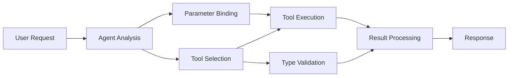

<!--
CO_OP_TRANSLATOR_METADATA:
{
  "original_hash": "91d6061e402489603f2ec8b528cae59b",
  "translation_date": "2025-11-18T18:26:08+00:00",
  "source_file": "04-tool-use/code_samples/04-dotnet-agent-framework.md",
  "language_code": "hr"
}
-->
# 🛠️ Napredno korištenje alata s GitHub modelima (.NET)

## 📋 Ciljevi učenja

Ovaj priručnik prikazuje obrasce integracije alata na razini poduzeća koristeći Microsoft Agent Framework u .NET-u s GitHub modelima. Naučit ćete kako izgraditi sofisticirane agente s više specijaliziranih alata, koristeći snažno tipiziranje C# jezika i značajke .NET-a za poduzeća.

### Napredne sposobnosti alata koje ćete savladati

- 🔧 **Arhitektura s više alata**: Izgradnja agenata s više specijaliziranih mogućnosti
- 🎯 **Izvršavanje alata uz sigurnost tipova**: Iskorištavanje C#-ove provjere u vrijeme kompilacije
- 📊 **Obrasci alata za poduzeća**: Dizajn alata spreman za produkciju i rukovanje greškama
- 🔗 **Kompozicija alata**: Kombiniranje alata za složene poslovne procese

## 🎯 Prednosti arhitekture alata u .NET-u

### Značajke alata za poduzeća

- **Provjera u vrijeme kompilacije**: Snažno tipiziranje osigurava ispravnost parametara alata
- **Ubrizgavanje ovisnosti**: Integracija IoC spremnika za upravljanje alatima
- **Async/Await obrasci**: Neblokirajuće izvršavanje alata uz pravilno upravljanje resursima
- **Strukturirano logiranje**: Ugrađena integracija za praćenje izvršavanja alata

### Obrasci spremni za produkciju

- **Rukovanje iznimkama**: Sveobuhvatno upravljanje greškama uz tipizirane iznimke
- **Upravljanje resursima**: Pravilni obrasci za odlaganje i upravljanje memorijom
- **Praćenje performansi**: Ugrađene metrike i brojači performansi
- **Upravljanje konfiguracijom**: Tipizirana konfiguracija s provjerom valjanosti

## 🔧 Tehnička arhitektura

### Osnovne komponente alata u .NET-u

- **Microsoft.Extensions.AI**: Jedinstveni sloj apstrakcije alata
- **Microsoft.Agents.AI**: Orkestracija alata na razini poduzeća
- **Integracija GitHub modela**: Klijent visokih performansi za API s grupiranjem veza

### Cjevovod za izvršavanje alata



## 🛠️ Kategorije alata i obrasci

### 1. **Alati za obradu podataka**

- **Provjera unosa**: Snažno tipiziranje s anotacijama podataka
- **Operacije transformacije**: Tipizirana konverzija i formatiranje podataka
- **Poslovna logika**: Alati za izračune i analizu specifične za domenu
- **Formatiranje izlaza**: Generiranje strukturiranih odgovora

### 2. **Integracijski alati**

- **API konektori**: Integracija RESTful servisa s HttpClient-om
- **Alati za baze podataka**: Integracija Entity Framework-a za pristup podacima
- **Operacije datoteka**: Sigurne operacije datotečnog sustava s provjerom valjanosti
- **Vanjske usluge**: Obrasci integracije usluga trećih strana

### 3. **Alati za pomoćne funkcije**

- **Obrada teksta**: Manipulacija i formatiranje stringova
- **Operacije s datumima/vremenom**: Izračuni datuma/vremena uzimajući u obzir kulturu
- **Matematički alati**: Precizni izračuni i statističke operacije
- **Alati za provjeru**: Provjera poslovnih pravila i valjanosti podataka

Spremni za izgradnju agenata na razini poduzeća s moćnim, tipiziranim mogućnostima alata u .NET-u? Idemo arhitektirati profesionalna rješenja! 🏢⚡

## 🚀 Početak rada

### Preduvjeti

- [.NET 10 SDK](https://dotnet.microsoft.com/download/dotnet/10.0) ili noviji
- [GitHub Models API pristupni token](https://docs.github.com/github-models/github-models-at-scale/using-your-own-api-keys-in-github-models)

### Potrebne varijable okruženja

```bash
# zsh/bash
export GH_TOKEN=<your_github_token>
export GH_ENDPOINT=https://models.github.ai/inference
export GH_MODEL_ID=openai/gpt-5-mini
```

```powershell
# PowerShell
$env:GH_TOKEN = "<your_github_token>"
$env:GH_ENDPOINT = "https://models.github.ai/inference"
$env:GH_MODEL_ID = "openai/gpt-5-mini"
```

### Primjer koda

Za pokretanje primjera koda,

```bash
# zsh/bash
chmod +x ./04-dotnet-agent-framework.cs
./04-dotnet-agent-framework.cs
```

Ili koristeći dotnet CLI:

```bash
dotnet run ./04-dotnet-agent-framework.cs
```

Pogledajte [`04-dotnet-agent-framework.cs`](../../../../04-tool-use/code_samples/04-dotnet-agent-framework.cs) za kompletan kod.

```csharp
#!/usr/bin/dotnet run

#:package Microsoft.Extensions.AI@10.*
#:package Microsoft.Agents.AI.OpenAI@1.*-*

using System.ClientModel;
using System.ComponentModel;

using Microsoft.Agents.AI;
using Microsoft.Extensions.AI;

using OpenAI;

// Tool Function: Random Destination Generator
// This static method will be available to the agent as a callable tool
// The [Description] attribute helps the AI understand when to use this function
// This demonstrates how to create custom tools for AI agents
[Description("Provides a random vacation destination.")]
static string GetRandomDestination()
{
    // List of popular vacation destinations around the world
    // The agent will randomly select from these options
    var destinations = new List<string>
    {
        "Paris, France",
        "Tokyo, Japan",
        "New York City, USA",
        "Sydney, Australia",
        "Rome, Italy",
        "Barcelona, Spain",
        "Cape Town, South Africa",
        "Rio de Janeiro, Brazil",
        "Bangkok, Thailand",
        "Vancouver, Canada"
    };

    // Generate random index and return selected destination
    // Uses System.Random for simple random selection
    var random = new Random();
    int index = random.Next(destinations.Count);
    return destinations[index];
}

// Extract configuration from environment variables
// Retrieve the GitHub Models API endpoint, defaults to https://models.github.ai/inference if not specified
// Retrieve the model ID, defaults to openai/gpt-5-mini if not specified
// Retrieve the GitHub token for authentication, throws exception if not specified
var github_endpoint = Environment.GetEnvironmentVariable("GH_ENDPOINT") ?? "https://models.github.ai/inference";
var github_model_id = Environment.GetEnvironmentVariable("GH_MODEL_ID") ?? "openai/gpt-5-mini";
var github_token = Environment.GetEnvironmentVariable("GH_TOKEN") ?? throw new InvalidOperationException("GH_TOKEN is not set.");

// Configure OpenAI Client Options
// Create configuration options to point to GitHub Models endpoint
// This redirects OpenAI client calls to GitHub's model inference service
var openAIOptions = new OpenAIClientOptions()
{
    Endpoint = new Uri(github_endpoint)
};

// Initialize OpenAI Client with GitHub Models Configuration
// Create OpenAI client using GitHub token for authentication
// Configure it to use GitHub Models endpoint instead of OpenAI directly
var openAIClient = new OpenAIClient(new ApiKeyCredential(github_token), openAIOptions);

// Define Agent Identity and Comprehensive Instructions
// Agent name for identification and logging purposes
var AGENT_NAME = "TravelAgent";

// Detailed instructions that define the agent's personality, capabilities, and behavior
// This system prompt shapes how the agent responds and interacts with users
var AGENT_INSTRUCTIONS = """
You are a helpful AI Agent that can help plan vacations for customers.

Important: When users specify a destination, always plan for that location. Only suggest random destinations when the user hasn't specified a preference.

When the conversation begins, introduce yourself with this message:
"Hello! I'm your TravelAgent assistant. I can help plan vacations and suggest interesting destinations for you. Here are some things you can ask me:
1. Plan a day trip to a specific location
2. Suggest a random vacation destination
3. Find destinations with specific features (beaches, mountains, historical sites, etc.)
4. Plan an alternative trip if you don't like my first suggestion

What kind of trip would you like me to help you plan today?"

Always prioritize user preferences. If they mention a specific destination like "Bali" or "Paris," focus your planning on that location rather than suggesting alternatives.
""";

// Create AI Agent with Advanced Travel Planning Capabilities
// Initialize complete agent pipeline: OpenAI client → Chat client → AI agent
// Configure agent with name, detailed instructions, and available tools
// This demonstrates the .NET agent creation pattern with full configuration
AIAgent agent = openAIClient
    .GetChatClient(github_model_id)
    .CreateAIAgent(
        name: AGENT_NAME,
        instructions: AGENT_INSTRUCTIONS,
        tools: [AIFunctionFactory.Create(GetRandomDestination)]
    );

// Create New Conversation Thread for Context Management
// Initialize a new conversation thread to maintain context across multiple interactions
// Threads enable the agent to remember previous exchanges and maintain conversational state
// This is essential for multi-turn conversations and contextual understanding
AgentThread thread = agent.GetNewThread();

// Execute Agent: First Travel Planning Request
// Run the agent with an initial request that will likely trigger the random destination tool
// The agent will analyze the request, use the GetRandomDestination tool, and create an itinerary
// Using the thread parameter maintains conversation context for subsequent interactions
await foreach (var update in agent.RunStreamingAsync("Plan me a day trip", thread))
{
    await Task.Delay(10);
    Console.Write(update);
}

Console.WriteLine();

// Execute Agent: Follow-up Request with Context Awareness
// Demonstrate contextual conversation by referencing the previous response
// The agent remembers the previous destination suggestion and will provide an alternative
// This showcases the power of conversation threads and contextual understanding in .NET agents
await foreach (var update in agent.RunStreamingAsync("I don't like that destination. Plan me another vacation.", thread))
{
    await Task.Delay(10);
    Console.Write(update);
}
```

---

<!-- CO-OP TRANSLATOR DISCLAIMER START -->
**Odricanje od odgovornosti**:  
Ovaj dokument je preveden pomoću AI usluge za prevođenje [Co-op Translator](https://github.com/Azure/co-op-translator). Iako težimo točnosti, imajte na umu da automatski prijevodi mogu sadržavati pogreške ili netočnosti. Izvorni dokument na izvornom jeziku treba smatrati mjerodavnim izvorom. Za ključne informacije preporučuje se profesionalni prijevod od strane čovjeka. Ne preuzimamo odgovornost za bilo kakve nesporazume ili pogrešne interpretacije proizašle iz korištenja ovog prijevoda.
<!-- CO-OP TRANSLATOR DISCLAIMER END -->