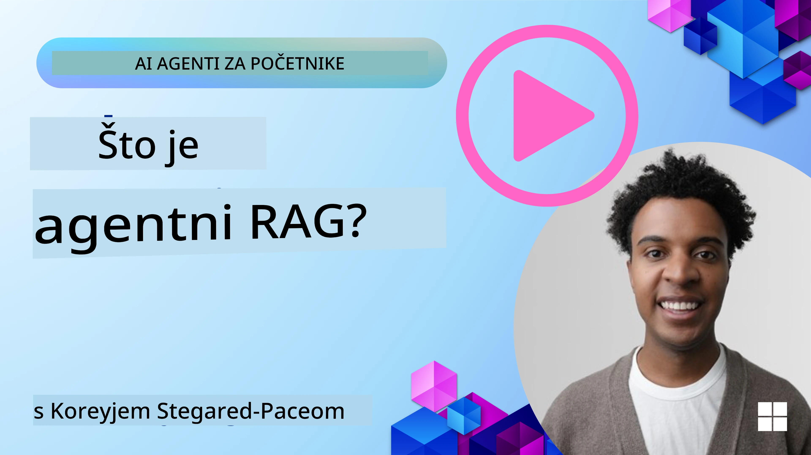
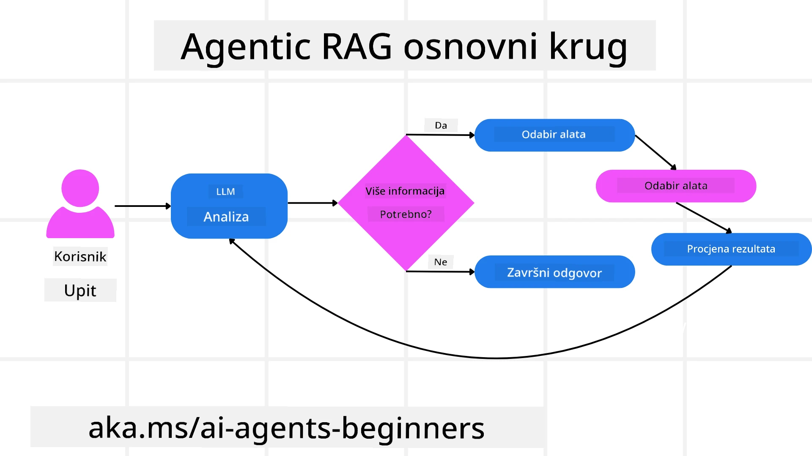
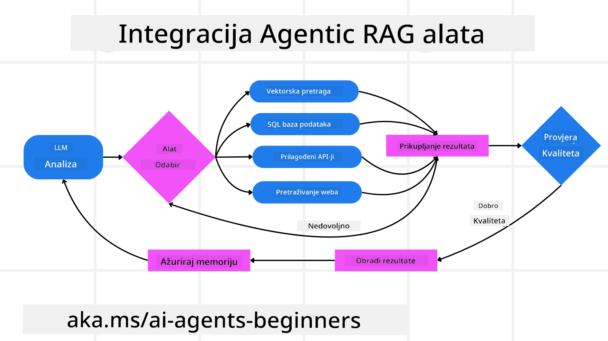
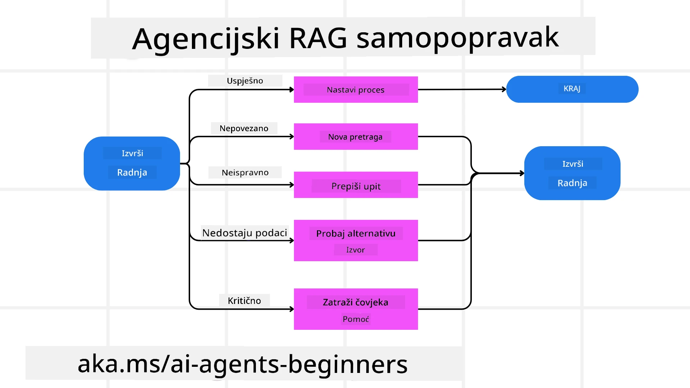
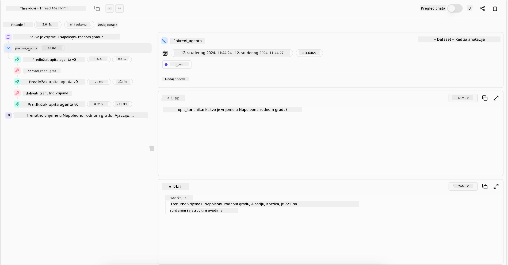

<!--
CO_OP_TRANSLATOR_METADATA:
{
  "original_hash": "0ebf6b2290db55dbf2d10cc49655523b",
  "translation_date": "2025-09-30T07:51:56+00:00",
  "source_file": "05-agentic-rag/README.md",
  "language_code": "hr"
}
-->

> _(Kliknite na sliku iznad za video lekcije)_

# Agentic RAG

Ova lekcija pruža sveobuhvatan pregled Agentic Retrieval-Augmented Generation (Agentic RAG), novog AI pristupa u kojem veliki jezični modeli (LLM-ovi) autonomno planiraju svoje sljedeće korake dok prikupljaju informacije iz vanjskih izvora. Za razliku od statičnih obrazaca "prikupljanje pa čitanje", Agentic RAG uključuje iterativne pozive LLM-u, izmjenjujući se s pozivima alatima ili funkcijama i strukturiranim izlazima. Sustav procjenjuje rezultate, poboljšava upite, poziva dodatne alate ako je potrebno i nastavlja ovaj ciklus dok ne postigne zadovoljavajuće rješenje.

## Uvod

Ova lekcija obuhvaća:

- **Razumijevanje Agentic RAG-a:** Upoznajte se s novim pristupom u AI-u gdje veliki jezični modeli (LLM-ovi) autonomno planiraju svoje sljedeće korake dok prikupljaju informacije iz vanjskih izvora podataka.
- **Iterativni Maker-Checker stil:** Shvatite proces iterativnih poziva LLM-u, izmjenjujući se s pozivima alatima ili funkcijama i strukturiranim izlazima, osmišljenim za poboljšanje točnosti i rješavanje neispravnih upita.
- **Istraživanje praktičnih primjena:** Identificirajte scenarije u kojima Agentic RAG briljira, poput okruženja usmjerenih na točnost, složenih interakcija s bazama podataka i proširenih tijekova rada.

## Ciljevi učenja

Nakon završetka ove lekcije, znat ćete kako/razumjeti:

- **Razumijevanje Agentic RAG-a:** Upoznajte se s novim pristupom u AI-u gdje veliki jezični modeli (LLM-ovi) autonomno planiraju svoje sljedeće korake dok prikupljaju informacije iz vanjskih izvora podataka.
- **Iterativni Maker-Checker stil:** Shvatite koncept iterativnog procesa poziva LLM-u, izmjenjujući se s pozivima alatima ili funkcijama i strukturiranim izlazima, osmišljenim za poboljšanje točnosti i rješavanje neispravnih upita.
- **Vlasništvo nad procesom zaključivanja:** Razumijte sposobnost sustava da preuzme odgovornost za proces zaključivanja, donoseći odluke o pristupu problemima bez oslanjanja na unaprijed definirane putove.
- **Tijek rada:** Shvatite kako agentički model samostalno odlučuje o prikupljanju izvještaja o tržišnim trendovima, identificiranju podataka o konkurenciji, povezivanju internih prodajnih metrika, sintetiziranju nalaza i evaluaciji strategije.
- **Iterativni ciklusi, integracija alata i memorija:** Naučite o oslanjanju sustava na iterativni obrazac interakcije, održavanju stanja i memorije kroz korake kako bi se izbjegli ponavljajući ciklusi i donosile informirane odluke.
- **Rješavanje neuspjeha i samoispravak:** Istražite robusne mehanizme samoispravka sustava, uključujući iteraciju i ponovno postavljanje upita, korištenje dijagnostičkih alata i oslanjanje na ljudski nadzor.
- **Granice autonomije:** Razumijte ograničenja Agentic RAG-a, fokusirajući se na autonomiju specifičnu za domenu, ovisnost o infrastrukturi i poštivanje sigurnosnih mjera.
- **Praktične primjene i vrijednost:** Identificirajte scenarije u kojima Agentic RAG briljira, poput okruženja usmjerenih na točnost, složenih interakcija s bazama podataka i proširenih tijekova rada.
- **Upravljanje, transparentnost i povjerenje:** Naučite o važnosti upravljanja i transparentnosti, uključujući objašnjivo zaključivanje, kontrolu pristranosti i ljudski nadzor.

## Što je Agentic RAG?

Agentic Retrieval-Augmented Generation (Agentic RAG) je novi AI pristup u kojem veliki jezični modeli (LLM-ovi) autonomno planiraju svoje sljedeće korake dok prikupljaju informacije iz vanjskih izvora. Za razliku od statičnih obrazaca "prikupljanje pa čitanje", Agentic RAG uključuje iterativne pozive LLM-u, izmjenjujući se s pozivima alatima ili funkcijama i strukturiranim izlazima. Sustav procjenjuje rezultate, poboljšava upite, poziva dodatne alate ako je potrebno i nastavlja ovaj ciklus dok ne postigne zadovoljavajuće rješenje. Ovaj iterativni stil "maker-checker" poboljšava točnost, rješava neispravne upite i osigurava visokokvalitetne rezultate.

Sustav aktivno preuzima odgovornost za proces zaključivanja, prepisuje neuspjele upite, bira različite metode prikupljanja informacija i integrira više alata—poput vektorskog pretraživanja u Azure AI Search, SQL baza podataka ili prilagođenih API-ja—prije nego što finalizira svoj odgovor. Ključna kvaliteta agentičkog sustava je njegova sposobnost da preuzme odgovornost za proces zaključivanja. Tradicionalne RAG implementacije oslanjaju se na unaprijed definirane putove, dok agentički sustav autonomno određuje redoslijed koraka na temelju kvalitete pronađenih informacija.

## Definicija Agentic Retrieval-Augmented Generation (Agentic RAG)

Agentic Retrieval-Augmented Generation (Agentic RAG) je novi pristup u razvoju AI-a gdje LLM-ovi ne samo da prikupljaju informacije iz vanjskih izvora podataka, već i autonomno planiraju svoje sljedeće korake. Za razliku od statičnih obrazaca "prikupljanje pa čitanje" ili pažljivo skriptiranih sekvenci upita, Agentic RAG uključuje iterativni proces poziva LLM-u, izmjenjujući se s pozivima alatima ili funkcijama i strukturiranim izlazima. Na svakom koraku sustav procjenjuje rezultate koje je dobio, odlučuje hoće li poboljšati upite, poziva dodatne alate ako je potrebno i nastavlja ovaj ciklus dok ne postigne zadovoljavajuće rješenje.

Ovaj iterativni stil "maker-checker" osmišljen je za poboljšanje točnosti, rješavanje neispravnih upita prema strukturiranim bazama podataka (npr. NL2SQL) i osiguravanje uravnoteženih, visokokvalitetnih rezultata. Umjesto da se oslanja isključivo na pažljivo osmišljene sekvence upita, sustav aktivno preuzima odgovornost za proces zaključivanja. Može prepisati neuspjele upite, odabrati različite metode prikupljanja informacija i integrirati više alata—poput vektorskog pretraživanja u Azure AI Search, SQL baza podataka ili prilagođenih API-ja—prije nego što finalizira svoj odgovor. Ovo uklanja potrebu za prekompliciranim okvirima orkestracije. Umjesto toga, relativno jednostavan ciklus "poziv LLM-u → korištenje alata → poziv LLM-u → …" može rezultirati sofisticiranim i dobro utemeljenim izlazima.

## Vlasništvo nad procesom zaključivanja

Ključna kvaliteta koja sustav čini "agentičkim" je njegova sposobnost da preuzme odgovornost za proces zaključivanja. Tradicionalne RAG implementacije često ovise o ljudima koji unaprijed definiraju put za model: lanac razmišljanja koji određuje što prikupljati i kada. 
No, kada je sustav zaista agentički, on interno odlučuje kako pristupiti problemu. Ne izvršava samo skriptu; autonomno određuje redoslijed koraka na temelju kvalitete pronađenih informacija. 
Na primjer, ako se od njega zatraži da kreira strategiju lansiranja proizvoda, ne oslanja se isključivo na upit koji detaljno opisuje cijeli proces istraživanja i donošenja odluka. Umjesto toga, agentički model samostalno odlučuje:

1. Prikupiti izvještaje o trenutnim tržišnim trendovima koristeći Bing Web Grounding.
2. Identificirati relevantne podatke o konkurenciji koristeći Azure AI Search.
3. Povezati povijesne interne prodajne metrike koristeći Azure SQL Database.
4. Sintetizirati nalaze u kohezivnu strategiju orkestriranu putem Azure OpenAI Service.
5. Evaluirati strategiju za praznine ili nedosljednosti, pokrećući još jedan krug prikupljanja informacija ako je potrebno.

Svi ovi koraci—poboljšavanje upita, odabir izvora, iteracija dok ne bude "zadovoljan" odgovorom—odlučuje model, a ne unaprijed skriptirani koraci od strane čovjeka.

## Iterativni ciklusi, integracija alata i memorija

Agentički sustav oslanja se na iterativni obrazac interakcije:

- **Početni poziv:** Cilj korisnika (tj. korisnički upit) predstavlja se LLM-u.
- **Poziv alata:** Ako model identificira nedostatak informacija ili nejasne upute, odabire alat ili metodu prikupljanja informacija—poput upita vektorske baze podataka (npr. Azure AI Search Hybrid pretraživanje privatnih podataka) ili strukturiranog SQL poziva—za prikupljanje više konteksta.
- **Procjena i poboljšanje:** Nakon pregleda vraćenih podataka, model odlučuje jesu li informacije dovoljne. Ako nisu, poboljšava upit, pokušava s drugim alatom ili prilagođava svoj pristup.
- **Ponovi dok ne bude zadovoljan:** Ovaj ciklus se nastavlja dok model ne zaključi da ima dovoljno jasnoće i dokaza za pružanje konačnog, dobro utemeljenog odgovora.
- **Memorija i stanje:** Budući da sustav održava stanje i memoriju kroz korake, može se prisjetiti prethodnih pokušaja i njihovih rezultata, izbjegavajući ponavljajuće cikluse i donoseći informiranije odluke kako napreduje.

S vremenom, ovo stvara osjećaj evoluirajućeg razumijevanja, omogućujući modelu da navigira složenim, višestupanjskim zadacima bez potrebe za stalnom intervencijom ili preoblikovanjem upita od strane čovjeka.

## Rješavanje neuspjeha i samoispravak

Autonomija Agentic RAG-a također uključuje robusne mehanizme samoispravka. Kada sustav naiđe na prepreke—poput prikupljanja irelevantnih dokumenata ili neispravnih upita—može:

- **Iterirati i ponovno postaviti upit:** Umjesto da vraća odgovore niske vrijednosti, model pokušava nove strategije pretraživanja, prepisuje upite prema bazi podataka ili istražuje alternativne skupove podataka.
- **Koristiti dijagnostičke alate:** Sustav može pozvati dodatne funkcije osmišljene za pomoć u otklanjanju problema u koracima zaključivanja ili potvrđivanju točnosti prikupljenih podataka. Alati poput Azure AI Tracing bit će važni za omogućavanje robusne vidljivosti i praćenja.
- **Osloniti se na ljudski nadzor:** Za scenarije visokog rizika ili one koji se ponavljano ne uspijevaju riješiti, model može označiti nesigurnost i zatražiti ljudsko vođenje. Kada čovjek pruži korektivnu povratnu informaciju, model može uključiti tu lekciju u budućem radu.

Ovaj iterativni i dinamični pristup omogućuje modelu kontinuirano poboljšanje, osiguravajući da nije samo sustav za jednokratnu upotrebu, već onaj koji uči iz svojih pogrešaka tijekom određene sesije.

## Granice autonomije

Unatoč svojoj autonomiji unutar zadatka, Agentic RAG nije analogan umjetnoj općoj inteligenciji. Njegove "agentičke" sposobnosti ograničene su na alate, izvore podataka i politike koje su osigurali ljudski programeri. Ne može izumiti vlastite alate niti izaći izvan granica domene koje su postavljene. Umjesto toga, briljira u dinamičnom orkestriranju dostupnih resursa.

Ključne razlike u odnosu na naprednije oblike AI-a uključuju:

1. **Autonomija specifična za domenu:** Sustavi Agentic RAG-a fokusirani su na postizanje ciljeva koje je definirao korisnik unutar poznate domene, koristeći strategije poput prepisivanja upita ili odabira alata za poboljšanje rezultata.
2. **Ovisnost o infrastrukturi:** Sposobnosti sustava ovise o alatima i podacima koje su integrirali programeri. Ne može nadmašiti te granice bez ljudske intervencije.
3. **Poštivanje sigurnosnih mjera:** Etičke smjernice, pravila usklađenosti i poslovne politike ostaju vrlo važne. Sloboda agenta uvijek je ograničena sigurnosnim mjerama i mehanizmima nadzora (nadamo se?).

## Praktične primjene i vrijednost

Agentic RAG briljira u scenarijima koji zahtijevaju iterativno poboljšanje i preciznost:

1. **Okruženja usmjerena na točnost:** U provjerama usklađenosti, regulatornim analizama ili pravnim istraživanjima, agentički model može više puta provjeravati činjenice, konzultirati više izvora i prepisivati upite dok ne proizvede temeljito provjeren odgovor.
2. **Složene interakcije s bazama podataka:** Kada se radi o strukturiranim podacima gdje upiti često mogu ne uspjeti ili zahtijevati prilagodbu, sustav može autonomno poboljšavati svoje upite koristeći Azure SQL ili Microsoft Fabric OneLake, osiguravajući da konačno prikupljanje odgovara namjeri korisnika.
3. **Prošireni tijekovi rada:** Duže sesije mogu se razvijati kako se pojavljuju nove informacije. Agentic RAG može kontinuirano uključivati nove podatke, mijenjajući strategije kako više uči o prostoru problema.

## Upravljanje, transparentnost i povjerenje

Kako ovi sustavi postaju autonomniji u svom zaključivanju, upravljanje i transparentnost su ključni:

- **Objašnjivo zaključivanje:** Model može pružiti zapisnik upita koje je postavio, izvora koje je konzultirao i koraka zaključivanja koje je poduzeo kako bi došao do zaključka. Alati poput Azure AI Content Safety i Azure AI Tracing / GenAIOps mogu pomoći u održavanju transparentnosti i smanjenju rizika.
- **Kontrola pristranosti i uravnoteženo prikupljanje:** Programeri mogu prilagoditi strategije prikupljanja kako bi osigurali da se razmatraju uravnoteženi, reprezentativni izvori podataka, te redovito provjeravati izlaze kako bi otkrili pristranost ili iskrivljene obrasce koristeći prilagođene modele za napredne organizacije za podatkovnu znanost koristeći Azure Machine Learning.
- **Ljudski nadzor i usklađenost:** Za osjetljive zadatke, ljudska provjera ostaje ključna. Agentic RAG ne zamjenjuje ljudsku prosudbu u odlukama visokog rizika—on je nadopunjuje pružanjem temeljito provjerenih opcija.

Imati alate koji pružaju jasan zapis radnji je ključno. Bez njih, otklanjanje problema u višestupanjskom procesu može biti vrlo teško. Pogledajte sljedeći primjer iz Literal AI (tvrtka iza Chainlit-a) za Agent run:

## Zaključak

Agentic RAG predstavlja prirodnu evoluciju u načinu na koji AI sustavi rješavaju složene, podatkovno intenzivne zadatke. Usvajanjem iterativnog obrasca interakcije, autonomnim odabirom alata i poboljšavanjem upita dok ne postigne visokokvalitetan rezultat, sustav prelazi granice statičnog praćenja upita u adaptivnog, kontekstualno svjesnog donositelja odluka. Iako je još uvijek ograničen ljudski definiranim infrastrukturama i etičkim smjernicama, ove agentičke sposobnosti omogućuju bogatije, dinamičnije i na kraju korisnije AI interakcije za poduzeća i krajnje korisnike.

### Imate li dodatnih pitanja o Agentic RAG-u?

Pridružite se [Azure AI Foundry Discordu](https://aka.ms/ai-agents/discord) kako biste se povezali s drugim učenicima, prisustvovali uredskim satima i dobili odgovore na svoja pitanja o AI agentima.

## Dodatni resursi

- <a href="https://ragaboutit.com/agentic-rag-a-complete-guide-to-agent-based-retrieval-augmented-generation/" target="_blank">Agentic RAG: Potpuni vodič za generaciju proširenu pretraživanjem temeljenu na agentima – Vijesti iz generacije RAG</a>
- <a href="https://huggingface.co/learn/cookbook/agent_rag" target="_blank">Agentic RAG: ubrzajte svoj RAG s reformulacijom upita i samostalnim upitima! Hugging Face Open-Source AI Cookbook</a>
- <a href="https://youtu.be/aQ4yQXeB1Ss?si=2HUqBzHoeB5tR04U" target="_blank">Dodavanje agentnih slojeva u RAG</a>
- <a href="https://www.youtube.com/watch?v=zeAyuLc_f3Q&t=244s" target="_blank">Budućnost asistenata za znanje: Jerry Liu</a>
- <a href="https://www.youtube.com/watch?v=AOSjiXP1jmQ" target="_blank">Kako izgraditi sustave Agentic RAG</a>
- <a href="https://ignite.microsoft.com/sessions/BRK102?source=sessions" target="_blank">Korištenje Azure AI Foundry Agent Service za skaliranje vaših AI agenata</a>

### Akademski radovi

- <a href="https://arxiv.org/abs/2303.17651" target="_blank">2303.17651 Self-Refine: Iterativno usavršavanje uz povratne informacije od samog sebe</a>
- <a href="https://arxiv.org/abs/2303.11366" target="_blank">2303.11366 Reflexion: Jezični agenti s verbalnim učenjem pojačanja</a>
- <a href="https://arxiv.org/abs/2305.11738" target="_blank">2305.11738 CRITIC: Veliki jezični modeli mogu se samostalno ispravljati uz interaktivno kritiziranje alata</a>
- <a href="https://arxiv.org/abs/2501.09136" target="_blank">2501.09136 Agentic Retrieval-Augmented Generation: Pregled agentnog RAG-a</a>

## Prethodna lekcija

[Oblikovanje uzorka za korištenje alata](../04-tool-use/README.md)

## Sljedeća lekcija

[Izgradnja pouzdanih AI agenata](../06-building-trustworthy-agents/README.md)

---

**Izjava o odricanju odgovornosti**:  
Ovaj dokument je preveden pomoću AI usluge za prevođenje [Co-op Translator](https://github.com/Azure/co-op-translator). Iako nastojimo osigurati točnost, imajte na umu da automatski prijevodi mogu sadržavati pogreške ili netočnosti. Izvorni dokument na izvornom jeziku treba smatrati autoritativnim izvorom. Za ključne informacije preporučuje se profesionalni prijevod od strane stručnjaka. Ne preuzimamo odgovornost za nesporazume ili pogrešna tumačenja koja mogu proizaći iz korištenja ovog prijevoda.