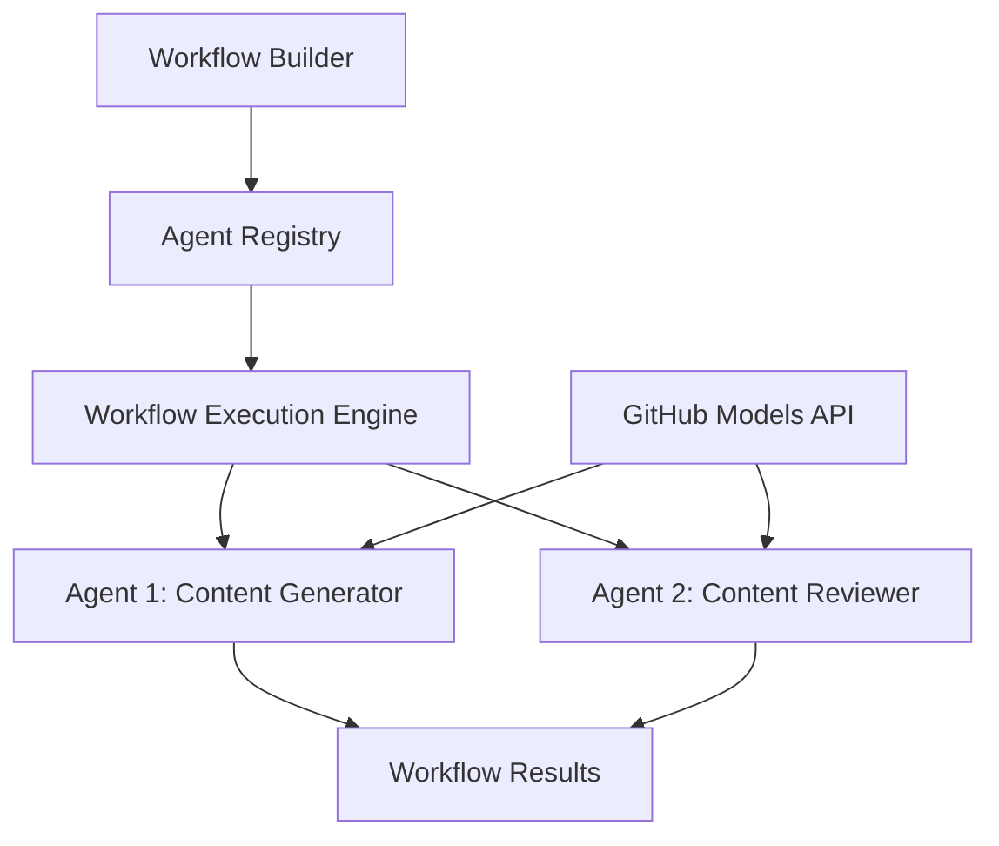

<!--
CO_OP_TRANSLATOR_METADATA:
{
  "original_hash": "034158688d0a45aae06dcbb21b0da5ae",
  "translation_date": "2025-11-11T12:59:48+00:00",
  "source_file": "08-multi-agent/code_samples/workflows-agent-framework/dotNET/01.dotnet-agent-framework-workflow-ghmodel-basic.md",
  "language_code": "hr"
}
-->
# 🔄 Osnovni tijekovi rada s GitHub modelima (.NET)

## 📋 Vodič za orkestraciju tijekova rada

Ovaj priručnik pokazuje kako izgraditi sofisticirane **tijekove rada agenata** koristeći Microsoft Agent Framework za .NET i GitHub modele. Naučit ćete kako kreirati višestepene poslovne procese u kojima AI agenti surađuju kako bi izvršili složene zadatke kroz strukturirane obrasce orkestracije.

## 🎯 Ciljevi učenja

### 🏗️ **Osnove arhitekture tijekova rada**
- **Graditelj tijekova rada**: Dizajnirajte i orkestrirajte složene višestepene AI procese
- **Koordinacija agenata**: Koordinirajte više specijaliziranih agenata unutar tijekova rada
- **Integracija GitHub modela**: Iskoristite GitHub-ovu uslugu za inferenciju AI modela u tijekovima rada
- **Vizualni dizajn tijekova rada**: Kreirajte i vizualizirajte strukture tijekova rada za bolje razumijevanje

### 🔄 **Obrasci orkestracije procesa**
- **Sekvencijalna obrada**: Povežite zadatke agenata u logičnom redoslijedu
- **Upravljanje stanjem**: Održavajte kontekst i protok podataka kroz faze tijeka rada
- **Rukovanje greškama**: Implementirajte robusno oporavljanje od grešaka i otpornost tijeka rada
- **Optimizacija performansi**: Dizajnirajte učinkovite tijekove rada za operacije na razini poduzeća

### 🏢 **Primjene tijekova rada u poduzećima**
- **Automatizacija poslovnih procesa**: Automatizirajte složene organizacijske tijekove rada
- **Proizvodni proces sadržaja**: Urednički tijekovi rada s fazama pregleda i odobrenja
- **Automatizacija korisničke podrške**: Višestepeno rješavanje upita korisnika
- **Tijekovi obrade podataka**: ETL tijekovi rada s AI-pogonom za transformaciju

## ⚙️ Preduvjeti i postavljanje

### 📦 **Potrebni NuGet paketi**

Ova demonstracija tijeka rada koristi nekoliko ključnih .NET paketa:

```xml
<!-- Core AI Framework -->
<PackageReference Include="Microsoft.Extensions.AI" Version="9.9.0" />

<!-- Agent Framework (Local Development) -->
<!-- Microsoft.Agents.AI.dll - Core agent abstractions -->
<!-- Microsoft.Agents.AI.OpenAI.dll - OpenAI/GitHub Models integration -->

<!-- Configuration and Environment -->
<PackageReference Include="DotNetEnv" Version="3.1.1" />
```

### 🔑 **Konfiguracija GitHub modela**

**Postavljanje okruženja (.env datoteka):**
```env
GITHUB_TOKEN=your_github_personal_access_token
GITHUB_ENDPOINT=https://models.inference.ai.azure.com
GITHUB_MODEL_ID=gpt-4o-mini
```

**Pristup GitHub modelima:**
1. Prijavite se za GitHub modele (trenutno u pregledu)
2. Generirajte osobni pristupni token s dozvolama za pristup modelima
3. Konfigurirajte varijable okruženja kao što je prikazano gore

### 🏗️ **Pregled arhitekture tijeka rada**



**Ključne komponente:**
- **WorkflowBuilder**: Glavni orkestracijski motor za dizajniranje tijekova rada
- **AIAgent**: Pojedinačni specijalizirani agenti sa specifičnim sposobnostima
- **GitHub Models Client**: Integracija usluge za inferenciju AI modela
- **Execution Context**: Upravljanje stanjem i protokom podataka između faza tijeka rada

## 🎨 **Obrasci dizajna tijekova rada u poduzećima**

### 📝 **Tijek rada za proizvodnju sadržaja**
```
User Request → Content Generation → Quality Review → Final Output
```

### 🔍 **Cjevovod za obradu dokumenata**
```
Document Input → Analysis → Extraction → Validation → Structured Output
```

### 💼 **Tijek rada poslovne inteligencije**
```
Data Collection → Processing → Analysis → Report Generation → Distribution
```

### 🤝 **Automatizacija korisničke podrške**
```
Customer Inquiry → Classification → Processing → Response Generation → Follow-up
```

## 🏢 **Prednosti za poduzeća**

### 🎯 **Pouzdanost i skalabilnost**
- **Determinističko izvršavanje**: Dosljedni, ponovljivi rezultati tijeka rada
- **Oporavak od grešaka**: Elegantno rukovanje neuspjesima u bilo kojoj fazi tijeka rada
- **Praćenje performansi**: Praćenje metrika izvršavanja i prilika za optimizaciju
- **Upravljanje resursima**: Učinkovita alokacija i korištenje resursa AI modela

### 🔒 **Sigurnost i usklađenost**
- **Sigurna autentifikacija**: Autentifikacija temeljena na GitHub tokenima za pristup API-ju
- **Tragovi revizije**: Potpuno bilježenje izvršavanja tijekova rada i točaka odluke
- **Kontrola pristupa**: Granularne dozvole za izvršavanje i praćenje tijekova rada
- **Privatnost podataka**: Sigurno rukovanje osjetljivim informacijama kroz tijekove rada

### 📊 **Preglednost i upravljanje**
- **Vizualni dizajn tijekova rada**: Jasna reprezentacija tijekova procesa i ovisnosti
- **Praćenje izvršavanja**: Praćenje napretka i performansi tijekova rada u stvarnom vremenu
- **Izvještavanje o greškama**: Detaljna analiza grešaka i mogućnosti za otklanjanje
- **Analitika performansi**: Metrike za optimizaciju i planiranje kapaciteta

Izgradimo vaš prvi AI tijek rada spreman za poduzeće! 🚀

## 💻 Pokretanje koda

Kompletna implementacija dostupna je u `01.dotnet-agent-framework-workflow-ghmodel-basic.cs`. Ova datoteka demonstrira:

1. **Konfiguracija okruženja** - Učitavanje GitHub modela i vjerodajnica iz `.env` datoteke
2. **Postavljanje OpenAI klijenta** - Konfiguriranje klijenta za korištenje GitHub Models endpointa
3. **Kreiranje agenata** - Definiranje specijaliziranih agenata (Front Desk i Concierge)
4. **Graditelj tijekova rada** - Kreiranje tijeka rada s više agenata i sekvencijalnom obradom
5. **Izvršavanje tijeka rada** - Pokretanje tijeka rada s prikazom rezultata u stvarnom vremenu

### 🚀 Pokretanje primjera

```bash
# Make the script executable (Unix/Linux/macOS)
chmod +x 01.dotnet-agent-framework-workflow-ghmodel-basic.cs

# Run the workflow
./01.dotnet-agent-framework-workflow-ghmodel-basic.cs
```

Ili na Windowsu:
```powershell
dotnet run 01.dotnet-agent-framework-workflow-ghmodel-basic.cs
```

### 📝 Očekivani rezultat

Tijek rada će:
1. Prihvatiti vaš zahtjev za odredište putovanja ("Želim ići u Pariz")
2. Agent Front Desk daje početnu preporuku
3. Agent Concierge pregledava i poboljšava preporuku
4. Konačni rezultat prikazuje cijeli tok razgovora

### 🔧 Prilagodba

Možete prilagoditi tijek rada:
- Mijenjanjem uputa za agente kako biste promijenili njihovo ponašanje
- Dodavanjem više agenata za kreiranje složenijih višestepenih tijekova rada
- Promjenom korisničke poruke za testiranje različitih scenarija
- Prilagođavanjem veza tijeka rada za kreiranje različitih obrazaca izvršavanja

---

<!-- CO-OP TRANSLATOR DISCLAIMER START -->
**Izjava o odricanju odgovornosti**:  
Ovaj dokument je preveden pomoću AI usluge za prevođenje [Co-op Translator](https://github.com/Azure/co-op-translator). Iako nastojimo osigurati točnost, imajte na umu da automatski prijevodi mogu sadržavati pogreške ili netočnosti. Izvorni dokument na izvornom jeziku treba smatrati autoritativnim izvorom. Za ključne informacije preporučuje se profesionalni prijevod od strane čovjeka. Ne preuzimamo odgovornost za nesporazume ili pogrešna tumačenja koja proizlaze iz korištenja ovog prijevoda.
<!-- CO-OP TRANSLATOR DISCLAIMER END -->