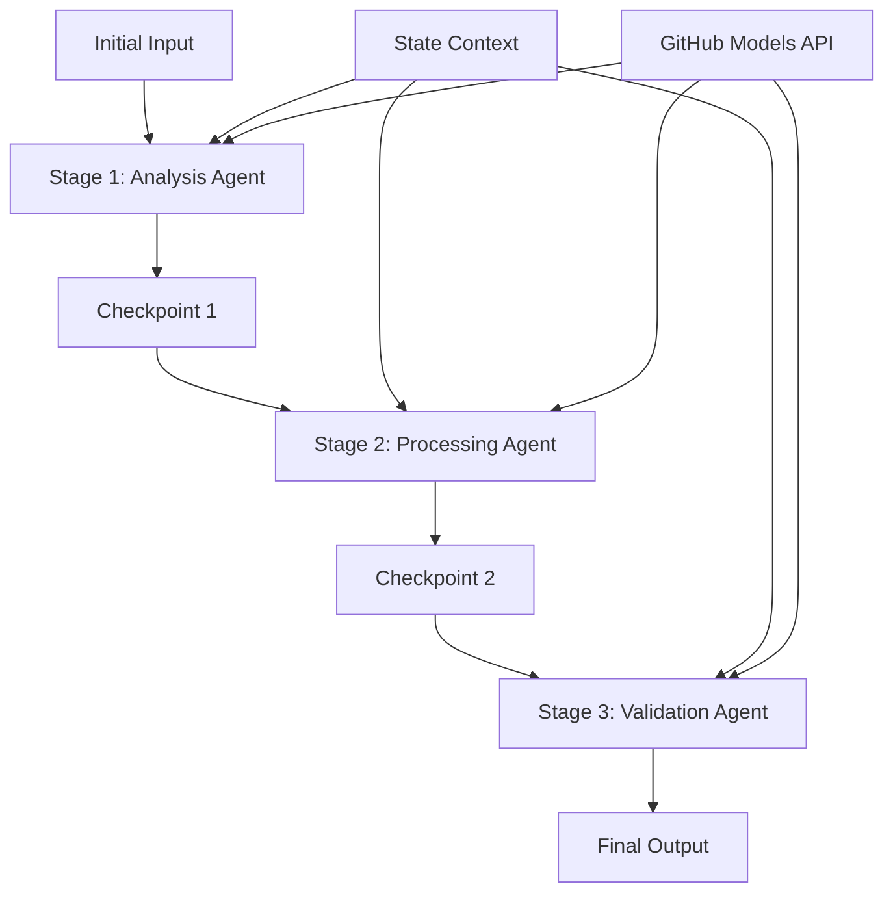

<!--
CO_OP_TRANSLATOR_METADATA:
{
  "original_hash": "1be9c8dcbd79a02d33d2c138684c1394",
  "translation_date": "2025-11-11T14:05:13+00:00",
  "source_file": "08-multi-agent/code_samples/workflows-agent-framework/dotNET/02.dotnet-agent-framework-workflow-ghmodel-sequential.md",
  "language_code": "hr"
}
-->
# ⏩ Sekvencijalni tijekovi rada agenata s GitHub modelima (.NET)

## 📋 Napredni vodič za sekvencijalnu obradu

Ovaj priručnik prikazuje **uzorke sekvencijalnih tijekova rada** koristeći Microsoft Agent Framework za .NET i GitHub modele. Naučit ćete kako izgraditi sofisticirane, korak-po-korak obradne cjevovode gdje agenti izvršavaju zadatke u određenom redoslijedu, pri čemu svaka faza nadograđuje rezultate prethodne.

## 🎯 Ciljevi učenja

### 🔄 **Arhitektura sekvencijalne obrade**
- **Dizajn linearnog tijeka rada**: Kreirajte korak-po-korak obradne cjevovode s jasnim ovisnostima
- **Upravljanje stanjem**: Održavajte kontekst i protok podataka kroz faze sekvencijalnog tijeka rada
- **Integracija GitHub modela**: Iskoristite GitHub AI modele u višestupanjskim .NET tijekovima rada
- **Uzorke cjevovoda za poduzeća**: Izgradite sustave za sekvencijalnu obradu spremne za proizvodnju

### 🏗️ **Napredni sekvencijalni uzorci**
- **Obrada s kontrolnim točkama**: Implementirajte validacijske kontrolne točke između faza tijeka rada
- **Očuvanje konteksta**: Održavajte stanje i akumulirano znanje kroz sve faze
- **Propagacija grešaka**: Rukujte neuspjesima na elegantan način u sekvencijalnim lancima obrade
- **Optimizacija performansi**: Učinkovita sekvencijalna obrada s minimalnim opterećenjem

### 🏢 **Sekvencijalne aplikacije za poduzeća**
- **Cjevovod za obradu dokumenata**: Višestupanjska analiza, transformacija i validacija dokumenata
- **Tijekovi rada za osiguranje kvalitete**: Sekvencijalni pregled, validacija i procesi odobravanja
- **Cjevovod za proizvodnju sadržaja**: Istraživanje → Pisanje → Uređivanje → Pregled → Objavljivanje
- **Automatizacija poslovnih procesa**: Višestupanjski poslovni tijekovi rada s jasnim ovisnostima faza

## ⚙️ Preduvjeti i postavljanje

### 📦 **Potrebni NuGet paketi**

Osnovni paketi za .NET sekvencijalne tijekove rada:

```xml
<!-- Core AI Framework -->
<PackageReference Include="Microsoft.Extensions.AI" Version="9.9.0" />

<!-- Client Model Abstractions -->
<PackageReference Include="System.ClientModel" Version="1.6.1.0" />

<!-- Azure Identity and Async LINQ Support -->
<PackageReference Include="Azure.Identity" Version="1.15.0" />
<PackageReference Include="System.Linq.Async" Version="6.0.3" />

<!-- Local Agent Framework References -->
<!-- Microsoft.Agents.AI.dll - Core agent abstractions -->
<!-- Microsoft.Agents.AI.OpenAI.dll - GitHub Models integration -->
```

### 🔑 **Konfiguracija GitHub modela**

**Postavljanje okruženja (.env datoteka):**
```env
GITHUB_TOKEN=your_github_personal_access_token
GITHUB_ENDPOINT=https://models.inference.ai.azure.com
GITHUB_MODEL_ID=gpt-4o-mini
```

**Upravljanje konfiguracijom:**
```csharp
// Load environment variables securely
Env.Load("../../../.env");
var githubToken = Environment.GetEnvironmentVariable("GITHUB_TOKEN");
var githubEndpoint = Environment.GetEnvironmentVariable("GITHUB_ENDPOINT");
var modelId = Environment.GetEnvironmentVariable("GITHUB_MODEL_ID");
```

### 🏗️ **Arhitektura sekvencijalnog tijeka rada**



**Ključne komponente:**
- **Sekvencijalni agenti**: Specijalizirani agenti za svaku fazu obrade
- **Kontekst stanja**: Održava akumulirane podatke i odluke kroz faze
- **Kontrolne točke**: Točke validacije između faza za osiguranje kvalitete i dosljednosti
- **GitHub Models Client**: Dosljedan pristup AI modelima kroz sve faze tijeka rada

## 🎨 **Uzorke dizajna sekvencijalnog tijeka rada**

### 📝 **Cjevovod za obradu dokumenata**
```
Raw Document → Content Extraction → Analysis → Validation → Structured Output
```

### 🎯 **Tijek rada za stvaranje sadržaja**
```
Brief/Requirements → Research → Content Creation → Review → Final Polish
```

### 🔍 **Cjevovod za osiguranje kvalitete**
```
Initial Review → Technical Validation → Compliance Check → Final Approval
```

### 💼 **Tijek rada za poslovnu inteligenciju**
```
Data Collection → Processing → Analysis → Report Generation → Distribution
```

## 🏢 **Prednosti sekvencijalnog tijeka rada za poduzeća**

### 🎯 **Pouzdanost i kvaliteta**
- **Deterministička obrada**: Dosljedni, ponovljivi rezultati kroz strukturirane faze
- **Kontrolne točke kvalitete**: Validacijske točke osiguravaju kvalitetu u svakoj fazi
- **Izolacija grešaka**: Problemi u jednoj fazi ne šire se na sljedeće faze
- **Tragovi revizije**: Potpuno praćenje odluka i transformacija u svakoj fazi

### 📈 **Skalabilnost i performanse**
- **Modularni dizajn**: Svaka faza može se optimizirati neovisno
- **Upravljanje resursima**: Učinkovita alokacija AI modela kroz faze
- **Optimizacija stanja**: Minimalni prijenos stanja između faza za optimalne performanse
- **Paralelne grupe faza**: Višestruki sekvencijalni tijekovi rada mogu se izvršavati paralelno

### 🔒 **Sigurnost i usklađenost**
- **Sigurnost na razini faze**: Različite sigurnosne politike za različite faze obrade
- **Validacija podataka**: Osiguranje integriteta podataka i usklađenosti na svakoj kontrolnoj točki
- **Kontrola pristupa**: Granularne dozvole za različite faze tijeka rada
- **Regulatorna usklađenost**: Ispunite regulatorne zahtjeve kroz strukturiranu obradu

### 📊 **Praćenje i analitika**
- **Metričke na razini faze**: Praćenje performansi za svaku fazu tijeka rada
- **Identifikacija uskih grla**: Identificirajte i optimizirajte spore faze
- **Metričke kvalitete**: Pratite kvalitetu i stope uspjeha u svakoj fazi
- **Optimizacija procesa**: Kontinuirano poboljšanje na temelju analitike faza

Izgradimo robusne sekvencijalne AI cjevovode! 🚀

## 💻 Pokretanje koda

Kompletna implementacija dostupna je u `02.dotnet-agent-framework-workflow-ghmodel-sequential.cs`. Ova datoteka prikazuje **tijek rada analize namještaja u tri faze**:

1. **Faza 1 - Agent prodaje**: Analizira slike namještaja i daje prijedloge za kupnju
2. **Faza 2 - Agent cijena**: Pruža detaljne analize cijena i opcije budžeta
3. **Faza 3 - Agent ponuda**: Generira profesionalni dokument ponude u Markdown formatu

### 🏗️ **Arhitektura tijeka rada**

```
Image Input → Sales Analysis → Price Estimation → Quote Generation → Final Output
```

Svaki agent:
- Prima izlaz iz prethodne faze kao kontekst
- Nadograđuje prethodnu analizu specijaliziranim znanjem
- Održava kontinuitet tijeka rada kroz upravljanje stanjem

### 🚀 Pokretanje primjera

**Preduvjeti:**
- Postavite sliku namještaja na `../imgs/home.png` (ili ažurirajte varijablu `imgPath`)
- Konfigurirajte svoju `.env` datoteku s GitHub Models vjerodajnicama

```bash
# Make the script executable (Unix/Linux/macOS)
chmod +x 02.dotnet-agent-framework-workflow-ghmodel-sequential.cs

# Run the sequential workflow
./02.dotnet-agent-framework-workflow-ghmodel-sequential.cs
```

Ili na Windowsu:
```powershell
dotnet run 02.dotnet-agent-framework-workflow-ghmodel-sequential.cs
```

### 📝 Očekivani izlaz

Tijek rada će:
1. **Agent prodaje**: Identificirati predmete namještaja sa slike i dati preporuke
2. **Agent cijena**: Dodati detaljnu analizu cijena s budžetskim razinama i preporukama za kupnju
3. **Agent ponuda**: Generirati formatirani dokument ponude sa svim sintetiziranim informacijama

Konačni izlaz bit će sveobuhvatna, profesionalna ponuda za namještaj temeljena na analizi slike.

### 🔧 Opcije prilagodbe

**Modificirajte ponašanje agenta:**
```csharp
// Adjust agent instructions to change their focus
const string SalesAgentInstructions = "Your custom instructions...";
```

**Promijenite sekvencijalni tijek:**
```csharp
// Add or reorder workflow stages
var workflow = new WorkflowBuilder(salesagent)
    .AddEdge(salesagent, priceagent)
    .AddEdge(priceagent, quoteagent)
    .AddEdge(quoteagent, newAgent)  // Add another stage
    .Build();
```

**Koristite različiti ulaz:**
```csharp
// Process text instead of images
ChatMessage userMessage = new ChatMessage(ChatRole.User, [
    new TextContent("Analyze pricing for a modern living room set")
]);
```

### 🎯 Primjene u stvarnom svijetu

Ovaj sekvencijalni uzorak idealan je za:
- **E-trgovinu**: Analiza proizvoda → Cijene → Generiranje ponuda
- **Nekretnine**: Analiza nekretnina → Procjena vrijednosti → Kreiranje oglasa
- **Osiguranje**: Analiza zahtjeva → Procjena → Generiranje ponuda
- **Stvaranje sadržaja**: Istraživanje → Pisanje → Uređivanje → Objavljivanje

### 🔍 Razumijevanje protoka stanja

Svaki agent u sekvenci prima:
- **Izvorni ulaz**: Početnu poruku korisnika (slika + tekst)
- **Izlaze prethodnih agenata**: Sve odgovore prethodnih agenata u povijesti razgovora
- **Akumulirani kontekst**: Potpuno stanje održavano kroz tijek rada

Ovo omogućuje sofisticiranu višestupanjsku obradu gdje svaki agent nadograđuje sveobuhvatan kontekst iz svih prethodnih faza.

---

<!-- CO-OP TRANSLATOR DISCLAIMER START -->
**Odricanje od odgovornosti**:  
Ovaj dokument je preveden pomoću AI usluge za prevođenje [Co-op Translator](https://github.com/Azure/co-op-translator). Iako nastojimo osigurati točnost, imajte na umu da automatski prijevodi mogu sadržavati pogreške ili netočnosti. Izvorni dokument na izvornom jeziku treba smatrati autoritativnim izvorom. Za ključne informacije preporučuje se profesionalni prijevod od strane čovjeka. Ne preuzimamo odgovornost za nesporazume ili pogrešna tumačenja koja proizlaze iz korištenja ovog prijevoda.
<!-- CO-OP TRANSLATOR DISCLAIMER END -->