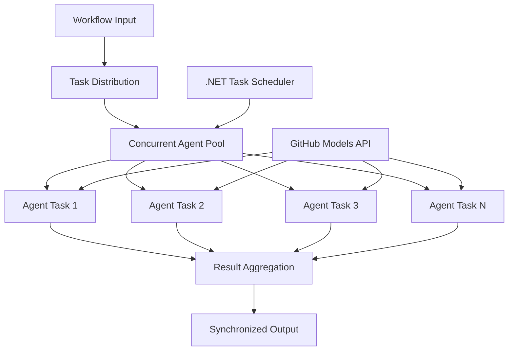

<!--
CO_OP_TRANSLATOR_METADATA:
{
  "original_hash": "b9c6e32c9b5f2fed20b6916984440d88",
  "translation_date": "2025-11-11T13:32:56+00:00",
  "source_file": "08-multi-agent/code_samples/workflows-agent-framework/dotNET/03.dotnet-agent-framework-workflow-ghmodel-concurrent.md",
  "language_code": "hr"
}
-->
# ⚡ Istovremeni radni tijekovi agenata s GitHub modelima (.NET)

## 📋 Vodič za visokoučinkovitu paralelnu obradu

Ovaj priručnik prikazuje **uzorke istovremenih radnih tijekova** koristeći Microsoft Agent Framework za .NET i GitHub modele. Naučit ćete kako izgraditi visokoučinkovite radne tijekove paralelne obrade koji maksimiziraju propusnost istovremenim izvršavanjem više AI agenata uz održavanje koordinacije i dosljednosti podataka.

## 🎯 Ciljevi učenja

### 🚀 **Osnove istovremene obrade**
- **Paralelno izvršavanje agenata**: Pokrenite više AI agenata istovremeno za maksimalnu učinkovitost
- **Async/Await uzorci**: Iskoristite .NET-ov model asinkronog programiranja za učinkovitu istovremenost
- **Integracija s GitHub modelima**: Koordinirajte više istovremenih poziva na GitHub-ovu uslugu za inferenciju AI modela
- **Upravljanje resursima**: Učinkovito upravljajte resursima AI modela tijekom istovremenih operacija

### 🏗️ **Napredna arhitektura istovremenosti**
- **Paralelizam temeljen na zadacima**: Koristite .NET Task Parallel Library za optimalno istovremeno izvršavanje
- **Uzorci sinkronizacije**: Koordinirajte istovremene agente uz izbjegavanje utrka podataka
- **Ravnoteža opterećenja**: Učinkovito raspodijelite rad na dostupni kapacitet istovremene obrade
- **Otpornost na greške**: Rukujte neuspjesima pojedinih agenata bez zaustavljanja cijelog radnog tijeka

### 🏢 **Istovremene aplikacije za poduzeća**
- **Obrada dokumenata velikog volumena**: Obradite više dokumenata istovremeno
- **Analiza sadržaja u stvarnom vremenu**: Istovremena analiza dolaznih tokova podataka
- **Optimizacija obrade serija**: Maksimizirajte propusnost za operacije obrade velikih količina podataka
- **Multimodalna analiza**: Paralelna obrada različitih vrsta i formata sadržaja

## ⚙️ Preduvjeti i postavljanje

### 📦 **Potrebni NuGet paketi**

Osnovni paketi za visokoučinkovite istovremene radne tijekove:

```xml
<!-- Core AI Framework with Async Support -->
<PackageReference Include="Microsoft.Extensions.AI" Version="9.9.0" />

<!-- Client Model Abstractions for API Communication -->
<PackageReference Include="System.ClientModel" Version="1.6.1.0" />

<!-- Azure Identity and Async LINQ for Advanced Operations -->
<PackageReference Include="Azure.Identity" Version="1.15.0" />
<PackageReference Include="System.Linq.Async" Version="6.0.3" />

<!-- Local Agent Framework References -->
<!-- Microsoft.Agents.AI.dll - Core agent abstractions with async support -->
<!-- Microsoft.Agents.AI.OpenAI.dll - GitHub Models integration with concurrency -->
```

### 🔑 **Konfiguracija GitHub modela**

**Postavljanje okruženja (.env datoteka):**
```env
GITHUB_TOKEN=your_github_personal_access_token
GITHUB_ENDPOINT=https://models.inference.ai.azure.com
GITHUB_MODEL_ID=gpt-4o-mini
```

**Razmatranja za istovremenu obradu:**
```csharp
// Configure for concurrent operations
var clientOptions = new OpenAIClientOptions()
{
    Endpoint = new Uri(githubEndpoint),
    // Configure connection pooling for concurrent requests
    NetworkTimeout = TimeSpan.FromMinutes(5)
};
```

### 🏗️ **Arhitektura istovremenog radnog tijeka**



**Ključne komponente:**
- **Task Parallel Library**: Ugrađena podrška .NET-a za istovremene operacije
- **Agent Pool**: Više instanci agenata za paralelnu obradu
- **Agregacija rezultata**: Koordinacija i spajanje rezultata istovremenih agenata
- **Točke sinkronizacije**: Osiguranje dosljednosti podataka tijekom istovremenih operacija

## 🎨 **Uzorci dizajna istovremenih radnih tijekova**

### 🔍 **Paralelno istraživanje i analiza**
```
Research Topic → Concurrent Research Agents → Result Synthesis → Final Report
```

### 📊 **Obrada podataka iz više izvora**
```
Data Sources → Parallel Processing Agents → Data Integration → Unified Output
```

### 🎭 **Cjevovod za generiranje sadržaja**
```
Content Requirements → Concurrent Content Generators → Quality Review → Final Content
```

### 🔄 **Fan-Out/Fan-In obrada**
```
Single Input → Multiple Concurrent Processors → Result Aggregation → Single Output
```

## 🏢 **Prednosti za poduzeća**

### ⚡ **Propusnost i skalabilnost**
- **Linearno skaliranje performansi**: Dodajte više istovremenih agenata za povećanje propusnosti
- **Iskorištenje resursa**: Maksimalna učinkovitost dostupnog kapaciteta AI modela
- **Smanjeno vrijeme obrade**: Značajno smanjenje vremena kroz paralelno izvršavanje
- **Elastično skaliranje**: Dinamično prilagođavanje broja istovremenih agenata prema opterećenju

### 🛡️ **Pouzdanost i otpornost**
- **Izolacija grešaka**: Neuspjesi pojedinih agenata ne utječu na druge istovremene operacije
- **Postupno degradiranje**: Sustav nastavlja raditi s smanjenim kapacitetom agenata
- **Oporavak od grešaka**: Automatski mehanizmi ponovnog pokušaja za neuspjele istovremene operacije
- **Raspodjela opterećenja**: Ravnomjerna raspodjela rada među dostupnim agentima

### 📊 **Praćenje performansi**
- **Metričke istovremenog izvršavanja**: Pratite performanse svih paralelnih operacija
- **Analitika korištenja resursa**: Pratite korištenje CPU-a, memorije i mreže
- **Analiza propusnosti**: Mjerite dobitke u učinkovitosti od istovremene obrade
- **Otkrivanje uskih grla**: Identificirajte i riješite ograničenja performansi

### 🔧 **Razvoj i operacije**
- **Asinkroni model programiranja**: Iskoristite zrele async/await uzorke .NET-a
- **Koordinacija zadataka**: Ugrađene mogućnosti upravljanja i koordinacije zadataka
- **Rukovanje iznimkama**: Sveobuhvatno rukovanje greškama za istovremene operacije
- **Podrška za otklanjanje grešaka**: Alati za otklanjanje grešaka u Visual Studio za istovremene radne tijekove

Izgradimo visokoučinkovite istovremene AI radne tijekove s .NET-om! 🚀

## 💻 Pokretanje koda

Kompletna implementacija dostupna je u `03.dotnet-agent-framework-workflow-ghmodel-concurrent.cs`. Ova datoteka prikazuje **Fan-Out/Fan-In istovremeni radni tijek** za planiranje putovanja:

### 🏗️ **Arhitektura radnog tijeka**

```
User Request → ConcurrentStartExecutor → [Researcher Agent || Planner Agent] → ConcurrentAggregationExecutor → Final Output
```

**Ključne komponente:**

1. **ConcurrentStartExecutor**: Istovremeno šalje korisnički zahtjev svim agentima
2. **Researcher Agent**: Istovremeno analizira destinacije i atrakcije
3. **Planner Agent**: Istovremeno izrađuje detaljne planove putovanja
4. **ConcurrentAggregationExecutor**: Prikuplja i spaja rezultate oba agenta

### 🎯 **Fan-Out/Fan-In uzorak**

Ovaj radni tijek prikazuje klasični **Fan-Out/Fan-In** uzorak:
- **Fan-Out**: Jedna ulazna poruka šalje se istovremeno svim agentima
- **Istovremena obrada**: Više agenata radi paralelno na istom zadatku
- **Fan-In**: Rezultati svih agenata prikupljaju se i agregiraju u jedan izlaz

### 🚀 Pokretanje primjera

```bash
# Make the script executable (Unix/Linux/macOS)
chmod +x 03.dotnet-agent-framework-workflow-ghmodel-concurrent.cs

# Run the concurrent workflow
./03.dotnet-agent-framework-workflow-ghmodel-concurrent.cs
```

Ili na Windowsu:
```powershell
dotnet run 03.dotnet-agent-framework-workflow-ghmodel-concurrent.cs
```

### 📝 Očekivani izlaz

Radni tijek će:
1. **Slanje zahtjeva**: Poslati "Planiraj putovanje u Seattle u prosincu" obojici agenata
2. **Istovremena obrada**: Oba agenta rade istovremeno:
   - Researcher identificira atrakcije i detalje
   - Planner izrađuje itinerar i logistiku
3. **Agregacija**: Kombinirati oba odgovora u sveobuhvatan izlaz
4. **Prikaz rezultata**: Prikazati objedinjeni plan putovanja sa svim informacijama

### 🔧 Opcije prilagodbe

**Dodavanje više istovremenih agenata:**
```csharp
// Create additional specialized agents
AIAgent budgetAgent = openAIClient.GetChatClient(github_model_id).CreateAIAgent(
    name: "Budget-Agent", instructions: "Calculate travel costs...");

// Add to fan-out
var workflow = new WorkflowBuilder(startExecutor)
    .AddFanOutEdge(startExecutor, targets: [researcherAgent, plannerAgent, budgetAgent])
    .AddFanInEdge(aggregationExecutor, sources: [researcherAgent, plannerAgent, budgetAgent])
    .WithOutputFrom(aggregationExecutor)
    .Build();

// Update aggregation count
if (this._messages.Count == 3) { ... }
```

**Modifikacija uputa za agente:**
```csharp
const string ResearcherAgentInstructions = "Your custom instructions for research...";
const string PlanAgentInstructions = "Your custom instructions for planning...";
```

**Promjena zadatka:**
```csharp
StreamingRun run = await InProcessExecution.StreamAsync(
    workflow, 
    "Plan a European vacation for 2 weeks in summer"
);
```

### 🎯 Primjene u stvarnom svijetu

Ovaj uzorak istovremenosti idealan je za:
- **Kreiranje sadržaja**: Više pisaca istovremeno izrađuje različite dijelove
- **Pregled koda**: Više recenzenata analizira kod iz različitih perspektiva
- **Istraživanje tržišta**: Paralelna analiza različitih tržišnih segmenata
- **Obrada dokumenata**: Istovremeno izdvajanje, analiza i validacija
- **Analiza iz više perspektiva**: Dobivanje različitih pogleda na isti ulaz

### 🔍 Razumijevanje prilagođenih izvršitelja

**ConcurrentStartExecutor:**
- Implementira `IMessageHandler<string>` za prihvaćanje ulaznog stringa
- Šalje poruke svim povezanim agentima
- Šalje `TurnToken` za pokretanje istovremene obrade

**ConcurrentAggregationExecutor:**
- Implementira `IMessageHandler<ChatMessage>` za primanje odgovora agenata
- Prikuplja poruke na način siguran za više niti
- Agregira kada stignu svi očekivani odgovori
- Daje konačni izlaz koristeći `context.YieldOutputAsync()`

### ⚡ Prednosti performansi

**Istovremeno vs sekvencijalno:**
- Sekvencijalno: Agent1 (30s) → Agent2 (30s) = **60 sekundi ukupno**
- Istovremeno: Agent1 (30s) || Agent2 (30s) = **30 sekundi ukupno**

**Poboljšanje propusnosti**: Do N× brže za N istovremenih agenata (ovisno o opterećenju i resursima)

### 🛡️ Rukovanje greškama

Radni tijek rukuje neuspjesima pojedinih agenata na elegantan način:
- Ako jedan agent ne uspije, drugi nastavljaju obradu
- Agregator može implementirati logiku vremenskog ograničenja
- Djelomični rezultati mogu se vratiti ako je potrebno

### 📊 Napredne značajke

**Dinamičan broj agenata:**
Prilagodite logiku agregacije za podršku promjenjivom broju agenata:

```csharp
private int _expectedAgentCount;
private readonly List<ChatMessage> _messages = [];

public async ValueTask HandleAsync(ChatMessage message, IWorkflowContext context)
{
    this._messages.Add(message);
    if (this._messages.Count == _expectedAgentCount)
    {
        // Process aggregation
    }
}
```

Ovaj uzorak istovremenog radnog tijeka ključan je za izgradnju visokoučinkovitih, skalabilnih sustava AI agenata!

---

<!-- CO-OP TRANSLATOR DISCLAIMER START -->
**Odricanje od odgovornosti**:  
Ovaj dokument je preveden pomoću AI usluge za prevođenje [Co-op Translator](https://github.com/Azure/co-op-translator). Iako nastojimo osigurati točnost, imajte na umu da automatski prijevodi mogu sadržavati pogreške ili netočnosti. Izvorni dokument na izvornom jeziku treba smatrati autoritativnim izvorom. Za ključne informacije preporučuje se profesionalni prijevod od strane čovjeka. Ne odgovaramo za nesporazume ili pogrešna tumačenja koja proizlaze iz korištenja ovog prijevoda.
<!-- CO-OP TRANSLATOR DISCLAIMER END -->