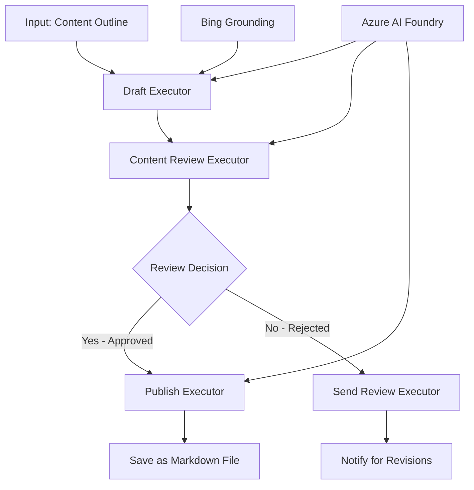

<!--
CO_OP_TRANSLATOR_METADATA:
{
  "original_hash": "8abd335151cee553293b637ee3d80d10",
  "translation_date": "2025-11-11T12:31:55+00:00",
  "source_file": "08-multi-agent/code_samples/workflows-agent-framework/dotNET/04.dotnet-agent-framework-workflow-aifoundry-condition.md",
  "language_code": "hr"
}
-->
# 🔀 Uvjetni tijekovi rada agenata s Azure AI Foundry (.NET)

## 📋 Vodič za inteligentne tijekove rada temeljene na odlukama

Ovaj priručnik prikazuje **uzorke uvjetnih tijekova rada** koristeći Azure AI Foundry i Microsoft Agent Framework za .NET. Naučit ćete kako izgraditi sofisticirane tijekove rada vođene odlukama koji inteligentno usmjeravaju obradu na temelju AI analize, poslovnih pravila i dinamičkih uvjeta za automatizaciju na razini poduzeća.

## 🎯 Ciljevi učenja

### 🧠 **Arhitektura inteligentnih odluka**
- **Implementacija uvjetne logike**: Izgradite složena stabla odluka s više točaka grananja
- **Usmjeravanje temeljeno na AI-u**: Koristite modele Azure AI Foundry za donošenje inteligentnih odluka o usmjeravanju
- **Dinamička prilagodba tijeka rada**: Modificirajte ponašanje tijeka rada na temelju analize u stvarnom vremenu i uvjeta
- **Integracija poslovnih pravila**: Uključite poslovnu logiku i zahtjeve usklađenosti u tijekove rada

### 🔀 **Napredni uzorci uvjetnih tijekova**
- **Donošenje odluka na temelju više kriterija**: Procijenite više faktora za odluke o usmjeravanju
- **Obrada svjesna konteksta**: Donosite odluke na temelju akumuliranog konteksta i povijesti tijeka rada
- **Prilagodba tijeka rada**: Dinamički prilagodite putanje obrade na temelju uvjeta u stvarnom vremenu
- **Integracija pravila**: Implementirajte sofisticirane poslovne mehanizme pravila unutar tijekova rada

### 🏢 **Uvjetne aplikacije za poduzeća**
- **Klasifikacija i usmjeravanje dokumenata**: Automatski klasificirajte i usmjeravajte dokumente u odgovarajuće tijekove rada
- **Trijaža korisničke podrške**: Inteligentno usmjeravanje upita korisnika prema specijaliziranim timovima za obradu
- **Obrada usklađenosti i rizika**: Primijenite različite procese validacije i pregleda na temelju procjene rizika
- **Tijekovi rada za osiguranje kvalitete**: Usmjerite sadržaj kroz odgovarajuće procese pregleda na temelju metričkih kvaliteta

## ⚙️ Preduvjeti i postavljanje

### 📦 **Potrebni NuGet paketi**

Napredni paketi za obradu uvjetnih tijekova rada:

```xml
<!-- Core AI Framework -->
<PackageReference Include="Microsoft.Extensions.AI" Version="9.9.0" />

<!-- Azure AI Agents with Persistent State -->
<PackageReference Include="Azure.AI.Agents.Persistent" Version="1.2.0-beta.5" />

<!-- Azure Identity and Utilities -->
<PackageReference Include="Azure.Identity" Version="1.15.0" />
<PackageReference Include="System.Linq.Async" Version="6.0.3" />
<PackageReference Include="DotNetEnv" Version="3.1.1" />

<!-- Local Workflow Framework References -->
<!-- Microsoft.Agents.Workflows.dll - Advanced workflow orchestration -->
<!-- Microsoft.Agents.AI.AzureAI.dll - Azure AI Foundry integration -->
<!-- Microsoft.Agents.AI.dll - Core agent abstractions -->
```

### 🔑 **Konfiguracija Azure AI Foundry**

**Potrebni Azure resursi:**
- Radni prostor Azure AI Foundry s modelima za uvjetnu obradu
- Pretplata na Azure s odgovarajućim kvotama za računalne resurse i dozvolama
- Implementirani AI modeli za donošenje odluka i analizu sadržaja
- (Opcionalno) Povezivanje Bing Search API-ja za mogućnosti temeljenja

**Konfiguracija okruženja (.env datoteka):**
```env
# Azure AI Foundry Configuration
AZURE_AI_PROJECT_ENDPOINT=https://your-project.cognitiveservices.azure.com/
BING_CONNECTION_ID=your-bing-connection-id
```

**Postavljanje autentifikacije:**
```csharp
// Azure CLI or Managed Identity authentication
using Azure.Identity;
var credential = new AzureCliCredential();

// Load environment configuration
DotNetEnv.Env.Load("../../../.env");
```

### 🏗️ **Arhitektura uvjetnog tijeka rada**



**Ključne komponente:**
- **Draft Executor**: AI agent koji stvara početne nacrte sadržaja iz skica
- **Content Review Executor**: AI agent koji procjenjuje kvalitetu nacrta i usklađenost
- **Uvjetno usmjeravanje**: Logika odluka koja usmjerava na temelju rezultata pregleda
- **Putanje objave/pregleda**: Odvojeni procesni putovi za odobreni i odbijeni sadržaj
- **Upravljanje stanjem**: Održava kontekst sadržaja i pregleda tijekom tijeka rada

## 🎨 **Uzorci dizajna uvjetnih tijekova rada**

### 📋 **Proizvodnja sadržaja s kontrolnim točkama kvalitete**
```
Outline → Draft Creation → Quality Review → {Approve: Publish | Reject: Revise}
```

### 🎯 **Obrada dokumenata temeljena na riziku**
```
Document → Risk Assessment → {Low: Standard | High: Enhanced Review}
```

### 🔍 **Inteligentno usmjeravanje korisničke podrške**
```
Customer Query → Analysis → {Simple: FAQ Bot | Complex: Human Agent}
```

### 💼 **Tijekovi rada vođeni usklađenošću**
```
Content → Compliance Check → {Pass: Publish | Fail: Legal Review}
```

## 🏢 **Prednosti uvjetnih tijekova rada za poduzeća**

### 🎯 **Inteligentna automatizacija**
- **Pametno donošenje odluka**: Odluke o usmjeravanju temeljene na analizi sadržaja i kontekstu
- **Prilagodljiva obrada**: Tijekovi rada koji se automatski prilagođavaju promjenjivim uvjetima
- **Provedba poslovnih pravila**: Automatska primjena složenih poslovnih logika i politika
- **Usmjeravanje svjesno konteksta**: Odluke temeljene na cjelokupnoj povijesti tijeka rada i akumuliranom kontekstu

### 📈 **Operativna izvrsnost**
- **Optimizirana raspodjela resursa**: Usmjeravanje rada prema najprikladnijim stručnjacima i procesima
- **Smanjena ručna intervencija**: Automatizirano donošenje odluka minimizira potrebu za ljudskim usmjeravanjem
- **Brže vrijeme rješavanja**: Direktno usmjeravanje prema odgovarajućim stručnjacima i mogućnostima obrade
- **Dosljedna primjena**: Jednaka primjena poslovnih pravila i kriterija odluka

### 🛡️ **Upravljanje rizicima i usklađenost**
- **Automatska procjena rizika**: Procjena razine rizika sadržaja i situacija temeljena na AI-u
- **Provedba usklađenosti**: Automatsko usmjeravanje kroz potrebne regulatorne procese
- **Primjena sigurnosnih protokola**: Poboljšane sigurnosne mjere primijenjene na temelju procjene rizika
- **Održavanje evidencije**: Potpuna dokumentacija odluka o usmjeravanju i obrazloženja

### 📊 **Analitika i kontinuirano poboljšanje**
- **Analitika odluka**: Praćenje učinkovitosti i točnosti odluka o usmjeravanju
- **Prepoznavanje uzoraka**: Identifikacija trendova i uzoraka u odlukama o usmjeravanju tijekom vremena
- **Optimizacija performansi**: Kontinuirano poboljšanje kriterija odluka i učinkovitosti usmjeravanja
- **Poslovna inteligencija**: Uvidi u karakteristike sadržaja i zahtjeve obrade

### 🔧 **Tehnička izvrsnost**
- **Upravljanje trajnim stanjem**: Održavanje složenog stanja tijekom izvršenja tijeka rada
- **Skalabilna arhitektura**: Obrada velikih zahtjeva za uvjetnu obradu
- **Mogućnosti integracije**: Besprijekorna integracija s postojećim poslovnim sustavima i procesima
- **Praćenje i preglednost**: Sveobuhvatno praćenje performansi tijeka rada i odluka

Izgradimo inteligentne, odluke vođene tijekove rada za poduzeća s .NET-om! 🚀

## 💻 Pokretanje koda

Kompletna implementacija dostupna je u `04.dotnet-agent-framework-workflow-aifoundry-condition.cs`. Ovo prikazuje **tijek rada za proizvodnju sadržaja s kontrolnim točkama kvalitete**:

### 🏗️ **Arhitektura tijeka rada**

```
Content Outline → Draft Creation → Quality Review → Conditional Routing:
                                                      ├─ Approved (>200 words) → Publish
                                                      └─ Rejected (<200 words) → Review Notification
```

**Agenti u tijeku rada:**
1. **Evangelist Agent**: Stvara nacrte vodiča iz skica koristeći Bing temeljenje
2. **Content Reviewer Agent**: Procjenjuje kvalitetu nacrta (broj riječi, cjelovitost)
3. **Publisher Agent**: Sprema odobreni sadržaj kao Markdown datoteke s vremenskim oznakama

**Prilagođeni izvršitelji:**
1. **DraftExecutor**: Orkestrira stvaranje nacrta
2. **ContentReviewExecutor**: Provodi procjenu kvalitete
3. **PublishExecutor**: Obrađuje objavu odobrenog sadržaja
4. **SendReviewExecutor**: Upravlja obavijestima o odbijenom sadržaju

### 🚀 Pokretanje primjera

**Preduvjeti:**
- Konfiguriran radni prostor Azure AI Foundry
- Autentifikacija putem Azure CLI-a (`az login`)
- (Opcionalno) Povezivanje Bing Search za temeljenje

```bash
# Make the script executable (Unix/Linux/macOS)
chmod +x 04.dotnet-agent-framework-workflow-aifoundry-condition.cs

# Run the conditional workflow
./04.dotnet-agent-framework-workflow-aifoundry-condition.cs
```

Ili na Windowsu:
```powershell
dotnet run 04.dotnet-agent-framework-workflow-aifoundry-condition.cs
```

### 📝 Očekivani rezultat

Tijek rada će:
1. **Stvoriti agente**: Inicijalizirati tri specijalizirana Azure AI Foundry agenta
2. **Generirati nacrt**: Evangelist agent stvara nacrt vodiča iz skice
3. **Pregledati sadržaj**: Content Reviewer procjenjuje kvalitetu nacrta
4. **Uvjetno usmjeravanje**:
   - **Ako je odobreno (>200 riječi)**: Publish executor sprema kao Markdown datoteku
   - **Ako je odbijeno (<200 riječi)**: Send review executor šalje obavijest o pregledu
5. **Prikazati rezultate**: Prikazuje konačni ishod tijeka rada

### 🔧 Opcije prilagodbe

**Modificirajte kriterije pregleda:**
```csharp
const string ContentReviewerInstructions = @"
You are a content reviewer...
1. Check if content is more than 500 words (instead of 200)
2. Verify technical accuracy
3. Ensure proper formatting
...";
```

**Dodajte više uvjetnih putanja:**
```csharp
var workflow = new WorkflowBuilder(draftExecutor)
    .AddEdge(draftExecutor, contentReviewerExecutor)
    .AddEdge(contentReviewerExecutor, publishExecutor, condition: GetCondition("Excellent"))
    .AddEdge(contentReviewerExecutor, editExecutor, condition: GetCondition("Good"))
    .AddEdge(contentReviewerExecutor, sendReviewerExecutor, condition: GetCondition("Poor"))
    .Build();
```

**Promijenite zahtjeve za sadržaj:**
```csharp
string OUTLINE_Content = @"
# Your Custom Topic
## Section 1
https://your-reference-url
## Section 2
...
";
```

### 🎯 Primjene u stvarnom svijetu

Ovaj uzorak uvjetnog tijeka rada idealan je za:
- **Sustave za upravljanje sadržajem**: Automatizirani urednički tijekovi rada s kontrolnim točkama kvalitete
- **Obrada dokumenata**: Usmjeravanje dokumenata na temelju klasifikacije i usklađenosti
- **Korisnička podrška**: Inteligentno usmjeravanje zahtjeva na temelju složenosti i hitnosti
- **Pravni pregled**: Usmjeravanje ugovora na temelju procjene rizika i vrijednosti
- **HR procesi**: Usmjeravanje prijava kroz odgovarajuće tijekove pregleda

### 🔍 Razumijevanje uvjetne logike

**Funkcija uvjeta:**
```csharp
public Func<object?, bool> GetCondition(string expectedResult) =>
    reviewResult => reviewResult is ReviewResult review && review.Result == expectedResult;
```

Ova funkcija stvara predikat koji:
1. Provjerava je li rezultat tipa `ReviewResult`
2. Uspoređuje svojstvo `Result` s očekivanom vrijednošću
3. Vraća true/false za određivanje usmjeravanja

**Rubovi tijeka rada s uvjetima:**
```csharp
.AddEdge(contentReviewerExecutor, publishExecutor, condition: GetCondition("Yes"))
.AddEdge(contentReviewerExecutor, sendReviewerExecutor, condition: GetCondition("No"))
```

### 📊 Napredne značajke

**Validacija JSON sheme:**
Tijek rada koristi JSON sheme za osiguranje strukturiranih odgovora:

```csharp
// Define response structure
public class ReviewResult
{
    [JsonPropertyName("review_result")]
    public string Result { get; set; } = string.Empty;
    
    [JsonPropertyName("reason")]
    public string Reason { get; set; } = string.Empty;
    
    [JsonPropertyName("draft_content")]
    public string DraftContent { get; set; } = string.Empty;
}

// Apply to agent
ResponseFormat = ChatResponseFormat.ForJsonSchema(
    AIJsonUtilities.CreateJsonSchema(typeof(ReviewResult)), 
    "ReviewResult", 
    "Review Result From DraftContent"
)
```

**Integracija Bing temeljenja:**
Evangelist agent koristi Bing temeljenje za pristup informacijama u stvarnom vremenu:

```csharp
var bingGroundingConfig = new BingGroundingSearchConfiguration(bing_conn_id);
BingGroundingToolDefinition bingGroundingTool = new(
    new BingGroundingSearchToolParameters([bingGroundingConfig])
);
```

Ovo omogućuje agentu da slijedi URL-ove u skici i izvuče trenutne informacije.

### 🛡️ Upravljanje pogreškama

Tijek rada uključuje robusno upravljanje pogreškama za odbijeni sadržaj:
- Neuspjesi pregleda aktiviraju alternativni put
- Obavijesti pružaju jasne razloge odbijanja
- Sadržaj se čuva za reviziju

### 🔄 Proširenje tijeka rada

**Dodajte petlju za reviziju:**
Stvorite povratnu petlju koja automatski ponovno izrađuje sadržaj:

```csharp
.AddEdge(contentReviewerExecutor, publishExecutor, condition: GetCondition("Yes"))
.AddEdge(contentReviewerExecutor, draftExecutor, condition: GetCondition("No")) // Loop back
```

**Implementirajte višerazinski pregled:**
Dodajte više faza pregleda s različitim kriterijima:

```csharp
.AddEdge(draftExecutor, technicalReviewer)
.AddEdge(technicalReviewer, editorialReviewer, condition: GetCondition("TechPass"))
.AddEdge(editorialReviewer, publishExecutor, condition: GetCondition("EditPass"))
```

Ovaj uzorak uvjetnog tijeka rada pruža temelj za izgradnju sofisticiranih, inteligentnih sustava automatizacije za poduzeća! 🚀

---

<!-- CO-OP TRANSLATOR DISCLAIMER START -->
**Odricanje od odgovornosti**:  
Ovaj dokument je preveden pomoću AI usluge za prevođenje [Co-op Translator](https://github.com/Azure/co-op-translator). Iako nastojimo osigurati točnost, imajte na umu da automatski prijevodi mogu sadržavati pogreške ili netočnosti. Izvorni dokument na izvornom jeziku treba smatrati autoritativnim izvorom. Za ključne informacije preporučuje se profesionalni prijevod od strane čovjeka. Ne preuzimamo odgovornost za nesporazume ili pogrešna tumačenja koja proizlaze iz korištenja ovog prijevoda.
<!-- CO-OP TRANSLATOR DISCLAIMER END -->