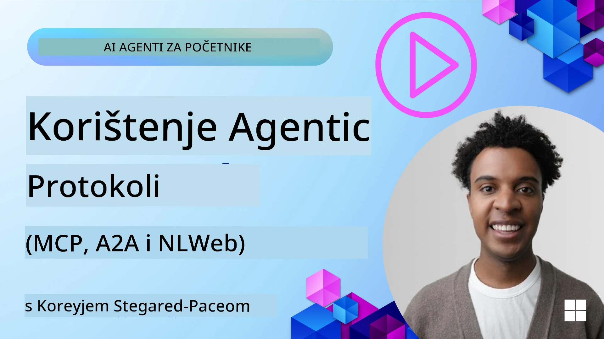
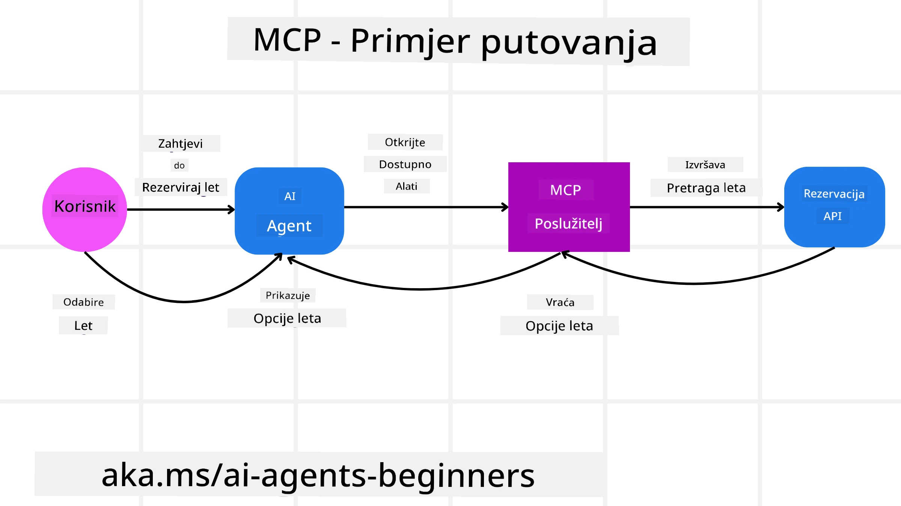
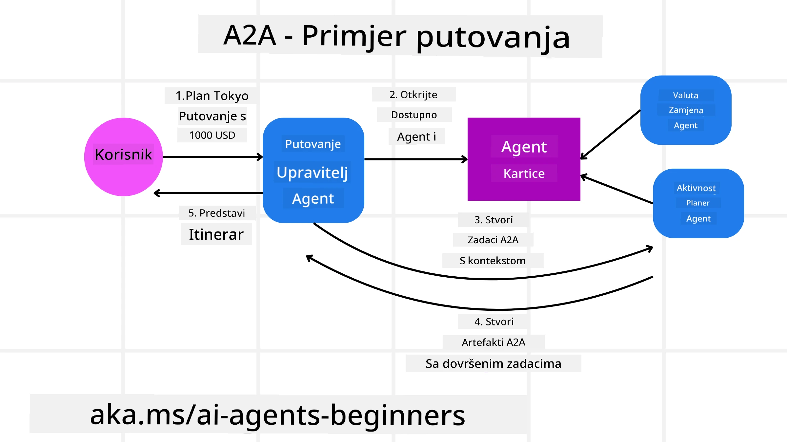
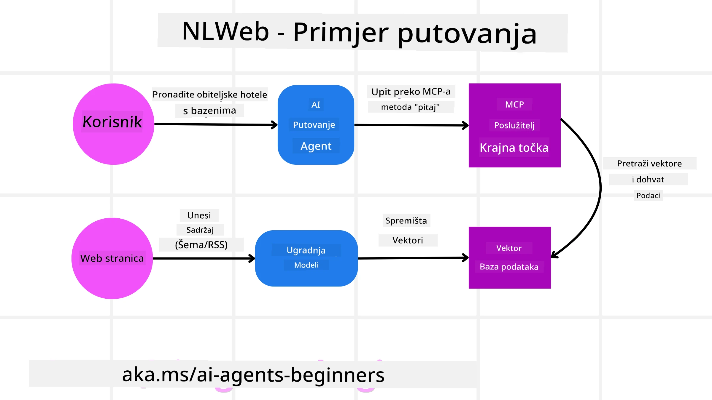

<!--
CO_OP_TRANSLATOR_METADATA:
{
  "original_hash": "aff92c6f019b4627ca9399c6e3882e17",
  "translation_date": "2025-09-18T15:45:50+00:00",
  "source_file": "11-agentic-protocols/README.md",
  "language_code": "hr"
}
-->
# Korištenje Agentnih Protokola (MCP, A2A i NLWeb)

> _(Kliknite na sliku iznad za pregled videa ove lekcije)_

Kako se upotreba AI agenata povećava, raste i potreba za protokolima koji osiguravaju standardizaciju, sigurnost i podršku za otvorene inovacije. U ovoj lekciji pokrit ćemo 3 protokola koji nastoje zadovoljiti ovu potrebu - Model Context Protocol (MCP), Agent to Agent (A2A) i Natural Language Web (NLWeb).

## Uvod

U ovoj lekciji pokrit ćemo:

• Kako **MCP** omogućuje AI agentima pristup vanjskim alatima i podacima za izvršavanje korisničkih zadataka.

• Kako **A2A** omogućuje komunikaciju i suradnju između različitih AI agenata.

• Kako **NLWeb** donosi sučelja prirodnog jezika na bilo koju web stranicu, omogućujući AI agentima otkrivanje i interakciju s sadržajem.

## Ciljevi učenja

• **Identificirati** osnovnu svrhu i prednosti MCP-a, A2A-a i NLWeb-a u kontekstu AI agenata.

• **Objasniti** kako svaki protokol olakšava komunikaciju i interakciju između LLM-ova, alata i drugih agenata.

• **Prepoznati** različite uloge koje svaki protokol igra u izgradnji složenih agentnih sustava.

## Model Context Protocol

**Model Context Protocol (MCP)** je otvoreni standard koji pruža standardizirani način za aplikacije da pruže kontekst i alate LLM-ovima. To omogućuje "univerzalni adapter" za različite izvore podataka i alate kojima AI agenti mogu pristupiti na dosljedan način.

Pogledajmo komponente MCP-a, prednosti u usporedbi s direktnom upotrebom API-ja i primjer kako AI agenti mogu koristiti MCP server.

### Osnovne komponente MCP-a

MCP se temelji na **klijent-server arhitekturi**, a osnovne komponente su:

• **Hostovi** su LLM aplikacije (na primjer, uređivač koda poput VSCode) koje započinju veze s MCP serverom.

• **Klijenti** su komponente unutar host aplikacije koje održavaju veze jedan-na-jedan sa serverima.

• **Serveri** su lagani programi koji izlažu specifične mogućnosti.

Protokol uključuje tri osnovna primitiva, koji su sposobnosti MCP servera:

• **Alati**: To su pojedinačne radnje ili funkcije koje AI agent može pozvati za izvršavanje zadatka. Na primjer, vremenska služba može izložiti alat "dohvati vremensku prognozu", ili e-commerce server može izložiti alat "kupi proizvod". MCP serveri oglašavaju ime, opis i ulazno/izlazne sheme svakog alata u svom popisu sposobnosti.

• **Resursi**: To su podaci ili dokumenti koji se mogu samo čitati, a MCP server ih može pružiti, a klijenti ih mogu dohvatiti na zahtjev. Primjeri uključuju sadržaj datoteka, zapise u bazi podataka ili log datoteke. Resursi mogu biti tekstualni (poput koda ili JSON-a) ili binarni (poput slika ili PDF-ova).

• **Prompti**: To su unaprijed definirani predlošci koji pružaju predložene upite, omogućujući složenije tijekove rada.

### Prednosti MCP-a

MCP nudi značajne prednosti za AI agente:

• **Dinamičko otkrivanje alata**: Agenti mogu dinamički primiti popis dostupnih alata od servera zajedno s opisima njihovih funkcija. Ovo je u kontrastu s tradicionalnim API-jima, koji često zahtijevaju statičko kodiranje za integracije, što znači da svaka promjena API-ja zahtijeva ažuriranje koda. MCP nudi pristup "integriraj jednom", što vodi većoj prilagodljivosti.

• **Interoperabilnost između LLM-ova**: MCP radi s različitim LLM-ovima, pružajući fleksibilnost za promjenu osnovnih modela radi bolje izvedbe.

• **Standardizirana sigurnost**: MCP uključuje standardiziranu metodu autentifikacije, poboljšavajući skalabilnost pri dodavanju pristupa dodatnim MCP serverima. Ovo je jednostavnije od upravljanja različitim ključevima i vrstama autentifikacije za razne tradicionalne API-je.

### Primjer MCP-a

Zamislite da korisnik želi rezervirati let koristeći AI asistenta koji koristi MCP.

1. **Veza**: AI asistent (MCP klijent) povezuje se s MCP serverom koji pruža aviokompanija.

2. **Otkrivanje alata**: Klijent pita MCP server aviokompanije, "Koje alate imate dostupne?" Server odgovara s alatima poput "pretraži letove" i "rezerviraj letove".

3. **Pozivanje alata**: Zatim korisnik traži od AI asistenta, "Molim te, pretraži letove iz Portlanda za Honolulu." AI asistent, koristeći svoj LLM, identificira da treba pozvati alat "pretraži letove" i prosljeđuje relevantne parametre (polazište, odredište) MCP serveru.

4. **Izvršenje i odgovor**: MCP server, djelujući kao omotač, izvršava stvarni poziv na interni API za rezervaciju aviokompanije. Zatim prima informacije o letu (npr. JSON podatke) i šalje ih natrag AI asistentu.

5. **Daljnja interakcija**: AI asistent predstavlja opcije leta. Nakon što korisnik odabere let, asistent može pozvati alat "rezerviraj let" na istom MCP serveru, dovršavajući rezervaciju.

## Agent-to-Agent Protocol (A2A)

Dok MCP fokus stavlja na povezivanje LLM-ova s alatima, **Agent-to-Agent (A2A) protokol** ide korak dalje omogućujući komunikaciju i suradnju između različitih AI agenata. A2A povezuje AI agente iz različitih organizacija, okruženja i tehnoloških sustava kako bi dovršili zajednički zadatak.

Razmotrit ćemo komponente i prednosti A2A-a, zajedno s primjerom kako bi se mogao primijeniti u našoj aplikaciji za putovanja.

### Osnovne komponente A2A-a

A2A se fokusira na omogućavanje komunikacije između agenata i njihovu suradnju na dovršavanju korisničkog podzadatka. Svaka komponenta protokola doprinosi tome:

#### Kartica agenta

Slično kao što MCP server dijeli popis alata, kartica agenta sadrži:
- Ime agenta.
- **Opis općih zadataka** koje obavlja.
- **Popis specifičnih vještina** s opisima kako bi drugi agenti (ili čak ljudski korisnici) razumjeli kada i zašto bi željeli pozvati tog agenta.
- **Trenutni URL krajnje točke** agenta.
- **Verziju** i **sposobnosti** agenta, poput odgovora u stvarnom vremenu i push obavijesti.

#### Izvršitelj agenta

Izvršitelj agenta odgovoran je za **prosljeđivanje konteksta korisničkog razgovora udaljenom agentu**, što je potrebno udaljenom agentu da razumije zadatak koji treba izvršiti. U A2A serveru, agent koristi svoj vlastiti Large Language Model (LLM) za obradu dolaznih zahtjeva i izvršavanje zadataka koristeći vlastite interne alate.

#### Artefakt

Nakon što udaljeni agent dovrši traženi zadatak, njegov radni proizvod se stvara kao artefakt. Artefakt **sadrži rezultat rada agenta**, **opis onoga što je dovršeno** i **tekstualni kontekst** koji se šalje kroz protokol. Nakon što se artefakt pošalje, veza s udaljenim agentom se zatvara dok ponovno ne bude potrebna.

#### Red događaja

Ova komponenta koristi se za **upravljanje ažuriranjima i prosljeđivanje poruka**. Posebno je važna u produkciji za agentne sustave kako bi se spriječilo zatvaranje veze između agenata prije nego što se zadatak dovrši, posebno kada vrijeme dovršetka zadatka može biti dulje.

### Prednosti A2A-a

• **Poboljšana suradnja**: Omogućuje agentima iz različitih dobavljača i platformi da međusobno komuniciraju, dijele kontekst i surađuju, olakšavajući besprijekornu automatizaciju između tradicionalno nepovezanih sustava.

• **Fleksibilnost u odabiru modela**: Svaki A2A agent može odlučiti koji LLM koristi za obradu svojih zahtjeva, omogućujući optimizirane ili fino podešene modele po agentu, za razliku od jedne LLM veze u nekim MCP scenarijima.

• **Ugrađena autentifikacija**: Autentifikacija je integrirana izravno u A2A protokol, pružajući robustan sigurnosni okvir za interakcije agenata.

### Primjer A2A-a

Proširimo naš scenarij rezervacije putovanja, ali ovaj put koristeći A2A.

1. **Korisnički zahtjev prema multi-agentu**: Korisnik komunicira s "Putničkim agentom" A2A klijentom/agentom, možda govoreći: "Molim te rezerviraj cijelo putovanje za Honolulu za sljedeći tjedan, uključujući letove, hotel i rent-a-car."

2. **Orkestracija od strane Putničkog agenta**: Putnički agent prima ovaj složeni zahtjev. Koristi svoj LLM za razmišljanje o zadatku i određivanje da treba komunicirati s drugim specijaliziranim agentima.

3. **Međuagencijska komunikacija**: Putnički agent zatim koristi A2A protokol za povezivanje s agentima nizvodno, poput "Aviokompanijskog agenta", "Hotelskog agenta" i "Agenta za rent-a-car" koje su kreirale različite tvrtke.

4. **Delegirano izvršenje zadatka**: Putnički agent šalje specifične zadatke ovim specijaliziranim agentima (npr. "Pronađi letove za Honolulu", "Rezerviraj hotel", "Unajmi automobil"). Svaki od ovih specijaliziranih agenata, koristeći svoje vlastite LLM-ove i alate (koji bi mogli biti MCP serveri sami po sebi), izvršava svoj specifični dio rezervacije.

5. **Konsolidirani odgovor**: Nakon što svi nizvodni agenti dovrše svoje zadatke, Putnički agent sastavlja rezultate (detalje leta, potvrdu hotela, rezervaciju automobila) i šalje sveobuhvatan, chat-stil odgovor korisniku.

## Natural Language Web (NLWeb)

Web stranice su dugo bile primarni način za korisnike da pristupe informacijama i podacima na internetu.

Pogledajmo različite komponente NLWeb-a, prednosti NLWeb-a i primjer kako NLWeb funkcionira kroz našu aplikaciju za putovanja.

### Komponente NLWeb-a

- **NLWeb aplikacija (osnovni kod usluge)**: Sustav koji obrađuje pitanja prirodnog jezika. Povezuje različite dijelove platforme kako bi stvorio odgovore. Možete ga zamisliti kao **motor koji pokreće značajke prirodnog jezika** web stranice.

- **NLWeb protokol**: Ovo je **osnovni skup pravila za interakciju prirodnog jezika** s web stranicom. Vraća odgovore u JSON formatu (često koristeći Schema.org). Njegova svrha je stvoriti jednostavnu osnovu za "AI Web", na isti način na koji je HTML omogućio dijeljenje dokumenata online.

- **MCP server (Model Context Protocol Endpoint)**: Svaka NLWeb postavka također funkcionira kao **MCP server**. To znači da može **dijeliti alate (poput metode "pitaj") i podatke** s drugim AI sustavima. U praksi, ovo omogućuje da sadržaj i mogućnosti web stranice postanu dio šireg "ekosustava agenata".

- **Modeli za ugrađivanje**: Ovi modeli se koriste za **pretvaranje sadržaja web stranice u numeričke reprezentacije zvane vektori** (ugrađivanja). Ti vektori hvataju značenje na način koji računala mogu usporediti i pretraživati. Pohranjuju se u posebnu bazu podataka, a korisnici mogu odabrati koji model za ugrađivanje žele koristiti.

- **Vektorska baza podataka (mehanizam za dohvat)**: Ova baza podataka **pohranjuje ugrađivanja sadržaja web stranice**. Kada netko postavi pitanje, NLWeb provjerava vektorsku bazu podataka kako bi brzo pronašao najrelevantnije informacije. Daje brzi popis mogućih odgovora, rangiranih prema sličnosti. NLWeb radi s različitim sustavima za pohranu vektora poput Qdrant, Snowflake, Milvus, Azure AI Search i Elasticsearch.

### NLWeb kroz primjer

Razmotrimo našu web stranicu za rezervaciju putovanja, ali ovaj put, ona je pokretana NLWeb-om.

1. **Unos podataka**: Postojeći katalozi proizvoda web stranice (npr. popisi letova, opisi hotela, turistički paketi) formatirani su koristeći Schema.org ili učitani putem RSS feedova. Alati NLWeb-a unose ove strukturirane podatke, stvaraju ugrađivanja i pohranjuju ih u lokalnu ili udaljenu vektorsku bazu podataka.

2. **Upit prirodnog jezika (ljudski)**: Korisnik posjećuje web stranicu i, umjesto navigacije kroz izbornike, upisuje u chat sučelje: "Pronađi mi hotel u Honoluluu prilagođen obitelji s bazenom za sljedeći tjedan".

3. **Obrada NLWeb-a**: NLWeb aplikacija prima ovaj upit. Šalje upit LLM-u za razumijevanje i istovremeno pretražuje svoju vektorsku bazu podataka za relevantne popise hotela.

4. **Točni rezultati**: LLM pomaže interpretirati rezultate pretraživanja iz baze podataka, identificirati najbolje podudarnosti na temelju kriterija "prilagođen obitelji", "bazen" i "Honolulu", te zatim formatira odgovor u prirodnom jeziku. Ključno je da se odgovor odnosi na stvarne hotele iz kataloga web stranice, izbjegavajući izmišljene informacije.

5. **Interakcija AI agenta**: Budući da NLWeb služi kao MCP server, vanjski AI putnički agent također bi se mogao povezati s NLWeb instancom ove web stranice. AI agent bi tada mogao koristiti `ask` MCP metodu za direktno postavljanje upita web stranici: `ask("Postoje li veganski restorani u području Honolulua koje hotel preporučuje?")`. NLWeb instanca bi obradila ovo, koristeći svoju bazu podataka informacija o restoranima (ako je učitana), i vratila strukturirani JSON odgovor.

### Imate li dodatnih pitanja o MCP/A2A/NLWeb?

Pridružite se [Azure AI Foundry Discordu](https://aka.ms/ai-agents/discord) kako biste se povezali s drugim učenicima, sudjelovali u uredskim satima i dobili odgovore na svoja pitanja o AI agentima.

## Resursi

- [MCP za početnike](https://aka.ms/mcp-for-beginners)  
- [MCP dokumentacija](https://github.com/microsoft/semantic-kernel/tree/main/python/semantic-kernel/semantic_kernel/connectors/mcp)
- [NLWeb Repo](https://github.com/nlweb-ai/NLWeb)
- [Vodiči za Semantic Kernel](https://learn.microsoft.com/semantic-kernel/)

---

**Odricanje od odgovornosti**:  
Ovaj dokument je preveden pomoću AI usluge za prevođenje [Co-op Translator](https://github.com/Azure/co-op-translator). Iako nastojimo osigurati točnost, imajte na umu da automatski prijevodi mogu sadržavati pogreške ili netočnosti. Izvorni dokument na izvornom jeziku treba smatrati autoritativnim izvorom. Za ključne informacije preporučuje se profesionalni prijevod od strane čovjeka. Ne preuzimamo odgovornost za bilo kakva nesporazuma ili pogrešna tumačenja koja proizlaze iz korištenja ovog prijevoda.