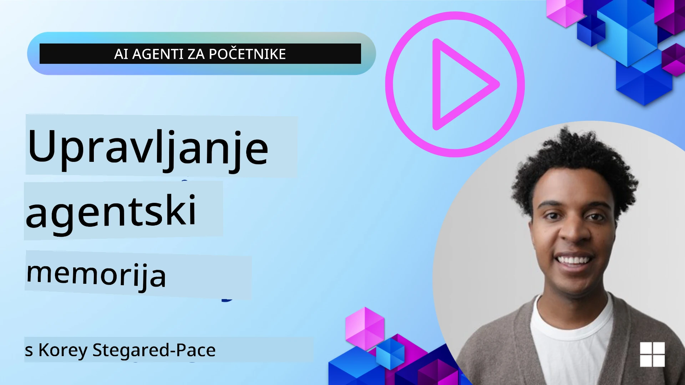

<!--
CO_OP_TRANSLATOR_METADATA:
{
  "original_hash": "a1d90991499ad697c4ad24decaf36968",
  "translation_date": "2025-12-09T12:51:52+00:00",
  "source_file": "13-agent-memory/README.md",
  "language_code": "hr"
}
-->
# Memorija za AI agente 

Kada govorimo o jedinstvenim prednostima stvaranja AI agenata, najčešće se spominju dvije stvari: sposobnost korištenja alata za obavljanje zadataka i sposobnost poboljšanja tijekom vremena. Memorija je temelj stvaranja samopoboljšavajućih agenata koji mogu pružiti bolje iskustvo našim korisnicima.

U ovoj lekciji ćemo istražiti što je memorija za AI agente, kako je možemo upravljati i koristiti za dobrobit naših aplikacija.

## Uvod

Ova lekcija obuhvaća:

• **Razumijevanje memorije AI agenta**: Što je memorija i zašto je ključna za agente.

• **Implementacija i pohrana memorije**: Praktične metode za dodavanje memorijskih sposobnosti vašim AI agentima, s naglaskom na kratkoročnu i dugoročnu memoriju.

• **Stvaranje samopoboljšavajućih AI agenata**: Kako memorija omogućuje agentima da uče iz prošlih interakcija i poboljšavaju se tijekom vremena.

## Dostupne implementacije

Ova lekcija uključuje dva sveobuhvatna vodiča u obliku bilježnica:

• **[13-agent-memory.ipynb](./13-agent-memory.ipynb)**: Implementira memoriju koristeći Mem0 i Azure AI Search s okvirom Semantic Kernel.

• **[13-agent-memory-cognee.ipynb](./13-agent-memory-cognee.ipynb)**: Implementira strukturiranu memoriju koristeći Cognee, automatski izgrađujući graf znanja podržan ugradnjama, vizualizirajući graf i omogućujući inteligentno pretraživanje.

## Ciljevi učenja

Nakon završetka ove lekcije, znat ćete kako:

• **Razlikovati različite vrste memorije AI agenta**, uključujući radnu, kratkoročnu i dugoročnu memoriju, kao i specijalizirane oblike poput memorije osobnosti i epizodne memorije.

• **Implementirati i upravljati kratkoročnom i dugoročnom memorijom za AI agente** koristeći okvir Semantic Kernel, koristeći alate poput Mem0, Cognee, Whiteboard memorije i integraciju s Azure AI Search.

• **Razumjeti principe iza samopoboljšavajućih AI agenata** i kako robusni sustavi upravljanja memorijom doprinose kontinuiranom učenju i prilagodbi.

## Razumijevanje memorije AI agenta

U svojoj srži, **memorija za AI agente odnosi se na mehanizme koji im omogućuju zadržavanje i prisjećanje informacija**. Te informacije mogu biti specifični detalji o razgovoru, korisničke preferencije, prošle radnje ili čak naučeni obrasci.

Bez memorije, AI aplikacije su često bez stanja, što znači da svaka interakcija počinje ispočetka. To dovodi do ponavljajućeg i frustrirajućeg korisničkog iskustva gdje agent "zaboravlja" prethodni kontekst ili preferencije.

### Zašto je memorija važna?

Inteligencija agenta duboko je povezana s njegovom sposobnošću prisjećanja i korištenja prošlih informacija. Memorija omogućuje agentima da budu:

• **Refleksivni**: Uče iz prošlih radnji i ishoda.

• **Interaktivni**: Održavaju kontekst tijekom trajanja razgovora.

• **Proaktivni i reaktivni**: Predviđaju potrebe ili odgovaraju prikladno na temelju povijesnih podataka.

• **Autonomni**: Djeluju neovisnije oslanjajući se na pohranjeno znanje.

Cilj implementacije memorije je učiniti agente **pouzdanijima i sposobnijima**.

### Vrste memorije

#### Radna memorija

Zamislite ovo kao komad papira za bilješke koji agent koristi tijekom jednog zadatka ili misaonog procesa. Ona drži neposredne informacije potrebne za izračun sljedećeg koraka.

Za AI agente, radna memorija često bilježi najrelevantnije informacije iz razgovora, čak i ako je cijela povijest chata duga ili skraćena. Fokusira se na izdvajanje ključnih elemenata poput zahtjeva, prijedloga, odluka i radnji.

**Primjer radne memorije**

Kod agenta za rezervaciju putovanja, radna memorija može zabilježiti trenutni zahtjev korisnika, poput "Želim rezervirati putovanje u Pariz". Ovaj specifični zahtjev drži se u neposrednom kontekstu agenta kako bi vodio trenutnu interakciju.

#### Kratkoročna memorija

Ova vrsta memorije zadržava informacije tijekom trajanja jednog razgovora ili sesije. To je kontekst trenutnog chata, omogućujući agentu da se referira na prethodne dijelove dijaloga.

**Primjer kratkoročne memorije**

Ako korisnik pita: "Koliko bi koštao let za Pariz?" i zatim nastavi s "A što je s smještajem tamo?", kratkoročna memorija osigurava da agent zna da se "tamo" odnosi na "Pariz" unutar istog razgovora.

#### Dugoročna memorija

Ovo su informacije koje traju kroz više razgovora ili sesija. Omogućuje agentima da pamte korisničke preferencije, povijesne interakcije ili opće znanje tijekom duljih razdoblja. Ovo je važno za personalizaciju.

**Primjer dugoročne memorije**

Dugoročna memorija može pohraniti da "Ben uživa u skijanju i aktivnostima na otvorenom, voli kavu s pogledom na planine i želi izbjeći napredne skijaške staze zbog prošle ozljede". Ove informacije, naučene iz prethodnih interakcija, utječu na preporuke u budućim sesijama planiranja putovanja, čineći ih visoko personaliziranima.

#### Memorija osobnosti

Ova specijalizirana vrsta memorije pomaže agentu razviti dosljednu "osobnost" ili "personu". Omogućuje agentu da pamti detalje o sebi ili svojoj namijenjenoj ulozi, čineći interakcije fluidnijima i fokusiranijima.

**Primjer memorije osobnosti**

Ako je agent za putovanja dizajniran da bude "stručnjak za planiranje skijanja", memorija osobnosti može ojačati ovu ulogu, utječući na njegove odgovore kako bi bili u skladu s tonom i znanjem stručnjaka.

#### Memorija tijeka rada/epizodna memorija

Ova memorija pohranjuje slijed koraka koje agent poduzima tijekom složenog zadatka, uključujući uspjehe i neuspjehe. To je poput pamćenja specifičnih "epizoda" ili prošlih iskustava kako bi se iz njih učilo.

**Primjer epizodne memorije**

Ako je agent pokušao rezervirati određeni let, ali nije uspio zbog nedostupnosti, epizodna memorija može zabilježiti ovaj neuspjeh, omogućujući agentu da pokuša alternativne letove ili informira korisnika o problemu na informiraniji način tijekom sljedećeg pokušaja.

#### Memorija entiteta

Ovo uključuje izdvajanje i pamćenje specifičnih entiteta (poput ljudi, mjesta ili stvari) i događaja iz razgovora. Omogućuje agentu da izgradi strukturirano razumijevanje ključnih elemenata o kojima se raspravlja.

**Primjer memorije entiteta**

Iz razgovora o prošlom putovanju, agent može izdvojiti "Pariz", "Eiffelov toranj" i "večera u restoranu Le Chat Noir" kao entitete. U budućoj interakciji, agent bi se mogao prisjetiti "Le Chat Noir" i ponuditi da tamo napravi novu rezervaciju.

#### Strukturirani RAG (Retrieval Augmented Generation)

Iako je RAG šira tehnika, "Strukturirani RAG" ističe se kao moćna tehnologija memorije. Izvlači guste, strukturirane informacije iz različitih izvora (razgovora, e-mailova, slika) i koristi ih za poboljšanje preciznosti, prisjećanja i brzine odgovora. Za razliku od klasičnog RAG-a koji se oslanja isključivo na semantičku sličnost, Strukturirani RAG radi s inherentnom strukturom informacija.

**Primjer strukturiranog RAG-a**

Umjesto da samo podudara ključne riječi, Strukturirani RAG može analizirati detalje leta (odredište, datum, vrijeme, aviokompanija) iz e-maila i pohraniti ih na strukturiran način. Ovo omogućuje precizne upite poput "Koji let sam rezervirao za Pariz u utorak?"

## Implementacija i pohrana memorije

Implementacija memorije za AI agente uključuje sustavni proces **upravljanja memorijom**, koji uključuje generiranje, pohranu, dohvaćanje, integraciju, ažuriranje, pa čak i "zaboravljanje" (ili brisanje) informacija. Dohvaćanje je posebno ključan aspekt.

### Specijalizirani alati za memoriju

#### Mem0

Jedan od načina za pohranu i upravljanje memorijom agenta je korištenje specijaliziranih alata poput Mem0. Mem0 djeluje kao sloj trajne memorije, omogućujući agentima da se prisjete relevantnih interakcija, pohrane korisničke preferencije i činjenični kontekst te uče iz uspjeha i neuspjeha tijekom vremena. Ideja je da se agenti bez stanja pretvore u agente sa stanjem.

Funkcionira kroz **dvofazni memorijski proces: ekstrakcija i ažuriranje**. Prvo, poruke dodane u nit agenta šalju se Mem0 servisu, koji koristi Veliki Jezični Model (LLM) za sažimanje povijesti razgovora i izdvajanje novih memorija. Nakon toga, faza ažuriranja vođena LLM-om određuje hoće li dodati, izmijeniti ili izbrisati te memorije, pohranjujući ih u hibridnu bazu podataka koja može uključivati vektorske, grafičke i ključ-vrijednost baze podataka. Ovaj sustav također podržava različite vrste memorije i može uključivati grafičku memoriju za upravljanje odnosima između entiteta.

#### Cognee

Još jedan moćan pristup je korištenje **Cognee**, otvorenog koda za semantičku memoriju AI agenata koji transformira strukturirane i nestrukturirane podatke u upitne grafove znanja podržane ugradnjama. Cognee pruža **arhitekturu s dvostrukom pohranom** koja kombinira vektorsko pretraživanje s grafičkim odnosima, omogućujući agentima da razumiju ne samo koje su informacije slične, već i kako su koncepti međusobno povezani.

Izvrsno se snalazi u **hibridnom dohvaćanju** koje spaja vektorsku sličnost, grafičku strukturu i LLM zaključivanje - od pretraživanja sirovih dijelova do odgovaranja na pitanja svjesnih grafa. Sustav održava **živu memoriju** koja se razvija i raste dok ostaje upitna kao jedan povezani graf, podržavajući i kratkoročni kontekst sesije i dugoročnu trajnu memoriju.

Vodič za bilježnicu Cognee ([13-agent-memory-cognee.ipynb](./13-agent-memory-cognee.ipynb)) demonstrira izgradnju ovog jedinstvenog memorijskog sloja, s praktičnim primjerima unosa raznovrsnih izvora podataka, vizualizacije grafa znanja i upita s različitim strategijama pretraživanja prilagođenim specifičnim potrebama agenta.

### Pohrana memorije s RAG-om

Osim specijaliziranih alata za memoriju poput Mem0, možete koristiti robusne usluge pretraživanja poput **Azure AI Search kao pozadinu za pohranu i dohvaćanje memorija**, posebno za strukturirani RAG.

Ovo omogućuje da odgovori vašeg agenta budu utemeljeni na vašim vlastitim podacima, osiguravajući relevantnije i točnije odgovore. Azure AI Search može se koristiti za pohranu korisničkih specifičnih putnih memorija, kataloga proizvoda ili bilo kojeg drugog znanja specifičnog za domenu.

Azure AI Search podržava mogućnosti poput **strukturiranog RAG-a**, koji se ističe u izvlačenju i dohvaćanju gustih, strukturiranih informacija iz velikih skupova podataka poput povijesti razgovora, e-mailova ili čak slika. Ovo pruža "nadljudsku preciznost i prisjećanje" u usporedbi s tradicionalnim pristupima segmentiranju teksta i ugradnji.

## Stvaranje samopoboljšavajućih AI agenata

Uobičajeni obrazac za samopoboljšavajuće agente uključuje uvođenje **"agenta znanja"**. Ovaj zasebni agent promatra glavni razgovor između korisnika i primarnog agenta. Njegova uloga je:

1. **Identificirati vrijedne informacije**: Odrediti je li neki dio razgovora vrijedan spremanja kao opće znanje ili specifična korisnička preferencija.

2. **Izvući i sažeti**: Destilirati bitno učenje ili preferenciju iz razgovora.

3. **Pohraniti u bazu znanja**: Trajno pohraniti izvučene informacije, često u vektorsku bazu podataka, kako bi se mogle dohvatiti kasnije.

4. **Poboljšati buduće upite**: Kada korisnik pokrene novi upit, agent znanja dohvaća relevantne pohranjene informacije i dodaje ih korisničkom upitu, pružajući ključni kontekst primarnom agentu (slično RAG-u).

### Optimizacije za memoriju

• **Upravljanje kašnjenjem**: Kako bi se izbjeglo usporavanje korisničkih interakcija, može se koristiti jeftiniji, brži model za početnu provjeru je li informacija vrijedna pohrane ili dohvaćanja, a složeniji proces ekstrakcije/dohvaćanja pokreće se samo kada je potrebno.

• **Održavanje baze znanja**: Za rastuću bazu znanja, informacije koje se rjeđe koriste mogu se premjestiti u "hladnu pohranu" radi upravljanja troškovima.

## Imate još pitanja o memoriji agenta?

Pridružite se [Azure AI Foundry Discordu](https://aka.ms/ai-agents/discord) kako biste se povezali s drugim učenicima, sudjelovali u uredskim satima i dobili odgovore na svoja pitanja o AI agentima.

---

<!-- CO-OP TRANSLATOR DISCLAIMER START -->
**Odricanje od odgovornosti**:  
Ovaj dokument je preveden pomoću AI usluge za prevođenje [Co-op Translator](https://github.com/Azure/co-op-translator). Iako nastojimo osigurati točnost, imajte na umu da automatski prijevodi mogu sadržavati pogreške ili netočnosti. Izvorni dokument na izvornom jeziku treba smatrati autoritativnim izvorom. Za ključne informacije preporučuje se profesionalni prijevod od strane čovjeka. Ne odgovaramo za nesporazume ili pogrešna tumačenja koja proizlaze iz korištenja ovog prijevoda.
<!-- CO-OP TRANSLATOR DISCLAIMER END -->