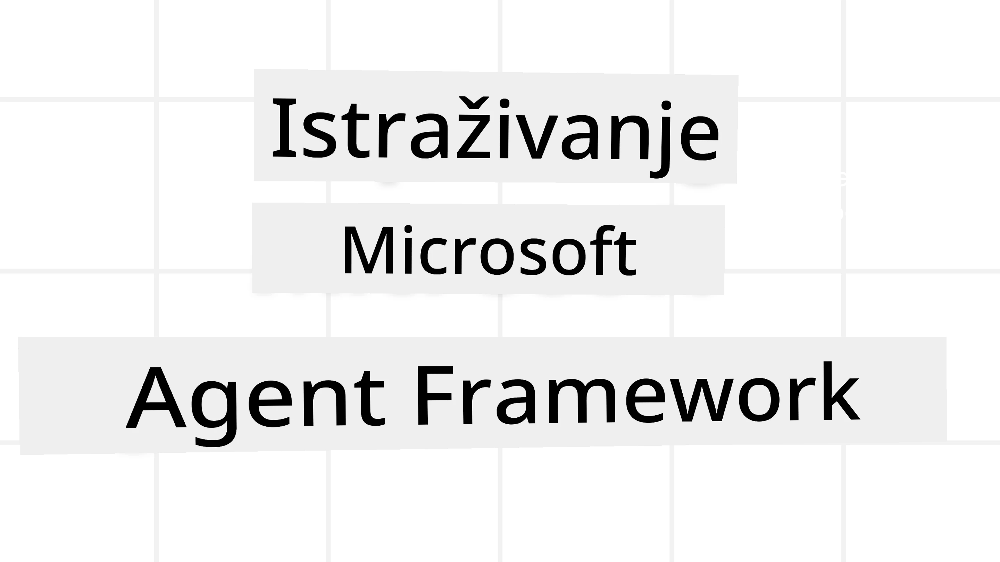
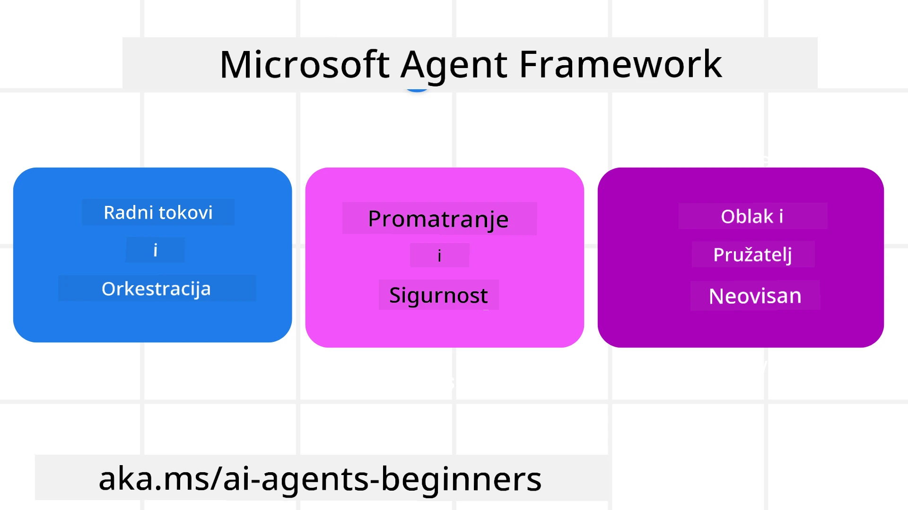
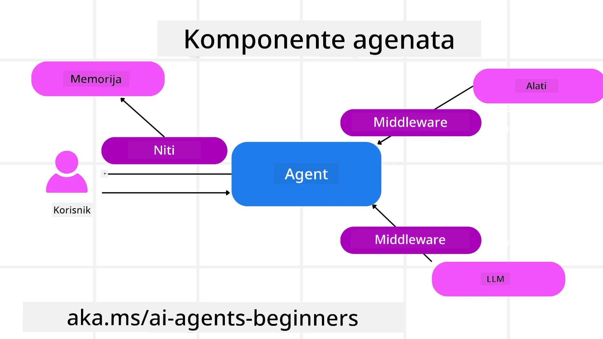

<!--
CO_OP_TRANSLATOR_METADATA:
{
  "original_hash": "19c4dab375acbc733855cc7f2f04edbc",
  "translation_date": "2025-10-02T06:50:24+00:00",
  "source_file": "14-microsoft-agent-framework/README.md",
  "language_code": "hr"
}
-->
# Istraživanje Microsoft Agent Frameworka



### Uvod

Ova lekcija obuhvaća:

- Razumijevanje Microsoft Agent Frameworka: Ključne značajke i vrijednost  
- Istraživanje ključnih koncepata Microsoft Agent Frameworka
- Usporedba MAF-a sa Semantic Kernelom i AutoGenom: Vodič za migraciju

## Ciljevi učenja

Nakon završetka ove lekcije, znat ćete kako:

- Izgraditi AI agente spremne za produkciju koristeći Microsoft Agent Framework
- Primijeniti osnovne značajke Microsoft Agent Frameworka na svoje agentne slučajeve upotrebe
- Migrirati i integrirati postojeće agentne okvire i alate  

## Primjeri koda 

Primjeri koda za [Microsoft Agent Framework (MAF)](https://aka.ms/ai-agents-beginners/agent-framewrok) dostupni su u ovom repozitoriju pod datotekama `xx-python-agent-framework` i `xx-dotnet-agent-framework`.

## Razumijevanje Microsoft Agent Frameworka



[Microsoft Agent Framework (MAF)](https://aka.ms/ai-agents-beginners/agent-framewrok) temelji se na iskustvima i saznanjima iz Semantic Kernela i AutoGena. Pruža fleksibilnost za rješavanje širokog spektra agentnih slučajeva upotrebe u produkcijskim i istraživačkim okruženjima, uključujući:

- **Sekvencijalnu orkestraciju agenata** u scenarijima gdje su potrebni korak-po-korak radni tokovi.
- **Istovremenu orkestraciju** u scenarijima gdje agenti trebaju istovremeno izvršavati zadatke.
- **Orkestraciju grupnog razgovora** u scenarijima gdje agenti mogu surađivati na jednom zadatku.
- **Orkestraciju predaje** u scenarijima gdje agenti predaju zadatak jedni drugima nakon dovršetka podzadataka.
- **Magnetnu orkestraciju** u scenarijima gdje upravljački agent stvara i mijenja popis zadataka te koordinira podagente za dovršavanje zadatka.

Za isporuku AI agenata u produkciji, MAF uključuje značajke za:

- **Promatranje** putem OpenTelemetryja, gdje se svaka akcija AI agenta, uključujući pozivanje alata, korake orkestracije, tokove razmišljanja i praćenje performansi, može pratiti putem nadzornih ploča Azure AI Foundryja.
- **Sigurnost** hostingom agenata nativno na Azure AI Foundryju, koji uključuje sigurnosne kontrole poput pristupa temeljenog na ulogama, rukovanja privatnim podacima i ugrađene sigurnosti sadržaja.
- **Izdržljivost** jer agentni tokovi i radni procesi mogu pauzirati, nastaviti i oporaviti se od pogrešaka, što omogućuje dugotrajnije procese.
- **Kontrolu** jer su podržani radni tokovi s ljudskom intervencijom, gdje se zadaci označavaju kao zahtijevajući ljudsko odobrenje.

Microsoft Agent Framework također je usmjeren na interoperabilnost putem:

- **Neovisnosti o oblaku** - Agenti mogu raditi u kontejnerima, lokalno i na različitim oblacima.
- **Neovisnosti o pružatelju usluga** - Agenti se mogu kreirati putem preferiranog SDK-a, uključujući Azure OpenAI i OpenAI.
- **Integracije otvorenih standarda** - Agenti mogu koristiti protokole poput Agent-to-Agent (A2A) i Model Context Protocol (MCP) za otkrivanje i korištenje drugih agenata i alata.
- **Dodataka i konektora** - Moguće je povezivanje s uslugama podataka i memorije poput Microsoft Fabric, SharePoint, Pinecone i Qdrant.

Pogledajmo kako se ove značajke primjenjuju na neke od osnovnih koncepata Microsoft Agent Frameworka.

## Ključni koncepti Microsoft Agent Frameworka

### Agenti



**Kreiranje agenata**

Kreiranje agenata vrši se definiranjem usluge inferencije (LLM pružatelja usluga), skupa uputa koje AI agent treba slijediti i dodijeljenog `imena`:

```python
agent = AzureOpenAIChatClient(credential=AzureCliCredential()).create_agent( instructions="You are good at recommending trips to customers based on their preferences.", name="TripRecommender" )
```

Gore navedeno koristi `Azure OpenAI`, ali agenti se mogu kreirati koristeći razne usluge, uključujući `Azure AI Foundry Agent Service`:

```python
AzureAIAgentClient(async_credential=credential).create_agent( name="HelperAgent", instructions="You are a helpful assistant." ) as agent
```

OpenAI `Responses`, `ChatCompletion` API-je

```python
agent = OpenAIResponsesClient().create_agent( name="WeatherBot", instructions="You are a helpful weather assistant.", )
```

```python
agent = OpenAIChatClient().create_agent( name="HelpfulAssistant", instructions="You are a helpful assistant.", )
```

ili udaljene agente koristeći A2A protokol:

```python
agent = A2AAgent( name=agent_card.name, description=agent_card.description, agent_card=agent_card, url="https://your-a2a-agent-host" )
```

**Pokretanje agenata**

Agenti se pokreću koristeći metode `.run` ili `.run_stream` za odgovore bez strujanja ili sa strujanjem.

```python
result = await agent.run("What are good places to visit in Amsterdam?")
print(result.text)
```

```python
async for update in agent.run_stream("What are the good places to visit in Amsterdam?"):
    if update.text:
        print(update.text, end="", flush=True)

```

Svako pokretanje agenta također može imati opcije za prilagodbu parametara poput `max_tokens` koje agent koristi, `tools` koje agent može pozvati, pa čak i samog `modela` koji se koristi za agenta.

Ovo je korisno u slučajevima gdje su potrebni specifični modeli ili alati za dovršavanje korisničkog zadatka.

**Alati**

Alati se mogu definirati i prilikom definiranja agenta:

```python
def get_attractions( location: Annotated[str, Field(description="The location to get the top tourist attractions for")], ) -> str: """Get the top tourist attractions for a given location.""" return f"The top attractions for {location} are." 


# When creating a ChatAgent directly 

agent = ChatAgent( chat_client=OpenAIChatClient(), instructions="You are a helpful assistant", tools=[get_attractions]

```

i također prilikom pokretanja agenta:

```python

result1 = await agent.run( "What's the best place to visit in Seattle?", tools=[get_attractions] # Tool provided for this run only )
```

**Agentni tokovi**

Agentni tokovi koriste se za upravljanje razgovorima s više okreta. Tokovi se mogu kreirati na dva načina:

- Korištenjem `get_new_thread()` koji omogućuje spremanje toka tijekom vremena.
- Automatskim kreiranjem toka prilikom pokretanja agenta, pri čemu tok traje samo tijekom trenutnog pokretanja.

Za kreiranje toka, kod izgleda ovako:

```python
# Create a new thread. 
thread = agent.get_new_thread() # Run the agent with the thread. 
response = await agent.run("Hello, I am here to help you book travel. Where would you like to go?", thread=thread)

```

Zatim možete serijalizirati tok kako bi se spremio za kasniju upotrebu:

```python
# Create a new thread. 
thread = agent.get_new_thread() 

# Run the agent with the thread. 

response = await agent.run("Hello, how are you?", thread=thread) 

# Serialize the thread for storage. 

serialized_thread = await thread.serialize() 

# Deserialize the thread state after loading from storage. 

resumed_thread = await agent.deserialize_thread(serialized_thread)
```

**Agentni middleware**

Agenti komuniciraju s alatima i LLM-ovima kako bi dovršili korisničke zadatke. U određenim scenarijima želimo izvršiti ili pratiti interakcije između tih elemenata. Middleware za agente omogućuje nam to putem:

*Middleware funkcije*

Ovaj middleware omogućuje izvršavanje akcije između agenta i funkcije/alata koji će pozvati. Primjer kada bi se ovo koristilo je kada želite zapisati logove o pozivu funkcije.

U kodu ispod `next` definira hoće li se pozvati sljedeći middleware ili stvarna funkcija.

```python
async def logging_function_middleware(
    context: FunctionInvocationContext,
    next: Callable[[FunctionInvocationContext], Awaitable[None]],
) -> None:
    """Function middleware that logs function execution."""
    # Pre-processing: Log before function execution
    print(f"[Function] Calling {context.function.name}")

    # Continue to next middleware or function execution
    await next(context)

    # Post-processing: Log after function execution
    print(f"[Function] {context.function.name} completed")
```

*Middleware za razgovor*

Ovaj middleware omogućuje izvršavanje ili zapisivanje akcije između agenta i zahtjeva između LLM-a.

Ovo sadrži važne informacije poput `messages` koje se šalju AI usluzi.

```python
async def logging_chat_middleware(
    context: ChatContext,
    next: Callable[[ChatContext], Awaitable[None]],
) -> None:
    """Chat middleware that logs AI interactions."""
    # Pre-processing: Log before AI call
    print(f"[Chat] Sending {len(context.messages)} messages to AI")

    # Continue to next middleware or AI service
    await next(context)

    # Post-processing: Log after AI response
    print("[Chat] AI response received")

```

**Agentna memorija**

Kako je objašnjeno u lekciji `Agentic Memory`, memorija je važan element za omogućavanje agentu da djeluje u različitim kontekstima. MAF nudi nekoliko različitih vrsta memorije:

*Memorija u aplikaciji*

Ovo je memorija pohranjena u tokovima tijekom trajanja aplikacije.

```python
# Create a new thread. 
thread = agent.get_new_thread() # Run the agent with the thread. 
response = await agent.run("Hello, I am here to help you book travel. Where would you like to go?", thread=thread)
```

*Trajne poruke*

Ova memorija koristi se za pohranu povijesti razgovora između različitih sesija. Definira se pomoću `chat_message_store_factory`:

```python
from agent_framework import ChatMessageStore

# Create a custom message store
def create_message_store():
    return ChatMessageStore()

agent = ChatAgent(
    chat_client=OpenAIChatClient(),
    instructions="You are a Travel assistant.",
    chat_message_store_factory=create_message_store
)

```

*Dinamička memorija*

Ova memorija dodaje se kontekstu prije pokretanja agenata. Ove memorije mogu se pohraniti u vanjske usluge poput mem0:

```python
from agent_framework.mem0 import Mem0Provider

# Using Mem0 for advanced memory capabilities
memory_provider = Mem0Provider(
    api_key="your-mem0-api-key",
    user_id="user_123",
    application_id="my_app"
)

agent = ChatAgent(
    chat_client=OpenAIChatClient(),
    instructions="You are a helpful assistant with memory.",
    context_providers=memory_provider
)

```

**Promatranje agenata**

Promatranje je važno za izgradnju pouzdanih i održivih agentnih sustava. MAF se integrira s OpenTelemetryjem kako bi pružio praćenje i mjerenje za bolje promatranje.

```python
from agent_framework.observability import get_tracer, get_meter

tracer = get_tracer()
meter = get_meter()
with tracer.start_as_current_span("my_custom_span"):
    # do something
    pass
counter = meter.create_counter("my_custom_counter")
counter.add(1, {"key": "value"})
```

### Radni tokovi

MAF nudi radne tokove koji su unaprijed definirani koraci za dovršavanje zadatka i uključuju AI agente kao komponente u tim koracima.

Radni tokovi sastoje se od različitih komponenti koje omogućuju bolju kontrolu toka. Radni tokovi također omogućuju **orkestraciju više agenata** i **checkpointing** za spremanje stanja radnog toka.

Osnovne komponente radnog toka su:

**Izvršitelji**

Izvršitelji primaju ulazne poruke, obavljaju dodijeljene zadatke i zatim proizvode izlaznu poruku. Ovo pomiče radni tok prema dovršavanju većeg zadatka. Izvršitelji mogu biti AI agenti ili prilagođena logika.

**Rubovi**

Rubovi se koriste za definiranje toka poruka u radnom toku. Oni mogu biti:

*Izravni rubovi* - Jednostavne veze jedan-na-jedan između izvršitelja:

```python
from agent_framework import WorkflowBuilder

builder = WorkflowBuilder()
builder.add_edge(source_executor, target_executor)
builder.set_start_executor(source_executor)
workflow = builder.build()
```

*Uvjetni rubovi* - Aktiviraju se nakon što se ispuni određeni uvjet. Na primjer, kada hotelske sobe nisu dostupne, izvršitelj može predložiti druge opcije.

*Switch-case rubovi* - Usmjeravaju poruke različitim izvršiteljima na temelju definiranih uvjeta. Na primjer, ako putnički korisnik ima prioritetni pristup, njihovi zadaci će se obraditi kroz drugi radni tok.

*Fan-out rubovi* - Šalju jednu poruku na više ciljeva.

*Fan-in rubovi* - Prikupljaju više poruka od različitih izvršitelja i šalju na jedan cilj.

**Događaji**

Kako bi se omogućilo bolje promatranje radnih tokova, MAF nudi ugrađene događaje za izvršenje, uključujući:

- `WorkflowStartedEvent`  - Početak izvršenja radnog toka
- `WorkflowOutputEvent` - Radni tok proizvodi izlaz
- `WorkflowErrorEvent` - Radni tok nailazi na pogrešku
- `ExecutorInvokeEvent`  - Izvršitelj započinje obradu
- `ExecutorCompleteEvent`  - Izvršitelj završava obradu
- `RequestInfoEvent` - Izdaje se zahtjev

## Migracija iz drugih okvira (Semantic Kernel i AutoGen)

### Razlike između MAF-a i Semantic Kernela

**Pojednostavljeno kreiranje agenata**

Semantic Kernel zahtijeva kreiranje instance Kernela za svakog agenta. MAF koristi pojednostavljeni pristup koristeći ekstenzije za glavne pružatelje usluga.

```python
agent = AzureOpenAIChatClient(credential=AzureCliCredential()).create_agent( instructions="You are good at reccomending trips to customers based on their preferences.", name="TripRecommender" )
```

**Kreiranje agentnih tokova**

Semantic Kernel zahtijeva ručno kreiranje tokova. U MAF-u, agentu se izravno dodjeljuje tok.

```python
thread = agent.get_new_thread() # Run the agent with the thread. 
```

**Registracija alata**

U Semantic Kernelu, alati se registriraju u Kernelu, a Kernel se zatim prosljeđuje agentu. U MAF-u, alati se registriraju izravno tijekom procesa kreiranja agenta.

```python
agent = ChatAgent( chat_client=OpenAIChatClient(), instructions="You are a helpful assistant", tools=[get_attractions]
```

### Razlike između MAF-a i AutoGena

**Timovi vs Radni tokovi**

`Timovi` su struktura događaja za aktivnosti vođene događajima s agentima u AutoGenu. MAF koristi `Radne tokove` koji usmjeravaju podatke prema izvršiteljima kroz arhitekturu temeljenu na grafovima.

**Kreiranje alata**

AutoGen koristi `FunctionTool` za obuhvaćanje funkcija koje agenti mogu pozvati. MAF koristi @ai_function koji djeluje slično, ali također automatski zaključuje sheme za svaku funkciju.

**Ponašanje agenata**

Agenti su po defaultu agenti s jednim okretom u AutoGenu, osim ako `max_tool_iterations` nije postavljen na višu vrijednost. U MAF-u, `ChatAgent` je po defaultu agent s više okreta, što znači da će nastaviti pozivati alate dok korisnički zadatak ne bude dovršen.

## Primjeri koda 

Primjeri koda za Microsoft Agent Framework dostupni su u ovom repozitoriju pod datotekama `xx-python-agent-framework` i `xx-dotnet-agent-framework`.

## Imate li još pitanja o Microsoft Agent Frameworku?

Pridružite se [Azure AI Foundry Discordu](https://aka.ms/ai-agents/discord) kako biste se povezali s drugim učenicima, sudjelovali u uredskim satima i dobili odgovore na svoja pitanja o AI agentima.

---

**Izjava o odricanju odgovornosti**:  
Ovaj dokument je preveden pomoću AI usluge za prevođenje [Co-op Translator](https://github.com/Azure/co-op-translator). Iako nastojimo osigurati točnost, imajte na umu da automatski prijevodi mogu sadržavati pogreške ili netočnosti. Izvorni dokument na izvornom jeziku treba smatrati autoritativnim izvorom. Za ključne informacije preporučuje se profesionalni prijevod od strane ljudskog prevoditelja. Ne preuzimamo odgovornost za nesporazume ili pogrešna tumačenja koja mogu proizaći iz korištenja ovog prijevoda.