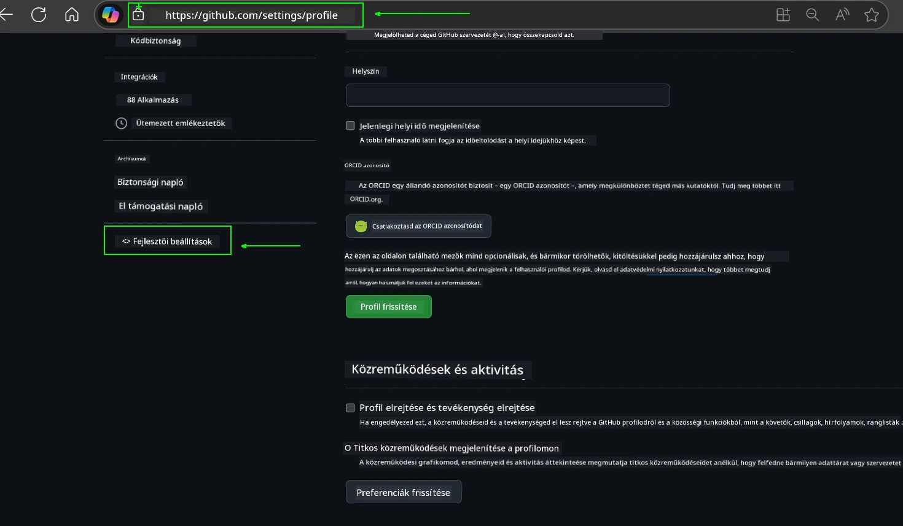
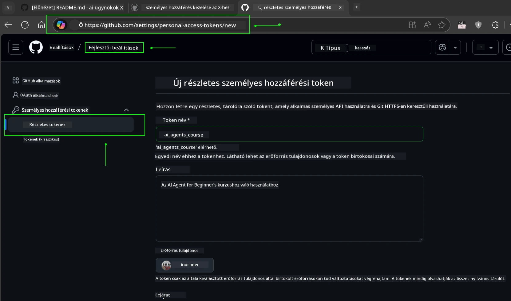
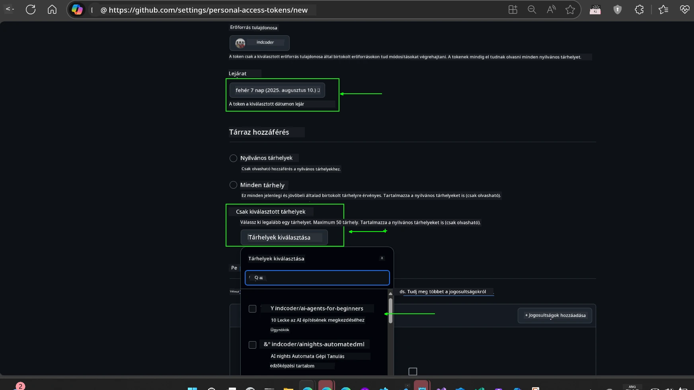
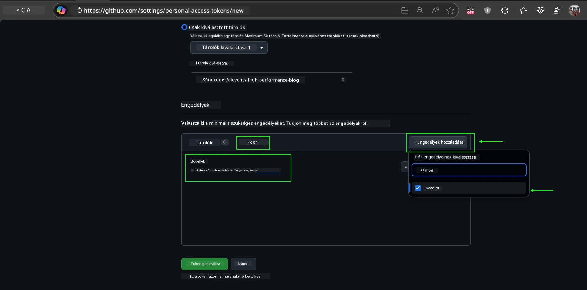
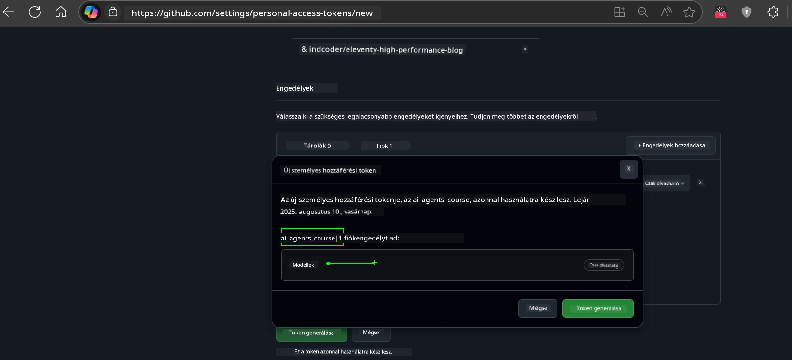
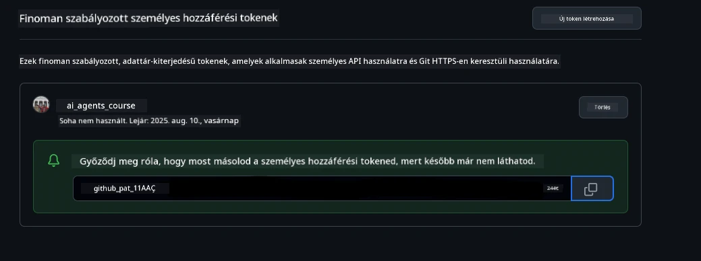
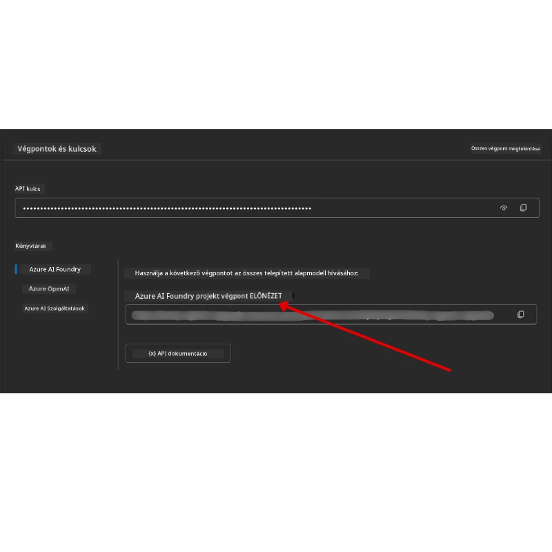

<!--
CO_OP_TRANSLATOR_METADATA:
{
  "original_hash": "63b1a8f6e840df15934935b728e569f0",
  "translation_date": "2025-12-03T14:51:01+00:00",
  "source_file": "00-course-setup/README.md",
  "language_code": "hu"
}
-->
# Tanfolyam Beállítása

## Bevezetés

Ebben a leckében megtanulhatod, hogyan futtasd a tanfolyam kódpéldáit.

## Csatlakozz más tanulókhoz és kérj segítséget

Mielőtt elkezdenéd klónozni a repót, csatlakozz az [AI Agents For Beginners Discord csatornához](https://aka.ms/ai-agents/discord), hogy segítséget kapj a beállításhoz, kérdéseket tegyél fel a tanfolyammal kapcsolatban, vagy kapcsolatba lépj más tanulókkal.

## Klónozd vagy Forkold ezt a Repót

Először klónozd vagy forkold a GitHub repót. Így létrehozhatod a tanfolyam anyagainak saját verzióját, amelyen futtathatod, tesztelheted és módosíthatod a kódot!

Ezt megteheted, ha rákattintasz a következő linkre: <a href="https://github.com/microsoft/ai-agents-for-beginners/fork" target="_blank">forkold a repót</a>

Most már meg kell, hogy legyen a tanfolyam saját forkolt verziója a következő linken:


### Sekély Klónozás (ajánlott workshopokhoz / Codespaces-hez)

  >A teljes repó mérete nagy lehet (~3 GB), ha letöltöd a teljes előzményeket és az összes fájlt. Ha csak a workshopon veszel részt, vagy csak néhány lecke mappára van szükséged, a sekély klónozás (vagy ritka klónozás) elkerüli a legtöbb letöltést az előzmények rövidítésével és/vagy a blobok kihagyásával.

#### Gyors sekély klónozás — minimális előzmények, összes fájl

Cseréld ki `<your-username>`-t az alábbi parancsokban a fork URL-re (vagy az upstream URL-re, ha azt preferálod).

Csak a legutóbbi commit előzmények klónozásához (kis letöltés):

```bash|powershell
git clone --depth 1 https://github.com/<your-username>/ai-agents-for-beginners.git
```

Egy adott ág klónozásához:

```bash|powershell
git clone --depth 1 --branch <branch-name> https://github.com/<your-username>/ai-agents-for-beginners.git
```

#### Részleges (ritka) klónozás — minimális blobok + csak kiválasztott mappák

Ez részleges klónozást és ritka-checkoutot használ (Git 2.25+ szükséges, modern Git ajánlott részleges klónozás támogatással):

```bash|powershell
git clone --depth 1 --filter=blob:none --sparse https://github.com/<your-username>/ai-agents-for-beginners.git
```

Lépj be a repo mappájába:

```bash|powershell
cd ai-agents-for-beginners
```

Ezután add meg, mely mappákat szeretnéd (az alábbi példa két mappát mutat):

```bash|powershell
git sparse-checkout set 00-course-setup 01-intro-to-ai-agents
```

A fájlok klónozása és ellenőrzése után, ha csak a fájlokra van szükséged, és helyet szeretnél felszabadítani (nincs git előzmény), töröld a repó metaadatait (💀visszafordíthatatlan — elveszíted az összes Git funkciót: nincs commit, pull, push vagy előzmény hozzáférés).

```bash
# zsh/bash
rm -rf .git
```

```powershell
# PowerShell
Remove-Item -Recurse -Force .git
```

#### GitHub Codespaces használata (ajánlott a helyi nagy letöltések elkerülésére)

- Hozz létre egy új Codespace-t ehhez a repóhoz a [GitHub UI](https://github.com/codespaces) segítségével.  

- Az újonnan létrehozott Codespace termináljában futtasd az egyik sekély/ritka klónozási parancsot, hogy csak a szükséges lecke mappákat hozd be a Codespace munkaterületére.
- Opcionális: a Codespaces-en belüli klónozás után távolítsd el a .git-et, hogy extra helyet szabadíts fel (lásd a fenti eltávolítási parancsokat).
- Megjegyzés: Ha inkább közvetlenül a Codespaces-ben nyitod meg a repót (extra klónozás nélkül), vedd figyelembe, hogy a Codespaces felépíti a devcontainer környezetet, és lehet, hogy több erőforrást biztosít, mint amire szükséged van. Egy sekély másolat klónozása egy friss Codespace-ben nagyobb kontrollt ad a lemezhasználat felett.

#### Tippek

- Mindig cseréld ki a klónozási URL-t a forkodra, ha szerkeszteni/commitolni szeretnél.
- Ha később több előzményre vagy fájlra van szükséged, letöltheted őket, vagy módosíthatod a ritka-checkoutot további mappák hozzáadásához.

## A Kód Futtatása

Ez a tanfolyam Jupyter Notebook-ok sorozatát kínálja, amelyeket futtathatsz, hogy gyakorlati tapasztalatot szerezz AI Agentek építésében.

A kódpéldák a következőket használják:

**GitHub Fiók Szükséges - Ingyenes**:

1) Semantic Kernel Agent Framework + GitHub Models Marketplace. Jelölve mint (semantic-kernel.ipynb)
2) AutoGen Framework + GitHub Models Marketplace. Jelölve mint (autogen.ipynb)

**Azure Előfizetés Szükséges**:

3) Azure AI Foundry + Azure AI Agent Service. Jelölve mint (azureaiagent.ipynb)

Bátorítunk, hogy próbáld ki mindhárom példát, hogy megtudd, melyik működik a legjobban számodra.

Bármelyik opciót választod, az határozza meg, hogy melyik beállítási lépéseket kell követned az alábbiakban:

## Követelmények

- Python 3.12+
  - **MEGJEGYZÉS**: Ha nincs telepítve a Python3.12, győződj meg róla, hogy telepíted. Ezután hozz létre egy venv-t python3.12 használatával, hogy biztosítsd a requirements.txt fájlból a megfelelő verziók telepítését.
  
    >Példa

    Python venv könyvtár létrehozása:

    ```bash|powershell
    python -m venv venv
    ```

    Ezután aktiváld a venv környezetet:

    ```bash
    # zsh/bash
    source venv/bin/activate
    ```
  
    ```dos
    # Command Prompt for Windows
    venv\Scripts\activate
    ```

- .NET 10+: A .NET-et használó mintakódokhoz győződj meg róla, hogy telepíted a [.NET 10 SDK](https://dotnet.microsoft.com/download/dotnet/10.0)-t vagy újabbat. Ezután ellenőrizd a telepített .NET SDK verzióját:

    ```bash|powershell
    dotnet --list-sdks
    ```

- GitHub Fiók - A GitHub Models Marketplace eléréséhez
- Azure Előfizetés - Az Azure AI Foundry eléréséhez
- Azure AI Foundry Fiók - Az Azure AI Agent Service eléréséhez

A repó gyökerében található egy `requirements.txt` fájl, amely tartalmazza az összes szükséges Python csomagot a kódpéldák futtatásához.

Ezeket a következő parancs futtatásával telepítheted a terminálban a repó gyökerében:

```bash|powershell
pip install -r requirements.txt
```

Ajánljuk, hogy hozz létre egy Python virtuális környezetet az esetleges konfliktusok és problémák elkerülése érdekében.

## VSCode Beállítása

Győződj meg róla, hogy a megfelelő Python verziót használod a VSCode-ban.


## Beállítás GitHub Modellek Használatához

### 1. lépés: GitHub Személyes Hozzáférési Token (PAT) Lekérése

Ez a tanfolyam a GitHub Models Marketplace-t használja, amely ingyenes hozzáférést biztosít Nagy Nyelvi Modellekhez (LLM-ek), amelyeket AI Agentek építéséhez fogsz használni.

A GitHub Modellek használatához létre kell hoznod egy [GitHub Személyes Hozzáférési Tokent](https://docs.github.com/en/authentication/keeping-your-account-and-data-secure/managing-your-personal-access-tokens).

Ezt megteheted, ha ellátogatsz a <a href="https://github.com/settings/personal-access-tokens" target="_blank">Személyes Hozzáférési Tokenek beállításai</a> oldalra a GitHub fiókodban.

Kérjük, kövesd a [Legkisebb Jogosultság Elvét](https://docs.github.com/en/get-started/learning-to-code/storing-your-secrets-safely) a token létrehozásakor. Ez azt jelenti, hogy csak azokat a jogosultságokat add meg a tokennek, amelyek szükségesek a tanfolyam kódpéldáinak futtatásához.

1. Válaszd ki a `Fine-grained tokens` opciót a képernyő bal oldalán a **Fejlesztői beállítások** alatt.

   

   Ezután válaszd a `Generate new token` lehetőséget.

   

2. Adj meg egy leíró nevet a tokenednek, amely tükrözi annak célját, így később könnyen azonosítható lesz.

    🔐 Token Időtartam Ajánlás

    Ajánlott időtartam: 30 nap
    A biztonságosabb hozzáállás érdekében választhatsz rövidebb időszakot is — például 7 nap 🛡️
    Ez egy remek módja annak, hogy személyes célt tűzz ki, és befejezd a tanfolyamot, miközben a tanulási lendületed magas 🚀.

    

3. Korlátozd a token hatókörét a repód forkjára.

    

4. Korlátozd a token jogosultságait: A **Jogosultságok** alatt kattints az **Account** fülre, majd kattints a "+ Add permissions" gombra. Egy legördülő menü jelenik meg. Keresd meg a **Models** opciót, és jelöld be a négyzetet.

    

5. Ellenőrizd a szükséges jogosultságokat a token generálása előtt. 

6. A token generálása előtt győződj meg róla, hogy készen állsz a token biztonságos helyen történő tárolására, például egy jelszókezelőben, mivel a token nem lesz újra megjelenítve a létrehozás után. 

Másold ki az újonnan létrehozott tokent. Most add hozzá ezt a `.env` fájlodhoz, amely a tanfolyam része.

### 2. lépés: `.env` Fájl Létrehozása

A `.env` fájl létrehozásához futtasd a következő parancsot a terminálodban.

```bash
# zsh/bash
cp .env.example .env
```

```powershell
# PowerShell
Copy-Item .env.example .env
```

Ez lemásolja a példafájlt, és létrehoz egy `.env` fájlt a könyvtáradban, ahol kitöltheted a környezeti változók értékeit.

A tokened bemásolásával nyisd meg a `.env` fájlt a kedvenc szövegszerkesztődben, és illeszd be a tokenedet a `GITHUB_TOKEN` mezőbe.


Most már képesnek kell lenned a tanfolyam kódpéldáinak futtatására.

## Beállítás Azure AI Foundry és Azure AI Agent Service Használatához

### 1. lépés: Azure Projekt Végpont Lekérése

Kövesd az Azure AI Foundry hub és projekt létrehozásának lépéseit itt: [Hub erőforrások áttekintése](https://learn.microsoft.com/azure/ai-foundry/concepts/ai-resources)

Miután létrehoztad a projektedet, le kell kérned a projekted kapcsolati stringjét.

Ezt megteheted, ha ellátogatsz a projekted **Áttekintés** oldalára az Azure AI Foundry portálon.



### 2. lépés: `.env` Fájl Létrehozása

A `.env` fájl létrehozásához futtasd a következő parancsot a terminálodban.

```bash
# zsh/bash
cp .env.example .env
```

```powershell
# PowerShell
Copy-Item .env.example .env
```

Ez lemásolja a példafájlt, és létrehoz egy `.env` fájlt a könyvtáradban, ahol kitöltheted a környezeti változók értékeit.

A tokened bemásolásával nyisd meg a `.env` fájlt a kedvenc szövegszerkesztődben, és illeszd be a tokenedet a `PROJECT_ENDPOINT` mezőbe.

### 3. lépés: Bejelentkezés az Azure-ba

Biztonsági legjobb gyakorlatként kulcs nélküli hitelesítést fogunk használni az Azure OpenAI-hoz való hitelesítéshez a Microsoft Entra ID-val. 

Ezután nyiss meg egy terminált, és futtasd az `az login --use-device-code` parancsot, hogy bejelentkezz az Azure fiókodba.

Miután bejelentkeztél, válaszd ki az előfizetésedet a terminálban.

## További Környezeti Változók - Azure Search és Azure OpenAI 

Az Agentic RAG Lecke - 5. lecke - mintái Azure Search és Azure OpenAI használatát igénylik.

Ha ezeket a mintákat szeretnéd futtatni, hozzá kell adnod a következő környezeti változókat a `.env` fájlodhoz:

### Áttekintés Oldal (Projekt)

- `AZURE_SUBSCRIPTION_ID` - Ellenőrizd a **Projekt részletek**-et a projekted **Áttekintés** oldalán.

- `AZURE_AI_PROJECT_NAME` - Nézd meg a projekted **Áttekintés** oldalának tetejét.

- `AZURE_OPENAI_SERVICE` - Ezt az **Included capabilities** fülön találod az **Azure OpenAI Service** alatt az **Áttekintés** oldalon.

### Menedzsment Központ

- `AZURE_OPENAI_RESOURCE_GROUP` - Menj a **Projekt tulajdonságok**-hoz az **Áttekintés** oldalon a **Menedzsment Központban**.

- `GLOBAL_LLM_SERVICE` - Az **Kapcsolt erőforrások** alatt keresd meg az **Azure AI Services** kapcsolat nevét. Ha nem található, ellenőrizd az **Azure portálon** az erőforráscsoportod alatt az AI Services erőforrás nevét.

### Modellek + Végpontok Oldal

- `AZURE_OPENAI_EMBEDDING_DEPLOYMENT_NAME` - Válaszd ki az embedding modelledet (pl. `text-embedding-ada-002`), és jegyezd fel a **Deployment name**-et a modell részleteiből.

- `AZURE_OPENAI_CHAT_DEPLOYMENT_NAME` - Válaszd ki a chat modelledet (pl. `gpt-4o-mini`), és jegyezd fel a **Deployment name**-et a modell részleteiből.

### Azure Portál

- `AZURE_OPENAI_ENDPOINT` - Keresd meg az **Azure AI services**-t, kattints rá, majd menj a **Resource Management**, **Keys and Endpoint** részhez, görgess le az "Azure OpenAI endpoints"-hoz, és másold ki azt, amelyik "Language APIs"-t mond.

- `AZURE_OPENAI_API_KEY` - Ugyanerről a képernyőről másold ki az 1. vagy 2. KULCSOT.

- `AZURE_SEARCH_SERVICE_ENDPOINT` - Keresd meg az **Azure AI Search** erőforrásodat, kattints rá, és nézd meg az **Áttekintés** részt.

- `AZURE_SEARCH_API_KEY` - Ezután menj a **Beállítások**-hoz, majd a **Kulcsok**-hoz, hogy lemásold az elsődleges vagy másodlagos admin kulcsot.

### Külső Weboldal

- `AZURE_OPENAI_API_VERSION` - Látogasd meg az [API verzió életciklus](https://learn.microsoft.com/azure/ai-services/openai/api-version-deprecation#latest-ga-api-release) oldalt a **Legújabb GA API kiadás** alatt.

### Kulcs nélküli hitelesítés beállítása

A hitelesítő adatok kódba ágyazása helyett kulcs nélküli kapcsolatot fogunk használni az Azure OpenAI-val. Ehhez importáljuk a
Ha bármilyen problémád adódik a beállítás futtatása során, csatlakozz az <a href="https://discord.gg/kzRShWzttr" target="_blank">Azure AI Community Discord</a> közösséghez, vagy <a href="https://github.com/microsoft/ai-agents-for-beginners/issues?WT.mc_id=academic-105485-koreyst" target="_blank">hozz létre egy hibajelentést</a>.

## Következő lecke

Most már készen állsz arra, hogy futtasd a kurzushoz tartozó kódot. Jó tanulást az AI ügynökök világáról! 

[Bevezetés az AI ügynökökbe és az ügynökök felhasználási eseteibe](../01-intro-to-ai-agents/README.md)

---

<!-- CO-OP TRANSLATOR DISCLAIMER START -->
**Felelősség kizárása**:  
Ezt a dokumentumot az [Co-op Translator](https://github.com/Azure/co-op-translator) AI fordítási szolgáltatás segítségével fordították le. Bár törekszünk a pontosságra, kérjük, vegye figyelembe, hogy az automatikus fordítások hibákat vagy pontatlanságokat tartalmazhatnak. Az eredeti dokumentum az eredeti nyelvén tekintendő hiteles forrásnak. Kritikus információk esetén javasolt professzionális emberi fordítást igénybe venni. Nem vállalunk felelősséget a fordítás használatából eredő félreértésekért vagy téves értelmezésekért.
<!-- CO-OP TRANSLATOR DISCLAIMER END -->