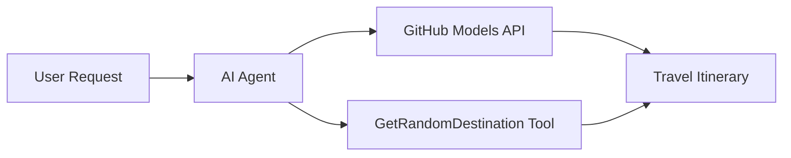

<!--
CO_OP_TRANSLATOR_METADATA:
{
  "original_hash": "5f351412e934f0833c8c821a0a60efaf",
  "translation_date": "2025-11-13T13:37:16+00:00",
  "source_file": "01-intro-to-ai-agents/code_samples/01-dotnet-agent-framework.md",
  "language_code": "hu"
}
-->
# 🌍 AI Utazási Ügynök a Microsoft Agent Frameworkkel (.NET)

## 📋 Forgatókönyv Áttekintése

Ez a példa bemutatja, hogyan lehet intelligens utazástervező ügynököt létrehozni a Microsoft Agent Framework segítségével .NET környezetben. Az ügynök automatikusan személyre szabott egynapos útitervet készít véletlenszerű úti célokhoz világszerte.

### Főbb Képességek:

- 🎲 **Véletlenszerű Úti Cél Kiválasztása**: Egyedi eszközt használ a nyaralóhelyek kiválasztásához
- 🗺️ **Intelligens Utazástervezés**: Részletes napi útitervet készít
- 🔄 **Valós Idejű Streaming**: Támogatja az azonnali és streaming válaszokat
- 🛠️ **Egyedi Eszköz Integráció**: Bemutatja, hogyan lehet bővíteni az ügynök képességeit

## 🔧 Technikai Architektúra

### Alapvető Technológiák

- **Microsoft Agent Framework**: A legújabb .NET megvalósítás AI ügynökök fejlesztéséhez
- **GitHub Models Integráció**: GitHub AI modell következtetési szolgáltatást használ
- **OpenAI API Kompatibilitás**: OpenAI kliens könyvtárakat használ egyedi végpontokkal
- **Biztonságos Konfiguráció**: Környezetalapú API kulcskezelés

### Főbb Komponensek

1. **AIAgent**: A fő ügynök, amely a beszélgetés folyamatát irányítja
2. **Egyedi Eszközök**: `GetRandomDestination()` funkció elérhető az ügynök számára
3. **Chat Kliens**: GitHub Models által támogatott beszélgetési felület
4. **Streaming Támogatás**: Valós idejű válaszgenerálási képességek

### Integrációs Minta



## 🚀 Első Lépések

### Előfeltételek

- [.NET 10 SDK](https://dotnet.microsoft.com/download/dotnet/10.0) vagy újabb
- [GitHub Models API hozzáférési token](https://docs.github.com/github-models/github-models-at-scale/using-your-own-api-keys-in-github-models)

### Szükséges Környezeti Változók

```bash
# zsh/bash
export GH_TOKEN=<your_github_token>
export GH_ENDPOINT=https://models.github.ai/inference
export GH_MODEL_ID=openai/gpt-5-mini
```

```powershell
# PowerShell
$env:GH_TOKEN = "<your_github_token>"
$env:GH_ENDPOINT = "https://models.github.ai/inference"
$env:GH_MODEL_ID = "openai/gpt-5-mini"
```

### Példa Kód

A kód futtatásához,

```bash
# zsh/bash
chmod +x ./01-dotnet-agent-framework.cs
./01-dotnet-agent-framework.cs
```

Vagy a dotnet CLI használatával:

```bash
dotnet run ./01-dotnet-agent-framework.cs
```

Lásd [`01-dotnet-agent-framework.cs`](../../../../01-intro-to-ai-agents/code_samples/01-dotnet-agent-framework.cs) a teljes kódért.

```csharp
#!/usr/bin/dotnet run

#:package Microsoft.Extensions.AI@9.*
#:package Microsoft.Agents.AI.OpenAI@1.*-*

using System.ClientModel;
using System.ComponentModel;

using Microsoft.Agents.AI;
using Microsoft.Extensions.AI;

using OpenAI;

// Tool Function: Random Destination Generator
// This static method will be available to the agent as a callable tool
// The [Description] attribute helps the AI understand when to use this function
// This demonstrates how to create custom tools for AI agents
[Description("Provides a random vacation destination.")]
static string GetRandomDestination()
{
    // List of popular vacation destinations around the world
    // The agent will randomly select from these options
    var destinations = new List<string>
    {
        "Paris, France",
        "Tokyo, Japan",
        "New York City, USA",
        "Sydney, Australia",
        "Rome, Italy",
        "Barcelona, Spain",
        "Cape Town, South Africa",
        "Rio de Janeiro, Brazil",
        "Bangkok, Thailand",
        "Vancouver, Canada"
    };

    // Generate random index and return selected destination
    // Uses System.Random for simple random selection
    var random = new Random();
    int index = random.Next(destinations.Count);
    return destinations[index];
}

// Extract configuration from environment variables
// Retrieve the GitHub Models API endpoint, defaults to https://models.github.ai/inference if not specified
// Retrieve the model ID, defaults to openai/gpt-5-mini if not specified
// Retrieve the GitHub token for authentication, throws exception if not specified
var github_endpoint = Environment.GetEnvironmentVariable("GH_ENDPOINT") ?? "https://models.github.ai/inference";
var github_model_id = Environment.GetEnvironmentVariable("GH_MODEL_ID") ?? "openai/gpt-5-mini";
var github_token = Environment.GetEnvironmentVariable("GH_TOKEN") ?? throw new InvalidOperationException("GH_TOKEN is not set.");

// Configure OpenAI Client Options
// Create configuration options to point to GitHub Models endpoint
// This redirects OpenAI client calls to GitHub's model inference service
var openAIOptions = new OpenAIClientOptions()
{
    Endpoint = new Uri(github_endpoint)
};

// Initialize OpenAI Client with GitHub Models Configuration
// Create OpenAI client using GitHub token for authentication
// Configure it to use GitHub Models endpoint instead of OpenAI directly
var openAIClient = new OpenAIClient(new ApiKeyCredential(github_token), openAIOptions);

// Create AI Agent with Travel Planning Capabilities
// Initialize OpenAI client, get chat client for specified model, and create AI agent
// Configure agent with travel planning instructions and random destination tool
// The agent can now plan trips using the GetRandomDestination function
AIAgent agent = openAIClient
    .GetChatClient(github_model_id)
    .CreateAIAgent(
        instructions: "You are a helpful AI Agent that can help plan vacations for customers at random destinations",
        tools: [AIFunctionFactory.Create(GetRandomDestination)]
    );

// Execute Agent: Plan a Day Trip
// Run the agent with streaming enabled for real-time response display
// Shows the agent's thinking and response as it generates the content
// Provides better user experience with immediate feedback
await foreach (var update in agent.RunStreamingAsync("Plan me a day trip"))
{
    await Task.Delay(10);
    Console.Write(update);
}
```

## 🎓 Főbb Tanulságok

1. **Ügynök Architektúra**: A Microsoft Agent Framework tiszta, típusbiztos megközelítést kínál AI ügynökök létrehozásához .NET-ben
2. **Eszköz Integráció**: A `[Description]` attribútummal ellátott funkciók elérhető eszközökké válnak az ügynök számára
3. **Konfiguráció Kezelés**: Környezeti változók és biztonságos hitelesítő adatok kezelése a .NET legjobb gyakorlatait követi
4. **OpenAI Kompatibilitás**: A GitHub Models integráció zökkenőmentesen működik az OpenAI-kompatibilis API-kon keresztül

## 🔗 További Források

- [Microsoft Agent Framework Dokumentáció](https://learn.microsoft.com/agent-framework)
- [GitHub Models Marketplace](https://github.com/marketplace?type=models)
- [Microsoft.Extensions.AI](https://learn.microsoft.com/dotnet/ai/microsoft-extensions-ai)
- [.NET Egyszerű Fájl Alkalmazások](https://devblogs.microsoft.com/dotnet/announcing-dotnet-run-app)

---

<!-- CO-OP TRANSLATOR DISCLAIMER START -->
**Felelősségi nyilatkozat**:  
Ez a dokumentum az [Co-op Translator](https://github.com/Azure/co-op-translator) AI fordítási szolgáltatás segítségével lett lefordítva. Bár törekszünk a pontosságra, kérjük, vegye figyelembe, hogy az automatikus fordítások hibákat vagy pontatlanságokat tartalmazhatnak. Az eredeti dokumentum az eredeti nyelvén tekintendő hiteles forrásnak. Kritikus információk esetén javasolt professzionális emberi fordítást igénybe venni. Nem vállalunk felelősséget semmilyen félreértésért vagy téves értelmezésért, amely a fordítás használatából eredhet.
<!-- CO-OP TRANSLATOR DISCLAIMER END -->