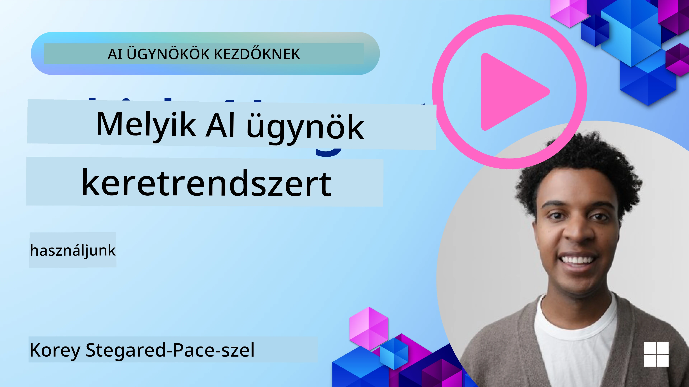

<!--
CO_OP_TRANSLATOR_METADATA:
{
  "original_hash": "7120197753abacc827b64ac2d5d6966f",
  "translation_date": "2025-11-13T13:39:33+00:00",
  "source_file": "02-explore-agentic-frameworks/README.md",
  "language_code": "hu"
}
-->
[](https://youtu.be/ODwF-EZo_O8?si=1xoy_B9RNQfrYdF7)

> _(Kattints a fenti képre a lecke videójának megtekintéséhez)_

# AI Ügynök Keretrendszerek Felfedezése

Az AI ügynök keretrendszerek olyan szoftverplatformok, amelyek célja az AI ügynökök létrehozásának, telepítésének és kezelésének egyszerűsítése. Ezek a keretrendszerek előre elkészített komponenseket, absztrakciókat és eszközöket biztosítanak a fejlesztők számára, amelyek megkönnyítik az összetett AI rendszerek fejlesztését.

Ezek a keretrendszerek segítenek a fejlesztőknek az alkalmazásaik egyedi aspektusaira összpontosítani azáltal, hogy szabványosított megközelítéseket kínálnak az AI ügynök fejlesztésének közös kihívásaira. Javítják a skálázhatóságot, az elérhetőséget és a hatékonyságot az AI rendszerek építésében.

## Bevezetés

Ez a lecke az alábbiakat tárgyalja:

- Mik azok az AI Ügynök Keretrendszerek, és mit tesznek lehetővé a fejlesztők számára?
- Hogyan használhatják a csapatok ezeket az ügynök képességeinek gyors prototípus-készítésére, iterálására és fejlesztésére?
- Milyen különbségek vannak a Microsoft által létrehozott <a href="https://aka.ms/ai-agents/autogen" target="_blank">AutoGen</a>, <a href="https://aka.ms/ai-agents-beginners/semantic-kernel" target="_blank">Semantic Kernel</a> és <a href="https://aka.ms/ai-agents-beginners/ai-agent-service" target="_blank">Azure AI Agent Service</a> keretrendszerek és eszközök között?
- Integrálhatom-e közvetlenül a meglévő Azure ökoszisztéma eszközeimet, vagy különálló megoldásokra van szükségem?
- Mi az Azure AI Agents szolgáltatás, és hogyan segít nekem?

## Tanulási célok

A lecke célja, hogy segítsen megérteni:

- Az AI Ügynök Keretrendszerek szerepét az AI fejlesztésben.
- Hogyan lehet kihasználni az AI Ügynök Keretrendszereket intelligens ügynökök építésére.
- Az AI Ügynök Keretrendszerek által lehetővé tett kulcsfontosságú képességeket.
- Az AutoGen, a Semantic Kernel és az Azure AI Agent Service közötti különbségeket.

## Mik azok az AI Ügynök Keretrendszerek, és mit tesznek lehetővé a fejlesztők számára?

A hagyományos AI keretrendszerek segíthetnek az AI integrálásában az alkalmazásokba, és az alábbi módokon javíthatják ezeket az alkalmazásokat:

- **Személyre szabás**: Az AI elemezheti a felhasználói viselkedést és preferenciákat, hogy személyre szabott ajánlásokat, tartalmakat és élményeket nyújtson.
Példa: A streaming szolgáltatások, mint például a Netflix, AI-t használnak filmek és sorozatok ajánlására a megtekintési előzmények alapján, növelve a felhasználói elköteleződést és elégedettséget.
- **Automatizálás és hatékonyság**: Az AI automatizálhatja az ismétlődő feladatokat, egyszerűsítheti a munkafolyamatokat, és javíthatja az operatív hatékonyságot.
Példa: Az ügyfélszolgálati alkalmazások AI-alapú chatbotokat használnak a gyakori kérdések kezelésére, csökkentve a válaszidőt és felszabadítva az emberi ügynököket az összetettebb problémákra.
- **Felhasználói élmény javítása**: Az AI javíthatja az általános felhasználói élményt intelligens funkciók, például hangfelismerés, természetes nyelvfeldolgozás és prediktív szöveg segítségével.
Példa: A virtuális asszisztensek, mint a Siri és a Google Assistant, AI-t használnak a hangutasítások megértésére és megválaszolására, megkönnyítve a felhasználók számára az eszközeikkel való interakciót.

### Ez mind nagyszerűen hangzik, de miért van szükségünk az AI Ügynök Keretrendszerre?

Az AI Ügynök keretrendszerek többek, mint egyszerű AI keretrendszerek. Ezeket úgy tervezték, hogy lehetővé tegyék intelligens ügynökök létrehozását, amelyek képesek interakcióba lépni a felhasználókkal, más ügynökökkel és a környezettel, hogy meghatározott célokat érjenek el. Ezek az ügynökök autonóm viselkedést mutathatnak, döntéseket hozhatnak, és alkalmazkodhatnak a változó körülményekhez. Nézzük meg az AI Ügynök Keretrendszerek által lehetővé tett kulcsfontosságú képességeket:

- **Ügynökök együttműködése és koordinációja**: Lehetővé teszi több AI ügynök létrehozását, amelyek együtt dolgozhatnak, kommunikálhatnak és koordinálhatják tevékenységeiket összetett feladatok megoldására.
- **Feladat automatizálás és kezelés**: Mechanizmusokat biztosít a több lépésből álló munkafolyamatok automatizálására, a feladatok delegálására és a dinamikus feladatkezelésre az ügynökök között.
- **Környezeti megértés és alkalmazkodás**: Képessé teszi az ügynököket a kontextus megértésére, a változó környezethez való alkalmazkodásra, és a valós idejű információk alapján történő döntéshozatalra.

Összefoglalva, az ügynökök lehetővé teszik, hogy többet érjünk el, az automatizálást a következő szintre emeljük, és intelligensebb rendszereket hozzunk létre, amelyek képesek alkalmazkodni és tanulni a környezetükből.

## Hogyan lehet gyorsan prototípust készíteni, iterálni és fejleszteni az ügynök képességeit?

Ez egy gyorsan változó terület, de van néhány közös elem a legtöbb AI Ügynök Keretrendszerben, amelyek segíthetnek a gyors prototípus-készítésben és iterációban, nevezetesen a moduláris komponensek, az együttműködési eszközök és a valós idejű tanulás. Nézzük meg ezeket részletesebben:

- **Használj moduláris komponenseket**: Az AI SDK-k előre elkészített komponenseket kínálnak, például AI és memória csatlakozókat, természetes nyelv vagy kód pluginok használatával történő funkcióhívásokat, prompt sablonokat és még sok mást.
- **Használj együttműködési eszközöket**: Tervezd meg az ügynököket specifikus szerepekkel és feladatokkal, lehetővé téve az együttműködési munkafolyamatok tesztelését és finomítását.
- **Tanulj valós időben**: Valósíts meg visszacsatolási hurkokat, ahol az ügynökök tanulnak az interakciókból, és dinamikusan igazítják viselkedésüket.

### Használj moduláris komponenseket

Az olyan SDK-k, mint a Microsoft Semantic Kernel és a LangChain, előre elkészített komponenseket kínálnak, például AI csatlakozókat, prompt sablonokat és memória kezelést.

**Hogyan használhatják ezeket a csapatok**: A csapatok gyorsan összeállíthatják ezeket a komponenseket, hogy működő prototípust hozzanak létre anélkül, hogy nulláról kellene kezdeniük, lehetővé téve a gyors kísérletezést és iterációt.

**Hogyan működik a gyakorlatban**: Használhatsz egy előre elkészített elemzőt a felhasználói bemenetből származó információk kinyerésére, egy memória modult az adatok tárolására és visszakeresésére, valamint egy prompt generátort a felhasználókkal való interakcióhoz, mindezt anélkül, hogy ezeket a komponenseket nulláról kellene felépítened.

**Példa kód**. Nézzünk meg példákat arra, hogyan használhatsz egy előre elkészített AI csatlakozót a Semantic Kernel Python és .Net segítségével, amely automatikus funkcióhívást használ a modell felhasználói bemenetre adott válaszához:

``` python
# Semantic Kernel Python Example

import asyncio
from typing import Annotated

from semantic_kernel.connectors.ai import FunctionChoiceBehavior
from semantic_kernel.connectors.ai.open_ai import AzureChatCompletion, AzureChatPromptExecutionSettings
from semantic_kernel.contents import ChatHistory
from semantic_kernel.functions import kernel_function
from semantic_kernel.kernel import Kernel

# Define a ChatHistory object to hold the conversation's context
chat_history = ChatHistory()
chat_history.add_user_message("I'd like to go to New York on January 1, 2025")


# Define a sample plugin that contains the function to book travel
class BookTravelPlugin:
    """A Sample Book Travel Plugin"""

    @kernel_function(name="book_flight", description="Book travel given location and date")
    async def book_flight(
        self, date: Annotated[str, "The date of travel"], location: Annotated[str, "The location to travel to"]
    ) -> str:
        return f"Travel was booked to {location} on {date}"

# Create the Kernel
kernel = Kernel()

# Add the sample plugin to the Kernel object
kernel.add_plugin(BookTravelPlugin(), plugin_name="book_travel")

# Define the Azure OpenAI AI Connector
chat_service = AzureChatCompletion(
    deployment_name="YOUR_DEPLOYMENT_NAME", 
    api_key="YOUR_API_KEY", 
    endpoint="https://<your-resource>.azure.openai.com/",
)

# Define the request settings to configure the model with auto-function calling
request_settings = AzureChatPromptExecutionSettings(function_choice_behavior=FunctionChoiceBehavior.Auto())


async def main():
    # Make the request to the model for the given chat history and request settings
    # The Kernel contains the sample that the model will request to invoke
    response = await chat_service.get_chat_message_content(
        chat_history=chat_history, settings=request_settings, kernel=kernel
    )
    assert response is not None

    """
    Note: In the auto function calling process, the model determines it can invoke the 
    `BookTravelPlugin` using the `book_flight` function, supplying the necessary arguments. 
    
    For example:

    "tool_calls": [
        {
            "id": "call_abc123",
            "type": "function",
            "function": {
                "name": "BookTravelPlugin-book_flight",
                "arguments": "{'location': 'New York', 'date': '2025-01-01'}"
            }
        }
    ]

    Since the location and date arguments are required (as defined by the kernel function), if the 
    model lacks either, it will prompt the user to provide them. For instance:

    User: Book me a flight to New York.
    Model: Sure, I'd love to help you book a flight. Could you please specify the date?
    User: I want to travel on January 1, 2025.
    Model: Your flight to New York on January 1, 2025, has been successfully booked. Safe travels!
    """

    print(f"`{response}`")
    # Example AI Model Response: `Your flight to New York on January 1, 2025, has been successfully booked. Safe travels! ✈️🗽`

    # Add the model's response to our chat history context
    chat_history.add_assistant_message(response.content)


if __name__ == "__main__":
    asyncio.run(main())
```
```csharp
// Semantic Kernel C# example

using Microsoft.SemanticKernel;
using Microsoft.SemanticKernel.ChatCompletion;
using System.ComponentModel;
using Microsoft.SemanticKernel.Connectors.AzureOpenAI;

ChatHistory chatHistory = [];
chatHistory.AddUserMessage("I'd like to go to New York on January 1, 2025");

var kernelBuilder = Kernel.CreateBuilder();
kernelBuilder.AddAzureOpenAIChatCompletion(
    deploymentName: "NAME_OF_YOUR_DEPLOYMENT",
    apiKey: "YOUR_API_KEY",
    endpoint: "YOUR_AZURE_ENDPOINT"
);
kernelBuilder.Plugins.AddFromType<BookTravelPlugin>("BookTravel"); 
var kernel = kernelBuilder.Build();

var settings = new AzureOpenAIPromptExecutionSettings()
{
    FunctionChoiceBehavior = FunctionChoiceBehavior.Auto()
};

var chatCompletion = kernel.GetRequiredService<IChatCompletionService>();

var response = await chatCompletion.GetChatMessageContentAsync(chatHistory, settings, kernel);

/*
Behind the scenes, the model recognizes the tool to call, what arguments it already has (location) and (date)
{

"tool_calls": [
    {
        "id": "call_abc123",
        "type": "function",
        "function": {
            "name": "BookTravelPlugin-book_flight",
            "arguments": "{'location': 'New York', 'date': '2025-01-01'}"
        }
    }
]
*/

Console.WriteLine(response.Content);
chatHistory.AddMessage(response!.Role, response!.Content!);

// Example AI Model Response: Your flight to New York on January 1, 2025, has been successfully booked. Safe travels! ✈️🗽

// Define a plugin that contains the function to book travel
public class BookTravelPlugin
{
    [KernelFunction("book_flight")]
    [Description("Book travel given location and date")]
    public async Task<string> BookFlight(DateTime date, string location)
    {
        return await Task.FromResult( $"Travel was booked to {location} on {date}");
    }
}
```

A példából látható, hogyan használhatsz egy előre elkészített elemzőt a felhasználói bemenetből származó kulcsfontosságú információk kinyerésére, például egy repülőjegy foglalási kérés kiindulási helyére, célállomására és dátumára. Ez a moduláris megközelítés lehetővé teszi, hogy a magas szintű logikára összpontosíts.

### Használj együttműködési eszközöket

Az olyan keretrendszerek, mint a CrewAI, a Microsoft AutoGen és a Semantic Kernel, megkönnyítik több ügynök létrehozását, amelyek együtt dolgozhatnak.

**Hogyan használhatják ezeket a csapatok**: A csapatok specifikus szerepekkel és feladatokkal rendelkező ügynököket tervezhetnek, lehetővé téve az együttműködési munkafolyamatok tesztelését és finomítását, valamint az általános rendszerhatékonyság javítását.

**Hogyan működik a gyakorlatban**: Létrehozhatsz egy ügynökcsapatot, ahol minden ügynöknek specializált funkciója van, például adatlekérés, elemzés vagy döntéshozatal. Ezek az ügynökök kommunikálhatnak és megoszthatják az információkat, hogy közös célt érjenek el, például válaszoljanak egy felhasználói kérdésre vagy teljesítsenek egy feladatot.

**Példa kód (AutoGen)**:

```python
# creating agents, then create a round robin schedule where they can work together, in this case in order

# Data Retrieval Agent
# Data Analysis Agent
# Decision Making Agent

agent_retrieve = AssistantAgent(
    name="dataretrieval",
    model_client=model_client,
    tools=[retrieve_tool],
    system_message="Use tools to solve tasks."
)

agent_analyze = AssistantAgent(
    name="dataanalysis",
    model_client=model_client,
    tools=[analyze_tool],
    system_message="Use tools to solve tasks."
)

# conversation ends when user says "APPROVE"
termination = TextMentionTermination("APPROVE")

user_proxy = UserProxyAgent("user_proxy", input_func=input)

team = RoundRobinGroupChat([agent_retrieve, agent_analyze, user_proxy], termination_condition=termination)

stream = team.run_stream(task="Analyze data", max_turns=10)
# Use asyncio.run(...) when running in a script.
await Console(stream)
```

Az előző kódban látható, hogyan hozhatsz létre egy feladatot, amely több ügynök együttműködését igényli az adatok elemzéséhez. Minden ügynök egy specifikus funkciót lát el, és a feladatot az ügynökök koordinálásával hajtják végre a kívánt eredmény elérése érdekében. Azáltal, hogy dedikált, specializált szerepekkel rendelkező ügynököket hozol létre, javíthatod a feladat hatékonyságát és teljesítményét.

### Tanulj valós időben

A fejlett keretrendszerek valós idejű kontextus megértési és alkalmazkodási képességeket biztosítanak.

**Hogyan használhatják ezeket a csapatok**: A csapatok visszacsatolási hurkokat valósíthatnak meg, ahol az ügynökök tanulnak az interakciókból, és dinamikusan igazítják viselkedésüket, ami folyamatos fejlesztéshez és képességeik finomításához vezet.

**Hogyan működik a gyakorlatban**: Az ügynökök elemezhetik a felhasználói visszajelzéseket, a környezeti adatokat és a feladatok eredményeit, hogy frissítsék tudásbázisukat, módosítsák döntéshozatali algoritmusaikat, és idővel javítsák teljesítményüket. Ez az iteratív tanulási folyamat lehetővé teszi az ügynökök számára, hogy alkalmazkodjanak a változó körülményekhez és felhasználói preferenciákhoz, növelve az általános rendszerhatékonyságot.

## Milyen különbségek vannak az AutoGen, a Semantic Kernel és az Azure AI Agent Service keretrendszerek között?

Számos módon összehasonlíthatjuk ezeket a keretrendszereket, de nézzük meg a legfontosabb különbségeket a tervezésük, képességeik és célfelhasználási eseteik szempontjából:

## AutoGen

Az AutoGen egy nyílt forráskódú keretrendszer, amelyet a Microsoft Research AI Frontiers Lab fejlesztett ki. Az eseményvezérelt, elosztott *agentic* alkalmazásokra összpontosít, lehetővé téve több LLM és SLM, eszközök és fejlett többügynökös tervezési minták használatát.

Az AutoGen az ügynökök alapfogalmára épül, amelyek autonóm entitások, amelyek érzékelhetik környezetüket, döntéseket hozhatnak, és cselekedhetnek meghatározott célok elérése érdekében. Az ügynökök aszinkron üzeneteken keresztül kommunikálnak, lehetővé téve számukra, hogy függetlenül és párhuzamosan dolgozzanak, növelve a rendszer skálázhatóságát és válaszkészségét.

<a href="https://en.wikipedia.org/wiki/Actor_model" target="_blank">Az ügynökök az aktor modellre épülnek</a>. A Wikipédia szerint az aktor _a párhuzamos számítás alapvető építőköve. Egy üzenetre válaszul az aktor képes: helyi döntéseket hozni, további aktorokat létrehozni, több üzenetet küldeni, és meghatározni, hogyan reagáljon a következő beérkező üzenetre_.

**Felhasználási esetek**: Kódgenerálás automatizálása, adatelemzési feladatok, és egyedi ügynökök létrehozása tervezési és kutatási funkciókhoz.

Az AutoGen néhány fontos alapfogalma:

- **Ügynökök**. Egy ügynök egy szoftver entitás, amely:
  - **Üzeneteken keresztül kommunikál**, ezek az üzenetek lehetnek szinkronok vagy aszinkronok.
  - **Fenntartja saját állapotát**, amelyet a beérkező üzenetek módosíthatnak.
  - **Cselekvéseket hajt végre** a kapott üzenetekre vagy állapotának változásaira reagálva. Ezek a cselekvések módosíthatják az ügynök állapotát, és külső hatásokat eredményezhetnek, például üzenetnaplók frissítését, új üzenetek küldését, kód végrehajtását vagy API-hívások végrehajtását.
    
  Itt van egy rövid kódrészlet, amelyben létrehozod saját ügynöködet csevegési képességekkel:

    ```python
    from autogen_agentchat.agents import AssistantAgent
    from autogen_agentchat.messages import TextMessage
    from autogen_ext.models.openai import OpenAIChatCompletionClient


    class MyAgent(RoutedAgent):
        def __init__(self, name: str) -> None:
            super().__init__(name)
            model_client = OpenAIChatCompletionClient(model="gpt-4o")
            self._delegate = AssistantAgent(name, model_client=model_client)
    
        @message_handler
        async def handle_my_message_type(self, message: MyMessageType, ctx: MessageContext) -> None:
            print(f"{self.id.type} received message: {message.content}")
            response = await self._delegate.on_messages(
                [TextMessage(content=message.content, source="user")], ctx.cancellation_token
            )
            print(f"{self.id.type} responded: {response.chat_message.content}")
    ```
    
    Az előző kódban létrehoztuk a `MyAgent` ügynököt, amely örököl a `RoutedAgent` osztályból. Van egy üzenetkezelője, amely kinyomtatja az üzenet tartalmát, majd választ küld az `AssistantAgent` delegált segítségével. Különösen figyelj arra, hogy a `self._delegate`-hez hozzárendelünk egy `AssistantAgent` példányt, amely egy előre elkészített ügynök, amely képes csevegési kiegészítéseket kezelni.

    Indítsuk el az AutoGen-t, hogy tudjon erről az ügynöktípusról, és indítsuk el a programot:

    ```python
    
    # main.py
    runtime = SingleThreadedAgentRuntime()
    await MyAgent.register(runtime, "my_agent", lambda: MyAgent())

    runtime.start()  # Start processing messages in the background.
    await runtime.send_message(MyMessageType("Hello, World!"), AgentId("my_agent", "default"))
    ```

    Az előző kódban az ügynököket regisztráltuk a futtatási környezetben, majd egy üzenetet küldtünk az ügynöknek, amely az alábbi kimenetet eredményezte:

    ```text
    # Output from the console:
    my_agent received message: Hello, World!
    my_assistant received message: Hello, World!
    my_assistant responded: Hello! How can I assist you today?
    ```

- **Több ügynök**. Az AutoGen támogatja több ügynök létrehozását, amelyek együtt dolgozhatnak összetett feladatok elvégzésére. Az ügynökök kommunikálhatnak, megoszthatják az információkat, és koordinálhatják tevékenységeiket a problémák hatékonyabb megoldása érdek
Ezeket az információkat a `SummarizedAzureDocs` memóriagyűjteményben tároljuk. Ez egy nagyon leegyszerűsített példa, de látható, hogyan lehet információkat tárolni a memóriában, hogy az LLM felhasználhassa.

Tehát ezek a Semantic Kernel keretrendszer alapjai, de mi a helyzet az Agent Frameworkkel?

## Azure AI Agent Service

Az Azure AI Agent Service egy újabb fejlesztés, amelyet a Microsoft Ignite 2024-en mutattak be. Lehetővé teszi AI ügynökök fejlesztését és telepítését rugalmasabb modellekkel, például nyílt forráskódú LLM-ek, mint a Llama 3, Mistral és Cohere közvetlen hívásával.

Az Azure AI Agent Service erősebb vállalati biztonsági mechanizmusokat és adatkezelési módszereket kínál, így ideális vállalati alkalmazásokhoz.

Alapértelmezés szerint működik többügynökös koordinációs keretrendszerekkel, mint az AutoGen és a Semantic Kernel.

Ez a szolgáltatás jelenleg nyilvános előzetes verzióban érhető el, és Python és C# nyelveken támogatja az ügynökök fejlesztését.

A Semantic Kernel Python segítségével létrehozhatunk egy Azure AI ügynököt egy felhasználó által definiált bővítménnyel:

```python
import asyncio
from typing import Annotated

from azure.identity.aio import DefaultAzureCredential

from semantic_kernel.agents import AzureAIAgent, AzureAIAgentSettings, AzureAIAgentThread
from semantic_kernel.contents import ChatMessageContent
from semantic_kernel.contents import AuthorRole
from semantic_kernel.functions import kernel_function


# Define a sample plugin for the sample
class MenuPlugin:
    """A sample Menu Plugin used for the concept sample."""

    @kernel_function(description="Provides a list of specials from the menu.")
    def get_specials(self) -> Annotated[str, "Returns the specials from the menu."]:
        return """
        Special Soup: Clam Chowder
        Special Salad: Cobb Salad
        Special Drink: Chai Tea
        """

    @kernel_function(description="Provides the price of the requested menu item.")
    def get_item_price(
        self, menu_item: Annotated[str, "The name of the menu item."]
    ) -> Annotated[str, "Returns the price of the menu item."]:
        return "$9.99"


async def main() -> None:
    ai_agent_settings = AzureAIAgentSettings.create()

    async with (
        DefaultAzureCredential() as creds,
        AzureAIAgent.create_client(
            credential=creds,
            conn_str=ai_agent_settings.project_connection_string.get_secret_value(),
        ) as client,
    ):
        # Create agent definition
        agent_definition = await client.agents.create_agent(
            model=ai_agent_settings.model_deployment_name,
            name="Host",
            instructions="Answer questions about the menu.",
        )

        # Create the AzureAI Agent using the defined client and agent definition
        agent = AzureAIAgent(
            client=client,
            definition=agent_definition,
            plugins=[MenuPlugin()],
        )

        # Create a thread to hold the conversation
        # If no thread is provided, a new thread will be
        # created and returned with the initial response
        thread: AzureAIAgentThread | None = None

        user_inputs = [
            "Hello",
            "What is the special soup?",
            "How much does that cost?",
            "Thank you",
        ]

        try:
            for user_input in user_inputs:
                print(f"# User: '{user_input}'")
                # Invoke the agent for the specified thread
                response = await agent.get_response(
                    messages=user_input,
                    thread_id=thread,
                )
                print(f"# {response.name}: {response.content}")
                thread = response.thread
        finally:
            await thread.delete() if thread else None
            await client.agents.delete_agent(agent.id)


if __name__ == "__main__":
    asyncio.run(main())
```

### Alapfogalmak

Az Azure AI Agent Service az alábbi alapfogalmakkal rendelkezik:

- **Ügynök**. Az Azure AI Agent Service integrálódik az Azure AI Foundry-val. Az AI Foundry-n belül egy AI ügynök egy "intelligens" mikroszolgáltatásként működik, amely képes kérdések megválaszolására (RAG), műveletek végrehajtására vagy teljes munkafolyamatok automatizálására. Ezt úgy éri el, hogy a generatív AI modellek erejét ötvözi olyan eszközökkel, amelyek lehetővé teszik a valós adatforrások elérését és kezelését. Íme egy példa egy ügynökre:

    ```python
    agent = project_client.agents.create_agent(
        model="gpt-4o-mini",
        name="my-agent",
        instructions="You are helpful agent",
        tools=code_interpreter.definitions,
        tool_resources=code_interpreter.resources,
    )
    ```

    Ebben a példában egy ügynök jön létre a `gpt-4o-mini` modellel, `my-agent` névvel és `You are helpful agent` utasításokkal. Az ügynök eszközökkel és erőforrásokkal van felszerelve, hogy kódértelmezési feladatokat hajtson végre.

- **Szál és üzenetek**. A szál egy másik fontos fogalom. Ez egy ügynök és egy felhasználó közötti beszélgetést vagy interakciót képvisel. A szálak használhatók a beszélgetés előrehaladásának nyomon követésére, kontextus információk tárolására és az interakció állapotának kezelésére. Íme egy példa egy szálra:

    ```python
    thread = project_client.agents.create_thread()
    message = project_client.agents.create_message(
        thread_id=thread.id,
        role="user",
        content="Could you please create a bar chart for the operating profit using the following data and provide the file to me? Company A: $1.2 million, Company B: $2.5 million, Company C: $3.0 million, Company D: $1.8 million",
    )
    
    # Ask the agent to perform work on the thread
    run = project_client.agents.create_and_process_run(thread_id=thread.id, agent_id=agent.id)
    
    # Fetch and log all messages to see the agent's response
    messages = project_client.agents.list_messages(thread_id=thread.id)
    print(f"Messages: {messages}")
    ```

    Az előző kódban egy szál jön létre. Ezután egy üzenet kerül elküldésre a szálra. A `create_and_process_run` hívásával az ügynököt arra kérik, hogy végezzen munkát a szálon. Végül az üzeneteket lekérdezik és naplózzák, hogy lássák az ügynök válaszát. Az üzenetek a felhasználó és az ügynök közötti beszélgetés előrehaladását jelzik. Fontos megérteni, hogy az üzenetek különböző típusúak lehetnek, például szöveg, kép vagy fájl, amely az ügynök munkájának eredménye, például egy kép vagy szöveges válasz. Fejlesztőként ezeket az információkat felhasználhatja a válasz további feldolgozására vagy a felhasználónak való bemutatására.

- **Integráció más AI keretrendszerekkel**. Az Azure AI Agent Service képes más keretrendszerekkel, például az AutoGen és a Semantic Kernel keretrendszerekkel való interakcióra, ami azt jelenti, hogy az alkalmazás egy részét ezekben a keretrendszerekben építheti fel, például az Agent Service-t használva koordinátorként, vagy mindent az Agent Service-ben építhet.

**Felhasználási esetek**: Az Azure AI Agent Service-t olyan vállalati alkalmazásokhoz tervezték, amelyek biztonságos, skálázható és rugalmas AI ügynök telepítést igényelnek.

## Mi a különbség ezek között a keretrendszerek között?

Úgy tűnhet, hogy ezek a keretrendszerek sok átfedést mutatnak, de vannak kulcsfontosságú különbségek a tervezésük, képességeik és célfelhasználási eseteik tekintetében:

- **AutoGen**: Egy kísérleti keretrendszer, amely a többügynökös rendszerek élvonalbeli kutatására összpontosít. Ez a legjobb hely a kifinomult többügynökös rendszerek kísérletezésére és prototípusának elkészítésére.
- **Semantic Kernel**: Egy gyártásra kész ügynöki könyvtár vállalati ügynöki alkalmazások építéséhez. Az eseményvezérelt, elosztott ügynöki alkalmazásokra összpontosít, lehetővé téve több LLM és SLM, eszközök, valamint egy- és többügynökös tervezési minták használatát.
- **Azure AI Agent Service**: Egy platform és telepítési szolgáltatás az Azure Foundry-ban ügynökök számára. Lehetőséget nyújt az Azure által támogatott szolgáltatások, például az Azure OpenAI, Azure AI Search, Bing Search és kódvégrehajtás csatlakoztatására.

Még mindig nem biztos benne, melyiket válassza?

### Felhasználási esetek

Nézzük meg, segíthetünk-e néhány gyakori felhasználási eset áttekintésével:

> K: Kísérletezek, tanulok és proof-of-concept ügynöki alkalmazásokat építek, és gyorsan szeretnék építeni és kísérletezni.
>

> V: Az AutoGen jó választás lenne erre az esetre, mivel az eseményvezérelt, elosztott ügynöki alkalmazásokra összpontosít, és támogatja a fejlett többügynökös tervezési mintákat.

> K: Miért jobb választás az AutoGen, mint a Semantic Kernel és az Azure AI Agent Service ebben az esetben?
>
> V: Az AutoGen kifejezetten az eseményvezérelt, elosztott ügynöki alkalmazásokhoz készült, így jól alkalmazható kódgenerálási és adat-elemzési feladatok automatizálására. Megadja a szükséges eszközöket és képességeket a komplex többügynökös rendszerek hatékony felépítéséhez.

> K: Úgy tűnik, az Azure AI Agent Service is működhet itt, hiszen vannak eszközei kódgeneráláshoz és más feladatokhoz is?
>
> V: Igen, az Azure AI Agent Service egy platformszolgáltatás ügynökök számára, és beépített képességeket kínál több modellhez, Azure AI Search-hez, Bing Search-hez és Azure Functions-höz. Könnyűvé teszi az ügynökök építését a Foundry Portálon és azok skálázott telepítését.

> K: Még mindig zavaros, csak adj egy opciót.
>
> V: Egy nagyszerű választás az, ha először a Semantic Kernel-ben építi meg az alkalmazását, majd az Azure AI Agent Service-t használja az ügynök telepítéséhez. Ez a megközelítés lehetővé teszi, hogy könnyen megőrizze az ügynökeit, miközben kihasználja a Semantic Kernel-ben történő többügynökös rendszerek építésének erejét. Ezenkívül a Semantic Kernel rendelkezik egy csatlakozóval az AutoGen-ben, így könnyen használhatja mindkét keretrendszert együtt.

Foglaljuk össze a kulcsfontosságú különbségeket egy táblázatban:

| Keretrendszer | Fókusz | Alapfogalmak | Felhasználási esetek |
| --- | --- | --- | --- |
| AutoGen | Eseményvezérelt, elosztott ügynöki alkalmazások | Ügynökök, Személyiségek, Funkciók, Adatok | Kódgenerálás, adat-elemzési feladatok |
| Semantic Kernel | Emberi szöveg megértése és generálása | Ügynökök, Moduláris komponensek, Együttműködés | Természetes nyelv megértése, tartalomgenerálás |
| Azure AI Agent Service | Rugalmas modellek, vállalati biztonság, Kódgenerálás, Eszközhasználat | Modularitás, Együttműködés, Folyamat-vezérlés | Biztonságos, skálázható és rugalmas AI ügynök telepítés |

Mi az ideális felhasználási eset mindegyik keretrendszerhez?

## Integrálhatom közvetlenül a meglévő Azure ökoszisztéma eszközeimet, vagy különálló megoldásokra van szükségem?

A válasz igen, közvetlenül integrálhatja meglévő Azure ökoszisztéma eszközeit, különösen az Azure AI Agent Service-szel, mivel ezt úgy tervezték, hogy zökkenőmentesen működjön más Azure szolgáltatásokkal. Például integrálhatja a Binget, az Azure AI Search-t és az Azure Functions-t. Mély integráció is elérhető az Azure AI Foundry-val.

Az AutoGen és a Semantic Kernel esetében szintén integrálhat az Azure szolgáltatásokkal, de ehhez szükség lehet arra, hogy a kódjából hívja az Azure szolgáltatásokat. Egy másik mód az Azure SDK-k használata az Azure szolgáltatásokkal való interakcióhoz az ügynökeiből. Továbbá, ahogy említettük, az Azure AI Agent Service-t használhatja koordinátorként az AutoGen-ben vagy a Semantic Kernel-ben épített ügynökeihez, ami egyszerű hozzáférést biztosít az Azure ökoszisztémához.

## Példakódok

- Python: [Agent Framework](./code_samples/02-python-agent-framework.ipynb)
- .NET: [Agent Framework](./code_samples/02-dotnet-agent-framework.md)

## További kérdései vannak az AI Agent Frameworkökkel kapcsolatban?

Csatlakozzon az [Azure AI Foundry Discord](https://aka.ms/ai-agents/discord) közösséghez, hogy találkozzon más tanulókkal, részt vegyen konzultációkon, és választ kapjon az AI ügynökökkel kapcsolatos kérdéseire.

## Hivatkozások

- <a href="https://techcommunity.microsoft.com/blog/azure-ai-services-blog/introducing-azure-ai-agent-service/4298357" target="_blank">Azure Agent Service</a>
- <a href="https://devblogs.microsoft.com/semantic-kernel/microsofts-agentic-ai-frameworks-autogen-and-semantic-kernel/" target="_blank">Semantic Kernel és AutoGen</a>
- <a href="https://learn.microsoft.com/semantic-kernel/frameworks/agent/?pivots=programming-language-python" target="_blank">Semantic Kernel Python Agent Framework</a>
- <a href="https://learn.microsoft.com/semantic-kernel/frameworks/agent/?pivots=programming-language-csharp" target="_blank">Semantic Kernel .Net Agent Framework</a>
- <a href="https://learn.microsoft.com/azure/ai-services/agents/overview" target="_blank">Azure AI Agent Service</a>
- <a href="https://techcommunity.microsoft.com/blog/educatordeveloperblog/using-azure-ai-agent-service-with-autogen--semantic-kernel-to-build-a-multi-agen/4363121" target="_blank">Azure AI Agent Service használata AutoGen-nel / Semantic Kernel-lel többügynökös megoldás építéséhez</a>

## Előző lecke

[Bevezetés az AI ügynökökbe és felhasználási eseteikbe](../01-intro-to-ai-agents/README.md)

## Következő lecke

[Ügynöki tervezési minták megértése](../03-agentic-design-patterns/README.md)

---

<!-- CO-OP TRANSLATOR DISCLAIMER START -->
**Felelősségi nyilatkozat**:  
Ez a dokumentum az AI fordítási szolgáltatás [Co-op Translator](https://github.com/Azure/co-op-translator) segítségével lett lefordítva. Bár törekszünk a pontosságra, kérjük, vegye figyelembe, hogy az automatikus fordítások hibákat vagy pontatlanságokat tartalmazhatnak. Az eredeti dokumentum az eredeti nyelvén tekintendő hiteles forrásnak. Kritikus információk esetén javasolt professzionális emberi fordítást igénybe venni. Nem vállalunk felelősséget semmilyen félreértésért vagy téves értelmezésért, amely a fordítás használatából eredhet.
<!-- CO-OP TRANSLATOR DISCLAIMER END -->