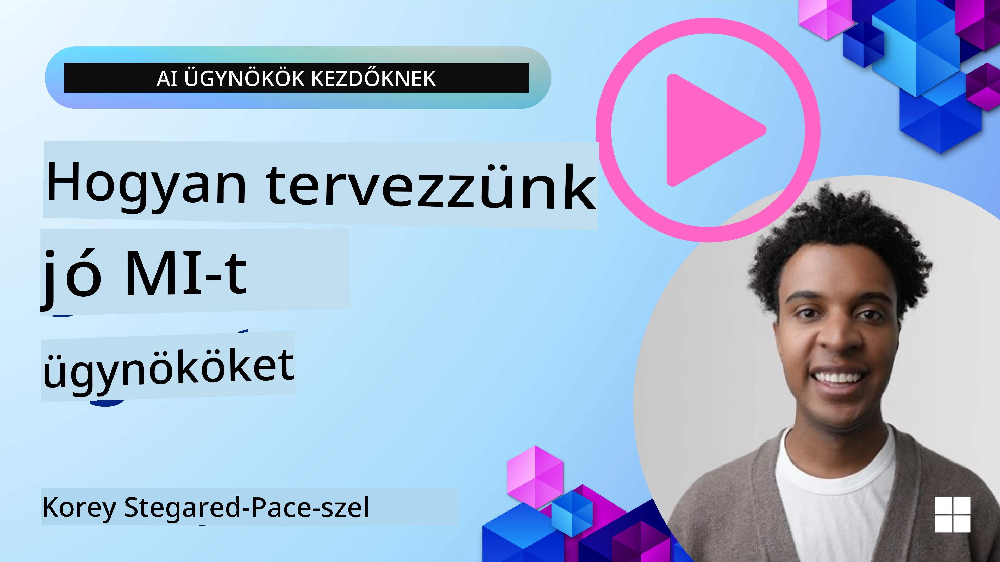
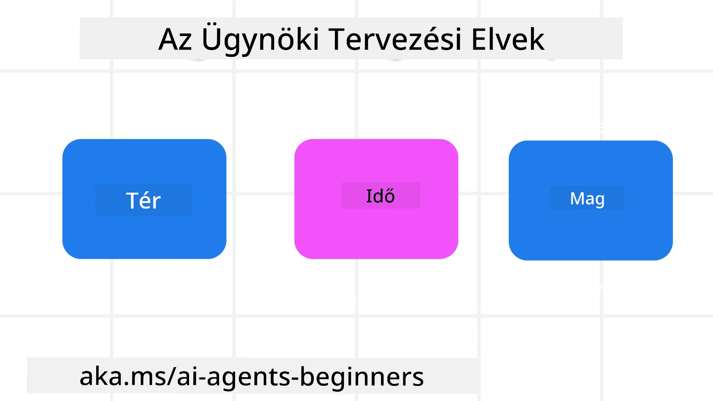

<!--
CO_OP_TRANSLATOR_METADATA:
{
  "original_hash": "d71524fe83a23829ae7a23b4031aaac8",
  "translation_date": "2025-11-13T13:43:19+00:00",
  "source_file": "03-agentic-design-patterns/README.md",
  "language_code": "hu"
}
-->

> _(Kattints a fenti képre a videó megtekintéséhez)_
# AI Ügynöki Tervezési Elvek

## Bevezetés

Számos módja van annak, hogy AI ügynöki rendszereket építsünk. Mivel a generatív AI tervezésében a kétértelműség inkább jellemző, mint hiba, néha nehéz az mérnököknek eldönteni, hol kezdjék el. Létrehoztunk egy emberközpontú UX tervezési elvek készletét, amely lehetővé teszi a fejlesztők számára, hogy ügyfélközpontú ügynöki rendszereket építsenek üzleti igényeik megoldására. Ezek a tervezési elvek nem előíró architektúrák, hanem kiindulópontként szolgálnak azoknak a csapatoknak, akik ügynöki élményeket definiálnak és építenek.

Általánosságban az ügynököknek a következőket kell tenniük:

- Bővíteni és skálázni az emberi képességeket (ötletelés, problémamegoldás, automatizálás stb.)
- Kitölteni a tudásbeli hiányosságokat (gyorsan képbe hozni tudományterületekről, fordítás stb.)
- Elősegíteni és támogatni az együttműködést az általunk preferált módokon, ahogyan másokkal dolgozunk
- Jobb verzióinkká tenni minket (pl. életvezetési tanácsadó/feladatkezelő, segítve az érzelmi szabályozás és tudatossági készségek elsajátítását, ellenálló képesség építése stb.)

## Ebben a leckében szó lesz

- Mik az ügynöki tervezési elvek
- Milyen irányelveket kell követni ezeknek az elveknek a megvalósítása során
- Példák az elvek alkalmazására

## Tanulási célok

A lecke elvégzése után képes leszel:

1. Elmagyarázni, mik az ügynöki tervezési elvek
2. Elmagyarázni az ügynöki tervezési elvek használatának irányelveit
3. Megérteni, hogyan lehet ügynököt építeni az ügynöki tervezési elvek alapján

## Az ügynöki tervezési elvek

### Ügynök (Tér)

Ez az a környezet, amelyben az ügynök működik. Ezek az elvek azt határozzák meg, hogyan tervezzük az ügynököket a fizikai és digitális világokban való részvételre.

- **Kapcsolódás, nem összeomlás** – segít összekapcsolni embereket más emberekkel, eseményekkel és cselekvésre alkalmas tudással az együttműködés és kapcsolódás érdekében.
- Az ügynökök segítenek összekapcsolni eseményeket, tudást és embereket.
- Az ügynökök közelebb hozzák az embereket egymáshoz. Nem arra tervezték őket, hogy helyettesítsék vagy lekicsinyeljék az embereket.
- **Könnyen elérhető, mégis időnként láthatatlan** – az ügynök nagyrészt a háttérben működik, és csak akkor figyelmeztet minket, amikor releváns és megfelelő.
  - Az ügynök könnyen felfedezhető és elérhető az engedélyezett felhasználók számára bármilyen eszközön vagy platformon.
  - Az ügynök támogatja a multimodális bemeneteket és kimeneteket (hang, beszéd, szöveg stb.).
  - Az ügynök zökkenőmentesen vált a háttér és az előtér között; a proaktív és reaktív működés között, a felhasználói igények érzékelése alapján.
  - Az ügynök működhet láthatatlan formában, de háttérfolyamata és más ügynökökkel való együttműködése átlátható és a felhasználó által irányítható.

### Ügynök (Idő)

Ez az, ahogyan az ügynök az idő múlásával működik. Ezek az elvek azt határozzák meg, hogyan tervezzük az ügynököket, amelyek a múlt, jelen és jövő között lépnek kapcsolatba.

- **Múlt**: Visszatekintés a történetre, amely magában foglalja az állapotot és a kontextust.
  - Az ügynök relevánsabb eredményeket nyújt a gazdagabb történelmi adatok elemzése alapján, nem csak az események, emberek vagy állapotok alapján.
  - Az ügynök kapcsolatokat hoz létre múltbeli eseményekből, és aktívan reflektál az emlékezetre, hogy a jelenlegi helyzetekkel foglalkozzon.
- **Most**: Többet nyújt, mint értesítést.
  - Az ügynök átfogó megközelítést képvisel az emberekkel való interakcióban. Amikor egy esemény történik, az ügynök túllép a statikus értesítéseken vagy más statikus formalitásokon. Az ügynök egyszerűsítheti a folyamatokat vagy dinamikusan generálhat jelzéseket, hogy a felhasználó figyelmét a megfelelő pillanatban irányítsa.
  - Az ügynök információt nyújt a kontextuális környezet, társadalmi és kulturális változások alapján, és a felhasználói szándékhoz igazítva.
  - Az ügynök interakciója fokozatos lehet, fejlődhet/komplexebbé válhat, hogy hosszú távon támogassa a felhasználókat.
- **Jövő**: Alkalmazkodás és fejlődés.
  - Az ügynök alkalmazkodik különböző eszközökhöz, platformokhoz és modalitásokhoz.
  - Az ügynök alkalmazkodik a felhasználói viselkedéshez, hozzáférhetőségi igényekhez, és szabadon testreszabható.
  - Az ügynök a folyamatos felhasználói interakció révén formálódik és fejlődik.

### Ügynök (Mag)

Ezek az ügynök tervezésének kulcselemei.

- **Fogadd el a bizonytalanságot, de építs bizalmat**.
  - Az ügynök bizonyos szintű bizonytalansága várható. A bizonytalanság az ügynök tervezésének kulcseleme.
  - A bizalom és átláthatóság az ügynök tervezésének alapvető rétegei.
  - Az emberek irányítják, hogy az ügynök be van-e kapcsolva vagy ki van kapcsolva, és az ügynök állapota mindig egyértelműen látható.

## Az elvek megvalósításának irányelvei

Az előző tervezési elvek használatakor kövesd az alábbi irányelveket:

1. **Átláthatóság**: Tájékoztasd a felhasználót arról, hogy AI van jelen, hogyan működik (beleértve a múltbeli tevékenységeket), és hogyan adhat visszajelzést, illetve módosíthatja a rendszert.
2. **Irányítás**: Tedd lehetővé a felhasználó számára, hogy testreszabja, megadja preferenciáit és személyre szabja, valamint irányítsa a rendszert és annak attribútumait (beleértve a felejtés lehetőségét).
3. **Konzisztencia**: Törekedj következetes, multimodális élményekre az eszközök és végpontok között. Használj ismerős UI/UX elemeket, ahol lehetséges (pl. mikrofon ikon a hanginterakcióhoz), és csökkentsd a felhasználó kognitív terhelését, amennyire csak lehet (pl. törekedj tömör válaszokra, vizuális segédeszközökre és „Tudj meg többet” tartalomra).

## Hogyan tervezzünk utazási ügynököt ezekkel az elvekkel és irányelvekkel

Képzeld el, hogy egy utazási ügynököt tervezel, itt van, hogyan gondolkodhatnál az elvek és irányelvek alkalmazásáról:

1. **Átláthatóság** – Tájékoztasd a felhasználót arról, hogy az utazási ügynök egy AI-alapú ügynök. Adj néhány alapvető utasítást a kezdéshez (pl. egy „Hello” üzenet, mintapéldák). Dokumentáld ezt egyértelműen a termékoldalon. Mutasd meg a felhasználó által korábban feltett kérdések listáját. Tedd egyértelművé, hogyan adhat visszajelzést (például „Tetszik” és „Nem tetszik” gombok, „Küldj visszajelzést” gomb stb.). Egyértelműen fogalmazd meg, ha az ügynöknek vannak használati vagy témakör korlátozásai.
2. **Irányítás** – Tedd egyértelművé, hogyan módosíthatja a felhasználó az ügynököt, miután létrehozta, például a rendszeres promptokkal. Tedd lehetővé a felhasználó számára, hogy kiválassza, mennyire legyen részletes az ügynök, milyen stílusban írjon, és milyen témákról ne beszéljen. Engedd meg a felhasználónak, hogy megtekintse és törölje a kapcsolódó fájlokat vagy adatokat, promptokat és korábbi beszélgetéseket.
3. **Konzisztencia** – Biztosítsd, hogy a „Prompt megosztása”, fájl vagy fotó hozzáadása, valamint valaki vagy valami megjelölése ikonok szabványosak és felismerhetők legyenek. Használj például gemkapocs ikont a fájl feltöltésére/megosztására az ügynökkel, és kép ikont a grafika feltöltésére.

## Mintakódok

- Python: [Ügynöki keretrendszer](./code_samples/03-python-agent-framework.ipynb)
- .NET: [Ügynöki keretrendszer](./code_samples/03-dotnet-agent-framework.md)

## További kérdéseid vannak az AI ügynöki tervezési mintákról?

Csatlakozz az [Azure AI Foundry Discord](https://aka.ms/ai-agents/discord) közösséghez, hogy találkozz más tanulókkal, részt vegyél fogadóórákon, és választ kapj az AI ügynökökkel kapcsolatos kérdéseidre.

## További források

- <a href="https://openai.com" target="_blank">Gyakorlatok az ügynöki AI rendszerek irányításához | OpenAI</a>
- <a href="https://microsoft.com" target="_blank">A HAX Toolkit Projekt - Microsoft Research</a>
- <a href="https://responsibleaitoolbox.ai" target="_blank">Responsible AI Toolbox</a>

## Előző lecke

[Ügynöki keretrendszerek felfedezése](../02-explore-agentic-frameworks/README.md)

## Következő lecke

[Eszközhasználati tervezési minta](../04-tool-use/README.md)

---

<!-- CO-OP TRANSLATOR DISCLAIMER START -->
**Felelősség kizárása**:  
Ez a dokumentum az [Co-op Translator](https://github.com/Azure/co-op-translator) AI fordítási szolgáltatás segítségével lett lefordítva. Bár törekszünk a pontosságra, kérjük, vegye figyelembe, hogy az automatikus fordítások hibákat vagy pontatlanságokat tartalmazhatnak. Az eredeti dokumentum az eredeti nyelvén tekintendő hiteles forrásnak. Kritikus információk esetén javasolt professzionális emberi fordítást igénybe venni. Nem vállalunk felelősséget semmilyen félreértésért vagy téves értelmezésért, amely a fordítás használatából eredhet.
<!-- CO-OP TRANSLATOR DISCLAIMER END -->