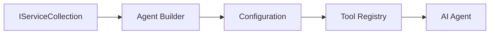

<!--
CO_OP_TRANSLATOR_METADATA:
{
  "original_hash": "bcc874e190347bd6a095aed56dc16de8",
  "translation_date": "2025-11-13T13:44:54+00:00",
  "source_file": "03-agentic-design-patterns/code_samples/03-dotnet-agent-framework.md",
  "language_code": "hu"
}
-->
# 🎨 Agentikus tervezési minták GitHub modellekkel (.NET)

## 📋 Tanulási célok

Ez a példa bemutatja az üzleti szintű tervezési mintákat intelligens ügynökök létrehozásához a Microsoft Agent Framework segítségével .NET-ben, GitHub modellek integrációjával. Megtanulhatod a professzionális mintákat és architekturális megközelítéseket, amelyek az ügynököket gyártásra kész, karbantartható és skálázható formában teszik elérhetővé.

### Üzleti tervezési minták

- 🏭 **Factory minta**: Standardizált ügynök létrehozás függőség injektálással
- 🔧 **Builder minta**: Folyékony ügynök konfiguráció és beállítás
- 🧵 **Szálbiztos minták**: Párhuzamos beszélgetéskezelés
- 📋 **Repository minta**: Eszközök és képességek szervezett kezelése

## 🎯 .NET-specifikus architekturális előnyök

### Üzleti funkciók

- **Erős típusosság**: Fordítási időben történő validáció és IntelliSense támogatás
- **Függőség injektálás**: Beépített DI konténer integráció
- **Konfigurációkezelés**: IConfiguration és Options minták
- **Async/Await**: Első osztályú aszinkron programozási támogatás

### Gyártásra kész minták

- **Naplózási integráció**: ILogger és strukturált naplózási támogatás
- **Egészségügyi ellenőrzések**: Beépített monitorozás és diagnosztika
- **Konfiguráció validáció**: Erős típusosság adat annotációkkal
- **Hibakezelés**: Strukturált kivételkezelés

## 🔧 Technikai architektúra

### Alapvető .NET komponensek

- **Microsoft.Extensions.AI**: Egységes AI szolgáltatás absztrakciók
- **Microsoft.Agents.AI**: Üzleti ügynökök orchesztrációs keretrendszere
- **GitHub modellek integrációja**: Nagy teljesítményű API kliens minták
- **Konfigurációs rendszer**: appsettings.json és környezet integráció

### Tervezési minták megvalósítása



## 🏗️ Bemutatott üzleti minták

### 1. **Létrehozási minták**

- **Agent Factory**: Központosított ügynök létrehozás következetes konfigurációval
- **Builder minta**: Folyékony API komplex ügynök konfigurációhoz
- **Singleton minta**: Megosztott erőforrások és konfigurációkezelés
- **Függőség injektálás**: Laza kapcsolódás és tesztelhetőség

### 2. **Viselkedési minták**

- **Stratégia minta**: Cserélhető eszköz végrehajtási stratégiák
- **Parancs minta**: Ügynök műveletek kapszulázása visszavonás/újra végrehajtás lehetőséggel
- **Megfigyelő minta**: Eseményvezérelt ügynök életciklus-kezelés
- **Sablon metódus**: Standardizált ügynök végrehajtási munkafolyamatok

### 3. **Strukturális minták**

- **Adapter minta**: GitHub modellek API integrációs réteg
- **Dekorátor minta**: Ügynök képességek bővítése
- **Homlokzat minta**: Egyszerűsített ügynök interakciós interfészek
- **Proxy minta**: Lusta betöltés és gyorsítótárazás a teljesítmény érdekében

## 📚 .NET tervezési elvek

### SOLID elvek

- **Egyetlen felelősség**: Minden komponensnek egyértelmű célja van
- **Nyitott/Zárt**: Bővíthető módosítás nélkül
- **Liskov helyettesítés**: Interfész-alapú eszköz implementációk
- **Interfész szegregáció**: Fókuszált, összetartó interfészek
- **Függőség inverzió**: Absztrakciókra támaszkodás, nem konkrétumokra

### Tiszta architektúra

- **Domain réteg**: Alapvető ügynök és eszköz absztrakciók
- **Alkalmazási réteg**: Ügynök orchesztráció és munkafolyamatok
- **Infrastruktúra réteg**: GitHub modellek integrációja és külső szolgáltatások
- **Prezentációs réteg**: Felhasználói interakció és válaszformázás

## 🔒 Üzleti szempontok

### Biztonság

- **Hitelesítő adatok kezelése**: Biztonságos API kulcs kezelés IConfiguration segítségével
- **Bemenet validáció**: Erős típusosság és adat annotáció validáció
- **Kimenet szűrés**: Biztonságos válaszfeldolgozás és szűrés
- **Audit naplózás**: Átfogó műveletkövetés

### Teljesítmény

- **Aszinkron minták**: Nem blokkoló I/O műveletek
- **Kapcsolat pooling**: Hatékony HTTP kliens kezelés
- **Gyorsítótárazás**: Válasz gyorsítótárazás a jobb teljesítmény érdekében
- **Erőforrás-kezelés**: Megfelelő felszabadítás és tisztítási minták

### Skálázhatóság

- **Szálbiztonság**: Párhuzamos ügynök végrehajtás támogatása
- **Erőforrás pooling**: Hatékony erőforrás kihasználás
- **Terheléskezelés**: Sebességkorlátozás és visszanyomás kezelése
- **Monitorozás**: Teljesítménymutatók és egészségügyi ellenőrzések

## 🚀 Gyártási telepítés

- **Konfigurációkezelés**: Környezet-specifikus beállítások
- **Naplózási stratégia**: Strukturált naplózás korrelációs azonosítókkal
- **Hibakezelés**: Globális kivételkezelés megfelelő helyreállítással
- **Monitorozás**: Alkalmazás betekintések és teljesítmény számlálók
- **Tesztelés**: Egységtesztek, integrációs tesztek és terhelési tesztelési minták

Készen állsz üzleti szintű intelligens ügynökök létrehozására .NET-ben? Építsünk valami robusztust! 🏢✨

## 🚀 Első lépések

### Előfeltételek

- [.NET 10 SDK](https://dotnet.microsoft.com/download/dotnet/10.0) vagy újabb
- [GitHub Models API hozzáférési token](https://docs.github.com/github-models/github-models-at-scale/using-your-own-api-keys-in-github-models)

### Szükséges környezeti változók

```bash
# zsh/bash
export GH_TOKEN=<your_github_token>
export GH_ENDPOINT=https://models.github.ai/inference
export GH_MODEL_ID=openai/gpt-5-mini
```

```powershell
# PowerShell
$env:GH_TOKEN = "<your_github_token>"
$env:GH_ENDPOINT = "https://models.github.ai/inference"
$env:GH_MODEL_ID = "openai/gpt-5-mini"
```

### Példa kód

A kód példa futtatásához,

```bash
# zsh/bash
chmod +x ./03-dotnet-agent-framework.cs
./03-dotnet-agent-framework.cs
```

Vagy a dotnet CLI használatával:

```bash
dotnet run ./03-dotnet-agent-framework.cs
```

Lásd [`03-dotnet-agent-framework.cs`](../../../../03-agentic-design-patterns/code_samples/03-dotnet-agent-framework.cs) a teljes kódért.

```csharp
#!/usr/bin/dotnet run

#:package Microsoft.Extensions.AI@10.*
#:package Microsoft.Agents.AI.OpenAI@1.*-*

using System.ClientModel;
using System.ComponentModel;

using Microsoft.Agents.AI;
using Microsoft.Extensions.AI;

using OpenAI;

// Tool Function: Random Destination Generator
// This static method will be available to the agent as a callable tool
// The [Description] attribute helps the AI understand when to use this function
// This demonstrates how to create custom tools for AI agents
[Description("Provides a random vacation destination.")]
static string GetRandomDestination()
{
    // List of popular vacation destinations around the world
    // The agent will randomly select from these options
    var destinations = new List<string>
    {
        "Paris, France",
        "Tokyo, Japan",
        "New York City, USA",
        "Sydney, Australia",
        "Rome, Italy",
        "Barcelona, Spain",
        "Cape Town, South Africa",
        "Rio de Janeiro, Brazil",
        "Bangkok, Thailand",
        "Vancouver, Canada"
    };

    // Generate random index and return selected destination
    // Uses System.Random for simple random selection
    var random = new Random();
    int index = random.Next(destinations.Count);
    return destinations[index];
}

// Extract configuration from environment variables
// Retrieve the GitHub Models API endpoint, defaults to https://models.github.ai/inference if not specified
// Retrieve the model ID, defaults to openai/gpt-5-mini if not specified
// Retrieve the GitHub token for authentication, throws exception if not specified
var github_endpoint = Environment.GetEnvironmentVariable("GH_ENDPOINT") ?? "https://models.github.ai/inference";
var github_model_id = Environment.GetEnvironmentVariable("GH_MODEL_ID") ?? "openai/gpt-5-mini";
var github_token = Environment.GetEnvironmentVariable("GH_TOKEN") ?? throw new InvalidOperationException("GH_TOKEN is not set.");

// Configure OpenAI Client Options
// Create configuration options to point to GitHub Models endpoint
// This redirects OpenAI client calls to GitHub's model inference service
var openAIOptions = new OpenAIClientOptions()
{
    Endpoint = new Uri(github_endpoint)
};

// Initialize OpenAI Client with GitHub Models Configuration
// Create OpenAI client using GitHub token for authentication
// Configure it to use GitHub Models endpoint instead of OpenAI directly
var openAIClient = new OpenAIClient(new ApiKeyCredential(github_token), openAIOptions);

// Define Agent Identity and Comprehensive Instructions
// Agent name for identification and logging purposes
var AGENT_NAME = "TravelAgent";

// Detailed instructions that define the agent's personality, capabilities, and behavior
// This system prompt shapes how the agent responds and interacts with users
var AGENT_INSTRUCTIONS = """
You are a helpful AI Agent that can help plan vacations for customers.

Important: When users specify a destination, always plan for that location. Only suggest random destinations when the user hasn't specified a preference.

When the conversation begins, introduce yourself with this message:
"Hello! I'm your TravelAgent assistant. I can help plan vacations and suggest interesting destinations for you. Here are some things you can ask me:
1. Plan a day trip to a specific location
2. Suggest a random vacation destination
3. Find destinations with specific features (beaches, mountains, historical sites, etc.)
4. Plan an alternative trip if you don't like my first suggestion

What kind of trip would you like me to help you plan today?"

Always prioritize user preferences. If they mention a specific destination like "Bali" or "Paris," focus your planning on that location rather than suggesting alternatives.
""";

// Create AI Agent with Advanced Travel Planning Capabilities
// Initialize complete agent pipeline: OpenAI client → Chat client → AI agent
// Configure agent with name, detailed instructions, and available tools
// This demonstrates the .NET agent creation pattern with full configuration
AIAgent agent = openAIClient
    .GetChatClient(github_model_id)
    .CreateAIAgent(
        name: AGENT_NAME,
        instructions: AGENT_INSTRUCTIONS,
        tools: [AIFunctionFactory.Create(GetRandomDestination)]
    );

// Create New Conversation Thread for Context Management
// Initialize a new conversation thread to maintain context across multiple interactions
// Threads enable the agent to remember previous exchanges and maintain conversational state
// This is essential for multi-turn conversations and contextual understanding
AgentThread thread = agent.GetNewThread();

// Execute Agent: First Travel Planning Request
// Run the agent with an initial request that will likely trigger the random destination tool
// The agent will analyze the request, use the GetRandomDestination tool, and create an itinerary
// Using the thread parameter maintains conversation context for subsequent interactions
await foreach (var update in agent.RunStreamingAsync("Plan me a day trip", thread))
{
    await Task.Delay(10);
    Console.Write(update);
}

Console.WriteLine();

// Execute Agent: Follow-up Request with Context Awareness
// Demonstrate contextual conversation by referencing the previous response
// The agent remembers the previous destination suggestion and will provide an alternative
// This showcases the power of conversation threads and contextual understanding in .NET agents
await foreach (var update in agent.RunStreamingAsync("I don't like that destination. Plan me another vacation.", thread))
{
    await Task.Delay(10);
    Console.Write(update);
}
```

---

<!-- CO-OP TRANSLATOR DISCLAIMER START -->
**Felelősség kizárása**:  
Ez a dokumentum az [Co-op Translator](https://github.com/Azure/co-op-translator) AI fordítási szolgáltatás segítségével lett lefordítva. Bár törekszünk a pontosságra, kérjük, vegye figyelembe, hogy az automatikus fordítások hibákat vagy pontatlanságokat tartalmazhatnak. Az eredeti dokumentum az eredeti nyelvén tekintendő hiteles forrásnak. Kritikus információk esetén javasolt professzionális emberi fordítást igénybe venni. Nem vállalunk felelősséget semmilyen félreértésért vagy téves értelmezésért, amely a fordítás használatából eredhet.
<!-- CO-OP TRANSLATOR DISCLAIMER END -->