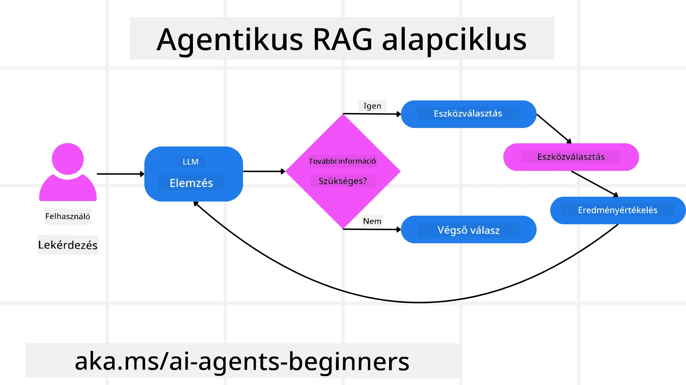
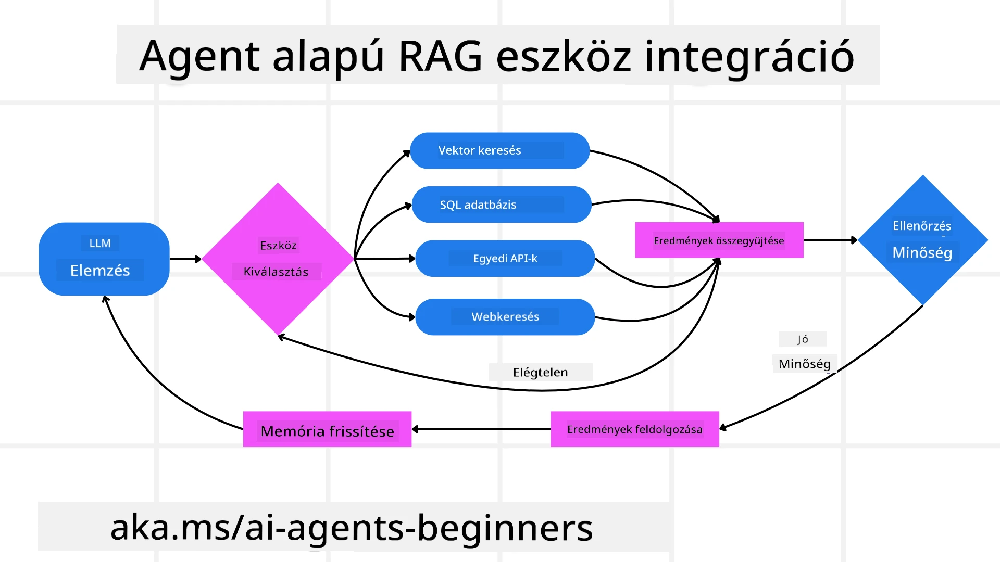
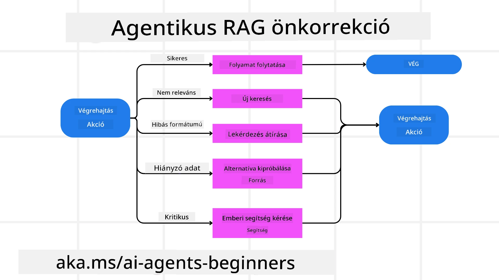

<!--
CO_OP_TRANSLATOR_METADATA:
{
  "original_hash": "0ebf6b2290db55dbf2d10cc49655523b",
  "translation_date": "2025-09-30T07:37:59+00:00",
  "source_file": "05-agentic-rag/README.md",
  "language_code": "hu"
}
-->

> _(Kattints a fenti képre a leckéhez tartozó videó megtekintéséhez)_

# Agentic RAG

Ez a lecke átfogó áttekintést nyújt az Agentic Retrieval-Augmented Generation (Agentic RAG) nevű új AI paradigmáról, amelyben a nagy nyelvi modellek (LLM-ek) önállóan tervezik meg következő lépéseiket, miközben külső forrásokból gyűjtenek információt. A statikus "keresés-olvasás" mintázatokkal ellentétben az Agentic RAG iteratív hívásokat végez az LLM-hez, amelyeket eszköz- vagy funkcióhívások és strukturált kimenetek szakítanak meg. A rendszer értékeli az eredményeket, finomítja a lekérdezéseket, szükség esetén további eszközöket hív meg, és folytatja ezt a ciklust, amíg kielégítő megoldást nem ér el.

## Bevezetés

Ebben a leckében az alábbiakat fogjuk tárgyalni:

- **Agentic RAG megértése:** Ismerd meg az AI egy új paradigmáját, amelyben a nagy nyelvi modellek (LLM-ek) önállóan tervezik meg következő lépéseiket, miközben külső adatforrásokból gyűjtenek információt.
- **Iteratív Maker-Checker stílus:** Értsd meg az LLM-hez történő iteratív hívások ciklusát, amelyeket eszköz- vagy funkcióhívások és strukturált kimenetek szakítanak meg, a helyesség javítása és a hibás lekérdezések kezelése érdekében.
- **Gyakorlati alkalmazások felfedezése:** Azonosítsd azokat a helyzeteket, ahol az Agentic RAG kiemelkedően teljesít, például helyesség-központú környezetekben, összetett adatbázis-interakciókban és kiterjesztett munkafolyamatokban.

## Tanulási célok

A lecke elvégzése után képes leszel:

- **Agentic RAG megértése:** Ismerd meg az AI egy új paradigmáját, amelyben a nagy nyelvi modellek (LLM-ek) önállóan tervezik meg következő lépéseiket, miközben külső adatforrásokból gyűjtenek információt.
- **Iteratív Maker-Checker stílus:** Értsd meg az LLM-hez történő iteratív hívások ciklusát, amelyeket eszköz- vagy funkcióhívások és strukturált kimenetek szakítanak meg, a helyesség javítása és a hibás lekérdezések kezelése érdekében.
- **A gondolkodási folyamat irányítása:** Értsd meg a rendszer képességét arra, hogy önállóan irányítsa a gondolkodási folyamatát, és döntsön arról, hogyan közelítse meg a problémákat előre meghatározott útvonalak nélkül.
- **Munkafolyamat:** Értsd meg, hogyan dönt egy agentikus modell önállóan arról, hogy piaci trendjelentéseket gyűjtsön, versenytársadatokat azonosítson, belső értékesítési mutatókat korreláljon, szintetizálja az eredményeket, és értékelje a stratégiát.
- **Iteratív ciklusok, eszközintegráció és memória:** Ismerd meg a rendszer interakciós mintázatát, amely állapotot és memóriát tart fenn a lépések között, hogy elkerülje az ismétlődő ciklusokat és megalapozott döntéseket hozzon.
- **Hibakezelési módok és önkorrekció:** Fedezd fel a rendszer robusztus önkorrekciós mechanizmusait, beleértve az iterációt és újrakérdezést, diagnosztikai eszközök használatát, valamint az emberi felügyeletre való visszaesést.
- **Az ügynökség határai:** Értsd meg az Agentic RAG korlátait, különös tekintettel a domain-specifikus autonómiára, az infrastruktúra-függőségre és a védőkorlátok tiszteletben tartására.
- **Gyakorlati felhasználási esetek és érték:** Azonosítsd azokat a helyzeteket, ahol az Agentic RAG kiemelkedően teljesít, például helyesség-központú környezetekben, összetett adatbázis-interakciókban és kiterjesztett munkafolyamatokban.
- **Irányítás, átláthatóság és bizalom:** Ismerd meg az irányítás és átláthatóság fontosságát, beleértve a magyarázható érvelést, az elfogultság ellenőrzését és az emberi felügyeletet.

## Mi az Agentic RAG?

Az Agentic Retrieval-Augmented Generation (Agentic RAG) egy új AI paradigma, amelyben a nagy nyelvi modellek (LLM-ek) önállóan tervezik meg következő lépéseiket, miközben külső forrásokból gyűjtenek információt. A statikus "keresés-olvasás" mintázatokkal ellentétben az Agentic RAG iteratív hívásokat végez az LLM-hez, amelyeket eszköz- vagy funkcióhívások és strukturált kimenetek szakítanak meg. A rendszer értékeli az eredményeket, finomítja a lekérdezéseket, szükség esetén további eszközöket hív meg, és folytatja ezt a ciklust, amíg kielégítő megoldást nem ér el. Ez az iteratív „maker-checker” stílus javítja a helyességet, kezeli a hibás lekérdezéseket, és biztosítja a magas minőségű eredményeket.

A rendszer aktívan irányítja a gondolkodási folyamatát, újraírja a sikertelen lekérdezéseket, különböző keresési módszereket választ, és több eszközt integrál—például vektorkeresést az Azure AI Search-ben, SQL adatbázisokat vagy egyedi API-kat—mielőtt véglegesítené válaszát. Az agentikus rendszer megkülönböztető tulajdonsága, hogy képes irányítani a gondolkodási folyamatát. A hagyományos RAG megvalósítások előre meghatározott útvonalakra támaszkodnak, de az agentikus rendszer önállóan határozza meg a lépések sorrendjét az általa talált információk minősége alapján.

## Az Agentic Retrieval-Augmented Generation (Agentic RAG) meghatározása

Az Agentic Retrieval-Augmented Generation (Agentic RAG) egy új paradigma az AI fejlesztésében, amelyben az LLM-ek nemcsak külső adatforrásokból gyűjtenek információt, hanem önállóan tervezik meg következő lépéseiket. A statikus "keresés-olvasás" mintázatokkal vagy gondosan megírt prompt-szekvenciákkal ellentétben az Agentic RAG egy iteratív hívási ciklust alkalmaz az LLM-hez, amelyet eszköz- vagy funkcióhívások és strukturált kimenetek szakítanak meg. Minden lépésnél a rendszer értékeli az elért eredményeket, eldönti, hogy finomítja-e a lekérdezéseket, szükség esetén további eszközöket hív meg, és folytatja ezt a ciklust, amíg kielégítő megoldást nem ér el.

Ez az iteratív „maker-checker” működési stílus a helyesség javítására, a strukturált adatbázisokhoz (pl. NL2SQL) kapcsolódó hibás lekérdezések kezelésére és kiegyensúlyozott, magas minőségű eredmények biztosítására szolgál. A rendszer nem csupán gondosan megtervezett prompt-láncokra támaszkodik, hanem aktívan irányítja a gondolkodási folyamatát. Újraírhatja a sikertelen lekérdezéseket, különböző keresési módszereket választhat, és több eszközt integrálhat—például vektorkeresést az Azure AI Search-ben, SQL adatbázisokat vagy egyedi API-kat—mielőtt véglegesítené válaszát. Ez megszünteti az összetett orkestrációs keretrendszerek szükségességét. Ehelyett egy viszonylag egyszerű „LLM hívás → eszköz használat → LLM hívás → …” ciklus is képes kifinomult és jól megalapozott kimeneteket létrehozni.

## A gondolkodási folyamat irányítása

Az a megkülönböztető tulajdonság, amely „agentikussá” teszi a rendszert, az a képessége, hogy irányítsa a gondolkodási folyamatát. A hagyományos RAG megvalósítások gyakran arra támaszkodnak, hogy az emberek előre meghatározzák a modell útvonalát: egy gondolatmenetet, amely körvonalazza, mit kell lekérdezni és mikor.  
De amikor egy rendszer valóban agentikus, belsőleg dönti el, hogyan közelítse meg a problémát. Nem csupán egy szkriptet hajt végre; önállóan határozza meg a lépések sorrendjét az általa talált információk minősége alapján.  
Például, ha egy termékbevezetési stratégiát kell létrehoznia, nem csupán egy promptra támaszkodik, amely részletezi az egész kutatási és döntéshozatali munkafolyamatot. Ehelyett az agentikus modell önállóan dönt arról, hogy:

1. Piaci trendjelentéseket gyűjt Bing Web Grounding segítségével.
2. Releváns versenytársadatokat azonosít az Azure AI Search használatával.
3. Történelmi belső értékesítési mutatókat korrelál az Azure SQL Database segítségével.
4. Az eredményeket egy koherens stratégiává szintetizálja az Azure OpenAI Service segítségével.
5. Értékeli a stratégiát hiányosságok vagy ellentmondások szempontjából, és szükség esetén újabb kör keresést indít.

Mindezeket a lépéseket—a lekérdezések finomítása, források kiválasztása, iteráció addig, amíg „elégedett” az eredménnyel—a modell dönti el, nem pedig egy ember által előre megírt szkript.

## Iteratív ciklusok, eszközintegráció és memória

Egy agentikus rendszer egy ciklikus interakciós mintázatra támaszkodik:

- **Kezdeti hívás:** A felhasználó célja (azaz a felhasználói prompt) bemutatásra kerül az LLM-nek.
- **Eszköz használata:** Ha a modell hiányzó információt vagy kétértelmű utasítást azonosít, kiválaszt egy eszközt vagy keresési módszert—például egy vektordatabase-lekérdezést (pl. Azure AI Search Hybrid keresés privát adatok felett) vagy egy strukturált SQL hívást—hogy több kontextust gyűjtsön.
- **Értékelés és finomítás:** A visszakapott adatok áttekintése után a modell eldönti, hogy az információ elegendő-e. Ha nem, finomítja a lekérdezést, másik eszközt próbál ki, vagy módosítja a megközelítést.
- **Ismétlés, amíg elégedett:** Ez a ciklus addig folytatódik, amíg a modell úgy nem érzi, hogy elegendő tisztasággal és bizonyítékkal rendelkezik ahhoz, hogy végleges, jól megalapozott választ adjon.
- **Memória és állapot:** Mivel a rendszer állapotot és memóriát tart fenn a lépések között, képes visszaemlékezni a korábbi próbálkozásokra és azok eredményeire, elkerülve az ismétlődő ciklusokat, és megalapozottabb döntéseket hozva a folyamat során.

Idővel ez egy fejlődő megértés érzetét kelti, lehetővé téve a modell számára, hogy összetett, több lépésből álló feladatokat végezzen anélkül, hogy az embernek folyamatosan be kellene avatkoznia vagy módosítania kellene a promptot.

## Hibakezelési módok és önkorrekció

Az Agentic RAG autonómiája robusztus önkorrekciós mechanizmusokat is magában foglal. Amikor a rendszer zsákutcába jut—például irreleváns dokumentumokat gyűjt vagy hibás lekérdezésekkel találkozik—képes:

- **Iteráció és újrakérdezés:** Alacsony értékű válaszok visszaadása helyett a modell új keresési stratégiákat próbál ki, újraírja az adatbázis-lekérdezéseket, vagy alternatív adatforrásokat keres.
- **Diagnosztikai eszközök használata:** A rendszer további funkciókat hívhat meg, amelyek segítenek neki hibakeresni az érvelési lépéseit vagy megerősíteni a visszakeresett adatok helyességét. Az olyan eszközök, mint az Azure AI Tracing, fontosak lesznek a robusztus megfigyelhetőség és monitorozás érdekében.
- **Emberi felügyeletre való visszaesés:** Magas kockázatú vagy ismételten sikertelen helyzetekben a modell bizonytalanságot jelezhet, és emberi iránymutatást kérhet. Miután az ember korrekciós visszajelzést ad, a modell beépítheti azt a tanulságot a továbbiakban.

Ez az iteratív és dinamikus megközelítés lehetővé teszi a modell számára, hogy folyamatosan javuljon, biztosítva, hogy ne csupán egy egyszeri rendszer legyen, hanem olyan, amely tanul a hibáiból egy adott munkamenet során.

## Az ügynökség határai

Annak ellenére, hogy autonóm egy feladaton belül, az Agentic RAG nem azonos az általános mesterséges intelligenciával. Az „agentikus” képességei az emberi fejlesztők által biztosított eszközökre, adatforrásokra és irányelvekre korlátozódnak. Nem tud saját eszközöket létrehozni vagy túllépni az előre meghatározott domain határain. Ehelyett a rendelkezésre álló erőforrások dinamikus orkestrációjában jeleskedik.  
A fejlettebb AI formáktól való kulcsfontosságú különbségek a következők:

1. **Domain-specifikus autonómia:** Az Agentic RAG rendszerek arra összpontosítanak, hogy felhasználó által meghatározott célokat érjenek el egy ismert domainen belül, olyan stratégiákat alkalmazva, mint a lekérdezés újraírása vagy eszközválasztás az eredmények javítása érdekében.
2. **Infrastruktúra-függőség:** A rendszer képességei a fejlesztők által integrált eszközöktől és adatoktól függnek. Nem lépheti túl ezeket a határokat emberi beavatkozás nélkül.
3. **Védőkorlátok tiszteletben tartása:** Az etikai irányelvek, megfelelőségi szabályok és üzleti politikák továbbra is nagyon fontosak. Az ügynök szabadsága mindig biztonsági intézkedések és felügyeleti mechanizmusok által korlátozott (remélhetőleg?).

## Gyakorlati felhasználási esetek és érték

Az Agentic RAG kiemelkedően teljesít olyan helyzetekben, amelyek iteratív finomítást és pontosságot igényelnek:

1. **Helyesség-központú környezetek:** Megfelelőségi ellenőrzésekben, szabályozási elemzésekben vagy jogi kutatásokban az agentikus modell többször ellenőrizheti a tényeket, több forrást konzultálhat, és újraírhatja a lekérdezéseket, amíg alaposan ellenőrzött választ nem ad.
2. **Összet
- <a href="https://ragaboutit.com/agentic-rag-a-complete-guide-to-agent-based-retrieval-augmented-generation/" target="_blank">Agentic RAG: Teljes útmutató az ügynök-alapú visszakeresésen alapuló generáláshoz – Hírek a RAG generálásról</a>
- <a href="https://huggingface.co/learn/cookbook/agent_rag" target="_blank">Agentic RAG: turbózd fel a RAG-ot lekérdezés átalakítással és önlekérdezéssel! Hugging Face Nyílt Forráskódú AI Cookbook</a>
- <a href="https://youtu.be/aQ4yQXeB1Ss?si=2HUqBzHoeB5tR04U" target="_blank">Agentikus rétegek hozzáadása a RAG-hoz</a>
- <a href="https://www.youtube.com/watch?v=zeAyuLc_f3Q&t=244s" target="_blank">A tudásasszisztensek jövője: Jerry Liu</a>
- <a href="https://www.youtube.com/watch?v=AOSjiXP1jmQ" target="_blank">Hogyan építsünk agentikus RAG rendszereket</a>
- <a href="https://ignite.microsoft.com/sessions/BRK102?source=sessions" target="_blank">Azure AI Foundry Agent Service használata az AI ügynökök skálázásához</a>

### Tudományos cikkek

- <a href="https://arxiv.org/abs/2303.17651" target="_blank">2303.17651 Self-Refine: Iteratív finomítás önvisszacsatolással</a>
- <a href="https://arxiv.org/abs/2303.11366" target="_blank">2303.11366 Reflexion: Nyelvi ügynökök verbális megerősítéses tanulással</a>
- <a href="https://arxiv.org/abs/2305.11738" target="_blank">2305.11738 CRITIC: Nagy nyelvi modellek önkorrekcióra képesek eszköz-interaktív kritika segítségével</a>
- <a href="https://arxiv.org/abs/2501.09136" target="_blank">2501.09136 Agentikus visszakeresésen alapuló generálás: Felmérés az agentikus RAG-ról</a>

## Előző lecke

[Eszközhasználati tervezési minta](../04-tool-use/README.md)

## Következő lecke

[Megbízható AI ügynökök építése](../06-building-trustworthy-agents/README.md)

---

**Felelősség kizárása**:  
Ez a dokumentum az [Co-op Translator](https://github.com/Azure/co-op-translator) AI fordítási szolgáltatás segítségével került lefordításra. Bár törekszünk a pontosságra, kérjük, vegye figyelembe, hogy az automatikus fordítások hibákat vagy pontatlanságokat tartalmazhatnak. Az eredeti dokumentum az eredeti nyelvén tekintendő hiteles forrásnak. Kritikus információk esetén javasolt professzionális emberi fordítást igénybe venni. Nem vállalunk felelősséget a fordítás használatából eredő félreértésekért vagy téves értelmezésekért.