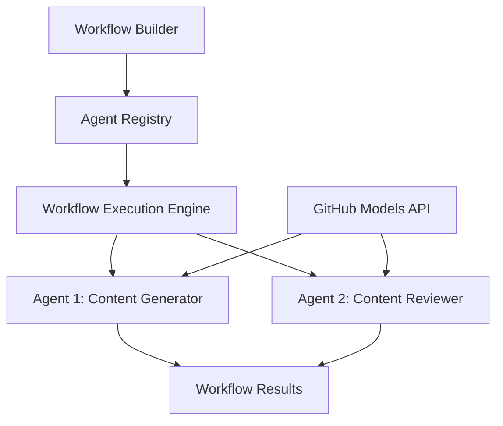

<!--
CO_OP_TRANSLATOR_METADATA:
{
  "original_hash": "034158688d0a45aae06dcbb21b0da5ae",
  "translation_date": "2025-11-11T12:56:34+00:00",
  "source_file": "08-multi-agent/code_samples/workflows-agent-framework/dotNET/01.dotnet-agent-framework-workflow-ghmodel-basic.md",
  "language_code": "hu"
}
-->
# 🔄 Alapvető Ügynök Munkafolyamatok GitHub Modellekkel (.NET)

## 📋 Munkafolyamat Orkesztrációs Útmutató

Ez a jegyzet bemutatja, hogyan lehet kifinomult **ügynök munkafolyamatokat** létrehozni a Microsoft Agent Framework for .NET és GitHub Modellek segítségével. Megtanulhatod, hogyan hozz létre többlépcsős üzleti folyamatokat, ahol az AI ügynökök együttműködnek, hogy strukturált orkesztrációs mintákon keresztül összetett feladatokat hajtsanak végre.

## 🎯 Tanulási Célok

### 🏗️ **Munkafolyamat Architektúra Alapjai**
- **Workflow Builder**: Összetett, többlépcsős AI folyamatok tervezése és orkesztrációja
- **Ügynök Koordináció**: Több specializált ügynök koordinálása a munkafolyamatokon belül
- **GitHub Modellek Integrációja**: GitHub AI modell következtetési szolgáltatásának használata a munkafolyamatokban
- **Vizualizált Munkafolyamat Tervezés**: Munkafolyamat struktúrák létrehozása és vizualizálása a jobb megértés érdekében

### 🔄 **Folyamat Orkesztrációs Minták**
- **Szekvenciális Feldolgozás**: Több ügynök feladatainak logikai sorrendben történő összekapcsolása
- **Állapotkezelés**: Kontextus és adatáramlás fenntartása a munkafolyamat szakaszai között
- **Hibakezelés**: Robusztus hibaelhárítás és munkafolyamat ellenállóképesség megvalósítása
- **Teljesítményoptimalizálás**: Hatékony munkafolyamatok tervezése vállalati méretű műveletekhez

### 🏢 **Vállalati Munkafolyamat Alkalmazások**
- **Üzleti Folyamat Automatizálás**: Összetett szervezeti munkafolyamatok automatizálása
- **Tartalomgyártási Csatorna**: Szerkesztési munkafolyamatok felülvizsgálati és jóváhagyási szakaszokkal
- **Ügyfélszolgálati Automatizálás**: Többlépcsős ügyfélkérdés megoldás
- **Adatfeldolgozási Munkafolyamatok**: ETL munkafolyamatok AI-alapú átalakítással

## ⚙️ Előfeltételek és Beállítás

### 📦 **Szükséges NuGet Csomagok**

Ez a munkafolyamat bemutató több kulcsfontosságú .NET csomagot használ:

```xml
<!-- Core AI Framework -->
<PackageReference Include="Microsoft.Extensions.AI" Version="9.9.0" />

<!-- Agent Framework (Local Development) -->
<!-- Microsoft.Agents.AI.dll - Core agent abstractions -->
<!-- Microsoft.Agents.AI.OpenAI.dll - OpenAI/GitHub Models integration -->

<!-- Configuration and Environment -->
<PackageReference Include="DotNetEnv" Version="3.1.1" />
```

### 🔑 **GitHub Modellek Konfigurációja**

**Környezet Beállítása (.env fájl):**
```env
GITHUB_TOKEN=your_github_personal_access_token
GITHUB_ENDPOINT=https://models.inference.ai.azure.com
GITHUB_MODEL_ID=gpt-4o-mini
```

**GitHub Modellek Hozzáférés:**
1. Regisztrálj a GitHub Modellekre (jelenleg előzetes verzióban)
2. Generálj személyes hozzáférési tokent modell hozzáférési engedélyekkel
3. Konfiguráld a környezeti változókat a fentiek szerint

### 🏗️ **Munkafolyamat Architektúra Áttekintése**



**Kulcskomponensek:**
- **WorkflowBuilder**: Fő orkesztrációs motor a munkafolyamatok tervezéséhez
- **AIAgent**: Egyedi specializált ügynökök specifikus képességekkel
- **GitHub Models Client**: AI modell következtetési szolgáltatás integrációja
- **Execution Context**: Állapot és adatáramlás kezelése a munkafolyamat szakaszai között

## 🎨 **Vállalati Munkafolyamat Tervezési Minták**

### 📝 **Tartalomgyártási Munkafolyamat**
```
User Request → Content Generation → Quality Review → Final Output
```

### 🔍 **Dokumentumfeldolgozási Csatorna**
```
Document Input → Analysis → Extraction → Validation → Structured Output
```

### 💼 **Üzleti Intelligencia Munkafolyamat**
```
Data Collection → Processing → Analysis → Report Generation → Distribution
```

### 🤝 **Ügyfélszolgálati Automatizálás**
```
Customer Inquiry → Classification → Processing → Response Generation → Follow-up
```

## 🏢 **Vállalati Előnyök**

### 🎯 **Megbízhatóság és Skálázhatóság**
- **Determinált Végrehajtás**: Konzisztens, megismételhető munkafolyamat eredmények
- **Hibaelhárítás**: Hibák elegáns kezelése bármely munkafolyamat szakaszban
- **Teljesítményfigyelés**: Végrehajtási metrikák és optimalizálási lehetőségek nyomon követése
- **Erőforrás-kezelés**: AI modell erőforrások hatékony kiosztása és felhasználása

### 🔒 **Biztonság és Megfelelőség**
- **Biztonságos Hitelesítés**: GitHub token alapú hitelesítés API hozzáféréshez
- **Audit Nyomvonalak**: Teljes naplózás a munkafolyamat végrehajtásáról és döntési pontokról
- **Hozzáférés-vezérlés**: Granulált engedélyek a munkafolyamat végrehajtásához és monitorozásához
- **Adatvédelem**: Érzékeny információk biztonságos kezelése a munkafolyamatok során

### 📊 **Megfigyelhetőség és Kezelés**
- **Vizualizált Munkafolyamat Tervezés**: Folyamatáramlások és függőségek egyértelmű ábrázolása
- **Végrehajtás Monitorozása**: Munkafolyamat előrehaladásának és teljesítményének valós idejű nyomon követése
- **Hibajelentés**: Részletes hibaelemzés és hibakeresési képességek
- **Teljesítményanalitika**: Metrikák optimalizáláshoz és kapacitástervezéshez

Építsd meg az első vállalati szintű AI munkafolyamatodat! 🚀

## 💻 A Kód Futtatása

A teljes implementáció elérhető a `01.dotnet-agent-framework-workflow-ghmodel-basic.cs` fájlban. Ez a fájl bemutatja:

1. **Környezet Konfiguráció** - GitHub Modellek hitelesítő adatok betöltése `.env` fájlból
2. **OpenAI Client Beállítása** - Az ügyfél konfigurálása a GitHub Modellek végpont használatához
3. **Ügynök Létrehozása** - Specializált ügynökök definiálása (Front Desk és Concierge)
4. **Workflow Builder** - Több ügynökből álló munkafolyamat létrehozása szekvenciális feldolgozással
5. **Munkafolyamat Végrehajtása** - A munkafolyamat futtatása streaming eredményekkel

### 🚀 Példa Futtatása

```bash
# Make the script executable (Unix/Linux/macOS)
chmod +x 01.dotnet-agent-framework-workflow-ghmodel-basic.cs

# Run the workflow
./01.dotnet-agent-framework-workflow-ghmodel-basic.cs
```

Windows rendszeren:
```powershell
dotnet run 01.dotnet-agent-framework-workflow-ghmodel-basic.cs
```

### 📝 Várható Kimenet

A munkafolyamat:
1. Elfogadja az utazási célra vonatkozó kérésedet ("Szeretnék Párizsba utazni")
2. A Front Desk ügynök kezdeti ajánlást ad
3. A Concierge ügynök átnézi és finomítja az ajánlást
4. A végső kimenet megjeleníti a teljes beszélgetési folyamatot

### 🔧 Testreszabás

A munkafolyamatot testreszabhatod:
- Az ügynök utasításainak módosításával, hogy megváltoztasd viselkedésüket
- További ügynökök hozzáadásával, hogy összetett többlépcsős munkafolyamatokat hozz létre
- A felhasználói üzenet megváltoztatásával, hogy különböző forgatókönyveket tesztelj
- A munkafolyamat élek módosításával, hogy különböző végrehajtási mintákat hozz létre

---

<!-- CO-OP TRANSLATOR DISCLAIMER START -->
**Felelősség kizárása**:  
Ez a dokumentum az AI fordítási szolgáltatás [Co-op Translator](https://github.com/Azure/co-op-translator) segítségével lett lefordítva. Bár törekszünk a pontosságra, kérjük, vegye figyelembe, hogy az automatikus fordítások hibákat vagy pontatlanságokat tartalmazhatnak. Az eredeti dokumentum az eredeti nyelvén tekintendő hiteles forrásnak. Kritikus információk esetén javasolt professzionális emberi fordítást igénybe venni. Nem vállalunk felelősséget semmilyen félreértésért vagy félremagyarázásért, amely a fordítás használatából eredhet.
<!-- CO-OP TRANSLATOR DISCLAIMER END -->