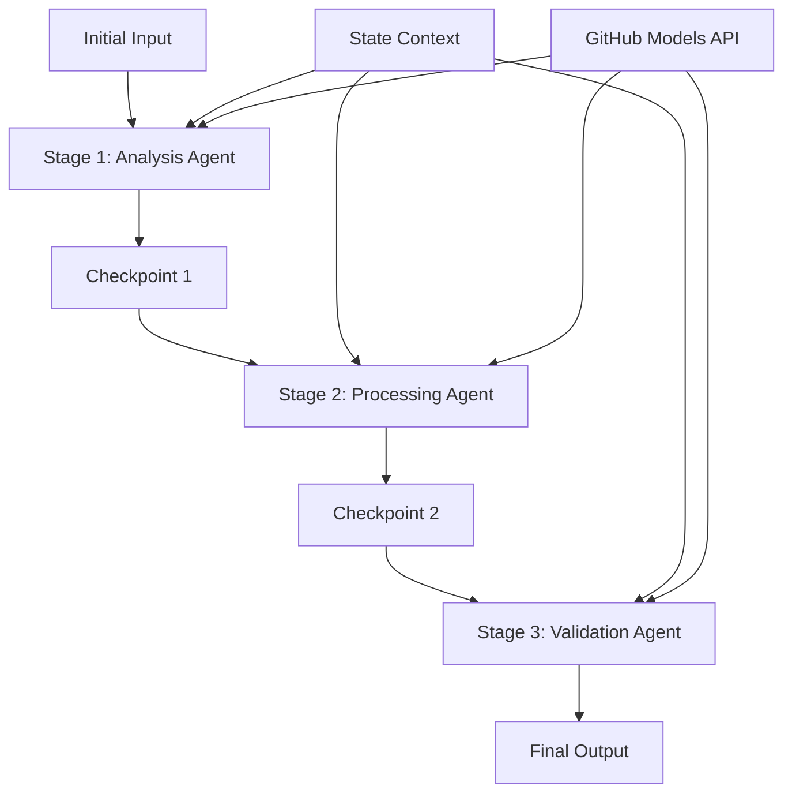

<!--
CO_OP_TRANSLATOR_METADATA:
{
  "original_hash": "1be9c8dcbd79a02d33d2c138684c1394",
  "translation_date": "2025-11-11T14:01:08+00:00",
  "source_file": "08-multi-agent/code_samples/workflows-agent-framework/dotNET/02.dotnet-agent-framework-workflow-ghmodel-sequential.md",
  "language_code": "hu"
}
-->
# ⏩ Szekvenciális ügynök munkafolyamatok GitHub modellekkel (.NET)

## 📋 Haladó szekvenciális feldolgozási útmutató

Ez a jegyzetfüzet bemutatja a **szekvenciális munkafolyamat mintákat** a Microsoft Agent Framework for .NET és GitHub modellek használatával. Megtanulhatod, hogyan építs kifinomult, lépésről lépésre haladó feldolgozási csatornákat, ahol az ügynökök meghatározott sorrendben hajtják végre a feladatokat, és minden szakasz az előző szakasz eredményeire épít.

## 🎯 Tanulási célok

### 🔄 **Szekvenciális feldolgozási architektúra**
- **Lineáris munkafolyamat tervezés**: Lépésről lépésre haladó feldolgozási csatornák létrehozása egyértelmű függőségekkel
- **Állapotkezelés**: Kontextus és adatáramlás fenntartása a szekvenciális munkafolyamat szakaszai között
- **GitHub modellek integrációja**: GitHub AI modellek használata több szakaszos .NET munkafolyamatokban
- **Vállalati csatorna minták**: Gyártásra kész szekvenciális feldolgozási rendszerek építése

### 🏗️ **Haladó szekvenciális minták**
- **Stage-Gate feldolgozás**: Érvényesítési ellenőrzőpontok megvalósítása a munkafolyamat szakaszai között
- **Kontextus megőrzése**: Állapot és felhalmozott tudás fenntartása minden szakaszban
- **Hibaterjedés kezelése**: Hibák kezelése szekvenciális feldolgozási láncokban
- **Teljesítmény optimalizálása**: Hatékony szekvenciális végrehajtás minimális terheléssel

### 🏢 **Vállalati szekvenciális alkalmazások**
- **Dokumentum feldolgozási csatorna**: Több szakaszos dokumentumelemzés, átalakítás és érvényesítés
- **Minőségbiztosítási munkafolyamatok**: Szekvenciális áttekintés, érvényesítés és jóváhagyási folyamatok
- **Tartalomgyártási csatorna**: Kutatás → Írás → Szerkesztés → Áttekintés → Kiadás
- **Üzleti folyamat automatizálás**: Többlépcsős üzleti munkafolyamatok egyértelmű szakaszfüggőségekkel

## ⚙️ Előfeltételek és beállítás

### 📦 **Szükséges NuGet csomagok**

Alapvető csomagok .NET szekvenciális munkafolyamatokhoz:

```xml
<!-- Core AI Framework -->
<PackageReference Include="Microsoft.Extensions.AI" Version="9.9.0" />

<!-- Client Model Abstractions -->
<PackageReference Include="System.ClientModel" Version="1.6.1.0" />

<!-- Azure Identity and Async LINQ Support -->
<PackageReference Include="Azure.Identity" Version="1.15.0" />
<PackageReference Include="System.Linq.Async" Version="6.0.3" />

<!-- Local Agent Framework References -->
<!-- Microsoft.Agents.AI.dll - Core agent abstractions -->
<!-- Microsoft.Agents.AI.OpenAI.dll - GitHub Models integration -->
```

### 🔑 **GitHub modellek konfigurációja**

**Környezet beállítása (.env fájl):**
```env
GITHUB_TOKEN=your_github_personal_access_token
GITHUB_ENDPOINT=https://models.inference.ai.azure.com
GITHUB_MODEL_ID=gpt-4o-mini
```

**Konfigurációkezelés:**
```csharp
// Load environment variables securely
Env.Load("../../../.env");
var githubToken = Environment.GetEnvironmentVariable("GITHUB_TOKEN");
var githubEndpoint = Environment.GetEnvironmentVariable("GITHUB_ENDPOINT");
var modelId = Environment.GetEnvironmentVariable("GITHUB_MODEL_ID");
```

### 🏗️ **Szekvenciális munkafolyamat architektúra**



**Kulcselemek:**
- **Szekvenciális ügynökök**: Speciális ügynökök minden feldolgozási szakaszhoz
- **Állapot kontextus**: Felhalmozott adatok és döntések fenntartása a szakaszok között
- **Ellenőrzőpontok**: Érvényesítési pontok a szakaszok között a minőség és konzisztencia biztosítására
- **GitHub modellek kliens**: Konzisztens AI modell hozzáférés minden munkafolyamat szakaszban

## 🎨 **Szekvenciális munkafolyamat tervezési minták**

### 📝 **Dokumentum feldolgozási csatorna**
```
Raw Document → Content Extraction → Analysis → Validation → Structured Output
```

### 🎯 **Tartalomgyártási munkafolyamat**
```
Brief/Requirements → Research → Content Creation → Review → Final Polish
```

### 🔍 **Minőségbiztosítási csatorna**
```
Initial Review → Technical Validation → Compliance Check → Final Approval
```

### 💼 **Üzleti intelligencia munkafolyamat**
```
Data Collection → Processing → Analysis → Report Generation → Distribution
```

## 🏢 **Vállalati szekvenciális előnyök**

### 🎯 **Megbízhatóság és minőség**
- **Determinista feldolgozás**: Konzisztens, megismételhető eredmények strukturált szakaszokon keresztül
- **Minőségi kapuk**: Érvényesítési ellenőrzőpontok biztosítják a minőséget minden szakaszban
- **Hibák izolálása**: Egy szakasz problémái nem terjednek tovább a következő szakaszokra
- **Audit nyomvonalak**: Teljes nyomon követés a döntésekről és átalakításokról minden szakaszban

### 📈 **Skálázhatóság és teljesítmény**
- **Moduláris tervezés**: Minden szakasz külön optimalizálható
- **Erőforrás-kezelés**: AI modell erőforrások hatékony elosztása a szakaszok között
- **Állapot optimalizálása**: Minimális állapotátvitel a szakaszok között az optimális teljesítmény érdekében
- **Párhuzamos szakaszcsoportok**: Több szekvenciális munkafolyamat futtatható párhuzamosan

### 🔒 **Biztonság és megfelelőség**
- **Szakasz szintű biztonság**: Különböző biztonsági szabályok a különböző feldolgozási szakaszokhoz
- **Adat érvényesítés**: Adatintegritás és megfelelőség biztosítása minden ellenőrzőpontnál
- **Hozzáférés-vezérlés**: Granuláris jogosultságok a különböző munkafolyamat szakaszokhoz
- **Szabályozási megfelelőség**: Szabályozási követelmények teljesítése strukturált feldolgozással

### 📊 **Felügyelet és analitika**
- **Szakasz szintű metrikák**: Teljesítményfigyelés minden munkafolyamat szakaszhoz
- **Szűk keresztmetszetek azonosítása**: Lassú szakaszok azonosítása és optimalizálása
- **Minőségi metrikák**: Minőség és sikerességi arányok nyomon követése minden szakaszban
- **Folyamat optimalizálás**: Folyamatos fejlesztés szakasz szintű analitikák alapján

Építsünk robusztus szekvenciális AI feldolgozási csatornákat! 🚀

## 💻 A kód futtatása

A teljes implementáció elérhető a `02.dotnet-agent-framework-workflow-ghmodel-sequential.cs` fájlban. Ez a fájl egy **három szakaszos bútor elemzési munkafolyamatot** mutat be:

1. **1. szakasz - Értékesítési ügynök**: Elemzi a bútor képeket és vásárlási javaslatokat ad
2. **2. szakasz - Ár ügynök**: Részletes árképzési bontást és költségvetési opciókat nyújt
3. **3. szakasz - Ajánlat ügynök**: Professzionális ajánlat dokumentumot generál Markdown formátumban

### 🏗️ **Munkafolyamat architektúra**

```
Image Input → Sales Analysis → Price Estimation → Quote Generation → Final Output
```

Minden ügynök:
- Az előző szakasz eredményét kapja meg kontextusként
- Az előző elemzésre épít speciális szakértelemmel
- Fenntartja a munkafolyamat folytonosságát állapotkezeléssel

### 🚀 Példa futtatása

**Előfeltételek:**
- Helyezz el egy bútor képet a `../imgs/home.png` helyen (vagy frissítsd az `imgPath` változót)
- Konfiguráld a `.env` fájlt GitHub modellek hitelesítő adataival

```bash
# Make the script executable (Unix/Linux/macOS)
chmod +x 02.dotnet-agent-framework-workflow-ghmodel-sequential.cs

# Run the sequential workflow
./02.dotnet-agent-framework-workflow-ghmodel-sequential.cs
```

Windows rendszeren:
```powershell
dotnet run 02.dotnet-agent-framework-workflow-ghmodel-sequential.cs
```

### 📝 Várható kimenet

A munkafolyamat:
1. **Értékesítési ügynök**: Azonosítja a bútor elemeket a képről és javaslatokat ad
2. **Ár ügynök**: Részletes árképzési elemzést ad költségvetési szintekkel és vásárlási javaslatokkal
3. **Ajánlat ügynök**: Formázott ajánlat dokumentumot generál, amely szintetizálja az összes információt

A végső kimenet egy átfogó, professzionális bútor ajánlat lesz képelemzés alapján.

### 🔧 Testreszabási lehetőségek

**Ügynök viselkedés módosítása:**
```csharp
// Adjust agent instructions to change their focus
const string SalesAgentInstructions = "Your custom instructions...";
```

**Szekvenciális folyamat megváltoztatása:**
```csharp
// Add or reorder workflow stages
var workflow = new WorkflowBuilder(salesagent)
    .AddEdge(salesagent, priceagent)
    .AddEdge(priceagent, quoteagent)
    .AddEdge(quoteagent, newAgent)  // Add another stage
    .Build();
```

**Más bemenet használata:**
```csharp
// Process text instead of images
ChatMessage userMessage = new ChatMessage(ChatRole.User, [
    new TextContent("Analyze pricing for a modern living room set")
]);
```

### 🎯 Valós alkalmazások

Ez a szekvenciális minta ideális:
- **E-kereskedelem**: Termékelemzés → Ár → Ajánlat generálás
- **Ingatlan**: Ingatlan elemzés → Értékelés → Hirdetés készítés
- **Biztosítás**: Kárigény elemzés → Értékelés → Ajánlat generálás
- **Tartalomgyártás**: Kutatás → Írás → Szerkesztés → Kiadás

### 🔍 Állapotáramlás megértése

Minden ügynök a sorozatban megkapja:
- **Eredeti bemenet**: A kezdeti felhasználói üzenetet (kép + szöveg)
- **Előző ügynök kimenetei**: Az összes előző ügynök válaszát a beszélgetési előzményekben
- **Felhalmozott kontextus**: Teljes állapot, amelyet a munkafolyamat során fenntartanak

Ez lehetővé teszi a kifinomult több szakaszos feldolgozást, ahol minden ügynök az előző szakaszok teljes kontextusára épít.

---

<!-- CO-OP TRANSLATOR DISCLAIMER START -->
**Felelősség kizárása**:  
Ez a dokumentum az AI fordítási szolgáltatás [Co-op Translator](https://github.com/Azure/co-op-translator) segítségével lett lefordítva. Bár törekszünk a pontosságra, kérjük, vegye figyelembe, hogy az automatikus fordítások hibákat vagy pontatlanságokat tartalmazhatnak. Az eredeti dokumentum az eredeti nyelvén tekintendő hiteles forrásnak. Fontos információk esetén javasolt professzionális emberi fordítást igénybe venni. Nem vállalunk felelősséget semmilyen félreértésért vagy téves értelmezésért, amely a fordítás használatából eredhet.
<!-- CO-OP TRANSLATOR DISCLAIMER END -->