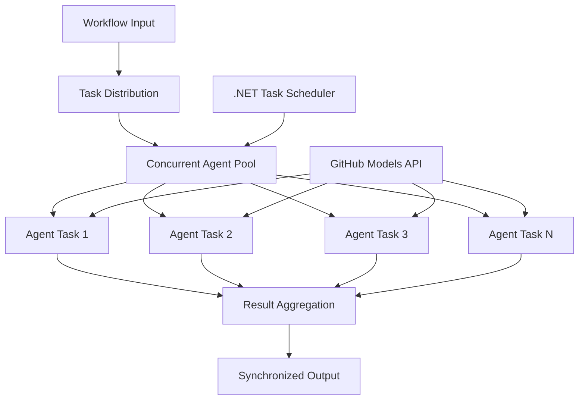

<!--
CO_OP_TRANSLATOR_METADATA:
{
  "original_hash": "b9c6e32c9b5f2fed20b6916984440d88",
  "translation_date": "2025-11-11T13:28:37+00:00",
  "source_file": "08-multi-agent/code_samples/workflows-agent-framework/dotNET/03.dotnet-agent-framework-workflow-ghmodel-concurrent.md",
  "language_code": "hu"
}
-->
# ⚡ Egyidejű ügynök munkafolyamatok GitHub modellekkel (.NET)

## 📋 Nagy teljesítményű párhuzamos feldolgozás bemutató

Ez a jegyzetfüzet bemutatja a **párhuzamos munkafolyamat mintákat** a Microsoft Agent Framework for .NET és GitHub modellek használatával. Megtanulhatod, hogyan építs nagy teljesítményű, párhuzamos feldolgozási munkafolyamatokat, amelyek maximalizálják az áteresztőképességet azáltal, hogy több AI ügynököt futtatnak egyszerre, miközben fenntartják a koordinációt és az adatok konzisztenciáját.

## 🎯 Tanulási célok

### 🚀 **Párhuzamos feldolgozás alapjai**
- **Ügynökök párhuzamos futtatása**: Több AI ügynök egyidejű futtatása a maximális teljesítmény érdekében
- **Async/Await minták**: A .NET aszinkron programozási modelljének kihasználása a hatékony párhuzamosság érdekében
- **GitHub modellek integrációja**: Több egyidejű hívás koordinálása a GitHub AI modell előrejelzési szolgáltatásához
- **Erőforrás-kezelés**: AI modell erőforrások hatékony kezelése párhuzamos műveletek során

### 🏗️ **Haladó párhuzamos architektúra**
- **Feladat-alapú párhuzamosság**: A .NET Task Parallel Library használata az optimális párhuzamos végrehajtáshoz
- **Szinkronizációs minták**: Párhuzamos ügynökök koordinálása versenyhelyzetek elkerülése mellett
- **Terheléselosztás**: A munka hatékony elosztása a rendelkezésre álló párhuzamos feldolgozási kapacitás között
- **Hibatűrés**: Egyes ügynökök hibáinak kezelése anélkül, hogy az egész munkafolyamat leállna

### 🏢 **Vállalati párhuzamos alkalmazások**
- **Nagy mennyiségű dokumentum feldolgozása**: Több dokumentum egyidejű feldolgozása
- **Valós idejű tartalomelemzés**: Beérkező adatfolyamok párhuzamos elemzése
- **Tömeges feldolgozás optimalizálása**: Nagy mennyiségű adatfeldolgozási műveletek áteresztőképességének maximalizálása
- **Többféle elemzés**: Különböző tartalomtípusok és formátumok párhuzamos feldolgozása

## ⚙️ Előfeltételek és beállítás

### 📦 **Szükséges NuGet csomagok**

Alapvető csomagok a nagy teljesítményű párhuzamos munkafolyamatokhoz:

```xml
<!-- Core AI Framework with Async Support -->
<PackageReference Include="Microsoft.Extensions.AI" Version="9.9.0" />

<!-- Client Model Abstractions for API Communication -->
<PackageReference Include="System.ClientModel" Version="1.6.1.0" />

<!-- Azure Identity and Async LINQ for Advanced Operations -->
<PackageReference Include="Azure.Identity" Version="1.15.0" />
<PackageReference Include="System.Linq.Async" Version="6.0.3" />

<!-- Local Agent Framework References -->
<!-- Microsoft.Agents.AI.dll - Core agent abstractions with async support -->
<!-- Microsoft.Agents.AI.OpenAI.dll - GitHub Models integration with concurrency -->
```

### 🔑 **GitHub modellek konfigurációja**

**Környezet beállítása (.env fájl):**
```env
GITHUB_TOKEN=your_github_personal_access_token
GITHUB_ENDPOINT=https://models.inference.ai.azure.com
GITHUB_MODEL_ID=gpt-4o-mini
```

**Párhuzamos feldolgozási szempontok:**
```csharp
// Configure for concurrent operations
var clientOptions = new OpenAIClientOptions()
{
    Endpoint = new Uri(githubEndpoint),
    // Configure connection pooling for concurrent requests
    NetworkTimeout = TimeSpan.FromMinutes(5)
};
```

### 🏗️ **Párhuzamos munkafolyamat architektúra**



**Kulcselemek:**
- **Task Parallel Library**: A .NET beépített támogatása párhuzamos műveletekhez
- **Ügynök pool**: Több ügynök példány párhuzamos feldolgozáshoz
- **Eredmény aggregáció**: Párhuzamos ügynök eredmények koordinálása és összevonása
- **Szinkronizációs pontok**: Adatkonzisztencia biztosítása párhuzamos műveletek során

## 🎨 **Párhuzamos munkafolyamat tervezési minták**

### 🔍 **Párhuzamos kutatás és elemzés**
```
Research Topic → Concurrent Research Agents → Result Synthesis → Final Report
```

### 📊 **Több forrásból származó adatfeldolgozás**
```
Data Sources → Parallel Processing Agents → Data Integration → Unified Output
```

### 🎭 **Tartalomgenerálási csővezeték**
```
Content Requirements → Concurrent Content Generators → Quality Review → Final Content
```

### 🔄 **Fan-Out/Fan-In feldolgozás**
```
Single Input → Multiple Concurrent Processors → Result Aggregation → Single Output
```

## 🏢 **Vállalati teljesítmény előnyök**

### ⚡ **Áteresztőképesség és skálázhatóság**
- **Lineáris teljesítmény skálázás**: Több párhuzamos ügynök hozzáadása az áteresztőképesség növeléséhez
- **Erőforrás kihasználás**: Az AI modell kapacitásának maximális hatékonysága
- **Csökkentett feldolgozási idő**: Jelentős időcsökkentés párhuzamos végrehajtással
- **Rugalmas skálázás**: Párhuzamos ügynökök számának dinamikus beállítása a munkaterhelés alapján

### 🛡️ **Megbízhatóság és ellenállóképesség**
- **Hibák izolálása**: Egyes ügynökök hibái nem befolyásolják más párhuzamos műveleteket
- **Fokozatos romlás**: A rendszer csökkentett ügynöki kapacitással is működik
- **Hiba helyreállítás**: Automatikus újrapróbálkozási mechanizmusok a sikertelen párhuzamos műveletekhez
- **Terheléselosztás**: Egyenletes munkamegosztás a rendelkezésre álló ügynökök között

### 📊 **Teljesítményfigyelés**
- **Párhuzamos végrehajtási metrikák**: Az összes párhuzamos művelet teljesítményének nyomon követése
- **Erőforrás-használati elemzés**: CPU, memória és hálózati kihasználtság figyelése
- **Áteresztőképesség elemzés**: Hatékonysági nyereségek mérése párhuzamos feldolgozásból
- **Szűk keresztmetszetek azonosítása**: Teljesítménykorlátok felismerése és megoldása

### 🔧 **Fejlesztés és üzemeltetés**
- **Aszinkron programozási modell**: A .NET érett async/await mintáinak kihasználása
- **Feladat koordináció**: Beépített feladatkezelési és koordinációs képességek
- **Kivételkezelés**: Átfogó hiba kezelés párhuzamos műveletekhez
- **Hibakeresési támogatás**: Visual Studio hibakeresési eszközök párhuzamos munkafolyamatokhoz

Építsünk nagy teljesítményű párhuzamos AI munkafolyamatokat .NET-tel! 🚀

## 💻 A kód futtatása

A teljes implementáció elérhető a `03.dotnet-agent-framework-workflow-ghmodel-concurrent.cs` fájlban. Ez a fájl bemutatja a **Fan-Out/Fan-In párhuzamos munkafolyamatot** utazási tervezéshez:

### 🏗️ **Munkafolyamat architektúra**

```
User Request → ConcurrentStartExecutor → [Researcher Agent || Planner Agent] → ConcurrentAggregationExecutor → Final Output
```

**Kulcselemek:**

1. **ConcurrentStartExecutor**: A felhasználói kérést egyszerre továbbítja minden ügynöknek
2. **Researcher Agent**: Célpontok és látványosságok párhuzamos elemzése
3. **Planner Agent**: Részletes utazási tervek párhuzamos készítése
4. **ConcurrentAggregationExecutor**: Az ügynökök eredményeinek összegyűjtése és összevonása

### 🎯 **Fan-Out/Fan-In minta**

Ez a munkafolyamat bemutatja a klasszikus **Fan-Out/Fan-In** mintát:
- **Fan-Out**: Egy bemeneti üzenet egyszerre több ügynöknek kerül továbbításra
- **Párhuzamos feldolgozás**: Több ügynök dolgozik párhuzamosan ugyanazon a feladaton
- **Fan-In**: Az összes ügynök eredményeit összegyűjtik és egyetlen kimenetbe vonják össze

### 🚀 Példa futtatása

```bash
# Make the script executable (Unix/Linux/macOS)
chmod +x 03.dotnet-agent-framework-workflow-ghmodel-concurrent.cs

# Run the concurrent workflow
./03.dotnet-agent-framework-workflow-ghmodel-concurrent.cs
```

Windows rendszeren:
```powershell
dotnet run 03.dotnet-agent-framework-workflow-ghmodel-concurrent.cs
```

### 📝 Várható kimenet

A munkafolyamat:
1. **Kérés továbbítása**: "Tervezzen egy utazást Seattle-be decemberben" üzenet küldése mindkét ügynöknek
2. **Párhuzamos feldolgozás**: Mindkét ügynök egyszerre dolgozik:
   - A kutató azonosítja a látványosságokat és részleteket
   - A tervező útitervet és logisztikát készít
3. **Aggregáció**: Mindkét válasz összevonása átfogó kimenetbe
4. **Eredmények megjelenítése**: Az összevont utazási terv megjelenítése minden információval

### 🔧 Testreszabási lehetőségek

**Több párhuzamos ügynök hozzáadása:**
```csharp
// Create additional specialized agents
AIAgent budgetAgent = openAIClient.GetChatClient(github_model_id).CreateAIAgent(
    name: "Budget-Agent", instructions: "Calculate travel costs...");

// Add to fan-out
var workflow = new WorkflowBuilder(startExecutor)
    .AddFanOutEdge(startExecutor, targets: [researcherAgent, plannerAgent, budgetAgent])
    .AddFanInEdge(aggregationExecutor, sources: [researcherAgent, plannerAgent, budgetAgent])
    .WithOutputFrom(aggregationExecutor)
    .Build();

// Update aggregation count
if (this._messages.Count == 3) { ... }
```

**Ügynöki utasítások módosítása:**
```csharp
const string ResearcherAgentInstructions = "Your custom instructions for research...";
const string PlanAgentInstructions = "Your custom instructions for planning...";
```

**Feladat megváltoztatása:**
```csharp
StreamingRun run = await InProcessExecution.StreamAsync(
    workflow, 
    "Plan a European vacation for 2 weeks in summer"
);
```

### 🎯 Valós alkalmazások

Ez a párhuzamos minta ideális:
- **Tartalomkészítés**: Több író egyszerre készít különböző szakaszokat
- **Kódellenőrzés**: Több ellenőr elemzi a kódot különböző szempontokból
- **Piackutatás**: Különböző piaci szegmensek párhuzamos elemzése
- **Dokumentumfeldolgozás**: Kivonatolás, elemzés és validálás párhuzamosan
- **Több szempontú elemzés**: Különböző nézőpontok megszerzése ugyanazon bemenetről

### 🔍 Egyedi végrehajtók megértése

**ConcurrentStartExecutor:**
- Megvalósítja az `IMessageHandler<string>`-et, hogy elfogadja a szöveges bemenetet
- Üzeneteket továbbít minden csatlakoztatott ügynöknek
- `TurnToken` küldése a párhuzamos feldolgozás elindításához

**ConcurrentAggregationExecutor:**
- Megvalósítja az `IMessageHandler<ChatMessage>`-et, hogy fogadja az ügynök válaszait
- Üzenetek gyűjtése szálbiztos módon
- Aggregáció, amikor minden várt válasz megérkezik
- Végső kimenet biztosítása a `context.YieldOutputAsync()` használatával

### ⚡ Teljesítmény előnyök

**Párhuzamos vs Szekvenciális:**
- Szekvenciális: Agent1 (30s) → Agent2 (30s) = **összesen 60 másodperc**
- Párhuzamos: Agent1 (30s) || Agent2 (30s) = **összesen 30 másodperc**

**Áteresztőképesség javítása**: Akár N× gyorsabb N párhuzamos ügynökkel (a munkaterhelés és erőforrások függvényében)

### 🛡️ Hiba kezelés

A munkafolyamat egyes ügynökök hibáit elegánsan kezeli:
- Ha egy ügynök meghibásodik, a többi folytatja a feldolgozást
- Az aggregátor időkorlát logikát alkalmazhat
- Részleges eredmények visszaadhatók, ha szükséges

### 📊 Haladó funkciók

**Dinamikus ügynökszám:**
Az aggregációs logika módosítása a változó ügynökszám támogatásához:

```csharp
private int _expectedAgentCount;
private readonly List<ChatMessage> _messages = [];

public async ValueTask HandleAsync(ChatMessage message, IWorkflowContext context)
{
    this._messages.Add(message);
    if (this._messages.Count == _expectedAgentCount)
    {
        // Process aggregation
    }
}
```

Ez a párhuzamos munkafolyamat minta elengedhetetlen a nagy teljesítményű, skálázható AI ügynöki rendszerek építéséhez!

---

<!-- CO-OP TRANSLATOR DISCLAIMER START -->
**Felelősség kizárása**:  
Ez a dokumentum az AI fordítási szolgáltatás [Co-op Translator](https://github.com/Azure/co-op-translator) segítségével lett lefordítva. Bár törekszünk a pontosságra, kérjük, vegye figyelembe, hogy az automatikus fordítások hibákat vagy pontatlanságokat tartalmazhatnak. Az eredeti dokumentum az eredeti nyelvén tekintendő hiteles forrásnak. Kritikus információk esetén javasolt professzionális emberi fordítást igénybe venni. Nem vállalunk felelősséget semmilyen félreértésért vagy téves értelmezésért, amely a fordítás használatából eredhet.
<!-- CO-OP TRANSLATOR DISCLAIMER END -->