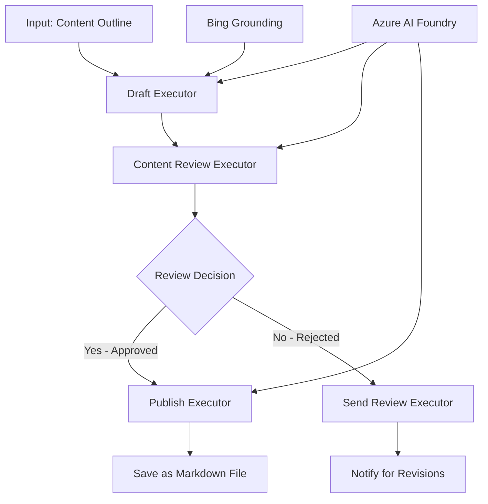

<!--
CO_OP_TRANSLATOR_METADATA:
{
  "original_hash": "8abd335151cee553293b637ee3d80d10",
  "translation_date": "2025-11-11T12:27:05+00:00",
  "source_file": "08-multi-agent/code_samples/workflows-agent-framework/dotNET/04.dotnet-agent-framework-workflow-aifoundry-condition.md",
  "language_code": "hu"
}
-->
# 🔀 Feltételes ügynök munkafolyamatok az Azure AI Foundry-val (.NET)

## 📋 Intelligens döntésalapú munkafolyamat bemutató

Ez a jegyzetfüzet bemutatja a **feltételes munkafolyamat mintákat** az Azure AI Foundry és a Microsoft Agent Framework for .NET segítségével. Megtanulhatod, hogyan építs fel kifinomult, döntésvezérelt munkafolyamatokat, amelyek intelligensen irányítják a feldolgozást AI elemzés, üzleti szabályok és dinamikus feltételek alapján vállalati szintű automatizálás érdekében.

## 🎯 Tanulási célok

### 🧠 **Intelligens döntési architektúra**
- **Feltételes logika megvalósítása**: Összetett döntési fákat építeni több elágazási ponttal
- **AI-alapú irányítás**: Az Azure AI Foundry modellek használata intelligens irányítási döntésekhez
- **Dinamikus munkafolyamat adaptáció**: A munkafolyamat viselkedésének módosítása futásidejű elemzés és feltételek alapján
- **Vállalati szabályok integrációja**: Üzleti logika és megfelelőségi követelmények beépítése a munkafolyamatokba

### 🔀 **Haladó feltételes minták**
- **Több kritériumú döntéshozatal**: Több tényező értékelése az irányítási döntésekhez
- **Kontekstuális feldolgozás**: Döntések meghozatala a munkafolyamat kontextusa és története alapján
- **Adaptív munkafolyamat módosítás**: Feldolgozási utak dinamikus módosítása valós idejű feltételek alapján
- **Szabálymotor integráció**: Összetett üzleti szabálymotorok megvalósítása a munkafolyamatokban

### 🏢 **Vállalati feltételes alkalmazások**
- **Dokumentum osztályozás és irányítás**: Dokumentumok automatikus osztályozása és irányítása megfelelő munkafolyamatokba
- **Ügyfélszolgálati triázs**: Ügyfélmegkeresések intelligens irányítása speciális kezelőcsapatokhoz
- **Megfelelőség és kockázat feldolgozás**: Különböző validációs és felülvizsgálati folyamatok alkalmazása kockázatértékelés alapján
- **Minőségbiztosítási munkafolyamatok**: Tartalom irányítása megfelelő felülvizsgálati folyamatokon minőségi mutatók alapján

## ⚙️ Előfeltételek és beállítás

### 📦 **Szükséges NuGet csomagok**

Haladó csomagok feltételes munkafolyamat feldolgozáshoz:

```xml
<!-- Core AI Framework -->
<PackageReference Include="Microsoft.Extensions.AI" Version="9.9.0" />

<!-- Azure AI Agents with Persistent State -->
<PackageReference Include="Azure.AI.Agents.Persistent" Version="1.2.0-beta.5" />

<!-- Azure Identity and Utilities -->
<PackageReference Include="Azure.Identity" Version="1.15.0" />
<PackageReference Include="System.Linq.Async" Version="6.0.3" />
<PackageReference Include="DotNetEnv" Version="3.1.1" />

<!-- Local Workflow Framework References -->
<!-- Microsoft.Agents.Workflows.dll - Advanced workflow orchestration -->
<!-- Microsoft.Agents.AI.AzureAI.dll - Azure AI Foundry integration -->
<!-- Microsoft.Agents.AI.dll - Core agent abstractions -->
```

### 🔑 **Azure AI Foundry konfiguráció**

**Szükséges Azure erőforrások:**
- Azure AI Foundry munkaterület feltételes feldolgozási modellekkel
- Azure előfizetés megfelelő számítási kvótákkal és jogosultságokkal
- Döntéshozatalhoz és tartalomelemzéshez telepített AI modellek
- (Opcionális) Bing Search API kapcsolat alapozási képességekhez

**Környezet konfiguráció (.env fájl):**
```env
# Azure AI Foundry Configuration
AZURE_AI_PROJECT_ENDPOINT=https://your-project.cognitiveservices.azure.com/
BING_CONNECTION_ID=your-bing-connection-id
```

**Hitelesítési beállítások:**
```csharp
// Azure CLI or Managed Identity authentication
using Azure.Identity;
var credential = new AzureCliCredential();

// Load environment configuration
DotNetEnv.Env.Load("../../../.env");
```

### 🏗️ **Feltételes munkafolyamat architektúra**



**Kulcskomponensek:**
- **Draft Executor**: AI ügynök, amely vázlatokat készít tartalomtervek alapján
- **Content Review Executor**: AI ügynök, amely értékeli a vázlat minőségét és megfelelőségét
- **Feltételes irányítás**: Döntési logika, amely az értékelési eredmények alapján irányít
- **Publikálási/felülvizsgálati utak**: Külön feldolgozási utak jóváhagyott és elutasított tartalomhoz
- **Állapotkezelés**: Tartalom és felülvizsgálati kontextus fenntartása a munkafolyamat során

## 🎨 **Feltételes munkafolyamat tervezési minták**

### 📋 **Tartalomgyártás minőségi kapukkal**
```
Outline → Draft Creation → Quality Review → {Approve: Publish | Reject: Revise}
```

### 🎯 **Kockázatalapú dokumentumfeldolgozás**
```
Document → Risk Assessment → {Low: Standard | High: Enhanced Review}
```

### 🔍 **Intelligens ügyfélszolgálati irányítás**
```
Customer Query → Analysis → {Simple: FAQ Bot | Complex: Human Agent}
```

### 💼 **Megfelelőségvezérelt munkafolyamatok**
```
Content → Compliance Check → {Pass: Publish | Fail: Legal Review}
```

## 🏢 **Vállalati feltételes előnyök**

### 🎯 **Intelligens automatizálás**
- **Okos döntéshozatal**: AI-alapú irányítási döntések tartalomelemzés és kontextus alapján
- **Adaptív feldolgozás**: Munkafolyamatok, amelyek automatikusan alkalmazkodnak változó feltételekhez
- **Üzleti szabályok érvényesítése**: Összetett üzleti logika és szabályok automatikus alkalmazása
- **Kontekstuális irányítás**: Döntések a teljes munkafolyamat története és kontextusa alapján

### 📈 **Operatív kiválóság**
- **Erőforrások optimalizált elosztása**: Munka irányítása a legmegfelelőbb szakemberekhez és folyamatokhoz
- **Csökkentett manuális beavatkozás**: Az automatizált döntéshozatal minimalizálja az emberi irányítás szükségességét
- **Gyorsabb megoldási idők**: Közvetlen irányítás a megfelelő szakértelemhez és feldolgozási képességekhez
- **Következetes alkalmazás**: Üzleti szabályok és döntési kritériumok egységes alkalmazása

### 🛡️ **Kockázatkezelés és megfelelőség**
- **Automatizált kockázatértékelés**: AI-alapú értékelés tartalom és helyzet kockázati szintjeiről
- **Megfelelőség érvényesítése**: Automatikus irányítás a szükséges szabályozási folyamatokon keresztül
- **Biztonsági protokoll alkalmazása**: Fokozott biztonsági intézkedések alkalmazása kockázatértékelés alapján
- **Audit nyomvonal fenntartása**: Az irányítási döntések és indoklások teljes dokumentációja

### 📊 **Elemzés és folyamatos fejlesztés**
- **Döntési elemzés**: Az irányítási döntések hatékonyságának és pontosságának nyomon követése
- **Mintafelismerés**: Az irányítási döntések trendjeinek és mintáinak azonosítása idővel
- **Teljesítmény optimalizálás**: Döntési kritériumok és irányítási hatékonyság folyamatos fejlesztése
- **Üzleti intelligencia**: Bepillantás a tartalom jellemzőibe és feldolgozási követelményeibe

### 🔧 **Technikai kiválóság**
- **Állandó állapotkezelés**: Összetett állapot fenntartása a munkafolyamat végrehajtása során
- **Skálázható architektúra**: Nagy volumenű feltételes feldolgozási követelmények kezelése
- **Integrációs képességek**: Zökkenőmentes integráció meglévő üzleti rendszerekkel és folyamatokkal
- **Megfigyelés és láthatóság**: A munkafolyamat teljesítményének és döntéseinek átfogó nyomon követése

Építsünk intelligens, döntésvezérelt vállalati munkafolyamatokat .NET segítségével! 🚀

## 💻 A kód futtatása

A teljes megvalósítás elérhető a `04.dotnet-agent-framework-workflow-aifoundry-condition.cs` fájlban. Ez bemutatja a **tartalomgyártási munkafolyamatot minőségi kapukkal**:

### 🏗️ **Munkafolyamat architektúra**

```
Content Outline → Draft Creation → Quality Review → Conditional Routing:
                                                      ├─ Approved (>200 words) → Publish
                                                      └─ Rejected (<200 words) → Review Notification
```

**Ügynökök a munkafolyamatban:**
1. **Evangelist Agent**: Oktatóanyag vázlatokat készít Bing alapozással
2. **Content Reviewer Agent**: Értékeli a vázlat minőségét (szószám, teljesség)
3. **Publisher Agent**: Jóváhagyott tartalmat ment időbélyegzett Markdown fájlokként

**Egyedi végrehajtók:**
1. **DraftExecutor**: Vázlatkészítést irányít
2. **ContentReviewExecutor**: Minőségértékelést végez
3. **PublishExecutor**: Jóváhagyott tartalom publikálását kezeli
4. **SendReviewExecutor**: Elutasított tartalom értesítéseit kezeli

### 🚀 Példa futtatása

**Előfeltételek:**
- Azure AI Foundry munkaterület konfigurálva
- Azure CLI hitelesítés (`az login`)
- (Opcionális) Bing Search kapcsolat alapozáshoz

```bash
# Make the script executable (Unix/Linux/macOS)
chmod +x 04.dotnet-agent-framework-workflow-aifoundry-condition.cs

# Run the conditional workflow
./04.dotnet-agent-framework-workflow-aifoundry-condition.cs
```

Windows rendszeren:
```powershell
dotnet run 04.dotnet-agent-framework-workflow-aifoundry-condition.cs
```

### 📝 Várható kimenet

A munkafolyamat:
1. **Ügynökök létrehozása**: Három specializált Azure AI Foundry ügynök inicializálása
2. **Vázlat készítése**: Az Evangelist ügynök oktatóanyag vázlatot készít terv alapján
3. **Tartalom felülvizsgálata**: A Content Reviewer értékeli a vázlat minőségét
4. **Feltételes irányítás**:
   - **Ha jóváhagyott (>200 szó)**: A PublishExecutor Markdown fájlként menti
   - **Ha elutasított (<200 szó)**: Felülvizsgálati értesítést küld
5. **Eredmények megjelenítése**: A végső munkafolyamat kimenetének megjelenítése

### 🔧 Testreszabási lehetőségek

**Felülvizsgálati kritériumok módosítása:**
```csharp
const string ContentReviewerInstructions = @"
You are a content reviewer...
1. Check if content is more than 500 words (instead of 200)
2. Verify technical accuracy
3. Ensure proper formatting
...";
```

**További feltételes utak hozzáadása:**
```csharp
var workflow = new WorkflowBuilder(draftExecutor)
    .AddEdge(draftExecutor, contentReviewerExecutor)
    .AddEdge(contentReviewerExecutor, publishExecutor, condition: GetCondition("Excellent"))
    .AddEdge(contentReviewerExecutor, editExecutor, condition: GetCondition("Good"))
    .AddEdge(contentReviewerExecutor, sendReviewerExecutor, condition: GetCondition("Poor"))
    .Build();
```

**Tartalmi követelmények megváltoztatása:**
```csharp
string OUTLINE_Content = @"
# Your Custom Topic
## Section 1
https://your-reference-url
## Section 2
...
";
```

### 🎯 Valós alkalmazások

Ez a feltételes munkafolyamat minta ideális:
- **Tartalomkezelő rendszerekhez**: Automatikus szerkesztési munkafolyamatok minőségi kapukkal
- **Dokumentumfeldolgozáshoz**: Dokumentumok irányítása osztályozás és megfelelőség alapján
- **Ügyfélszolgálathoz**: Intelligens jegyirányítás bonyolultság és sürgősség alapján
- **Jogi felülvizsgálathoz**: Szerződések irányítása kockázatértékelés és érték alapján
- **HR folyamatokhoz**: Jelentkezések irányítása megfelelő szűrési munkafolyamatokon keresztül

### 🔍 Feltételes logika megértése

**Feltétel függvény:**
```csharp
public Func<object?, bool> GetCondition(string expectedResult) =>
    reviewResult => reviewResult is ReviewResult review && review.Result == expectedResult;
```

Ez a függvény létrehoz egy predikátumot, amely:
1. Ellenőrzi, hogy az eredmény `ReviewResult` típusú-e
2. Összehasonlítja a `Result` tulajdonságot a várt értékkel
3. Igaz/hamis értéket ad vissza az irányítás meghatározásához

**Munkafolyamat élek feltételekkel:**
```csharp
.AddEdge(contentReviewerExecutor, publishExecutor, condition: GetCondition("Yes"))
.AddEdge(contentReviewerExecutor, sendReviewerExecutor, condition: GetCondition("No"))
```

### 📊 Haladó funkciók

**JSON séma validáció:**
A munkafolyamat JSON sémákat használ a strukturált válaszok biztosításához:

```csharp
// Define response structure
public class ReviewResult
{
    [JsonPropertyName("review_result")]
    public string Result { get; set; } = string.Empty;
    
    [JsonPropertyName("reason")]
    public string Reason { get; set; } = string.Empty;
    
    [JsonPropertyName("draft_content")]
    public string DraftContent { get; set; } = string.Empty;
}

// Apply to agent
ResponseFormat = ChatResponseFormat.ForJsonSchema(
    AIJsonUtilities.CreateJsonSchema(typeof(ReviewResult)), 
    "ReviewResult", 
    "Review Result From DraftContent"
)
```

**Bing alapozási integráció:**
Az Evangelist ügynök Bing alapozást használ valós idejű információk eléréséhez:

```csharp
var bingGroundingConfig = new BingGroundingSearchConfiguration(bing_conn_id);
BingGroundingToolDefinition bingGroundingTool = new(
    new BingGroundingSearchToolParameters([bingGroundingConfig])
);
```

Ez lehetővé teszi az ügynök számára, hogy kövesse az outline-ban található URL-eket és kinyerje az aktuális információkat.

### 🛡️ Hibakezelés

A munkafolyamat robusztus hibakezelést tartalmaz az elutasított tartalomhoz:
- Felülvizsgálati hibák az alternatív utat indítják
- Értesítések egyértelmű elutasítási okokat adnak
- A tartalom megőrzésre kerül átdolgozás céljából

### 🔄 A munkafolyamat kiterjesztése

**Hozzáadás egy átdolgozási körhöz:**
Hozz létre egy visszacsatolási hurkot, amely automatikusan újravázlatolja a tartalmat:

```csharp
.AddEdge(contentReviewerExecutor, publishExecutor, condition: GetCondition("Yes"))
.AddEdge(contentReviewerExecutor, draftExecutor, condition: GetCondition("No")) // Loop back
```

**Többszintű felülvizsgálat megvalósítása:**
Adj hozzá több felülvizsgálati szakaszt különböző kritériumokkal:

```csharp
.AddEdge(draftExecutor, technicalReviewer)
.AddEdge(technicalReviewer, editorialReviewer, condition: GetCondition("TechPass"))
.AddEdge(editorialReviewer, publishExecutor, condition: GetCondition("EditPass"))
```

Ez a feltételes munkafolyamat minta alapot nyújt kifinomult, intelligens vállalati automatizálási rendszerek építéséhez! 🚀

---

<!-- CO-OP TRANSLATOR DISCLAIMER START -->
**Felelősség kizárása**:  
Ez a dokumentum az [Co-op Translator](https://github.com/Azure/co-op-translator) AI fordítási szolgáltatás segítségével lett lefordítva. Bár törekszünk a pontosságra, kérjük, vegye figyelembe, hogy az automatikus fordítások hibákat vagy pontatlanságokat tartalmazhatnak. Az eredeti dokumentum az eredeti nyelvén tekintendő hiteles forrásnak. Kritikus információk esetén javasolt professzionális emberi fordítást igénybe venni. Nem vállalunk felelősséget semmilyen félreértésért vagy téves értelmezésért, amely a fordítás használatából eredhet.
<!-- CO-OP TRANSLATOR DISCLAIMER END -->