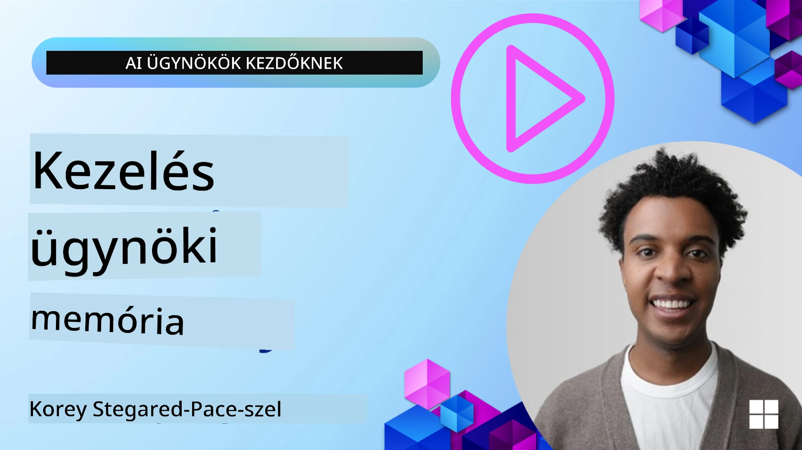

<!--
CO_OP_TRANSLATOR_METADATA:
{
  "original_hash": "a1d90991499ad697c4ad24decaf36968",
  "translation_date": "2025-12-09T12:40:58+00:00",
  "source_file": "13-agent-memory/README.md",
  "language_code": "hu"
}
-->
# Memória AI ügynökök számára 

Amikor az AI ügynökök létrehozásának egyedi előnyeiről beszélünk, két fő dolog kerül előtérbe: az eszközök használatának képessége a feladatok elvégzéséhez, valamint az idővel történő fejlődés képessége. A memória az alapja annak, hogy önfejlesztő ügynököket hozzunk létre, amelyek jobb élményeket nyújthatnak a felhasználóink számára.

Ebben a leckében megvizsgáljuk, mi is az AI ügynökök memóriája, hogyan kezelhetjük és használhatjuk azt alkalmazásaink javára.

## Bevezetés

Ez a lecke az alábbiakat fogja tárgyalni:

• **Az AI ügynök memória megértése**: Mi a memória, és miért elengedhetetlen az ügynökök számára.

• **Memória megvalósítása és tárolása**: Gyakorlati módszerek az AI ügynökök memória képességeinek hozzáadására, különös tekintettel a rövid és hosszú távú memóriára.

• **Önfejlesztő AI ügynökök létrehozása**: Hogyan teszi lehetővé a memória az ügynökök számára, hogy tanuljanak a korábbi interakciókból és idővel fejlődjenek.

## Elérhető megvalósítások

Ez a lecke két átfogó notebook oktatóanyagot tartalmaz:

• **[13-agent-memory.ipynb](./13-agent-memory.ipynb)**: Memóriát valósít meg a Mem0 és az Azure AI Search segítségével a Semantic Kernel keretrendszerben.

• **[13-agent-memory-cognee.ipynb](./13-agent-memory-cognee.ipynb)**: Strukturált memóriát valósít meg a Cognee segítségével, automatikusan tudásgrafikonokat épít beágyazásokkal, grafikonokat vizualizál, és intelligens visszakeresést végez.

## Tanulási célok

A lecke elvégzése után képes leszel:

• **Megkülönböztetni az AI ügynök memória különböző típusait**, beleértve a munkamemóriát, rövid és hosszú távú memóriát, valamint a specializált formákat, mint például a személyiség és epizodikus memória.

• **Rövid és hosszú távú memória megvalósítása és kezelése AI ügynökök számára** a Semantic Kernel keretrendszer segítségével, olyan eszközök használatával, mint a Mem0, Cognee, Whiteboard memória, és az Azure AI Search integrációja.

• **Megérteni az önfejlesztő AI ügynökök mögötti elveket**, és hogy a robusztus memória kezelési rendszerek hogyan járulnak hozzá a folyamatos tanuláshoz és alkalmazkodáshoz.

## Az AI ügynök memória megértése

Alapvetően **az AI ügynökök memóriája azokat a mechanizmusokat jelenti, amelyek lehetővé teszik számukra az információk megőrzését és visszahívását**. Ez az információ lehet konkrét részlet egy beszélgetésről, felhasználói preferenciák, korábbi cselekvések vagy akár tanult minták.

Memória nélkül az AI alkalmazások gyakran állapotmentesek, ami azt jelenti, hogy minden interakció nulláról indul. Ez ismétlődő és frusztráló felhasználói élményhez vezet, ahol az ügynök "elfelejti" a korábbi kontextust vagy preferenciákat.

### Miért fontos a memória?

Az ügynök intelligenciája szorosan összefügg azzal, hogy képes-e visszahívni és felhasználni a korábbi információkat. A memória lehetővé teszi az ügynökök számára, hogy:

• **Reflektívak legyenek**: Tanuljanak a korábbi cselekvésekből és eredményekből.

• **Interaktívak legyenek**: Fenntartsák a kontextust egy folyamatban lévő beszélgetés során.

• **Proaktívak és reaktívak legyenek**: Előre jelezzék az igényeket vagy megfelelően reagáljanak a történelmi adatok alapján.

• **Autonómak legyenek**: Függetlenebbül működjenek a tárolt tudás felhasználásával.

A memória megvalósításának célja, hogy az ügynökök megbízhatóbbak és képesebbek legyenek.

### Memória típusai

#### Munkamemória

Gondolj rá úgy, mint egy darab jegyzetpapírra, amelyet az ügynök egyetlen, folyamatban lévő feladat vagy gondolatmenet során használ. Ez tartalmazza az azonnali információkat, amelyek szükségesek a következő lépés kiszámításához.

Az AI ügynökök esetében a munkamemória gyakran a beszélgetés legrelevánsabb információit rögzíti, még akkor is, ha a teljes csevegési előzmény hosszú vagy rövidített. A kulcselemek, mint például követelmények, javaslatok, döntések és cselekvések kiemelésére összpontosít.

**Munkamemória példa**

Egy utazási foglalási ügynök esetében a munkamemória rögzítheti a felhasználó aktuális kérését, például "Szeretnék egy utat foglalni Párizsba". Ez a konkrét követelmény az ügynök azonnali kontextusában marad, hogy irányítsa a jelenlegi interakciót.

#### Rövid távú memória

Ez a memória típus egyetlen beszélgetés vagy munkamenet idejére őrzi meg az információkat. Ez a jelenlegi csevegés kontextusa, amely lehetővé teszi az ügynök számára, hogy visszautaljon a párbeszéd korábbi fordulataira.

**Rövid távú memória példa**

Ha egy felhasználó megkérdezi: "Mennyibe kerülne egy repülőjegy Párizsba?" majd folytatja: "Mi a helyzet a szállással ott?", a rövid távú memória biztosítja, hogy az ügynök tudja, hogy "ott" Párizsra utal az adott beszélgetésen belül.

#### Hosszú távú memória

Ez az információ több beszélgetésen vagy munkameneten keresztül fennmarad. Lehetővé teszi az ügynökök számára, hogy emlékezzenek a felhasználói preferenciákra, történelmi interakciókra vagy általános tudásra hosszabb időszakokon keresztül. Ez fontos a személyre szabás szempontjából.

**Hosszú távú memória példa**

A hosszú távú memória tárolhatja, hogy "Ben szeret síelni és szabadtéri tevékenységeket, szereti a kávét hegyi kilátással, és el akarja kerülni a haladó sípályákat egy korábbi sérülés miatt". Ez az információ, amelyet korábbi interakciókból tanult, befolyásolja a javaslatokat a jövőbeli utazástervezési munkamenetek során, rendkívül személyre szabottá téve azokat.

#### Személyiség memória

Ez a specializált memória típus segít az ügynöknek egy következetes "személyiség" vagy "szerep" kialakításában. Lehetővé teszi az ügynök számára, hogy emlékezzen önmagára vagy a szándékolt szerepére, így az interakciók gördülékenyebbek és fókuszáltabbak lesznek.

**Személyiség memória példa**

Ha az utazási ügynököt "síelési szakértőként" tervezték, a személyiség memória megerősítheti ezt a szerepet, befolyásolva a válaszait, hogy azok egy szakértő hangneméhez és tudásához igazodjanak.

#### Munkafolyamat/Epizodikus memória

Ez a memória tárolja az ügynök által végrehajtott lépések sorozatát egy összetett feladat során, beleértve a sikereket és kudarcokat. Olyan, mintha az ügynök "epizódokat" vagy korábbi tapasztalatokat emlékezne meg, hogy tanuljon belőlük.

**Epizodikus memória példa**

Ha az ügynök megpróbált lefoglalni egy konkrét járatot, de az nem sikerült elérhetőség hiánya miatt, az epizodikus memória rögzítheti ezt a kudarcot, lehetővé téve az ügynök számára, hogy alternatív járatokat próbáljon ki, vagy tájékoztassa a felhasználót a problémáról egy következő próbálkozás során.

#### Entitás memória

Ez magában foglalja konkrét entitások (például emberek, helyek vagy dolgok) és események kivonását és megjegyzését a beszélgetésekből. Lehetővé teszi az ügynök számára, hogy strukturált megértést építsen a megbeszélt kulcselemekről.

**Entitás memória példa**

Egy korábbi utazásról szóló beszélgetésből az ügynök kivonhatja "Párizs", "Eiffel-torony" és "vacsora a Le Chat Noir étteremben" entitásokat. Egy jövőbeli interakció során az ügynök emlékezhet a "Le Chat Noir"-ra, és felajánlhatja, hogy új foglalást készít ott.

#### Strukturált RAG (Retrieval Augmented Generation)

Bár a RAG egy általános technika, a "Strukturált RAG" kiemelkedik, mint egy erőteljes memória technológia. Sűrű, strukturált információkat von ki különböző forrásokból (beszélgetések, e-mailek, képek), és használja a pontosság, visszahívás és válaszsebesség javítására. A klasszikus RAG-tól eltérően, amely kizárólag szemantikai hasonlóságra támaszkodik, a Strukturált RAG az információk belső struktúrájával dolgozik.

**Strukturált RAG példa**

Ahelyett, hogy csak kulcsszavakat párosítana, a Strukturált RAG képes lenne elemezni repülési részleteket (célállomás, dátum, idő, légitársaság) egy e-mailből, és strukturált módon tárolni azokat. Ez lehetővé teszi a pontos lekérdezéseket, például "Melyik járatot foglaltam Párizsba kedden?"

## Memória megvalósítása és tárolása

Az AI ügynökök memóriájának megvalósítása egy **memóriakezelési** folyamatot foglal magában, amely magában foglalja az információk generálását, tárolását, visszakeresését, integrálását, frissítését, sőt "elfelejtését" (vagy törlését). A visszakeresés különösen kritikus szempont.

### Specializált memória eszközök

#### Mem0

Az ügynök memória tárolásának és kezelésének egyik módja a specializált eszközök, például a Mem0 használata. A Mem0 egy tartós memória rétegként működik, lehetővé téve az ügynökök számára, hogy releváns interakciókat hívjanak vissza, felhasználói preferenciákat és tényszerű kontextust tároljanak, valamint tanuljanak a sikerekből és kudarcokból az idő múlásával. Az ötlet az, hogy az állapotmentes ügynökök állapotossá váljanak.

Ez egy **kétfázisú memória csővezetéken keresztül működik: kivonás és frissítés**. Először az ügynök szálához hozzáadott üzeneteket elküldik a Mem0 szolgáltatásnak, amely egy Nagy Nyelvi Modell (LLM) segítségével összefoglalja a beszélgetési előzményeket és új emlékeket von ki. Ezt követően egy LLM-alapú frissítési fázis határozza meg, hogy hozzáadja, módosítja vagy törli ezeket az emlékeket, és hibrid adatbázisban tárolja őket, amely tartalmazhat vektor, grafikon és kulcs-érték adatbázisokat. Ez a rendszer különböző memória típusokat is támogat, és beépítheti a grafikon memóriát az entitások közötti kapcsolatok kezelésére.

#### Cognee

Egy másik hatékony megközelítés a **Cognee** használata, egy nyílt forráskódú szemantikai memória AI ügynökök számára, amely strukturált és strukturálatlan adatokat alakít át lekérdezhető tudásgrafikonokká, beágyazásokkal támogatva. A Cognee egy **kettős tároló architektúrát** kínál, amely ötvözi a vektor hasonlósági keresést a grafikon kapcsolatokkal, lehetővé téve az ügynökök számára, hogy ne csak azt értsék meg, milyen információk hasonlóak, hanem azt is, hogyan kapcsolódnak egymáshoz a fogalmak.

Kiemelkedik a **hibrid visszakeresésben**, amely ötvözi a vektor hasonlóságot, grafikon struktúrát és LLM érvelést - a nyers darabok keresésétől a grafikon-tudatos kérdés megválaszolásig. A rendszer **élő memóriát** tart fenn, amely fejlődik és növekszik, miközben egyetlen összekapcsolt grafikonként lekérdezhető marad, támogatva mind a rövid távú munkamenet kontextust, mind a hosszú távú tartós memóriát.

A Cognee notebook oktatóanyag ([13-agent-memory-cognee.ipynb](./13-agent-memory-cognee.ipynb)) bemutatja ennek az egységes memória rétegnek az építését, gyakorlati példákkal a különféle adatforrások bevitelére, a tudásgrafikon vizualizálására és különböző keresési stratégiák alkalmazására, amelyek az ügynökök specifikus igényeihez igazodnak.

### Memória tárolása RAG segítségével

A Mem0-hoz hasonló specializált memória eszközökön túl robusztus keresési szolgáltatásokat is használhatsz, például **Azure AI Search-t a memóriák tárolására és visszakeresésére**, különösen a strukturált RAG esetében.

Ez lehetővé teszi, hogy az ügynök válaszait a saját adataiddal alapozd meg, biztosítva a relevánsabb és pontosabb válaszokat. Az Azure AI Search használható felhasználó-specifikus utazási emlékek, termékkatalógusok vagy bármilyen más domain-specifikus tudás tárolására.

Az Azure AI Search támogatja a **Strukturált RAG** képességeket, amelyek kiválóan alkalmasak sűrű, strukturált információk kinyerésére és visszakeresésére nagy adatállományokból, például beszélgetési előzményekből, e-mailekből vagy akár képekből. Ez "emberfeletti pontosságot és visszahívást" biztosít a hagyományos szövegdarabolási és beágyazási megközelítésekhez képest.

## AI ügynökök önfejlesztése

Az önfejlesztő ügynökök gyakori mintája egy **"tudás ügynök"** bevezetése. Ez a különálló ügynök megfigyeli a fő beszélgetést a felhasználó és az elsődleges ügynök között. Feladata:

1. **Értékes információk azonosítása**: Meghatározza, hogy a beszélgetés mely része érdemes általános tudásként vagy konkrét felhasználói preferenciaként megőrizni.

2. **Kivonás és összefoglalás**: A beszélgetésből származó lényeges tanulás vagy preferencia kivonása.

3. **Tárolás egy tudásbázisban**: Az így kivont információk tartósítása, gyakran egy vektor adatbázisban, hogy később visszakereshető legyen.

4. **Jövőbeli lekérdezések kiegészítése**: Amikor a felhasználó új lek

---

<!-- CO-OP TRANSLATOR DISCLAIMER START -->
**Felelősség kizárása**:  
Ez a dokumentum az [Co-op Translator](https://github.com/Azure/co-op-translator) AI fordítási szolgáltatás segítségével lett lefordítva. Bár törekszünk a pontosságra, kérjük, vegye figyelembe, hogy az automatikus fordítások hibákat vagy pontatlanságokat tartalmazhatnak. Az eredeti dokumentum az eredeti nyelvén tekintendő hiteles forrásnak. Fontos információk esetén javasolt professzionális emberi fordítást igénybe venni. Nem vállalunk felelősséget semmilyen félreértésért vagy téves értelmezésért, amely a fordítás használatából eredhet.
<!-- CO-OP TRANSLATOR DISCLAIMER END -->