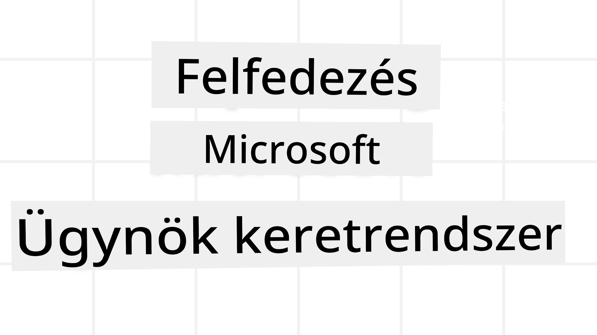
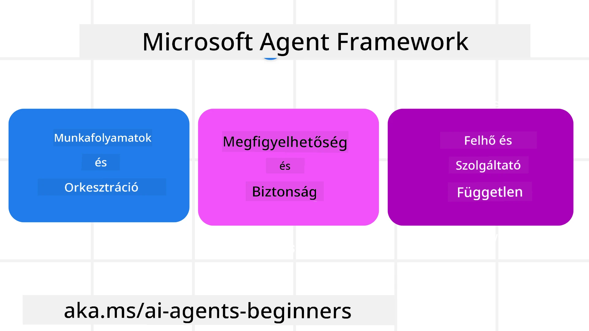
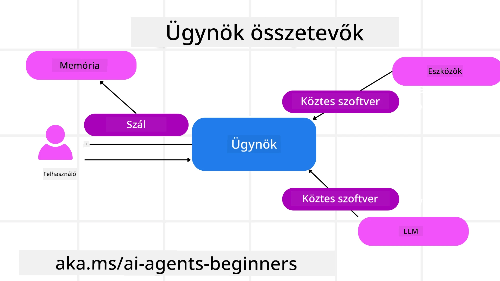

<!--
CO_OP_TRANSLATOR_METADATA:
{
  "original_hash": "19c4dab375acbc733855cc7f2f04edbc",
  "translation_date": "2025-10-02T08:59:27+00:00",
  "source_file": "14-microsoft-agent-framework/README.md",
  "language_code": "hu"
}
-->
# A Microsoft Agent Framework felfedezése



### Bevezetés

Ebben a leckében szó lesz:

- A Microsoft Agent Framework megértése: Főbb jellemzők és érték  
- A Microsoft Agent Framework kulcsfogalmainak felfedezése  
- MAF összehasonlítása a Semantic Kernel és AutoGen keretrendszerekkel: Migrációs útmutató  

## Tanulási célok

A lecke elvégzése után képes leszel:

- Gyártásra kész AI ügynököket építeni a Microsoft Agent Framework segítségével  
- Alkalmazni a Microsoft Agent Framework alapvető funkcióit az ügynöki felhasználási eseteidben  
- Migrálni és integrálni meglévő ügynöki keretrendszereket és eszközöket  

## Kódminták

A [Microsoft Agent Framework (MAF)](https://aka.ms/ai-agents-beginners/agent-framewrok) kódmintái megtalálhatók ebben a repóban az `xx-python-agent-framework` és `xx-dotnet-agent-framework` fájlok alatt.

## A Microsoft Agent Framework megértése



A [Microsoft Agent Framework (MAF)](https://aka.ms/ai-agents-beginners/agent-framewrok) a Semantic Kernel és AutoGen tapasztalataira és tanulságaira épít. Rugalmasságot kínál a különféle ügynöki felhasználási esetek kezelésére, amelyek gyártási és kutatási környezetekben egyaránt előfordulnak, például:

- **Szekvenciális ügynökök összehangolása** olyan helyzetekben, ahol lépésről lépésre történő munkafolyamatokra van szükség.  
- **Párhuzamos összehangolás** olyan helyzetekben, ahol az ügynököknek egyszerre kell feladatokat végrehajtaniuk.  
- **Csoportos csevegés összehangolása** olyan helyzetekben, ahol az ügynökök együttműködve dolgoznak egy feladaton.  
- **Feladatátadás összehangolása** olyan helyzetekben, ahol az ügynökök egymásnak adják át a feladatot, ahogy az alfeladatok elkészülnek.  
- **Mágneses összehangolás** olyan helyzetekben, ahol egy menedzser ügynök létrehozza és módosítja a feladatlistát, valamint koordinálja az alügynököket a feladatok elvégzéséhez.  

A gyártásban alkalmazott AI ügynökök szállításához a MAF a következő funkciókat is tartalmazza:

- **Megfigyelhetőség** az OpenTelemetry használatával, amely lehetővé teszi az AI ügynök minden tevékenységének nyomon követését, beleértve az eszközök meghívását, az összehangolási lépéseket, az érvelési folyamatokat és a teljesítményfigyelést az Azure AI Foundry műszerfalain keresztül.  
- **Biztonság** az ügynökök natív hosztolásával az Azure AI Foundry-n, amely biztonsági kontrollokat tartalmaz, például szerepkör-alapú hozzáférést, privát adatkezelést és beépített tartalombiztonságot.  
- **Tartósság** mivel az ügynök szálak és munkafolyamatok szüneteltethetők, folytathatók és hibákból helyreállíthatók, ami lehetővé teszi a hosszabb folyamatok futtatását.  
- **Irányítás** mivel emberi beavatkozást igénylő munkafolyamatok is támogatottak, ahol a feladatokat emberi jóváhagyásra jelölik.  

A Microsoft Agent Framework interoperabilitásra is törekszik:

- **Felhőfüggetlenség** - Az ügynökök konténerekben, helyben és különböző felhőkben futtathatók.  
- **Szolgáltatófüggetlenség** - Az ügynökök létrehozhatók a preferált SDK használatával, beleértve az Azure OpenAI-t és az OpenAI-t.  
- **Nyílt szabványok integrálása** - Az ügynökök protokollokat, például Agent-to-Agent (A2A) és Model Context Protocol (MCP) használhatnak más ügynökök és eszközök felfedezésére és használatára.  
- **Pluginok és csatlakozók** - Kapcsolatok létesíthetők adat- és memóriaszolgáltatásokkal, például Microsoft Fabric, SharePoint, Pinecone és Qdrant.  

Nézzük meg, hogyan alkalmazhatók ezek a funkciók a Microsoft Agent Framework alapfogalmaira.

## A Microsoft Agent Framework kulcsfogalmai

### Ügynökök



**Ügynökök létrehozása**

Az ügynökök létrehozása az inferencia szolgáltatás (LLM szolgáltató), egy utasításkészlet és egy hozzárendelt `név` meghatározásával történik:

```python
agent = AzureOpenAIChatClient(credential=AzureCliCredential()).create_agent( instructions="You are good at recommending trips to customers based on their preferences.", name="TripRecommender" )
```
  
A fenti példa az `Azure OpenAI`-t használja, de ügynökök létrehozhatók különféle szolgáltatásokkal, például az `Azure AI Foundry Agent Service`-szel:

```python
AzureAIAgentClient(async_credential=credential).create_agent( name="HelperAgent", instructions="You are a helpful assistant." ) as agent
```
  
OpenAI `Responses`, `ChatCompletion` API-k

```python
agent = OpenAIResponsesClient().create_agent( name="WeatherBot", instructions="You are a helpful weather assistant.", )
```
  
```python
agent = OpenAIChatClient().create_agent( name="HelpfulAssistant", instructions="You are a helpful assistant.", )
```
  
vagy távoli ügynökök az A2A protokoll használatával:

```python
agent = A2AAgent( name=agent_card.name, description=agent_card.description, agent_card=agent_card, url="https://your-a2a-agent-host" )
```
  
**Ügynökök futtatása**

Az ügynökök a `.run` vagy `.run_stream` metódusokkal futtathatók nem streaming vagy streaming válaszokhoz.

```python
result = await agent.run("What are good places to visit in Amsterdam?")
print(result.text)
```
  
```python
async for update in agent.run_stream("What are the good places to visit in Amsterdam?"):
    if update.text:
        print(update.text, end="", flush=True)

```
  
Minden ügynök futtatásnál lehetőség van paraméterek testreszabására, például az ügynök által használt `max_tokens`, az ügynök által hívható `tools`, sőt még az ügynök által használt `model` is.

Ez hasznos olyan esetekben, amikor specifikus modellekre vagy eszközökre van szükség a felhasználó feladatának elvégzéséhez.

**Eszközök**

Az eszközök meghatározhatók az ügynök definiálásakor:

```python
def get_attractions( location: Annotated[str, Field(description="The location to get the top tourist attractions for")], ) -> str: """Get the top tourist attractions for a given location.""" return f"The top attractions for {location} are." 


# When creating a ChatAgent directly 

agent = ChatAgent( chat_client=OpenAIChatClient(), instructions="You are a helpful assistant", tools=[get_attractions]

```
  
és az ügynök futtatásakor is:

```python

result1 = await agent.run( "What's the best place to visit in Seattle?", tools=[get_attractions] # Tool provided for this run only )
```
  
**Ügynökszálak**

Az ügynökszálak többfordulós beszélgetések kezelésére szolgálnak. Szálak létrehozhatók:

- A `get_new_thread()` használatával, amely lehetővé teszi a szál időbeli mentését  
- Automatikusan szál létrehozásával az ügynök futtatásakor, amely csak az aktuális futtatás idejére tart.  

Szál létrehozásához a kód így néz ki:

```python
# Create a new thread. 
thread = agent.get_new_thread() # Run the agent with the thread. 
response = await agent.run("Hello, I am here to help you book travel. Where would you like to go?", thread=thread)

```
  
Ezután a szál sorosítható, hogy későbbi használatra elmenthető legyen:

```python
# Create a new thread. 
thread = agent.get_new_thread() 

# Run the agent with the thread. 

response = await agent.run("Hello, how are you?", thread=thread) 

# Serialize the thread for storage. 

serialized_thread = await thread.serialize() 

# Deserialize the thread state after loading from storage. 

resumed_thread = await agent.deserialize_thread(serialized_thread)
```
  
**Ügynöki köztes réteg**

Az ügynökök eszközökkel és LLM-ekkel lépnek kapcsolatba a felhasználói feladatok elvégzése érdekében. Bizonyos helyzetekben szeretnénk végrehajtani vagy nyomon követni ezeket az interakciókat. Az ügynöki köztes réteg lehetővé teszi ezt:

*Funkció köztes réteg*

Ez a köztes réteg lehetővé teszi egy művelet végrehajtását az ügynök és az általa hívott funkció/eszköz között. Például akkor használható, ha naplózni szeretnénk a funkcióhívást.

Az alábbi kódban a `next` határozza meg, hogy a következő köztes réteget vagy a tényleges funkciót kell-e hívni.

```python
async def logging_function_middleware(
    context: FunctionInvocationContext,
    next: Callable[[FunctionInvocationContext], Awaitable[None]],
) -> None:
    """Function middleware that logs function execution."""
    # Pre-processing: Log before function execution
    print(f"[Function] Calling {context.function.name}")

    # Continue to next middleware or function execution
    await next(context)

    # Post-processing: Log after function execution
    print(f"[Function] {context.function.name} completed")
```
  
*Csevegés köztes réteg*

Ez a köztes réteg lehetővé teszi egy művelet végrehajtását vagy naplózását az ügynök és az LLM közötti kérések között.

Ez fontos információkat tartalmaz, például az AI szolgáltatásnak küldött `messages`-eket.

```python
async def logging_chat_middleware(
    context: ChatContext,
    next: Callable[[ChatContext], Awaitable[None]],
) -> None:
    """Chat middleware that logs AI interactions."""
    # Pre-processing: Log before AI call
    print(f"[Chat] Sending {len(context.messages)} messages to AI")

    # Continue to next middleware or AI service
    await next(context)

    # Post-processing: Log after AI response
    print("[Chat] AI response received")

```
  
**Ügynöki memória**

Ahogy az `Agentic Memory` leckében tárgyaltuk, a memória fontos eleme az ügynökök különböző kontextusokban történő működésének. A MAF többféle memóriát kínál:

*Memóriatárolás*

Ez a memória az alkalmazás futási ideje alatt a szálakban tárolódik.

```python
# Create a new thread. 
thread = agent.get_new_thread() # Run the agent with the thread. 
response = await agent.run("Hello, I am here to help you book travel. Where would you like to go?", thread=thread)
```
  
*Tartós üzenetek*

Ez a memória a beszélgetési előzmények tárolására szolgál különböző munkamenetek között. A `chat_message_store_factory` segítségével definiálható:

```python
from agent_framework import ChatMessageStore

# Create a custom message store
def create_message_store():
    return ChatMessageStore()

agent = ChatAgent(
    chat_client=OpenAIChatClient(),
    instructions="You are a Travel assistant.",
    chat_message_store_factory=create_message_store
)

```
  
*Dinamikus memória*

Ez a memória a kontextushoz kerül hozzáadásra, mielőtt az ügynökök futtatásra kerülnének. Ezek a memóriák külső szolgáltatásokban, például mem0-ban tárolhatók:

```python
from agent_framework.mem0 import Mem0Provider

# Using Mem0 for advanced memory capabilities
memory_provider = Mem0Provider(
    api_key="your-mem0-api-key",
    user_id="user_123",
    application_id="my_app"
)

agent = ChatAgent(
    chat_client=OpenAIChatClient(),
    instructions="You are a helpful assistant with memory.",
    context_providers=memory_provider
)

```
  
**Ügynöki megfigyelhetőség**

A megfigyelhetőség fontos a megbízható és karbantartható ügynöki rendszerek építéséhez. A MAF integrálódik az OpenTelemetry-vel, hogy nyomkövetést és mérőszámokat biztosítson a jobb megfigyelhetőség érdekében.

```python
from agent_framework.observability import get_tracer, get_meter

tracer = get_tracer()
meter = get_meter()
with tracer.start_as_current_span("my_custom_span"):
    # do something
    pass
counter = meter.create_counter("my_custom_counter")
counter.add(1, {"key": "value"})
```
  

### Munkafolyamatok

A MAF előre definiált lépéseket kínál egy feladat elvégzéséhez, amelyek AI ügynököket tartalmaznak komponensként ezekben a lépésekben.

A munkafolyamatok különböző komponensekből állnak, amelyek jobb vezérlési folyamatot tesznek lehetővé. A munkafolyamatok lehetővé teszik a **több ügynök összehangolását** és **ellenőrzési pontok** létrehozását a munkafolyamat állapotának mentéséhez.

A munkafolyamatok alapvető komponensei:

**Végrehajtók**

A végrehajtók bemeneti üzeneteket kapnak, elvégzik a rájuk bízott feladatokat, majd kimeneti üzenetet állítanak elő. Ez előreviszi a munkafolyamatot a nagyobb feladat elvégzése felé. A végrehajtók lehetnek AI ügynökök vagy egyedi logikák.

**Élek**

Az élek az üzenetek áramlását határozzák meg egy munkafolyamatban. Ezek lehetnek:

*Direkt élek* - Egyszerű egy-az-egyhez kapcsolatok a végrehajtók között:

```python
from agent_framework import WorkflowBuilder

builder = WorkflowBuilder()
builder.add_edge(source_executor, target_executor)
builder.set_start_executor(source_executor)
workflow = builder.build()
```
  
*Feltételes élek* - Bizonyos feltételek teljesülése után aktiválódnak. Például, ha a szállodai szobák nem elérhetők, egy végrehajtó más lehetőségeket javasolhat.

*Switch-case élek* - Üzeneteket irányítanak különböző végrehajtókhoz meghatározott feltételek alapján. Például, ha az utazási ügyfél prioritásos hozzáféréssel rendelkezik, az ő feladatait egy másik munkafolyamat kezeli.

*Fan-out élek* - Egy üzenetet több célponthoz küldenek.

*Fan-in élek* - Több üzenetet gyűjtenek különböző végrehajtóktól, és egy célponthoz küldik.

**Események**

A munkafolyamatok jobb megfigyelhetősége érdekében a MAF beépített eseményeket kínál a végrehajtáshoz, például:

- `WorkflowStartedEvent` - A munkafolyamat végrehajtása megkezdődik  
- `WorkflowOutputEvent` - A munkafolyamat kimenetet állít elő  
- `WorkflowErrorEvent` - A munkafolyamat hibába ütközik  
- `ExecutorInvokeEvent` - A végrehajtó elkezdi a feldolgozást  
- `ExecutorCompleteEvent` - A végrehajtó befejezi a feldolgozást  
- `RequestInfoEvent` - Kérés kerül kiadásra  

## Migráció más keretrendszerekből (Semantic Kernel és AutoGen)

### Különbségek a MAF és a Semantic Kernel között

**Egyszerűsített ügynöklétrehozás**

A Semantic Kernel minden ügynökhöz Kernel példány létrehozását igényli. A MAF egyszerűsített megközelítést alkalmaz a fő szolgáltatókhoz tartozó kiterjesztések használatával.

```python
agent = AzureOpenAIChatClient(credential=AzureCliCredential()).create_agent( instructions="You are good at reccomending trips to customers based on their preferences.", name="TripRecommender" )
```
  
**Ügynökszál létrehozása**

A Semantic Kernel manuális szál létrehozást igényel. A MAF-ben az ügynök közvetlenül kap egy szálat.

```python
thread = agent.get_new_thread() # Run the agent with the thread. 
```
  
**Eszközregisztráció**

A Semantic Kernelben az eszközök a Kernelhez kerülnek regisztrálásra, majd a Kernel átadásra kerül az ügynöknek. A MAF-ben az eszközök közvetlenül az ügynök létrehozása során kerülnek regisztrálásra.

```python
agent = ChatAgent( chat_client=OpenAIChatClient(), instructions="You are a helpful assistant", tools=[get_attractions]
```
  

### Különbségek a MAF és az AutoGen között

**Csapatok vs Munkafolyamatok**

A `Csapatok` az eseménystruktúra az eseményvezérelt tevékenységekhez az AutoGen ügynökeivel. A MAF `Munkafolyamatokat` használ, amelyek grafikon alapú architektúrán keresztül irányítják az adatokat a végrehajtókhoz.

**Eszközlétrehozás**

Az AutoGen a `FunctionTool`-t használja a funkciók becsomagolására, amelyeket az ügynökök hívhatnak. A MAF az @ai_function-t használja, amely hasonlóan működik, de automatikusan következtet a funkciók sémáira.

**Ügynöki viselkedés**

Az AutoGenben az ügynökök alapértelmezés szerint egyfordulósak, hacsak a `max_tool_iterations` magasabb értékre nincs állítva. A MAF-ben a `ChatAgent` alapértelmezés szerint többfordulós, ami azt jelenti, hogy folyamatosan hívja az eszközöket, amíg a felhasználó feladata be nem fejeződik.

## Kódminták

A Microsoft Agent Framework kódmintái megtalálhatók ebben a repóban az `xx-python-agent-framework` és `xx-dotnet-agent-framework` fájlok alatt.

## További kérdéseid vannak a Microsoft Agent Frameworkről?

Csatlakozz az [Azure AI Foundry Discord](https://aka.ms/ai-agents/discord) közösséghez, hogy találkozz más tanulókkal, részt vegyél fogadóórákon, és választ kapj az AI ügynökökkel kapcsolatos kérdéseidre.

---

**Felelősségkizárás**:  
Ez a dokumentum az [Co-op Translator](https://github.com/Azure/co-op-translator) AI fordítási szolgáltatás segítségével készült. Bár törekszünk a pontosságra, kérjük, vegye figyelembe, hogy az automatikus fordítások hibákat vagy pontatlanságokat tartalmazhatnak. Az eredeti dokumentum az eredeti nyelvén tekintendő hiteles forrásnak. Kritikus információk esetén javasolt a professzionális, emberi fordítás igénybevétele. Nem vállalunk felelősséget a fordítás használatából eredő félreértésekért vagy téves értelmezésekért.