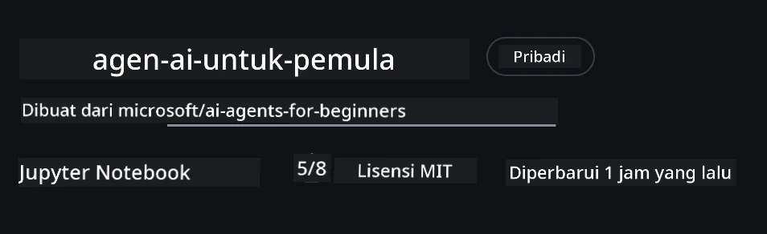
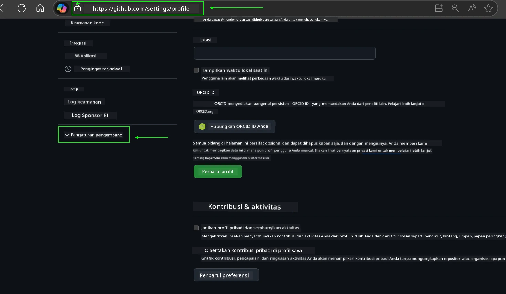
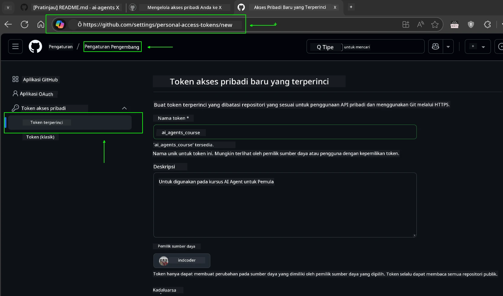
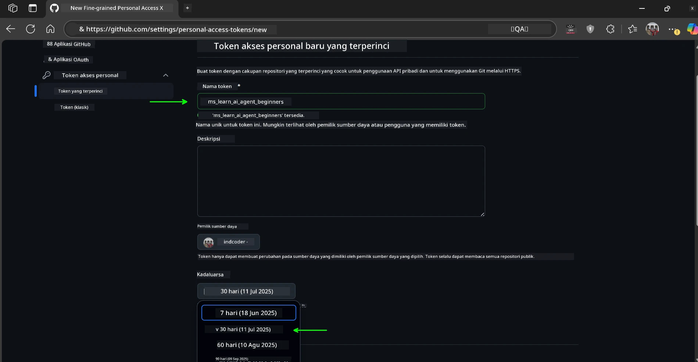
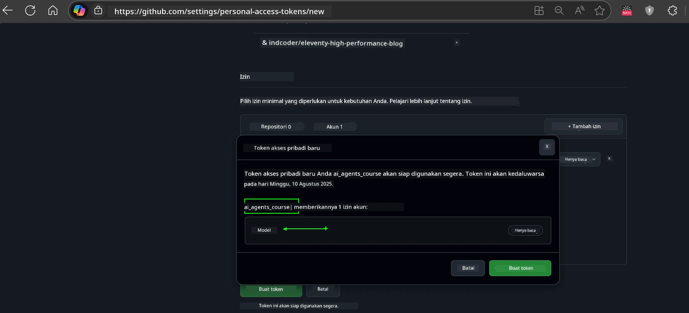
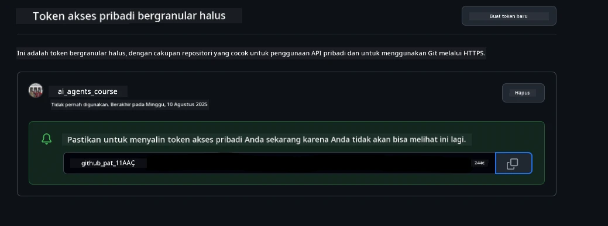
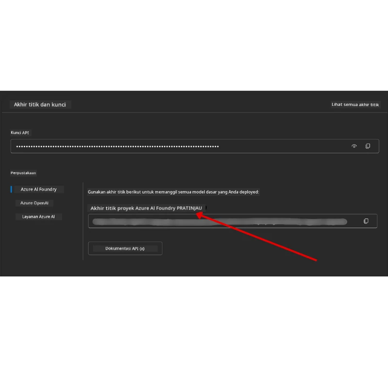

<!--
CO_OP_TRANSLATOR_METADATA:
{
  "original_hash": "63b1a8f6e840df15934935b728e569f0",
  "translation_date": "2025-12-03T14:43:21+00:00",
  "source_file": "00-course-setup/README.md",
  "language_code": "id"
}
-->
# Persiapan Kursus

## Pengantar

Pelajaran ini akan membahas cara menjalankan contoh kode dari kursus ini.

## Bergabung dengan Peserta Lain dan Dapatkan Bantuan

Sebelum Anda mulai mengkloning repositori Anda, bergabunglah dengan [saluran Discord AI Agents For Beginners](https://aka.ms/ai-agents/discord) untuk mendapatkan bantuan terkait pengaturan, pertanyaan tentang kursus, atau untuk terhubung dengan peserta lainnya.

## Kloning atau Fork Repositori Ini

Untuk memulai, silakan kloning atau fork Repositori GitHub. Ini akan membuat versi materi kursus Anda sendiri sehingga Anda dapat menjalankan, menguji, dan memodifikasi kode!

Ini dapat dilakukan dengan mengklik tautan untuk <a href="https://github.com/microsoft/ai-agents-for-beginners/fork" target="_blank">fork repositori</a>.

Sekarang Anda seharusnya memiliki versi fork dari kursus ini di tautan berikut:



### Kloning Shallow (disarankan untuk workshop / Codespaces)

  >Repositori penuh bisa cukup besar (~3 GB) jika Anda mengunduh seluruh riwayat dan semua file. Jika Anda hanya mengikuti workshop atau hanya membutuhkan beberapa folder pelajaran, kloning shallow (atau sparse clone) menghindari sebagian besar unduhan tersebut dengan memotong riwayat dan/atau melewati blob.

#### Kloning shallow cepat — riwayat minimal, semua file

Ganti `<your-username>` dalam perintah di bawah ini dengan URL fork Anda (atau URL upstream jika Anda lebih suka).

Untuk mengkloning hanya riwayat commit terbaru (unduhan kecil):

```bash|powershell
git clone --depth 1 https://github.com/<your-username>/ai-agents-for-beginners.git
```

Untuk mengkloning cabang tertentu:

```bash|powershell
git clone --depth 1 --branch <branch-name> https://github.com/<your-username>/ai-agents-for-beginners.git
```

#### Kloning parsial (sparse) — blob minimal + hanya folder yang dipilih

Ini menggunakan kloning parsial dan sparse-checkout (memerlukan Git 2.25+ dan disarankan menggunakan Git modern dengan dukungan kloning parsial):

```bash|powershell
git clone --depth 1 --filter=blob:none --sparse https://github.com/<your-username>/ai-agents-for-beginners.git
```

Masuk ke folder repositori:

```bash|powershell
cd ai-agents-for-beginners
```

Kemudian tentukan folder mana yang Anda inginkan (contoh di bawah menunjukkan dua folder):

```bash|powershell
git sparse-checkout set 00-course-setup 01-intro-to-ai-agents
```

Setelah mengkloning dan memverifikasi file, jika Anda hanya membutuhkan file dan ingin mengosongkan ruang (tanpa riwayat git), silakan hapus metadata repositori (💀tidak dapat diubah — Anda akan kehilangan semua fungsi Git: tidak ada commit, pull, push, atau akses riwayat).

```bash
# zsh/bash
rm -rf .git
```

```powershell
# PowerShell
Remove-Item -Recurse -Force .git
```

#### Menggunakan GitHub Codespaces (disarankan untuk menghindari unduhan besar lokal)

- Buat Codespace baru untuk repositori ini melalui [UI GitHub](https://github.com/codespaces).  

- Di terminal Codespace yang baru dibuat, jalankan salah satu perintah kloning shallow/sparse di atas untuk membawa hanya folder pelajaran yang Anda butuhkan ke dalam ruang kerja Codespace.
- Opsional: setelah mengkloning di dalam Codespaces, hapus .git untuk mengosongkan ruang ekstra (lihat perintah penghapusan di atas).
- Catatan: Jika Anda lebih suka membuka repositori langsung di Codespaces (tanpa kloning tambahan), harap diperhatikan bahwa Codespaces akan membangun lingkungan devcontainer dan mungkin tetap menyediakan lebih dari yang Anda butuhkan. Mengkloning salinan shallow di dalam Codespace baru memberi Anda lebih banyak kontrol atas penggunaan disk.

#### Tips

- Selalu ganti URL kloning dengan fork Anda jika Anda ingin mengedit/commit.
- Jika Anda nanti membutuhkan lebih banyak riwayat atau file, Anda dapat mengambilnya atau menyesuaikan sparse-checkout untuk menyertakan folder tambahan.

## Menjalankan Kode

Kursus ini menawarkan serangkaian Jupyter Notebook yang dapat Anda jalankan untuk mendapatkan pengalaman langsung membangun AI Agents.

Contoh kode menggunakan salah satu dari:

**Membutuhkan Akun GitHub - Gratis**:

1) Semantic Kernel Agent Framework + GitHub Models Marketplace. Berlabel (semantic-kernel.ipynb)
2) AutoGen Framework + GitHub Models Marketplace. Berlabel (autogen.ipynb)

**Membutuhkan Langganan Azure**:

3) Azure AI Foundry + Azure AI Agent Service. Berlabel (azureaiagent.ipynb)

Kami mendorong Anda untuk mencoba ketiga jenis contoh ini untuk melihat mana yang paling cocok untuk Anda.

Pilihan mana pun yang Anda pilih, itu akan menentukan langkah pengaturan mana yang perlu Anda ikuti di bawah ini:

## Persyaratan

- Python 3.12+
  - **NOTE**: Jika Anda belum menginstal Python3.12, pastikan Anda menginstalnya. Kemudian buat venv Anda menggunakan python3.12 untuk memastikan versi yang benar diinstal dari file requirements.txt.
  
    >Contoh

    Buat direktori Python venv:

    ```bash|powershell
    python -m venv venv
    ```

    Kemudian aktifkan lingkungan venv untuk:

    ```bash
    # zsh/bash
    source venv/bin/activate
    ```
  
    ```dos
    # Command Prompt for Windows
    venv\Scripts\activate
    ```

- .NET 10+: Untuk contoh kode yang menggunakan .NET, pastikan Anda menginstal [.NET 10 SDK](https://dotnet.microsoft.com/download/dotnet/10.0) atau yang lebih baru. Kemudian, periksa versi SDK .NET yang terinstal:

    ```bash|powershell
    dotnet --list-sdks
    ```

- Akun GitHub - Untuk Akses ke GitHub Models Marketplace
- Langganan Azure - Untuk Akses ke Azure AI Foundry
- Akun Azure AI Foundry - Untuk Akses ke Azure AI Agent Service

Kami telah menyertakan file `requirements.txt` di root repositori ini yang berisi semua paket Python yang diperlukan untuk menjalankan contoh kode.

Anda dapat menginstalnya dengan menjalankan perintah berikut di terminal Anda di root repositori:

```bash|powershell
pip install -r requirements.txt
```

Kami merekomendasikan membuat lingkungan virtual Python untuk menghindari konflik dan masalah.

## Pengaturan VSCode

Pastikan Anda menggunakan versi Python yang benar di VSCode.


## Pengaturan untuk Contoh menggunakan GitHub Models 

### Langkah 1: Ambil Token Akses Pribadi (PAT) GitHub Anda

Kursus ini memanfaatkan GitHub Models Marketplace, yang menyediakan akses gratis ke Large Language Models (LLMs) yang akan Anda gunakan untuk membangun AI Agents.

Untuk menggunakan GitHub Models, Anda perlu membuat [Token Akses Pribadi GitHub](https://docs.github.com/en/authentication/keeping-your-account-and-data-secure/managing-your-personal-access-tokens).

Ini dapat dilakukan dengan pergi ke <a href="https://github.com/settings/personal-access-tokens" target="_blank">Pengaturan Token Akses Pribadi</a> di Akun GitHub Anda.

Silakan ikuti [Prinsip Hak Istimewa Terkecil](https://docs.github.com/en/get-started/learning-to-code/storing-your-secrets-safely) saat membuat token Anda. Ini berarti Anda hanya harus memberikan token izin yang dibutuhkan untuk menjalankan contoh kode dalam kursus ini.

1. Pilih opsi `Fine-grained tokens` di sisi kiri layar Anda dengan menavigasi ke **Pengaturan Pengembang**

   

   Kemudian pilih `Generate new token`.

   

2. Masukkan nama deskriptif untuk token Anda yang mencerminkan tujuannya, sehingga mudah diidentifikasi nanti.

    🔐 Rekomendasi Durasi Token

    Durasi yang disarankan: 30 hari  
    Untuk keamanan yang lebih baik, Anda dapat memilih periode yang lebih pendek—seperti 7 hari 🛡️  
    Ini adalah cara yang bagus untuk menetapkan target pribadi dan menyelesaikan kursus sambil momentum belajar Anda tinggi 🚀.

    

3. Batasi cakupan token ke fork repositori ini.

    

4. Batasi izin token: Di bawah **Permissions**, klik tab **Account**, dan klik tombol "+ Add permissions". Dropdown akan muncul. Silakan cari **Models** dan centang kotaknya.

    

5. Verifikasi izin yang diperlukan sebelum membuat token. 

6. Sebelum membuat token, pastikan Anda siap menyimpan token di tempat yang aman seperti brankas pengelola kata sandi, karena token tidak akan ditampilkan lagi setelah Anda membuatnya. 

Salin token baru Anda yang baru saja dibuat. Anda sekarang akan menambahkannya ke file `.env` yang disertakan dalam kursus ini.

### Langkah 2: Buat File `.env` Anda

Untuk membuat file `.env` Anda, jalankan perintah berikut di terminal Anda.

```bash
# zsh/bash
cp .env.example .env
```

```powershell
# PowerShell
Copy-Item .env.example .env
```

Ini akan menyalin file contoh dan membuat `.env` di direktori Anda di mana Anda mengisi nilai untuk variabel lingkungan.

Dengan token Anda disalin, buka file `.env` di editor teks favorit Anda dan tempel token Anda ke bidang `GITHUB_TOKEN`.


Sekarang Anda seharusnya dapat menjalankan contoh kode dari kursus ini.

## Pengaturan untuk Contoh menggunakan Azure AI Foundry dan Azure AI Agent Service

### Langkah 1: Ambil Endpoint Proyek Azure Anda

Ikuti langkah-langkah untuk membuat hub dan proyek di Azure AI Foundry yang dapat ditemukan di sini: [Ikhtisar Sumber Daya Hub](https://learn.microsoft.com/azure/ai-foundry/concepts/ai-resources)

Setelah Anda membuat proyek Anda, Anda perlu mengambil string koneksi untuk proyek Anda.

Ini dapat dilakukan dengan pergi ke halaman **Ikhtisar** proyek Anda di portal Azure AI Foundry.



### Langkah 2: Buat File `.env` Anda

Untuk membuat file `.env` Anda, jalankan perintah berikut di terminal Anda.

```bash
# zsh/bash
cp .env.example .env
```

```powershell
# PowerShell
Copy-Item .env.example .env
```

Ini akan menyalin file contoh dan membuat `.env` di direktori Anda di mana Anda mengisi nilai untuk variabel lingkungan.

Dengan token Anda disalin, buka file `.env` di editor teks favorit Anda dan tempel token Anda ke bidang `PROJECT_ENDPOINT`.

### Langkah 3: Masuk ke Azure

Sebagai praktik keamanan terbaik, kita akan menggunakan [otentikasi tanpa kunci](https://learn.microsoft.com/azure/developer/ai/keyless-connections?tabs=csharp%2Cazure-cli?WT.mc_id=academic-105485-koreyst) untuk mengotentikasi ke Azure OpenAI dengan Microsoft Entra ID. 

Selanjutnya, buka terminal dan jalankan `az login --use-device-code` untuk masuk ke akun Azure Anda.

Setelah Anda masuk, pilih langganan Anda di terminal.

## Variabel Lingkungan Tambahan - Azure Search dan Azure OpenAI 

Untuk Pelajaran Agentic RAG - Pelajaran 5 - terdapat contoh yang menggunakan Azure Search dan Azure OpenAI.

Jika Anda ingin menjalankan contoh ini, Anda perlu menambahkan variabel lingkungan berikut ke file `.env` Anda:

### Halaman Ikhtisar (Proyek)

- `AZURE_SUBSCRIPTION_ID` - Periksa **Detail Proyek** di halaman **Ikhtisar** proyek Anda.

- `AZURE_AI_PROJECT_NAME` - Lihat bagian atas halaman **Ikhtisar** proyek Anda.

- `AZURE_OPENAI_SERVICE` - Temukan ini di tab **Kemampuan yang Disertakan** untuk **Azure OpenAI Service** di halaman **Ikhtisar**.

### Pusat Manajemen

- `AZURE_OPENAI_RESOURCE_GROUP` - Pergi ke **Properti Proyek** di halaman **Ikhtisar** di **Pusat Manajemen**.

- `GLOBAL_LLM_SERVICE` - Di bawah **Sumber Daya yang Terhubung**, temukan nama koneksi **Azure AI Services**. Jika tidak terdaftar, periksa **portal Azure** di bawah grup sumber daya Anda untuk nama sumber daya AI Services.

### Halaman Model + Endpoint

- `AZURE_OPENAI_EMBEDDING_DEPLOYMENT_NAME` - Pilih model embedding Anda (misalnya, `text-embedding-ada-002`) dan catat **Nama Deployment** dari detail model.

- `AZURE_OPENAI_CHAT_DEPLOYMENT_NAME` - Pilih model chat Anda (misalnya, `gpt-4o-mini`) dan catat **Nama Deployment** dari detail model.

### Portal Azure

- `AZURE_OPENAI_ENDPOINT` - Cari **Azure AI services**, klik di atasnya, lalu pergi ke **Manajemen Sumber Daya**, **Kunci dan Endpoint**, gulir ke bawah ke "Endpoint Azure OpenAI", dan salin yang bertuliskan "Language APIs".

- `AZURE_OPENAI_API_KEY` - Dari layar yang sama, salin KEY 1 atau KEY 2.

- `AZURE_SEARCH_SERVICE_ENDPOINT` - Temukan sumber daya **Azure AI Search** Anda, klik di atasnya, dan lihat **Ikhtisar**.

- `AZURE_SEARCH_API_KEY` - Kemudian pergi ke **Pengaturan** dan kemudian **Kunci** untuk menyalin kunci admin utama atau sekunder.

### Halaman Eksternal

- `AZURE_OPENAI_API_VERSION` - Kunjungi halaman [siklus hidup versi API](https://learn.microsoft.com/azure/ai-services/openai/api-version-deprecation#latest-ga-api-release) di bawah **Rilis API GA terbaru**.

### Pengaturan otentikasi tanpa kunci

Daripada mengkodekan kredensial Anda, kita akan menggunakan koneksi tanpa kunci dengan Azure OpenAI. Untuk melakukannya, kita akan mengimpor `DefaultAzureCredential` dan kemudian memanggil fungsi `DefaultAzureCredential` untuk mendapatkan kredensial.

```python
# Python
from azure.identity import DefaultAzureCredential, InteractiveBrowserCredential
```

## Terjebak di Suatu Tempat?
Jika Anda mengalami masalah saat menjalankan pengaturan ini, bergabunglah dengan <a href="https://discord.gg/kzRShWzttr" target="_blank">Azure AI Community Discord</a> kami atau <a href="https://github.com/microsoft/ai-agents-for-beginners/issues?WT.mc_id=academic-105485-koreyst" target="_blank">buat sebuah isu</a>.

## Pelajaran Selanjutnya

Anda sekarang siap untuk menjalankan kode dalam kursus ini. Selamat belajar lebih banyak tentang dunia AI Agents!

[Pengenalan AI Agents dan Kasus Penggunaannya](../01-intro-to-ai-agents/README.md)

---

<!-- CO-OP TRANSLATOR DISCLAIMER START -->
**Penafian**:  
Dokumen ini telah diterjemahkan menggunakan layanan terjemahan AI [Co-op Translator](https://github.com/Azure/co-op-translator). Meskipun kami berupaya untuk memberikan hasil yang akurat, harap diperhatikan bahwa terjemahan otomatis mungkin mengandung kesalahan atau ketidakakuratan. Dokumen asli dalam bahasa aslinya harus dianggap sebagai sumber yang berwenang. Untuk informasi yang bersifat kritis, disarankan menggunakan jasa terjemahan manusia profesional. Kami tidak bertanggung jawab atas kesalahpahaman atau interpretasi yang salah yang timbul dari penggunaan terjemahan ini.
<!-- CO-OP TRANSLATOR DISCLAIMER END -->