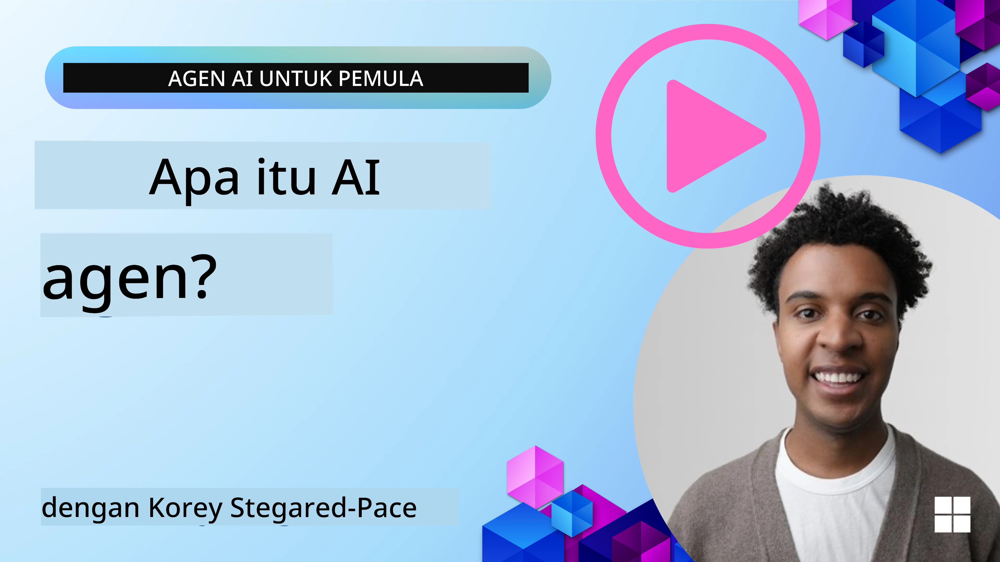
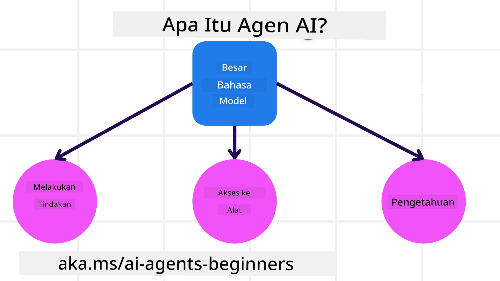
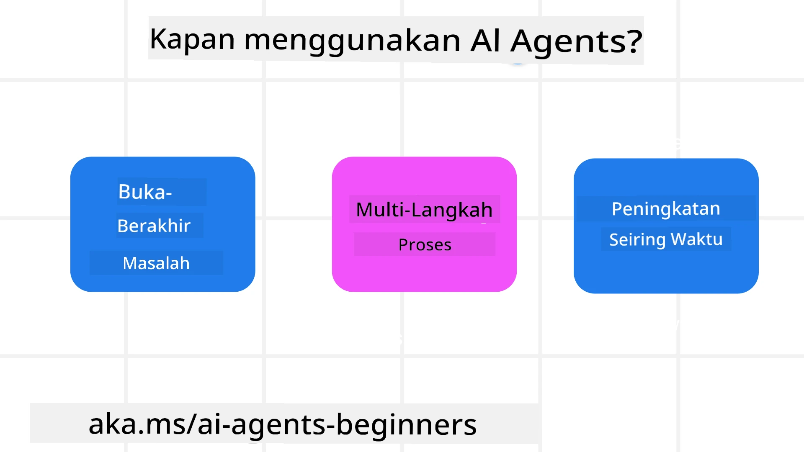

<!--
CO_OP_TRANSLATOR_METADATA:
{
  "original_hash": "cdd28bc00816d2773bb2b5968d782abc",
  "translation_date": "2025-11-11T11:28:32+00:00",
  "source_file": "01-intro-to-ai-agents/README.md",
  "language_code": "id"
}
-->

> _(Klik gambar di atas untuk menonton video pelajaran ini)_

# Pengantar AI Agents dan Penggunaan Kasus Agen

Selamat datang di kursus "AI Agents untuk Pemula"! Kursus ini memberikan pengetahuan dasar dan contoh penerapan untuk membangun AI Agents.

Bergabunglah dengan <a href="https://discord.gg/kzRShWzttr" target="_blank">Komunitas Discord Azure AI</a> untuk bertemu dengan pelajar lain dan pembangun AI Agents serta ajukan pertanyaan apa pun yang Anda miliki tentang kursus ini.

Untuk memulai kursus ini, kita akan memahami lebih baik apa itu AI Agents dan bagaimana kita dapat menggunakannya dalam aplikasi dan alur kerja yang kita bangun.

## Pengantar

Pelajaran ini mencakup:

- Apa itu AI Agents dan apa saja jenis agen yang berbeda?
- Kasus penggunaan apa yang paling cocok untuk AI Agents dan bagaimana mereka dapat membantu kita?
- Apa saja elemen dasar dalam merancang Solusi Agen?

## Tujuan Pembelajaran
Setelah menyelesaikan pelajaran ini, Anda seharusnya dapat:

- Memahami konsep AI Agents dan bagaimana mereka berbeda dari solusi AI lainnya.
- Menerapkan AI Agents secara efisien.
- Merancang solusi agen secara produktif untuk pengguna dan pelanggan.

## Definisi AI Agents dan Jenis-Jenis AI Agents

### Apa itu AI Agents?

AI Agents adalah **sistem** yang memungkinkan **Large Language Models (LLMs)** untuk **melakukan tindakan** dengan memperluas kemampuan mereka melalui akses ke **alat** dan **pengetahuan**.

Mari kita pecah definisi ini menjadi bagian-bagian yang lebih kecil:

- **Sistem** - Penting untuk memikirkan agen bukan hanya sebagai satu komponen tetapi sebagai sistem dari banyak komponen. Pada tingkat dasar, komponen AI Agent adalah:
  - **Lingkungan** - Ruang yang didefinisikan di mana AI Agent beroperasi. Misalnya, jika kita memiliki AI Agent pemesanan perjalanan, lingkungan bisa berupa sistem pemesanan perjalanan yang digunakan AI Agent untuk menyelesaikan tugas.
  - **Sensor** - Lingkungan memiliki informasi dan memberikan umpan balik. AI Agents menggunakan sensor untuk mengumpulkan dan menafsirkan informasi ini tentang keadaan lingkungan saat ini. Dalam contoh Agen Pemesanan Perjalanan, sistem pemesanan perjalanan dapat memberikan informasi seperti ketersediaan hotel atau harga tiket pesawat.
  - **Aktuator** - Setelah AI Agent menerima keadaan lingkungan saat ini, untuk tugas yang sedang berlangsung, agen menentukan tindakan apa yang harus dilakukan untuk mengubah lingkungan. Untuk agen pemesanan perjalanan, itu mungkin memesan kamar yang tersedia untuk pengguna.

**Large Language Models** - Konsep agen sudah ada sebelum penciptaan LLMs. Keuntungan membangun AI Agents dengan LLMs adalah kemampuan mereka untuk menafsirkan bahasa manusia dan data. Kemampuan ini memungkinkan LLMs untuk menafsirkan informasi lingkungan dan mendefinisikan rencana untuk mengubah lingkungan.

**Melakukan Tindakan** - Di luar sistem AI Agent, LLMs terbatas pada situasi di mana tindakan adalah menghasilkan konten atau informasi berdasarkan permintaan pengguna. Di dalam sistem AI Agent, LLMs dapat menyelesaikan tugas dengan menafsirkan permintaan pengguna dan menggunakan alat yang tersedia di lingkungan mereka.

**Akses ke Alat** - Alat apa yang dimiliki LLM tergantung pada 1) lingkungan tempat mereka beroperasi dan 2) pengembang AI Agent. Dalam contoh agen perjalanan kita, alat agen terbatas pada operasi yang tersedia di sistem pemesanan, dan/atau pengembang dapat membatasi akses alat agen ke penerbangan.

**Memori+Pengetahuan** - Memori dapat bersifat jangka pendek dalam konteks percakapan antara pengguna dan agen. Jangka panjang, di luar informasi yang diberikan oleh lingkungan, AI Agents juga dapat mengambil pengetahuan dari sistem lain, layanan, alat, dan bahkan agen lain. Dalam contoh agen perjalanan, pengetahuan ini bisa berupa informasi tentang preferensi perjalanan pengguna yang terletak di database pelanggan.

### Jenis-Jenis Agen

Sekarang kita memiliki definisi umum tentang AI Agents, mari kita lihat beberapa jenis agen spesifik dan bagaimana mereka akan diterapkan pada agen pemesanan perjalanan.

| **Jenis Agen**                | **Deskripsi**                                                                                                                       | **Contoh**                                                                                                                                                                                                                   |
| ----------------------------- | ------------------------------------------------------------------------------------------------------------------------------------- | ----------------------------------------------------------------------------------------------------------------------------------------------------------------------------------------------------------------------------- |
| **Simple Reflex Agents**      | Melakukan tindakan langsung berdasarkan aturan yang telah ditentukan sebelumnya.                                                      | Agen perjalanan menafsirkan konteks email dan meneruskan keluhan perjalanan ke layanan pelanggan.                                                                                                                          |
| **Model-Based Reflex Agents** | Melakukan tindakan berdasarkan model dunia dan perubahan pada model tersebut.                                                         | Agen perjalanan memprioritaskan rute dengan perubahan harga signifikan berdasarkan akses ke data harga historis.                                                                                                             |
| **Goal-Based Agents**         | Membuat rencana untuk mencapai tujuan tertentu dengan menafsirkan tujuan dan menentukan tindakan untuk mencapainya.                   | Agen perjalanan memesan perjalanan dengan menentukan pengaturan perjalanan yang diperlukan (mobil, transportasi umum, penerbangan) dari lokasi saat ini ke tujuan.                                                                                |
| **Utility-Based Agents**      | Mempertimbangkan preferensi dan menimbang trade-off secara numerik untuk menentukan cara mencapai tujuan.                              | Agen perjalanan memaksimalkan utilitas dengan menimbang kenyamanan vs. biaya saat memesan perjalanan.                                                                                                                                          |
| **Learning Agents**           | Meningkatkan seiring waktu dengan merespons umpan balik dan menyesuaikan tindakan sesuai kebutuhan.                                    | Agen perjalanan meningkatkan dengan menggunakan umpan balik pelanggan dari survei pasca-perjalanan untuk membuat penyesuaian pada pemesanan di masa depan.                                                                                                               |
| **Hierarchical Agents**       | Menampilkan beberapa agen dalam sistem bertingkat, dengan agen tingkat atas membagi tugas menjadi subtugas untuk diselesaikan oleh agen tingkat bawah. | Agen perjalanan membatalkan perjalanan dengan membagi tugas menjadi subtugas (misalnya, membatalkan pemesanan tertentu) dan meminta agen tingkat bawah menyelesaikannya, melaporkan kembali ke agen tingkat atas.                                     |
| **Multi-Agent Systems (MAS)** | Agen menyelesaikan tugas secara independen, baik secara kooperatif maupun kompetitif.                                                 | Kooperatif: Beberapa agen memesan layanan perjalanan tertentu seperti hotel, penerbangan, dan hiburan. Kompetitif: Beberapa agen mengelola dan bersaing atas kalender pemesanan hotel bersama untuk memesan pelanggan ke hotel. |

## Kapan Menggunakan AI Agents

Pada bagian sebelumnya, kita menggunakan kasus penggunaan Agen Perjalanan untuk menjelaskan bagaimana jenis agen yang berbeda dapat digunakan dalam berbagai skenario pemesanan perjalanan. Kita akan terus menggunakan aplikasi ini sepanjang kursus.

Mari kita lihat jenis kasus penggunaan yang paling cocok untuk AI Agents:

- **Masalah Terbuka** - memungkinkan LLM untuk menentukan langkah-langkah yang diperlukan untuk menyelesaikan tugas karena tidak selalu dapat dikodekan secara langsung ke dalam alur kerja.
- **Proses Multi-Langkah** - tugas yang membutuhkan tingkat kompleksitas di mana AI Agent perlu menggunakan alat atau informasi selama beberapa langkah, bukan hanya pengambilan satu kali.  
- **Peningkatan Seiring Waktu** - tugas di mana agen dapat meningkat seiring waktu dengan menerima umpan balik dari lingkungan atau pengguna untuk memberikan utilitas yang lebih baik.

Kami akan membahas lebih banyak pertimbangan penggunaan AI Agents dalam pelajaran Membangun AI Agents yang Dapat Dipercaya.

## Dasar-Dasar Solusi Agen

### Pengembangan Agen

Langkah pertama dalam merancang sistem AI Agent adalah mendefinisikan alat, tindakan, dan perilaku. Dalam kursus ini, kami fokus menggunakan **Azure AI Agent Service** untuk mendefinisikan Agen kami. Layanan ini menawarkan fitur seperti:

- Pemilihan Model Terbuka seperti OpenAI, Mistral, dan Llama
- Penggunaan Data Berlisensi melalui penyedia seperti Tripadvisor
- Penggunaan alat OpenAPI 3.0 yang terstandarisasi

### Pola Agen

Komunikasi dengan LLM dilakukan melalui prompt. Mengingat sifat semi-otonom AI Agents, tidak selalu memungkinkan atau diperlukan untuk mem-prompt ulang LLM secara manual setelah perubahan di lingkungan. Kami menggunakan **Pola Agen** yang memungkinkan kami untuk mem-prompt LLM selama beberapa langkah dengan cara yang lebih skalabel.

Kursus ini dibagi menjadi beberapa pola agen populer saat ini.

### Kerangka Agen

Kerangka Agen memungkinkan pengembang untuk menerapkan pola agen melalui kode. Kerangka ini menawarkan template, plugin, dan alat untuk kolaborasi AI Agent yang lebih baik. Manfaat ini memberikan kemampuan untuk pengamatan dan pemecahan masalah sistem AI Agent yang lebih baik.

Dalam kursus ini, kami akan mengeksplorasi kerangka AutoGen yang berbasis penelitian dan kerangka Agent yang siap produksi dari Semantic Kernel.

## Contoh Kode

- Python: [Kerangka Agen](./code_samples/01-python-agent-framework.ipynb)
- .NET: [Kerangka Agen](./code_samples/01-dotnet-agent-framework.md)

## Ada Pertanyaan Lebih Lanjut tentang AI Agents?

Bergabunglah dengan [Azure AI Foundry Discord](https://aka.ms/ai-agents/discord) untuk bertemu dengan pelajar lain, menghadiri jam kantor, dan mendapatkan jawaban atas pertanyaan Anda tentang AI Agents.

## Pelajaran Sebelumnya

[Pengaturan Kursus](../00-course-setup/README.md)

## Pelajaran Selanjutnya

[Mengeksplorasi Kerangka Agen](../02-explore-agentic-frameworks/README.md)

---

<!-- CO-OP TRANSLATOR DISCLAIMER START -->
**Penafian**:  
Dokumen ini telah diterjemahkan menggunakan layanan penerjemahan AI [Co-op Translator](https://github.com/Azure/co-op-translator). Meskipun kami berupaya untuk memberikan hasil yang akurat, harap diketahui bahwa terjemahan otomatis mungkin mengandung kesalahan atau ketidakakuratan. Dokumen asli dalam bahasa aslinya harus dianggap sebagai sumber yang otoritatif. Untuk informasi yang bersifat kritis, disarankan menggunakan jasa penerjemahan manusia profesional. Kami tidak bertanggung jawab atas kesalahpahaman atau interpretasi yang keliru yang timbul dari penggunaan terjemahan ini.
<!-- CO-OP TRANSLATOR DISCLAIMER END -->