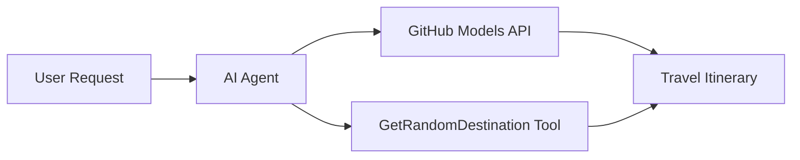

<!--
CO_OP_TRANSLATOR_METADATA:
{
  "original_hash": "5f351412e934f0833c8c821a0a60efaf",
  "translation_date": "2025-11-13T13:19:08+00:00",
  "source_file": "01-intro-to-ai-agents/code_samples/01-dotnet-agent-framework.md",
  "language_code": "id"
}
-->
# 🌍 Agen Perjalanan AI dengan Microsoft Agent Framework (.NET)

## 📋 Gambaran Umum Skenario

Contoh ini menunjukkan cara membangun agen perencana perjalanan cerdas menggunakan Microsoft Agent Framework untuk .NET. Agen ini dapat secara otomatis menghasilkan rencana perjalanan harian yang dipersonalisasi untuk destinasi acak di seluruh dunia.

### Kemampuan Utama:

- 🎲 **Pemilihan Destinasi Acak**: Menggunakan alat khusus untuk memilih tempat liburan
- 🗺️ **Perencanaan Perjalanan Cerdas**: Membuat rencana perjalanan harian yang terperinci
- 🔄 **Streaming Waktu Nyata**: Mendukung respons langsung dan streaming
- 🛠️ **Integrasi Alat Khusus**: Menunjukkan cara memperluas kemampuan agen

## 🔧 Arsitektur Teknis

### Teknologi Inti

- **Microsoft Agent Framework**: Implementasi .NET terbaru untuk pengembangan agen AI
- **Integrasi Model GitHub**: Menggunakan layanan inferensi model AI dari GitHub
- **Kompatibilitas API OpenAI**: Memanfaatkan pustaka klien OpenAI dengan endpoint khusus
- **Konfigurasi Aman**: Manajemen kunci API berbasis lingkungan

### Komponen Utama

1. **AIAgent**: Orkestrator utama agen yang menangani alur percakapan
2. **Alat Khusus**: Fungsi `GetRandomDestination()` yang tersedia untuk agen
3. **Chat Client**: Antarmuka percakapan yang didukung oleh Model GitHub
4. **Dukungan Streaming**: Kemampuan menghasilkan respons secara waktu nyata

### Pola Integrasi



## 🚀 Memulai

### Prasyarat

- [.NET 10 SDK](https://dotnet.microsoft.com/download/dotnet/10.0) atau lebih tinggi
- [Token akses API Model GitHub](https://docs.github.com/github-models/github-models-at-scale/using-your-own-api-keys-in-github-models)

### Variabel Lingkungan yang Diperlukan

```bash
# zsh/bash
export GH_TOKEN=<your_github_token>
export GH_ENDPOINT=https://models.github.ai/inference
export GH_MODEL_ID=openai/gpt-5-mini
```

```powershell
# PowerShell
$env:GH_TOKEN = "<your_github_token>"
$env:GH_ENDPOINT = "https://models.github.ai/inference"
$env:GH_MODEL_ID = "openai/gpt-5-mini"
```

### Contoh Kode

Untuk menjalankan contoh kode,

```bash
# zsh/bash
chmod +x ./01-dotnet-agent-framework.cs
./01-dotnet-agent-framework.cs
```

Atau menggunakan CLI dotnet:

```bash
dotnet run ./01-dotnet-agent-framework.cs
```

Lihat [`01-dotnet-agent-framework.cs`](../../../../01-intro-to-ai-agents/code_samples/01-dotnet-agent-framework.cs) untuk kode lengkapnya.

```csharp
#!/usr/bin/dotnet run

#:package Microsoft.Extensions.AI@9.*
#:package Microsoft.Agents.AI.OpenAI@1.*-*

using System.ClientModel;
using System.ComponentModel;

using Microsoft.Agents.AI;
using Microsoft.Extensions.AI;

using OpenAI;

// Tool Function: Random Destination Generator
// This static method will be available to the agent as a callable tool
// The [Description] attribute helps the AI understand when to use this function
// This demonstrates how to create custom tools for AI agents
[Description("Provides a random vacation destination.")]
static string GetRandomDestination()
{
    // List of popular vacation destinations around the world
    // The agent will randomly select from these options
    var destinations = new List<string>
    {
        "Paris, France",
        "Tokyo, Japan",
        "New York City, USA",
        "Sydney, Australia",
        "Rome, Italy",
        "Barcelona, Spain",
        "Cape Town, South Africa",
        "Rio de Janeiro, Brazil",
        "Bangkok, Thailand",
        "Vancouver, Canada"
    };

    // Generate random index and return selected destination
    // Uses System.Random for simple random selection
    var random = new Random();
    int index = random.Next(destinations.Count);
    return destinations[index];
}

// Extract configuration from environment variables
// Retrieve the GitHub Models API endpoint, defaults to https://models.github.ai/inference if not specified
// Retrieve the model ID, defaults to openai/gpt-5-mini if not specified
// Retrieve the GitHub token for authentication, throws exception if not specified
var github_endpoint = Environment.GetEnvironmentVariable("GH_ENDPOINT") ?? "https://models.github.ai/inference";
var github_model_id = Environment.GetEnvironmentVariable("GH_MODEL_ID") ?? "openai/gpt-5-mini";
var github_token = Environment.GetEnvironmentVariable("GH_TOKEN") ?? throw new InvalidOperationException("GH_TOKEN is not set.");

// Configure OpenAI Client Options
// Create configuration options to point to GitHub Models endpoint
// This redirects OpenAI client calls to GitHub's model inference service
var openAIOptions = new OpenAIClientOptions()
{
    Endpoint = new Uri(github_endpoint)
};

// Initialize OpenAI Client with GitHub Models Configuration
// Create OpenAI client using GitHub token for authentication
// Configure it to use GitHub Models endpoint instead of OpenAI directly
var openAIClient = new OpenAIClient(new ApiKeyCredential(github_token), openAIOptions);

// Create AI Agent with Travel Planning Capabilities
// Initialize OpenAI client, get chat client for specified model, and create AI agent
// Configure agent with travel planning instructions and random destination tool
// The agent can now plan trips using the GetRandomDestination function
AIAgent agent = openAIClient
    .GetChatClient(github_model_id)
    .CreateAIAgent(
        instructions: "You are a helpful AI Agent that can help plan vacations for customers at random destinations",
        tools: [AIFunctionFactory.Create(GetRandomDestination)]
    );

// Execute Agent: Plan a Day Trip
// Run the agent with streaming enabled for real-time response display
// Shows the agent's thinking and response as it generates the content
// Provides better user experience with immediate feedback
await foreach (var update in agent.RunStreamingAsync("Plan me a day trip"))
{
    await Task.Delay(10);
    Console.Write(update);
}
```

## 🎓 Pelajaran Penting

1. **Arsitektur Agen**: Microsoft Agent Framework menyediakan pendekatan yang bersih dan aman tipe untuk membangun agen AI di .NET
2. **Integrasi Alat**: Fungsi yang dihiasi dengan atribut `[Description]` menjadi alat yang tersedia untuk agen
3. **Manajemen Konfigurasi**: Variabel lingkungan dan penanganan kredensial yang aman mengikuti praktik terbaik .NET
4. **Kompatibilitas OpenAI**: Integrasi Model GitHub bekerja dengan mulus melalui API yang kompatibel dengan OpenAI

## 🔗 Sumber Daya Tambahan

- [Dokumentasi Microsoft Agent Framework](https://learn.microsoft.com/agent-framework)
- [Marketplace Model GitHub](https://github.com/marketplace?type=models)
- [Microsoft.Extensions.AI](https://learn.microsoft.com/dotnet/ai/microsoft-extensions-ai)
- [.NET Single File Apps](https://devblogs.microsoft.com/dotnet/announcing-dotnet-run-app)

---

<!-- CO-OP TRANSLATOR DISCLAIMER START -->
**Penafian**:  
Dokumen ini telah diterjemahkan menggunakan layanan penerjemahan AI [Co-op Translator](https://github.com/Azure/co-op-translator). Meskipun kami berupaya untuk memberikan hasil yang akurat, harap diketahui bahwa terjemahan otomatis mungkin mengandung kesalahan atau ketidakakuratan. Dokumen asli dalam bahasa aslinya harus dianggap sebagai sumber yang otoritatif. Untuk informasi yang penting, disarankan menggunakan jasa penerjemahan manusia profesional. Kami tidak bertanggung jawab atas kesalahpahaman atau penafsiran yang timbul dari penggunaan terjemahan ini.
<!-- CO-OP TRANSLATOR DISCLAIMER END -->