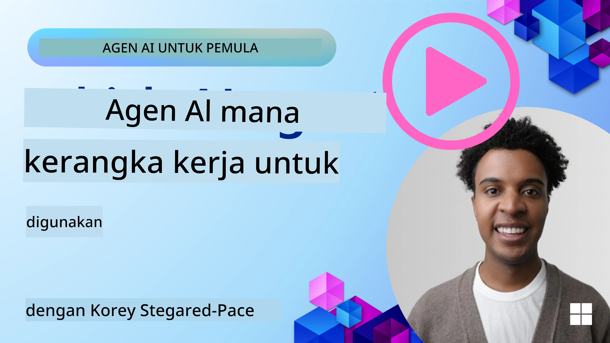

<!--
CO_OP_TRANSLATOR_METADATA:
{
  "original_hash": "7120197753abacc827b64ac2d5d6966f",
  "translation_date": "2025-11-13T13:20:39+00:00",
  "source_file": "02-explore-agentic-frameworks/README.md",
  "language_code": "id"
}
-->
[](https://youtu.be/ODwF-EZo_O8?si=1xoy_B9RNQfrYdF7)

> _(Klik gambar di atas untuk menonton video pelajaran ini)_

# Menjelajahi Kerangka Kerja Agen AI

Kerangka kerja agen AI adalah platform perangkat lunak yang dirancang untuk menyederhanakan pembuatan, penerapan, dan pengelolaan agen AI. Kerangka kerja ini menyediakan komponen, abstraksi, dan alat yang sudah dibuat sebelumnya untuk mempermudah pengembangan sistem AI yang kompleks.

Kerangka kerja ini membantu pengembang fokus pada aspek unik aplikasi mereka dengan menyediakan pendekatan standar untuk tantangan umum dalam pengembangan agen AI. Mereka meningkatkan skalabilitas, aksesibilitas, dan efisiensi dalam membangun sistem AI.

## Pendahuluan 

Pelajaran ini akan membahas:

- Apa itu Kerangka Kerja Agen AI dan apa yang dapat dicapai pengembang dengan menggunakannya?
- Bagaimana tim dapat menggunakan ini untuk dengan cepat membuat prototipe, iterasi, dan meningkatkan kemampuan agen mereka?
- Apa perbedaan antara kerangka kerja dan alat yang dibuat oleh Microsoft <a href="https://aka.ms/ai-agents/autogen" target="_blank">AutoGen</a>, <a href="https://aka.ms/ai-agents-beginners/semantic-kernel" target="_blank">Semantic Kernel</a>, dan <a href="https://aka.ms/ai-agents-beginners/ai-agent-service" target="_blank">Azure AI Agent Service</a>?
- Bisakah saya mengintegrasikan alat ekosistem Azure yang sudah ada secara langsung, atau apakah saya memerlukan solusi mandiri?
- Apa itu layanan Azure AI Agents dan bagaimana ini membantu saya?

## Tujuan Pembelajaran

Tujuan dari pelajaran ini adalah untuk membantu Anda memahami:

- Peran Kerangka Kerja Agen AI dalam pengembangan AI.
- Cara memanfaatkan Kerangka Kerja Agen AI untuk membangun agen cerdas.
- Kemampuan utama yang diaktifkan oleh Kerangka Kerja Agen AI.
- Perbedaan antara AutoGen, Semantic Kernel, dan Azure AI Agent Service.

## Apa itu Kerangka Kerja Agen AI dan apa yang dapat dicapai pengembang dengan menggunakannya?

Kerangka kerja AI tradisional dapat membantu Anda mengintegrasikan AI ke dalam aplikasi Anda dan membuat aplikasi tersebut lebih baik dalam cara berikut:

- **Personalisasi**: AI dapat menganalisis perilaku dan preferensi pengguna untuk memberikan rekomendasi, konten, dan pengalaman yang dipersonalisasi.
Contoh: Layanan streaming seperti Netflix menggunakan AI untuk menyarankan film dan acara berdasarkan riwayat tontonan, meningkatkan keterlibatan dan kepuasan pengguna.
- **Otomasi dan Efisiensi**: AI dapat mengotomatisasi tugas berulang, menyederhanakan alur kerja, dan meningkatkan efisiensi operasional.
Contoh: Aplikasi layanan pelanggan menggunakan chatbot yang didukung AI untuk menangani pertanyaan umum, mengurangi waktu respons, dan membebaskan agen manusia untuk masalah yang lebih kompleks.
- **Pengalaman Pengguna yang Lebih Baik**: AI dapat meningkatkan pengalaman pengguna secara keseluruhan dengan menyediakan fitur cerdas seperti pengenalan suara, pemrosesan bahasa alami, dan teks prediktif.
Contoh: Asisten virtual seperti Siri dan Google Assistant menggunakan AI untuk memahami dan merespons perintah suara, mempermudah pengguna berinteraksi dengan perangkat mereka.

### Kedengarannya bagus, kan? Jadi mengapa kita membutuhkan Kerangka Kerja Agen AI?

Kerangka kerja agen AI mewakili sesuatu yang lebih dari sekadar kerangka kerja AI. Mereka dirancang untuk memungkinkan pembuatan agen cerdas yang dapat berinteraksi dengan pengguna, agen lain, dan lingkungan untuk mencapai tujuan tertentu. Agen ini dapat menunjukkan perilaku otonom, membuat keputusan, dan beradaptasi dengan kondisi yang berubah. Mari kita lihat beberapa kemampuan utama yang diaktifkan oleh Kerangka Kerja Agen AI:

- **Kolaborasi dan Koordinasi Agen**: Memungkinkan pembuatan beberapa agen AI yang dapat bekerja sama, berkomunikasi, dan berkoordinasi untuk menyelesaikan tugas yang kompleks.
- **Otomasi dan Pengelolaan Tugas**: Menyediakan mekanisme untuk mengotomatisasi alur kerja multi-langkah, delegasi tugas, dan pengelolaan tugas dinamis di antara agen.
- **Pemahaman dan Adaptasi Kontekstual**: Membekali agen dengan kemampuan untuk memahami konteks, beradaptasi dengan lingkungan yang berubah, dan membuat keputusan berdasarkan informasi waktu nyata.

Jadi, secara ringkas, agen memungkinkan Anda melakukan lebih banyak hal, membawa otomasi ke tingkat berikutnya, menciptakan sistem yang lebih cerdas yang dapat beradaptasi dan belajar dari lingkungannya.

## Bagaimana cara membuat prototipe, iterasi, dan meningkatkan kemampuan agen dengan cepat?

Ini adalah lanskap yang bergerak cepat, tetapi ada beberapa hal yang umum di sebagian besar Kerangka Kerja Agen AI yang dapat membantu Anda dengan cepat membuat prototipe dan iterasi, yaitu komponen modular, alat kolaboratif, dan pembelajaran waktu nyata. Mari kita bahas lebih dalam:

- **Gunakan Komponen Modular**: SDK AI menawarkan komponen yang sudah dibuat sebelumnya seperti konektor AI dan Memori, pemanggilan fungsi menggunakan bahasa alami atau plugin kode, template prompt, dan lainnya.
- **Manfaatkan Alat Kolaboratif**: Desain agen dengan peran dan tugas spesifik, memungkinkan mereka menguji dan menyempurnakan alur kerja kolaboratif.
- **Belajar dalam Waktu Nyata**: Terapkan loop umpan balik di mana agen belajar dari interaksi dan menyesuaikan perilaku mereka secara dinamis.

### Gunakan Komponen Modular

SDK seperti Microsoft Semantic Kernel dan LangChain menawarkan komponen yang sudah dibuat sebelumnya seperti konektor AI, template prompt, dan manajemen memori.

**Bagaimana tim dapat menggunakan ini**: Tim dapat dengan cepat merakit komponen ini untuk membuat prototipe fungsional tanpa memulai dari awal, memungkinkan eksperimen dan iterasi yang cepat.

**Bagaimana cara kerjanya dalam praktik**: Anda dapat menggunakan parser yang sudah dibuat sebelumnya untuk mengekstrak informasi dari input pengguna, modul memori untuk menyimpan dan mengambil data, dan generator prompt untuk berinteraksi dengan pengguna, semuanya tanpa harus membuat komponen ini dari awal.

**Contoh kode**. Mari kita lihat contoh bagaimana Anda dapat menggunakan Konektor AI yang sudah dibuat sebelumnya dengan Semantic Kernel Python dan .Net yang menggunakan pemanggilan fungsi otomatis untuk membuat model merespons input pengguna:

``` python
# Semantic Kernel Python Example

import asyncio
from typing import Annotated

from semantic_kernel.connectors.ai import FunctionChoiceBehavior
from semantic_kernel.connectors.ai.open_ai import AzureChatCompletion, AzureChatPromptExecutionSettings
from semantic_kernel.contents import ChatHistory
from semantic_kernel.functions import kernel_function
from semantic_kernel.kernel import Kernel

# Define a ChatHistory object to hold the conversation's context
chat_history = ChatHistory()
chat_history.add_user_message("I'd like to go to New York on January 1, 2025")


# Define a sample plugin that contains the function to book travel
class BookTravelPlugin:
    """A Sample Book Travel Plugin"""

    @kernel_function(name="book_flight", description="Book travel given location and date")
    async def book_flight(
        self, date: Annotated[str, "The date of travel"], location: Annotated[str, "The location to travel to"]
    ) -> str:
        return f"Travel was booked to {location} on {date}"

# Create the Kernel
kernel = Kernel()

# Add the sample plugin to the Kernel object
kernel.add_plugin(BookTravelPlugin(), plugin_name="book_travel")

# Define the Azure OpenAI AI Connector
chat_service = AzureChatCompletion(
    deployment_name="YOUR_DEPLOYMENT_NAME", 
    api_key="YOUR_API_KEY", 
    endpoint="https://<your-resource>.azure.openai.com/",
)

# Define the request settings to configure the model with auto-function calling
request_settings = AzureChatPromptExecutionSettings(function_choice_behavior=FunctionChoiceBehavior.Auto())


async def main():
    # Make the request to the model for the given chat history and request settings
    # The Kernel contains the sample that the model will request to invoke
    response = await chat_service.get_chat_message_content(
        chat_history=chat_history, settings=request_settings, kernel=kernel
    )
    assert response is not None

    """
    Note: In the auto function calling process, the model determines it can invoke the 
    `BookTravelPlugin` using the `book_flight` function, supplying the necessary arguments. 
    
    For example:

    "tool_calls": [
        {
            "id": "call_abc123",
            "type": "function",
            "function": {
                "name": "BookTravelPlugin-book_flight",
                "arguments": "{'location': 'New York', 'date': '2025-01-01'}"
            }
        }
    ]

    Since the location and date arguments are required (as defined by the kernel function), if the 
    model lacks either, it will prompt the user to provide them. For instance:

    User: Book me a flight to New York.
    Model: Sure, I'd love to help you book a flight. Could you please specify the date?
    User: I want to travel on January 1, 2025.
    Model: Your flight to New York on January 1, 2025, has been successfully booked. Safe travels!
    """

    print(f"`{response}`")
    # Example AI Model Response: `Your flight to New York on January 1, 2025, has been successfully booked. Safe travels! ✈️🗽`

    # Add the model's response to our chat history context
    chat_history.add_assistant_message(response.content)


if __name__ == "__main__":
    asyncio.run(main())
```
```csharp
// Semantic Kernel C# example

using Microsoft.SemanticKernel;
using Microsoft.SemanticKernel.ChatCompletion;
using System.ComponentModel;
using Microsoft.SemanticKernel.Connectors.AzureOpenAI;

ChatHistory chatHistory = [];
chatHistory.AddUserMessage("I'd like to go to New York on January 1, 2025");

var kernelBuilder = Kernel.CreateBuilder();
kernelBuilder.AddAzureOpenAIChatCompletion(
    deploymentName: "NAME_OF_YOUR_DEPLOYMENT",
    apiKey: "YOUR_API_KEY",
    endpoint: "YOUR_AZURE_ENDPOINT"
);
kernelBuilder.Plugins.AddFromType<BookTravelPlugin>("BookTravel"); 
var kernel = kernelBuilder.Build();

var settings = new AzureOpenAIPromptExecutionSettings()
{
    FunctionChoiceBehavior = FunctionChoiceBehavior.Auto()
};

var chatCompletion = kernel.GetRequiredService<IChatCompletionService>();

var response = await chatCompletion.GetChatMessageContentAsync(chatHistory, settings, kernel);

/*
Behind the scenes, the model recognizes the tool to call, what arguments it already has (location) and (date)
{

"tool_calls": [
    {
        "id": "call_abc123",
        "type": "function",
        "function": {
            "name": "BookTravelPlugin-book_flight",
            "arguments": "{'location': 'New York', 'date': '2025-01-01'}"
        }
    }
]
*/

Console.WriteLine(response.Content);
chatHistory.AddMessage(response!.Role, response!.Content!);

// Example AI Model Response: Your flight to New York on January 1, 2025, has been successfully booked. Safe travels! ✈️🗽

// Define a plugin that contains the function to book travel
public class BookTravelPlugin
{
    [KernelFunction("book_flight")]
    [Description("Book travel given location and date")]
    public async Task<string> BookFlight(DateTime date, string location)
    {
        return await Task.FromResult( $"Travel was booked to {location} on {date}");
    }
}
```

Dari contoh ini, Anda dapat melihat bagaimana Anda dapat memanfaatkan parser yang sudah dibuat sebelumnya untuk mengekstrak informasi penting dari input pengguna, seperti asal, tujuan, dan tanggal permintaan pemesanan penerbangan. Pendekatan modular ini memungkinkan Anda fokus pada logika tingkat tinggi.

### Manfaatkan Alat Kolaboratif

Kerangka kerja seperti CrewAI, Microsoft AutoGen, dan Semantic Kernel memfasilitasi pembuatan beberapa agen yang dapat bekerja sama.

**Bagaimana tim dapat menggunakan ini**: Tim dapat merancang agen dengan peran dan tugas spesifik, memungkinkan mereka menguji dan menyempurnakan alur kerja kolaboratif serta meningkatkan efisiensi sistem secara keseluruhan.

**Bagaimana cara kerjanya dalam praktik**: Anda dapat membuat tim agen di mana setiap agen memiliki fungsi khusus, seperti pengambilan data, analisis, atau pengambilan keputusan. Agen-agen ini dapat berkomunikasi dan berbagi informasi untuk mencapai tujuan bersama, seperti menjawab pertanyaan pengguna atau menyelesaikan tugas.

**Contoh kode (AutoGen)**:

```python
# creating agents, then create a round robin schedule where they can work together, in this case in order

# Data Retrieval Agent
# Data Analysis Agent
# Decision Making Agent

agent_retrieve = AssistantAgent(
    name="dataretrieval",
    model_client=model_client,
    tools=[retrieve_tool],
    system_message="Use tools to solve tasks."
)

agent_analyze = AssistantAgent(
    name="dataanalysis",
    model_client=model_client,
    tools=[analyze_tool],
    system_message="Use tools to solve tasks."
)

# conversation ends when user says "APPROVE"
termination = TextMentionTermination("APPROVE")

user_proxy = UserProxyAgent("user_proxy", input_func=input)

team = RoundRobinGroupChat([agent_retrieve, agent_analyze, user_proxy], termination_condition=termination)

stream = team.run_stream(task="Analyze data", max_turns=10)
# Use asyncio.run(...) when running in a script.
await Console(stream)
```

Apa yang Anda lihat dalam kode sebelumnya adalah bagaimana Anda dapat membuat tugas yang melibatkan beberapa agen yang bekerja sama untuk menganalisis data. Setiap agen melakukan fungsi tertentu, dan tugas dijalankan dengan mengoordinasikan agen-agen untuk mencapai hasil yang diinginkan. Dengan menciptakan agen khusus dengan peran khusus, Anda dapat meningkatkan efisiensi dan kinerja tugas.

### Belajar dalam Waktu Nyata

Kerangka kerja canggih menyediakan kemampuan untuk memahami konteks dan beradaptasi secara waktu nyata.

**Bagaimana tim dapat menggunakan ini**: Tim dapat menerapkan loop umpan balik di mana agen belajar dari interaksi dan menyesuaikan perilaku mereka secara dinamis, yang mengarah pada peningkatan dan penyempurnaan kemampuan secara terus-menerus.

**Bagaimana cara kerjanya dalam praktik**: Agen dapat menganalisis umpan balik pengguna, data lingkungan, dan hasil tugas untuk memperbarui basis pengetahuan mereka, menyesuaikan algoritma pengambilan keputusan, dan meningkatkan kinerja dari waktu ke waktu. Proses pembelajaran iteratif ini memungkinkan agen beradaptasi dengan kondisi yang berubah dan preferensi pengguna, meningkatkan efektivitas sistem secara keseluruhan.

## Apa perbedaan antara kerangka kerja AutoGen, Semantic Kernel, dan Azure AI Agent Service?

Ada banyak cara untuk membandingkan kerangka kerja ini, tetapi mari kita lihat beberapa perbedaan utama dalam hal desain, kemampuan, dan kasus penggunaan yang ditargetkan:

## AutoGen

AutoGen adalah kerangka kerja sumber terbuka yang dikembangkan oleh Microsoft Research's AI Frontiers Lab. Ini berfokus pada aplikasi *agentic* yang didorong oleh peristiwa dan terdistribusi, memungkinkan beberapa LLM dan SLM, alat, serta pola desain multi-agen yang canggih.

AutoGen dibangun di sekitar konsep inti agen, yaitu entitas otonom yang dapat memahami lingkungannya, membuat keputusan, dan mengambil tindakan untuk mencapai tujuan tertentu. Agen berkomunikasi melalui pesan asinkron, memungkinkan mereka bekerja secara independen dan paralel, meningkatkan skalabilitas dan responsivitas sistem.

<a href="https://en.wikipedia.org/wiki/Actor_model" target="_blank">Agen didasarkan pada model aktor</a>. Menurut Wikipedia, aktor adalah _blok bangunan dasar dari komputasi konkuren. Sebagai respons terhadap pesan yang diterima, aktor dapat: membuat keputusan lokal, menciptakan lebih banyak aktor, mengirim lebih banyak pesan, dan menentukan bagaimana merespons pesan berikutnya yang diterima_.

**Kasus Penggunaan**: Mengotomatisasi pembuatan kode, tugas analisis data, dan membangun agen khusus untuk fungsi perencanaan dan penelitian.

Berikut adalah beberapa konsep inti penting dari AutoGen:

- **Agen**. Agen adalah entitas perangkat lunak yang:
  - **Berkomunikasi melalui pesan**, pesan ini dapat bersifat sinkron atau asinkron.
  - **Mempertahankan statusnya sendiri**, yang dapat dimodifikasi oleh pesan yang masuk.
  - **Melakukan tindakan** sebagai respons terhadap pesan yang diterima atau perubahan dalam statusnya. Tindakan ini dapat memodifikasi status agen dan menghasilkan efek eksternal, seperti memperbarui log pesan, mengirim pesan baru, menjalankan kode, atau membuat panggilan API.
    
  Berikut adalah cuplikan kode singkat di mana Anda membuat agen Anda sendiri dengan kemampuan Chat:

    ```python
    from autogen_agentchat.agents import AssistantAgent
    from autogen_agentchat.messages import TextMessage
    from autogen_ext.models.openai import OpenAIChatCompletionClient


    class MyAgent(RoutedAgent):
        def __init__(self, name: str) -> None:
            super().__init__(name)
            model_client = OpenAIChatCompletionClient(model="gpt-4o")
            self._delegate = AssistantAgent(name, model_client=model_client)
    
        @message_handler
        async def handle_my_message_type(self, message: MyMessageType, ctx: MessageContext) -> None:
            print(f"{self.id.type} received message: {message.content}")
            response = await self._delegate.on_messages(
                [TextMessage(content=message.content, source="user")], ctx.cancellation_token
            )
            print(f"{self.id.type} responded: {response.chat_message.content}")
    ```
    
    Dalam kode sebelumnya, `MyAgent` telah dibuat dan mewarisi dari `RoutedAgent`. Ia memiliki pengendali pesan yang mencetak konten pesan dan kemudian mengirimkan respons menggunakan delegasi `AssistantAgent`. Perhatikan secara khusus bagaimana kita menetapkan ke `self._delegate` sebuah instance dari `AssistantAgent` yang merupakan agen yang sudah dibuat sebelumnya yang dapat menangani penyelesaian obrolan.


    Mari beri tahu AutoGen tentang jenis agen ini dan mulai program berikutnya:

    ```python
    
    # main.py
    runtime = SingleThreadedAgentRuntime()
    await MyAgent.register(runtime, "my_agent", lambda: MyAgent())

    runtime.start()  # Start processing messages in the background.
    await runtime.send_message(MyMessageType("Hello, World!"), AgentId("my_agent", "default"))
    ```

    Dalam kode sebelumnya, agen-agen didaftarkan dengan runtime dan kemudian sebuah pesan dikirimkan ke agen yang menghasilkan output berikut:

    ```text
    # Output from the console:
    my_agent received message: Hello, World!
    my_assistant received message: Hello, World!
    my_assistant responded: Hello! How can I assist you today?
    ```

- **Multi agen**. AutoGen mendukung pembuatan beberapa agen yang dapat bekerja sama untuk mencapai tugas yang kompleks. Agen dapat berkomunikasi, berbagi informasi, dan mengoordinasikan tindakan mereka untuk memecahkan masalah dengan lebih efisien. Untuk membuat sistem multi-agen, Anda dapat mendefinisikan berbagai jenis agen dengan fungsi dan peran khusus, seperti pengambilan data, analisis, pengambilan keputusan, dan interaksi pengguna. Mari kita lihat bagaimana pembuatan seperti itu terlihat sehingga kita mendapatkan gambaran:

    ```python
    editor_description = "Editor for planning and reviewing the content."

    # Example of declaring an Agent
    editor_agent_type = await EditorAgent.register(
    runtime,
    editor_topic_type,  # Using topic type as the agent type.
    lambda: EditorAgent(
        description=editor_description,
        group_chat_topic_type=group_chat_topic_type,
        model_client=OpenAIChatCompletionClient(
            model="gpt-4o-2024-08-06",
            # api_key="YOUR_API_KEY",
        ),
        ),
    )

    # remaining declarations shortened for brevity

    # Group chat
    group_chat_manager_type = await GroupChatManager.register(
    runtime,
    "group_chat_manager",
    lambda: GroupChatManager(
        participant_topic_types=[writer_topic_type, illustrator_topic_type, editor_topic_type, user_topic_type],
        model_client=OpenAIChatCompletionClient(
            model="gpt-4o-2024-08-06",
            # api_key="YOUR_API_KEY",
        ),
        participant_descriptions=[
            writer_description, 
            illustrator_description, 
            editor_description, 
            user_description
        ],
        ),
    )
    ```

    Dalam kode sebelumnya, kita memiliki `GroupChatManager` yang didaftarkan dengan runtime. Manajer ini bertanggung jawab untuk mengoordinasikan interaksi antara berbagai jenis agen, seperti penulis, ilustrator, editor, dan pengguna.

- **Agent Runtime**. Kerangka kerja menyediakan lingkungan runtime, memungkinkan komunikasi antar agen, mengelola identitas dan siklus hidup mereka, serta menegakkan batasan keamanan dan privasi. Ini berarti Anda dapat menjalankan agen Anda dalam lingkungan yang aman dan terkendali, memastikan bahwa mereka dapat berinteraksi dengan aman dan efisien. Ada dua runtime yang menarik:
  - **Runtime mandiri**. Ini adalah pilihan yang baik untuk aplikasi proses tunggal di mana semua agen diimplementasikan dalam bahasa pemrograman yang sama dan berjalan dalam proses yang sama. Berikut adalah ilustrasi cara kerjanya:
  
    <a href="https://microsoft.github.io/autogen/stable/_images/architecture-standalone.svg" target="_blank">Runtime mandiri</a>   
Tumpukan aplikasi

    *agen berkomunikasi melalui pesan melalui runtime, dan runtime mengelola siklus hidup agen*

  - **Runtime agen terdistribusi**, cocok untuk aplikasi multi-proses di mana agen dapat diimplementasikan dalam berbagai bahasa pemrograman dan berjalan di mesin yang berbeda. Berikut adalah ilustrasi cara kerjanya:
  
    <a href="https://microsoft.github.io/autogen/stable/_images/architecture-distributed.svg" target="_blank">Runtime terdistribusi</a>

## Semantic Kernel + Kerangka Kerja Agen

Semantic Kernel adalah SDK Orkestrasi AI yang siap untuk perusahaan. Ini terdiri dari konektor AI dan memori, bersama dengan Kerangka Kerja Agen.

Mari kita bahas beberapa komponen inti terlebih dahulu:

- **Konektor AI**: Ini adalah antarmuka dengan layanan AI eksternal dan sumber data untuk digunakan baik dalam Python maupun C#.

  ```python
  # Semantic Kernel Python
  from semantic_kernel.connectors.ai.open_ai import AzureChatCompletion
  from semantic_kernel.kernel import Kernel

  kernel = Kernel()
  kernel.add_service(
    AzureChatCompletion(
        deployment_name="your-deployment-name",
        api_key="your-api-key",
        endpoint="your-endpoint",
    )
  )
  ```  

    ```csharp
    // Semantic Kernel C#
    using Microsoft.SemanticKernel;

    // Create kernel
    var builder = Kernel.CreateBuilder();
    
    // Add a chat completion service:
    builder.Services.AddAzureOpenAIChatCompletion(
        "your-resource-name",
        "your-endpoint",
        "your-resource-key",
        "deployment-model");
    var kernel = builder.Build();
    ```

    Di sini Anda memiliki contoh sederhana tentang bagaimana Anda dapat membuat kernel dan menambahkan layanan penyelesaian obrolan. Semantic Kernel menciptakan koneksi ke layanan AI eksternal, dalam hal ini, Azure OpenAI Chat Completion.

- **Plugin**: Ini mencakup fungsi yang dapat digunakan aplikasi. Ada plugin yang sudah siap pakai dan plugin khusus yang dapat Anda buat. Konsep terkait adalah "fungsi prompt." Alih-alih memberikan petunjuk bahasa alami untuk pemanggilan fungsi, Anda menyiarkan fungsi tertentu ke model. Berdasarkan konteks obrolan saat ini, model dapat memilih untuk memanggil salah satu fungsi ini untuk menyelesaikan permintaan atau kueri. Berikut adalah contohnya:

  ```python
  from semantic_kernel.connectors.ai.open_ai.services.azure_chat_completion import AzureChatCompletion


  async def main():
      from semantic_kernel.functions import KernelFunctionFromPrompt
      from semantic_kernel.kernel import Kernel

      kernel = Kernel()
      kernel.add_service(AzureChatCompletion())

      user_input = input("User Input:> ")

      kernel_function = KernelFunctionFromPrompt(
          function_name="SummarizeText",
          prompt="""
          Summarize the provided unstructured text in a sentence that is easy to understand.
          Text to summarize: {{$user_input}}
          """,
      )

      response = await kernel_function.invoke(kernel=kernel, user_input=user_input)
      print(f"Model Response: {response}")

      """
      Sample Console Output:

      User Input:> I like dogs
      Model Response: The text expresses a preference for dogs.
      """


  if __name__ == "__main__":
    import asyncio
    asyncio.run(main())
  ```

    ```csharp
    var userInput = Console.ReadLine();

    // Define semantic function inline.
    string skPrompt = @"Summarize the provided unstructured text in a sentence that is easy to understand.
                        Text to summarize: {{$userInput}}";
    
    // create the function from the prompt
    KernelFunction summarizeFunc = kernel.CreateFunctionFromPrompt(
        promptTemplate: skPrompt,
        functionName: "SummarizeText"
    );

    //then import into the current kernel
    kernel.ImportPluginFromFunctions("SemanticFunctions", [summarizeFunc]);

    ```

    Di sini, Anda pertama-tama memiliki template prompt `skPrompt` yang memberikan ruang bagi pengguna untuk memasukkan teks, `$userInput`. Kemudian Anda membuat fungsi kernel `SummarizeText` dan kemudian mengimpornya ke dalam kernel dengan nama plugin `SemanticFunctions`. Perhatikan nama fungsi yang membantu Semantic Kernel memahami apa yang dilakukan fungsi tersebut dan kapan harus dipanggil.

- **Fungsi Native**: Ada juga fungsi native yang dapat langsung dipanggil oleh kerangka kerja untuk melaksanakan tugas. Berikut adalah contoh fungsi seperti itu yang mengambil konten dari file:

    ```csharp
    public class NativeFunctions {

        [SKFunction, Description("Retrieve content from local file")]
        public async Task<string> RetrieveLocalFile(string fileName, int maxSize = 5000)
        {
            string content = await File.ReadAllTextAsync(fileName);
            if (content.Length <= maxSize) return content;
            return content.Substring(0, maxSize);
        }
    }
    
    //Import native function
    string plugInName = "NativeFunction";
    string functionName = "RetrieveLocalFile";

   //To add the functions to a kernel use the following function
    kernel.ImportPluginFromType<NativeFunctions>();

    ```

- **Memori**: Mengabstraksi dan menyederhanakan pengelolaan konteks untuk aplikasi AI. Ide dengan memori adalah bahwa ini adalah sesuatu yang harus diketahui oleh LLM. Anda dapat menyimpan informasi ini dalam penyimpanan vektor yang akhirnya menjadi basis data dalam memori atau basis data vektor atau serupa. Berikut adalah contoh skenario yang sangat disederhanakan di mana *fakta* ditambahkan ke memori:

    ```csharp
    var facts = new Dictionary<string,string>();
    facts.Add(
        "Azure Machine Learning; https://learn.microsoft.com/azure/machine-learning/",
        @"Azure Machine Learning is a cloud service for accelerating and
        managing the machine learning project lifecycle. Machine learning professionals,
        data scientists, and engineers can use it in their day-to-day workflows"
    );
    
    facts.Add(
        "Azure SQL Service; https://learn.microsoft.com/azure/azure-sql/",
        @"Azure SQL is a family of managed, secure, and intelligent products
        that use the SQL Server database engine in the Azure cloud."
    );
    
    string memoryCollectionName = "SummarizedAzureDocs";
    
    foreach (var fact in facts) {
        await memoryBuilder.SaveReferenceAsync(
            collection: memoryCollectionName,
            description: fact.Key.Split(";")[1].Trim(),
            text: fact.Value,
            externalId: fact.Key.Split(";")[2].Trim(),
            externalSourceName: "Azure Documentation"
        );
    }
    ```

Fakta-fakta ini kemudian disimpan dalam koleksi memori `SummarizedAzureDocs`. Ini adalah contoh yang sangat sederhana, tetapi Anda dapat melihat bagaimana informasi dapat disimpan dalam memori untuk digunakan oleh LLM.

Jadi itulah dasar-dasar kerangka kerja Semantic Kernel, bagaimana dengan Agent Framework?

## Azure AI Agent Service

Azure AI Agent Service adalah tambahan yang lebih baru, diperkenalkan di Microsoft Ignite 2024. Layanan ini memungkinkan pengembangan dan penerapan agen AI dengan model yang lebih fleksibel, seperti langsung memanggil LLM open-source seperti Llama 3, Mistral, dan Cohere.

Azure AI Agent Service menyediakan mekanisme keamanan perusahaan yang lebih kuat dan metode penyimpanan data, membuatnya cocok untuk aplikasi perusahaan.

Layanan ini bekerja langsung dengan kerangka orkestrasi multi-agen seperti AutoGen dan Semantic Kernel.

Saat ini layanan ini dalam Public Preview dan mendukung Python dan C# untuk membangun agen.

Menggunakan Semantic Kernel Python, kita dapat membuat Azure AI Agent dengan plugin yang ditentukan pengguna:

```python
import asyncio
from typing import Annotated

from azure.identity.aio import DefaultAzureCredential

from semantic_kernel.agents import AzureAIAgent, AzureAIAgentSettings, AzureAIAgentThread
from semantic_kernel.contents import ChatMessageContent
from semantic_kernel.contents import AuthorRole
from semantic_kernel.functions import kernel_function


# Define a sample plugin for the sample
class MenuPlugin:
    """A sample Menu Plugin used for the concept sample."""

    @kernel_function(description="Provides a list of specials from the menu.")
    def get_specials(self) -> Annotated[str, "Returns the specials from the menu."]:
        return """
        Special Soup: Clam Chowder
        Special Salad: Cobb Salad
        Special Drink: Chai Tea
        """

    @kernel_function(description="Provides the price of the requested menu item.")
    def get_item_price(
        self, menu_item: Annotated[str, "The name of the menu item."]
    ) -> Annotated[str, "Returns the price of the menu item."]:
        return "$9.99"


async def main() -> None:
    ai_agent_settings = AzureAIAgentSettings.create()

    async with (
        DefaultAzureCredential() as creds,
        AzureAIAgent.create_client(
            credential=creds,
            conn_str=ai_agent_settings.project_connection_string.get_secret_value(),
        ) as client,
    ):
        # Create agent definition
        agent_definition = await client.agents.create_agent(
            model=ai_agent_settings.model_deployment_name,
            name="Host",
            instructions="Answer questions about the menu.",
        )

        # Create the AzureAI Agent using the defined client and agent definition
        agent = AzureAIAgent(
            client=client,
            definition=agent_definition,
            plugins=[MenuPlugin()],
        )

        # Create a thread to hold the conversation
        # If no thread is provided, a new thread will be
        # created and returned with the initial response
        thread: AzureAIAgentThread | None = None

        user_inputs = [
            "Hello",
            "What is the special soup?",
            "How much does that cost?",
            "Thank you",
        ]

        try:
            for user_input in user_inputs:
                print(f"# User: '{user_input}'")
                # Invoke the agent for the specified thread
                response = await agent.get_response(
                    messages=user_input,
                    thread_id=thread,
                )
                print(f"# {response.name}: {response.content}")
                thread = response.thread
        finally:
            await thread.delete() if thread else None
            await client.agents.delete_agent(agent.id)


if __name__ == "__main__":
    asyncio.run(main())
```

### Konsep Inti

Azure AI Agent Service memiliki konsep inti berikut:

- **Agent**. Azure AI Agent Service terintegrasi dengan Azure AI Foundry. Di dalam AI Foundry, AI Agent bertindak sebagai "microservice pintar" yang dapat digunakan untuk menjawab pertanyaan (RAG), melakukan tindakan, atau sepenuhnya mengotomatisasi alur kerja. Hal ini dicapai dengan menggabungkan kekuatan model AI generatif dengan alat yang memungkinkan akses dan interaksi dengan sumber data dunia nyata. Berikut adalah contoh agen:

    ```python
    agent = project_client.agents.create_agent(
        model="gpt-4o-mini",
        name="my-agent",
        instructions="You are helpful agent",
        tools=code_interpreter.definitions,
        tool_resources=code_interpreter.resources,
    )
    ```

    Dalam contoh ini, agen dibuat dengan model `gpt-4o-mini`, nama `my-agent`, dan instruksi `You are helpful agent`. Agen dilengkapi dengan alat dan sumber daya untuk melakukan tugas interpretasi kode.

- **Thread dan pesan**. Thread adalah konsep penting lainnya. Thread mewakili percakapan atau interaksi antara agen dan pengguna. Thread dapat digunakan untuk melacak kemajuan percakapan, menyimpan informasi konteks, dan mengelola status interaksi. Berikut adalah contoh thread:

    ```python
    thread = project_client.agents.create_thread()
    message = project_client.agents.create_message(
        thread_id=thread.id,
        role="user",
        content="Could you please create a bar chart for the operating profit using the following data and provide the file to me? Company A: $1.2 million, Company B: $2.5 million, Company C: $3.0 million, Company D: $1.8 million",
    )
    
    # Ask the agent to perform work on the thread
    run = project_client.agents.create_and_process_run(thread_id=thread.id, agent_id=agent.id)
    
    # Fetch and log all messages to see the agent's response
    messages = project_client.agents.list_messages(thread_id=thread.id)
    print(f"Messages: {messages}")
    ```

    Dalam kode sebelumnya, sebuah thread dibuat. Setelah itu, sebuah pesan dikirim ke thread. Dengan memanggil `create_and_process_run`, agen diminta untuk bekerja pada thread tersebut. Akhirnya, pesan-pesan diambil dan dicatat untuk melihat respons agen. Pesan-pesan tersebut menunjukkan kemajuan percakapan antara pengguna dan agen. Penting juga untuk memahami bahwa pesan-pesan tersebut dapat berupa berbagai jenis seperti teks, gambar, atau file, yang merupakan hasil kerja agen, misalnya respons berupa gambar atau teks. Sebagai pengembang, Anda dapat menggunakan informasi ini untuk memproses respons lebih lanjut atau menyajikannya kepada pengguna.

- **Terintegrasi dengan kerangka AI lainnya**. Azure AI Agent Service dapat berinteraksi dengan kerangka kerja lain seperti AutoGen dan Semantic Kernel, yang berarti Anda dapat membangun sebagian aplikasi Anda di salah satu kerangka kerja ini dan misalnya menggunakan layanan Agent sebagai orkestrator atau Anda dapat membangun semuanya di layanan Agent.

**Use Cases**: Azure AI Agent Service dirancang untuk aplikasi perusahaan yang membutuhkan penerapan agen AI yang aman, skalabel, dan fleksibel.

## Apa perbedaan antara kerangka kerja ini?

Memang terdengar seperti ada banyak tumpang tindih antara kerangka kerja ini, tetapi ada beberapa perbedaan utama dalam hal desain, kemampuan, dan target penggunaan:

- **AutoGen**: Merupakan kerangka eksperimen yang berfokus pada penelitian mutakhir tentang sistem multi-agen. Tempat terbaik untuk bereksperimen dan membuat prototipe sistem multi-agen yang canggih.
- **Semantic Kernel**: Merupakan pustaka agen siap produksi untuk membangun aplikasi agen perusahaan. Berfokus pada aplikasi agenik berbasis peristiwa yang terdistribusi, memungkinkan beberapa LLM dan SLM, alat, serta pola desain agen tunggal/multi-agen.
- **Azure AI Agent Service**: Merupakan platform dan layanan penerapan di Azure Foundry untuk agen. Menawarkan konektivitas ke layanan yang didukung oleh Azure seperti Azure OpenAI, Azure AI Search, Bing Search, dan eksekusi kode.

Masih bingung memilih yang mana?

### Use Cases

Mari kita coba membantu Anda dengan melihat beberapa kasus penggunaan umum:

> Q: Saya sedang bereksperimen, belajar, dan membangun aplikasi agen proof-of-concept, dan saya ingin dapat membangun dan bereksperimen dengan cepat
>

>A: AutoGen akan menjadi pilihan yang baik untuk skenario ini, karena berfokus pada aplikasi agenik berbasis peristiwa yang terdistribusi dan mendukung pola desain multi-agen yang canggih.

> Q: Apa yang membuat AutoGen pilihan yang lebih baik daripada Semantic Kernel dan Azure AI Agent Service untuk kasus penggunaan ini?
>
> A: AutoGen dirancang khusus untuk aplikasi agenik berbasis peristiwa yang terdistribusi, membuatnya sangat cocok untuk mengotomatisasi tugas pembuatan kode dan analisis data. AutoGen menyediakan alat dan kemampuan yang diperlukan untuk membangun sistem multi-agen yang kompleks secara efisien.

>Q: Sepertinya Azure AI Agent Service juga bisa digunakan di sini, ia memiliki alat untuk pembuatan kode dan lainnya?

>
> A: Ya, Azure AI Agent Service adalah layanan platform untuk agen dan memiliki kemampuan bawaan untuk beberapa model, Azure AI Search, Bing Search, dan Azure Functions. Layanan ini memudahkan Anda membangun agen di Foundry Portal dan menerapkannya dalam skala besar.

> Q: Saya masih bingung, beri saya satu opsi saja
>
> A: Pilihan yang bagus adalah membangun aplikasi Anda di Semantic Kernel terlebih dahulu dan kemudian menggunakan Azure AI Agent Service untuk menerapkan agen Anda. Pendekatan ini memungkinkan Anda dengan mudah mempertahankan agen Anda sambil memanfaatkan kekuatan untuk membangun sistem multi-agen di Semantic Kernel. Selain itu, Semantic Kernel memiliki konektor di AutoGen, sehingga mudah menggunakan kedua kerangka kerja tersebut bersama-sama.

Mari kita ringkas perbedaan utama dalam tabel:

| Kerangka Kerja | Fokus | Konsep Inti | Use Cases |
| --- | --- | --- | --- |
| AutoGen | Aplikasi agenik berbasis peristiwa yang terdistribusi | Agen, Personas, Fungsi, Data | Pembuatan kode, tugas analisis data |
| Semantic Kernel | Memahami dan menghasilkan konten teks seperti manusia | Agen, Komponen Modular, Kolaborasi | Pemahaman bahasa alami, pembuatan konten |
| Azure AI Agent Service | Model fleksibel, keamanan perusahaan, Pembuatan kode, Pemanggilan alat | Modularitas, Kolaborasi, Orkestrasi Proses | Penerapan agen AI yang aman, skalabel, dan fleksibel |

Apa kasus penggunaan ideal untuk masing-masing kerangka kerja ini?

## Bisakah saya mengintegrasikan alat ekosistem Azure yang sudah ada secara langsung, atau saya memerlukan solusi mandiri?

Jawabannya adalah ya, Anda dapat mengintegrasikan alat ekosistem Azure yang sudah ada secara langsung dengan Azure AI Agent Service, terutama karena layanan ini dirancang untuk bekerja secara mulus dengan layanan Azure lainnya. Misalnya, Anda dapat mengintegrasikan Bing, Azure AI Search, dan Azure Functions. Ada juga integrasi mendalam dengan Azure AI Foundry.

Untuk AutoGen dan Semantic Kernel, Anda juga dapat mengintegrasikan dengan layanan Azure, tetapi mungkin memerlukan Anda untuk memanggil layanan Azure dari kode Anda. Cara lain untuk mengintegrasikan adalah menggunakan Azure SDK untuk berinteraksi dengan layanan Azure dari agen Anda. Selain itu, seperti yang disebutkan, Anda dapat menggunakan Azure AI Agent Service sebagai orkestrator untuk agen Anda yang dibangun di AutoGen atau Semantic Kernel, yang akan memberikan akses mudah ke ekosistem Azure.

## Contoh Kode

- Python: [Agent Framework](./code_samples/02-python-agent-framework.ipynb)
- .NET: [Agent Framework](./code_samples/02-dotnet-agent-framework.md)

## Ada Pertanyaan Lain tentang AI Agent Frameworks?

Bergabunglah dengan [Azure AI Foundry Discord](https://aka.ms/ai-agents/discord) untuk bertemu dengan pelajar lainnya, menghadiri jam kantor, dan mendapatkan jawaban atas pertanyaan Anda tentang AI Agents.

## Referensi

- <a href="https://techcommunity.microsoft.com/blog/azure-ai-services-blog/introducing-azure-ai-agent-service/4298357" target="_blank">Azure Agent Service</a>
- <a href="https://devblogs.microsoft.com/semantic-kernel/microsofts-agentic-ai-frameworks-autogen-and-semantic-kernel/" target="_blank">Semantic Kernel dan AutoGen</a>
- <a href="https://learn.microsoft.com/semantic-kernel/frameworks/agent/?pivots=programming-language-python" target="_blank">Kerangka Agen Semantic Kernel Python</a>
- <a href="https://learn.microsoft.com/semantic-kernel/frameworks/agent/?pivots=programming-language-csharp" target="_blank">Kerangka Agen Semantic Kernel .Net</a>
- <a href="https://learn.microsoft.com/azure/ai-services/agents/overview" target="_blank">Azure AI Agent Service</a>
- <a href="https://techcommunity.microsoft.com/blog/educatordeveloperblog/using-azure-ai-agent-service-with-autogen--semantic-kernel-to-build-a-multi-agen/4363121" target="_blank">Menggunakan Azure AI Agent Service dengan AutoGen / Semantic Kernel untuk membangun solusi multi-agen</a>

## Pelajaran Sebelumnya

[Pengenalan AI Agents dan Use Cases](../01-intro-to-ai-agents/README.md)

## Pelajaran Selanjutnya

[Memahami Pola Desain Agenik](../03-agentic-design-patterns/README.md)

---

<!-- CO-OP TRANSLATOR DISCLAIMER START -->
**Penafian**:  
Dokumen ini telah diterjemahkan menggunakan layanan penerjemahan AI [Co-op Translator](https://github.com/Azure/co-op-translator). Meskipun kami berusaha untuk memberikan hasil yang akurat, harap diketahui bahwa terjemahan otomatis mungkin mengandung kesalahan atau ketidakakuratan. Dokumen asli dalam bahasa aslinya harus dianggap sebagai sumber yang otoritatif. Untuk informasi yang penting, disarankan menggunakan jasa penerjemahan manusia profesional. Kami tidak bertanggung jawab atas kesalahpahaman atau interpretasi yang keliru yang timbul dari penggunaan terjemahan ini.
<!-- CO-OP TRANSLATOR DISCLAIMER END -->