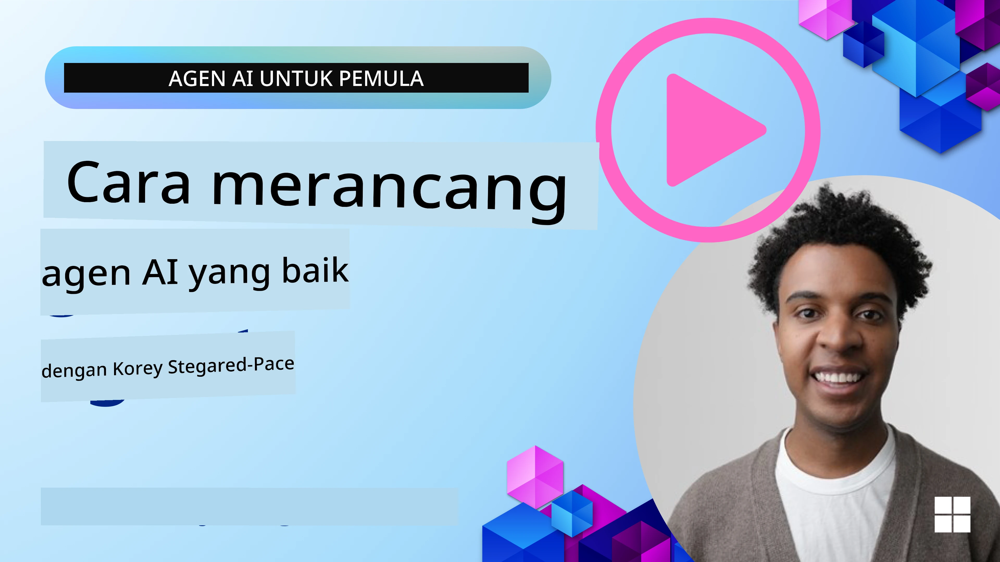
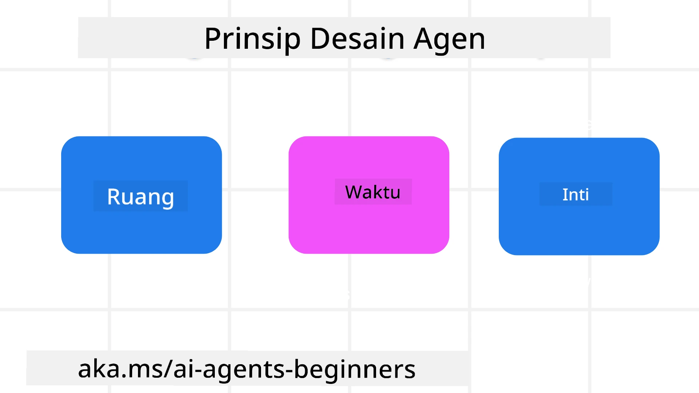

<!--
CO_OP_TRANSLATOR_METADATA:
{
  "original_hash": "d71524fe83a23829ae7a23b4031aaac8",
  "translation_date": "2025-11-13T13:22:05+00:00",
  "source_file": "03-agentic-design-patterns/README.md",
  "language_code": "id"
}
-->

> _(Klik gambar di atas untuk menonton video pelajaran ini)_
# Prinsip Desain Agen AI

## Pendahuluan

Ada banyak cara untuk memikirkan tentang membangun Sistem Agen AI. Mengingat bahwa ambiguitas adalah fitur dan bukan kekurangan dalam desain AI Generatif, terkadang sulit bagi para insinyur untuk menentukan dari mana harus memulai. Kami telah membuat serangkaian Prinsip Desain UX yang berpusat pada manusia untuk memungkinkan pengembang membangun sistem agen yang berpusat pada pelanggan guna memenuhi kebutuhan bisnis mereka. Prinsip desain ini bukanlah arsitektur yang bersifat preskriptif, melainkan titik awal bagi tim yang sedang mendefinisikan dan membangun pengalaman agen.

Secara umum, agen seharusnya:

- Memperluas dan meningkatkan kapasitas manusia (brainstorming, pemecahan masalah, otomatisasi, dll.)
- Mengisi kekurangan pengetahuan (membantu memahami domain pengetahuan, terjemahan, dll.)
- Memfasilitasi dan mendukung kolaborasi dengan cara yang sesuai dengan preferensi individu dalam bekerja dengan orang lain
- Membantu kita menjadi versi terbaik dari diri kita sendiri (misalnya, pelatih kehidupan/pengatur tugas, membantu kita belajar keterampilan regulasi emosional dan mindfulness, membangun ketahanan, dll.)

## Pelajaran Ini Akan Membahas

- Apa itu Prinsip Desain Agen
- Apa saja panduan yang harus diikuti saat menerapkan prinsip desain ini
- Contoh penggunaan prinsip desain ini

## Tujuan Pembelajaran

Setelah menyelesaikan pelajaran ini, Anda akan dapat:

1. Menjelaskan apa itu Prinsip Desain Agen
2. Menjelaskan panduan untuk menggunakan Prinsip Desain Agen
3. Memahami cara membangun agen menggunakan Prinsip Desain Agen

## Prinsip Desain Agen

### Agen (Ruang)

Ini adalah lingkungan tempat agen beroperasi. Prinsip-prinsip ini memberikan panduan tentang cara merancang agen untuk berinteraksi di dunia fisik dan digital.

- **Menghubungkan, bukan menggantikan** – membantu menghubungkan orang dengan orang lain, acara, dan pengetahuan yang dapat ditindaklanjuti untuk memungkinkan kolaborasi dan koneksi.
- Agen membantu menghubungkan acara, pengetahuan, dan orang.
- Agen mendekatkan orang satu sama lain. Mereka tidak dirancang untuk menggantikan atau merendahkan manusia.
- **Mudah diakses namun kadang-kadang tidak terlihat** – agen sebagian besar beroperasi di latar belakang dan hanya memberikan dorongan ketika relevan dan sesuai.
  - Agen mudah ditemukan dan diakses oleh pengguna yang berwenang di perangkat atau platform apa pun.
  - Agen mendukung input dan output multimodal (suara, teks, dll.).
  - Agen dapat beralih dengan mulus antara latar depan dan latar belakang; antara proaktif dan reaktif, tergantung pada kebutuhan pengguna.
  - Agen dapat beroperasi dalam bentuk yang tidak terlihat, namun proses latar belakangnya dan kolaborasi dengan agen lain transparan dan dapat dikontrol oleh pengguna.

### Agen (Waktu)

Ini adalah cara agen beroperasi dari waktu ke waktu. Prinsip-prinsip ini memberikan panduan tentang cara merancang agen yang berinteraksi di masa lalu, sekarang, dan masa depan.

- **Masa Lalu**: Merefleksikan sejarah yang mencakup baik keadaan maupun konteks.
  - Agen memberikan hasil yang lebih relevan berdasarkan analisis data historis yang lebih kaya, bukan hanya acara, orang, atau keadaan.
  - Agen menciptakan koneksi dari acara masa lalu dan secara aktif merefleksikan memori untuk berinteraksi dengan situasi saat ini.
- **Sekarang**: Memberikan dorongan lebih dari sekadar pemberitahuan.
  - Agen mengadopsi pendekatan yang komprehensif dalam berinteraksi dengan orang. Ketika sebuah acara terjadi, agen melampaui pemberitahuan statis atau formalitas statis lainnya. Agen dapat menyederhanakan alur atau secara dinamis menghasilkan petunjuk untuk mengarahkan perhatian pengguna pada saat yang tepat.
  - Agen menyampaikan informasi berdasarkan lingkungan kontekstual, perubahan sosial dan budaya, serta disesuaikan dengan niat pengguna.
  - Interaksi agen dapat bertahap, berkembang/meningkat dalam kompleksitas untuk memberdayakan pengguna dalam jangka panjang.
- **Masa Depan**: Beradaptasi dan berkembang.
  - Agen beradaptasi dengan berbagai perangkat, platform, dan modalitas.
  - Agen beradaptasi dengan perilaku pengguna, kebutuhan aksesibilitas, dan dapat disesuaikan secara bebas.
  - Agen dibentuk oleh dan berkembang melalui interaksi pengguna yang berkelanjutan.

### Agen (Inti)

Ini adalah elemen-elemen utama dalam inti desain agen.

- **Menerima ketidakpastian tetapi membangun kepercayaan**.
  - Tingkat ketidakpastian tertentu pada agen diharapkan. Ketidakpastian adalah elemen kunci dalam desain agen.
  - Kepercayaan dan transparansi adalah lapisan dasar dalam desain agen.
  - Manusia memiliki kendali atas kapan agen aktif/nonaktif dan status agen selalu terlihat dengan jelas.

## Panduan untuk Menerapkan Prinsip-Prinsip Ini

Saat Anda menggunakan prinsip desain sebelumnya, gunakan panduan berikut:

1. **Transparansi**: Beri tahu pengguna bahwa AI terlibat, bagaimana cara kerjanya (termasuk tindakan sebelumnya), dan bagaimana memberikan umpan balik serta memodifikasi sistem.
2. **Kontrol**: Berikan kemampuan kepada pengguna untuk menyesuaikan, menentukan preferensi, dan mempersonalisasi, serta memiliki kendali atas sistem dan atributnya (termasuk kemampuan untuk melupakan).
3. **Konsistensi**: Usahakan pengalaman yang konsisten dan multimodal di berbagai perangkat dan titik akhir. Gunakan elemen UI/UX yang sudah dikenal jika memungkinkan (misalnya, ikon mikrofon untuk interaksi suara) dan kurangi beban kognitif pelanggan sebanyak mungkin (misalnya, berikan respons yang ringkas, bantuan visual, dan konten 'Pelajari Lebih Lanjut').

## Cara Merancang Agen Perjalanan menggunakan Prinsip dan Panduan Ini

Bayangkan Anda sedang merancang Agen Perjalanan, berikut adalah cara Anda dapat memikirkan penggunaan Prinsip Desain dan Panduan:

1. **Transparansi** – Beri tahu pengguna bahwa Agen Perjalanan adalah agen yang didukung AI. Berikan beberapa instruksi dasar tentang cara memulai (misalnya, pesan "Halo", contoh prompt). Dokumentasikan ini dengan jelas di halaman produk. Tampilkan daftar prompt yang telah diminta pengguna di masa lalu. Jelaskan dengan jelas cara memberikan umpan balik (tombol jempol atas dan bawah, tombol Kirim Umpan Balik, dll.). Jelaskan dengan jelas jika agen memiliki batasan penggunaan atau topik.
2. **Kontrol** – Pastikan jelas bagaimana pengguna dapat memodifikasi agen setelah dibuat, seperti dengan Prompt Sistem. Berikan kemampuan kepada pengguna untuk memilih seberapa rinci agen, gaya penulisannya, dan batasan apa yang tidak boleh dibahas oleh agen. Izinkan pengguna untuk melihat dan menghapus file atau data terkait, prompt, dan percakapan sebelumnya.
3. **Konsistensi** – Pastikan ikon untuk Berbagi Prompt, menambahkan file atau foto, dan menandai seseorang atau sesuatu adalah standar dan mudah dikenali. Gunakan ikon penjepit kertas untuk menunjukkan unggahan/berbagi file dengan agen, dan ikon gambar untuk menunjukkan unggahan grafik.

## Contoh Kode

- Python: [Kerangka Agen](./code_samples/03-python-agent-framework.ipynb)
- .NET: [Kerangka Agen](./code_samples/03-dotnet-agent-framework.md)

## Punya Pertanyaan Lebih Lanjut tentang Pola Desain Agen AI?

Bergabunglah dengan [Azure AI Foundry Discord](https://aka.ms/ai-agents/discord) untuk bertemu dengan pelajar lainnya, menghadiri jam kantor, dan mendapatkan jawaban atas pertanyaan Anda tentang Agen AI.

## Sumber Daya Tambahan

- <a href="https://openai.com" target="_blank">Praktik untuk Mengelola Sistem AI Agen | OpenAI</a>
- <a href="https://microsoft.com" target="_blank">Proyek HAX Toolkit - Microsoft Research</a>
- <a href="https://responsibleaitoolbox.ai" target="_blank">Responsible AI Toolbox</a>

## Pelajaran Sebelumnya

[Menjelajahi Kerangka Agen](../02-explore-agentic-frameworks/README.md)

## Pelajaran Selanjutnya

[Pola Desain Penggunaan Alat](../04-tool-use/README.md)

---

<!-- CO-OP TRANSLATOR DISCLAIMER START -->
**Penafian**:  
Dokumen ini telah diterjemahkan menggunakan layanan penerjemahan AI [Co-op Translator](https://github.com/Azure/co-op-translator). Meskipun kami berupaya untuk memberikan hasil yang akurat, harap diketahui bahwa terjemahan otomatis mungkin mengandung kesalahan atau ketidakakuratan. Dokumen asli dalam bahasa aslinya harus dianggap sebagai sumber yang otoritatif. Untuk informasi yang penting, disarankan menggunakan jasa penerjemahan profesional oleh manusia. Kami tidak bertanggung jawab atas kesalahpahaman atau penafsiran yang timbul dari penggunaan terjemahan ini.
<!-- CO-OP TRANSLATOR DISCLAIMER END -->