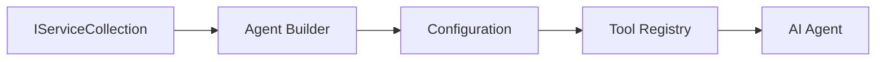

<!--
CO_OP_TRANSLATOR_METADATA:
{
  "original_hash": "bcc874e190347bd6a095aed56dc16de8",
  "translation_date": "2025-11-13T13:22:44+00:00",
  "source_file": "03-agentic-design-patterns/code_samples/03-dotnet-agent-framework.md",
  "language_code": "id"
}
-->
# 🎨 Pola Desain Agentik dengan Model GitHub (.NET)

## 📋 Tujuan Pembelajaran

Contoh ini menunjukkan pola desain tingkat perusahaan untuk membangun agen cerdas menggunakan Microsoft Agent Framework di .NET dengan integrasi Model GitHub. Anda akan mempelajari pola profesional dan pendekatan arsitektur yang membuat agen siap produksi, mudah dikelola, dan dapat diskalakan.

### Pola Desain Perusahaan

- 🏭 **Factory Pattern**: Pembuatan agen yang terstandarisasi dengan dependency injection
- 🔧 **Builder Pattern**: Konfigurasi dan pengaturan agen yang mudah
- 🧵 **Thread-Safe Patterns**: Pengelolaan percakapan secara bersamaan
- 📋 **Repository Pattern**: Pengelolaan alat dan kemampuan yang terorganisir

## 🎯 Manfaat Arsitektur Khusus .NET

### Fitur Perusahaan

- **Strong Typing**: Validasi saat kompilasi dan dukungan IntelliSense
- **Dependency Injection**: Integrasi container DI bawaan
- **Configuration Management**: Pola IConfiguration dan Options
- **Async/Await**: Dukungan pemrograman asinkron kelas satu

### Pola Siap Produksi

- **Integrasi Logging**: Dukungan ILogger dan logging terstruktur
- **Health Checks**: Pemantauan dan diagnostik bawaan
- **Validasi Konfigurasi**: Pengetikan kuat dengan anotasi data
- **Penanganan Kesalahan**: Pengelolaan pengecualian yang terstruktur

## 🔧 Arsitektur Teknis

### Komponen Inti .NET

- **Microsoft.Extensions.AI**: Abstraksi layanan AI yang terpadu
- **Microsoft.Agents.AI**: Kerangka orkestrasi agen tingkat perusahaan
- **Integrasi Model GitHub**: Pola klien API berkinerja tinggi
- **Sistem Konfigurasi**: Integrasi appsettings.json dan lingkungan

### Implementasi Pola Desain



## 🏗️ Pola Perusahaan yang Ditunjukkan

### 1. **Pola Kreasi**

- **Agent Factory**: Pembuatan agen terpusat dengan konfigurasi yang konsisten
- **Builder Pattern**: API yang mudah untuk konfigurasi agen yang kompleks
- **Singleton Pattern**: Pengelolaan sumber daya dan konfigurasi bersama
- **Dependency Injection**: Keterhubungan yang longgar dan mudah diuji

### 2. **Pola Perilaku**

- **Strategy Pattern**: Strategi eksekusi alat yang dapat diganti
- **Command Pattern**: Operasi agen yang terenkapsulasi dengan undo/redo
- **Observer Pattern**: Pengelolaan siklus hidup agen berbasis peristiwa
- **Template Method**: Alur kerja eksekusi agen yang terstandarisasi

### 3. **Pola Struktural**

- **Adapter Pattern**: Lapisan integrasi API Model GitHub
- **Decorator Pattern**: Peningkatan kemampuan agen
- **Facade Pattern**: Antarmuka interaksi agen yang disederhanakan
- **Proxy Pattern**: Pemuatan lambat dan caching untuk kinerja

## 📚 Prinsip Desain .NET

### Prinsip SOLID

- **Single Responsibility**: Setiap komponen memiliki satu tujuan yang jelas
- **Open/Closed**: Dapat diperluas tanpa modifikasi
- **Liskov Substitution**: Implementasi alat berbasis antarmuka
- **Interface Segregation**: Antarmuka yang fokus dan kohesif
- **Dependency Inversion**: Bergantung pada abstraksi, bukan konkret

### Arsitektur Bersih

- **Domain Layer**: Abstraksi inti agen dan alat
- **Application Layer**: Orkestrasi agen dan alur kerja
- **Infrastructure Layer**: Integrasi Model GitHub dan layanan eksternal
- **Presentation Layer**: Interaksi pengguna dan pemformatan respons

## 🔒 Pertimbangan Perusahaan

### Keamanan

- **Pengelolaan Kredensial**: Penanganan kunci API yang aman dengan IConfiguration
- **Validasi Input**: Pengetikan kuat dan validasi anotasi data
- **Sanitasi Output**: Pemrosesan respons yang aman dan penyaringan
- **Audit Logging**: Pelacakan operasi yang komprehensif

### Kinerja

- **Pola Asinkron**: Operasi I/O yang tidak memblokir
- **Connection Pooling**: Pengelolaan klien HTTP yang efisien
- **Caching**: Caching respons untuk meningkatkan kinerja
- **Pengelolaan Sumber Daya**: Pola pembuangan dan pembersihan yang tepat

### Skalabilitas

- **Keamanan Thread**: Dukungan eksekusi agen secara bersamaan
- **Pengelolaan Sumber Daya**: Pemanfaatan sumber daya yang efisien
- **Pengelolaan Beban**: Pembatasan laju dan penanganan tekanan balik
- **Pemantauan**: Metrik kinerja dan pemeriksaan kesehatan

## 🚀 Penerapan Produksi

- **Pengelolaan Konfigurasi**: Pengaturan khusus lingkungan
- **Strategi Logging**: Logging terstruktur dengan ID korelasi
- **Penanganan Kesalahan**: Penanganan pengecualian global dengan pemulihan yang tepat
- **Pemantauan**: Application insights dan penghitung kinerja
- **Pengujian**: Pola pengujian unit, integrasi, dan beban

Siap membangun agen cerdas tingkat perusahaan dengan .NET? Mari arsitek sesuatu yang kokoh! 🏢✨

## 🚀 Memulai

### Prasyarat

- [.NET 10 SDK](https://dotnet.microsoft.com/download/dotnet/10.0) atau lebih tinggi
- [Token akses API Model GitHub](https://docs.github.com/github-models/github-models-at-scale/using-your-own-api-keys-in-github-models)

### Variabel Lingkungan yang Diperlukan

```bash
# zsh/bash
export GH_TOKEN=<your_github_token>
export GH_ENDPOINT=https://models.github.ai/inference
export GH_MODEL_ID=openai/gpt-5-mini
```

```powershell
# PowerShell
$env:GH_TOKEN = "<your_github_token>"
$env:GH_ENDPOINT = "https://models.github.ai/inference"
$env:GH_MODEL_ID = "openai/gpt-5-mini"
```

### Contoh Kode

Untuk menjalankan contoh kode,

```bash
# zsh/bash
chmod +x ./03-dotnet-agent-framework.cs
./03-dotnet-agent-framework.cs
```

Atau menggunakan dotnet CLI:

```bash
dotnet run ./03-dotnet-agent-framework.cs
```

Lihat [`03-dotnet-agent-framework.cs`](../../../../03-agentic-design-patterns/code_samples/03-dotnet-agent-framework.cs) untuk kode lengkapnya.

```csharp
#!/usr/bin/dotnet run

#:package Microsoft.Extensions.AI@10.*
#:package Microsoft.Agents.AI.OpenAI@1.*-*

using System.ClientModel;
using System.ComponentModel;

using Microsoft.Agents.AI;
using Microsoft.Extensions.AI;

using OpenAI;

// Tool Function: Random Destination Generator
// This static method will be available to the agent as a callable tool
// The [Description] attribute helps the AI understand when to use this function
// This demonstrates how to create custom tools for AI agents
[Description("Provides a random vacation destination.")]
static string GetRandomDestination()
{
    // List of popular vacation destinations around the world
    // The agent will randomly select from these options
    var destinations = new List<string>
    {
        "Paris, France",
        "Tokyo, Japan",
        "New York City, USA",
        "Sydney, Australia",
        "Rome, Italy",
        "Barcelona, Spain",
        "Cape Town, South Africa",
        "Rio de Janeiro, Brazil",
        "Bangkok, Thailand",
        "Vancouver, Canada"
    };

    // Generate random index and return selected destination
    // Uses System.Random for simple random selection
    var random = new Random();
    int index = random.Next(destinations.Count);
    return destinations[index];
}

// Extract configuration from environment variables
// Retrieve the GitHub Models API endpoint, defaults to https://models.github.ai/inference if not specified
// Retrieve the model ID, defaults to openai/gpt-5-mini if not specified
// Retrieve the GitHub token for authentication, throws exception if not specified
var github_endpoint = Environment.GetEnvironmentVariable("GH_ENDPOINT") ?? "https://models.github.ai/inference";
var github_model_id = Environment.GetEnvironmentVariable("GH_MODEL_ID") ?? "openai/gpt-5-mini";
var github_token = Environment.GetEnvironmentVariable("GH_TOKEN") ?? throw new InvalidOperationException("GH_TOKEN is not set.");

// Configure OpenAI Client Options
// Create configuration options to point to GitHub Models endpoint
// This redirects OpenAI client calls to GitHub's model inference service
var openAIOptions = new OpenAIClientOptions()
{
    Endpoint = new Uri(github_endpoint)
};

// Initialize OpenAI Client with GitHub Models Configuration
// Create OpenAI client using GitHub token for authentication
// Configure it to use GitHub Models endpoint instead of OpenAI directly
var openAIClient = new OpenAIClient(new ApiKeyCredential(github_token), openAIOptions);

// Define Agent Identity and Comprehensive Instructions
// Agent name for identification and logging purposes
var AGENT_NAME = "TravelAgent";

// Detailed instructions that define the agent's personality, capabilities, and behavior
// This system prompt shapes how the agent responds and interacts with users
var AGENT_INSTRUCTIONS = """
You are a helpful AI Agent that can help plan vacations for customers.

Important: When users specify a destination, always plan for that location. Only suggest random destinations when the user hasn't specified a preference.

When the conversation begins, introduce yourself with this message:
"Hello! I'm your TravelAgent assistant. I can help plan vacations and suggest interesting destinations for you. Here are some things you can ask me:
1. Plan a day trip to a specific location
2. Suggest a random vacation destination
3. Find destinations with specific features (beaches, mountains, historical sites, etc.)
4. Plan an alternative trip if you don't like my first suggestion

What kind of trip would you like me to help you plan today?"

Always prioritize user preferences. If they mention a specific destination like "Bali" or "Paris," focus your planning on that location rather than suggesting alternatives.
""";

// Create AI Agent with Advanced Travel Planning Capabilities
// Initialize complete agent pipeline: OpenAI client → Chat client → AI agent
// Configure agent with name, detailed instructions, and available tools
// This demonstrates the .NET agent creation pattern with full configuration
AIAgent agent = openAIClient
    .GetChatClient(github_model_id)
    .CreateAIAgent(
        name: AGENT_NAME,
        instructions: AGENT_INSTRUCTIONS,
        tools: [AIFunctionFactory.Create(GetRandomDestination)]
    );

// Create New Conversation Thread for Context Management
// Initialize a new conversation thread to maintain context across multiple interactions
// Threads enable the agent to remember previous exchanges and maintain conversational state
// This is essential for multi-turn conversations and contextual understanding
AgentThread thread = agent.GetNewThread();

// Execute Agent: First Travel Planning Request
// Run the agent with an initial request that will likely trigger the random destination tool
// The agent will analyze the request, use the GetRandomDestination tool, and create an itinerary
// Using the thread parameter maintains conversation context for subsequent interactions
await foreach (var update in agent.RunStreamingAsync("Plan me a day trip", thread))
{
    await Task.Delay(10);
    Console.Write(update);
}

Console.WriteLine();

// Execute Agent: Follow-up Request with Context Awareness
// Demonstrate contextual conversation by referencing the previous response
// The agent remembers the previous destination suggestion and will provide an alternative
// This showcases the power of conversation threads and contextual understanding in .NET agents
await foreach (var update in agent.RunStreamingAsync("I don't like that destination. Plan me another vacation.", thread))
{
    await Task.Delay(10);
    Console.Write(update);
}
```

---

<!-- CO-OP TRANSLATOR DISCLAIMER START -->
**Penafian**:  
Dokumen ini telah diterjemahkan menggunakan layanan terjemahan AI [Co-op Translator](https://github.com/Azure/co-op-translator). Meskipun kami berupaya untuk memberikan hasil yang akurat, harap diperhatikan bahwa terjemahan otomatis mungkin mengandung kesalahan atau ketidakakuratan. Dokumen asli dalam bahasa aslinya harus dianggap sebagai sumber yang berwenang. Untuk informasi yang bersifat kritis, disarankan menggunakan jasa terjemahan manusia profesional. Kami tidak bertanggung jawab atas kesalahpahaman atau interpretasi yang salah yang timbul dari penggunaan terjemahan ini.
<!-- CO-OP TRANSLATOR DISCLAIMER END -->