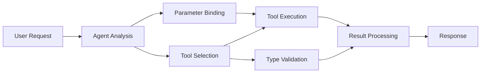

<!--
CO_OP_TRANSLATOR_METADATA:
{
  "original_hash": "91d6061e402489603f2ec8b528cae59b",
  "translation_date": "2025-11-18T17:57:59+00:00",
  "source_file": "04-tool-use/code_samples/04-dotnet-agent-framework.md",
  "language_code": "id"
}
-->
# 🛠️ Penggunaan Alat Lanjutan dengan Model GitHub (.NET)

## 📋 Tujuan Pembelajaran

Notebook ini menunjukkan pola integrasi alat tingkat perusahaan menggunakan Microsoft Agent Framework di .NET dengan Model GitHub. Anda akan belajar membangun agen canggih dengan berbagai alat khusus, memanfaatkan tipe data yang kuat dari C# dan fitur-fitur enterprise dari .NET.

### Kemampuan Alat Lanjutan yang Akan Anda Kuasai

- 🔧 **Arsitektur Multi-Alat**: Membangun agen dengan berbagai kemampuan khusus
- 🎯 **Eksekusi Alat yang Aman Tipe**: Memanfaatkan validasi waktu kompilasi dari C#
- 📊 **Pola Alat Enterprise**: Desain alat siap produksi dan penanganan kesalahan
- 🔗 **Komposisi Alat**: Menggabungkan alat untuk alur kerja bisnis yang kompleks

## 🎯 Manfaat Arsitektur Alat .NET

### Fitur Alat Enterprise

- **Validasi Waktu Kompilasi**: Tipe data yang kuat memastikan parameter alat benar
- **Dependency Injection**: Integrasi IoC container untuk pengelolaan alat
- **Pola Async/Await**: Eksekusi alat non-blok dengan pengelolaan sumber daya yang tepat
- **Logging Terstruktur**: Integrasi logging bawaan untuk pemantauan eksekusi alat

### Pola Siap Produksi

- **Penanganan Eksepsi**: Pengelolaan kesalahan yang komprehensif dengan eksepsi bertipe
- **Pengelolaan Sumber Daya**: Pola pembuangan yang tepat dan pengelolaan memori
- **Pemantauan Performa**: Metrik bawaan dan penghitung performa
- **Pengelolaan Konfigurasi**: Konfigurasi yang aman tipe dengan validasi

## 🔧 Arsitektur Teknis

### Komponen Alat Inti .NET

- **Microsoft.Extensions.AI**: Lapisan abstraksi alat yang terintegrasi
- **Microsoft.Agents.AI**: Orkestrasi alat tingkat perusahaan
- **Integrasi Model GitHub**: Klien API berperforma tinggi dengan pooling koneksi

### Pipeline Eksekusi Alat



## 🛠️ Kategori & Pola Alat

### 1. **Alat Pemrosesan Data**

- **Validasi Input**: Tipe data yang kuat dengan anotasi data
- **Operasi Transformasi**: Konversi dan format data yang aman tipe
- **Logika Bisnis**: Alat kalkulasi dan analisis spesifik domain
- **Format Output**: Generasi respons yang terstruktur

### 2. **Alat Integrasi**

- **API Connectors**: Integrasi layanan RESTful dengan HttpClient
- **Alat Database**: Integrasi Entity Framework untuk akses data
- **Operasi File**: Operasi sistem file yang aman dengan validasi
- **Layanan Eksternal**: Pola integrasi layanan pihak ketiga

### 3. **Alat Utilitas**

- **Pemrosesan Teks**: Utilitas manipulasi dan format string
- **Operasi Tanggal/Waktu**: Kalkulasi tanggal/waktu yang sesuai budaya
- **Alat Matematika**: Kalkulasi presisi dan operasi statistik
- **Alat Validasi**: Validasi aturan bisnis dan verifikasi data

Siap membangun agen tingkat perusahaan dengan kemampuan alat yang kuat dan aman tipe di .NET? Mari kita arsitekkan solusi profesional! 🏢⚡

## 🚀 Memulai

### Prasyarat

- [.NET 10 SDK](https://dotnet.microsoft.com/download/dotnet/10.0) atau lebih tinggi
- [Token akses API Model GitHub](https://docs.github.com/github-models/github-models-at-scale/using-your-own-api-keys-in-github-models)

### Variabel Lingkungan yang Diperlukan

```bash
# zsh/bash
export GH_TOKEN=<your_github_token>
export GH_ENDPOINT=https://models.github.ai/inference
export GH_MODEL_ID=openai/gpt-5-mini
```

```powershell
# PowerShell
$env:GH_TOKEN = "<your_github_token>"
$env:GH_ENDPOINT = "https://models.github.ai/inference"
$env:GH_MODEL_ID = "openai/gpt-5-mini"
```

### Contoh Kode

Untuk menjalankan contoh kode,

```bash
# zsh/bash
chmod +x ./04-dotnet-agent-framework.cs
./04-dotnet-agent-framework.cs
```

Atau menggunakan dotnet CLI:

```bash
dotnet run ./04-dotnet-agent-framework.cs
```

Lihat [`04-dotnet-agent-framework.cs`](../../../../04-tool-use/code_samples/04-dotnet-agent-framework.cs) untuk kode lengkapnya.

```csharp
#!/usr/bin/dotnet run

#:package Microsoft.Extensions.AI@10.*
#:package Microsoft.Agents.AI.OpenAI@1.*-*

using System.ClientModel;
using System.ComponentModel;

using Microsoft.Agents.AI;
using Microsoft.Extensions.AI;

using OpenAI;

// Tool Function: Random Destination Generator
// This static method will be available to the agent as a callable tool
// The [Description] attribute helps the AI understand when to use this function
// This demonstrates how to create custom tools for AI agents
[Description("Provides a random vacation destination.")]
static string GetRandomDestination()
{
    // List of popular vacation destinations around the world
    // The agent will randomly select from these options
    var destinations = new List<string>
    {
        "Paris, France",
        "Tokyo, Japan",
        "New York City, USA",
        "Sydney, Australia",
        "Rome, Italy",
        "Barcelona, Spain",
        "Cape Town, South Africa",
        "Rio de Janeiro, Brazil",
        "Bangkok, Thailand",
        "Vancouver, Canada"
    };

    // Generate random index and return selected destination
    // Uses System.Random for simple random selection
    var random = new Random();
    int index = random.Next(destinations.Count);
    return destinations[index];
}

// Extract configuration from environment variables
// Retrieve the GitHub Models API endpoint, defaults to https://models.github.ai/inference if not specified
// Retrieve the model ID, defaults to openai/gpt-5-mini if not specified
// Retrieve the GitHub token for authentication, throws exception if not specified
var github_endpoint = Environment.GetEnvironmentVariable("GH_ENDPOINT") ?? "https://models.github.ai/inference";
var github_model_id = Environment.GetEnvironmentVariable("GH_MODEL_ID") ?? "openai/gpt-5-mini";
var github_token = Environment.GetEnvironmentVariable("GH_TOKEN") ?? throw new InvalidOperationException("GH_TOKEN is not set.");

// Configure OpenAI Client Options
// Create configuration options to point to GitHub Models endpoint
// This redirects OpenAI client calls to GitHub's model inference service
var openAIOptions = new OpenAIClientOptions()
{
    Endpoint = new Uri(github_endpoint)
};

// Initialize OpenAI Client with GitHub Models Configuration
// Create OpenAI client using GitHub token for authentication
// Configure it to use GitHub Models endpoint instead of OpenAI directly
var openAIClient = new OpenAIClient(new ApiKeyCredential(github_token), openAIOptions);

// Define Agent Identity and Comprehensive Instructions
// Agent name for identification and logging purposes
var AGENT_NAME = "TravelAgent";

// Detailed instructions that define the agent's personality, capabilities, and behavior
// This system prompt shapes how the agent responds and interacts with users
var AGENT_INSTRUCTIONS = """
You are a helpful AI Agent that can help plan vacations for customers.

Important: When users specify a destination, always plan for that location. Only suggest random destinations when the user hasn't specified a preference.

When the conversation begins, introduce yourself with this message:
"Hello! I'm your TravelAgent assistant. I can help plan vacations and suggest interesting destinations for you. Here are some things you can ask me:
1. Plan a day trip to a specific location
2. Suggest a random vacation destination
3. Find destinations with specific features (beaches, mountains, historical sites, etc.)
4. Plan an alternative trip if you don't like my first suggestion

What kind of trip would you like me to help you plan today?"

Always prioritize user preferences. If they mention a specific destination like "Bali" or "Paris," focus your planning on that location rather than suggesting alternatives.
""";

// Create AI Agent with Advanced Travel Planning Capabilities
// Initialize complete agent pipeline: OpenAI client → Chat client → AI agent
// Configure agent with name, detailed instructions, and available tools
// This demonstrates the .NET agent creation pattern with full configuration
AIAgent agent = openAIClient
    .GetChatClient(github_model_id)
    .CreateAIAgent(
        name: AGENT_NAME,
        instructions: AGENT_INSTRUCTIONS,
        tools: [AIFunctionFactory.Create(GetRandomDestination)]
    );

// Create New Conversation Thread for Context Management
// Initialize a new conversation thread to maintain context across multiple interactions
// Threads enable the agent to remember previous exchanges and maintain conversational state
// This is essential for multi-turn conversations and contextual understanding
AgentThread thread = agent.GetNewThread();

// Execute Agent: First Travel Planning Request
// Run the agent with an initial request that will likely trigger the random destination tool
// The agent will analyze the request, use the GetRandomDestination tool, and create an itinerary
// Using the thread parameter maintains conversation context for subsequent interactions
await foreach (var update in agent.RunStreamingAsync("Plan me a day trip", thread))
{
    await Task.Delay(10);
    Console.Write(update);
}

Console.WriteLine();

// Execute Agent: Follow-up Request with Context Awareness
// Demonstrate contextual conversation by referencing the previous response
// The agent remembers the previous destination suggestion and will provide an alternative
// This showcases the power of conversation threads and contextual understanding in .NET agents
await foreach (var update in agent.RunStreamingAsync("I don't like that destination. Plan me another vacation.", thread))
{
    await Task.Delay(10);
    Console.Write(update);
}
```

---

<!-- CO-OP TRANSLATOR DISCLAIMER START -->
**Penafian**:  
Dokumen ini telah diterjemahkan menggunakan layanan penerjemahan AI [Co-op Translator](https://github.com/Azure/co-op-translator). Meskipun kami berupaya untuk memberikan hasil yang akurat, harap diketahui bahwa terjemahan otomatis mungkin mengandung kesalahan atau ketidakakuratan. Dokumen asli dalam bahasa aslinya harus dianggap sebagai sumber yang otoritatif. Untuk informasi yang penting, disarankan menggunakan jasa penerjemahan manusia profesional. Kami tidak bertanggung jawab atas kesalahpahaman atau penafsiran yang timbul dari penggunaan terjemahan ini.
<!-- CO-OP TRANSLATOR DISCLAIMER END -->