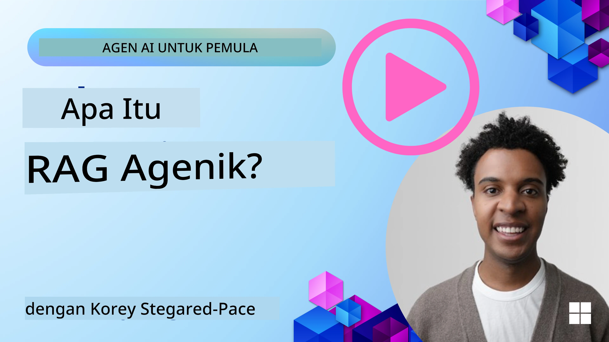
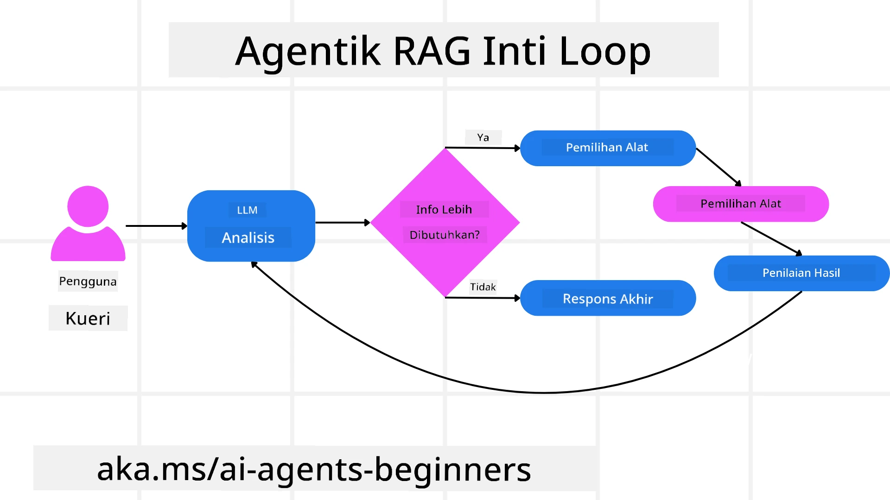
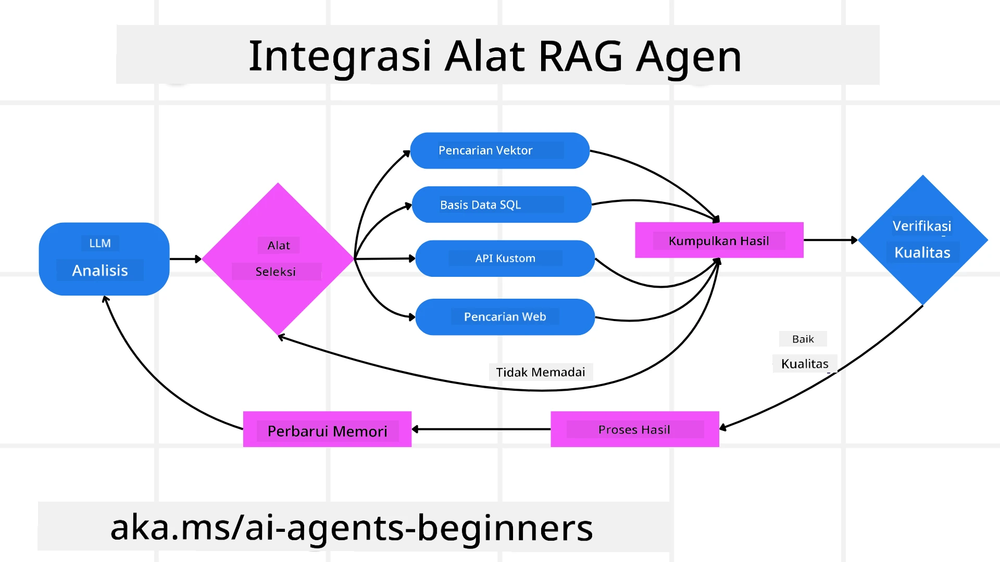
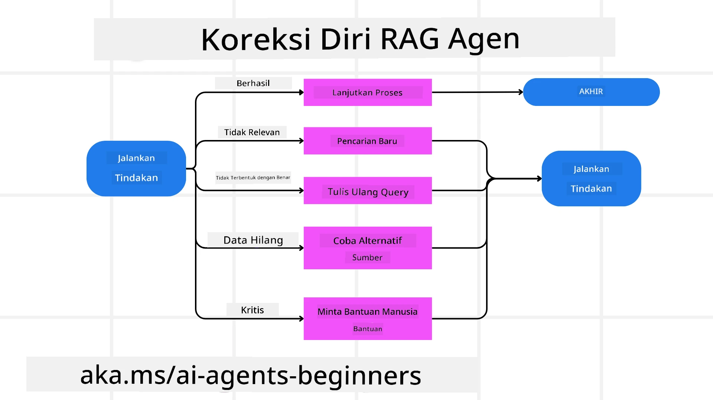

<!--
CO_OP_TRANSLATOR_METADATA:
{
  "original_hash": "0ebf6b2290db55dbf2d10cc49655523b",
  "translation_date": "2025-09-30T07:29:14+00:00",
  "source_file": "05-agentic-rag/README.md",
  "language_code": "id"
}
-->

> _(Klik gambar di atas untuk menonton video pelajaran ini)_

# Agentic RAG

Pelajaran ini memberikan gambaran menyeluruh tentang Agentic Retrieval-Augmented Generation (Agentic RAG), sebuah paradigma AI yang sedang berkembang di mana model bahasa besar (LLM) secara mandiri merencanakan langkah berikutnya sambil mengambil informasi dari sumber eksternal. Berbeda dengan pola retrieval-then-read yang statis, Agentic RAG melibatkan panggilan berulang ke LLM, diselingi dengan penggunaan alat atau fungsi dan output yang terstruktur. Sistem ini mengevaluasi hasil, menyempurnakan kueri, menggunakan alat tambahan jika diperlukan, dan melanjutkan siklus ini hingga solusi yang memuaskan tercapai.

## Pendahuluan

Pelajaran ini akan mencakup:

- **Memahami Agentic RAG:** Pelajari paradigma AI yang sedang berkembang di mana model bahasa besar (LLM) secara mandiri merencanakan langkah berikutnya sambil mengambil informasi dari sumber data eksternal.
- **Memahami Gaya Iteratif Maker-Checker:** Pahami siklus panggilan berulang ke LLM, diselingi dengan penggunaan alat atau fungsi dan output yang terstruktur, yang dirancang untuk meningkatkan akurasi dan menangani kueri yang tidak sesuai.
- **Mengeksplorasi Aplikasi Praktis:** Identifikasi skenario di mana Agentic RAG unggul, seperti lingkungan yang mengutamakan akurasi, interaksi database yang kompleks, dan alur kerja yang panjang.

## Tujuan Pembelajaran

Setelah menyelesaikan pelajaran ini, Anda akan mengetahui/memahami:

- **Memahami Agentic RAG:** Pelajari paradigma AI yang sedang berkembang di mana model bahasa besar (LLM) secara mandiri merencanakan langkah berikutnya sambil mengambil informasi dari sumber data eksternal.
- **Gaya Iteratif Maker-Checker:** Pahami konsep siklus panggilan berulang ke LLM, diselingi dengan penggunaan alat atau fungsi dan output yang terstruktur, yang dirancang untuk meningkatkan akurasi dan menangani kueri yang tidak sesuai.
- **Menguasai Proses Penalaran:** Pahami kemampuan sistem untuk menguasai proses penalarannya, membuat keputusan tentang cara mendekati masalah tanpa bergantung pada jalur yang telah ditentukan sebelumnya.
- **Alur Kerja:** Pahami bagaimana model agentic secara mandiri memutuskan untuk mengambil laporan tren pasar, mengidentifikasi data pesaing, menghubungkan metrik penjualan internal, mensintesis temuan, dan mengevaluasi strategi.
- **Siklus Iteratif, Integrasi Alat, dan Memori:** Pelajari ketergantungan sistem pada pola interaksi berulang, mempertahankan status dan memori di setiap langkah untuk menghindari pengulangan dan membuat keputusan yang lebih baik.
- **Menangani Mode Kegagalan dan Koreksi Diri:** Eksplorasi mekanisme koreksi diri yang kuat dari sistem, termasuk iterasi dan kueri ulang, menggunakan alat diagnostik, dan mengandalkan pengawasan manusia.
- **Batasan Agensi:** Pahami keterbatasan Agentic RAG, dengan fokus pada otonomi spesifik domain, ketergantungan infrastruktur, dan penghormatan terhadap batasan.
- **Kasus Penggunaan Praktis dan Nilai:** Identifikasi skenario di mana Agentic RAG unggul, seperti lingkungan yang mengutamakan akurasi, interaksi database yang kompleks, dan alur kerja yang panjang.
- **Tata Kelola, Transparansi, dan Kepercayaan:** Pelajari pentingnya tata kelola dan transparansi, termasuk penalaran yang dapat dijelaskan, pengendalian bias, dan pengawasan manusia.

## Apa itu Agentic RAG?

Agentic Retrieval-Augmented Generation (Agentic RAG) adalah paradigma AI yang sedang berkembang di mana model bahasa besar (LLM) secara mandiri merencanakan langkah berikutnya sambil mengambil informasi dari sumber eksternal. Berbeda dengan pola retrieval-then-read yang statis, Agentic RAG melibatkan panggilan berulang ke LLM, diselingi dengan penggunaan alat atau fungsi dan output yang terstruktur. Sistem ini mengevaluasi hasil, menyempurnakan kueri, menggunakan alat tambahan jika diperlukan, dan melanjutkan siklus ini hingga solusi yang memuaskan tercapai. Gaya iteratif “maker-checker” ini meningkatkan akurasi, menangani kueri yang tidak sesuai, dan memastikan hasil berkualitas tinggi.

Sistem ini secara aktif menguasai proses penalarannya, menulis ulang kueri yang gagal, memilih metode pengambilan yang berbeda, dan mengintegrasikan berbagai alat—seperti pencarian vektor di Azure AI Search, database SQL, atau API khusus—sebelum menyelesaikan jawabannya. Kualitas pembeda dari sistem agentic adalah kemampuannya untuk menguasai proses penalarannya. Implementasi RAG tradisional bergantung pada jalur yang telah ditentukan sebelumnya, tetapi sistem agentic secara mandiri menentukan urutan langkah berdasarkan kualitas informasi yang ditemukan.

## Mendefinisikan Agentic Retrieval-Augmented Generation (Agentic RAG)

Agentic Retrieval-Augmented Generation (Agentic RAG) adalah paradigma yang sedang berkembang dalam pengembangan AI di mana LLM tidak hanya mengambil informasi dari sumber data eksternal tetapi juga secara mandiri merencanakan langkah berikutnya. Berbeda dengan pola retrieval-then-read yang statis atau urutan prompt yang dirancang dengan hati-hati, Agentic RAG melibatkan siklus panggilan berulang ke LLM, diselingi dengan penggunaan alat atau fungsi dan output yang terstruktur. Pada setiap langkah, sistem mengevaluasi hasil yang diperoleh, memutuskan apakah perlu menyempurnakan kueri, menggunakan alat tambahan jika diperlukan, dan melanjutkan siklus ini hingga mencapai solusi yang memuaskan.

Gaya operasi iteratif “maker-checker” ini dirancang untuk meningkatkan akurasi, menangani kueri yang tidak sesuai ke database terstruktur (misalnya NL2SQL), dan memastikan hasil yang seimbang dan berkualitas tinggi. Alih-alih hanya mengandalkan rantai prompt yang dirancang dengan hati-hati, sistem ini secara aktif menguasai proses penalarannya. Sistem ini dapat menulis ulang kueri yang gagal, memilih metode pengambilan yang berbeda, dan mengintegrasikan berbagai alat—seperti pencarian vektor di Azure AI Search, database SQL, atau API khusus—sebelum menyelesaikan jawabannya. Hal ini menghilangkan kebutuhan akan kerangka orkestrasi yang terlalu kompleks. Sebaliknya, siklus sederhana “panggilan LLM → penggunaan alat → panggilan LLM → …” dapat menghasilkan output yang canggih dan terstruktur dengan baik.

## Menguasai Proses Penalaran

Kualitas pembeda yang membuat sistem menjadi “agentic” adalah kemampuannya untuk menguasai proses penalarannya. Implementasi RAG tradisional sering kali bergantung pada manusia untuk menentukan jalur bagi model: sebuah chain-of-thought yang menguraikan apa yang harus diambil dan kapan. Namun, ketika sistem benar-benar agentic, ia secara internal memutuskan bagaimana mendekati masalah. Sistem ini tidak hanya menjalankan skrip; ia secara mandiri menentukan urutan langkah berdasarkan kualitas informasi yang ditemukan.

Sebagai contoh, jika diminta untuk membuat strategi peluncuran produk, sistem ini tidak hanya bergantung pada prompt yang merinci seluruh alur kerja penelitian dan pengambilan keputusan. Sebaliknya, model agentic secara mandiri memutuskan untuk:

1. Mengambil laporan tren pasar terkini menggunakan Bing Web Grounding.
2. Mengidentifikasi data pesaing yang relevan menggunakan Azure AI Search.
3. Menghubungkan metrik penjualan internal historis menggunakan Azure SQL Database.
4. Mensintesis temuan menjadi strategi yang kohesif yang diorkestrasi melalui Azure OpenAI Service.
5. Mengevaluasi strategi untuk menemukan celah atau ketidakkonsistenan, dan memulai putaran pengambilan data lainnya jika diperlukan.

Semua langkah ini—menyempurnakan kueri, memilih sumber, mengulangi hingga “puas” dengan jawabannya—diputuskan oleh model, bukan diskriptkan sebelumnya oleh manusia.

## Siklus Iteratif, Integrasi Alat, dan Memori

Sistem agentic bergantung pada pola interaksi berulang:

- **Panggilan Awal:** Tujuan pengguna (alias prompt pengguna) disampaikan kepada LLM.
- **Penggunaan Alat:** Jika model mengidentifikasi informasi yang hilang atau instruksi yang ambigu, ia memilih alat atau metode pengambilan—seperti kueri database vektor (misalnya Azure AI Search Hybrid search pada data pribadi) atau panggilan SQL terstruktur—untuk mengumpulkan lebih banyak konteks.
- **Penilaian & Penyempurnaan:** Setelah meninjau data yang dikembalikan, model memutuskan apakah informasi tersebut sudah cukup. Jika tidak, ia menyempurnakan kueri, mencoba alat yang berbeda, atau menyesuaikan pendekatannya.
- **Ulangi Hingga Puas:** Siklus ini berlanjut hingga model menentukan bahwa ia memiliki kejelasan dan bukti yang cukup untuk memberikan respons akhir yang terstruktur dengan baik.
- **Memori & Status:** Karena sistem mempertahankan status dan memori di setiap langkah, ia dapat mengingat upaya sebelumnya dan hasilnya, menghindari pengulangan dan membuat keputusan yang lebih baik saat melanjutkan.

Seiring waktu, ini menciptakan rasa pemahaman yang berkembang, memungkinkan model untuk menavigasi tugas-tugas kompleks yang terdiri dari banyak langkah tanpa memerlukan intervensi manusia secara terus-menerus atau pengubahan prompt.

## Menangani Mode Kegagalan dan Koreksi Diri

Otonomi Agentic RAG juga melibatkan mekanisme koreksi diri yang kuat. Ketika sistem menemui jalan buntu—seperti mengambil dokumen yang tidak relevan atau menghadapi kueri yang tidak sesuai—sistem dapat:

- **Iterasi dan Kueri Ulang:** Alih-alih memberikan respons yang bernilai rendah, model mencoba strategi pencarian baru, menulis ulang kueri database, atau melihat kumpulan data alternatif.
- **Menggunakan Alat Diagnostik:** Sistem dapat menggunakan fungsi tambahan yang dirancang untuk membantunya memeriksa langkah-langkah penalarannya atau mengonfirmasi keakuratan data yang diambil. Alat seperti Azure AI Tracing akan penting untuk memungkinkan observabilitas dan pemantauan yang kuat.
- **Mengandalkan Pengawasan Manusia:** Untuk skenario yang berisiko tinggi atau berulang kali gagal, model mungkin menandai ketidakpastian dan meminta panduan manusia. Setelah manusia memberikan umpan balik korektif, model dapat mengintegrasikan pelajaran tersebut ke depannya.

Pendekatan yang iteratif dan dinamis ini memungkinkan model untuk terus meningkatkan diri, memastikan bahwa ia bukan hanya sistem sekali pakai tetapi sistem yang belajar dari kesalahan selama sesi tertentu.

## Batasan Agensi

Meskipun memiliki otonomi dalam tugas tertentu, Agentic RAG tidak setara dengan Artificial General Intelligence. Kemampuan “agentic”-nya terbatas pada alat, sumber data, dan kebijakan yang disediakan oleh pengembang manusia. Sistem ini tidak dapat menciptakan alatnya sendiri atau melampaui batas domain yang telah ditetapkan. Sebaliknya, sistem ini unggul dalam mengorkestrasi sumber daya yang ada secara dinamis.

Perbedaan utama dari bentuk AI yang lebih maju meliputi:

1. **Otonomi Spesifik Domain:** Sistem Agentic RAG berfokus pada pencapaian tujuan yang ditentukan pengguna dalam domain yang diketahui, menggunakan strategi seperti penulisan ulang kueri atau pemilihan alat untuk meningkatkan hasil.
2. **Ketergantungan Infrastruktur:** Kemampuan sistem bergantung pada alat dan data yang diintegrasikan oleh pengembang. Sistem ini tidak dapat melampaui batasan ini tanpa intervensi manusia.
3. **Penghormatan terhadap Batasan:** Pedoman etika, aturan kepatuhan, dan kebijakan bisnis tetap sangat penting. Kebebasan agen selalu dibatasi oleh langkah-langkah keamanan dan mekanisme pengawasan (semoga?).

## Kasus Penggunaan Praktis dan Nilai

Agentic RAG unggul dalam skenario yang membutuhkan penyempurnaan iteratif dan presisi:

1. **Lingkungan yang Mengutamakan Akurasi:** Dalam pemeriksaan kepatuhan, analisis regulasi, atau penelitian hukum, model agentic dapat berulang kali memverifikasi fakta, berkonsultasi dengan berbagai sumber, dan menulis ulang kueri hingga menghasilkan jawaban yang benar-benar terverifikasi.
2. **Interaksi Database yang Kompleks:** Saat berurusan dengan data terstruktur di mana kueri sering kali gagal atau membutuhkan penyesuaian, sistem dapat secara mandiri menyempurnakan kuerinya menggunakan Azure SQL atau Microsoft Fabric OneLake, memastikan pengambilan akhir sesuai dengan maksud pengguna.
3. **Alur Kerja yang Panjang:** Sesi yang berlangsung lama mungkin berkembang seiring munculnya informasi baru. Agentic RAG dapat terus mengintegrasikan data baru, mengubah strategi saat mempelajari lebih banyak tentang ruang masalah.

## Tata Kelola, Transparansi, dan Kepercayaan

Seiring sistem ini menjadi lebih mandiri dalam penalarannya, tata kelola dan transparansi menjadi sangat penting:

- **Penalaran yang Dapat Dijelaskan:** Model dapat memberikan jejak audit dari kueri yang dibuat, sumber yang dikonsultasikan, dan langkah-langkah penalaran yang diambil untuk mencapai kesimpulannya. Alat seperti Azure AI Content Safety dan Azure AI Tracing / GenAIOps dapat membantu menjaga transparansi dan mengurangi risiko.
- **Pengendalian Bias dan Pengambilan yang Seimbang:** Pengembang dapat menyetel strategi pengambilan untuk memastikan sumber data yang seimbang dan representatif dipertimbangkan, serta secara teratur mengaudit output untuk mendeteksi bias atau pola yang tidak seimbang menggunakan model khusus untuk organisasi data science tingkat lanjut menggunakan Azure Machine Learning.
- **Pengawasan Manusia dan Kepatuhan:** Untuk tugas-tugas sensitif, tinjauan manusia tetap penting. Agentic RAG tidak menggantikan penilaian manusia dalam keputusan yang berisiko tinggi—sistem ini melengkapinya dengan memberikan opsi yang lebih terverifikasi.

Memiliki alat yang menyediakan catatan tindakan yang jelas sangat penting. Tanpa itu, debugging proses multi-langkah bisa sangat sulit. Lihat contoh berikut dari Literal AI (perusahaan di balik Chainlit) untuk Agent run:

## Kesimpulan

Agentic RAG mewakili evolusi alami dalam cara sistem AI menangani tugas-tugas kompleks yang intensif data. Dengan mengadopsi pola interaksi berulang, secara mandiri memilih alat, dan menyempurnakan kueri hingga mencapai hasil berkualitas tinggi, sistem ini melampaui pengikut prompt statis menjadi pengambil keputusan yang lebih adaptif dan sadar konteks. Meskipun masih dibatasi oleh infrastruktur yang ditentukan manusia dan pedoman etika, kemampuan agentic ini memungkinkan interaksi AI yang lebih kaya, lebih dinamis, dan pada akhirnya lebih berguna bagi perusahaan dan pengguna akhir.

### Punya Pertanyaan Lebih Lanjut tentang Agentic RAG?

Bergabunglah dengan [Azure AI Foundry Discord](https://aka.ms/ai-agents/discord) untuk bertemu dengan pelajar lainnya, menghadiri jam konsultasi, dan mendapatkan jawaban atas pertanyaan Anda tentang AI Agents.

## Sumber Daya Tambahan

- <a href="https://learn.microsoft.com/training/modules/use-own-data-azure-openai" target="_blank">Implementasi Retrieval Augmented Generation (RAG) dengan Azure OpenAI Service: Pelajari cara menggunakan data Anda sendiri dengan Azure OpenAI Service. Modul Microsoft Learn ini memberikan panduan komprehensif tentang implementasi RAG</a>
- <a href="https://learn.microsoft.com/azure/ai-studio/concepts/evaluation-approach-gen-ai" target="_blank">Evaluasi aplikasi AI generatif dengan Azure AI Foundry: Artikel ini membahas evaluasi dan perbandingan model pada dataset yang tersedia secara publik, termasuk aplikasi Agentic AI dan arsitektur RAG</a>
- <a href="https://weaviate.io/blog/what-is-agentic-rag" target="_blank">Apa itu Agentic RAG | Weaviate</a>
- <a href="https://ragaboutit.com/agentic-rag-a-complete-guide-to-agent-based-retrieval-augmented-generation/" target="_blank">Agentic RAG: Panduan Lengkap untuk Retrieval Augmented Generation Berbasis Agen – Berita dari generasi RAG</a>
- <a href="https://huggingface.co/learn/cookbook/agent_rag" target="_blank">Agentic RAG: tingkatkan RAG Anda dengan reformulasi kueri dan kueri mandiri! Hugging Face Open-Source AI Cookbook</a>
- <a href="https://youtu.be/aQ4yQXeB1Ss?si=2HUqBzHoeB5tR04U" target="_blank">Menambahkan Lapisan Agentic ke RAG</a>
- <a href="https://www.youtube.com/watch?v=zeAyuLc_f3Q&t=244s" target="_blank">Masa Depan Asisten Pengetahuan: Jerry Liu</a>
- <a href="https://www.youtube.com/watch?v=AOSjiXP1jmQ" target="_blank">Cara Membangun Sistem Agentic RAG</a>
- <a href="https://ignite.microsoft.com/sessions/BRK102?source=sessions" target="_blank">Menggunakan Azure AI Foundry Agent Service untuk meningkatkan skala agen AI Anda</a>

### Makalah Akademik

- <a href="https://arxiv.org/abs/2303.17651" target="_blank">2303.17651 Self-Refine: Iterative Refinement with Self-Feedback</a>
- <a href="https://arxiv.org/abs/2303.11366" target="_blank">2303.11366 Reflexion: Language Agents with Verbal Reinforcement Learning</a>
- <a href="https://arxiv.org/abs/2305.11738" target="_blank">2305.11738 CRITIC: Large Language Models Can Self-Correct with Tool-Interactive Critiquing</a>
- <a href="https://arxiv.org/abs/2501.09136" target="_blank">2501.09136 Agentic Retrieval-Augmented Generation: Survei tentang Agentic RAG</a>

## Pelajaran Sebelumnya

[Polanya Desain Penggunaan Alat](../04-tool-use/README.md)

## Pelajaran Selanjutnya

[Membangun Agen AI yang Dapat Dipercaya](../06-building-trustworthy-agents/README.md)

---

**Penafian**:  
Dokumen ini telah diterjemahkan menggunakan layanan penerjemahan AI [Co-op Translator](https://github.com/Azure/co-op-translator). Meskipun kami berusaha untuk memberikan hasil yang akurat, harap diketahui bahwa terjemahan otomatis mungkin mengandung kesalahan atau ketidakakuratan. Dokumen asli dalam bahasa aslinya harus dianggap sebagai sumber yang otoritatif. Untuk informasi yang bersifat kritis, disarankan menggunakan jasa penerjemahan manusia profesional. Kami tidak bertanggung jawab atas kesalahpahaman atau interpretasi yang keliru yang timbul dari penggunaan terjemahan ini.