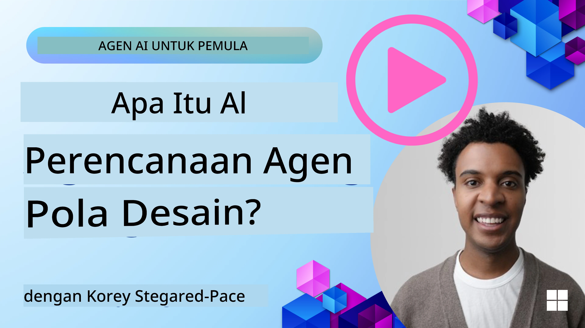
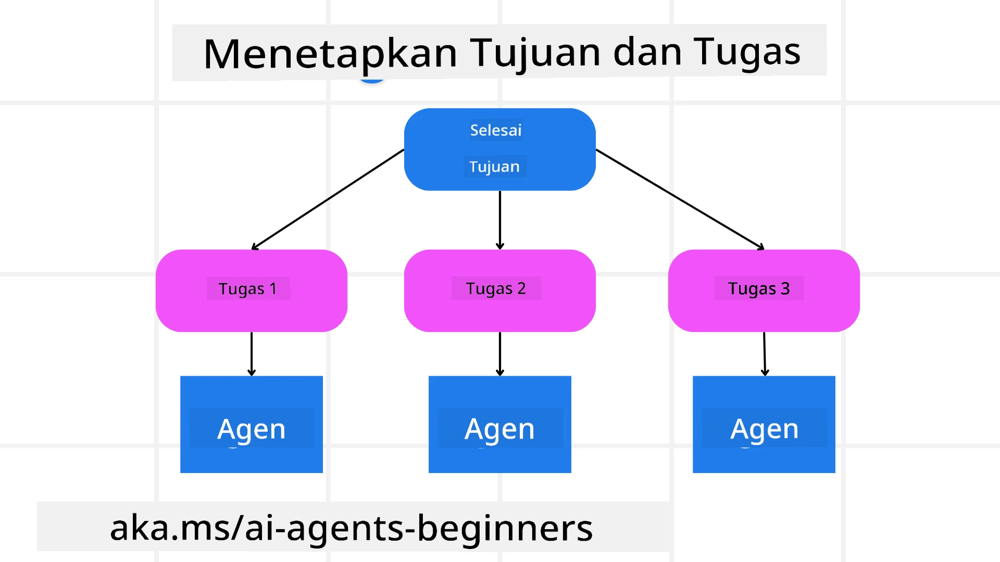

<!--
CO_OP_TRANSLATOR_METADATA:
{
  "original_hash": "43069833a0412210ad5c3cc93d9c2146",
  "translation_date": "2025-09-18T15:18:47+00:00",
  "source_file": "07-planning-design/README.md",
  "language_code": "id"
}
-->

> _(Klik gambar di atas untuk menonton video pelajaran ini)_

# Perencanaan Desain

## Pendahuluan

Pelajaran ini akan membahas:

* Mendefinisikan tujuan keseluruhan yang jelas dan memecah tugas kompleks menjadi tugas yang dapat dikelola.
* Memanfaatkan output terstruktur untuk respons yang lebih andal dan dapat dibaca oleh mesin.
* Menerapkan pendekatan berbasis peristiwa untuk menangani tugas dinamis dan masukan yang tidak terduga.

## Tujuan Pembelajaran

Setelah menyelesaikan pelajaran ini, Anda akan memahami tentang:

* Mengidentifikasi dan menetapkan tujuan keseluruhan untuk agen AI, memastikan agen tersebut tahu dengan jelas apa yang harus dicapai.
* Memecah tugas kompleks menjadi subtugas yang dapat dikelola dan mengorganisasikannya ke dalam urutan yang logis.
* Membekali agen dengan alat yang tepat (misalnya, alat pencarian atau analitik data), memutuskan kapan dan bagaimana alat tersebut digunakan, serta menangani situasi tak terduga yang muncul.
* Mengevaluasi hasil subtugas, mengukur kinerja, dan mengulangi tindakan untuk meningkatkan output akhir.

## Mendefinisikan Tujuan Keseluruhan dan Memecah Tugas

Sebagian besar tugas di dunia nyata terlalu kompleks untuk diselesaikan dalam satu langkah. Agen AI membutuhkan tujuan yang ringkas untuk memandu perencanaan dan tindakannya. Sebagai contoh, pertimbangkan tujuan:

    "Buat rencana perjalanan selama 3 hari."

Meskipun sederhana untuk dinyatakan, tujuan ini masih membutuhkan penyempurnaan. Semakin jelas tujuannya, semakin baik agen (dan kolaborator manusia) dapat fokus untuk mencapai hasil yang tepat, seperti membuat rencana perjalanan yang komprehensif dengan opsi penerbangan, rekomendasi hotel, dan saran aktivitas.

### Pemecahan Tugas

Tugas besar atau rumit menjadi lebih mudah dikelola ketika dipecah menjadi subtugas kecil yang berorientasi pada tujuan.
Untuk contoh rencana perjalanan, Anda dapat memecah tujuan menjadi:

* Pemesanan Penerbangan
* Pemesanan Hotel
* Penyewaan Mobil
* Personalisasi

Setiap subtugas kemudian dapat ditangani oleh agen atau proses khusus. Satu agen mungkin mengkhususkan diri dalam mencari penawaran penerbangan terbaik, agen lain fokus pada pemesanan hotel, dan seterusnya. Agen pengoordinasi atau agen "downstream" kemudian dapat menggabungkan hasil ini menjadi satu rencana perjalanan yang kohesif untuk pengguna akhir.

Pendekatan modular ini juga memungkinkan peningkatan secara bertahap. Misalnya, Anda dapat menambahkan agen khusus untuk Rekomendasi Makanan atau Saran Aktivitas Lokal dan menyempurnakan rencana perjalanan dari waktu ke waktu.

### Output Terstruktur

Model Bahasa Besar (LLM) dapat menghasilkan output terstruktur (misalnya JSON) yang lebih mudah untuk diproses oleh agen atau layanan downstream. Hal ini sangat berguna dalam konteks multi-agen, di mana kita dapat menjalankan tugas-tugas ini setelah output perencanaan diterima. Untuk gambaran singkat, lihat

---

**Penafian**:  
Dokumen ini telah diterjemahkan menggunakan layanan penerjemahan AI [Co-op Translator](https://github.com/Azure/co-op-translator). Meskipun kami berusaha untuk memberikan hasil yang akurat, harap diketahui bahwa terjemahan otomatis mungkin mengandung kesalahan atau ketidakakuratan. Dokumen asli dalam bahasa aslinya harus dianggap sebagai sumber yang otoritatif. Untuk informasi yang bersifat kritis, disarankan menggunakan jasa penerjemahan profesional oleh manusia. Kami tidak bertanggung jawab atas kesalahpahaman atau penafsiran yang keliru yang timbul dari penggunaan terjemahan ini.