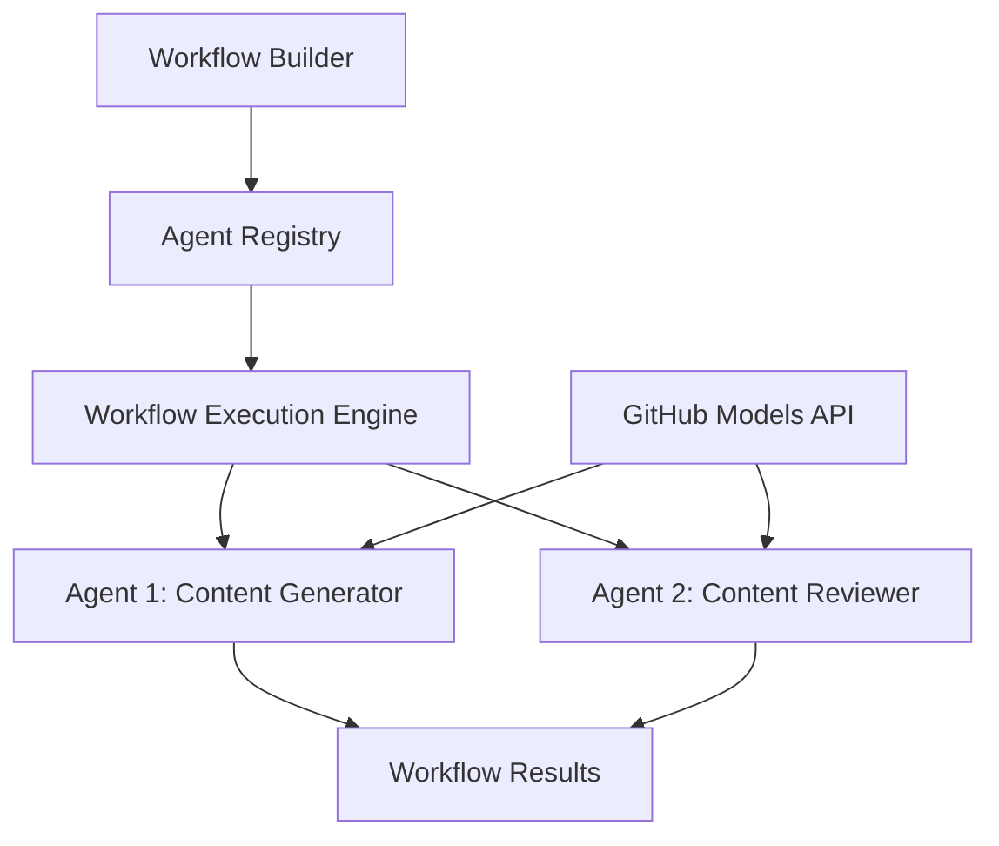

<!--
CO_OP_TRANSLATOR_METADATA:
{
  "original_hash": "034158688d0a45aae06dcbb21b0da5ae",
  "translation_date": "2025-11-11T12:54:26+00:00",
  "source_file": "08-multi-agent/code_samples/workflows-agent-framework/dotNET/01.dotnet-agent-framework-workflow-ghmodel-basic.md",
  "language_code": "id"
}
-->
# 🔄 Alur Kerja Dasar Agen dengan Model GitHub (.NET)

## 📋 Tutorial Orkestrasi Alur Kerja

Notebook ini menunjukkan cara membangun **alur kerja agen** yang canggih menggunakan Microsoft Agent Framework untuk .NET dan Model GitHub. Anda akan belajar membuat proses bisnis multi-langkah di mana agen AI berkolaborasi untuk menyelesaikan tugas-tugas kompleks melalui pola orkestrasi yang terstruktur.

## 🎯 Tujuan Pembelajaran

### 🏗️ **Dasar-Dasar Arsitektur Alur Kerja**
- **Workflow Builder**: Merancang dan mengorkestrasi proses AI multi-langkah yang kompleks
- **Koordinasi Agen**: Mengkoordinasikan beberapa agen khusus dalam alur kerja
- **Integrasi Model GitHub**: Memanfaatkan layanan inferensi model AI GitHub dalam alur kerja
- **Desain Visual Alur Kerja**: Membuat dan memvisualisasikan struktur alur kerja untuk pemahaman yang lebih baik

### 🔄 **Pola Orkestrasi Proses**
- **Pemrosesan Berurutan**: Menghubungkan beberapa tugas agen dalam urutan logis
- **Manajemen Status**: Mempertahankan konteks dan aliran data di seluruh tahap alur kerja
- **Penanganan Kesalahan**: Menerapkan pemulihan kesalahan yang kuat dan ketahanan alur kerja
- **Optimasi Kinerja**: Merancang alur kerja yang efisien untuk operasi skala perusahaan

### 🏢 **Aplikasi Alur Kerja Perusahaan**
- **Otomasi Proses Bisnis**: Mengotomasi alur kerja organisasi yang kompleks
- **Pipeline Produksi Konten**: Alur kerja editorial dengan tahap tinjauan dan persetujuan
- **Otomasi Layanan Pelanggan**: Resolusi pertanyaan pelanggan multi-langkah
- **Alur Kerja Pemrosesan Data**: Alur kerja ETL dengan transformasi berbasis AI

## ⚙️ Prasyarat & Pengaturan

### 📦 **Paket NuGet yang Diperlukan**

Demonstrasi alur kerja ini menggunakan beberapa paket .NET utama:

```xml
<!-- Core AI Framework -->
<PackageReference Include="Microsoft.Extensions.AI" Version="9.9.0" />

<!-- Agent Framework (Local Development) -->
<!-- Microsoft.Agents.AI.dll - Core agent abstractions -->
<!-- Microsoft.Agents.AI.OpenAI.dll - OpenAI/GitHub Models integration -->

<!-- Configuration and Environment -->
<PackageReference Include="DotNetEnv" Version="3.1.1" />
```

### 🔑 **Konfigurasi Model GitHub**

**Pengaturan Lingkungan (file .env):**
```env
GITHUB_TOKEN=your_github_personal_access_token
GITHUB_ENDPOINT=https://models.inference.ai.azure.com
GITHUB_MODEL_ID=gpt-4o-mini
```

**Akses Model GitHub:**
1. Daftar untuk Model GitHub (saat ini dalam pratinjau)
2. Buat token akses pribadi dengan izin akses model
3. Konfigurasikan variabel lingkungan seperti yang ditunjukkan di atas

### 🏗️ **Ikhtisar Arsitektur Alur Kerja**



**Komponen Utama:**
- **WorkflowBuilder**: Mesin orkestrasi utama untuk merancang alur kerja
- **AIAgent**: Agen khusus individu dengan kemampuan tertentu
- **GitHub Models Client**: Integrasi layanan inferensi model AI
- **Execution Context**: Mengelola status dan aliran data antar tahap alur kerja

## 🎨 **Pola Desain Alur Kerja Perusahaan**

### 📝 **Alur Kerja Produksi Konten**
```
User Request → Content Generation → Quality Review → Final Output
```

### 🔍 **Pipeline Pemrosesan Dokumen**
```
Document Input → Analysis → Extraction → Validation → Structured Output
```

### 💼 **Alur Kerja Intelijen Bisnis**
```
Data Collection → Processing → Analysis → Report Generation → Distribution
```

### 🤝 **Otomasi Layanan Pelanggan**
```
Customer Inquiry → Classification → Processing → Response Generation → Follow-up
```

## 🏢 **Manfaat Perusahaan**

### 🎯 **Keandalan & Skalabilitas**
- **Eksekusi Deterministik**: Hasil alur kerja yang konsisten dan dapat diulang
- **Pemulihan Kesalahan**: Penanganan kegagalan yang elegan di setiap tahap alur kerja
- **Pemantauan Kinerja**: Melacak metrik eksekusi dan peluang optimasi
- **Manajemen Sumber Daya**: Alokasi dan pemanfaatan sumber daya model AI yang efisien

### 🔒 **Keamanan & Kepatuhan**
- **Otentikasi Aman**: Otentikasi berbasis token GitHub untuk akses API
- **Jejak Audit**: Pencatatan lengkap eksekusi alur kerja dan titik keputusan
- **Kontrol Akses**: Izin granular untuk eksekusi dan pemantauan alur kerja
- **Privasi Data**: Penanganan informasi sensitif yang aman di seluruh alur kerja

### 📊 **Observabilitas & Manajemen**
- **Desain Visual Alur Kerja**: Representasi yang jelas dari aliran proses dan ketergantungan
- **Pemantauan Eksekusi**: Pelacakan waktu nyata dari kemajuan dan kinerja alur kerja
- **Pelaporan Kesalahan**: Analisis kesalahan yang mendetail dan kemampuan debugging
- **Analitik Kinerja**: Metrik untuk optimasi dan perencanaan kapasitas

Mari bangun alur kerja AI siap perusahaan pertama Anda! 🚀

## 💻 Menjalankan Kode

Implementasi lengkap tersedia di `01.dotnet-agent-framework-workflow-ghmodel-basic.cs`. File ini menunjukkan:

1. **Konfigurasi Lingkungan** - Memuat kredensial Model GitHub dari file `.env`
2. **Pengaturan Klien OpenAI** - Mengonfigurasi klien untuk menggunakan endpoint Model GitHub
3. **Pembuatan Agen** - Mendefinisikan agen khusus (Front Desk dan Concierge)
4. **Workflow Builder** - Membuat alur kerja multi-agen dengan pemrosesan berurutan
5. **Eksekusi Alur Kerja** - Menjalankan alur kerja dengan hasil streaming

### 🚀 Menjalankan Contoh

```bash
# Make the script executable (Unix/Linux/macOS)
chmod +x 01.dotnet-agent-framework-workflow-ghmodel-basic.cs

# Run the workflow
./01.dotnet-agent-framework-workflow-ghmodel-basic.cs
```

Atau di Windows:
```powershell
dotnet run 01.dotnet-agent-framework-workflow-ghmodel-basic.cs
```

### 📝 Output yang Diharapkan

Alur kerja akan:
1. Menerima permintaan tujuan perjalanan Anda ("Saya ingin pergi ke Paris")
2. Agen Front Desk memberikan rekomendasi awal
3. Agen Concierge meninjau dan menyempurnakan rekomendasi
4. Output akhir menampilkan aliran percakapan lengkap

### 🔧 Kustomisasi

Anda dapat menyesuaikan alur kerja dengan:
- Memodifikasi instruksi agen untuk mengubah perilaku mereka
- Menambahkan lebih banyak agen untuk membuat alur kerja multi-langkah yang kompleks
- Mengubah pesan pengguna untuk menguji berbagai skenario
- Menyesuaikan tepi alur kerja untuk membuat pola eksekusi yang berbeda

---

<!-- CO-OP TRANSLATOR DISCLAIMER START -->
**Penafian**:  
Dokumen ini telah diterjemahkan menggunakan layanan penerjemahan AI [Co-op Translator](https://github.com/Azure/co-op-translator). Meskipun kami berupaya untuk memberikan hasil yang akurat, harap diketahui bahwa terjemahan otomatis mungkin mengandung kesalahan atau ketidakakuratan. Dokumen asli dalam bahasa aslinya harus dianggap sebagai sumber yang otoritatif. Untuk informasi yang penting, disarankan menggunakan jasa penerjemahan manusia profesional. Kami tidak bertanggung jawab atas kesalahpahaman atau penafsiran yang timbul dari penggunaan terjemahan ini.
<!-- CO-OP TRANSLATOR DISCLAIMER END -->